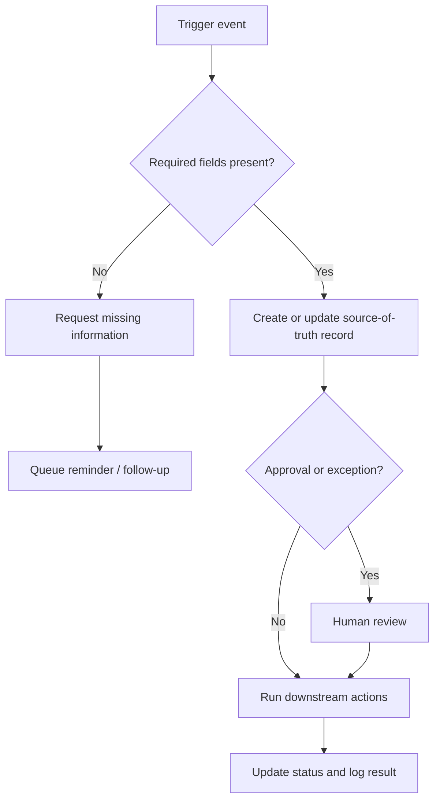

# Process Builder

Process Builder is a local-first browser app for documenting, improving, and systematizing recurring small-business workflows. It now includes two modes: **Process Builder** for SOP/process documents and **Automation Builder** for scoping implementation-ready automation plans. It is intended for consultants, service providers, and owner-led businesses that need a practical process document after a client conversation or internal operations review.

The Process Builder mode turns a rough plain-English process description into an editable, client-ready process document with SOP steps, roles, handoffs, required inputs and outputs, quality control checks, common failure points, automation opportunities, and an internal checklist.

The Automation Builder mode uses guided questions to create an editable automation blueprint, implementation checklist, client-facing summary, recommended tool stack, complexity/impact scoring, manual fallback, and Mermaid flowchart. It is a planning/scoping tool only; it does not connect to or run automations in outside systems.

This version is intentionally simple and rule-based. It does **not** use AI, external APIs, a backend, login, a database, or third-party dependencies.

## Who it is for

Process Builder is designed for general small-business operations, including businesses such as:

- Contractors and home service companies
- Landscapers and cleaning companies
- Salons and local service businesses
- Agencies and consultants
- Property managers
- Professional services firms
- Accountants, bookkeepers, and tax firms
- Other owner-led small businesses

Tax and bookkeeping examples are included only as starter templates under broader process categories. They do not define the product.

## Modes

### Process Builder

Use Process Builder when a client or team needs a documented recurring workflow, SOP, internal checklist, handoffs, quality controls, risks, and improvement recommendations.

### Automation Builder

Use Automation Builder when a client or team already understands the workflow and needs a scoped automation plan. It asks guided questions about the trigger, source channel, source of truth, actions, tools, roles, exceptions, review points, data fields, frequency, volume, success metric, and manual fallback. It then creates a rule-based automation plan with all generated sections editable.

## Features

- Create a new process from rough notes.
- Capture process name, optional business/client name, optional industry/business type, category, status, and raw description.
- Generate an editable process document with all required sections:
  - Process summary
  - Objective
  - Trigger event
  - Frequency
  - Required inputs
  - Expected outputs
  - Tools/systems used
  - Roles and responsibilities
  - Step-by-step SOP
  - Decision points
  - Handoffs
  - Quality control checks
  - Common exceptions
  - Risks or failure points
  - Client/customer/vendor communication points
  - Internal checklist
  - Automation opportunities
  - Recommended next improvement
- Edit every generated process section.
- Manage internal checklist items:
  - Add checklist item
  - Edit checklist item
  - Mark complete or incomplete
  - Delete checklist item
  - Add notes to a checklist item
- Save process documents in browser local storage.
- Reopen saved processes from the process library.
- Change process status from the library or editor.
- Duplicate and delete saved processes.
- Export a full client-ready process document as Markdown.
- Export the internal checklist only as Markdown.
- Copy full Markdown or checklist Markdown to the clipboard.
- Export all saved processes as a JSON backup.
- Import a JSON backup.
- See visible user-facing messages for common errors such as missing required process name, invalid category, local storage load/save failures, and invalid backup imports.
- Switch to Automation Builder to generate automation blueprints from guided inputs instead of a blank textarea.
- Generate Automation Builder sections for trigger, required inputs, source of truth, systems, roles, automation flow, exception rules, human review points, data fields, tool stack, complexity, impact, first-version scope, manual fallback, implementation checklist, client-facing summary, next best automation, and Mermaid flowchart.
- Export/copy full automation plans or checklist-only Markdown.
- Export/import automation plans as a separate JSON backup.

## Process categories

The app uses general small-business categories:

- Client/customer onboarding
- Customer follow-up
- Billing and collections
- Monthly admin
- Field/service operations
- Employee onboarding
- Vendor management
- Document collection
- Sales pipeline
- Quality control
- Reporting
- Finance/bookkeeping
- Professional services
- Custom process

## Starter templates

The app includes general starter templates so it is useful immediately:

- New customer onboarding
- Customer estimate follow-up
- Invoice collection follow-up
- Monthly admin close
- Employee onboarding
- Vendor bill approval
- Field service job closeout
- Document collection process
- Sales lead follow-up
- Customer complaint resolution
- Monthly bookkeeping close
- New tax client onboarding

## How generation works

Generation is deterministic and rule-based. The generator uses:

- Selected process category
- Optional industry/business type
- Rough process description
- Keyword matching
- Starter templates and category defaults

Examples of keyword-based suggestions:

- Mentions of invoices, payments, overdue balances, or collections add billing/collections risks and follow-up steps.
- Mentions of customers, leads, estimates, or proposals add sales and customer follow-up handoffs.
- Mentions of field work, crews, jobs, photos, or service calls add field/service controls.
- Mentions of documents, forms, signatures, or missing information add document collection controls.
- Mentions of reports, spreadsheets, dashboards, or monthly tasks add reporting/monthly admin checks.
- Mentions of QuickBooks, bank statements, receipts, payroll, or reconciliation add finance/bookkeeping controls.
- Mentions of approvals, managers, owners, vendors, or bills add approval and handoff checkpoints.

The goal is not perfect intelligence. The output is a useful first draft that a human should review and clean up.

## Automation tool-stack reference

These recommendations are static, deterministic planning guidance and not vendor integrations.

| Stack | Best fit | Strengths | Tradeoffs |
|---|---|---|---|
| Zapier | Broad app-to-app handoffs with lighter branching | Large app ecosystem, simple trigger/action mental model, useful for notifications and record handoffs | Not ideal for deeply exception-heavy workflows |
| Make | Multi-branch workflows with fallback/error paths | Strong routing, scenario design, and recovery planning | More implementation-heavy for simple workflows |
| Google Forms + Sheets | Low-cost intake and simple team-owned tracking | Easy forms, linked Sheets, Drive storage, and lightweight notifications | Review/approval UX may need more structure |
| Airtable | Record-centric workflows needing forms, filtering, review, and approvals | Strong source-of-truth, forms, views, and review queues | Cross-app automations may still need Zapier or Make |

Reusable Mermaid template:



See `examples/automation-blueprints.md` for six concrete sample outputs.

## Setup and run instructions

No install step, server, backend, API, or database is required for normal use.

### Normal use: open the file directly

Open `index.html` directly in a browser by double-clicking it or using **File > Open**. The checked-in `app.bundle.js` file is a browser-safe non-module bundle, so the app works from `file://` without a local development server.

### Optional developer preview server

A local static server is optional and only useful for development previewing.

```bash
python3 -m http.server 4173
```

Then open <http://localhost:4173>.

## Usage

1. Click **New process** or choose a starter template.
2. Enter a process name.
3. Optionally enter business/client name and industry/business type.
4. Choose a process category and status.
5. Paste the rough process description.
6. Click **Generate Process Document**.
7. Edit the generated sections and checklist items.
8. Save, duplicate, delete, export, copy, or back up the process as needed.

## Export and backup

- **Export process Markdown** downloads the full process document for client-ready or internal deliverables.
- **Copy full Markdown** copies the full process document to the clipboard when supported by the browser.
- **Export checklist** downloads only the internal checklist for operational use.
- **Copy checklist** copies only the internal checklist to the clipboard when supported by the browser.
- **Export JSON backup** downloads all saved process documents for safekeeping or transfer.
- **Import JSON backup** replaces the current browser library only after validating every imported process, required section, checklist item, category, and status.
- **Export automation Markdown** downloads the full automation blueprint with metadata, all sections, implementation checklist, and Mermaid flowchart.
- **Export automation checklist** downloads only the implementation checklist.
- **Export automation JSON** and **Import automation JSON** back up and restore Automation Builder plans separately from Process Builder documents.

## Data storage and limitations

Processes are stored only in the current browser's local storage under the key `process-builder-processes-v2`. Automation plans are stored separately under `process-builder-automation-plans-v1`. Data stays on the user's machine and is not transmitted anywhere by the app.

Local storage is browser- and device-specific. It can be cleared by browser cleanup, private browsing sessions, profile resets, or device changes. Export a JSON backup regularly, especially before clearing browser data or switching devices.

## Development notes

- `index.html` contains the app shell and templates.
- `styles.css` contains the responsive business-professional UI styles.
- `processGenerator.js` contains process categories, starter templates, keyword rules, validation, checklist helpers, and rule-based generation.
- `markdownExport.js` contains Markdown export and JSON backup parsing logic.
- `processStorage.js` contains process local-storage save/load helpers.
- `automationGenerator.js` contains Automation Builder categories, starter templates, scoring, exception rules, checklist helpers, and rule-based generation.
- `automationExport.js` contains Automation Builder Markdown export and JSON backup parsing logic.
- `automationStorage.js` contains automation local-storage save/load helpers.
- `app.js` contains browser DOM and UI event handling for both modes.
- `app.bundle.js` is the generated non-module browser bundle used by `index.html` for direct-file compatibility.
- `scripts/build-bundle.js` regenerates `app.bundle.js` from the source files without a heavy build system.
- `tests/process-builder.test.js` contains Node test coverage for generation, validation, checklist behavior, Markdown, duplication, storage, backup import/export, and direct-file entry safety.

## Optional development commands

Tests are optional for development only; normal users do not need npm.

```bash
npm test
```

Regenerate the checked-in browser bundle after editing source files:

```bash
npm run build
```

Syntax and bundle checks:

```bash
npm run check
```
