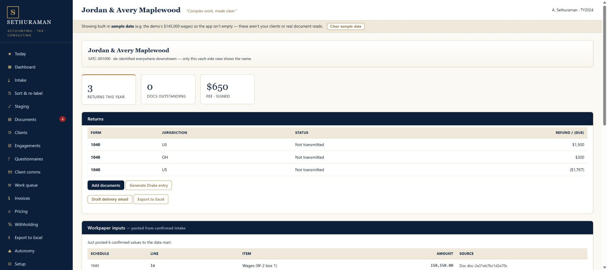
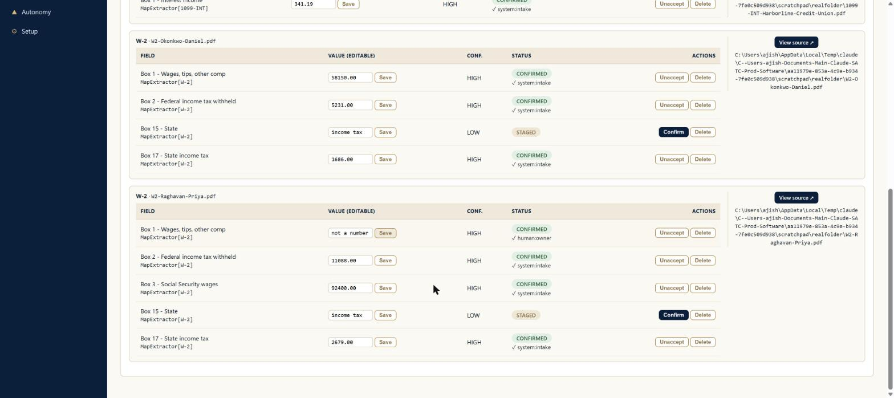
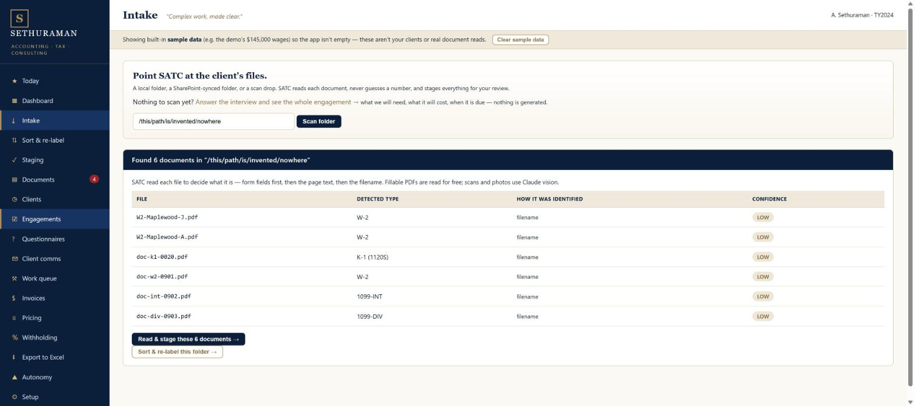
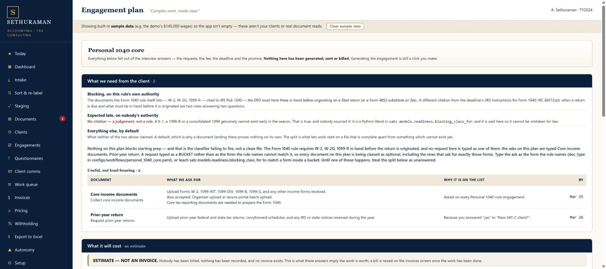
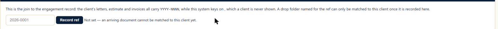
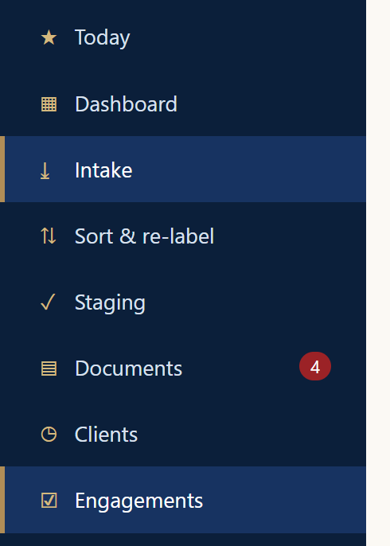
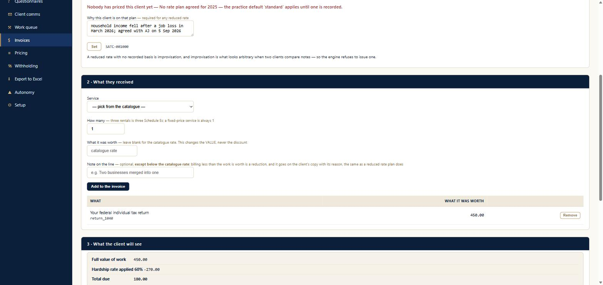

# Walkthrough defects — SATC front to back, 5 September 2026

**What was walked.** The desk (`satc_system`) and the engagement browser
(`client-documents`), through Chrome, on branch `walk/2026-09-05` — `main` with
#262 (the join + principal), #263 (the gated second door) and #267 (one price
via the ref) merged in, because those three are the product the firm intends
rather than the one that happens to be merged.

**Isolation.** Both apps were launched against scratch stores (`SATC_DATA_DIR`,
`SATC_ENGAGEMENTS`) in the session scratchpad. Every client, figure and document
named in this walk is invented. **This checkout holds no live client data** —
`client-documents/engagements/` and `leads.xlsx` are absent here, both
gitignored. Two of the firm's own app instances were already running on ports
5050 and 5051 against the real stores; neither was touched. The walk ran on
ports 57986 and 5061.

## The denominator

| Suite | Result | Caught any of these |
|---|---|---|
| `satc_system` | **1,779 passed, 13 skipped, 0 failed** (215s) | none |
| `client-documents` | **1,468 passed, 2 skipped, 0 failed** (499s) | none |
| **Total** | **3,247 passing, 15 skipped, 0 failing** | **none of the below** |

Both suites were run on the walk branch, in this checkout, before the walk
started. Every defect below was found by clicking, and not one of the 3,247
tests is red because of any of them.

---

# The defects

Ranked by what each would cost a real client.

## D1 · Documents post to whichever client the app was last looking at

**CRITICAL.** Intake's folder scan never asks whose documents these are, and
`Post confirmed → workpaper & data mart` writes them to a client the preparer
never chose.

*What I did.* Pointed intake at a folder holding two invented W-2s (Priya
Raghavan, 92,400 and Daniel Okonkwo, 58,150), a 1099-INT, a 1099-DIV and a 1098.
Read and staged them — 12 fields, correctly extracted. Pressed **Post 10
confirmed → workpaper & data mart**.

*What the screen said.* It redirected to **Jordan & Avery Maplewood**
(SATC-001000, a demo client I had never opened) and reported *"Just posted 6
confirmed values to the data mart."*

*What was actually true.* Those six values are mine. `Wages (W-2 box 1)
150,550.00` is exactly 92,400 + 58,150; withholding `16,319.00` is 11,088 +
5,231; interest `341.19`, dividends `1,118.02` and `1,204.55`, and `SCH_A 5a
4,365.00` = 2,679 + 1,686. Two invented people's wages are now on a third
party's Form 1040 workpaper, sourced and attributed as though they belonged
there.

*The root cause,* found afterwards in one line — `satc_system/src/satc/app/state.py:363`:

```python
def run_intake(self, folder: str, *, client_id: str = "SATC-001000",
               tax_year: int = 2024) -> dict:
```

It is not "the client the app was last looking at". It is a **hardcoded demo
client id**. The scan path never passes one, so every document any preparer ever
scans through `/intake` is posted to `SATC-001000` — whoever that turns out to
be. On a fresh install that is the demo client; after clearing the sample data
it is **the first real client the practice creates**, because ids restart (see
D11).

*The fix.* Intake's scan path must carry a client the way `/intake/new` and
`/intake/plan` already do — both of those open with *"Pick a client"*. The nav's
**Intake** link points at the one screen of the three that does not ask. Until
it does, `run_intake` should require `client_id` rather than default it, and the
post should refuse rather than fall back.

## D1b · …and to tax year 2024, whatever the document says

**CRITICAL**, same line. `tax_year: int = 2024` is defaulted the same way.
Every PDF I scanned is a **2025** form — `Form W-2 … 2025`, `Form 1099-INT …
2025` — and every figure landed in **tax year 2024**. Nothing on any screen
reads the year off the document, and nothing asks. A practice using this in
filing season posts the year's documents into the prior year's workpaper, in
silence.



## D2 · A correction that is not a number is silently thrown away

**CRITICAL.** The preparer's confirmed value is discarded and the machine's
original read is posted in its place, while the screen goes on showing the
correction as `CONFIRMED · human:owner`.

Reproduced twice, deterministically:

| Box 1 on screen | Status shown | Wages posted to the workpaper |
|---|---|---|
| `90000.00` | CONFIRMED · human:owner | **148,150.00** (58,150 + 90,000) — the edit was used |
| `not a number` | CONFIRMED · human:owner | **150,550.00** (58,150 + **92,400**) — the edit was **not** used |

A preparer who corrects a W-2 wage and fat-fingers it does not get an error.
They get a screen saying their value is confirmed, and a workpaper carrying the
number they meant to replace. This is the worst shape a data defect can take:
the record and the display disagree, and the display is the reassuring one.

## D3 · Money fields accept arbitrary text, and keep the machine's HIGH badge

**HIGH.** Typing `not a number` into *Box 1 — Wages, tips, other comp* and
pressing **Save** is accepted without complaint. The row then reads `not a
number` / **HIGH** confidence / **CONFIRMED**. The HIGH badge was the machine's
verdict on the value it read; it stays put beside a value a human typed,
describing something no longer on the row.



## D4 · A folder that does not exist returns six documents

**HIGH.** `/intake` → **Scan folder** on a path that is not on the disk gives a
confident, itemised, wrong answer instead of saying the folder is missing.

*What I did.* Typed `/this/path/is/invented/nowhere` and pressed **Scan folder**.

*What the screen said.* *"Found 6 documents in
"/this/path/is/invented/nowhere""* — a table of six files
(`W2-Maplewood-J.pdf`, `doc-k1-0020.pdf`, …) with detected types, a *how it was
identified* column reading "filename", confidence badges, and a **Read & stage
these 6 documents →** button.

*What was actually true.* Neither `/Clients` nor that path exists on this
machine. **Any** string returns the same six. Pointed at a folder that does
exist, the scanner is correct and good — it found my five real files, typed them
from their text, and rated them HIGH — which is what makes the fallback
dangerous rather than merely cosmetic: the two results are indistinguishable on
screen.

*Corroborating.* The very next screen is honest about it. Staging reported
*"Read 0 fields from 0 documents in "/this/path/is/invented/nowhere"."* The scan
preview and the read disagree, and the preview is the one with the button on it.



## D5 · "Pick a client first" — on a screen with no way to pick a client

**HIGH.** `/intake/plan` opens with *"Pick a client first — a plan is for
somebody, and the rate plan and the filing history are read off them."* The page
below it is a list of three workflows with **Plan it →** buttons. There is no
client control anywhere on it.

Pressing **Plan it →** produces a correct and well-written refusal — *"SATC will
not plan this engagement. Set the tax year."* — which names the missing **year**
and says nothing about the missing **client**. Supply a year in the URL and the
guard is satisfied: the full plan renders for nobody, with document requests
dated `Mar 25` and `Mar 26`, a cost section, statutory and firm-policy
deadlines, and the reason *"Because you answered 'yes' to 'New SAT-C client?'"*
against answers no client ever gave.



## D6 · And then it will generate the engagement anyway

**CRITICAL**, and the consequence of D5. On that clientless plan, **Generate
this engagement →** is live. Pressing it created a real, stored engagement —
`engagement-255234d6a1dfe4a1` — belonging to no one, and opened two document
requests against it. The **Documents** badge in the nav went from **4 to 6**, so
an orphan is now in the practice's outstanding-documents count.

The engagement screen shows the hole in its own sentence:

> "the client's letters, estimate and invoices all carry YYYY-NNNN, while this
> system keys on **, which** a client is never shown."

The client key interpolates as empty and the sentence breaks around the gap.
`/engagements` lists the row with an **empty CLIENT column**. Nothing refused,
and nothing warned.



## D7 · Two nav items highlight at once

**LOW**, but it is on every intake screen. On `/intake`, `/intake/new` and
`/intake/plan`, both **Intake** and **Engagements** carry the active background
and the gold left bar. A person cannot tell from the nav which screen they are
on.



## D8 · "Post 10 confirmed" reports "posted 6 confirmed values"

**LOW.** The button promises ten and the result says six, with nothing
explaining the difference. It is not a loss — two W-2s aggregate into shared
1040 lines — but the screen never says so, and the reviewer's question ("which
four did not make it?") has no answer on the page.

## D9 · `Box 15 — State` holds the words "income tax"

**MEDIUM.** Reading `Box 17 State income tax 2,679.00` put the string `income
tax` into **Box 15 — State**, a field whose only legal values are state codes.
It was caught — LOW confidence, left STAGED for review — but it was caught by
*confidence*, not by *validity*: nothing on the row knows a state field cannot
hold a verb phrase. Had the read come back HIGH, "income tax" would have been
auto-confirmed as the state.

## D10 · A missing folder and an empty folder are both reported as nothing at all

**MEDIUM**, and it is the other half of D4. With the sample data cleared — the
state a real practice runs in — pressing **Scan folder** on
`/still/not/a/real/folder` renders the page again with **no result panel and no
error**. Pressing it on a folder that exists and is empty does exactly the same.
So do a click that never registered: I could not tell, from the screen, which of
the three had happened to me, and I was the one who had just pressed the button.

A screen whose answer to "that folder isn't there" is silence teaches the
preparer to press again.

## D11 · The first real client makes the app announce its data is fake — **FIXED, and it was worse than the banner**

**MEDIUM.** After clearing the sample data — banner gone, panel gone — I created
the practice's first real client. The banner came straight back, and now sits
above a real person:

> *Showing built-in **sample data** (e.g. the demo's $145,000 wages) so the app
> isn't empty — these aren't your clients or real document reads.*
> **Priya Raghavan is set up — how do you want to start?**

*Why.* `state.py:339`:

```python
def has_sample_data(self) -> bool:
    sample = self._sample_client_ids()
    return any(pc.client_id in sample for pc in self.mart.public_clients)
```

It tests **identity by id**, and ids restart after a clear. The first client
created is assigned `SATC-001000`, which is a demo id, so the practice's own
client is detected as sample data for ever. The banner then invites them to
press **Clear sample data**, which is a button that deletes their client.

## D20 · The invoice says no discount is agreed while applying a 60% discount

**CRITICAL.** One screen, two elements, flatly contradicting each other about
money.

*What I did.* On `/invoices/new` for Priya Raghavan, set **Rate plan → Hardship
— 60% off** with no reason and pressed **Set** (correctly not applied — the
screen's own rule is that a reduced rate needs a recorded basis). Then set it
again **with** a reason and pressed **Set**. Added *Individual return (1040)*
from the catalogue.

*What the screen says*, in red, at the top:

> **"Nobody has priced this client yet — No rate plan agreed for 2025 — the
> practice default 'standard' applies until one is recorded."**

*What the same screen says, 600 pixels lower:*

| | |
|---|---|
| Full value of work | 450.00 |
| **Hardship rate applied 60%** | **-270.00** |
| **Total due** | **180.00** |

The plan **was** recorded. The message never re-reads it — it is still there
after a fresh `GET /invoices/new`, so this is not a stale POST render. A
preparer who reads the warning and trusts it believes they are billing $450 and
is in fact billing $180.

It also means the refusal in the no-reason case is invisible: the message before
and after a *rejected* Set is identical to the message after an *accepted* one,
so the screen never tells you which happened. Compare the engagement-ref control
on the same build, which refuses beautifully — *"That ref was not recorded —
'banana' is not an engagement ref…"*. This control has no such voice.



## D24 · "Load client" does not load the one field it promises to load

**HIGH**, because filing status drives the brackets and the standard deduction.

The Withholding estimator's first panel says:

> *"Prefill the stable household info — **filing status** — from an existing
> client."*

Filing status is the only field it names. I selected **Priya Raghavan** and
pressed **Load client**. The Household panel stayed on **Single**.

Priya's record holds the right answer. Read straight out of the store:

```
CLIENT SATC-001000
  filing_status: 'Married filing jointly'
```

So the interview captured it correctly and stored it correctly — this is purely
the prefill failing to apply it. The cost is not cosmetic: run as **Single**, the
estimate uses a **$15,000** standard deduction and the single brackets; Priya is
**MFJ** and entitled to **$30,000** and the joint brackets. The recommendation
handed to the client would be wrong by a wide margin, and every figure on the
screen would still tie out internally — because the arithmetic is right and only
the input is wrong.

Two smaller things on the same screen:

- **Filing status defaults to `Single` with no unset state**, the same shape as
  D13. Since the prefill silently fails, the default is what most estimates will
  actually run on.
- **`Employer / job name` is left empty** after a paystub is read, though the
  layout is saved *per employer* and the panel says *"future this employer
  paystubs will fill in automatically."* Nothing on screen shows which employer
  the layout was filed under.

## D22 · An overpayment is on the client's copy and on none of the firm's screens

**MEDIUM.** Invoice 2026-0001 was raised at **180.00**. I recorded a part payment
of **100.00** — handled perfectly, *"Paid to date 100.00 — computed from the
payment ledger. Still outstanding **80.00**."* I then recorded **500.00**
against that 80.00 balance.

The firm's own screens then read:

| `/invoices/2026-0001` | |
|---|---|
| Amount due | 180.00 |
| **Paid to date** | **600.00** |
| Still outstanding | **0.00** |
| Due | 2026-10-05 · **paid 2026-09-05** |

`Still outstanding` is floored at zero — 180 − 600 renders `0.00` rather than a
credit — and `/payments` lists both amounts, attributed, with no note that they
exceed the bill. Nothing refused the entry and nothing warned.

**I wrote this up wrongly twice, and each time it was a screen I had not opened
that corrected me.** Recording both, because the pattern is the point.

*First I wrote "every screen says settled."* Then I opened
`/invoices/2026-0001/print` — the document the **client** reads — which says it
plainly, in green:

> **"Received 600.00 — 420.00 more than was due. We'll be in touch about the
> difference."**

*So I rewrote it as "stated to the client, withheld from the preparer — nothing
on `/today`, `/work` or `/payments` carries it."* That was an assertion about
`/today` made from having seen `/today` **earlier in the walk, before the
overpayment existed.** Opening it afterwards shows, under **Coming up**:

> **$420.00 overpaid on invoice 2026-0001**
> *"$600.00 has arrived against invoice 2026-0001, which was for $180.00 —
> $420.00 more than was billed. **The invoice is settled, so nothing else here
> mentions it.** Refund it or hold it against the next bill; the client is owed
> the conversation either way."* — with **Open invoice →**.

The product had already thought this through, down to naming the exact gap I
thought I had found. **This is a strength, not a defect**, and it is one of the
best pieces of work in the build.

**What actually remains is small.** On `/invoices/2026-0001` the figure reads
`Still outstanding 0.00`, floored, with no mention of the credit; `/payments`
lists both amounts with no note that they exceed the bill. Someone who opens the
invoice rather than the worklist sees a clean settled bill. Repeating the Today
sentence on those two screens would close it — and nothing is lost today,
because the worklist is where the firm actually works.

**The lesson for me, not for the code:** I twice wrote a confident sentence about
a screen I had not opened *in the state I was describing*. Behaviour 11 is "open
the artifact", and looking at `/today` an hour earlier is not looking at it.

## D23 · The payment screen points at Invoicer, which the firm retired

**LOW.** The Money in panel closes with:

> *"SATC records that the money arrived; it does not take it. Nothing here
> charges a card, sends a request or moves a balance — **collection lives in
> Invoicer**, and this machine holds the identity vault and stays off the public
> network."*

The division of duties is right and worth keeping. The name is not: **Invoicer
was retired by the firm's own docket decision.** Whatever collection is called
now, this sentence sends the reader to a product that no longer exists.

## D21 · The invoice bills the 1040 from the catalogue that #267 said does not price it

**HIGH**, and it is the seam #267 was about.

The **plan** screen, for this same service, says:

> *"Your federal individual tax return — priced by
> `client-documents/registry/fee-schedule.yaml`, **not by this catalogue** — the
> engagement carries the figure"*, filed under **"Not in the total — not priced
> yet"**.

The **invoice** screen, for this same service, offers
`Individual return (1040) · 450.00` in its catalogue dropdown, and billed it:

> `Your federal individual tax return · return_1040 · 450.00`

And the **Prices** screen offers to edit that 450.00 in a box, stating that
doing so *"edits the YAML file itself"* — naming both
`configs/billing/services.yaml` **and** `configs/billing/rate_plans.yaml`, the
file #267's own header calls **"RETIRED, NOT DELETED; never reachable."** It is
reachable: the six rate plans are the dropdown in D20, on the screen that bills.

So "one price, and it is the one on the client's estimate" holds on the estimate
path and not on the billing path. If the fee schedule and the catalogue ever
disagree, the client's estimate and the client's invoice disagree — and the
invoice is the one with the money on it.

*This is not a claim that #267 is wrong.* Its retirement covers the quote and
estimate route, and the tests for that route pass. What the walk found is that
two **screens** the retirement did not touch still read the old list.

**And then the two apps produced two different prices for the same client.**
Walking `client-documents` afterwards created engagement **2026-0001** for the
same household, the same 2025 Form 1040, on the same day:

| | Ref 2026-0001 · Priya Raghavan & Daniel Okonkwo |
|---|---|
| **The client's estimate** (`client-documents`) | Simple Filer $100.00 · Extension with a payment estimate $75.00 · Records sorting $175.00 — **TOTAL $350.00** |
| **The firm's invoice** (`satc_system`) | Your federal individual tax return — **$450.00** full value (billed $180.00 after the hardship rate) |

Same ref, same return, **$350 on the estimate and $450 on the invoice**. This is
exactly the condition the firm settled in the docket — *"One price, and it's the
one on the client's estimate"* — and it is still reachable through the screens.
The estimate is also the more considered of the two: it picked the **Simple
Filer** tier, which is the cheap-tier behaviour the firm described (*"we have the
simple filer deal just for you"*) working correctly.

## D25 · A fee below the stated minimum is silently rounded up, not refused

**MEDIUM.** The interview asks *"How much for the sorting? **($175 minimum)**"*.
I answered **100**. It was accepted with no message, and the Review page shows
the stored answer as **100**.

The estimate then reads **Records sorting — $175.00**.

So the minimum is real and is enforced — by quietly overriding the number the
preparer typed. Neither the question, the review, nor the estimate says the
figure was moved. Somebody who deliberately agreed $100 of sorting with a client
will send an estimate saying $175 and have no idea why, and the review page they
checked before sending still says 100.

Refuse it at the keyboard, the way the engagement ref does, or show the
override — but not silence.

## D18 · The button marked "Received" does not record that anything was received — **FIXED, and it was the smaller half**

**HIGH.** The Documents screen exists to keep **two** registers, and says so:

> *"Two registers, because they are two different things: what we **asked for**,
> and what has **arrived**."*

The arrivals register carries its own justification:

> *"How and when a document was obtained, and from whom, is required by 26 CFR
> §1.6695-2(b)(4)(i)(C) — not a nicety."*

I pressed **Received** on Priya's *Core income documents*. The ask flipped to
`satisfied` and the nav badge dropped 4 → 3. **Arrived stayed at 0**, and still
reads *"Nothing has arrived yet."*

So the one button on the screen that means "it came in" closes the first
register and writes nothing to the second — the second being the one the page
says a regulation requires. Nothing asks *how* it arrived, *when*, or *from
whom*, which are precisely the three fields the citation names.

## D26 · Nothing has ever written the arrivals register

**HIGH**, and found while fixing D18 rather than by walking.

D18 said the **Received** button did not write to the arrivals register. Fixing
it turned up the larger fact: `state.py` was the **only** place in `src/` that
constructed a `ReceivedDocument` once the fix was in, and before it there were
none at all. The other two writers are `store.py`'s bulk mart save — which is
fixture seeding — and the store's own loader.

So `Arrived` has only ever contained the six synthetic demo rows. **Intake does
not write one either:** `run_intake` reads a folder, classifies each document,
and `reconcile_received` flips the matching request to satisfied — closing the
first register without ever touching the second. The register the screen says
26 CFR §1.6695-2(b)(4)(i)(C) requires has, in the product's whole history,
recorded no real document.

*Fixed here:* the **Received** button, which now records how, when and from whom.
*Not fixed here:* **intake**. A document read out of a folder genuinely raises a
question the code cannot answer on its own — a scan drop is not self-evidently
"furnished by the client", and guessing is what this codebase refuses to do. It
needs a decision, not a patch.

*And it hid a second defect.* `ReceivedDocument.has_known_provenance` claimed to
say "whether the §1.6695-2 record is actually complete" while checking only
`obtained_how` and `obtained_at` — never `furnished_by` or `channel`. A row with
no idea who supplied a document reported complete provenance and the screen's
`provenance incomplete` flag never fired. It went unnoticed **because every row
came from fixtures, and fixtures fill in every field**: a check whose only inputs
are fixtures has never been asked a real question. Tightened to all three things
the regulation names.

## D19 · "Nothing outstanding" sits directly above five outstanding items

**LOW.** The chase panel's headline reads **"Nothing outstanding."** while the
register beneath it reads **"Asked for · 5 open"**, every row badged
`outstanding`.

The behaviour underneath is right, and the small print explains it — same-day
asks are held back, because *"chasing on the morning you asked is noise, not a
chase."* That is good judgement. The headline is just the wrong sentence for it:
five things **are** outstanding, and none is **due to be chased**. *"Nothing to
chase yet"* would be true; *"Nothing outstanding"* is not.

## D13 · Every interview question defaults to "No", and the file records it as the client's answer

**HIGH**, and the risk questions are the reason.

The Personal 1040 core interview asks thirteen Yes/No questions. **All thirteen
are pre-selected `No`.** There is no third option — no *unknown*, no *not
asked*. A preparer who works down the page and answers the two that came up in
conversation has, without touching them, answered eleven more.

Three of the thirteen are tagged `(risk)` by the product itself:

- Marketplace health insurance coverage? `(risk)`
- Digital asset or crypto activity? `(risk)`
- Foreign accounts or foreign financial assets? `(risk)`

I completed an interview for Priya Raghavan and set exactly two answers. The
printed **Internal checklist** — the sheet that goes in the file — then reads:

> **Marketplace health insurance coverage?** No
> **Digital asset or crypto activity?** No
> **Foreign accounts or foreign financial assets?** No

Priya was never asked. The form answered for her, and the printout presents it
as her answer. Foreign accounts and digital assets are two of the questions
where a wrong "no" carries its own penalty regime.

## D14 · "0 RISK FLAGS" is a green that cannot go red

**HIGH**, and it is D13's consequence. The engagement scoreboard shows **0 RISK
FLAGS**, and the internal checklist prints *"No risk flags generated."*

Risk flags are raised by `Yes` on the three `(risk)` questions. Those three
default to `No`. So on any interview where nobody deliberately ticks a risk box,
the flag count is zero **by construction** — the reassuring number is produced
by the absence of an answer rather than by the presence of a safe one.

Name the input that makes it red: somebody actively choosing `Yes`. Nothing else
can. Until "unknown" exists as an answer, that tile should say *"no risk
questions were answered"* rather than *"0 risk flags"*.

## D15 · The engagement counts 3 tasks and lists none

**LOW.** The scoreboard tile reads **0/3 TASKS COMPLETE**. The panel below it,
headed *"Internal tasks — our side of the work"*, reads **"No internal tasks for
this checklist."** Two elements on one screen, produced by different passes,
disagreeing about whether three things exist, with nothing comparing them.

## D16 · ~~Client-facing documents sign as "SAT-C LLP"~~ — WITHDRAWN

I raised this on the request email (*"SAT-C LLP is preparing your Personal 1040
core checklist"*) because the brand everywhere else is *Sethuraman Accounting ·
Tax · Consulting*, and "LLP" is an assertion about legal form made to clients in
writing.

**Withdrawn on the evidence.** The printed invoice header carries the firm's own
address — `arjun_sethuraman@satcllp.com`. The domain is `satcllp.com`, so the
LLP is the firm's, not the template's invention. Nothing to fix.

What is left is only a consistency question, and a small one: the same practice
appears as **"Sethuraman Accounting, Tax & Consulting"** on the invoice and
**"SAT-C LLP"** in the emails. Worth settling which name faces clients, but it
is a preference, not a defect.

## D17 · A client who said "no crypto" is asked for crypto exports

**LOW.** Priya answered **No** to *"Digital asset or crypto activity?"*. The
generated request reads:

> *"Upload your consolidated brokerage 1099 package, realized gain detail, basis
> support, and crypto exchange transaction exports or CSV files."*

The brokerage ask is a bucket carrying crypto inside it — the exact shape the
product's own plan screen warns about (*"A request typed as a BUCKET rather than
as the form the rule names"*). Harmless here, but it asks a client for something
they have just said they do not have.

## D12 · An SSN of `hello` is accepted without a word — **FIXED**

**MEDIUM.** `/clients/new` took `hello` in the SSN field and created the client.
No format check, no warning, no flag on the record afterwards. The same field is
the one the app elsewhere promises to mask and keep vault-side.

---

# The engagement browser (`client-documents`)

Walked second, on its own scratch store via `--store` (#263's fix, which
announced the path it was given on startup — exactly as intended).

## E1 · Building the signing pack crashes with a 500 — **FIXED**

**CRITICAL.** *"Build the signing pack"* is the primary act of this application,
and one of its two offered options crashes it.

*What I did.* On engagement 2026-0001, ticked **"Also read the prose and tell me
what it notices (nothing here can stop a pack)"** and pressed **Build the pack**.

*What the screen said.* **Internal Server Error.** No explanation, no way back.

*What was actually true* — `client-documents/web.py:2827`:

```
File "client-documents/web.py", line 781, in build_package
    return page("Package", packed_body(ref, record, pack, invoice, ...
File "client-documents/web.py", line 2827, in packed_body
    where = f" &mdash; {esc(f.document)}" if f.document else ""
AttributeError: 'Checked' object has no attribute 'document'
```

`packed_body` assumes every finding it renders has a `.document` attribute. The
prose reader returns `Checked` objects, which do not have one. The documents had
already rendered — about forty seconds of work — and were thrown away by a bug
in the code that *displays* the result.

*Isolated:* with the checkbox clear, the same build succeeds. The option's own
label promises *"nothing here can stop a pack"*. It stops the pack.

## E2 · An out-of-range tax year is refused in complete silence — **FIXED, and the diagnosis was wrong**

**HIGH.** The interview's third question is *"Which tax year?"*. I answered
**`1`** and pressed **Next**. The page re-rendered on the same question, with
`1` still in the box, **no error message of any kind**, and did not advance.

**Corrected on inspection: the page did not re-render, and nothing was refused.**
No request was made at all. The box carried `min=2023 max=2027`, so Chrome's own
constraint validation cancelled the submit before it left the machine. The
engine refuses an out-of-range year correctly and always has — it was never
reached. Verified in the browser, not inferred: after typing `1` and clicking
Next, `input.validationMessage` read *"Value must be greater than or equal to
2023."* and no navigation occurred. Fixed with `novalidate` on the question
form, so every refusal comes from `Interview.answer` — the door the JSON API and
`cli.py --set` also meet.

Compare question 1 on the same screen, which at least says something when left
blank. Here there is nothing to read, so the only available theory is that the
button did not work — and the natural response is to press it again.

## E3 · The "required" message is the raw field name — **FIXED**

**LOW.** Pressing **Next** on question 1 with nothing chosen gives:

> **`federal_form is required`**

That is the internal field id. The question directly above it reads *"Which
federal return?"*. Tenet S35 — write for the person holding the screen — and
this is the one app in the build that is otherwise scrupulous about it.

## E4 · Every document in the signing pack is titled "(template)"

**MEDIUM**, and it reaches the client. All three finished PDFs carry this in
their document metadata — the string a PDF reader shows in its title bar and in
file properties:

| File | `/Title` |
|---|---|
| SAT-C Engagement Letter - Raghavan - 2025.pdf | `SATC — tax preparation engagement letter (template)` |
| SAT-C Fee Estimate - Raghavan - 2025.pdf | `SATC — fee estimate (template)` |
| SAT-C Onboarding Letter - Raghavan - 2025.pdf | `SATC — new client onboarding letter (template)` |

The `<title>` is inherited from the source template and never rewritten at
render time. The **filenames** are exactly right — *"SAT-C Engagement Letter -
Raghavan - 2025"* — so this is the one identifier that was missed. A client
opening the letter they are being asked to sign sees it described as a template,
and none of the three titles names the client or the reference.

*Checked and clean:* the red **PREVIEW — NOT THE COPY THAT GOES TO THE CLIENT**
band appears on the on-screen preview and **does not appear anywhere in the
delivered PDFs.** That separation works.

## E5 · "Put the invoice in too" is offered when there is no invoice to put in — **FIXED**

**LOW.** The package screen offers the checkbox unconditionally. Ticking it on an
engagement with no bill fails the whole build with *"engagement 2026-0001 has no
bill raised yet, so there is nothing to put on an invoice."*

The refusal itself is good — clear, specific, names the ref. The control should
simply not be offered, or should say why it is unavailable. The resulting page
also has no link back.

## E6 · `web.py` emits a SyntaxWarning on every start — **FIXED, and it was worse than a warning**

**LOW.** Every launch prints:

```
client-documents/web.py:2716: SyntaxWarning: invalid escape sequence '\/'
  "'Building — about a minute';});<\/script>")
```

**The original write-up of this one was wrong, and the fix found out why.** It
said the backslash "works — Python leaves it in, which is what the embedded
JavaScript wants". It is not what anything wants. That sequence is how you close
a script tag from inside a JavaScript *string*; this is the tag itself, in HTML
emitted directly.

So the browser never saw a closing tag. It swallowed `</main></body></html>` as
script source, the script failed to parse, and the *"Building — about a minute"*
label it exists to show **has never once appeared** — which matches the walk
exactly: pressing **Build the pack** gave no feedback at all for forty seconds,
and I put that down to the build simply being slow.

A LOW-severity warning turned out to be an unclosed tag and a dead feature.

**Fixed 5 September 2026.** Asserted on the *rendered page* rather than on the
source — the first draft of that test read `web.py` and failed, because the fix's
own comment has to quote the bad sequence in order to explain it. A source check
there polices the prose about the bug rather than the bug.

## What the engagement browser got right

- **The gate is real and it counts honestly.** *"The signing pack is built. 11
  checks, nothing flagged — **1 check had nothing to look at.**"* The skipped
  check is named rather than folded into the pass, which is the whole point of
  `Result.skipped`.
- **Stage → gate → place holds.** The pack is written only after every document
  renders and every check passes, and the refused build left **no partial output
  and no leftover `satc-stage-*` directory** — I checked the filesystem.
- **The pack carries its own assets.** `satc-doc.css` and `doc-page.js` sit
  beside the documents, so the HTML opens correctly anywhere. (This is the fix
  for a real past incident, and it works.)
- **`MANIFEST.json` explains itself:** *"Every document in this pack was rendered
  in one pass from one engagement record, so they cannot disagree about the date,
  the reference, the address or the price."*
- **"Undecided" is a real third answer** on *"Take it on?"* — the thing the desk
  interview is missing (D13).
- **The Documents screen says what each document still needs**, per document:
  *"Still needs amount due; invoice date; invoice number; subtotal before
  credits."* That is a missing-data report a person can act on.
- **Amending is a distinct act.** Reaching a question through **Change** on the
  Review page swaps the buttons to **"Save the change" / "Never mind — nothing to
  change"**, so amending cannot be confused with answering.
- **The letter itself is good.** Plain, well-organised, and it states the things
  that matter: *"An extension gives you more time to file, not more time to
  pay."*

---

# What worked, and worked well

Findings before green, but these were tested rather than assumed:

- **`SATC_DATA_DIR` is honoured end to end.** The Setup screen prints the
  scratch path it was given — W11's fix, visible on a screen.
- **The extractor is good.** Pointed at real files it found all five, typed them
  from their text rather than their names, rated them HIGH, and read every figure
  I had planted exactly — `1,204.55`, `1,118.02`, `341.19`, `92,400.00`,
  `58,150.00`, `2,679.00`, `1,686.00`. The 1098 was deliberately marked *"filed,
  not extracted"*.
- **Provenance is sticky and visible.** Editing a value flipped its source from
  `system:intake` to `human:owner` on the row.
- **Posting is idempotent.** Posting the same staged set twice replaced the
  workpaper figures rather than doubling them.
- **The refusal to guess a date is real.** *"a plausible date would be worse than
  none"* — and it does refuse.
- **The plan screen is unusually honest.** `ESTIMATE — NOT AN INVOICE`, `OUR
  PROMISE — NOT LAW`, `FIRM POLICY — NOT LAW` against `STATUTE`, and `No citation
  — a judgement, not a rule` in red on the one item with no authority behind it.
  It even states its own gap in plain words: *"this build cannot read its clock
  out of the records — so no promise is shown here at all… it needs a change to
  SATC itself."*
- **The withholding estimator is arithmetically correct.** Recomputed
  independently for TY2025 Single: taxable income 71,856 → tax **10,722.32**
  against the screen's **$10,722**; standard deduction **$15,000** (right for
  2025); projected wages 57,904 + (3,850−231)×8 = **86,856**; payments 7,392 +
  462×8 = **11,088**; balance **$366 refund**; effective rate **12.3%**. Every
  figure ties. The paystub reader also refuses to guess an unknown employer's
  layout and asks to be taught it — saving *"only the layout (labels & which
  column) — never the amounts."*
- **The engagement-ref control refuses properly.** `banana` → *"That ref was not
  recorded — 'banana' is not an engagement ref. The format is YYYY-NNNN — the
  number on the client's own paperwork, e.g. 2026-0001"*, and the good ref
  already on file survived the bad attempt untouched.
- **Closing a document request as N/A requires a reason**, and says why: *"a bare
  N/A is indistinguishable from never having asked."* Refused without one.
- **Questionnaire overrides round-trip.** Renaming a question saved, appeared in
  the live interview, showed as `Edited` in the list, and **Reset to default**
  put it back — verified end to end, and the overrides are stored in the data
  store rather than in the shipped config.
- **The Autonomy screen refuses to let a model attest for the owner:** *"SATC has
  no way to check a backup drive, a Tailnet setting, or an authenticator app from
  here… a model recording this on your behalf is refused outright."* Its three
  preconditions — off-disk backup, Tailnet Lock, MFA — read **"never recorded"**,
  which matches `CLAUDE.md`'s standing position exactly.
- **The practice-promises screen audits itself.** One promise *"Checked on every
  engagement"*, four *"Promised, but not checkable here"*, each with what is
  missing and what would settle it: *"a tick derived from a guess reads exactly
  like a measured one, which is how a number becomes a lie."*

---

# What I got wrong during this walk

Recording these because the walk's own reliability is part of what it reports.

1. **I wrote up the overpayment twice before getting it right**, both times by
   asserting something about a screen I had not opened in the state I was
   describing. The client's printed invoice corrected me the first time; `/today`
   corrected me the second. See D22 — what looked like a critical defect is
   mostly a strength.
2. **I reported a date field accepting a person's name.** The help text says *"A
   real date **or a phrase** they can hold us to"* — it is deliberately free
   text, and "Priya" was my own nonsense input. Withdrawn.
3. **I raised "SAT-C LLP" as a possible misstatement of entity type.** The
   invoice header and letterhead carry `satcllp.com` and a real address in Solon,
   OH. Withdrawn (D16).
4. **I nearly reported a missing "reset" control** on the questionnaire list.
   It is on the edit screen, one click away. Not a defect.
5. **I nearly reported the withholding form losing its values** after running an
   estimate. It does not — text extraction simply does not show input values, and
   reading them directly showed all six still populated.
6. **I reported a mojibake character in the letter title.** The file is valid
   UTF-8 with `<meta charset="utf-8">`; the `—` was mangled by my own console.
   Withdrawn — though the *"(template)"* in the same title is real (E4).
7. **My first probe of the withholding audit tape used `curl` with no session**
   and got HTTP 400. That is the correct refusal — *"Run an estimate first, then
   download its audit tape."* Fetched properly from inside the session it returns
   a real 8,572-byte workbook.

Five of those seven were caught by opening the thing rather than reasoning about
it, which is the same lesson the walk exists to apply to the product.

---

# What I did not check

- **Tax correctness beyond the withholding estimator.** The 2025 Single figures
  tie out; nothing else was verified against the code — no OBBBA provisions, no
  Ohio bracket check, no joint-filer path.
- **The three Autonomy preconditions.** I deliberately did **not** press *"I
  checked — confirm today"* on the off-disk backup, Tailnet Lock or MFA rows.
  Those record the owner's personal attestation that something is true, and per
  `CLAUDE.md` none of the three is true yet. Pressing them would have written a
  false fact into the record.
- **The principal boundary under a real role.** Everything here ran with no
  `SATC_ROLE`, which `principals.py` treats as the owner. I did not relaunch as
  `ai_staff` to confirm the sixteen `require_human` choke points refuse — #262's
  tests cover it, but the walk did not.
- **Outlook drafting.** `POST /engagements/<id>/email/outlook` and
  `/comms/outlook` were left alone rather than opening mail windows on an
  unattended desktop. The underlying text was checked through *View email text*.
- **Sending anything.** No email, no client contact, nothing left the machine.
- **`/clients/import`, `/clients/quick-add`, `/sort/apply`, `/staging/auto`,
  `/today/dismiss` and `/comms/decide`** — screens reached, buttons not pressed.
- **The second app's Leads, Waiting to sign, Payments and Letter wording
  screens** — the interview→pack path was walked instead.
