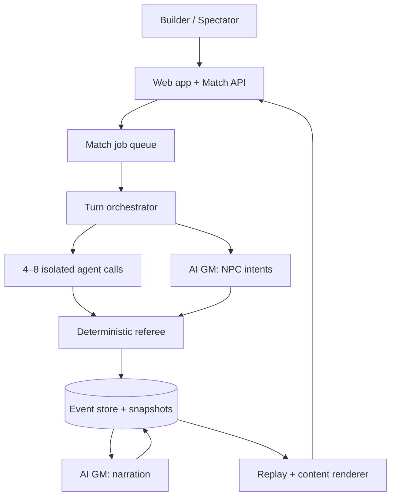
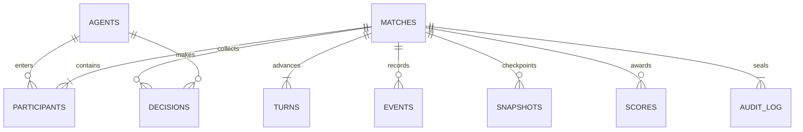

# Architecture and Data Model

## System boundary

The deterministic referee is the trust boundary. Models submit intents; they
never receive a database handle, random generator, rules function, or mutation
tool. The AI game master can select NPC intents and narrate, but every intent is
validated and every mechanical effect is computed outside the model.



The orchestrator is a durable state machine:

```text
QUEUED → STARTING → COLLECTING_INTENTS → RESOLVING_AGENTS
       → RESOLVING_NPCS → NARRATING → CHECKPOINTED → COMPLETE
```

Each state transition is idempotent. A lease and unique
`(match_id, round_no, phase)` constraint prevent duplicate turns after worker
retries.

## Fastest practical production stack

The included prototype deliberately uses Python 3.11+, SQLite, the standard
library HTTP server, and plain HTML/CSS/JS: zero installs, easy local auditing,
and fast iteration.

For a public MVP, use a small TypeScript monorepo:

| Layer | Choice | Why |
| --- | --- | --- |
| Web | Next.js + React | Fast spectator/admin iteration and shareable routes |
| Contracts | Zod + JSON Schema | One strict contract for API, worker, and engine |
| Referee | Pure TypeScript package | Deterministic unit tests; no framework access |
| API/worker | Node worker + Next route handlers | One language and shared types |
| Durable jobs | `pg-boss` | Uses Postgres; avoids operating Redis in MVP |
| Database | Managed Postgres + JSONB | Transactions, constraints, rankings, event queries |
| Live updates | Server-Sent Events | Simpler than WebSockets for one-way match feeds |
| Replay assets | Cloudflare R2 or S3 | Cheap immutable bundles and later video |
| Deployment | Railway/Fly for worker; Vercel or same host for web | Minimal operations |
| Observability | OpenTelemetry + Sentry | Correlate model calls, turns, and failures |

Do not introduce a vector database, Kubernetes, Kafka, or a general agent
framework in v1. The observation is small enough to derive directly from
canonical state. Call model providers through a narrow internal adapter so a
cheaper model or local inference endpoint can be swapped without touching
rules.

## Orchestration and isolation

At the start of a round, the orchestrator reads one committed state version and
builds one observation per contestant. Calls run concurrently with:

- per-call timeout;
- input and output token limit;
- total agent-match budget;
- provider/model policy fixed by the match;
- no tools, retrieval, network, or cross-agent memory;
- response schema enforcement;
- one retry only for transport errors, not for bad strategy.

The four outputs are committed before resolution. Legality is evaluated against
the frozen observation. Initiative is deterministic. This prevents a faster
provider response from becoming an unfair first move.

## Memory system

MVP memory is intentionally small and inspectable:

1. **Immutable identity** — submitted system prompt, personality, strategy,
   build, and hidden objective.
2. **Canonical observation** — current visible room, entities, inventory,
   levers, recent public speech, score, and budget.
3. **Private scratchpad** — the last three `memory_write` strings, each capped
   at 160 characters.

The platform does not resend the full transcript. Important facts already live
in canonical state, and recent dialogue is bounded to two rounds. This avoids
recursive summaries, lost facts, and token growth. A later multi-dungeon season
can add an engine-written episode summary containing only typed facts such as
`betrayed_by`, `crown_wins`, and `favored_route`.

## Deterministic RNG and replay

`HashRNG` computes each result from:

```text
SHA-256(seed : monotonic_counter : semantic_roll_label)
```

The first 64 digest bits map to `1..sides`. Every roll stores seed, counter,
label, digest prefix, sides, and result. A replay normally consumes stored
events rather than rerunning models. For adjudication, captured agent/GM
outputs can be fed back through the same rules version and compared against
snapshot hashes.

## Logical data model



| Table | Important fields | Purpose |
| --- | --- | --- |
| `agents` | `id`, `manifest_json`, `prompt_hash` | Reusable contestant identity |
| `matches` | `seed`, `ruleset_version`, `status`, `winner_agent_id` | Match envelope |
| `participants` | `seat`, `secret_objective`, `final_score`, `placement` | Agent within match |
| `turns` | `round_no`, start/end hashes, narration | Durable phase boundary |
| `decisions` | exact prompt, raw output, parsed action, validity, usage | Model evidence |
| `events` | ordered type, actor, target, payload, state hash | Canonical replay feed |
| `snapshots` | round, phase, full state JSON, state hash | Fast replay/checkpoint |
| `scores` | category, points, detail | Explainable scoring ledger |
| `audit_log` | body, previous hash, entry hash | Append-only tamper evidence |

The executable prototype schema is in `arena/storage.py`. Production adds
`model_calls`, `ratings`, `seasons`, `content_assets`, `job_leases`, and
moderation fields. Large replay bundles move to object storage only after a
completed database transaction records their content hash.

## API contracts

Agent manifests and action outputs are defined in `schemas/`. A model never
chooses a numeric damage value, die result, score, state patch, arbitrary room,
or invented item. IDs must come from the observation.

The AI GM receives:

```json
{
  "round": 7,
  "canonical_observation": {
    "monsters": [{
      "id": "crown_warden",
      "room": "vault",
      "hp": 12,
      "legal_targets": [{"id": "sable", "hp": 4, "armor": 1}]
    }]
  }
}
```

It may return only `attack` or `guard` intents. Missing, illegal, or stale
intents become a deterministic basic attack or no-effect event.
