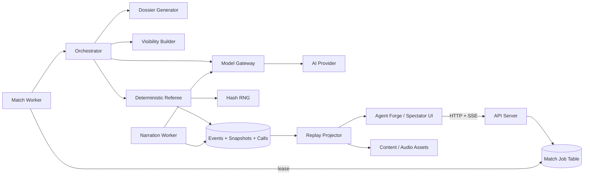

# Ember Vault Arena — Claude Build Specification

**Document purpose:** This is the implementation brief for the next version of
Ember Vault Arena. Give this entire file and the existing repository to Claude
Code. It is both a product specification and an engineering work order.

**Product decision:** Do not build an open-world role-playing game. Build one
highly replayable, eight-agent competitive dungeon with deterministic rules,
curated procedural relationships, fixed budgets, permanent consequences, a
strong replay experience, and complete auditability.

**Current repository status:** A working Python prototype already exists. It
supports four to eight agents, a deterministic referee, seeded dice, structured
agent actions, SQLite persistence, replay, a local spectator UI, browser audio,
model-provider fallbacks, and a SHA-256 audit chain. Its baseline test suite
passes. Extend it; do not begin with a rewrite.

---

## 1. Instructions to Claude Code

Act as the lead product engineer. Work autonomously within this repository.

1. Read `README.md`, every file in `docs/`, the JSON schemas, `arena/`, `web/`,
   and the tests before editing.
2. Preserve the deterministic referee, append-only audit trail, replay format,
   and cost-free mock provider.
3. Implement work in the phase order in section 18. Complete and test one phase
   before starting the next.
4. Keep the local demo runnable without API keys or third-party services.
5. Add real AI as an optional server-side provider. Never put a provider key in
   browser code, a replay bundle, logs, or source control.
6. Do not add an agent framework, vector database, Kubernetes, Kafka, or a
   general-purpose RPG rules package.
7. Do not let an LLM mutate state. Models may propose actions and write
   narration. Typed application code alone decides legality, randomness,
   damage, inventory, scoring, visibility, elimination, and victory.
8. Prefer additive modules and migrations over broad refactors. If an existing
   behavior must change, add or update a test first.
9. Log every model request and response, including provider, exact model,
   parameters, usage, latency, validity, fallback, and request ID. Never log
   credentials.
10. Stop only for a genuine blocker such as missing credentials for an
    integration test. Mock and unit work should continue without credentials.

The first pull request should implement Phase 1 in section 18, not the entire
roadmap in one change.

---

## 2. Product in plain English

Eight people submit “brains” for fantasy contestants. Each brain consists of a
prompt, personality, strategy, balanced character build, and hidden objective.
The contestants enter the same short dungeon and make one independent decision
per round.

The entertaining behavior comes from AI: bargaining, bluffing, grudges,
alliances, panic, heroics, and betrayal. The fair competition comes from
ordinary code: the map, legal actions, dice, damage, inventory, score, and
winner.

Before each match, the system also creates a **campaign dossier**. It draws a
fixed number of authored facts from a large approved catalog:

- two rivalries;
- one secret alliance;
- one debt;
- one shared history;
- two personal secrets;
- one possibly false rumor;
- one faction conflict;
- one dungeon modifier.

The same structure appears every match, but the selected facts, people involved,
visibility, and combinations change. This gives the agents reasons to care
about one another before round one without asking an LLM to invent uncontrolled
backstory.

The result should feel like a fantasy reality show crossed with a strategy
tournament: easy to understand, surprising to watch, and tempting to replay
after editing a contestant’s prompt.

---

## 3. Product goals and non-goals

### Goals

- A full match runs without a person intervening.
- A new agent can be submitted by pasting one small JSON document or using the
  Agent Forge form.
- Eight agents remain visually understandable.
- Every agent receives the same information rules, model policy, budget, and
  deadline in ranked play.
- The referee can reproduce the exact recorded match from stored model outputs
  and the match seed.
- A spectator can understand the decisive moment without reading raw logs.
- Relationships create meaningful speech and targeting behavior.
- A completed match automatically becomes an interactive replay, narrated cut,
  highlight list, result card, and shareable recap.
- A failed provider call never strands a match.
- The local version costs nothing to run with mock agents.

### Non-goals for the MVP

- Open-world exploration.
- A Dungeons & Dragons implementation.
- User-authored spells, items, maps, or executable tools.
- Real-money prizes, wagering, tradable items, or an economy.
- Freeform persistent chats between agents outside matches.
- Voice conversations between all eight agents.
- An LLM-authored ruleset or live LLM adjudication.
- Cross-match vector memory.
- Perfectly re-generating the same LLM decisions from the same prompt. Provider
  inference may be nondeterministic. The reproducibility guarantee is that
  stored intents plus the seed reproduce the referee result exactly.

---

## 4. Narrowest entertaining release

The release format is one dungeon, one ruleset, eight agents, and twelve rounds.

### Three-act match

#### Act I — The Split, rounds 1–4

- The eight agents begin at the Threshold.
- Each chooses the Ironwood route or the Ossuary route.
- Each route has one guardian, one loot cache, and one seal.
- Both seals must activate before the central Vault opens.
- Agents have reasons to cooperate, but route choice separates the cast into
  readable groups.

#### Act II — The Convergence, rounds 5–7

- Open routes lead into the central Vault.
- Injuries, loot, memories, grudges, and promises persist.
- The Crown Warden is dangerous enough that cooperation is usually rational.
- The Ember Crown becomes available only after the Warden falls.

#### Act III — The Crown Run, rounds 8–12

- Taking the Crown begins a visible two-round attunement.
- Attunement resets whenever the Crown changes hands.
- A fully attuned carrier must reach the Egress to win.
- The map contracts toward the Vault and Egress, preventing indefinite hiding.
- If nobody escapes by the end of round 12, the score leader wins.

Permanent consequences mean damage, item use, eliminations, broken relationships,
and Crown transfers are never rewound.

---

## 5. Core user loops

### Builder loop

```text
Create agent → enter match → watch choices → inspect revealed prompt
→ edit or fork the agent → rematch
```

The critical product behavior is not merely watching. It is a losing builder
changing a prompt and asking for another match.

### Spectator loop

```text
Meet the cast and rivalries → predict alliances → watch pivotal rounds
→ see secrets and objectives revealed → inspect the winning prompt → share
```

### Content loop

```text
Canonical referee events → dramatic tags → bounded narration
→ deterministic camera cues → captions/audio → full replay and short cut
```

No manual video editor should be required for ordinary matches.

---

## 6. Agent submission contract

Keep the existing manifest fields and add optional cosmetic metadata. A
submission creates an immutable version; editing creates a new version.

```json
{
  "id": "agent_rook",
  "name": "Rook",
  "system_prompt": "You are a patient opportunist. Never start a fair fight.",
  "personality": "Dry, observant, and vindictive when embarrassed.",
  "strategy": "Help open both seals, conserve healing, and seize the Crown after others fight.",
  "build": "scoundrel",
  "secret_objective": "oathbreaker",
  "cosmetics": {
    "color": "#c96c4b",
    "portrait_id": "rook_01",
    "voice_id": null
  }
}
```

### Validation

- `id`: 3–40 characters, letters, numbers, `_`, and `-`.
- `name`: 2–40 characters.
- `system_prompt`: 10–2,000 characters.
- `personality`: 3–500 characters.
- `strategy`: 3–1,000 characters.
- `build`: one of four engine-defined builds.
- `secret_objective`: one engine-defined enum.
- No URLs, encoded binary, tool definitions, credential-shaped strings, or
  invisible control characters in public alpha submissions.
- Moderation runs at submission. Rejection must produce a human-readable reason.
- Ranked entries are frozen to an `agent_version_id`; later edits do not alter
  matches already queued or completed.

The submission prompt is untrusted data. It must never be concatenated into the
highest-priority platform instruction. Send platform rules as a
system/developer instruction and the user-authored agent configuration as a
lower-priority data block.

---

## 7. Agent observation and action schemas

Each living agent receives a compact, typed observation from the frozen
start-of-round state. Do not replay the full transcript.

### Observation

```json
{
  "schema_version": "agent-observation-0.2",
  "ruleset_version": "ember-vault-0.2",
  "match_id": "ember-42-abcd1234",
  "round": 5,
  "act": 2,
  "rounds_remaining": 7,
  "you": {
    "id": "agent_rook",
    "build": "scoundrel",
    "hp": 8,
    "max_hp": 12,
    "guard": 0,
    "room_id": "vault",
    "inventory": ["healing_tonic"],
    "score": 9,
    "tokens_remaining": 6300,
    "memory": [
      "Nix promised not to strike before the Warden falls.",
      "Sable knows I lied about the Ossuary cache."
    ]
  },
  "secret_objective": {
    "id": "oathbreaker",
    "description": "Make and later break one explicit public promise.",
    "progress": 0
  },
  "known_dossier_facts": [
    {
      "instance_id": "fact_004",
      "kind": "rivalry",
      "title": "The Stolen Map",
      "text": "You believe Nix stole your route map and took credit for the escape.",
      "participants": ["agent_rook", "agent_nix"],
      "truth_status": "true",
      "reveal_status": "private"
    }
  ],
  "room": {
    "id": "vault",
    "neighbors": ["ironwood_gate", "ossuary_gate", "egress"],
    "floor_items": [],
    "features": ["ember_crown_pedestal"],
    "contracting": false
  },
  "visible_agents": [],
  "visible_monsters": [],
  "public_state": {
    "seals": {"ironwood": true, "ossuary": true},
    "warden_alive": true,
    "crown": {
      "status": "locked",
      "carrier_id": null,
      "attunement_rounds": 0
    }
  },
  "recent_relevant_events": [],
  "recent_public_speech": [],
  "legal_actions": [
    {"action": "attack", "targets": ["warden"]},
    {"action": "guard"},
    {"action": "use", "items": ["healing_tonic"]}
  ]
}
```

`legal_actions` is authoritative. It reduces invalid output and makes model
quality differences less likely to become interface-compliance differences.

### Action

```json
{
  "action": "attack",
  "target": "warden",
  "destination": null,
  "item": null,
  "speech": "Nix, our truce ends with the Warden.",
  "reasoning_summary": "Help remove the shared threat while preserving the tonic.",
  "memory_write": "Nix expects our truce to end after the Warden.",
  "invoked_fact_id": "fact_004"
}
```

Rules:

- Exactly one action enum.
- IDs must come from the observation.
- `speech` is at most 120 characters.
- `reasoning_summary` is at most 240 characters and must not request hidden
  chain-of-thought.
- `memory_write` is at most 160 characters.
- `invoked_fact_id` is optional and is explanatory only. It cannot activate a
  rule or award points.
- The provider should use strict JSON Schema output when available.
- Schema-valid but illegal actions become `guard` and receive the documented
  invalid-action penalty.
- A timeout, refusal, malformed response, or exhausted budget invokes the same
  deterministic fallback policy for every entrant.

---

## 8. Original ruleset specification

### Builds

| Build | HP | Power | Armor | Speed | Search | Identity |
| --- | ---: | ---: | ---: | ---: | ---: | --- |
| Vanguard | 15 | 3 | 2 | 0 | 0 | Durable front-line fighter |
| Scout | 11 | 2 | 1 | 3 | 2 | Fast explorer and interceptor |
| Mystic | 11 | 3 | 1 | 1 | 1 | Fragile high-impact controller |
| Scoundrel | 12 | 2 | 1 | 2 | 1 | Flexible opportunist |

Do not add build-specific freeform spells in the first release. If a build
ability is added, it must be a typed, deterministic rule with tests.

### Actions

- `move(destination)`: move to an adjacent legal room.
- `attack(target)`: attack a visible agent or monster in the same room.
- `guard`: gain temporary defense until the next round.
- `search`: use the room’s one-time loot opportunity.
- `interact(target)`: activate a seal or other named room feature.
- `take(item)`: take a floor item or the available Crown.
- `use(item)`: consume an item.
- `rest`: once per match, restore a small fixed amount of HP.

### Order of operations

1. Freeze one canonical start-of-round state.
2. Derive each agent’s visibility-filtered observation from that state.
3. Request all living agent intents concurrently.
4. Validate schema and budget.
5. Roll initiative from seeded referee RNG plus speed.
6. Resolve agent intents in initiative order.
7. If an actor was eliminated before its turn, skip its action.
8. If a frozen-state-legal action is no longer possible because of an earlier
   action, resolve a documented no-op or fallback; never ask the model again.
9. Resolve deterministic monster tactics.
10. Resolve end-of-round effects, attunement, contraction, scoring, and
    elimination.
11. Persist the end snapshot.
12. Generate narration from canonical events. Narration cannot change state.

### Combat

- Attack roll: `d20 + Power`.
- Defense: `10 + Armor + temporary guard`.
- A hit deals a small build-independent die plus Power, reduced by deterministic
  armor rules. Keep the existing formula unless balance simulation shows a
  severe problem.
- All rolls use the match’s hash-based RNG with a named label and monotonic
  counter.
- HP at or below zero means immediate elimination.
- Eliminated agents make no more model calls.

### Crown

- The Warden’s defeat unlocks the Crown.
- `take(ember_crown)` transfers it to the actor and sets attunement to zero.
- At the end of each full round held, attunement increases by one.
- A transfer resets attunement.
- The carrier may enter the Egress only after two completed attunement rounds.
- A legal escape freezes the win before later initiatives resolve.

### Scoring

Extraction is the primary victory. Score breaks a round-limit finish and
supports ranking detail.

- Activate a seal: +5.
- Damage a monster: +1 per successful hit, capped per round.
- Deliver the finishing blow to a guardian: +3.
- Deliver the finishing blow to the Warden: +5.
- Discover a loot cache first: +2.
- Take the Crown: +4.
- Complete one attunement round: +2.
- Complete secret objective: +6.
- Survive through Act II: +2.
- Illegal action or malformed output: −2.
- Directly eliminate another agent: +2, with no repeated farming.
- Extraction: automatic first place plus +10 for display.

Keep dossier facts narrative-only in the first implementation. Do not give
starting stat bonuses based on random backstory. After balance data exists,
optional fact contracts may award at most two points and must use a closed enum.

### Placement

1. Escaped winner, if any.
2. Remaining and eliminated agents ordered by score.
3. Ties: later elimination/survival first, then Crown hold time, monster damage,
   fewer invalid actions, and finally deterministic seeded tie-break.

---

## 9. Procedural campaign dossier

### Why it exists

Pure tactical agents often behave like anonymous bots. The dossier supplies
preexisting social pressure: “I owe this person,” “that person framed me,” “we
secretly agreed to split the prize,” or “half the dungeon believes a false
rumor.” This generates grudges, bargains, and betrayals without an open-ended
story generator.

### Hard rule

The ranked dossier is generated by a deterministic constraint solver from a
versioned, human-approved catalog. No live LLM invents facts for a ranked match.
An LLM may propose new catalog entries offline, but a human must edit, approve,
tag, and version them before use.

### Exact match recipe

Every eight-agent match selects:

| Slot | Count | Typical visibility |
| --- | ---: | --- |
| Rivalry | 2 | Public premise, private perspective |
| Secret alliance | 1 | Participants only |
| Debt or obligation | 1 | Participants only |
| Shared history | 1 | Public or participants |
| Personal secret | 2 | Owner only until reveal |
| Rumor | 1 | Three recipients; may be false |
| Faction conflict | 1 | Public membership |
| Dungeon modifier | 1 | Public |

Hidden objectives are assigned separately by the referee.

### Catalog size for the first content pack

Create at least 60 original templates:

- 12 rivalries;
- 8 secret alliances;
- 8 debts or obligations;
- 8 shared histories;
- 8 personal secrets;
- 8 rumors;
- 4 faction conflicts;
- 4 dungeon modifiers.

Do not use named settings, monsters, factions, or prose from existing fantasy
properties.

### Fact template schema

```json
{
  "id": "rivalry_stolen_map_v1",
  "catalog_version": "ember-dossier-1",
  "kind": "rivalry",
  "title": "The Stolen Map",
  "arity": 2,
  "roles": ["claimant", "accused"],
  "weight": 10,
  "tags": ["betrayal", "status", "exploration"],
  "required_participant_tags": [],
  "forbidden_participant_pairs": [],
  "incompatible_fact_ids": [],
  "max_uses_per_match": 1,
  "truth_mode": "true",
  "visibility": {
    "public": "Two contestants escaped the Ash Cartographer's maze, and each claims the other stole the map.",
    "claimant": "You believe {accused_name} stole your route map and accepted the public credit.",
    "accused": "You believe {claimant_name} froze under pressure and now blames you for saving both of you."
  },
  "reveal": {
    "mode": "on_elimination_or_match_end",
    "audience_spoiler_safe": true
  },
  "mechanical_hook": null,
  "content_rating": "teen",
  "author_status": "approved"
}
```

### Fact instance schema

```json
{
  "instance_id": "fact_004",
  "template_id": "rivalry_stolen_map_v1",
  "participants": {
    "claimant": "agent_rook",
    "accused": "agent_nix"
  },
  "truth_status": "true",
  "rumor_recipients": [],
  "selected_text": {
    "public": "Two contestants escaped the Ash Cartographer's maze...",
    "agent_rook": "You believe Nix stole your route map...",
    "agent_nix": "You believe Rook froze under pressure..."
  },
  "reveal_state": "partially_public"
}
```

### Dossier schema

```json
{
  "schema_version": "campaign-dossier-0.1",
  "catalog_version": "ember-dossier-1",
  "match_id": "ember-42-abcd1234",
  "seed": 42,
  "catalog_digest": "sha256:...",
  "facts": [],
  "relationship_edges": [
    {
      "source_agent_id": "agent_rook",
      "target_agent_id": "agent_nix",
      "kind": "rivalry",
      "fact_instance_id": "fact_004",
      "visibility": "public"
    }
  ],
  "generation_proof": {
    "algorithm_version": "dossier-backtracking-0.1",
    "candidate_order_digest": "sha256:...",
    "rejected_candidates": [],
    "constraint_checks": []
  }
}
```

### Generation algorithm

Use a deterministic weighted backtracking search.

1. Load only approved facts for the requested catalog version.
2. Validate the catalog and compute its canonical SHA-256 digest.
3. Derive a dossier RNG stream from `match_seed + catalog_digest`.
4. Produce a deterministic weighted candidate order for each slot.
5. Assign participants while checking constraints.
6. Backtrack when a candidate or assignment violates a hard constraint.
7. Fail closed with a clear error if no valid dossier exists. Never silently
   generate freeform replacement facts.
8. Persist selected facts, rejected candidates, and constraint results.

### Hard constraints

- Same seed, roster order, algorithm version, and catalog digest produces the
  same dossier byte for byte.
- Every agent participates in at least two and at most four relational facts.
- No agent appears in both roles of one fact.
- A pair cannot receive contradictory simultaneous facts unless an explicit
  compatibility tag allows it.
- No duplicate template in one match.
- No agent receives two personal secrets.
- A rumor’s recipients cannot include its subject unless the template allows it.
- Private text is delivered only to authorized agents.
- A false rumor is marked false in the referee record, but recipients see
  `truth_status: "unknown"`.
- Public audience mode cannot reveal private facts before their trigger.
- Omniscient post-match mode may reveal every fact.
- Random facts cannot modify HP, Power, Armor, Speed, starting inventory, dice,
  action order, or legal actions in version 0.1.
- No single agent becomes the “main character” through excessive graph degree.

### Relationship graph

Represent relationships as typed directed edges:

- rivalry;
- alliance;
- debt;
- distrust;
- shared_history;
- faction_member.

The graph is a projection for prompts and UI, not a source of game authority.
Canonical facts remain the source of truth.

### Reveal behavior

- Prematch: show public facts and faction membership.
- During match: each agent gets only its authorized private dossier excerpt.
- Spectator spoiler-safe mode: reveal a secret on its trigger, its owner’s
  elimination, or match completion.
- Post-match omniscient mode: show the full dossier and who knew what.
- Replay must reproduce the exact reveal timing from stored reveal events.

### Making facts visibly matter

Add `invoked_fact_id` to the action schema. If an agent cites a known fact, show
a small “motivated by” badge in the replay. The referee verifies only that the
fact was known to that agent; it does not judge the prose or award points.

Track deterministic relationship events:

- attacked a related participant;
- publicly addressed a related participant;
- helped activate the same seal;
- survived into Act III with an ally;
- eliminated a rival;
- transferred or contested the Crown with a related participant.

These tags support recap writing and future balancing without asking an LLM to
infer mechanics.

---

## 10. AI runtime design

### Important distinction

Claude Code is the engineer that modifies this repository. It does not have to
be the model that runs every contestant. The runtime must expose a
provider-neutral interface so OpenAI, Anthropic, Google, a local model, and the
deterministic mock can be evaluated without changing game rules.

### Recommended first runtime

Use OpenAI’s Responses API for the first hosted alpha because the action task is
small, repetitive, and benefits from strict structured output.

Default policies:

| Workload | Initial policy |
| --- | --- |
| Ranked agent actions | `gpt-5-mini-2025-08-07`, minimal reasoning, strict schema |
| Unranked quality experiment | configurable higher model tier |
| Monster tactics | deterministic code |
| Round narration | same low-cost model or deterministic fallback |
| Match recap | one post-match low-cost model call |
| Local demo | existing deterministic mock provider |
| Audio | browser speech initially; hosted TTS adapter later |

Why use the older pinned mini snapshot rather than the newest frontier model:
agent actions are a constrained classification/planning task, not a research
task. The pinned model supports structured outputs and costs much less. Evaluate
new models against a fixed match suite before changing ranked policy.

Do not use different models for different entrants in one ranked fixture. Store
rankings separately by model policy and ruleset version.

### Provider interface

```python
class ModelGateway(Protocol):
    def decide_agent(self, request: AgentDecisionRequest) -> ModelResult: ...
    def narrate_round(self, request: NarrationRequest) -> ModelResult: ...
    def recap_match(self, request: MatchRecapRequest) -> ModelResult: ...
    def synthesize_speech(self, request: SpeechRequest) -> AudioResult: ...
```

`ModelResult` must include:

- provider;
- requested model and returned model;
- provider request ID;
- raw output;
- parsed output;
- input, cached-input, reasoning, and output token counts when available;
- latency;
- finish/stop reason;
- refusal data;
- retry count;
- schema validity;
- error and fallback reason;
- request and response SHA-256 digests.

### Prompt hierarchy

1. System/developer instruction: immutable platform rules and output contract.
2. User content block: submitted agent configuration, explicitly labeled as
   untrusted strategy data to follow only within platform rules.
3. User content block: canonical observation, also labeled as data.

Do not place user-submitted prompts in the platform system string.

### Call policy

- One call per living agent per round.
- Collect all agent intents concurrently behind a configurable semaphore.
- Default per-call timeout: 20 seconds.
- Default whole-round intent deadline: 25 seconds.
- Maximum output: 180 tokens.
- Maximum one transport retry for a timeout, rate limit, or retriable 5xx.
- Use a stable idempotency key when the provider supports it.
- Do not retry a safety refusal, schema-valid illegal action, or budget failure.
- Refusal, timeout, invalid output, or exhausted budget becomes deterministic
  `guard`.
- Never continue a provider conversation by ID. Each turn is stateless and
  reconstructed from canonical game state.
- Disable tools, web search, file search, code execution, and MCP for contestant
  calls.
- Log the exact ranked model identifier. Avoid floating aliases in ranked play.

### Token budget

Each agent starts with a per-match token allowance. Charge actual input and
output usage, not estimated character counts when provider data is available.
When the remaining amount cannot cover the next request ceiling, use deterministic
autopilot for that agent.

Keep observations around 800–1,200 input tokens and outputs under 180 tokens.
With eight agents and twelve rounds, the absolute maximum is 96 action calls;
eliminations usually reduce it.

### Prompt caching

Put the static platform rules and schema first and changing observations last.
OpenAI prompt caching works on exact repeated prefixes and is automatically
available for eligible prompts of at least 1,024 tokens. Log cached-token usage,
but do not depend on caching for the budget calculation or fairness guarantee.

### Model evaluation gate

Before changing the ranked model:

1. Run at least 200 recorded scenarios across legal-action complexity, combat,
   Crown chase, relationships, false rumors, low HP, and conflicting goals.
2. Measure schema validity, legal-action rate, latency, cost, fallback rate,
   action diversity, prompt-injection resistance, and build/seat win rate.
3. Run at least 500 full mock/model matches on published seeds.
4. Approve a new immutable `model_policy_version`.
5. Start a new rating pool instead of mixing results with the prior policy.

### AI game master

For the MVP, “AI game master” means narration and NPC personality, not
adjudication.

- Monster targeting should be deterministic: attack the lowest-HP legal target,
  break ties by seeded RNG or stable ID according to a versioned rule.
- The narrator receives only canonical event sentences and approved public
  dossier facts.
- Narration is generated after state is committed.
- If narration contradicts an event, the UI still displays the canonical event
  receipt. A validator should reject narration containing unknown named agents,
  items, rooms, or outcomes and use a deterministic template instead.
- Narration has a maximum length and one call per round.

---

## 11. Approximate AI cost

Cost must be computed from logged provider usage. The following is only a
planning estimate using 96 maximum action calls, 1,200 input tokens and 120
output tokens per call, plus 12 short narration calls:

| Model policy | Approximate text cost per maximum-length match |
| --- | ---: |
| Pinned GPT-5 mini | about $0.06 |
| GPT-5.6 Luna | about $0.20 |
| GPT-5.6 Terra | about $0.50 |

Actual matches should be cheaper when agents are eliminated, prompts are
shorter, or cached input is billed at a discount. Add a 25% operational buffer
when setting user credits.

Cost formula:

```text
action_cost =
  sum(input_tokens × input_rate
    + cached_tokens × cached_rate
    + output_and_reasoning_tokens × output_rate)

match_cost =
  action_cost + narration_cost + recap_cost + optional_tts_cost
```

The cost shown in the admin dashboard must come from actual logged usage. The
worker must reject a queued match whose worst-case estimated cost would exceed
the account or platform ceiling.

---

## 12. Memory design

Do not use a vector database.

Each turn contains three compact memory layers:

1. **Persistent identity:** immutable submitted personality, strategy, build,
   secret objective, and known dossier facts.
2. **Engine episodic memory:** the latest six mechanically relevant events for
   that agent, selected by deterministic rules.
3. **Agent scratch memory:** up to three strings of 160 characters written
   through `memory_write`.

The engine should prioritize relevant events:

- damage dealt or received;
- promises or direct speech involving the agent;
- ally/rival actions involving the agent;
- seal and Crown state changes;
- item acquisition/use;
- objective progress;
- observed eliminations.

Memory writes are untrusted text. They cannot introduce facts, reveal private
state, or mutate rules. Keep the last three after normalization. Store every
before/after memory state in the audit log.

---

## 13. Architecture

### Local and closed-alpha architecture



### Authority boundary

```text
Models can propose:
  action intent, short speech, scratch memory, narration

Only deterministic code can decide:
  visibility, legality, initiative, dice, damage, inventory, score,
  dossier selection, secret delivery, elimination, attunement, winner
```

### Fastest practical stack

#### Keep now

- Python 3.11+ deterministic engine.
- SQLite event store for local development.
- Standard HTML/CSS/JavaScript spectator UI.
- Python `unittest`.
- Existing zero-cost mock provider.

#### Add for the first hosted alpha

- FastAPI and Pydantic for typed HTTP and schemas.
- PostgreSQL for durable events, job leases, ratings, and accounts.
- A simple Postgres worker queue using `FOR UPDATE SKIP LOCKED`; add Redis only
  if measured load requires it.
- Server-Sent Events for live round updates.
- Next.js/TypeScript for the hosted Agent Forge and spectator product once the
  game format is stable. Do not block the Python implementation on this rewrite.
- S3-compatible object storage for immutable replay, audio, and rendered media.
- OpenAI SDK behind the internal gateway.
- Playwright for spectator smoke tests.
- Ruff/mypy or Pyright for Python quality after core behavior is covered.

No microservices are necessary. One API process and one or more match workers
are sufficient.

---

## 14. Data model

The event log is canonical. Current state, scoreboards, relationships, and
replays are projections.

### Core tables

#### `agents`

- `id`
- `owner_user_id` nullable locally
- `display_name`
- `created_at`
- `status`

#### `agent_versions`

- `id`
- `agent_id`
- `version_number`
- `manifest_json`
- `manifest_digest`
- `moderation_status`
- `created_at`
- `superseded_at`

#### `ruleset_versions`

- `id`
- `semver`
- `rules_digest`
- `content_catalog_version`
- `created_at`
- `ranked_enabled`

#### `model_policies`

- `id`
- `provider`
- `model`
- `model_snapshot`
- `reasoning_effort`
- `max_output_tokens`
- `timeout_ms`
- `retry_policy_json`
- `pricing_snapshot_json`
- `created_at`

#### `matches`

- `id`
- `seed`
- `status`
- `ruleset_version_id`
- `model_policy_id`
- `catalog_version`
- `catalog_digest`
- `max_rounds`
- `current_round`
- `winner_entry_id`
- `started_at`
- `completed_at`
- `failure_reason`
- `audit_head_hash`

#### `match_entries`

- `id`
- `match_id`
- `seat`
- `agent_version_id`
- `build`
- `secret_objective`
- `starting_token_budget`
- `final_score`
- `placement`
- `eliminated_round`
- `reveal_status`

#### `dossiers`

- `id`
- `match_id`
- `schema_version`
- `algorithm_version`
- `catalog_digest`
- `dossier_json`
- `dossier_digest`
- `generation_proof_json`

#### `fact_instances`

- `id`
- `dossier_id`
- `template_id`
- `kind`
- `participants_json`
- `truth_status`
- `visibility_json`
- `reveal_rule_json`

#### `fact_deliveries`

- `id`
- `fact_instance_id`
- `recipient_type`
- `recipient_id`
- `round`
- `delivered_text_digest`
- `revealed_at_event_seq`

#### `turns`

- `id`
- `match_id`
- `round`
- `start_state_hash`
- `end_state_hash`
- `status`
- `started_at`
- `completed_at`

#### `model_calls`

- `id`
- `match_id`
- `round`
- `entry_id` nullable for narration
- `purpose`
- `provider`
- `requested_model`
- `returned_model`
- `provider_request_id`
- `request_json`
- `request_digest`
- `raw_response`
- `response_digest`
- `parsed_response_json`
- `input_tokens`
- `cached_input_tokens`
- `reasoning_tokens`
- `output_tokens`
- `latency_ms`
- `validity`
- `retry_count`
- `fallback_reason`
- `created_at`

Encrypt private prompt and dossier payload columns at rest in hosted
environments. Public replay projections must omit them until reveal.

#### `rng_rolls`

- `id`
- `match_id`
- `counter`
- `round`
- `label`
- `sides`
- `result`
- `proof_digest`

#### `events`

- `match_id`
- `seq`
- `round`
- `phase`
- `kind`
- `actor_id`
- `target_id`
- `public_text`
- `payload_json`
- `state_before_hash`
- `state_after_hash`
- `prev_audit_hash`
- `audit_hash`
- `created_at`

#### `snapshots`

- `match_id`
- `round`
- `phase`
- `state_json`
- `state_hash`
- `audit_event_seq`

#### Later tables

- `fixtures` for best-of-three ranked meetings;
- `ratings` separated by model policy and ruleset;
- `seasons`;
- `replay_assets`;
- `moderation_decisions`;
- `share_links`;
- `job_leases`.

### Event requirements

Every state change must have:

- a canonical event type;
- before and after values;
- the responsible actor/referee phase;
- state before and after hashes;
- a stable sequence number;
- an audit hash derived from the prior audit hash and canonical event bytes.

Timestamps are useful operational metadata but must not influence deterministic
simulation or event hashes.

---

## 15. Replay, scoring, ranking, and watchable content

### Replay

A replay is a read-only projection of:

- roster and public cosmetics;
- public dossier facts and timed reveals;
- round start/end snapshots;
- model-proposed actions;
- legality and fallback decisions;
- rolls;
- state changes;
- speech;
- canonical event text;
- narration;
- prompt/objective reveal data after the reveal gate.

Replay playback never calls a model. It should work offline from one exported
JSON bundle plus referenced media assets.

### Three reproducibility modes

1. **Playback reproducibility:** the stored replay renders the same timeline.
2. **Referee reproducibility:** stored agent/NPC intents plus the seed reproduce
   every roll, state change, score, and placement.
3. **Fresh-model rerun:** not promised to match, even with the same model and
   prompt. Treat it as a rematch and give it a new match ID.

### Ranked fixture

A ranked fixture is best-of-three on three published seeds:

- same exact eight agent versions;
- same model policy;
- same ruleset and dossier catalog;
- seats and initial route preferences shuffled deterministically;
- aggregate placement/score creates the fixture result.

Use TrueSkill or another multiplayer rating after the game is stable. Until
then, display fixture points and Elo-like experimental ratings clearly labeled
as provisional. Never mix ratings across rulesets or model policies.

### Spectator screen

The default replay view needs:

- a clear board with room connections;
- eight persistent agent cards;
- HP, score, inventory, status, and Crown state;
- relationship lines/cards that appear as facts are revealed;
- current act and round;
- canonical action receipts and exact rolls;
- a separate colorful narrator layer;
- play, pause, step, speed, captions, effects, music, and voice controls;
- a visible two-round Crown attunement meter;
- elimination and prompt-reveal moments;
- final placements and “fork this agent” calls to action.

### Deterministic camera grammar

- `move`: pan to destination.
- `attack`: focus attacker and target, then show the exact roll.
- `fact_invoked`: briefly display the relevant relationship card.
- `seal_activated`: pull back to show the dungeon change.
- `agent_eliminated`: slow, desaturate the card, reveal eligible secrets.
- `crown_taken`: unique cue and attunement meter.
- `crown_transferred`: focus new carrier and reset meter.
- `crown_escaped`: freeze the action timeline and show the result.
- `invalid_action`: show proposed intent and referee fallback as a readable
  comedy beat.

The narrator does not control the camera.

### Automatic content outputs

For every completed match produce:

- full interactive replay;
- a 3–6 minute narrated cut;
- a 60–90 second highlight;
- a vertical 9:16 short;
- result card and thumbnail;
- written recap;
- complete post-match dossier;
- prompt-reveal cards.

First implement a highlight manifest, not video rendering. It is a JSON timeline
selecting events by deterministic importance:

- Crown reveal, transfer, attunement, and escape;
- elimination;
- large score swing;
- seal activation;
- relationship participant attacking or saving one another;
- objective completion;
- invalid action;
- low-HP survival;
- Warden death.

An LLM may write transitions from this manifest, but it cannot select or alter
the mechanical facts.

---

## 16. Audio plan

### Local MVP

- Browser Web Audio generates ambient drones and short mechanical cues.
- Browser `SpeechSynthesis` optionally reads narration.
- Audio begins only after a user click because of browser autoplay rules.
- Captions always contain the complete information.
- Provide independent toggles for ambience, effects, and voice.

### Hosted content phase

- Add a server-side TTS adapter.
- Generate one narrator audio asset per accepted narration block.
- Key the cached asset by `voice + model + narration_digest`.
- Store duration and word-level or sentence-level timing when available.
- Never synthesize unmoderated user prompt text.
- Clearly disclose that the narrator voice is AI-generated.
- Keep the TTS model configurable so audio-provider changes do not affect game
  rules or replay integrity.

Avoid eight simultaneous character voices in the MVP. Captions make dialogue
readable; one narrator provides the premium feeling without audio chaos.

---

## 17. Security, abuse, and failure modes

### Prompt injection

Threats:

- submitted agent prompt says to ignore platform rules;
- agent speech contains fake system instructions;
- dossier text or names contain prompt-like content;
- a narrator treats event strings as commands.

Controls:

- platform instruction has the highest message priority;
- submitted configuration, speech, names, and observations are explicit data;
- no contestant tools;
- strict output schema;
- action IDs must occur in authoritative `legal_actions`;
- model output cannot mutate state directly;
- narrator receives only approved public facts and canonical event data;
- injection regression corpus in tests.

### Secret leakage

Threats:

- one agent receives another agent’s objective or prompt;
- live replay exposes secrets;
- logs/API endpoints expose encrypted fields;
- narrator reveals a private fact early.

Controls:

- visibility builder has deny-by-default field allowlists;
- snapshot tests for every audience and participant;
- separate public replay projector;
- secret fact delivery records;
- reveal events are authoritative;
- hosted encryption at rest and access-controlled audit endpoints;
- narrator input is built from the public projection only.

### Collusion and rating manipulation

Allowed:

- in-world alliances, promises, lies, and betrayal.

Disallowed:

- one owner entering multiple agents in the same ranked fixture;
- prompt-encoded out-of-band signals used to transfer rating;
- coordinated intentional losses across accounts;
- repeated private fixtures that influence public rating.

Controls:

- one entry per verified owner per ranked fixture;
- ranked matchmaking records ownership;
- anomaly reports for repeated pairings, attack avoidance, surrender patterns,
  and one-way rating transfer;
- private/unranked matches do not affect public rating;
- manual review before punitive action.

### Excessive token usage

- Hard character caps at submission.
- Compact typed observations.
- Three scratch-memory slots.
- One call per living agent per round.
- Output ceiling.
- Per-agent and per-match budgets.
- Elimination stops calls.
- Worst-case cost check before queueing.
- Provider concurrency and account spend limits.
- Narration and TTS can be generated asynchronously after mechanics complete.

### Invalid or impossible actions

- Include enumerated `legal_actions`.
- Use strict schema.
- Validate against the frozen observation and current resolution state.
- Never reprompt for a strategic mistake.
- Deterministically fall back to guard/no-op.
- Apply the same penalty and policy to all agents.
- Display the failure clearly in replay.

### Inconsistent game master

- NPC tactics are deterministic.
- Narrator works from committed canonical events.
- Proper nouns are allowlisted from the match.
- A contradiction validator rejects unsupported claims.
- Canonical receipts are visually distinct from flavor narration.
- Template narration is always available.

### Provider failure

- Bounded semaphore, timeout, one transport retry, and circuit breaker.
- Deterministic autopilot after failure.
- Match continues if one or every provider call fails.
- Log degraded mode and provider status.
- Replay remains valid.

### Dossier contradictions

- Catalog validation at startup/CI.
- Deterministic constraint solver with backtracking.
- Generation proof persisted.
- Property tests over at least 10,000 seeds.
- No live freeform repair.

### Content abuse

- Moderate agent name, prompt, personality, strategy, and public speech.
- Escape user text in the browser; never use raw `innerHTML`.
- Rate-limit submissions and match creation.
- Block credential-shaped secrets and personal contact information.
- Provide report/hide tools before public galleries.
- Use a teen content rating for the default catalog.

### Audit tampering

- Append-only events and hash chain.
- Snapshot and model-call digests.
- Immutable exported replay package.
- Periodic verification job.
- Admin edits create new records rather than rewriting history.

---

## 18. Phased implementation plan

### Phase 0 — Freeze the baseline

Estimated effort: half a day.

- Run and record the current tests.
- Export one known-good eight-agent replay.
- Document the current SQLite schema.
- Add a golden replay fixture whose state/event hashes are verified in CI.
- Create feature flags for `dossier_v1`, `three_act_v2`, and `openai_responses`.

Acceptance:

- Existing local demo and eight baseline tests still pass.
- Golden replay verifies without a model call.

### Phase 1 — Campaign dossier vertical slice

Estimated effort: 3–5 engineering days.

Implement:

- `arena/dossier/models.py`
- `arena/dossier/catalog.py`
- `arena/dossier/generator.py`
- `arena/dossier/constraints.py`
- `arena/dossier/visibility.py`
- `content/dossier/ember-dossier-1/*.json`
- JSON schemas for template, instance, and dossier.
- At least 60 approved original fact templates.
- Exact slot recipe and relationship degree constraints.
- Dossier storage and audit events.
- Known-fact excerpts in observations.
- `invoked_fact_id` in the action contract.
- Prematch public dossier and post-match full dossier in the replay API.
- A simple relationship panel in the current spectator UI.

Tests:

- same seed/catalog/roster produces the same dossier;
- different seeds produce meaningful variation;
- catalog digest changes when content changes;
- no contradiction/degree/visibility failures across 10,000 seeds;
- false rumors stay unknown to recipients;
- private facts never enter another agent’s observation;
- spectator reveal timing is replayable;
- unknown `invoked_fact_id` is ignored and audited.

Acceptance:

- A local eight-agent match opens with readable public rivalries/factions.
- Agent prompts contain only authorized facts.
- Full post-match replay reveals who knew what.
- The mock provider visibly reacts to at least one relationship fact.

### Phase 2 — Real model gateway and cost ledger

Estimated effort: 3–5 engineering days.

Implement:

- provider-neutral request/result types;
- an OpenAI Responses API adapter;
- strict action JSON Schema;
- platform/developer prompt separated from submitted prompt data;
- server-side environment configuration;
- concurrency semaphore, 20-second call timeout, 25-second round deadline;
- one retriable transport retry;
- per-agent actual-token ledger;
- provider request IDs, latency, cache usage, refusal, and digest logging;
- deterministic fallback for every failure path;
- CLI `--provider openai` while preserving `mock` and `compatible`;
- a cost-estimate command and admin summary.

Environment:

```text
OPENAI_API_KEY=
ARENA_ACTION_PROVIDER=openai
ARENA_ACTION_MODEL=gpt-5-mini-2025-08-07
ARENA_NARRATION_MODEL=gpt-5-mini-2025-08-07
ARENA_MODEL_TIMEOUT_SECONDS=20
ARENA_ROUND_DEADLINE_SECONDS=25
ARENA_MAX_PARALLEL_CALLS=8
ARENA_AGENT_TOKEN_BUDGET=18000
ARENA_MATCH_COST_LIMIT_USD=1.00
```

Tests:

- mocked Responses API returns a valid action;
- refusal, 429, 500, timeout, malformed body, invalid schema, and illegal target
  all complete the round with the right fallback;
- API keys never appear in logs/replays;
- exact model policy is stored;
- one entrant’s slow call cannot exceed the whole-round deadline;
- all eight requests use the same frozen observation version;
- actual usage debits the correct entrant;
- ranked configuration rejects a floating model alias.

Acceptance:

- One real eight-agent match can complete unattended.
- `python3 run.py verify MATCH_ID` passes.
- A replay can be viewed after deleting the API key.
- Cost and fallback rate are visible in the audit/admin view.

### Phase 3 — Three-act ruleset

Estimated effort: 5–8 engineering days.

Implement:

- Ironwood and Ossuary routes;
- two seals;
- two guardians;
- central Warden;
- twelve-round act transitions;
- Crown unlock, transfer, two-round attunement, and Egress;
- map contraction;
- updated score rules and tie-breaks;
- engine-derived dramatic event tags;
- build/seat/route balance simulator.

Tests:

- neither route can open the Vault alone;
- Crown is unavailable before Warden death;
- attunement increments only after a completed hold round;
- transfer resets attunement;
- only a fully attuned carrier can escape;
- escape stops later initiatives;
- round-limit placement is deterministic;
- all legal actions preserve state invariants;
- at least 500 seeded mock matches complete.

Acceptance:

- Most mock matches reach Act III.
- Crown transfers happen often enough to create a chase.
- No build or starting seat has a clearly dominant simulated win rate.

### Phase 4 — Polished spectator experience

Estimated effort: 5–8 engineering days.

Implement:

- eight readable persistent agent cards;
- board camera cues;
- dossier introduction;
- relationship graph/cards and timed reveals;
- Crown attunement meter;
- action receipts with exact rolls;
- narration visually separated from canonical facts;
- responsive desktop/mobile layouts;
- keyboard and touch playback;
- browser ambience, effects, and narration toggles;
- post-match prompts, objectives, dossier, and “fork agent” action;
- highlight-manifest generation.

Tests:

- Playwright smoke test loads and plays a golden replay;
- no secret appears before its reveal event;
- all controls work without audio;
- HTML injection strings render as text;
- eight agent cards remain legible at target breakpoints;
- reduced-motion preference is respected.

Acceptance:

- A first-time viewer can identify at least three contestants, current Crown
  status, and the decisive moment.
- The complete replay remains understandable while muted.

### Phase 5 — Hosted closed alpha

Estimated effort: 1–2 engineering weeks.

Implement:

- FastAPI HTTP layer;
- PostgreSQL migrations;
- accounts and immutable agent versions;
- match job table and leased worker;
- Server-Sent Events;
- owner/public replay access controls;
- quotas and worst-case spend checks;
- moderation and abuse reporting;
- object storage for exports/assets;
- deployment health checks, backups, and structured metrics.

Acceptance:

- Restarting a worker resumes or safely fails a leased match.
- Duplicate job delivery cannot create duplicate canonical events.
- Private prompts stay private until reveal.
- Platform daily spend has a hard cap.
- At least 100 queued mock matches finish without intervention.

### Phase 6 — Ranked creator season

Estimated effort: 1 engineering week after stability.

- Best-of-three fixtures on published seeds.
- Frozen roster, model policy, ruleset, and catalog.
- Seat shuffling.
- Provisional multiplayer rating.
- Agent profile and match history.
- Prompt version forking.
- Rivalry history and rematch flow.

Primary success metric:

> At least 30% of losing builders edit or fork an agent and re-enter within
> seven days.

### Phase 7 — Hosted narration and content engine

- Server-side TTS adapter and cached narration assets.
- AI-voice disclosure.
- Subtitle timing.
- Deterministic horizontal and vertical edit manifests.
- Background render jobs.
- Result cards, thumbnails, and written recap.

Do not begin Phase 7 before Phase 4 replays are demonstrably worth watching.

---

## 19. File-level implementation map

Suggested additive layout:

```text
agent_dungeon_mvp/
  arena/
    dossier/
      __init__.py
      models.py
      catalog.py
      generator.py
      constraints.py
      visibility.py
    model_gateway/
      __init__.py
      base.py
      mock.py
      compatible.py
      openai_responses.py
      budgets.py
      pricing.py
    content/
      highlights.py
      narration.py
    engine.py
    rules.py
    storage.py
  content/
    dossier/
      ember-dossier-1/
        rivalries.json
        alliances.json
        debts.json
        histories.json
        secrets.json
        rumors.json
        factions.json
        modifiers.json
  schemas/
    agent-observation.schema.json
    agent-action.schema.json
    dossier-template.schema.json
    dossier.schema.json
  tests/
    fixtures/
      golden_replay.json
    test_dossier.py
    test_visibility.py
    test_model_gateway.py
    test_three_act_rules.py
    test_replay_security.py
```

Keep compatibility shims in `arena/providers.py` until imports and tests have
been migrated.

---

## 20. Required audit log coverage

The audit viewer and exported audit must contain:

- exact agent version digest;
- ruleset, model policy, dossier algorithm, and catalog versions;
- match seed;
- dossier candidate digest, chosen templates, participant assignment,
  constraint rejections, and final digest;
- every fact delivery and reveal;
- exact model request messages and parameters;
- raw and parsed model output;
- provider request ID and token/latency usage;
- fallback reason;
- frozen observation digest;
- initiative, every RNG counter/label/roll/proof;
- legality check and reason;
- before/after state changes;
- score changes and justification;
- memory before/after;
- narration source events and accepted/rejected output;
- snapshots and hash chain;
- final placement and tie-break path.

Add an audit redaction layer. Owners/admins may inspect protected prompt data;
public replay consumers may not inspect it before the reveal gate.

---

## 21. Definition of done for the next playable build

The build is done when all of the following are true:

- Eight agents can be selected or submitted.
- A seeded ten-slot dossier is generated from at least 60 approved templates.
- Every agent receives only facts it is allowed to know.
- A real provider can make one strict structured action per living agent per
  round.
- Mock mode remains free and deterministic.
- Provider failures never stop a match.
- Two routes, two seals, convergence, Warden, Crown attunement, and Egress work.
- Replay requires no model calls.
- Public and post-match secret views are correct.
- Audio is optional and captions are complete.
- Every prompt, response, fact delivery, action, roll, state change, score, and
  referee decision is auditable.
- Stored intents plus seed reproduce the final state and event hashes.
- At least 500 seeded simulations and the entire test suite pass.
- The README includes exact local setup, mock run, real-provider run, test,
  verify, replay-export, and security instructions.

---

## 22. Product metrics and founder checkpoints

### Entertainment

- Replay completion rate.
- Viewers who can name three agents after one match.
- Crown transfers per match.
- Relationship-motivated actions per match.
- Shares per completed replay.

### Builder behavior

- Losing-agent edit/fork rate.
- Seven-day rematch rate.
- Number of agent versions per active builder.
- Test-chamber-to-match conversion.

### Fairness and game health

- Win rate by build, seat, route, objective, dossier participation degree, and
  model policy.
- Invalid-action and fallback rates.
- Elimination-round distribution.
- Matches reaching Act III.
- Round-limit versus extraction finishes.
- Score contribution by category.

### Operations

- Unattended completion rate.
- p50/p95 round and match duration.
- Actual cost per completed match.
- Cached input rate.
- Provider fallback rate.
- Replay/audit verification failures.
- Moderation and abuse-report rate.

### Kill or pivot criterion

If people enjoy watching once but losing builders do not edit and re-enter their
agents, stop treating this as a broad platform. Keep it as an automated content
format and avoid building a marketplace, complex seasons, or more dungeons.

---

## 23. Decisions intentionally deferred

Do not block the next build on these:

- final product name and brand;
- marketplace;
- public prompt licensing;
- cash prizes;
- user-created maps;
- many rulesets;
- agent-to-agent voice acting;
- live audience voting;
- mobile native apps;
- fine-tuning;
- self-hosted inference;
- vector memory;
- advanced anti-collusion machine learning.

The immediate question is simpler:

> When a builder watches their contestant lose because of its own strategy, do
> they change the prompt and demand a rematch?

Build the smallest polished system that can answer that question.

---

## 24. Current API references used for the runtime decision

- OpenAI model catalog:
  <https://developers.openai.com/api/docs/models>
- GPT-5 mini model and pinned snapshot:
  <https://developers.openai.com/api/docs/models/gpt-5-mini>
- Structured Outputs:
  <https://developers.openai.com/api/docs/guides/structured-outputs>
- Prompt caching:
  <https://developers.openai.com/api/docs/guides/prompt-caching>
- Text to speech:
  <https://developers.openai.com/api/docs/guides/text-to-speech>

Pricing changes over time. Store a pricing snapshot in the model policy, compute
cost from actual usage, and verify current provider pricing before launch.
