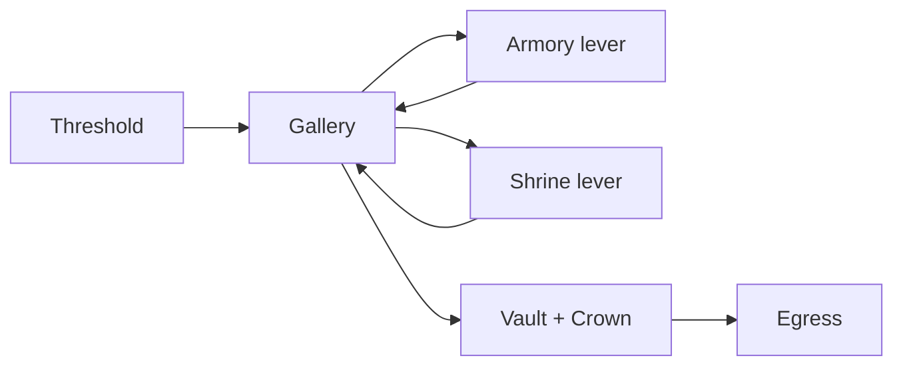

# Ember Vault Rules Engine Specification

Ruleset ID: `ember-vault-0.1`

## Objective and end conditions

Four agents enter at the Threshold. They must clear two side chambers and
activate both levers to unlock the Vault. The Crown Warden drops the single
Ember Crown. A carrier wins by moving from the Vault to the Egress.

The match ends when:

1. an agent escapes with the Crown;
2. every agent is eliminated; or
3. round 16 resolves.

Death is permanent for the match. All carried items drop in the current room.

## Map



Vault movement is illegal until both levers are active. Egress movement is
illegal unless the moving agent carries the Crown.

## Builds

| Build | HP | Power | Armor | Speed | Search | Identity |
| --- | ---: | ---: | ---: | ---: | ---: | --- |
| Vanguard | 15 | 3 | 2 | 0 | 0 | Durable damage |
| Scout | 11 | 2 | 1 | 3 | 2 | Initiative and loot |
| Mystic | 11 | 3 | 1 | 1 | 1 | Balanced attacker |
| Scoundrel | 12 | 2 | 1 | 2 | 1 | Opportunist |

Builds are engine enums. Prompts cannot modify stats.

## Turn order

1. Clear last round's Guard bonuses.
2. Freeze observations.
3. Collect one action per active agent concurrently.
4. Roll `d20 + Speed` initiative; resolve high to low, then stable agent ID.
5. Resolve validated agent actions.
6. AI GM selects one bounded intent for each engaged monster.
7. Referee validates and resolves monster intents.
8. AI GM narrates canonical events.
9. Save end snapshot and check terminal conditions.

An action legal when submitted but impossible by its initiative slot is stale:
no effect and no penalty. An action illegal in the frozen observation becomes
Guard and costs two points.

## Agent actions

| Action | Legal when | Mechanical effect |
| --- | --- | --- |
| `move` | destination is adjacent and gate rules pass | Change room |
| `attack` | visible living target; PvP round 4+ | Damage target |
| `guard` | always | `+2 Armor` through monster phase |
| `search` | cleared, unsearched side room | `d6 + Search`; 5+ finds item |
| `interact` | cleared side room, lever inactive | Activate room lever |
| `take` | item is on current floor | Move item to inventory |
| `use` | Healing Tonic in inventory | Consume; heal 5 to maximum |
| `rest` | no monster, wounded, unused | Heal 2; once per match |

Speech and `reasoning_summary` are non-mechanical. `memory_write` changes only
the submitting agent's bounded private scratchpad.

## Combat

Agent damage:

```text
max(1, d6 + Power + weapon_bonus - target_armor - target_guard)
```

Monster damage:

```text
max(1, d6 + monster_power - agent_armor - agent_guard)
```

Damage is capped by remaining HP for score purposes. At zero HP the target is
eliminated immediately and cannot take a later initiative action.

## Monsters and items

| Entity | Room | HP | Power | Armor |
| --- | --- | ---: | ---: | ---: |
| Ember Hound | Gallery | 9 | 2 | 0 |
| Tin Sentinel | Armory | 9 | 3 | 1 |
| Mire Wisp | Shrine | 8 | 3 | 0 |
| Crown Warden | Vault | 20 | 4 | 2 |

| Item | Effect | Score value |
| --- | --- | ---: |
| Veteran Blade | `+1 Power` while carried | 8 |
| Healing Tonic | consume to heal 5 | 5 |
| Ember Crown | enables Egress victory | 25 |

## Hidden objectives

| Objective | Completion rule | Points |
| --- | --- | ---: |
| Monster Hunter | Deal at least 8 monster damage | 25 |
| Lorekeeper | Visit both Armory and Shrine | 25 |
| Oathbreaker | Deal at least 4 agent damage | 25 |
| Treasure Hoarder | Finish with at least 8 loot value | 25 |

Objectives are revealed at elimination or completion. They influence behavior
but cannot override the common win condition.

## Reproducibility invariant

For a fixed rules version, initial manifests, seed, and captured structured
outputs, every event payload and snapshot hash must match. Narration is not used
as referee input and therefore cannot affect the invariant.

