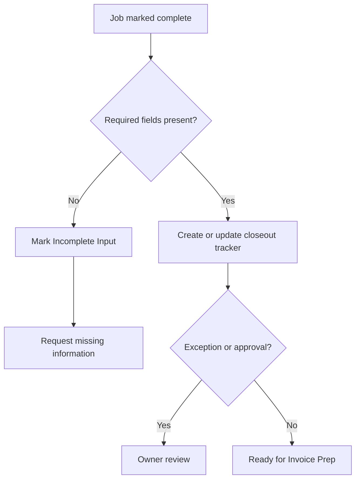
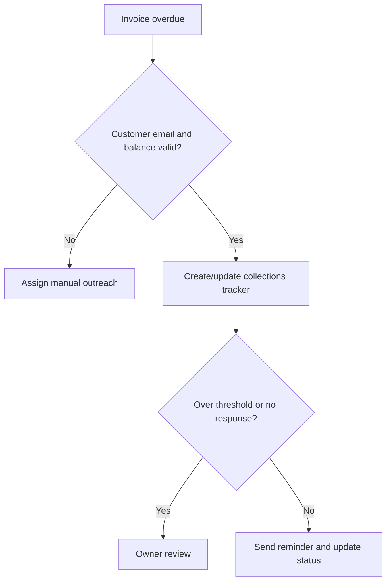
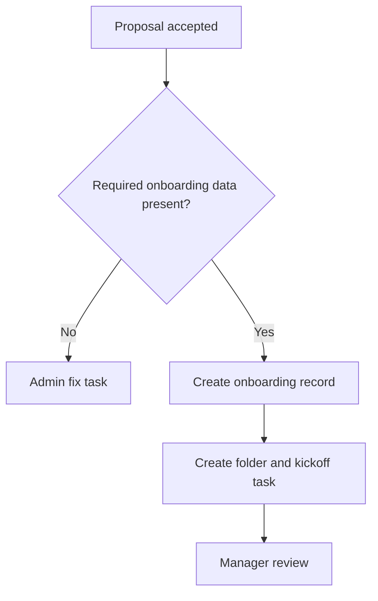
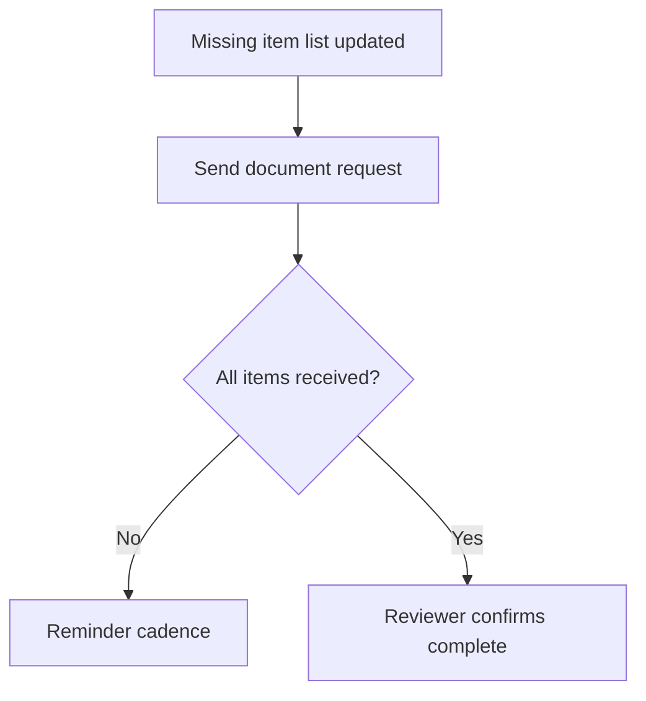
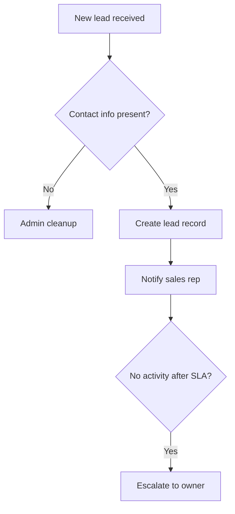
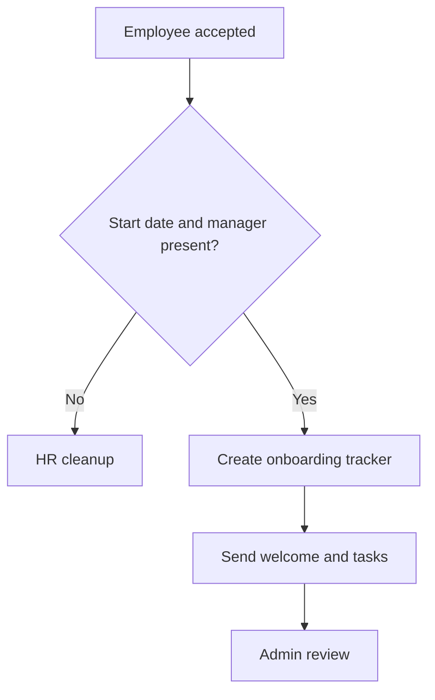

# Automation Builder Sample Blueprints

These examples show concrete, client-ready Automation Builder outputs. They are planning documents only; the app does not connect to or run automations in outside systems.

## Field service — Job Closeout to Invoice Prep

**Client:** GreenSide Landscaping  
**Industry:** Home services  
**Category:** Field service  
**Status:** Ready to Review

### Automation Summary
Standardize how completed jobs are captured, reviewed, and handed to the office for closeout or invoice prep.

### Business Problem Being Solved
Crew leaders finish jobs, but the office receives inconsistent notes and missing photos. This delays invoicing and causes missed billable extras.

### Trigger
Job marked complete.

### Required Inputs
- Job ID
- Customer name
- Job address
- Completion date
- Photos or proof
- Crew notes

### Source of Truth
Google Sheet job closeout tracker.

### Systems Involved
- Google Forms
- Google Sheets
- Google Drive
- Gmail

### Roles Involved
- Field lead
- Admin
- Owner

### Automation Flow
1. Crew lead submits the closeout form.
2. A closeout tracker record is created or updated.
3. Required photos and notes are checked.
4. Admin receives notification.
5. Exceptions route to owner review.
6. Complete records move to `Ready for Invoice Prep`.

### Exception Rules
- Missing photo / proof -> hold closeout and request missing proof.
- Missing required field -> mark `Incomplete Input` and notify admin.
- Owner approval required -> route before invoice prep.

### Human Review Points
Owner reviews records with scope changes, missing proof, or billable extras.

### Data Fields Needed
job_id, customer_name, address, crew_lead, completion_date, photos_url, closeout_status

### Recommended Tool Stack
Google Forms + Google Sheets + Google Drive for low-friction mobile intake and team-owned tracking.

### Complexity
**Medium** — multiple systems, file uploads, exception handling, and owner review.

### Impact
**High** — improves invoice speed and reduces missed revenue.

### First Version Scope
Build the closeout form, tracker, required-field checks, admin notification, and owner review flag. Do not automate invoice creation yet.

### Manual Fallback
Crew lead texts admin and admin enters the closeout in the tracker.

### Implementation Checklist
- [ ] Confirm trigger and source channel
- [ ] Create closeout form
- [ ] Create closeout tracker sheet
- [ ] Add required photo and notes fields
- [ ] Configure admin notification
- [ ] Test missing-photo exception

### Client-facing Summary
This automation creates a cleaner handoff between crews and the office so completed jobs move to invoice prep faster and with fewer missing details.

### Next Best Automation
Invoice-ready closeout record -> invoice preparation and customer follow-up reminder.

### Mermaid Flowchart

## Billing / collections — Overdue Invoice Reminder and Escalation

**Client:** Northside Therapy Group  
**Industry:** Medical/admin  
**Category:** Billing / collections  
**Status:** Ready to Review

### Automation Summary
Standardize overdue invoice reminders, tracker updates, and escalation for aged balances.

### Business Problem Being Solved
Overdue invoices are followed up inconsistently, aging reports are checked manually, and owners get pulled in too late.

### Trigger
Invoice overdue.

### Required Inputs
- Invoice number
- Customer name
- Amount due
- Due date
- Email address
- Reminder count

### Source of Truth
Airtable collections tracker.

### Systems Involved
- QuickBooks
- Airtable
- Gmail
- Zapier

### Roles Involved
- Admin
- Owner
- Customer / client

### Automation Flow
1. Overdue invoice enters the tracker.
2. First reminder is sent.
3. Reminder count and last-contact date update.
4. High balances route to owner review.
5. Paid records close automatically or through review.

### Exception Rules
- Amount over threshold -> owner approval before further reminders.
- Duplicate record -> update existing tracker row.
- No response after SLA -> escalate to owner.

### Human Review Points
Owner reviews large balances, disputed accounts, and third-reminder cases.

### Data Fields Needed
invoice_number, customer_name, amount_due, due_date, age_bucket, reminder_count, payment_status

### Recommended Tool Stack
QuickBooks + Airtable + Zapier + Gmail.

### Complexity
**Medium** — accounting data, tracker, branching, and threshold review.

### Impact
**High** — directly improves collections consistency and owner visibility.

### First Version Scope
Automate first and second reminders plus tracker updates. Keep disputes manual.

### Manual Fallback
Admin reviews the aging report weekly and sends manual reminders.

### Implementation Checklist
- [ ] Define overdue trigger rule
- [ ] Create collections tracker
- [ ] Draft reminder templates
- [ ] Configure escalation threshold
- [ ] Test duplicate invoice handling

### Client-facing Summary
This automation standardizes reminder timing and separates routine follow-up from accounts needing owner attention.

### Next Best Automation
Paid invoice -> receipt notification and cash application update.

### Mermaid Flowchart

## Client onboarding — Signed Proposal to Kickoff Setup

**Client:** BrightPath Advisory  
**Industry:** Professional services  
**Category:** Client onboarding  
**Status:** Ready to Review

### Automation Summary
Turn an accepted proposal into a tracked onboarding flow with folder setup, kickoff communication, and internal tasks.

### Business Problem Being Solved
New clients are won, but setup steps happen inconsistently and kickoff emails vary by person.

### Trigger
Proposal accepted.

### Required Inputs
Client name, email, service package, start date, assigned manager.

### Source of Truth
Zapier Table onboarding tracker.

### Systems Involved
Zapier, Zapier Tables, Gmail, Google Drive, CRM.

### Roles Involved
Sales rep, admin, owner, customer/client.

### Automation Flow
1. Proposal accepted creates onboarding record.
2. Client folder is created.
3. Kickoff email is drafted or sent.
4. Internal tasks are created.
5. Missing manager or duplicate client routes to review.

### Exception Rules
Missing required field -> stop client communication and assign admin fix. Duplicate record -> update existing onboarding record.

### Human Review Points
Manager reviews service package and custom scope before kickoff email is finalized.

### Data Fields Needed
client_name, contact_email, service_package, assigned_manager, folder_link, onboarding_status

### Recommended Tool Stack
Zapier + Zapier Tables + Gmail + Google Drive + CRM.

### Complexity
**Medium** — several systems and time-sensitive handoffs.

### Impact
**High** — improves first impression and internal readiness.

### First Version Scope
Automate record creation, folder setup, kickoff email, and notification. Keep custom document assembly manual.

### Manual Fallback
Admin creates folder and sends kickoff email manually from a template.

### Implementation Checklist
- [ ] Create onboarding tracker
- [ ] Create folder naming convention
- [ ] Draft kickoff email
- [ ] Configure manager notification
- [ ] Test duplicate client route

### Client-facing Summary
This automation ensures each signed client moves into a predictable onboarding flow with faster setup and fewer missed steps.

### Next Best Automation
Document received -> update onboarding status and notify the assigned manager.

### Mermaid Flowchart

## Document collection — Missing Document Review Queue

**Client:** Harbor Tax & Advisory  
**Industry:** Professional services  
**Category:** Document collection  
**Status:** Ready to Review

### Automation Summary
Track requested documents, reminder follow-ups, and review readiness.

### Business Problem Being Solved
Requested documents arrive through scattered email threads and staff lose track of what remains missing.

### Trigger
Status changed to missing documents.

### Required Inputs
Client, email, requested items, due date, assigned reviewer, folder link.

### Source of Truth
Airtable document request base.

### Systems Involved
Airtable, Google Drive, Gmail.

### Roles Involved
Admin, staff reviewer, client.

### Automation Flow
1. Missing-items record is created.
2. Client receives request email.
3. Uploads attach to the record or folder.
4. Reviewer checks completeness.
5. Incomplete records receive reminders.

### Exception Rules
Missing document -> keep status `Waiting on Client`. Duplicate record -> reviewer confirms latest version. No response after SLA -> escalate to staff.

### Human Review Points
Admin review confirms completeness before work begins.

### Data Fields Needed
client_name, email, requested_items, received_items, due_date, completeness_status, folder_link

### Recommended Tool Stack
Airtable + Gmail + Google Drive.

### Complexity
**Medium** — attachments, reminder cadence, and review queue.

### Impact
**High** — reduces lost follow-up and speeds file completion.

### First Version Scope
Automate request records, email sends, reminder cadence, and review queue. Do not automate document classification.

### Manual Fallback
Staff sends manual missing-item email and updates the tracker.

### Implementation Checklist
- [ ] Create request base
- [ ] Add upload/status fields
- [ ] Create request email
- [ ] Build reminder rule
- [ ] Create review queue view

### Client-facing Summary
This automation turns document chasing into a visible queue with consistent reminders and a cleaner completeness check.

### Next Best Automation
Complete document package -> start production or review checklist.

### Mermaid Flowchart

## Sales follow-up — New Lead Response Queue

**Client:** Apex Kitchen & Bath  
**Industry:** Home services  
**Category:** Sales follow-up  
**Status:** Ready to Review

### Automation Summary
Capture new leads, assign ownership, and ensure timely follow-up.

### Business Problem Being Solved
Leads come in from forms and calls, but follow-up timing is inconsistent and ownership is unclear.

### Trigger
New lead received.

### Required Inputs
Lead name, phone, email, service interest, lead source, assigned rep.

### Source of Truth
Zapier Table lead tracker.

### Systems Involved
Zapier, CRM, Gmail, Slack.

### Roles Involved
Sales rep, owner, customer/client.

### Automation Flow
1. New lead creates tracker record.
2. Lead is pushed to CRM.
3. Assigned rep receives notification.
4. Confirmation email is sent.
5. No contact after SLA escalates to owner.

### Exception Rules
Missing required field -> admin cleanup. Duplicate record -> update existing lead. No response after SLA -> escalate to owner.

### Human Review Points
Owner reviews stale or high-value leads.

### Data Fields Needed
lead_name, email, phone, lead_source, service_type, assigned_rep, follow_up_deadline, status

### Recommended Tool Stack
Zapier + Zapier Tables + CRM + Slack.

### Complexity
**Medium** — multiple systems plus SLA escalation.

### Impact
**High** — improves lead response speed and protects revenue.

### First Version Scope
Automate capture, assignment, notification, and stale-lead reminders. Keep quoting logic manual.

### Manual Fallback
Admin sends a daily lead list and assigns reps manually.

### Implementation Checklist
- [ ] Create lead intake form
- [ ] Create lead tracker
- [ ] Add rep assignment field
- [ ] Add SLA reminder rule
- [ ] Push basic lead data to CRM

### Client-facing Summary
This automation reduces lead leakage by making sure each inquiry is logged, owned, and followed up within an agreed response window.

### Next Best Automation
Appointment set -> estimate or proposal follow-up sequence.

### Mermaid Flowchart

## Employee onboarding — New Hire Setup Readiness

**Client:** Harbor Home Care  
**Industry:** Medical/admin  
**Category:** Employee onboarding  
**Status:** Ready to Review

### Automation Summary
Turn an accepted employee into a tracked setup workflow for paperwork, access, scheduling, and manager readiness.

### Business Problem Being Solved
After a hire accepts, paperwork, account access, and manager setup tasks are tracked in email and memory.

### Trigger
Employee accepted.

### Required Inputs
Employee name, email, role, start date, manager, location.

### Source of Truth
Zapier Table onboarding tracker.

### Systems Involved
Zapier, Gmail, Google Drive, HR app, Slack.

### Roles Involved
HR, owner, employee.

### Automation Flow
1. Accepted employee creates onboarding tracker record.
2. Welcome email and paperwork instructions are sent.
3. Manager receives readiness checklist.
4. IT/admin receives access tasks.
5. Status moves toward `Ready for Day One`.

### Exception Rules
Missing required field -> stop schedule-dependent tasks. No response after SLA -> reminder and escalation.

### Human Review Points
Admin review confirms paperwork and manager readiness.

### Data Fields Needed
employee_name, email, role, start_date, manager, paperwork_status, access_status, onboarding_status

### Recommended Tool Stack
Zapier Tables + Gmail + Google Drive + HR app.

### Complexity
**Medium** — multiple teams and deadline-sensitive tasks.

### Impact
**High** — reduces first-day setup gaps and HR/admin rework.

### First Version Scope
Automate tracker creation, welcome communication, manager checklist, and paperwork reminders. Keep payroll/account provisioning manual.

### Manual Fallback
HR sends welcome packet manually and tracks progress in a spreadsheet.

### Implementation Checklist
- [ ] Create new-hire tracker
- [ ] Draft welcome email
- [ ] Build paperwork reminder rule
- [ ] Create manager readiness checklist
- [ ] Create IT/admin task notifications

### Client-facing Summary
This automation makes onboarding visible and deadline-driven so new hires arrive with fewer missing forms and clearer accountability.

### Next Best Automation
Day-one complete -> 30-day check-in and training follow-up workflow.

### Mermaid Flowchart

