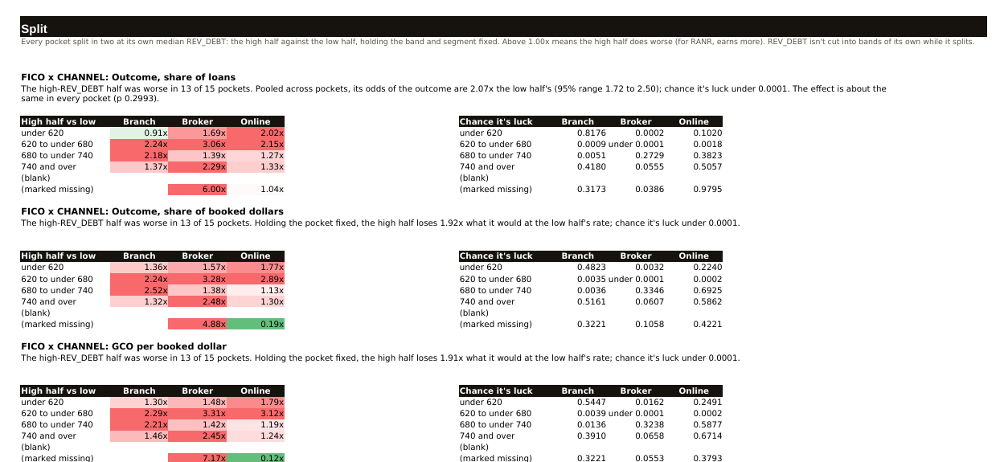
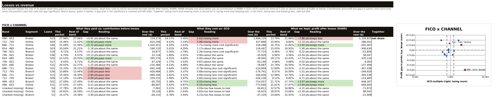
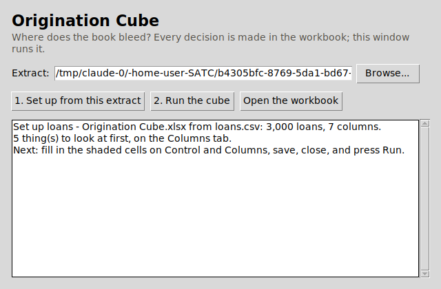

# Origination Cube

**Where does the book bleed?** The tool takes a loan extract and a short cube
file. It cuts the loans by bands (a score band, say) against dimensions (the
channel, say), and compares every pocket's rate with the whole book's
(the topline). The pockets that lose more than their share come out at the
top of a list, in dollars.

This replaces a set of Excel macros that did the same job slowly and kept
breaking their own rules. `docs/vba-findings.md` lists each of those breaks and
the test that stops it coming back. The macros were only a source of ideas, so
this is not a port and the workbook will be designed from scratch.

**Where it's going:** `docs/design.md` sets out the three stages (find, drill,
prove), the Control tab, and the firm's rulings of 25 Sep. The Control tab is
built (`cube control --out control.xlsx`); the rest of the workbook is not.

**Status (25 Sep 2026):** the engine, the per-pocket test, `cube init` and the
Control tab are built. The workbook's other tabs, drill-down and `cube prove`
are designed, not built. Nothing here has met a real extract. Log:
`../BACKLOG.md` §6d.

## What an extract must carry

A loan or application number (`key:`), the booked amount (`booked:`), a yes/no
outcome (`outcome:`), GCO dollars (`gco:`) and RANR dollars (`ranr:`). The run
refuses without any of them. From those it builds four core rates on every
run:
- the outcome as a share of loans (straight)
- the outcome as a share of booked dollars (weighted)
- GCO per booked dollar
- RANR per booked dollar

## Using it (no commands)

One-time setup: install Python 3.10 or later from python.org. The cube also
needs three add-ons for Python:
- **numpy**, for the statistics
- **openpyxl**, to read and write Excel files
- **PyYAML**, for its settings files

The window checks for them each time it opens. If any is missing, it says
which and offers **Install now**. If the bank's network blocks the download,
it gives you a note for IT, and **Copy for IT** copies it.

To install them by hand, run this once in a Command Prompt (`py` is the
Python starter that python.org installs). `Install add-ons.bat` in this folder
runs the same thing:

```
py -m pip install --user --upgrade numpy openpyxl PyYAML
```

After that, the whole routine is:

1. Double-click **`Origination Cube.pyw`**. A small window opens.
2. Pick the extract (the loan file from the bank, .csv or .xlsx) and press
   **1. Set up from this extract**. A workbook appears beside the extract.
3. Open the workbook and follow its **Start here** tab:
   - **Control:** fill in the shaded cells. Those are our calls: what's
     material, how many loans is enough, how much worse counts.
   - **Columns:** check what each column is. Anything shaded has its reason
     beside it. Fix any that's wrong from the dropdown, then set "Checked
     every column" to Yes.
   - **Look:** each number column's smallest, median and largest value, its
     most-repeated values, its blanks and codes, and a histogram. Read it
     before typing band edges on Columns.
   - **Odd values:** answer real or missing where you can.
4. Save, close the workbook, and press **2. Run the cube**. The results land in
   the workbook:
   - **Where it bleeds:** every pocket losing more than its share, largest first.
   - **Losses vs revenue:** GCO and RANR together. Each side reads more, about
     the same, or less by the lines you set on Control, so every pocket lands
     in one of nine boxes. There's one chart per grid.
   - **Grids:** heat maps against the book and against the rest of the band.
   - **Split** and **Three-way:** only when a column splits the pockets (below).
   - **Materiality:** what each materiality level would keep.
   - **Check:** settings, tie-outs, and what was left out.
   - **Log:** every run and refusal.

**Going a layer deeper.** On Columns, set one column's *Split pockets by it?*
to Yes. A number (revolving debt, say) splits every FICO-by-asset-class pocket
at that pocket's own median, and the Split tab compares the high half with the
low half, pocket by pocket and pooled. Each grid says what it holds fixed:
revolving debt moves with FICO, so a loan-size grid can't tell debt from score,
and it says so with the number. A category repeats each grid once per value.
Either way, every three-way pocket is tested and ranked on the **Three-way**
tab. *Show per pocket* puts a column's median or average in every pocket.
After a Run, the Look tab plots a split number against each band column, so
you can see whether it only re-sorts the band.





If something needs fixing, the window and the Log tab say what and where, in
words, e.g. *Control!C16: "Smallest excess loss worth reporting" needs an
answer.* Press Set up again at any time: answers already given are kept.
What you confirm is remembered for next time; the **Learned** tab lets you set
anything wrongly learned to Forget.



**What an extract must carry:** a loan or application number, the booked
amount, a yes/no outcome, GCO dollars and RANR dollars. From those, every run
builds:
- the outcome as a share of loans (straight)
- the outcome as a share of booked dollars (weighted)
- GCO per booked dollar
- RANR per booked dollar (RANR is revenue, so less of it is the bleed)

**What each pocket carries:**
- its rate
- its rate over the book's rate
- the excess (or, for RANR, the shortfall) in dollars
- a test against the rest of the book and the rest of its band, after the
  allowance for testing many pockets at once
- whether it clears the materiality line
- the smallest gap its size could show

### Underneath (for whoever maintains it)

The same engine is behind a command line, which the tests use:
- `cube synth`
- `cube init`
- `cube validate`
- `cube run`
- `cube control`
- `cube memory`

`tools/shoot_launcher.py` photographs the window in each state on a virtual
display.

## Checking it

```
pytest -q                          # 385 tests: one per finding, every worked example in docs/statistics.md, every Control answer applied, the workbook route, the split, the launcher, the pre-spec, the add-on check, the Look tab, dates, the outcome window and new columns (the one that opens the window skips without a display)
python tools/mutation_check.py     # puts 119 bugs back (the VBA's and today's rules); every one must be caught
```

**Speed** (this container, 25 Sep 2026, pure Python):

- 1,000,000 loans through one grid and five measures: 6.7 s to read the CSV
  plus 19.6 s for the cube.
- At 200,000 loans: 3.5 s for 1 grid, 5.3 s for 4, 8.2 s for 9, so each extra
  grid adds about 0.6 s.
- By extrapolation, not measured: a million loans through 25 grids would take
  about a minute and a half. numpy would cut that to seconds, if the machine at
  the bank has it.
- The shuffle test for the dollar rates (numpy, 10,000 shuffles; 26 Sep 2026)
  is on top of that, and grows with the loans: the 8,000-loan synthetic book's
  6 grids went from 0.3 s to 6.5 s in the engine (a whole Run, 2.9 s to 7.9 s),
  and at 40,000 loans from 1.4 s to 33 s. Each shuffle is one pass over the
  loans per dollar rate, for the rest of the book and once per band column, so
  by extrapolation, not measured, 200,000 loans would take about 3 minutes.
