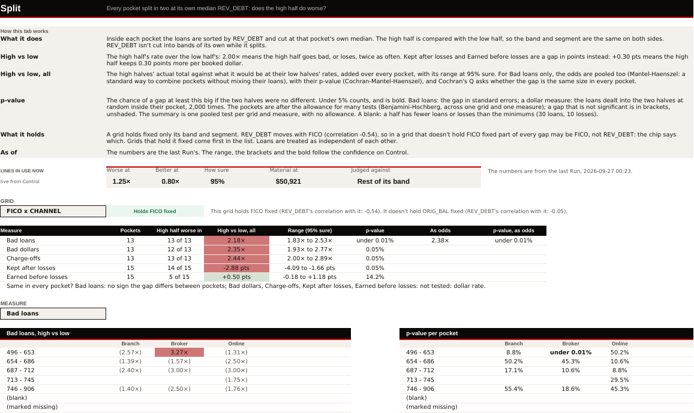

# Origination Cube

**Where does the book bleed?** The tool takes a loan extract and a short cube
file. It cuts the loans by bands (a score band, say) against dimensions (the
channel, say), and compares every pocket's rate with the whole book's
(the topline). The pockets that lose more than their share come out at the
top of a list, in dollars.

This replaces a set of Excel macros that did the same job slowly and kept
breaking their own rules. `docs/vba-findings.md` lists each of those breaks and
the test that stops it coming back. The macros were only a source of ideas, so
this is not a port, and the workbook was designed from scratch.

**Where it's going:** `docs/design.md` sets out the three stages (find, drill,
prove) and the firm's rulings.

**Status (26 Sep 2026):**
- **Built:** the first stage, find. That means the engine, the launcher and the
  whole workbook: Set up, Control, Columns and every results tab below. Also the
  confirmatory test of a new column from a committed pre-spec, on development
  loans and on the holdout (capabilities 4b and 4e in
  `docs/capabilities-scope.md`).
- **Not built:** drill-down, `cube prove`, and scouting (4a).
- **Not yet met:** a real extract.

The log is `../BACKLOG.md` §6d.

## What an extract must carry

For where the book bleeds: a loan or application number (`key:`), the booked
amount (`booked:`), a yes/no outcome (`outcome:`), GCO dollars (`gco:`) and
RANR dollars (`ranr:`). The run refuses without any of them. For a test of a
new variable, only what the test uses: the loan number, the outcome, the
origination date, the column tested and the pre-spec's strata. Every loan in
the extract is run: none is left out for how old it is or when it went bad, so
choose the period before the extract reaches the cube. From the five it builds
five core rates:
- the outcome as a share of loans (straight)
- the outcome as a share of booked dollars (weighted)
- GCO per booked dollar
- profit after losses: RANR per booked dollar
- contribution before losses: RANR + GCO per booked dollar

## Using it (no commands)

One-time setup: install Python 3.10 or later from python.org. The cube also
needs three add-ons for Python:
- **numpy**, for the statistics
- **openpyxl**, to read and write Excel files
- **PyYAML**, for its settings files

The window checks for them each time it opens. If any is missing, it says
which and offers **Install now**. If the bank's network blocks the download,
it gives you a note for IT, and **Copy for IT** copies it.

To install them by hand, run this once in a Command Prompt (`py` is the
Python starter that python.org installs). `Install add-ons.bat` in this folder
runs the same thing:

```
py -m pip install --user --upgrade numpy openpyxl PyYAML
```

After that, the whole routine is:

1. Double-click **`Origination Cube.pyw`**. The **PocketBook** window opens
   (the redesign of 26 Sep 2026, `docs/redesign-2026-09-26/`): five steps down
   the left, one job on the right.
2. **Extract.** Pick the loan file from the bank (.csv or .xlsx). The box under
   it holds the two limits Set up reads the columns with (a number column with
   12 values or fewer is a category; a text column with more than 50 is too
   fine to cut by). They sit here because they are needed before the workbook
   exists. Press **Set up from this extract**: it reads what each column is and
   writes nothing.
3. **Choose tests.** First, what you're running:
   - *Where the book bleeds:* tick the number columns to **cut into bands**,
     the categories to **segment by**, and at most one number column to
     **split every pocket by**. Every number column and every category starts
     ticked. The outcome and dollar columns go into every measure. It needs
     the five columns below and no date.
   - *Test new variables:* pick the outcome, tick the inputs to **test**, and
     the columns to **hold fixed** (a column is one or the other). Or confirm a
     saved shortlist: **Browse** to the committed pre-spec file, which then
     decides the inputs and what is held fixed (below). It needs the loan
     number, the outcome and a column marked *Origination date*; the booked
     amount, GCO and RANR only if the extract has them.

   The box underneath says what will run. **Next: answer in the workbook**
   writes the workbook beside the extract as *loans - PocketBook.xlsx*.
   Control shows these choices read-only, under *Chosen in the launcher*; to
   change one, go back to Choose tests (press it on the left) and Next again.
   Answers already given are kept.
4. **Answer in workbook.** The four red tabs are the ones you fill in. Each
   opens with a title band and one note, *How this tab works*, that folds away
   with the outline's minus. **Start here** counts what is left, live: answers
   still needed, columns to confirm, odd values to answer, and changes waiting
   for a Run (with a pink line naming each one); after a Run it shows what the
   Run found and the five largest pockets, worse and material.
   - **Control:** three blocks. *Changes now* (solid boxes) holds the lines the
     result tabs read by formula: worse at, better at, the profit line, how
     sure, materiality and what a pocket is judged against; *Comes to* shows
     what an answer amounts to (materiality in dollars). *Needs a Run* (dashed
     boxes) holds the answers that decide which pockets exist; its *Status*
     says "Waiting for a Run" where an answer differs from the last Run's.
     *Chosen in the launcher* is read-only. Pink cells still need an answer,
     and nothing is picked for you. Beside fewest loans, worse at and better
     at, the value worked out from this extract ("suggested: 69, from this
     extract"). On the right, what each materiality level keeps, live. A test
     of a new variable isn't asked the profit line.
   - **Columns:** one row per column: what it is, why it was suggested, its
     odd values with *Treat as* (Real or Missing) beside them, band edges, and
     whether it is remembered, with *Forget?*. Set "Checked every column" (C3)
     to Yes; Run waits until it is. Under the table, *Add a column: one
     divided by another*. For a new variable, mark the date each loan was made
     *Origination date*: it splits development loans from the holdout.
   - **Look:** each number column's loans, blanks, likely code (on a red bar
     of its own), smallest, median, mean and largest, and its bars. Pick 10,
     20 or 50 bars and a From and To, and the chart regroups live; the edges
     typed on Columns show as red dashed lines as you type them. With a split,
     a scatter of it against each band column.
5. **Run.** Save, close the workbook, and press **Run**. If anything
   still needs an answer, the window lists each one by its tab and cell, with
   the question in words and **Open at C23**, which opens the workbook at that
   cell. While the workbook is open in Excel it says so, and Run waits. When
   the Run finishes, it shows how many pockets are worse and material on
   charge-offs, what they lost above their share, the tie-out checks, and any
   odd value still unanswered. The results land in the workbook:
   - **New variables:** only when testing from a pre-spec (below).
   Every result tab opens the same way: a title band, one *How this tab works*
   note that folds away (tenet T1: how a figure was worked out is said once,
   never beside every row), the lines in use now as tiles read from Control,
   then dropdowns, then result rows. The dropdowns stand in for the redesign's
   slicers (a spreadsheet written by Python can't keep a slicer); each picks
   what the tab shows by formula (design decision OC-43).
   - **Pockets:** every pocket losing more than its share. Pick the **Measure**
     (Bad loans, Bad dollars, Charge-offs, Kept after losses, Earned before
     losses), the **Pockets** (two-way, or split by the split column) and
     **Show** (all, worse and material, worse or not sure); the caption counts
     "N worse and material · N worse · N shown". Each row: the pocket, its
     loans, its rate and the rest's, the gap, the excess, **Worse?** (Yes, Not
     sure, No, Too few losses) and **Material?** (Yes, No) in separate columns,
     the p-value, and the smallest gap a pocket its size could have caught.
     Control's *Judged against* picks the rest: every other loan in its band,
     or every other loan in the book, for the gap and the dollars alike
     (OC-44). The worse pockets come first, largest dollars first; the order
     is the last Run's, the verdicts and dollars are live. On the split view,
     pockets from grids that don't hold the split's partner fixed come last, in
     grey, reading "No: may be mostly FICO".
   - **Paid, cost, kept:** one grid at a time (a Grid dropdown). What each
     pocket paid (earned before losses: RANR + GCO), what it cost (charge-offs)
     and what was kept (RANR), each as its gap and dollars; pink where worse and
     real, green where better and real. **Together** reads the pair: priced for
     it, net drain, strong, safe but idle, or earns less, not from losses. A
     scatter of the grid picked: charge-offs across on a log scale, what was
     kept up, lines at 1× and 0, the pockets read together named.
   - **Grids:** a Grid and a Measure dropdown, and four blocks: the rate,
     against the book, against the rest of its band (heat in the redesign's
     tokens, 2× and over deepest) and the loans (shaded by share, no red or
     green). Under them, how many loans and booked dollars fall in each group
     of the split column or a new column, pocket by pocket: a count, not a test
     (it was the Prevalence tab). The split grids are in the Grid list too.
   - **Split:** only when a number column splits the pockets (below). A Grid
     dropdown and a chip saying whether it holds the split's partner fixed; the
     summary for every measure; whether the gap is the same in every pocket; and
     two grids side by side for the measure picked: high against low, and its
     p-value.
   - **Record** (grey tab; it merges Check and the Log): six sections in three
     pairs, read across. *This Run*: the extract, the loans run, what was run,
     the band edges, the split, the range of origination dates (so a wrong
     extract shows on the first page) and, for a pre-spec, the file, its
     commit and fingerprint and every held-back run on it. *Settings*: every
     setting the run asked, the answer in use now beside what the last Run
     used, shaded while they differ. *Does it add up*: the tie-outs, how many
     pockets read worse now and how many are material, the pocket budget (the
     book's bad loans ÷ 5: the most pockets a grid can test) with each grid's
     count and coverage, and the values worked out from the book. *Tests
     used*: which test gave each p-value, the words the tabs use, which
     comparison decides each pocket and how a profit reading is worded, how
     many families of tests the run holds. *Left out*: what each rate left
     out (a blank or unreadable value, never a loan's age), and each open data
     question. *Every Run, newest first*: every run and refusal, what each was,
     and whether it followed its pre-spec and touched the holdout. The entries
     are kept on the hidden `_log`, so a refusal shows at once; an older
     workbook's Log carries on there.

**Changing the lines after a Run** (the firm, 26 Sep 2026: *"this is the stuff
i want to be able to adjust in book on the fly ... i know it cannot reband and
such"*). Five answers on Control only judge numbers the Run has already worked
out, so they are Excel formulas: the loss line (how much worse, how much
better), the profit line, materiality, the confidence level, and what a pocket
is judged against. Change one on Control and every reading, flag, dollar
figure, "is material" and colour on the result tabs follows at once, with no
Run. The p-values don't depend on the confidence level (the tests and both
allowances for many tests are worked out without it), so only the bar they are
compared with moves: one cell, `ROUND(1 - confidence, 12)`. Everything else
takes effect on the next Run: band edges, segments, the split, fewest loans
and fewest losses, the shuffles, the allowance for many tests, the catch rate
and what you're running. Control's last column says which.
- Each result tab shows the lines it is using now as tiles, and says under them
  when a change on Control waits for a Run.
- Left as of the last Run, and said so on each tab: the order of the rows, the
  smallest gap a pocket could have caught, the heat maps, Record's other counts,
  and a suggested line worked out from the book (it keeps the multiple the Run
  worked out; Run again to work it out at a new confidence level). The scatter
  on Paid, cost, kept is drawn from the table's own cells, so it follows too.
- The formulas work in Excel 2016 and in LibreOffice: nothing needs Microsoft
  365's `SORT` or `FILTER`. They read hidden sheets: `_live` (each line as a
  number), `_pockets` (every pocket's numbers from the Run, and the formulas
  that judge them), `_list` (Pockets' rows in the Run's order, and which the
  dropdowns show) and `_views` (every other number, one keyed row each). Unhide
  any of them to follow a reading back to Control.

**Going a layer deeper.** In the launcher's Choose tests, pick one column
under *Split pockets by*. A number (revolving debt, say) splits every FICO-by-asset-class pocket
at that pocket's own median, and the Split tab compares the high half with the
low half, pocket by pocket and pooled. Each grid says what it holds fixed:
revolving debt moves with FICO, so a loan-size grid can't tell debt from score,
and it says so with the number. A category repeats each grid once per value.
Either way, every split pocket is tested and ranked on **Pockets** (pick
*Split by* in its Pockets dropdown). *Show per pocket* puts a column's median or average in every pocket.
The Look tab plots a split number against each band column, so you can see
whether it only re-sorts the band.



**A confirmatory run.** A column scouted on development loans (income over
sales, say) is tested once, on loans kept back, with settings written down and
committed to git beforehand: the pre-spec (`docs/prespec-example.yaml`; the
format is in `src/origination_cube/prespec.py`). In the launcher, choose *Test
new variables* and **Browse** to that file under *Or confirm a saved
shortlist*; Control shows it under *Chosen in the launcher*. A file that isn't
there or can't be read stops the Run, naming the cell, and so does a pre-spec
whose column isn't on Columns, or a pre-spec named for Where the book bleeds.
Without a saved shortlist, the Run stops and asks for one. Otherwise Record echoes what it says,
the commit it was read from (or that it isn't committed, or was edited since) and its fingerprint (the
first 12 characters of its SHA-256), and lists, one line each, where the run differs from it; Every Run
marks such a run *Deviates from pre-spec*. Every run whose extract holds loans made in the pre-spec's
holdout range is marked *Touched the holdout*, and Record counts those runs, so how often the holdout
has been looked at stays visible. **Record, don't block** (the firm, 26 Sep 2026): Every Run records
the pre-spec when a Run first reads it (its fingerprint, the date it says it was written and its
commit), and every held-back run after it, in order; a pre-spec changed after a held-back run labels
that run *Changed pre-spec* and Record warns. Nothing is refused for it.

The test itself is on the **New variables** tab (black; it replaces the Confirmatory test tab). The
column is cut at the pre-spec's bins, and each group is compared with its reference group. Each row is
one comparison, a group against the reference: **Found** (the development loans, where the groups came
from), **Confirmed** on the held-back loans with *Holds up?*, **Confirmed with the held-fixed columns**
(the pre-spec's strata: a loan is only compared with loans in its own pocket) with *Still holds?*, then
**Excess** (the group's charge-offs on the held-back loans above its share, scaled to the whole book;
bad loans when the extract has no GCO), **Material?** against Control's line, and **In words** ("Holds
up, and not just FICO and CHANNEL"). A saved shortlist was found elsewhere, so its Found columns are
hidden. A bar chart draws Found, Confirmed and held fixed a comparison, with a dashed line at *worse
at*. Tiles above it: the outcome, the candidates, what is held fixed, the loans found on and held back,
and the materiality line, live. Loans made outside both ranges, or with no readable date, column value
or outcome, are left out of this test only; Record counts them, and every other tab still uses every
loan. Under the chart, the tests in full, with and without the columns held fixed, on each set of
loans:
- **Does the column matter?** The general test (K-group Mantel-Haenszel, on
  K - 1 degrees of freedom), the trend test (1 degree of freedom, the groups
  scored 1 to K), and the regression's block test, with one plain line reading
  them together, e.g. "differs across the groups, but not in one direction".
- **How much more often does each group go bad?** An odds ratio against the
  reference, with its range and p-value, from conditional logistic regression
  (numpy only), and one plain line, e.g. *"On the holdout, 0.02 - 0.09 goes bad
  2.26 times as often as 0.25 - 0.49 (1.22x to 4.18x) ..., with the pockets held
  fixed."*
- **On the holdout only:** each group's share of the loans, of the bad loans
  and, when the extract has GCO, of the GCO, and its bad rate against the
  holdout's (B6). No cost or benefit figures.

The tab says its method once, in its folding note, with the choices no ruling
settles yet. Holds up?, Still holds?, Material?, In words, every "significant",
every range and the chart's worse line follow Control. A pocket too small to read on its own still counts in the
pooled test. A column the pre-spec's strata name must be cut (held fixed in
the launcher), or the Run stops, naming the pre-spec's cell. Record says where the run differs
from the pre-spec. A run that did what its pre-spec says differs nowhere: the
reference group is the pre-spec's, and the holdout is the range the test held
itself to, not the first and last loan in the extract.

A test of a new variable builds none of the bleed analysis: no pocket grid, no
shuffle test, and none of its tabs (Pockets, Paid cost kept, Grids, Split). It writes New variables
and Record. If the workbook still has those tabs from an earlier bleed Run, they are
taken off, and Record says so on one line. Control asks it only what it uses: worse at (the chart's
line, suggested from the confirmation's own groups), materiality, confidence and the bands; the
bleed's other settings are hidden. Start here and the launcher's last
step show the confirmation: how many groups go bad significantly more often than
the reference group on the holdout, their share of its bad loans, and whether
the run followed its pre-spec. On 17,000 loans × 80 columns the Run takes
4.5 s. It took 23.4 s when it also built the grids (design decision OC-42).

On the dated synthetic book (`synth.write_extract(..., ratio=True)`, 20,000
loans) with `docs/prespec-example.yaml`, the run finds both planted cliffs on
development (below 0.10: 2.32x, 1.52x to 3.56x; 2.00 and up: 3.25x, 2.42x to
4.38x) and confirms them on the holdout (2.26x, 1.22x to 4.18x; 2.68x, 1.70x to
4.24x), and Record reads "Differs from the pre-spec: nowhere".

The same holds on a second book the first had no hand in (`tests/test_generic.py`, 12,000 auto
loans): other column names, contract dates written 3/7/2023, other edges and reference group, and
cliffs planted on each loan's odds (x3 below 0.05, x2.5 from 1.50). Both are found on development
and confirmed on the holdout (3.04x and 2.80x). The same loans with no cliff are not confirmed,
though the worst dealer's loans crowd the lowest group and the book as a whole reads a difference
there: the pockets hold it fixed.


If something needs fixing, the window and Record's Every Run say what and where, in
words, e.g. *Control!C19: "Smallest excess loss worth reporting" needs an answer.* The window lists each one
with an **Open at** button that opens the workbook at that cell. Press Next in the launcher again at any time:
answers already given are kept.
What you confirm is remembered for next time; on Columns, set *Forget?* to Yes
on anything wrongly learned.


**What an extract must carry** for where the book bleeds: a loan or
application number, the booked amount, a yes/no outcome, GCO dollars and RANR
dollars (a test of a new variable needs less; above). From those, every such
run builds:
- the outcome as a share of loans (straight)
- the outcome as a share of booked dollars (weighted)
- GCO per booked dollar
- profit after losses: RANR per booked dollar (less of it is the bleed)
- contribution before losses: RANR + GCO per booked dollar (RANR already has
  GCO taken out)

**What each pocket carries:**
- its rate
- its rate against the book's: a multiple, or for profit a gap in points
- the excess (or, for profit, the shortfall) in dollars, twice: over the
  rest of its band and over the book. The comparison picked on Control
  decides; a pocket alone in its band has no band figure and uses the book's
- a test against the rest of the book and the rest of its band, after the
  allowance for testing many pockets at once
- whether it clears the materiality line
- the smallest gap its size could show

### Underneath (for whoever maintains it)

The same engine is behind a command line, which the tests use:
- `cube synth`
- `cube init`
- `cube validate`
- `cube run`
- `cube control`
- `cube memory`

`tools/shoot_launcher.py` photographs the window in each state (L1 to L5)
on a virtual display. The window's rules live in `launcher.Flow`, which knows
nothing of Tk, so `tests/test_launcher.py` drives every state without one. The
colours are `house.py`'s: the bank palette, written once for the cube (a copy
of credit-suite's style file anywhere in the repository fails its conformance
test).

## Checking it

```
pytest -q                          # 641 tests (2 skip without a display; the 22 in test_live.py, 21 in test_result_tabs.py, 6 in test_answer_tabs.py, 3 in test_confirm_test.py, 2 in test_generic.py and 1 in test_run_kind.py skip without LibreOffice): one per finding, the worked examples in docs/statistics.md for every test the cube runs, every Control answer applied, the workbook route, the split, profit after losses (the firm's Tests 2 and 4), the launcher's five steps (every state, without a display), the suggested values on Control before the first Run, the tabs you fill in (Start here, Control in three blocks with Status and the materiality panel, Columns with odd values and memory, Look with live bars, range and edge lines, one load and one save per Run), the pre-spec, the add-on check, the Look tab, the origination date (every loan runs; the range on Check; old lines refused by name) and new columns, the pre-spec checks, the pocket budget, the prevalence table, the tabs' wording, a pocket alone in its band, one comparison deciding the flag, the dollars and materiality, the literal profit wording, and the judging settings live in the workbook (calculated through LibreOffice headless, tests/recalc.py, and held pocket by pocket to the engine run again with each changed setting), Set up reading each thing once (the date gates held to strptime alone over 22,750 values), and the confirmatory test: statistics.md B3 to B6 reproduced, B3 equal to the conditional score test to 1e-9, statsmodels' ConditionalLogit as literals, and the goal's run on the dated synthetic book counted by hand, and on the second book (planted another way, and a copy with no cliff that must not be confirmed), and a test of a new variable run with no booked amount, GCO or RANR while the bleed analysis still refuses one, and a test of a new variable building no grid and writing none of the bleed's tabs
python tools/mutation_check.py     # puts 310 bugs back (the VBA's and today's rules); every one must be caught
```

**Speed** (this container, 25 Sep 2026, pure Python):

- 1,000,000 loans through one grid and five measures: 6.7 s to read the CSV
  plus 19.6 s for the cube.
- At 200,000 loans: 3.5 s for 1 grid, 5.3 s for 4, 8.2 s for 9, so each extra
  grid adds about 0.6 s.
- By extrapolation, not measured: a million loans through 25 grids would take
  about a minute and a half. numpy would cut that to seconds, if the machine at
  the bank has it.
- The shuffle test for the dollar rates (numpy, 10,000 shuffles; 26 Sep 2026)
  is on top of that, and grows with the loans: the 8,000-loan synthetic book's
  6 grids went from 0.3 s to 6.5 s in the engine (a whole Run, 2.9 s to 7.9 s),
  and at 40,000 loans from 1.4 s to 33 s. Each shuffle is one pass over the
  loans per dollar rate, for the rest of the book and once per band column, so
  by extrapolation, not measured, 200,000 loans would take about 3 minutes.
- Contribution before losses (26 Sep 2026) is a fourth dollar rate to
  shuffle: the same whole Run on 8,000 loans now takes 9.9 s.
- Set up on 17,000 loans by 80 columns (26 Sep 2026): 159.5 s, 84% of it
  trying every date pattern on every value, down to 9.5 s once a shape check
  turns a value away before strptime and each column's facts and settings.yaml
  are read once. The workbook is the same cell for cell but for the time and
  the path (441,342 cells compared, after a Run); the Run
  after it took 78.6 s before and 75.8 s after.
- The shuffle test uses every core (26 Sep 2026, `docs/design.md` OC-41), and
  its answer is the same on any number of them. On that 17,000-loan run it took
  53.6 s on one core and 20.9 s across this container's 4 (20.5 s on 3);
  each worker holds about 70 MB.
- One load and one save per Run (26 Sep 2026, the redesign's phase 2): a Run
  loaded the workbook eight times and saved it three, and drew Look again each
  time. Now the workbook is opened once, saved once, and Look's blocks are left
  as Set up drew them (the scatters are drawn again only when the split or the
  band columns change). The same 17,000 by 80 bleed, answered, under a 4 GB
  limit on 4 cores: Run 31.0 s before, 22.2 s after; Set up 11.8 s before,
  12.5 s after (Look now counts its live bars and draws the scatters at Set up).
