# Origination analysis: the window and the workbook

**Who this is for:** the analyst preparing an origination analysis for a bank's line of business (LOB). No command line is needed.
**What you finish with:** one workbook beside the loan extract. It holds your answers and a ranked list of the pockets of the book that lose more than their share, with a test on each.
**Walked:** 25 September 2026, on commit `f2f1032`, with a synthetic book of 5,000 loans. The book hides one bad pocket, scores under 620 in the Broker channel. No real bank data was used.

> **Build note.** Another session changed the product while this walk ran. Commit `8ea7b3d` (14:14) added a "Cut by it?" column to the Columns tab and redrew the Grids tab, so on that build the Columns letters move one to the right from column D: band edges are in column F, not E. Steps 6, 10, 13 and 16 need a re-walk on the current build. Everything else matched when re-checked.

<!-- ROUTE -->

## Before you start

- **Python 3.10 or later**, and **`Install add-ons.bat`** run once. You only need to do this the first time.
- **Excel.**
- **The loan extract** (.csv or .xlsx) in its own folder. It needs a loan number, the booked amount, a yes/no outcome, GCO dollars and RANR dollars.
- **One folder per extract.** Don't copy last quarter's folder and drop a new extract into it under the same name. The workbook keeps reading the old extract (defect 1).

---

## Step 1: Open the window

Double-click **`Origination Cube.pyw`** in the `origination-cube` folder.

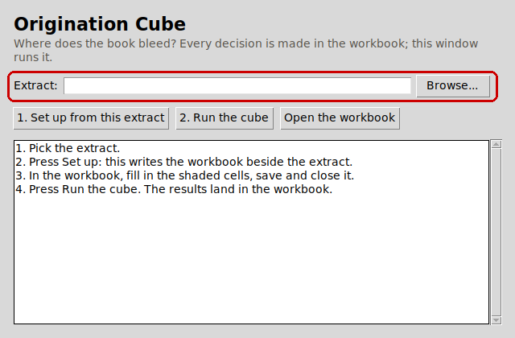

**Right:** a small window titled *Origination Cube*, with an empty Extract box and three buttons. The box underneath lists four steps.

**Wrong:** if the box says something needs installing, run `Install add-ons.bat` once, then open the window again.

## Step 2: Pick the extract

Press **Browse...** and pick the loan file.

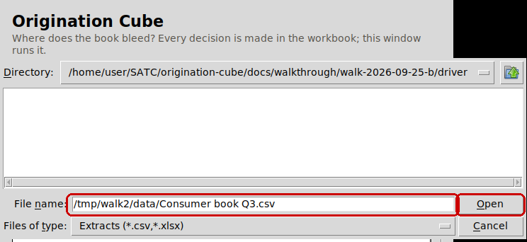

On Windows this is the usual Open dialog. The picture shows the same step on the test machine.

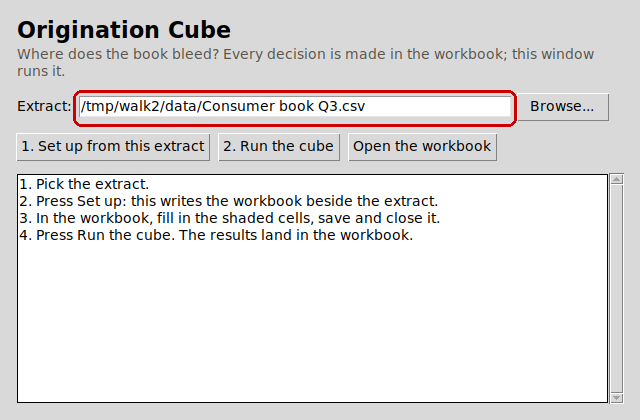

**Right:** the full path of the extract is in the Extract box. The window remembers it for next time.

## Step 3: Press 1. Set up from this extract

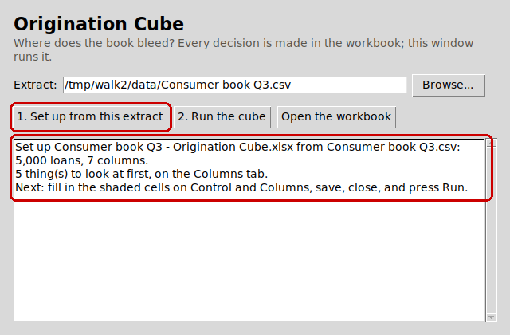

**Right:** the box says the workbook was set up, with the number of loans and columns. Here that's 5,000 loans and 7 columns, and "5 thing(s) to look at first, on the Columns tab". A workbook called `<extract name> - Origination Cube.xlsx` now sits beside the extract.

**Check the loan count against what the bank sent.** If it's wrong, you picked the wrong file.

## Step 4: Open the workbook: Start here

Press **Open the workbook**, or double-click it in its folder. It opens on **Start here**.

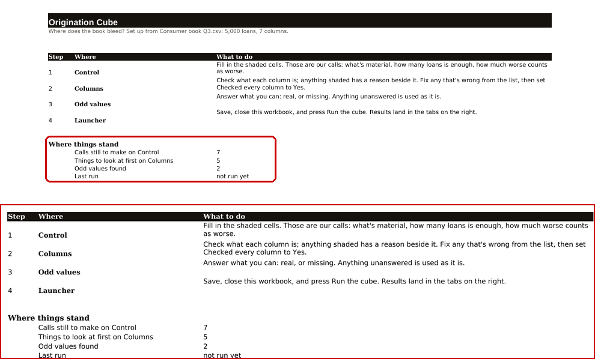

**Right:** four steps (Control, Columns, Odd values, Launcher) and a *Where things stand* block. On a new extract it says 8 calls to make on Control, 5 things to look at on Columns, 2 odd values, and *not run yet*.

**Watch out:** this block is only worked out at Set up. After you answer Control and run, it still says 8 (defect 9). Don't use it to tell whether you're done.

## Step 5: Control: see what needs an answer

Click the **Control** tab.

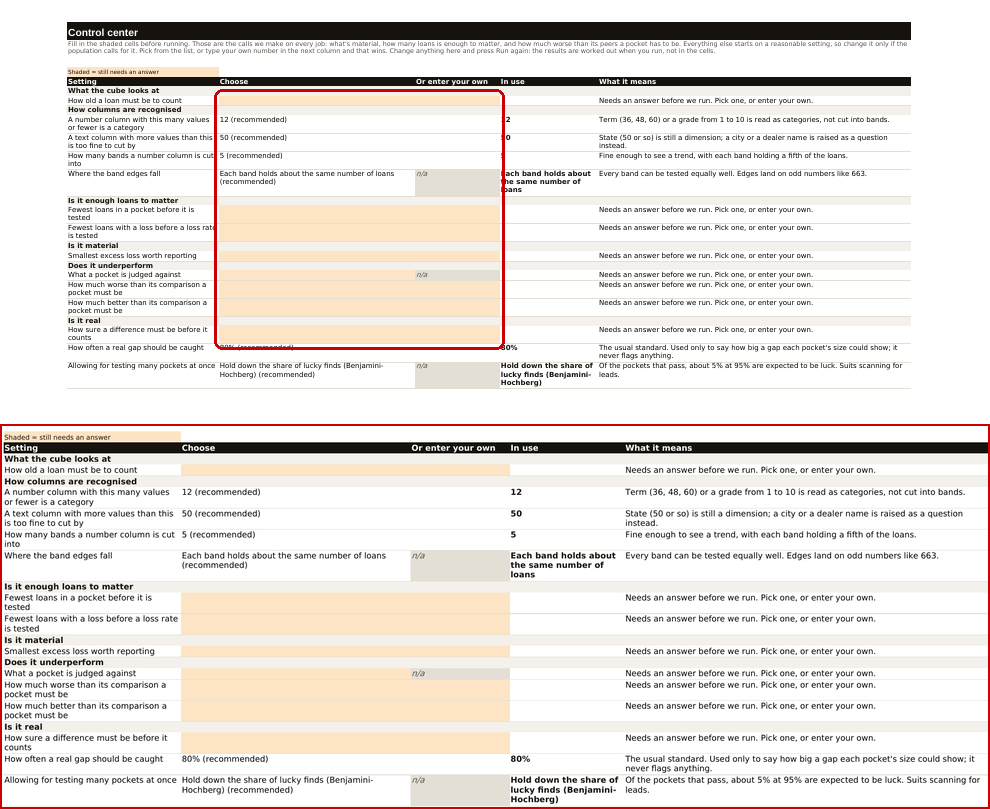

**Right:** eight rows are shaded peach. They are the calls the tool will not make for you:
- how old a loan must be to count
- the fewest loans in a pocket before it's tested
- the fewest loans with a loss
- the smallest excess loss worth reporting
- what a pocket is judged against
- how much worse counts
- how much better counts
- how sure you need to be

The other rows start on a recommended setting, and grey *n/a* cells mean you can only pick from the list.

## Step 6: Columns: see what each column was taken to be

Click the **Columns** tab.

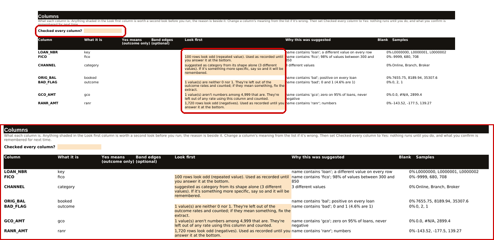

**Right:** one row per column of the extract, each with a meaning in *What it is* and the reason beside it. Rows with something under **Look first** are shaded, and here there are five:
- **FICO:** 100 rows of -9999
- **CHANNEL:** suggested as a category from its shape alone
- **BAD_FLAG:** one value that is neither 0 nor 1
- **GCO_AMT:** one value that isn't a number
- **RANR_AMT:** 1,720 negative values

*Checked every column?* (C3) is shaded and empty.

**Watch out:** "answer it at the bottom" means the **Odd values** tab, not the bottom of this one (defect 10).

## Step 7: Odd values, and Learned

Click **Odd values**.

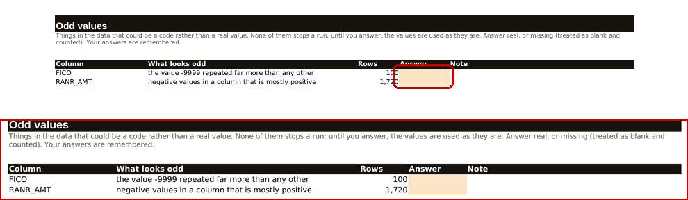

**Right:** one row per value that might be a code. Here that's FICO's -9999 (100 rows) and RANR's negatives (1,720 rows), each with a shaded Answer cell.

The **Learned** tab lists what the tool has remembered from earlier runs. On the first extract it says *Nothing learned yet*.

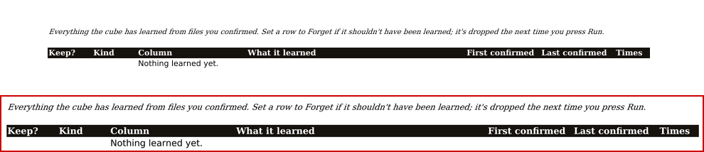

## Step 8: If you press Run too early

If you save, close and press **2. Run the cube** before answering, nothing runs.

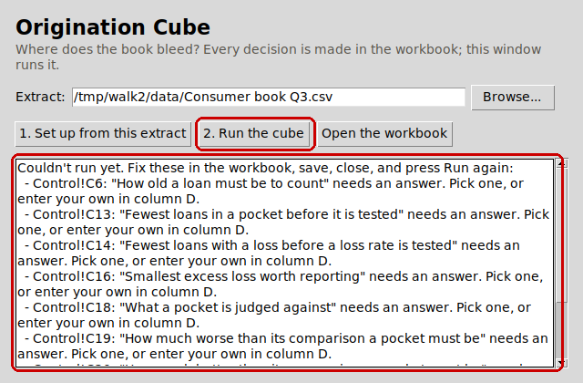

**Right:** "Couldn't run yet", then one line per thing to fix, each naming the tab and cell, e.g. `Control!C6: "How old a loan must be to count" needs an answer.` The same list is written to the **Log** tab.

**Watch out:**
- **Scroll the box.** The last line, `Columns!C3: set Checked every column to Yes`, is below the fold (defect 15).
- **Row 18 has no column D.** "What a pocket is judged against" only takes a pick from the list, whatever the message says (defect 11).

## Step 9: Fill in the shaded cells on Control

Click each shaded **Choose** cell and pick from its list. To use a number that isn't offered, type it in **Or enter your own** instead, and your number wins. The walk used:

| Setting | Answer |
|---|---|
| How old a loan must be to count | Every loan |
| Fewest loans in a pocket before it is tested | 30 |
| Fewest loans with a loss before a loss rate is tested | 10 |
| Smallest excess loss worth reporting | 1% of the book's total losses |
| What a pocket is judged against | The rest of its band |
| How much worse | 1.25 times |
| How much better | 0.8 times |
| How sure | 95% |

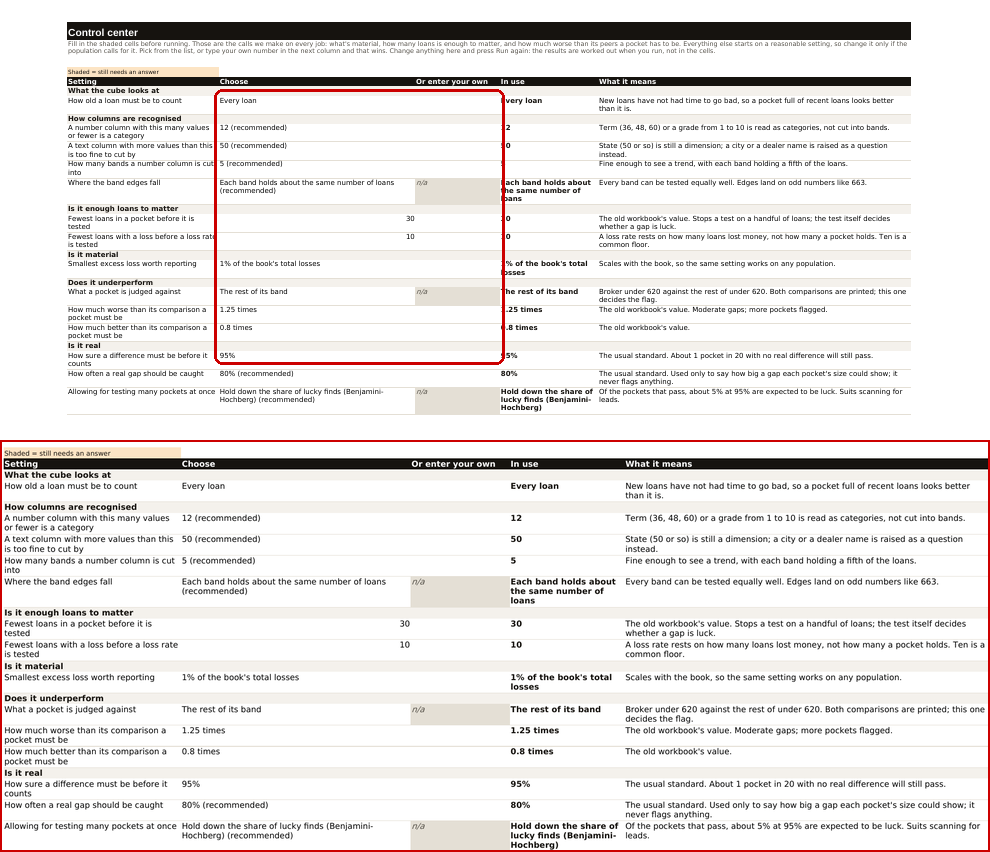

**Right:** the peach shading is gone, and *In use* and *What it means* fill in for each row.

**Watch out:** if Excel turns your **95%** pick into the number 0.95, *In use* says **not an option** and the run refuses (defect 3). Until that's fixed, type **0.95** in *Or enter your own* on that row instead.

## Step 10: Confirm the columns and answer the odd values

On **Columns**, check each *What it is*. Fix any that's wrong from its list, then set **Checked every column?** (C3) to **Yes**.

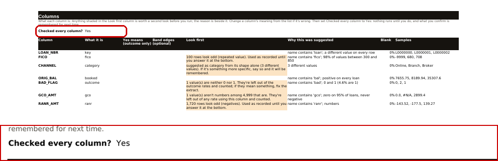

On **Odd values**, answer each row. The walk said FICO's -9999 is **missing** and RANR's negatives are **real**, because RANR is revenue and can be negative.

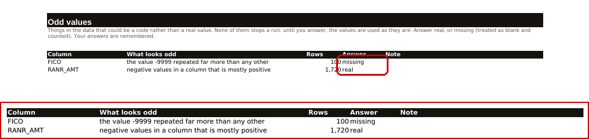

**Right:** C3 reads Yes and is no longer shaded, and every Answer cell is filled. An unanswered odd value doesn't stop the run; its values are used as they are.

## Step 11: Save, close, and press 2. Run the cube

Save the workbook and **close Excel**. Then press **2. Run the cube** in the window.

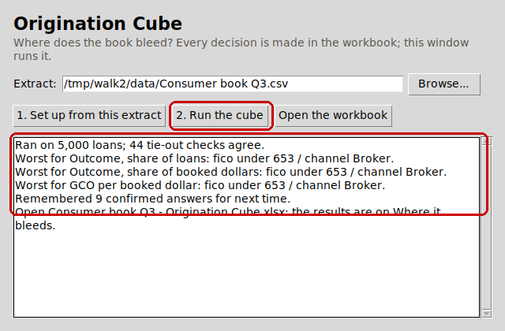

**Right:**
- "Ran on 5,000 loans; 44 tie-out checks agree."
- one *Worst for* line per measure
- "Remembered 9 confirmed answers"

On this book, the worst for the bad-loan share, the booked-weighted bad rate and GCO is **fico under 653 / channel Broker**. That's the planted pocket, seen through the recommended five equal bands.

**Check the loan count.** It should match step 3. If it doesn't, the workbook ran a different extract (defect 1).

## Step 12: Read Where it bleeds

Open the workbook again. **Where it bleeds** lists every pocket that loses more than its share, largest first within each measure.

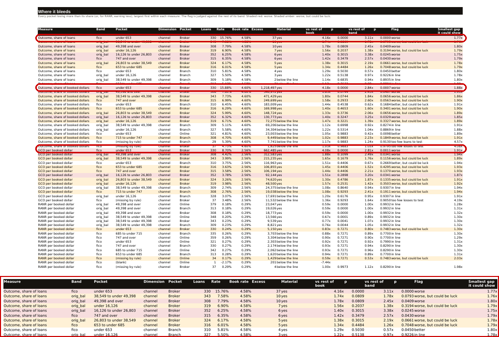

**Right:** the first row of each loss measure is **fico under 653 / Broker**, ringed:

| Measure | Rate | Book rate | vs rest of book | vs rest of band | Flag |
|---|---|---|---|---|---|
| Bad-loan share | 15.76% | 4.58% | 4.16x | 3.11x | worse |
| Booked-weighted bad rate | 15.88% | 4.60% | 4.18x | 2.84x | worse |
| GCO | 8.70% | 2.56% | 4.08x | 2.81x | worse |

How to read a row:
- **Red rows** are worse, and the test says it isn't luck.
- **Amber rows** are worse, but could be luck.
- **Unshaded rows** have a flag of *in line*, *better* or *too few ... to test*.
- **The flag** is judged against whatever you chose in step 9 (here, the rest of its band). The title says which.
- **Material** says whether the excess clears the line you set. *Below the line* rows are still listed.

**RANR reads the other way.** RANR is revenue, so its rows are pockets earning *less* than their share. A multiple under 1 is the bad direction:

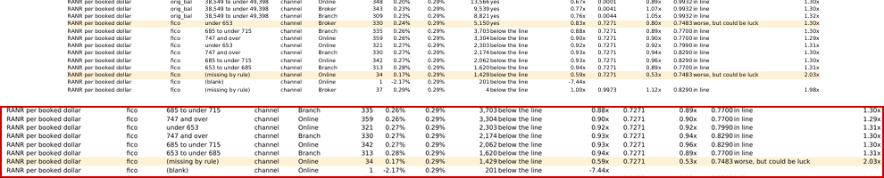

**Right:** the RANR rows have *vs rest of book* below 1.00x. On the synthetic book the largest shortfalls are the biggest loans (49,398 and over), because the test data gives every loan a similar RANR. That's an artefact of the test data, not a finding.

## Step 13: Grids

**Grids** shows each band crossed with each dimension, one block per measure. Each block has the rate first, then the rate over the book's rate.

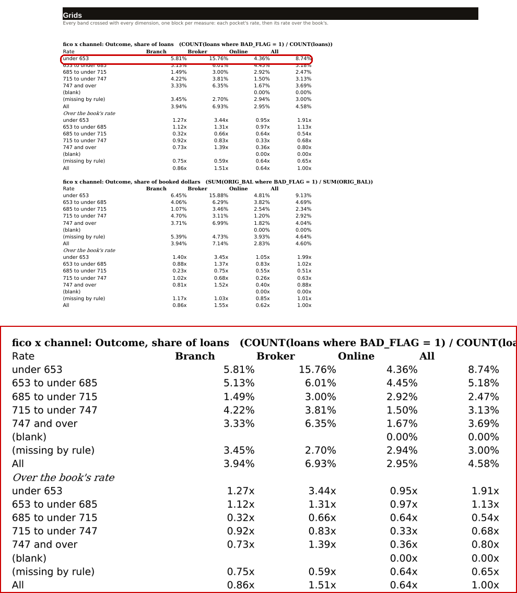

**Right:** in *fico x channel: Outcome, share of loans*, the cell for under 653 / Broker is 15.76%, or 3.44x the book. It is the largest number in the block.

For RANR, **bigger is better**. A high multiple in the RANR block is good, not bad (the tab doesn't say so; defect 14):

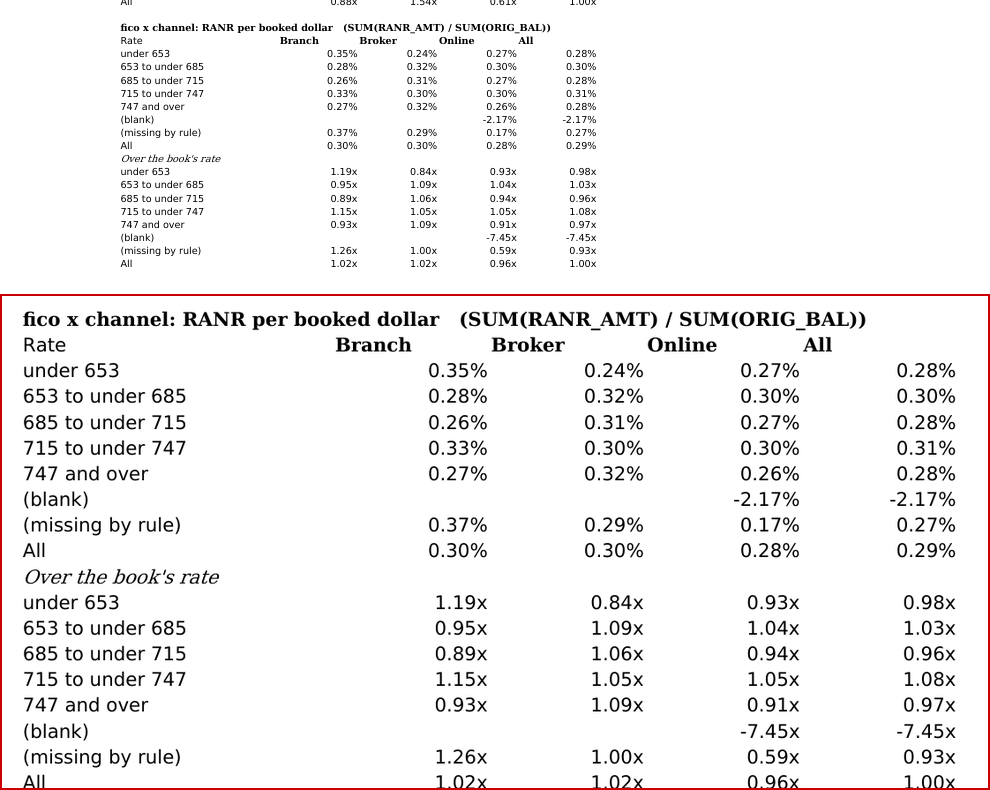

## Step 14: Check

**Check** records what the run did:
- the tie-outs
- what was left out and why
- the band edges used
- what the book is big enough to show
- the materiality line per measure
- every setting in words

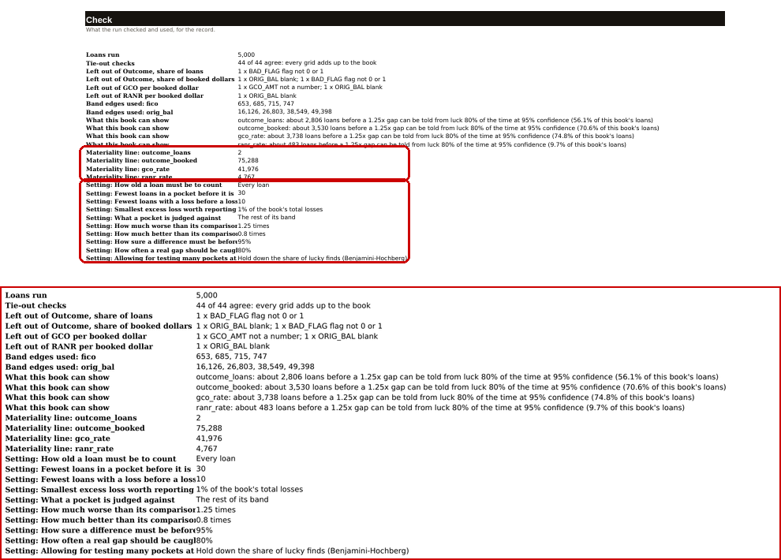

**Right:** "44 of 44 agree", and the settings match what you chose in step 9. The BAD_FLAG value of 2 and the GCO `#N/A` are counted as left out.

## Step 15: Log, and Start here

**Log** keeps every run, newest first, including refused ones.

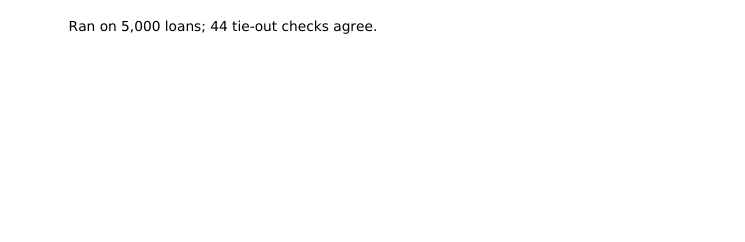

**Start here** shows the time of the last run:

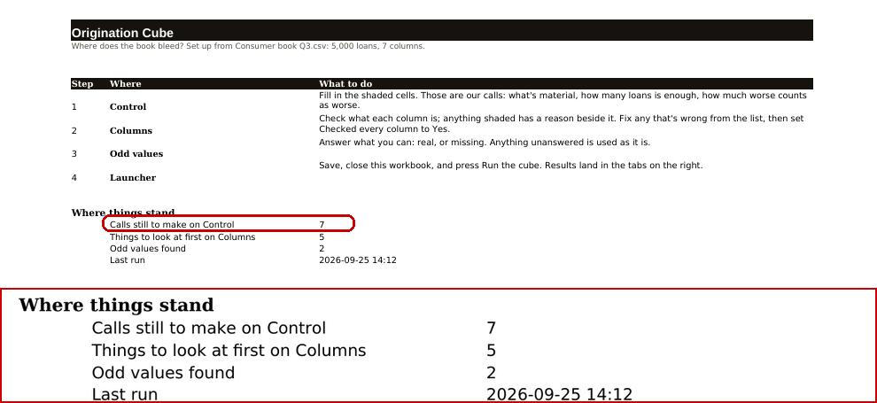

## Step 16: Use the LOB's own cut points

If the LOB already cuts scores at, say, 620, 680 and 740, type them on **Columns** in the **Band edges** cell of that column's row. Put a comma **and a space** between numbers: `620, 680, 740`. Save, close, and Run.

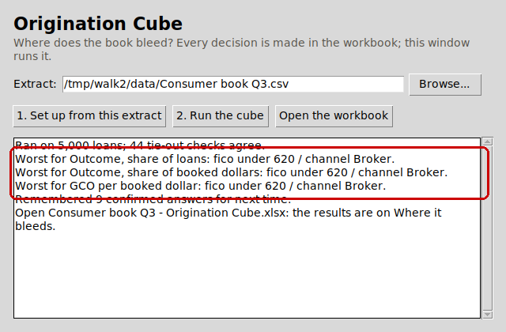

**Right:** the worst pocket now reads **fico under 620 / channel Broker**. On Where it bleeds it's 34.4% against a book of 4.58%, 9.01x the rest of the book:

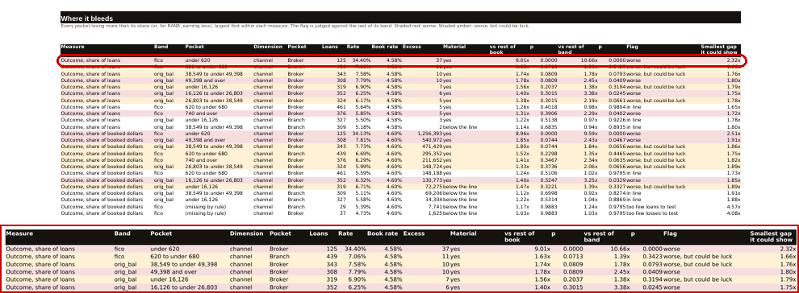

**Watch out:** typed without spaces, `620,680,740` is read by Excel as one number (620 million). The tool accepts that as a single edge, and every screen prints it as `620,680,740`, so it looks right and isn't (defect 2, *Wrong turn A2* below). On Check, confirm *Band edges used* shows the right number of edges.

## Step 17: The next extract: press Set up again

Press **1. Set up from this extract** again, on the same extract or a refreshed one with the same name.

**Right:** your Control answers, your Columns answers and C3, and your Odd values answers are all kept. Columns now says **Remembered: you confirmed this as ...** for each column. Only two things are left to look at (BAD_FLAG's 2 and GCO's `#N/A`), which are in the data itself.

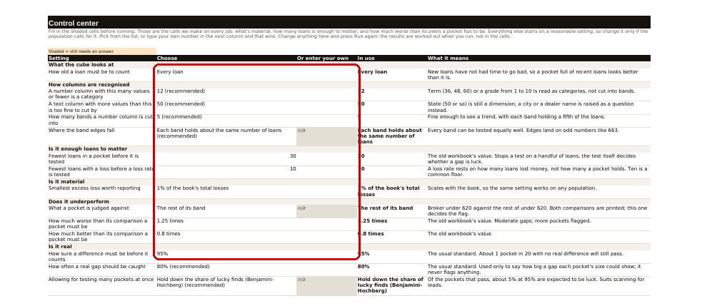

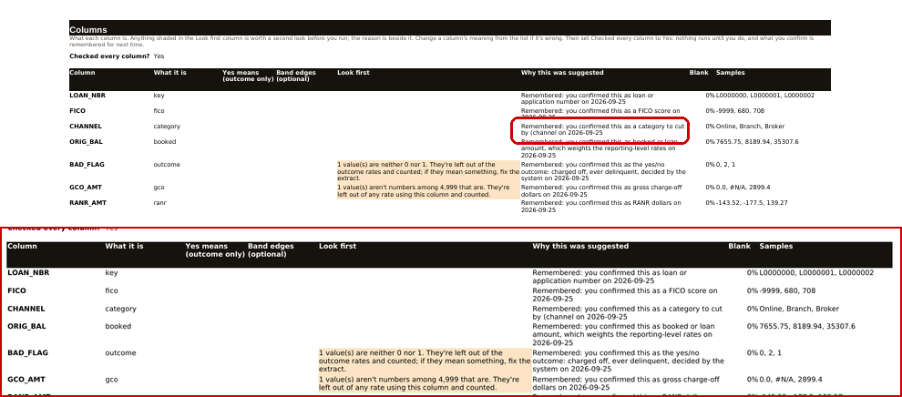

**Watch out:**
- **Set up clears the results.** It removes Where it bleeds, Grids, Check and Log, and Start here goes back to *not run yet* (defect 6). If you need the last results, save a copy of the workbook before pressing Set up.
- **Check new columns yourself.** If the new extract has columns the old one didn't, C3 still says Yes, and nothing marks the new rows. Look for them and check them before you run (defect 4).

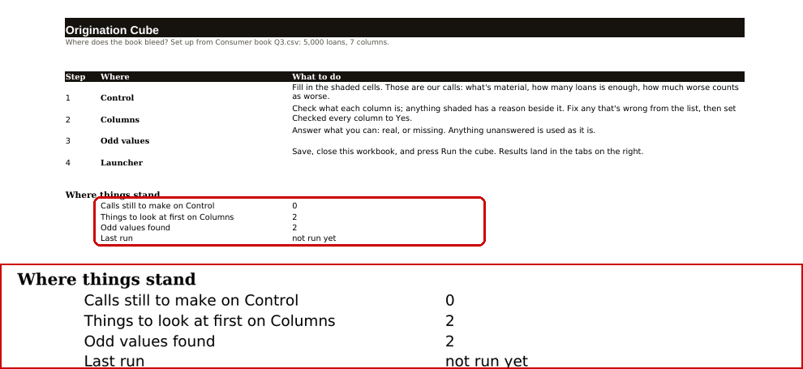

## Step 18: Prune something learned

On **Learned**, set a row's **Keep?** to **Forget**, then save, close and Run.

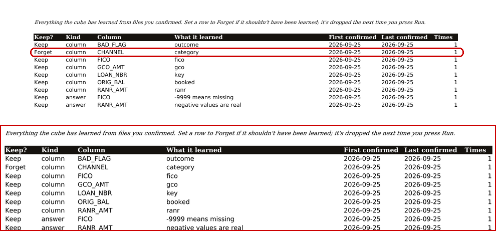

**What happened on this walk:** the run finished, but CHANNEL came straight back as learned. It shows Keep, with Times reset to 1:

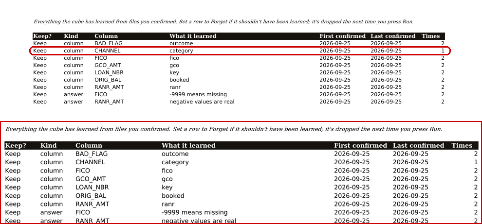

**Watch out:** Forget only sticks for a column that isn't in the workbook you ran (defect 5). To correct a wrong meaning, change it on the **Columns** tab instead. The new meaning replaces the old one when you run.

---

## When something goes wrong

| What you did | What the window says | What to do |
|---|---|---|
| Band edges not rising (`620, 740, 680`) | "Columns!E7: band edges for FICO must be rising numbers separated by commas, like 620, 680, 740." (The window shows FICO in backticks.) | Fix the order in that cell. |
| Band edges typed without spaces (`620,680,740`) | **Nothing.** It runs, with one edge at 620,680,740. | Retype with spaces. Check *Band edges used* on Check. |
| An out-of-range number typed on Control (0.9 for "worse", 95 for "how sure") | One line per cell, e.g. `Control!D22: ... needs a share between 0.5 and 0.999 ... got 95.` Excel also refuses it as you type, unless it was pasted. | Type 0.95, not 95. |
| The only category column marked *servicing* | "Nothing is left to cut across: mark at least one column as a category (or term) on the Columns tab." | Put that column back to *category*. |
| Workbook still open in Excel | "... is open in Excel. Close it, then press Run again." (Set up says the same.) | Close Excel and press again. |
| Workbook copied to a new folder with a new extract of the same name | **Nothing.** It runs the old folder's extract. | Don't copy workbooks between folders. Set up fresh from the new extract. |

**Wrong turn A: band edges not rising**

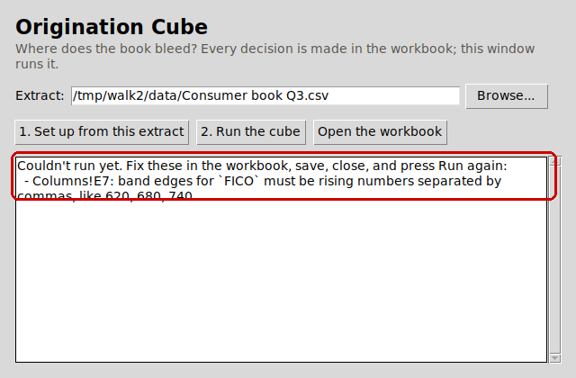

**Wrong turn A2: band edges typed without spaces.** The run goes through. The grid has one band, "under 620,680,740", and Check prints the edge the way you typed it:

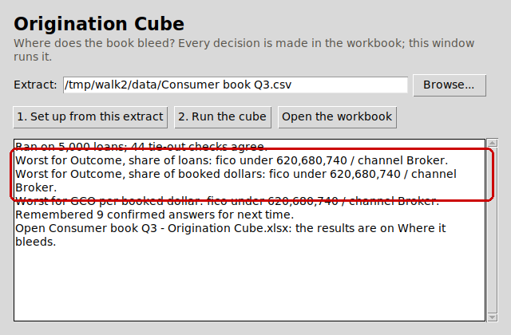

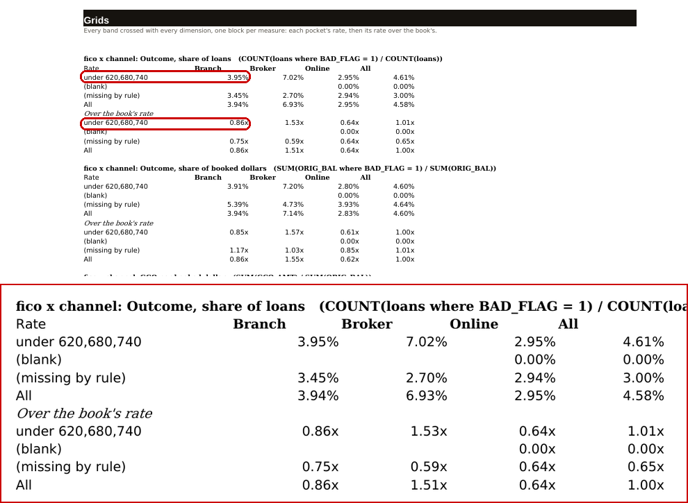

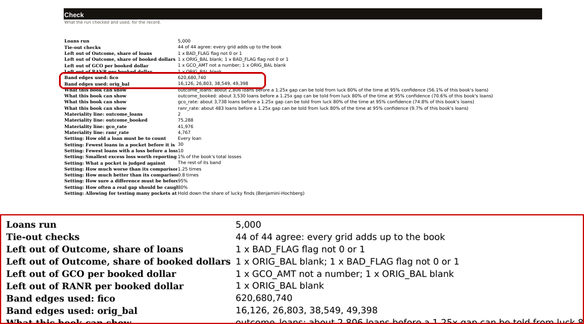

**Wrong turn B: out-of-range numbers.** The Control tab itself shows no problem (the values were pasted, which gets past Excel's check). The window names both cells:

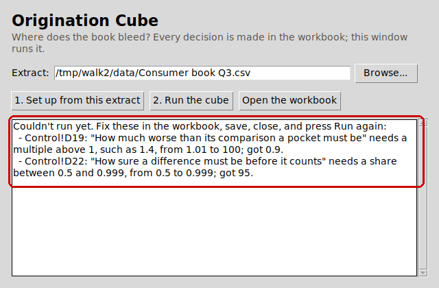

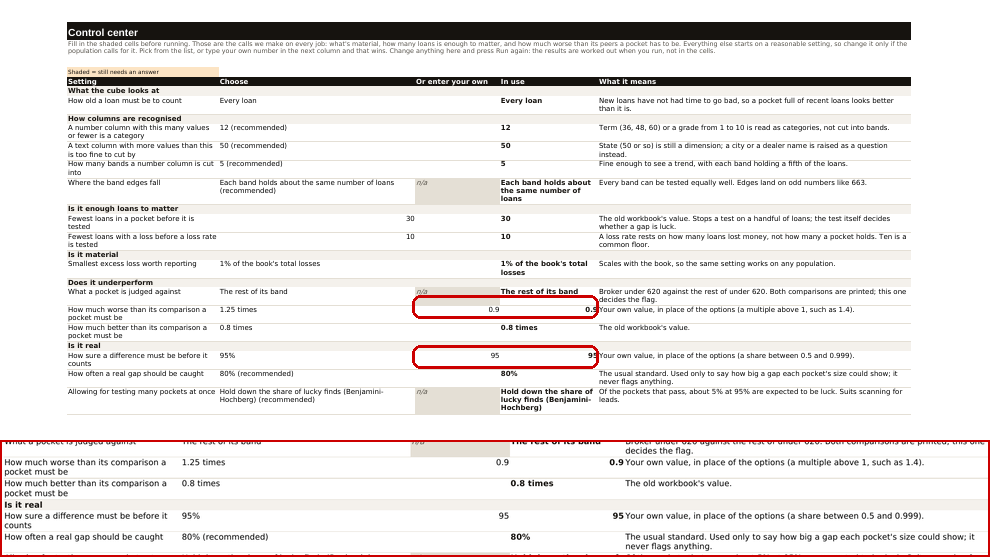

**Wrong turn C: the only category marked servicing**

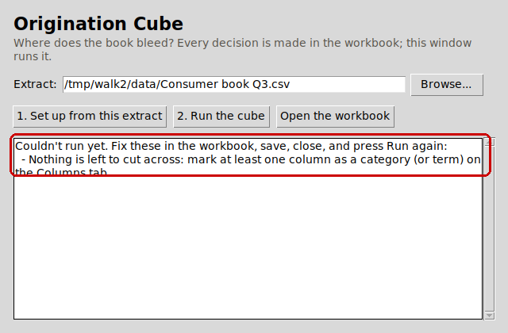

**Wrong turn D: workbook open in Excel.** This was simulated by locking the file, because Excel isn't available here. Run and Set up both refuse in words:

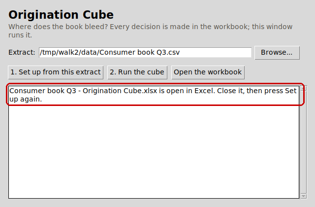

**Wrong turn E: a refreshed extract with two new columns.** CURR_STATUS and DTI were added. Set up kept C3 = Yes, and nothing shades the new rows:

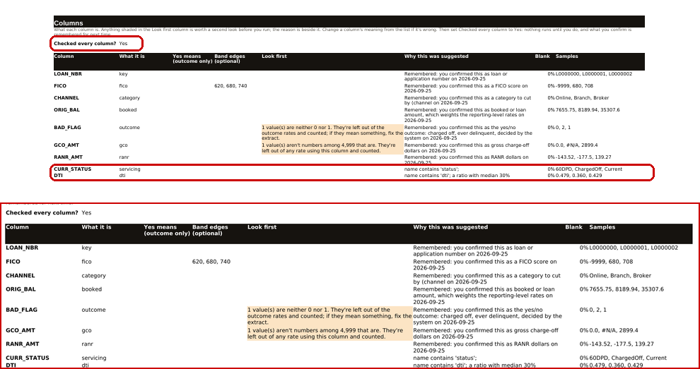

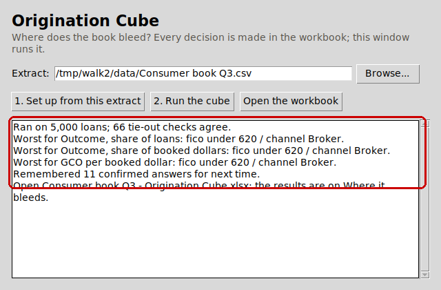

**Wrong turn F: the workbook copied to another folder.** The Extract box names a 3,000-loan extract, and the run says 5,000 loans. It ran the original folder's extract and wrote the results into the copied workbook:

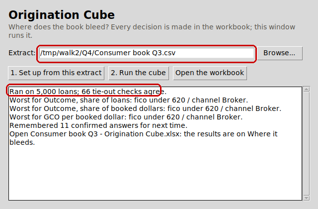

---

## How this was walked

On a Linux test machine:
- **The window:** `Origination Cube.pyw`'s window on a virtual display, with its buttons pressed through `driver/drive.py`, and each state photographed.
- **Excel's part:** done cell by cell with openpyxl (`driver/edit.py`), standing in for picking from the dropdowns and typing.
- **The workbook:** each state printed through LibreOffice and photographed page by page (`driver/render.sh`).
- **The build:** frozen at commit `f2f1032` with `git archive`, because `src/` was being edited during the walk.
- **Memory and preferences:** a scratch `CUBE_MEMORY` and `HOME`.

The order actually walked:
1. Steps 1 to 15.
2. Step 17 (Set up again).
3. Step 18 (Forget).
4. Wrong turns A and A2, then step 16 (own edges).
5. Wrong turns B, C and D.
6. Wrong turns E and F.
