# Origination analysis: the window and the workbook

**Who this is for:** the analyst preparing an origination analysis for a bank's line of business (LOB). No command line is needed.
**What you finish with:** one workbook beside the loan extract. It holds your answers, a ranked list of the pockets of the book that lose more than their share, losses set against revenue, and, if you ask for it, every pocket split by a third column.
**Walked:** 25 September 2026, on commit `00c0bdd`, with a synthetic book of 8,000 loans. The book hides two things: a bad pocket (scores under 620 in the Broker channel), and borrowers carrying more revolving debt than usual for their score, who go bad 1.8 times as often. No real bank data was used.

> **What changed since the second walk:** the Split column on Columns, the Losses vs revenue and Materiality tabs, Show per pocket, and band edges typed with semicolons. Steps 13, 15 and 18 to 20 are new.

<!-- ROUTE -->

## Before you start

- **Python 3.10 or later**, and **`Install add-ons.bat`** run once. You only need to do this the first time.
- **Excel.**
- **The loan extract** (.csv or .xlsx) in its own folder. It needs a loan number, the booked amount, a yes/no outcome, GCO dollars and RANR dollars.
- **Pick the extract, never the workbook.** After Set up, the folder holds both. The file picker shows both. Picking the workbook sets up a second workbook from the first one (wrong turn K).

---

## Step 1: Open the window

Double-click **`Origination Cube.pyw`** in the `origination-cube` folder.

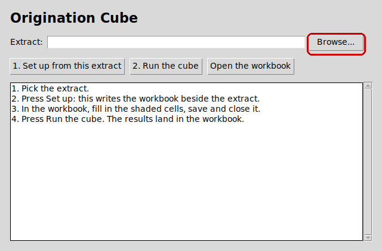

**Right:** a window titled *Origination Cube*, an empty Extract box, three buttons, and four numbered lines in the box underneath.

**Wrong:** if the box says something needs installing, run `Install add-ons.bat` once, then open the window again.

## Step 2: Pick the extract

Press **Browse...** and pick the loan file.

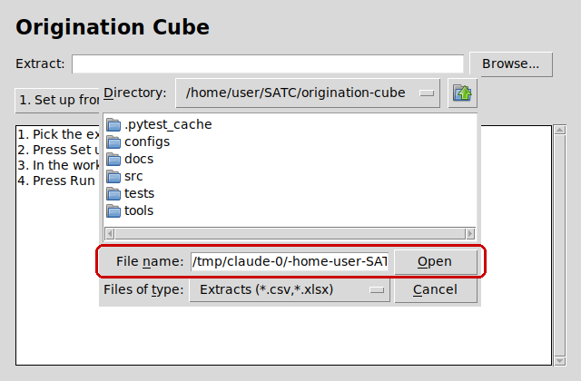

On Windows this is the usual Open dialog. The picture shows the same step on the test machine.

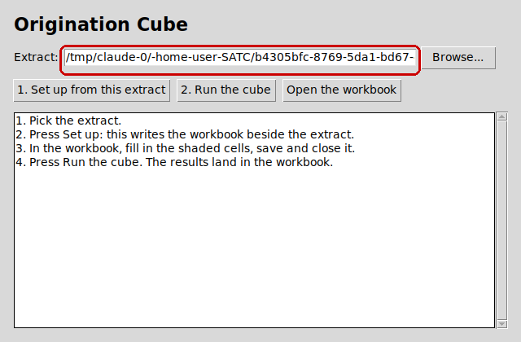

**Right:** the path of the extract is in the Extract box. The box shows the start of the path, so the file name itself may be out of sight. Step 3 names it.

## Step 3: Press 1. Set up from this extract

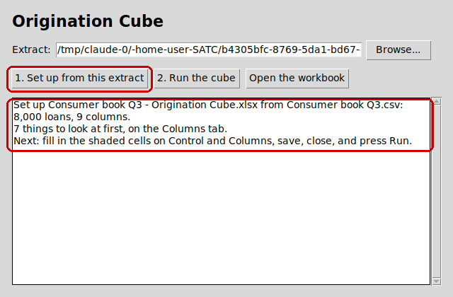

**Right:** "Set up Consumer book Q3 - Origination Cube.xlsx from Consumer book Q3.csv: 8,000 loans, 9 columns", then "7 things to look at first, on the Columns tab". The workbook now sits beside the extract.

**Check the loan count against what the bank sent.** If it's wrong, you picked the wrong file.

## Step 4: Open the workbook: Start here

Press **Open the workbook**, or double-click it in its folder. It opens on **Start here**.

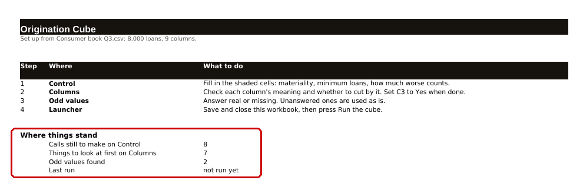

**Right:** four steps (Control, Columns, Odd values, Launcher) and *Where things stand*: 8 calls to make on Control, 7 things to look at on Columns, 2 odd values, *not run yet*.

## Step 5: Control: see what needs an answer

Click the **Control** tab.

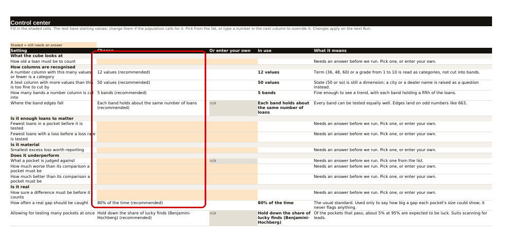

**Right:** eight rows are shaded peach. They are the calls the tool won't make for you: loan age, fewest loans, fewest losses, materiality, what a pocket is judged against, how much worse, how much better, and how sure. The other rows start on a recommended setting. Grey *n/a* cells mean that row only takes a pick from the list.

## Step 6: Columns: see what each column was taken to be

Click the **Columns** tab.

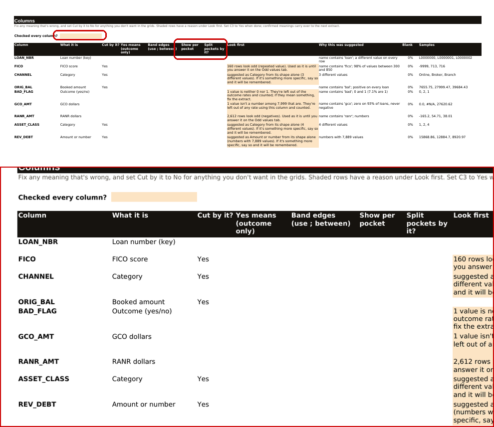

**Right:** one row per column, each with a meaning in *What it is* and the reason beside it. Seven rows are shaded under **Look first**:
- **FICO:** 160 rows of -9999
- **CHANNEL**, **ASSET_CLASS** and **REV_DEBT:** suggested from their shape alone
- **BAD_FLAG:** one value that is neither 0 nor 1
- **GCO_AMT:** one value that isn't a number
- **RANR_AMT:** 2,612 negative values

*Checked every column?* (C3) is shaded and empty. The ringed columns, **Show per pocket** and **Split pockets by it?**, are for steps 18 to 20. Leave them blank for now.

## Step 7: Odd values, and Learned

Click **Odd values**.

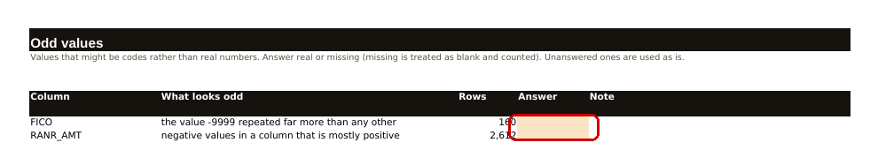

**Right:** FICO's -9999 (160 rows) and RANR's negatives (2,612 rows), each with a shaded Answer cell.

The **Learned** tab lists what the tool remembers from earlier runs. On the first extract it says *Nothing learned yet*.

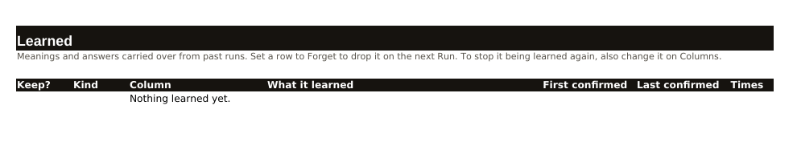

## Step 8: If you press Run too early

If you save, close and press **2. Run the cube** before answering, nothing runs.

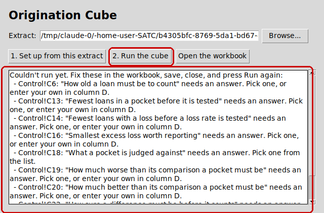

**Right:** "Couldn't run yet", then one line per thing to fix, each naming the tab and cell. The same list goes to the **Log** tab.

**Scroll the box.** The last line, `Columns!C3: set Checked every column to Yes`, is below the fold:

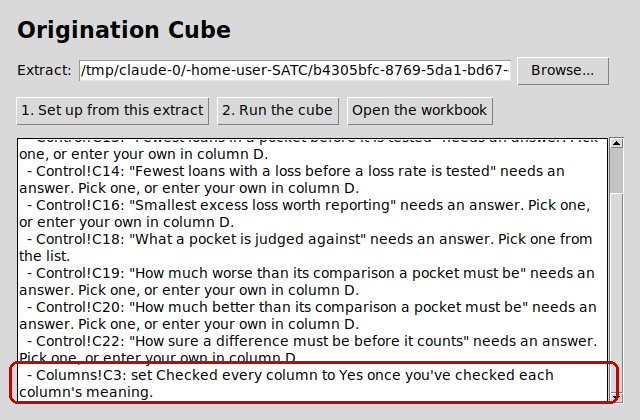

## Step 9: Fill in the shaded cells on Control

Click each shaded **Choose** cell and pick from its list. To use a number that isn't offered, type it in **Or enter your own** instead. The walk used:

| Setting | Answer |
|---|---|
| How old a loan must be to count | Every loan |
| Fewest loans in a pocket before it is tested | 30 loans |
| Fewest loans with a loss before a loss rate is tested | 10 losses |
| Smallest excess loss worth reporting | 1% of the book's total losses |
| What a pocket is judged against | The rest of its band |
| How much worse | 1.25 times |
| How much better | 0.8 times |
| How sure | 95% sure |

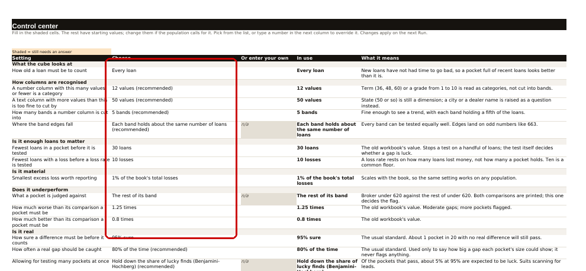

**Right:** the peach shading is gone, and *In use* and *What it means* fill in for each row.

**Watch out:** a dollar amount typed in *Or enter your own* for materiality applies the same dollars to the RANR shortfall as to losses (wrong turn J). Use the percentage options unless you mean that.

## Step 10: Confirm the columns and answer the odd values

On **Columns**, check each *What it is*. Fix any that's wrong from its list, then set **Checked every column?** (C3) to **Yes**.

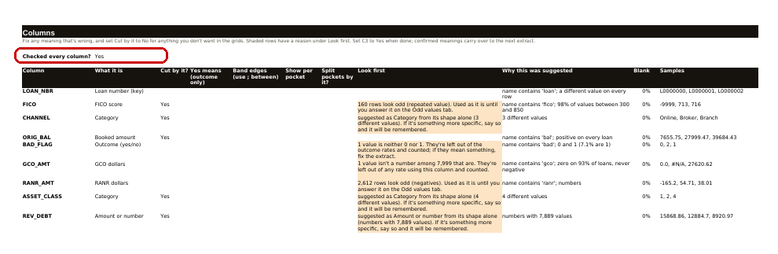

On **Odd values**, answer each row. The walk said FICO's -9999 is **missing** and RANR's negatives are **real**, because RANR is revenue and can be negative.

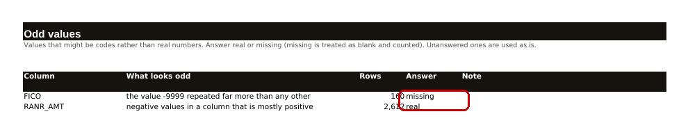

## Step 11: Save, close, and press 2. Run the cube

Save the workbook and **close Excel**. Then press **2. Run the cube**.

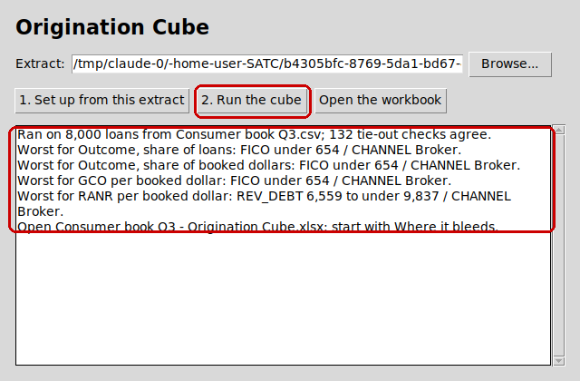

**Right:**
- "Ran on 8,000 loans from Consumer book Q3.csv; 132 tie-out checks agree."
- one *Worst for* line per measure. For the three loss measures it's **FICO under 654 / CHANNEL Broker**, the planted pocket seen through five equal bands.

**Check the loan count.** It should match step 3.

The *Worst for RANR* line on this book (REV_DEBT 6,559 to under 9,837 / Broker) is noise. The test data plants nothing in RANR.

## Step 12: Read Where it bleeds

Open the workbook again. **Where it bleeds** lists every pocket that loses more than its share, largest first within each measure.

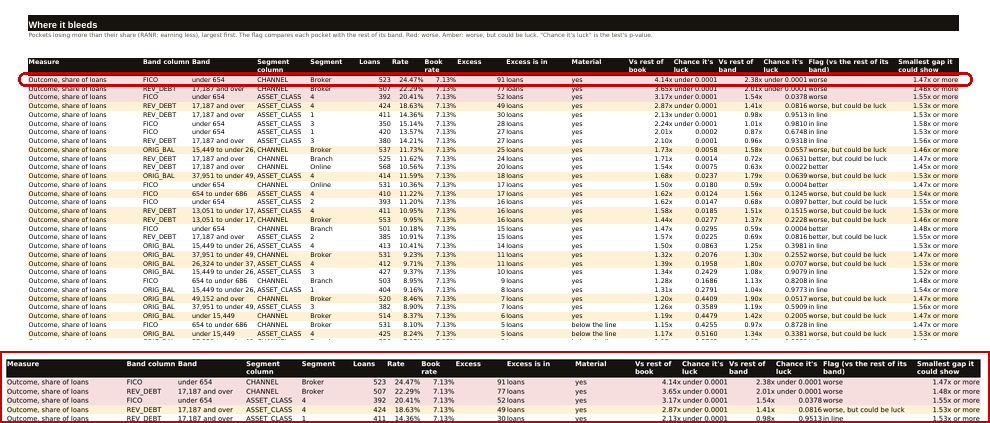

**Right:** the first row is FICO under 654 / CHANNEL Broker: 523 loans, 24.47% bad against a book of 7.13%, an excess of 91 loans, 4.14x the rest of the book, 2.38x the rest of its band, flagged **worse**.

How to read a row:
- **Red rows** are worse, and the test says it isn't luck. **Amber** rows are worse but could be luck.
- **Excess is in** gives the unit: loans for the bad-loan share, dollars of a named column otherwise.
- **The flag** uses the comparison you chose in step 9 (here, the rest of its band). The heading says which.
- **Material** says whether the excess clears your line. *Below the line* rows are still listed.
- **RANR** rows are shortfalls: pockets earning less than their share. A multiple under 1 is the bad direction.

**Watch out:** long band labels are cut off in the Band column ("15,449 to under 26,"). Widen the column to read them.

## Step 13: Losses vs revenue

**Losses vs revenue** puts every pocket of at least 30 loans in one of four boxes, by whether its GCO rate is above or below the book's and whether its RANR rate is above or below the book's.

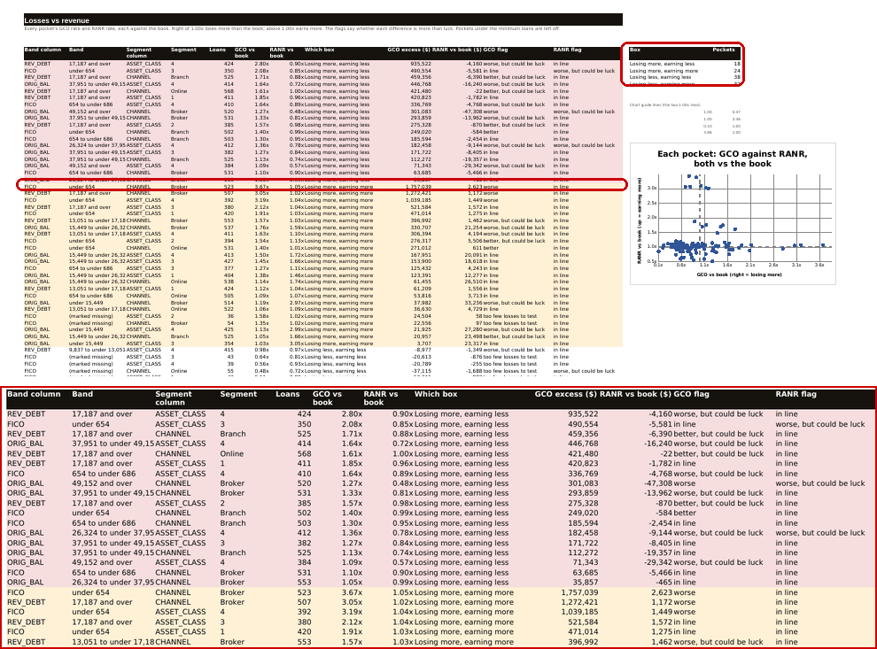

**Right:** the count table at the top right reads 18, 24, 38 and 32 pockets. The rows are sorted by box, then by GCO excess.

**Read the flags before the box.** The box is decided by which side of 1.00x a pocket falls, and nothing else. The planted pocket (ringed) is in **Losing more, earning more** because its RANR is 1.05x the book's, and its RANR flag says *in line*: the extra revenue is not a real difference. Treat a box as settled only when that side's flag says *worse* or *better* (defect 1).

**The flags compare with the rest of the band, not the book.** So a row can sit in *Losing more* with a GCO flag of *better* (FICO under 654 / Branch, for example) (defect 5).

The chart plots the same pockets, GCO across and RANR up, with a dashed line at 1.00x on each:

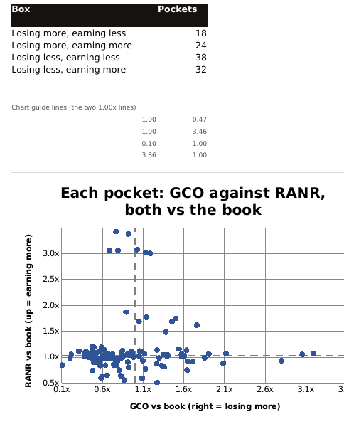

The dots aren't labelled. Use the table to find a pocket.

## Step 14: Grids

**Grids** shows each band crossed with each segment, one block per measure: the rate, the rate against the book, and the rate against the rest of the same band. Red is worse and green is better.

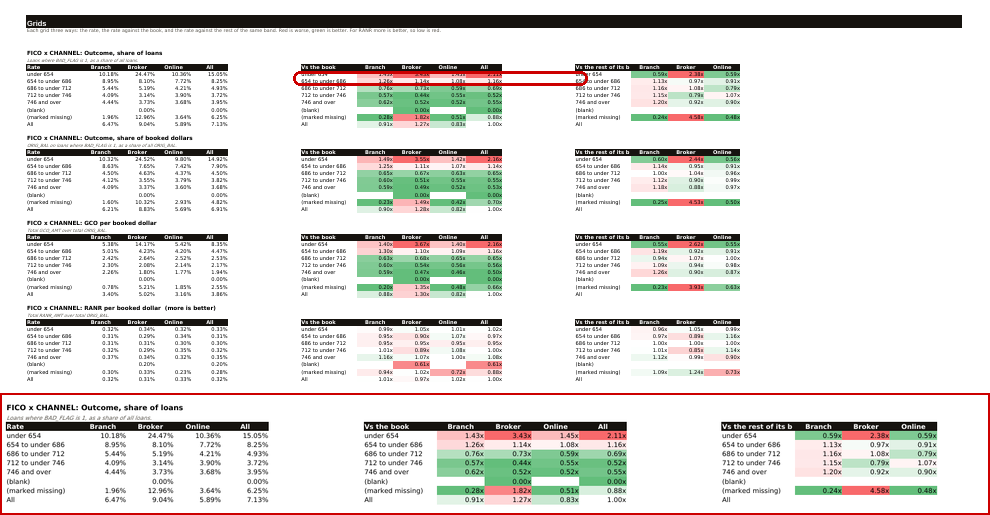

**Right:** in *FICO x CHANNEL: Outcome, share of loans*, under 654 / Broker is 24.47%, 3.43x the book and 2.38x the rest of its band.

For RANR, **more is better**, and the heading says so. Low is red:

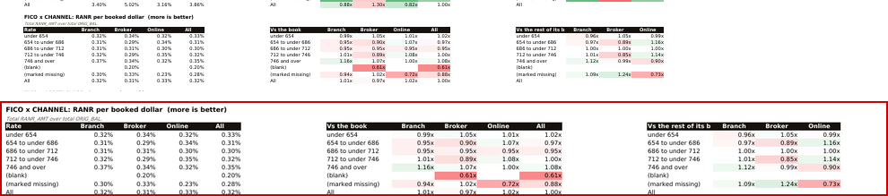

**Watch out:** the grids colour every cell, tested or not. The *(blank)* row holds one loan, and *(marked missing)* Broker holds 54 loans with too few losses to test. Both show some of the strongest colours on the page (defect 4).

## Step 15: Materiality

**Materiality** shows, for every grid and measure, what each level would keep: how many pockets and how much of the grid's excess.

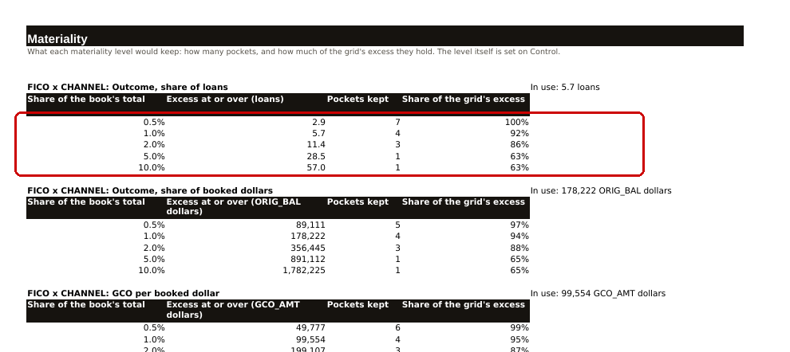

**Right:** for *FICO x CHANNEL: Outcome, share of loans*, the level in use is 5.7 loans (1% of the book's bad loans), which keeps 4 pockets and 92% of the excess. Going to 2% keeps 3 pockets and 86%.

Only 1% and 5% can be picked on Control. For another level, work out its dollars from this tab and type them in *Or enter your own*.

## Step 16: Check

**Check** records what the run did: the extract and loan count, the record file, the tie-outs, what was left out and why, the band edges, the loans needed to show a 1.25x gap, each materiality line with its unit, and every setting in words.

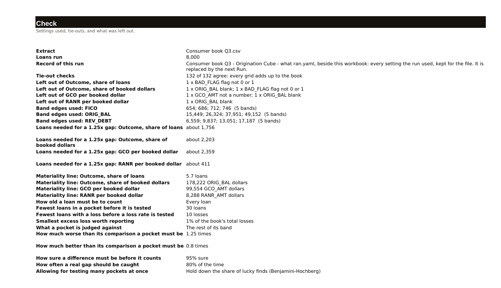

**Right:** "132 of 132 agree", five bands for each number column, and the settings match step 9.

## Step 17: Log, and Start here

**Log** keeps every run, newest first, including refused ones.

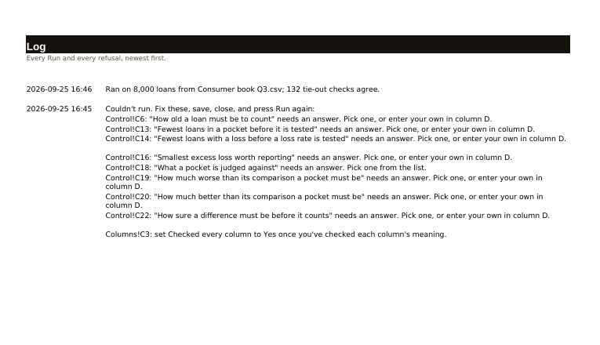

**Start here** now shows 0 calls left and the time of the last run:

## Step 18: Split every pocket by a number (revolving debt)

On **Columns**, set **Split pockets by it?** to **Yes** on one number column. The walk used **REV_DEBT**. Save, close, and Run.

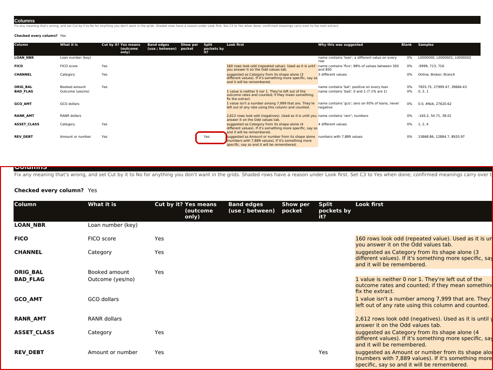

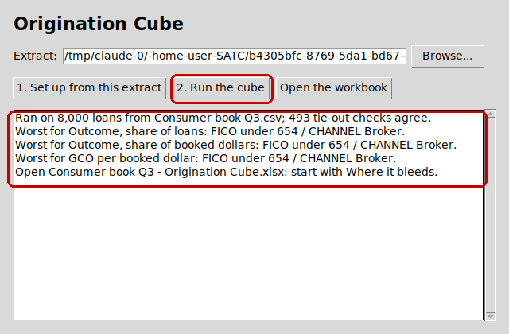

**Right:** "493 tie-out checks agree". The window doesn't mention the split. Open the new **Split** tab.

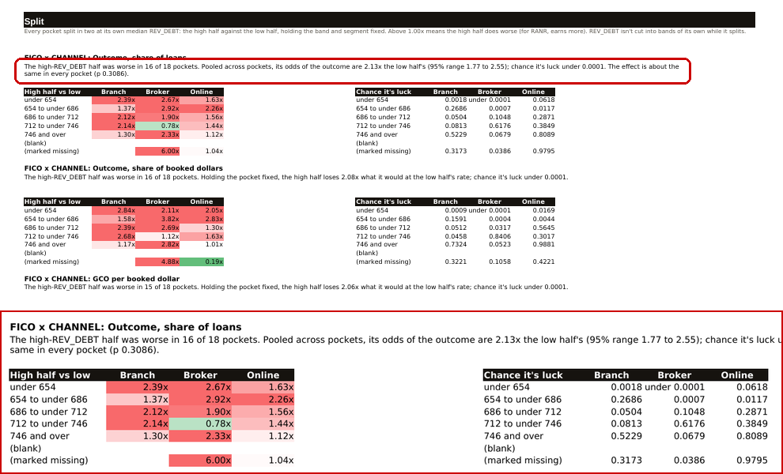

**How to read it:** every pocket is cut in two at its own median revolving debt. *High half vs low* compares the two halves inside each pocket, and the sentence above each block pools the pockets. For FICO x CHANNEL the high half was worse in 16 of 18 pockets, with odds 2.13x the low half's (95% range 1.77 to 2.55).

**Read the FICO grids, not the others.** A split only holds fixed what the grid holds fixed. In the ORIG_BAL grids nothing holds the score, so high revolving debt also means lower scores, and the answer comes out at 2.73x and 2.76x:

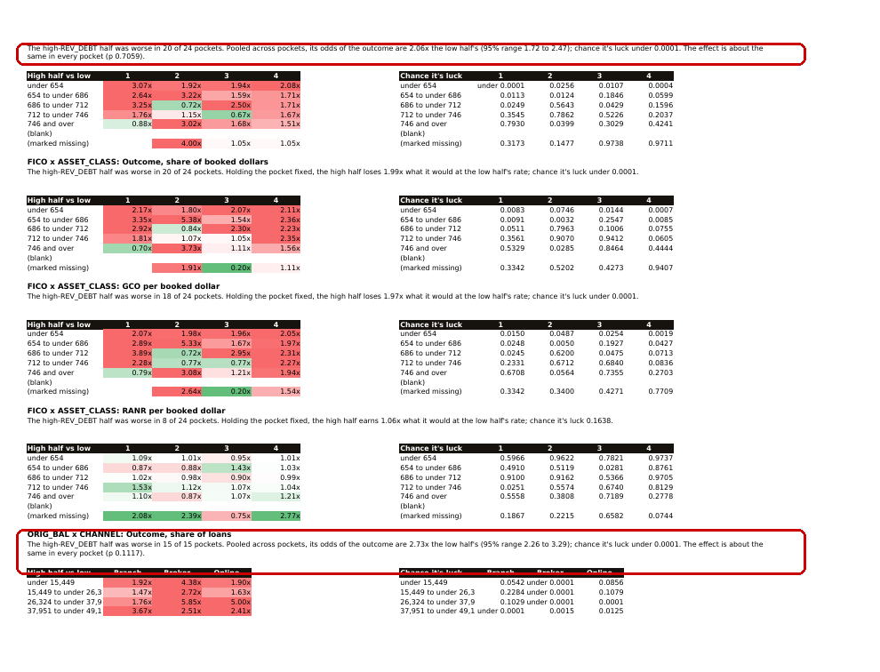

On a copy of this book with **no** revolving-debt effect at all, the ORIG_BAL grids still said 1.66x and 1.70x, "chance it's luck under 0.0001" (defect 2). The planted effect is 1.8x the bad rate. The FICO grids read 1.97x and 1.93x as a bad-rate ratio (2.13x and 2.06x as odds).

REV_DEBT isn't cut into bands of its own while it splits, and the tab's subtitle says so.

## Step 19: Split every pocket by a category (asset class)

Clear REV_DEBT's split and set **ASSET_CLASS** instead. Save, close, and Run.

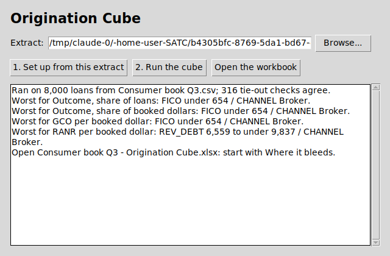

**Right:** "316 tie-out checks agree". On **Grids**, every block is followed by one small grid per asset class, each showing the rate against the book:

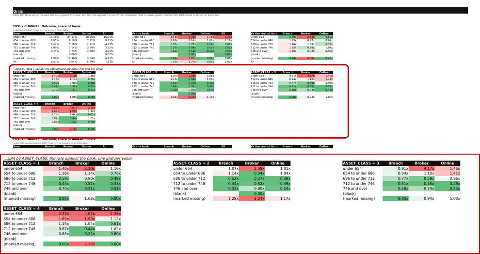

Asset class 4 is the reddest, as planted (1.4x the others).

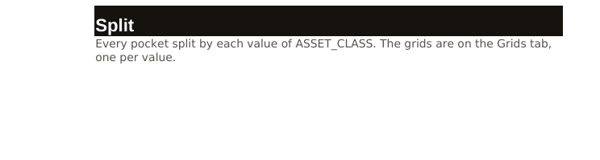

**Watch out:**
- **ASSET_CLASS stops being a segment.** Where it bleeds, Losses vs revenue and Materiality lose their ASSET_CLASS grids. Nothing says so (defect 3).
- **The split pockets aren't tested or ranked.** They are only in these small grids, with no loan counts. The *(marked missing)* pockets hold 11 to 16 loans each.

## Step 20: Show a median or average per pocket

On **Columns**, set **Show per pocket** to *median* or *average* on any number column. The walk put *average* on ORIG_BAL and *median* on REV_DEBT. Save, close, and Run.

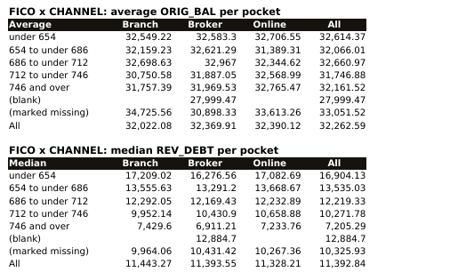

**Right:** each grid on **Grids** gets a block per column, *average ORIG_BAL per pocket* and *median REV_DEBT per pocket*. These are for reading beside the rates. They aren't tested and don't add up across pockets. The tab doesn't say that.

## Step 21: Use the LOB's own cut points

If the LOB cuts scores at 620, 680 and 740, type them in that column's **Band edges** cell with **semicolons**: `620; 680; 740`. Save, close, and Run.

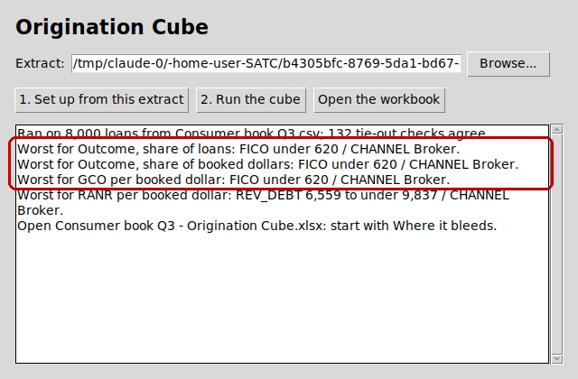

**Right:** the worst pocket is now **FICO under 620 / CHANNEL Broker**: 176 loans, 53.4% bad, 8.78x the rest of the book. Check says "620; 680; 740 (4 bands)".

Commas also work if the cell is left as text. If Excel turns the list into one number, Run refuses and names the cell (wrong turn D).

## Step 22: The next extract: press Set up again

Press **1. Set up from this extract** again, on the same extract or a refreshed one with the same name.

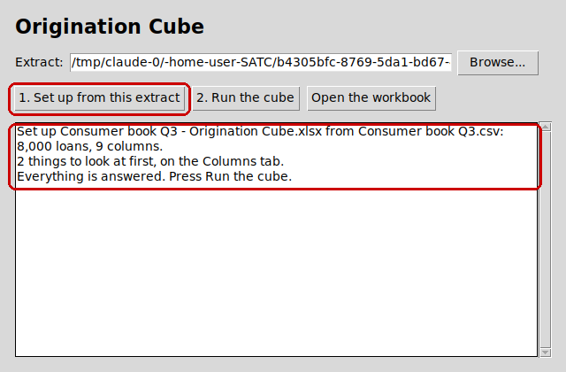

**Right:** "Everything is answered. Press Run the cube." Your Control, Columns and Odd values answers are kept. So are the last run's results and the Log:

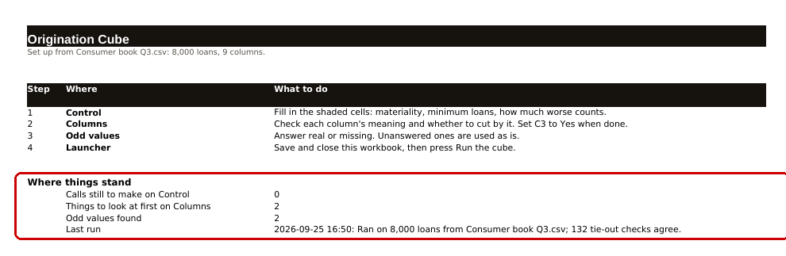

If the new extract has columns the old one didn't, C3 is cleared and the new columns are shaded "New since the last check" (wrong turn N).

## Step 23: Prune something learned

On **Learned**, set a row's **Keep?** to **Forget**, then save, close and Run.

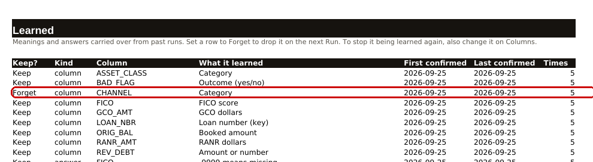

**Right:** the window says "Forgot CHANNEL, as marked on Learned."

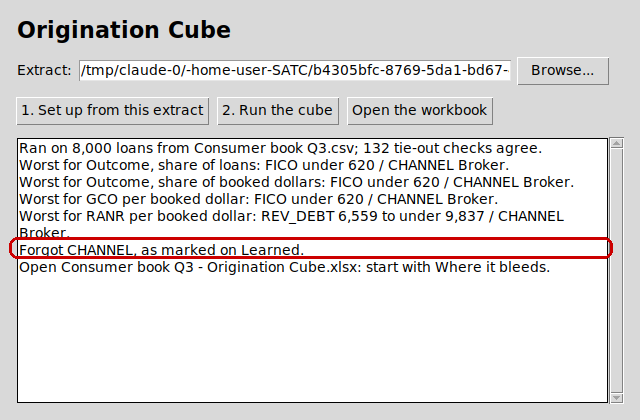

**Watch out:** the next Run learns it again, silently, because Columns still says CHANNEL is a category and C3 still says Yes. After a second run, CHANNEL is back with *Times* 1 (defect 9):

To stop it being learned, change its meaning on Columns as well, as the Learned tab's subtitle says.

---

## When something goes wrong

| What you did | What the window says | What to do |
|---|---|---|
| **A.** Split set on two columns | "Columns!H: only one column can split the pockets; ASSET_CLASS, REV_DEBT are all set to Yes." | Clear one. |
| **B.** Split the only category that's cut, with the other set to Cut by it? No | "Nothing is left to cut across ... Changed from what was suggested: ASSET_CLASS (Columns!D13, Cut by it? No)." It doesn't say the split took CHANNEL out. | Clear the split, or set ASSET_CLASS back to Yes. |
| **C.** *average* on a category | "Columns!G8: "CHANNEL" isn't a number column, so it has no average to show." | Clear the cell. |
| **D.** Edges typed as `620,680,740` and turned into one number by Excel | "Columns!F7: the band edges for "FICO" read as the single number 620,680,740. Excel dropped the commas. Type them with semicolons: 620; 680; 740." | Retype with semicolons. |
| **D2.** Edges outside the column's range (`620; 680; 950`) | "Columns!F7: FICO runs from 496 to 921, so an edge at 950 would leave a band empty." | Type edges inside that range. |
| **E.** Workbook still open in Excel | "... is open in Excel. Close it, then press Run again." Set up says the same. Nothing else changes. | Close Excel and press again. |
| **F.** A column renamed in the extract after Set up | "Couldn't run: the extract has no column "CHANNEL" (used by dimension channel). Its columns are: ..." | Press Set up, then Run. |
| **G.** Rows changed in the extract after Set up | "Consumer book Q3.csv has changed since Set up...", then it runs on the new rows. | Check the loan count. |
| **H.** Workbook copied into a new folder with a new extract of the same name | The same "has changed since Set up" line; it runs the new folder's extract (3,000 loans). | Press Set up in the new folder first. |
| **I.** Split set on GCO_AMT, or on the loan number | Runs. The Split tab says "worse in 1 of 14 pockets ... loses 93.83x" (GCO), or "Not enough loans in both halves" (loan number). | Split only by something known at booking. |
| **J.** A dollar amount typed as your own materiality | Runs. Check carries a warning with the machine name "outcome_loans", and the same dollars become the RANR line. | Prefer the percentage options. |
| **K.** The workbook picked as the extract | "Set up Consumer book Q3 - Origination Cube - Origination Cube.xlsx from Consumer book Q3 - Origination Cube.xlsx: 11 loans, 4 columns." | Delete the new file and pick the .csv. |
| **L.** 95 typed for "how sure" | "... needs a share, such as 0.95 for 95%, from 0.5 to 0.999; got 95. For 95%, type 0.95." | Type 0.95, or pick "95% sure". |
| **N.** New columns in a refreshed extract | "New columns since the last check: CURR_STATUS, DTI. Columns!C3 needs a Yes again." | Check them, set C3 to Yes. |

**A: two splits**

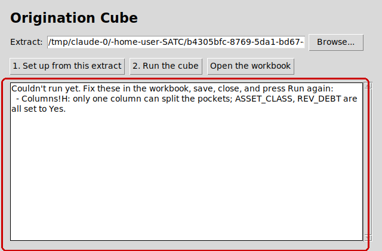

**B: the only segment split**

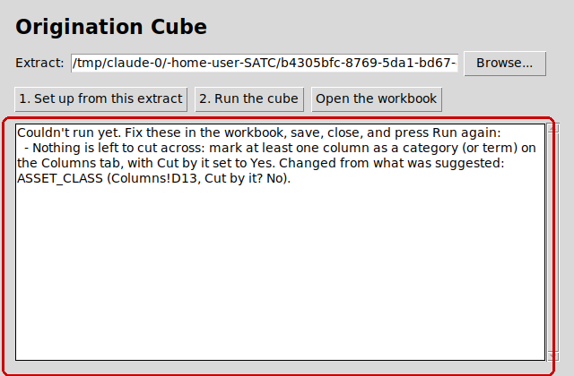

**C: average on a category**

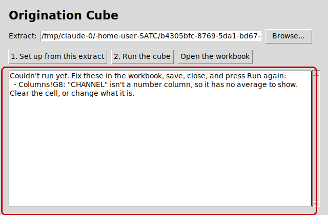

**D: edges that Excel made into one number**, then **D2: an edge outside the range**, then commas kept as text (it ran, with 4 bands):

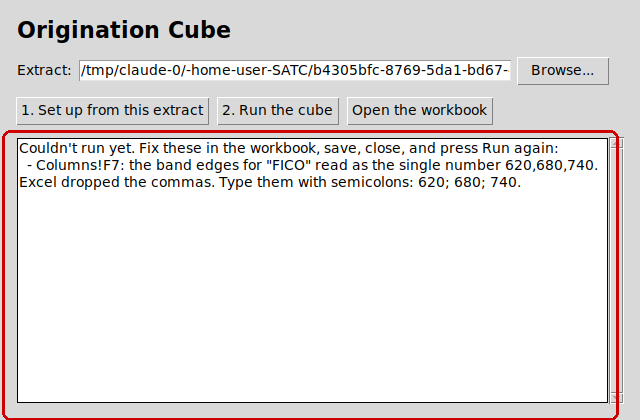

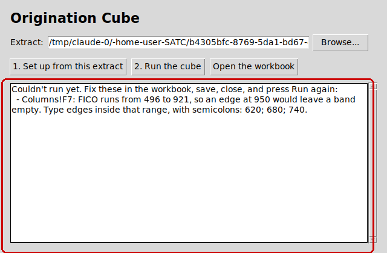

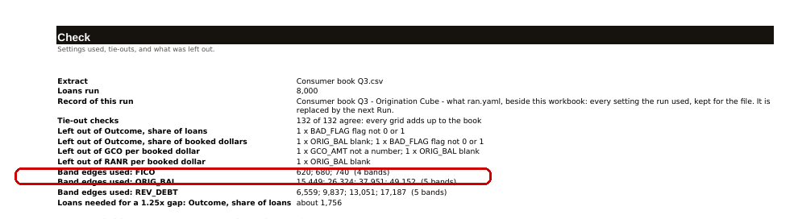

**E: workbook open.** Simulated by locking the file (`chattr +i`), since Excel isn't available here. Run and Set up both refuse, and neither the memory file nor the record file changes:

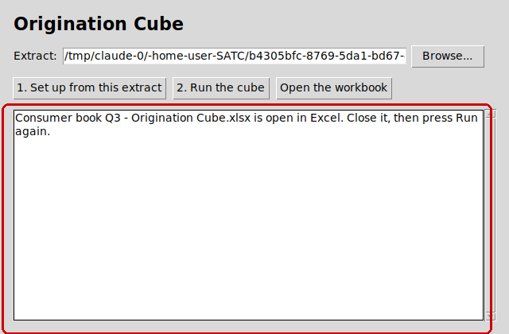

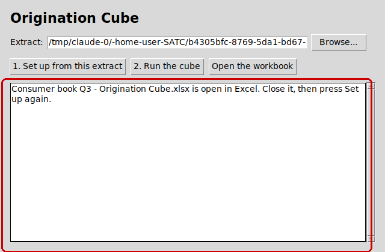

**F: a column renamed after Set up**

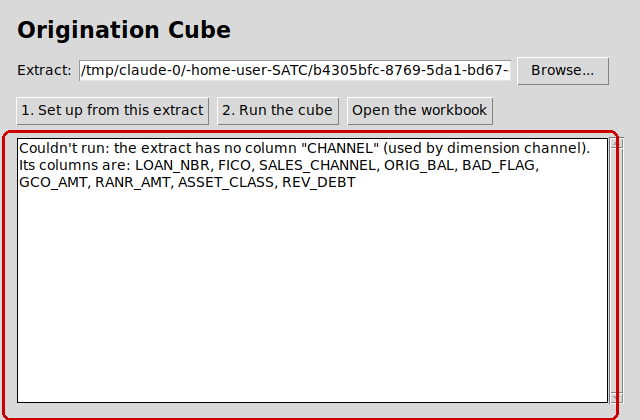

**G: fewer rows after Set up**

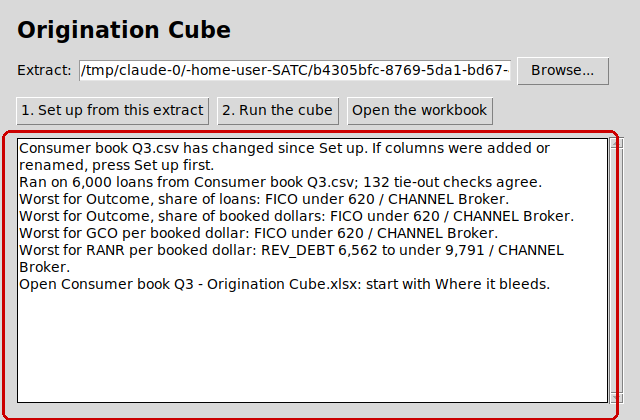

**H: the workbook copied to another folder**

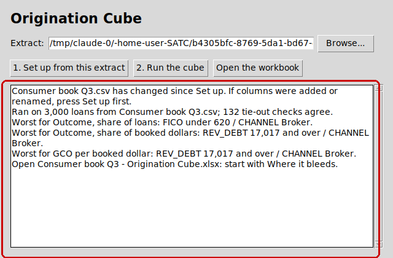

**I: split by GCO, and by the loan number**

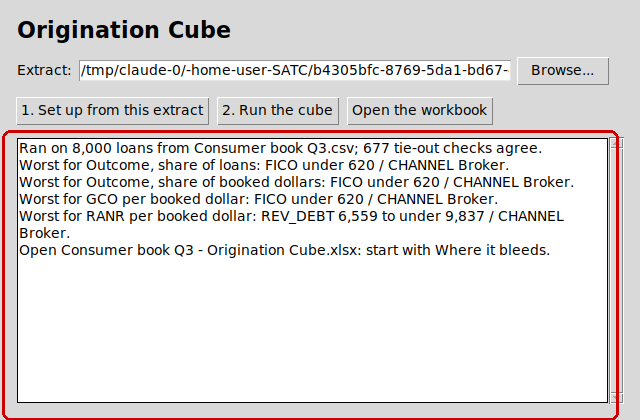

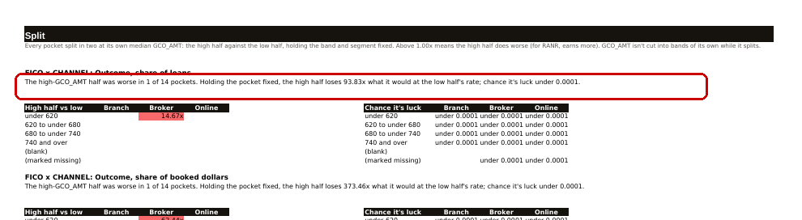

**J: your own dollar materiality**

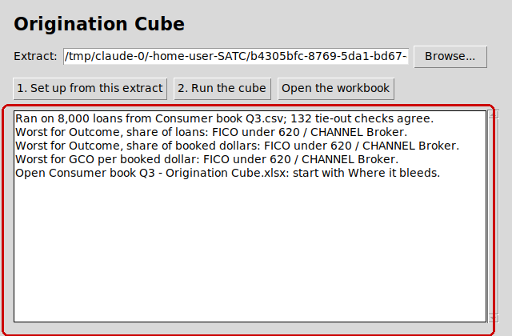

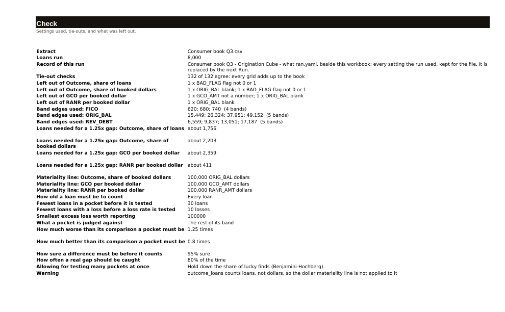

**K: the workbook picked as the extract**

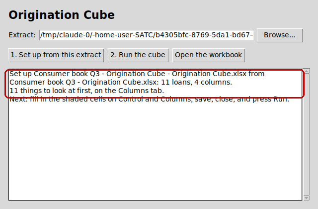

**L: 95 for "how sure", and 0.9 for "how much worse"**

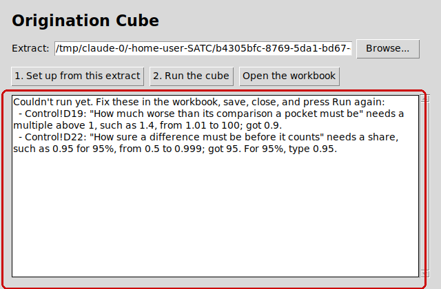

**N: new columns in a refreshed extract**

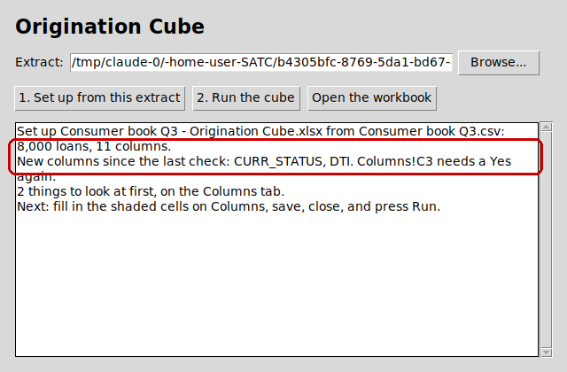

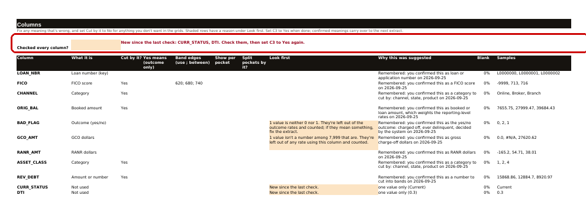

---

## How this was walked

On a Linux test machine:
- **The window:** `Origination Cube.pyw`'s window on a virtual display, its buttons pressed by `driver/drive.py` (through `driver/win.sh`), each state photographed.
- **Excel's part:** done cell by cell with openpyxl (`driver/edit.py`), standing in for picking from the dropdowns and typing.
- **The workbook:** each state printed through LibreOffice (`driver/render.sh`) and photographed page by page. `driver/shots.py` crops and rings every picture here.
- **Wrong turns:** each in a folder of its own, from a copy of the answered workbook (`driver/wrong.sh`).
- **The build:** frozen at commit `00c0bdd` with `git archive`.
- **Memory and preferences:** a scratch `CUBE_MEMORY` and `HOME`.
- **The no-effect check** behind step 18's warning: `driver/noplant.py`.

The order walked: steps 1 to 17, then 18, 19, 20 and 21 on the same workbook, then 22 and 23, then the wrong turns.
