# Origination analysis: the window and the workbook

**Who this is for:** the analyst preparing an origination analysis for a bank's line of business (LOB). No command line is needed.
**What you finish with:** one workbook beside the loan extract. It holds your answers, a ranked list of the pockets that lose more than their share, losses set against revenue, and, if you ask for it, every pocket split by a third column and ranked again.
**Walked:** 25 September 2026, on commit `1156ff4`, with a synthetic book of 8,000 loans. The book hides two things: a bad pocket (scores under 620 in the Broker channel), and borrowers carrying more revolving debt than usual for their score, who go bad 1.8 times as often. RANR has nothing planted in it. No real bank data was used.

> **What changed since the third walk:** Losses vs revenue has nine boxes set by lines on Control, a new Control call for revenue, and one chart per grid (steps 5, 9 and 13). The Split tab says what each grid holds fixed (step 18). The Three-way tab ranks every split pocket (steps 18 and 19). A Forget on Learned now holds until you confirm the column again (step 23).

<!-- ROUTE -->

## Before you start

- **Python 3.10 or later**, and **`Install add-ons.bat`** run once. You only need to do this the first time.
- **Excel.**
- **The loan extract** (.csv or .xlsx) in its own folder. It needs a loan number, the booked amount, a yes/no outcome, GCO dollars and RANR dollars.

---

## Step 1: Open the window

Double-click **`Origination Cube.pyw`** in the `origination-cube` folder.

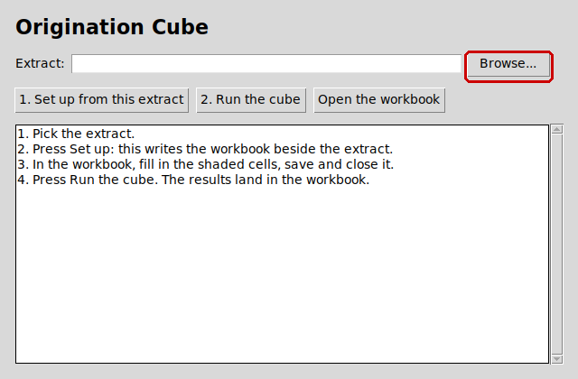

**Right:** a window titled *Origination Cube*, an empty Extract box, three buttons, and four numbered lines in the box underneath.

**Wrong:** if the box says something needs installing, run `Install add-ons.bat` once, then open the window again.

## Step 2: Pick the extract

Press **Browse...** and pick the loan file. After a first Set up the folder also holds the workbook. Pick the loan file, not the workbook; if you pick the workbook, Set up refuses and names the file to pick (wrong turn K).

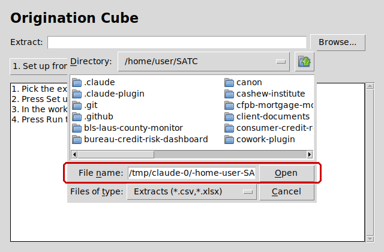

On Windows this is the usual Open dialog. The picture shows the same step on the test machine.

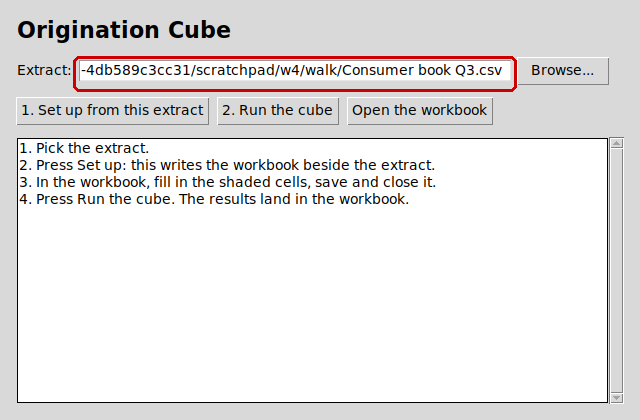

**Right:** the file name is at the right-hand end of the Extract box.

## Step 3: Press 1. Set up from this extract

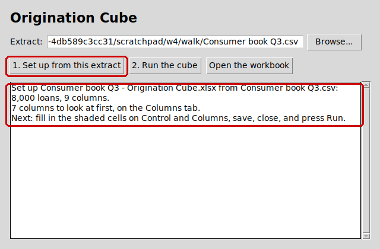

**Right:** "Set up Consumer book Q3 - Origination Cube.xlsx from Consumer book Q3.csv: 8,000 loans, 9 columns", then "7 columns to look at first, on the Columns tab". The workbook now sits beside the extract.

**Check the loan count against what the bank sent.** If it's wrong, you picked the wrong file.

## Step 4: Open the workbook: Start here

Press **Open the workbook**, or double-click it in its folder. It opens on **Start here**.

**Right:** four steps (Control, Columns, Odd values, Launcher) and *Where things stand*: **9** calls to make on Control, 7 things to look at on Columns, 2 odd values, *not run yet*.

## Step 5: Control: see what needs an answer

Click the **Control** tab.

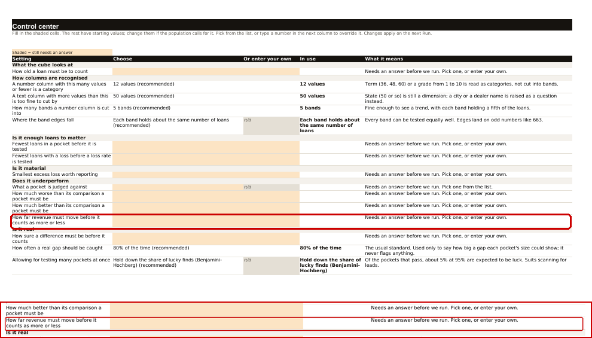

**Right:** nine rows are shaded peach. They are the calls the tool won't make for you: loan age, fewest loans, fewest losses, materiality, what a pocket is judged against, how much worse, how much better, **how far revenue must move** (ringed, new), and how sure. The other rows start on a recommended setting.

## Step 6: Columns: see what each column was taken to be

Click the **Columns** tab.

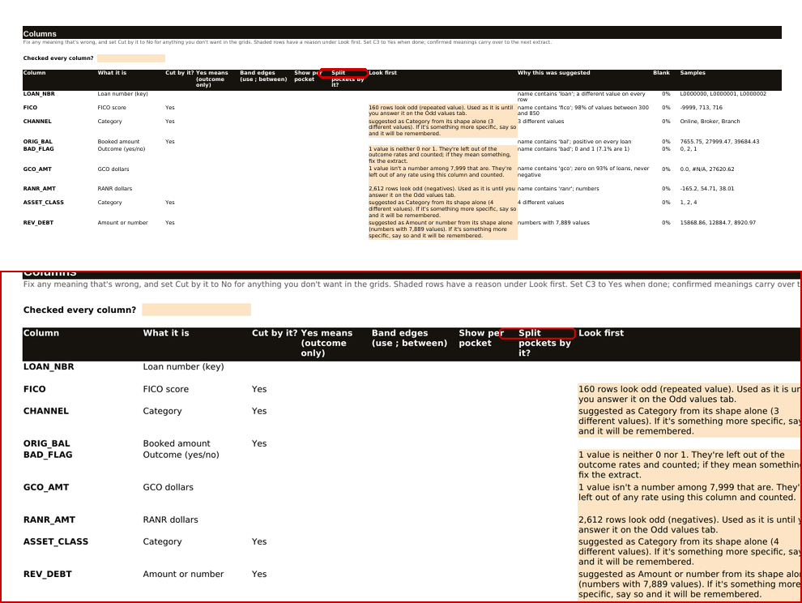

**Right:** one row per column, with a meaning in *What it is* and the reason beside it. Seven rows are shaded under **Look first**. *Checked every column?* (C3) is shaded and empty. **Split pockets by it?** (ringed) is for steps 18 and 19. Leave it blank for now.

## Step 7: Odd values, and Learned

Click **Odd values**.

**Right:** FICO's -9999 (160 rows) and RANR's negatives (2,612 rows), each with a shaded Answer cell.

The **Learned** tab lists what the tool remembers from earlier runs. On the first extract it says *Nothing learned yet*.

## Step 8: If you press Run too early

If you save, close and press **2. Run the cube** before answering, nothing runs.

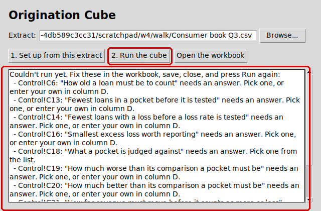

**Right:** "Couldn't run yet", then one line per thing to fix, each naming the tab and cell. The same list goes to the **Log** tab.

**Scroll the box.** The last three lines (Control!C21, Control!C23 and Columns!C3) are below the fold:

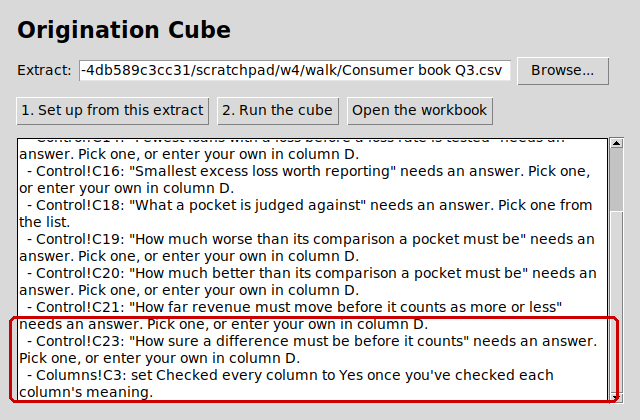

## Step 9: Fill in the shaded cells on Control

Click each shaded **Choose** cell and pick from its list. To use a number that isn't offered, type it in **Or enter your own** instead. The walk used:

| Setting | Answer |
|---|---|
| How old a loan must be to count | Every loan |
| Fewest loans in a pocket before it is tested | 30 loans |
| Fewest loans with a loss before a loss rate is tested | 10 losses |
| Smallest excess loss worth reporting | 1% of the book's total losses |
| What a pocket is judged against | The rest of its band |
| How much worse | 1.25 times |
| How much better | 0.8 times |
| How far revenue must move before it counts | What luck alone can move it (suggested) |
| How sure | 95% sure |

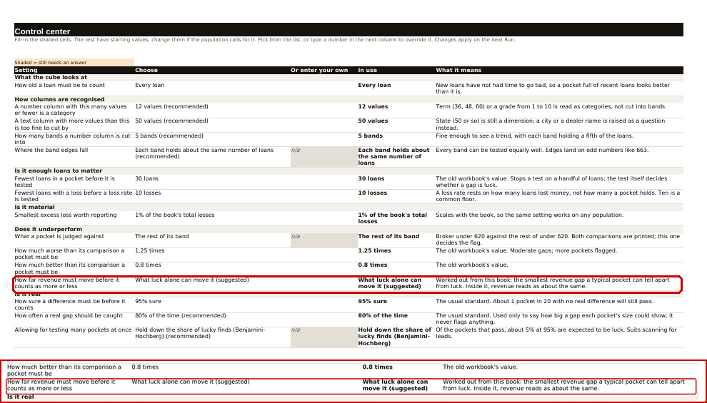

**Right:** the peach shading is gone, and *In use* and *What it means* fill in for each row.

**The revenue line has no number yet.** With *What luck alone can move it*, the line is worked out when you Run. It shows at the top of Losses vs revenue and on Check (1.25x on this book). The other options:
- *5 percent either way* or *10 percent either way*: revenue counts as more or less once it's 5% or 10% off.
- *The same lines as for losses*: revenue uses the two answers above it, turned round (0.80x and 1.25x here).
- *Or enter your own*: a share between 0.01 and 0.9, such as 0.15 for 15%.

## Step 10: Confirm the columns and answer the odd values

On **Columns**, check each *What it is*. Fix any that's wrong from its list, then set **Checked every column?** (C3) to **Yes**.

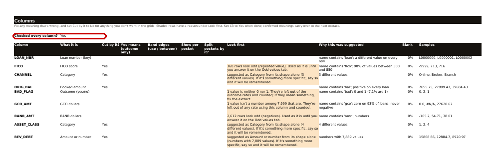

On **Odd values**, answer each row. The walk said FICO's -9999 is **missing** and RANR's negatives are **real**, because RANR is revenue and can be negative.

## Step 11: Save, close, and press 2. Run the cube

Save the workbook and **close Excel**. Then press **2. Run the cube**.

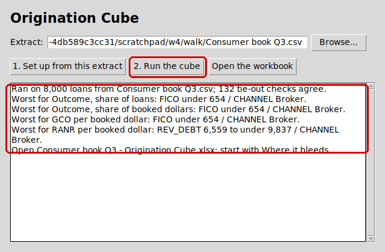

**Right:**
- "Ran on 8,000 loans from Consumer book Q3.csv; 132 tie-out checks agree."
- one *Worst for* line per measure. For the three loss measures it's **FICO under 654 / CHANNEL Broker**, the planted pocket seen through five equal bands.

The *Worst for RANR* line (REV_DEBT 6,559 to under 9,837 / Broker) is noise. The test data plants nothing in RANR.

## Step 12: Read Where it bleeds

Open the workbook again. **Where it bleeds** lists every pocket that loses more than its share, largest first.

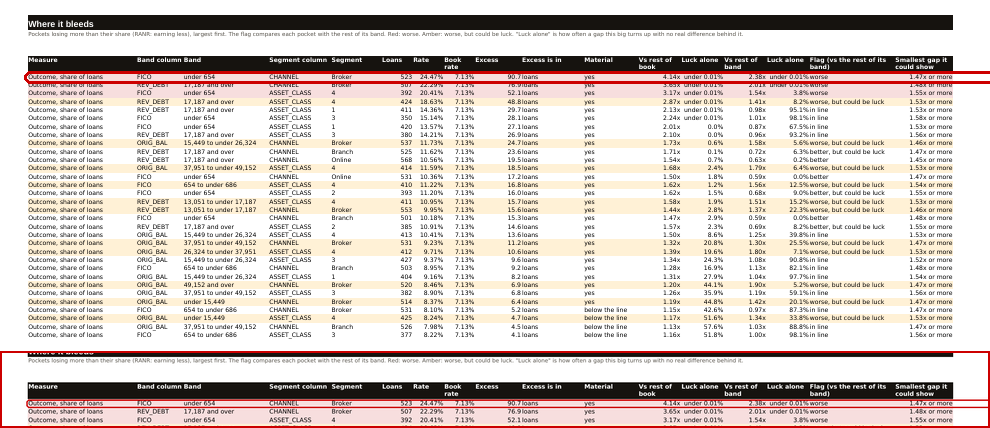

**Right:** the first row is FICO under 654 / CHANNEL Broker: 523 loans, 24.47% bad against a book of 7.13%, an excess of 90.7 loans, 4.14x the rest of the book, 2.38x the rest of its band, flagged **worse**.

How to read a row:
- **Red rows** are worse, and the test says it isn't luck. **Amber** rows are worse but could be luck.
- **Excess is in** gives the unit: loans for the bad-loan share, dollars of a named column otherwise.
- **The flag** uses the comparison you chose in step 9 (here, the rest of its band). The heading says which.
- **Luck alone** is how often a gap this big turns up with no real difference. A figure shown as *0.0%* is under 0.05%, not zero.
- **RANR** rows are shortfalls: pockets earning less than their share.

## Step 13: Losses vs revenue

**Losses vs revenue** puts every pocket of at least 30 loans in one of nine boxes. Each side reads *more*, *the same* or *less* by the lines at the top of the tab, and the box is the pair. There's one block and one chart per grid.

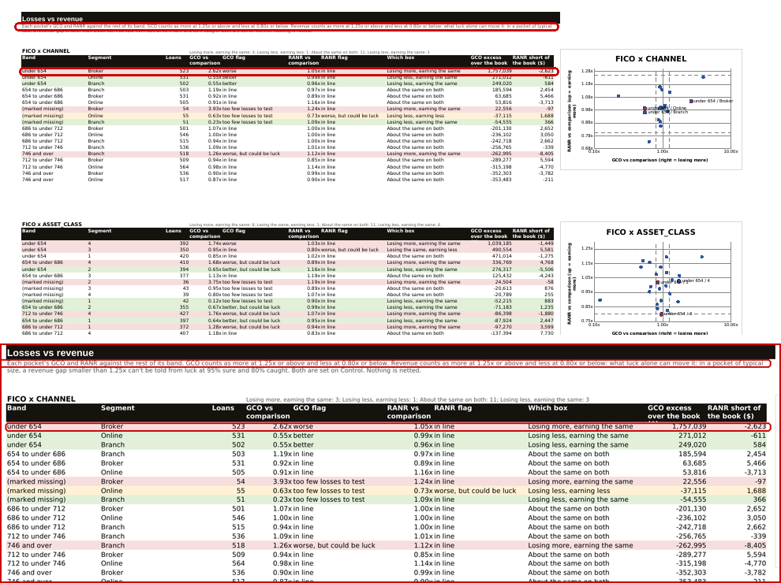

**Right:**
- The subtitle gives both sets of lines: GCO at 1.25x and 0.80x, revenue at 1.25x and 0.80x, "what luck alone can move it".
- The planted pocket, FICO under 654 / Broker (ringed), reads **Losing more, earning the same**: GCO 2.62x the rest of its band, RANR 1.05x.
- Above each block, a count per box.

**Read the box with the dollars in mind.** The box compares a pocket with the rest of its band. The two dollar columns and the order of the rows compare it with the book. So under 654 / Online reads **Losing less** (0.55x its band) but loses $271,012 more than the book would expect. And 746 and over / Branch reads **Losing more** but loses $262,995 less (defect 2).

**Pockets marked *too few losses to test* still get a box and a colour.** Treat their box as unread (defect 3).

The chart plots the same pockets, GCO across on a scale of tens and RANR up, with the four Control lines dashed. The three pockets with the most GCO excess over the book are named:

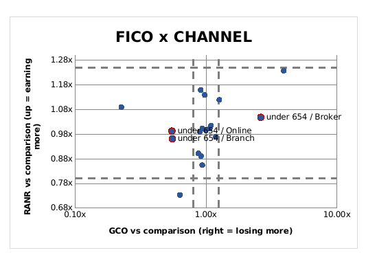

Two of the three names on this chart sit left of the 0.80x line: they are big in dollars and better than the rest of their band. Where names overlap, use the table.

**Try another revenue line.** Change *How far revenue must move* on Control, save, close and Run. With *5 percent either way*, 69 of 112 pockets read as earning more or less, against 5 with the luck line. The planted pocket stays in *earning the same* at 1.05x, just under the line:

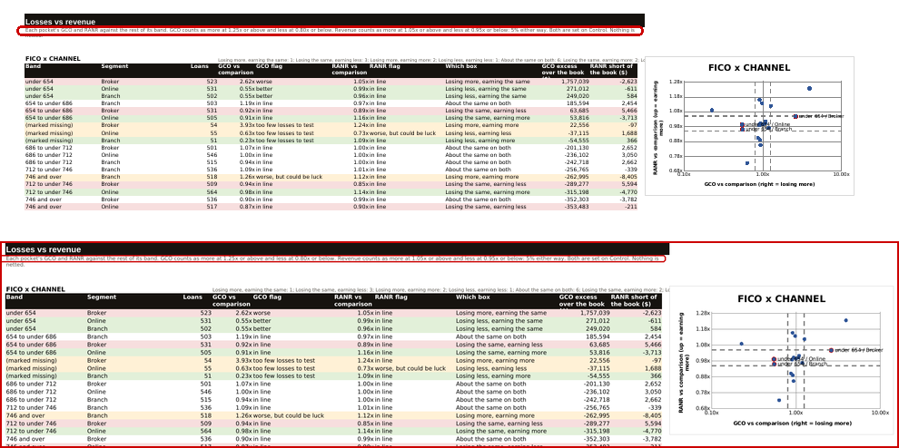

What each option did on this book (112 pockets):

| Revenue line | Revenue counts as more / less at | Earning more | Earning less |
|---|---|---|---|
| What luck alone can move it | 1.25x / 0.80x | 0 | 5 |
| 5 percent either way | 1.05x / 0.95x | 37 | 32 |
| 10 percent either way | 1.10x / 0.90x | 22 | 18 |
| The same lines as for losses | 1.25x / 0.80x | 0 | 5 |
| Your own: 0.15 | 1.15x / 0.85x | 8 | 8 |

On this book *luck* and *the same lines as for losses* land on the same lines (1.248 against 1.25). The luck line depends on the grids in the run, so it moves when you split or change bands: 1.22x with ASSET_CLASS split, 1.24x with the LOB's own edges (defect 4).

**Your own value is a share.** 95 is refused, and so is 0.95: the most it takes is 0.9. The first message says "For 95%, type 0.95", which is then refused too (defect 5).

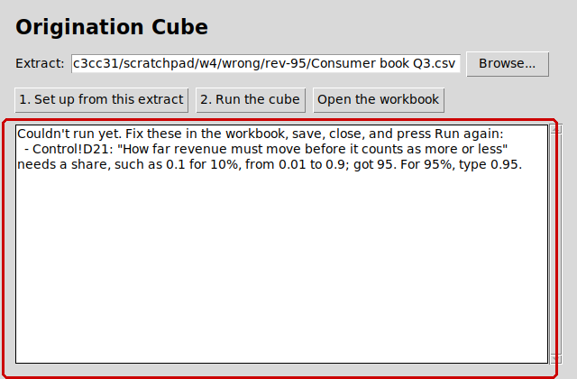

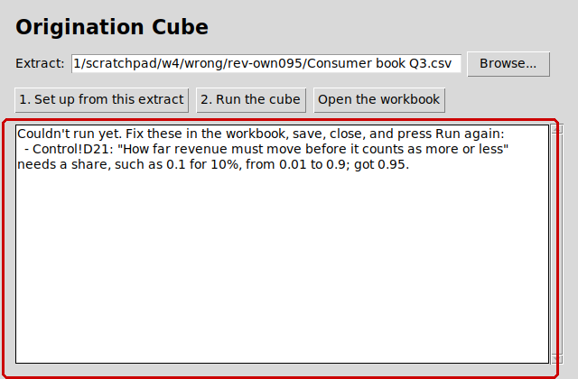

## Step 14: Grids

**Grids** shows each band crossed with each segment, one block per measure: the rate, the rate against the book, and the rate against the rest of the same band. Red is worse and green is better.

**Right:** under 654 / Broker is 24.47%, 3.43x the book and 2.38x the rest of its band. The *(marked missing)* row is blank in the two comparison blocks (ringed), because its pockets have too few losses to test. The note under each block says so.

For RANR, **more is better**, and the heading says so. Low is red:

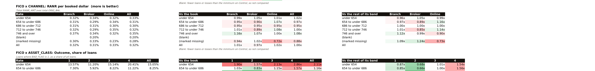

## Step 15: Materiality

**Materiality** shows, for every grid and measure, what each level would keep: how many pockets and how much of the grid's excess.

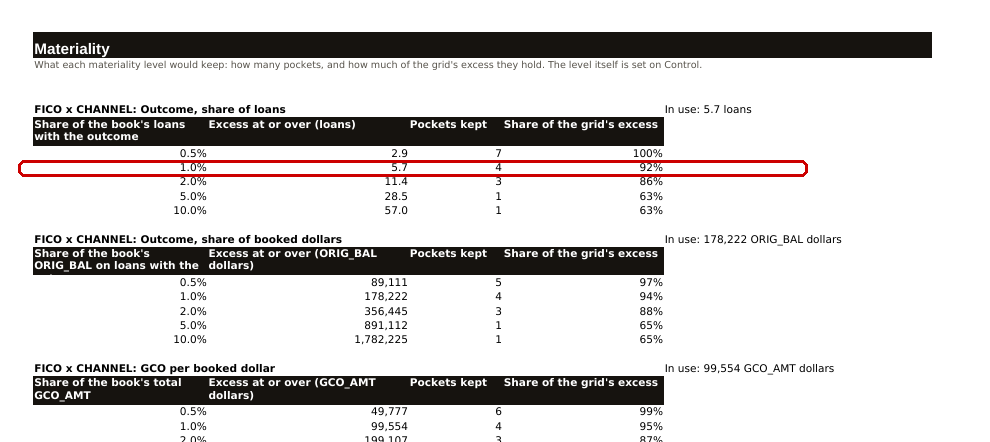

**Right:** for *FICO x CHANNEL: Outcome, share of loans*, the level in use is 5.7 loans (1% of the book's bad loans), which keeps 4 pockets and 92% of the excess. Control offers every level shown here.

## Step 16: Check

**Check** records what the run did: the extract and loan count, the record file, the tie-outs, what was left out, the band edges, the loans needed to show a 1.25x gap, each materiality line with its unit, **the revenue lines and where they came from** (ringed), and every setting in words.

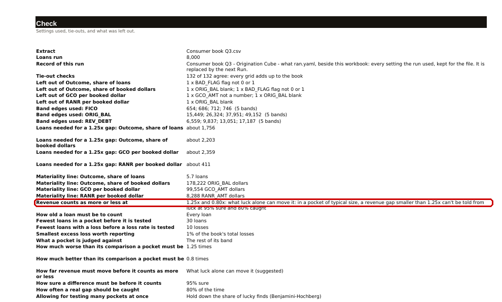

**Right:** "132 of 132 agree", five bands for each number column, and the settings match step 9.

## Step 17: Log, and Start here

**Log** keeps every run, newest first, including refused ones.

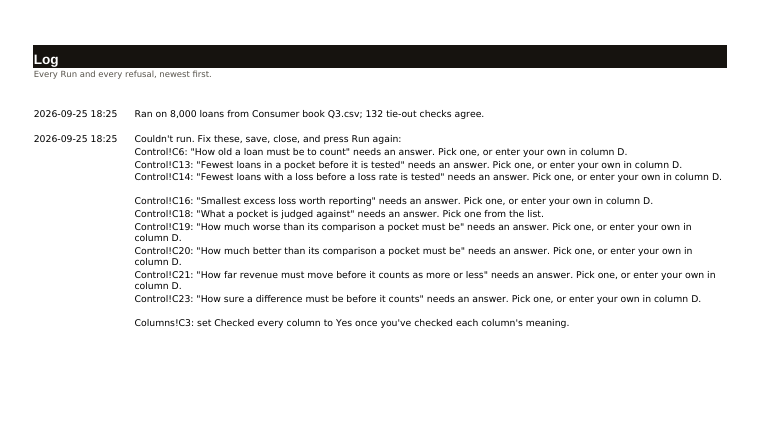

**Start here** now shows 0 calls left and the last run:

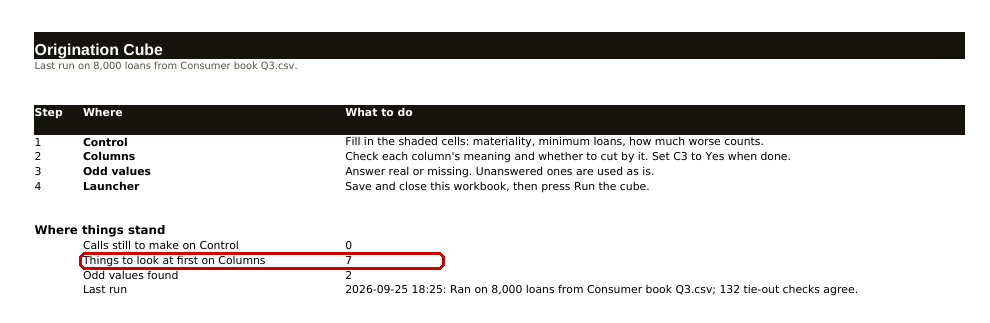

It still says 7 things to look at on Columns, although C3 is Yes. The count only changes at the next Set up (defect 9).

## Step 18: Split every pocket by a number (revolving debt)

On **Columns**, set **Split pockets by it?** to **Yes** on one number column. The walk used **REV_DEBT**. Save, close, and Run.

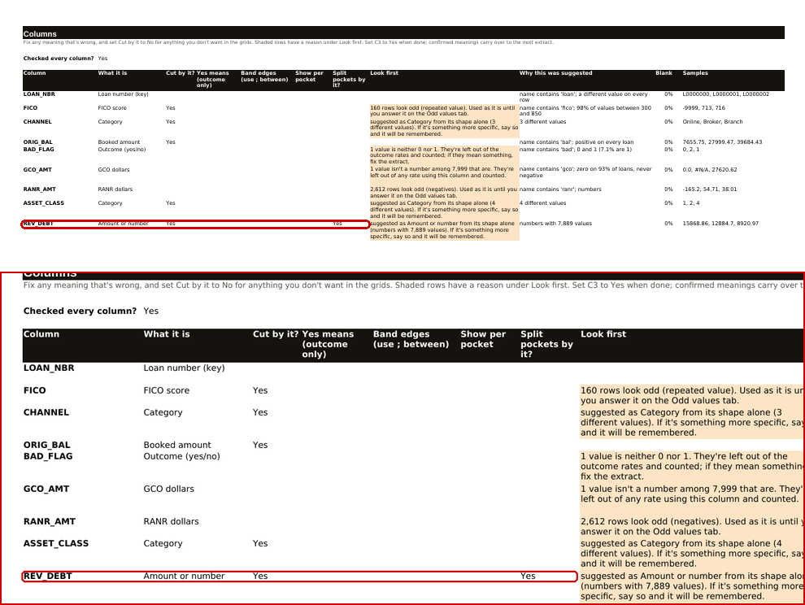

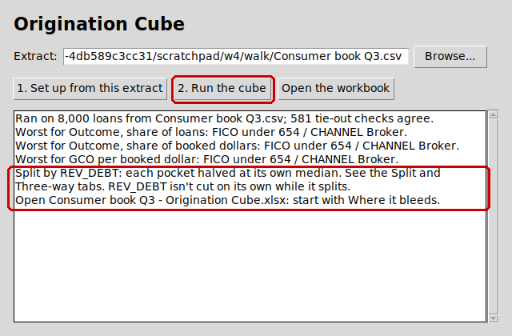

**Right:** "581 tie-out checks agree" and "Split by REV_DEBT: each pocket halved at its own median. See the Split and Three-way tabs." The *Worst for RANR* line is gone, because REV_DEBT is no longer cut into bands.

Open the **Split** tab. Each grid gets a paragraph and two heat maps: the high half against the low half, and how often luck alone gives a gap that big.

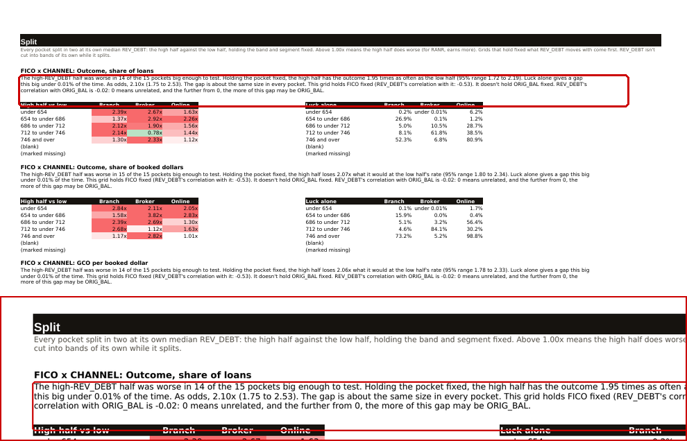

**How to read it:**
- **The first number is the one to quote.** For FICO x CHANNEL the high-debt half has the outcome **1.95 times** as often as the low half (95% range 1.72 to 2.19). The planted effect is 1.8x. The odds, 2.10x, follow.
- **Grids that hold the score fixed come first.** Each paragraph ends with what the grid holds fixed and the correlation. REV_DEBT's correlation with FICO is -0.53.
- **Blank rows** are halves under the minimum loans or losses.

**Don't quote the ORIG_BAL grids.** They say 2.55x and 2.57x, and the paragraph ends "It doesn't hold FICO fixed. REV_DEBT's correlation with FICO is -0.53":

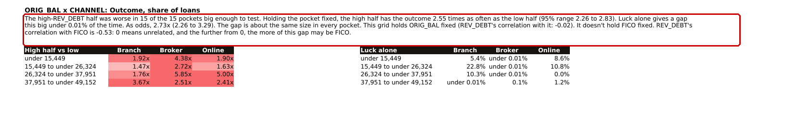

On a copy of this book with **no** revolving-debt effect, those grids still read 1.62x and 1.66x, "under 0.01%" (defect 1). The FICO grids read 1.16x and 1.15x there, with ranges that include 1.

**The Three-way tab** ranks every band / segment / half pocket like any other pocket, largest excess first:

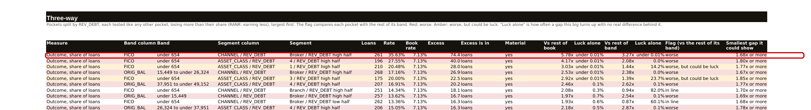

**Right:** FICO under 654 / Broker / high half is first: 261 loans, 35.63% bad, 5.78x the rest of the book. Rows from ORIG_BAL grids with *high half* in them carry the same score problem as step 18d, and this tab doesn't say so.

## Step 19: Split every pocket by a category (asset class)

Clear REV_DEBT's split and set **ASSET_CLASS** instead. Save, close, and Run.

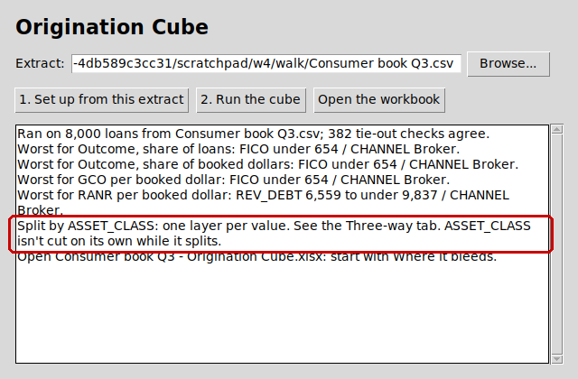

**Right:** "382 tie-out checks agree" and "Split by ASSET_CLASS: one layer per value. See the Three-way tab. ASSET_CLASS isn't cut on its own while it splits." Grids repeats each block once per asset class. **Three-way** ranks every pocket:

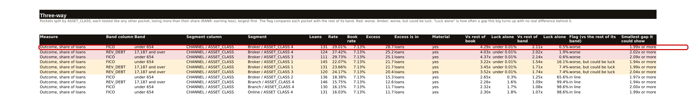

**Right:** FICO under 654 / Broker / asset class 4 first: 131 loans, 29.01% bad, flagged worse against the rest of its band. Check records the split and "Three-way pockets: 194".

## Step 20: Show a median or average per pocket

On **Columns**, set **Show per pocket** to *median* or *average* on any number column. The walk put *average* on ORIG_BAL and *median* on REV_DEBT. Save, close, and Run.

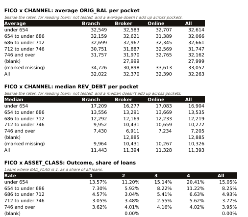

**Right:** each grid on **Grids** gets a block per column, with the note "Beside the rates, for reading them: not tested, and a median doesn't add up across pockets."

## Step 21: Use the LOB's own cut points

If the LOB cuts scores at 620, 680 and 740, type them in that column's **Band edges** cell with **semicolons**: `620; 680; 740`. Save, close, and Run.

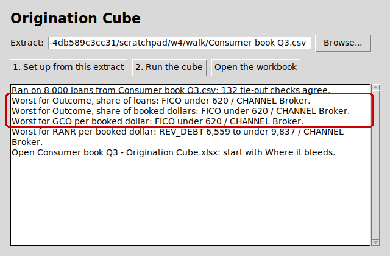

**Right:** the worst pocket is now **FICO under 620 / CHANNEL Broker**. On Losses vs revenue it reads **Losing more, earning the same**: 176 loans, GCO 5.35x the rest of its band, RANR 1.17x:

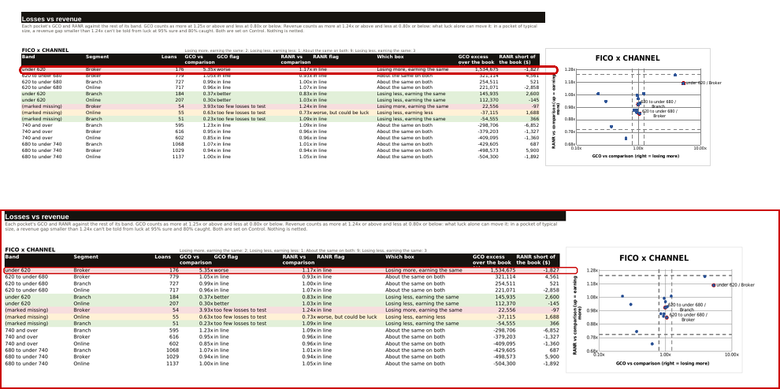

## Step 22: The next extract: press Set up again

Press **1. Set up from this extract** again, on the same extract or a refreshed one with the same name.

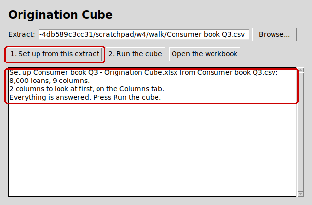

**Right:** "Everything is answered. Press Run the cube." Your Control, Columns and Odd values answers are kept, and so are the last run's results and the Log:

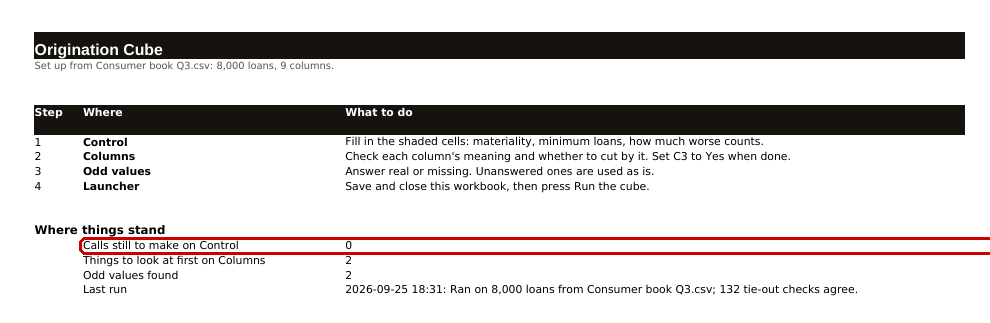

If the new extract has columns the old one didn't, C3 is cleared and the new columns are shaded "New since the last check" (wrong turn N).

## Step 23: Prune something learned

On **Learned**, set a row's **Keep?** to **Forget**, then save, close and Run.

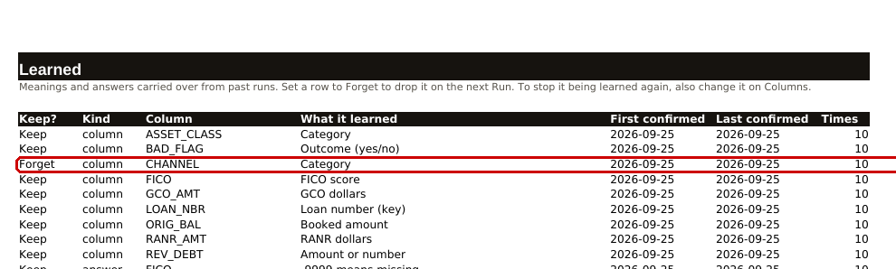

**Right:** the window says "Forgot CHANNEL, as marked on Learned. Check it on Columns and set C3 to Yes before the next Run."

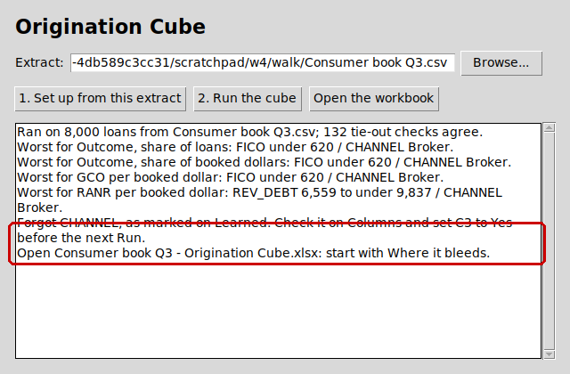

The next Run refuses until you do:

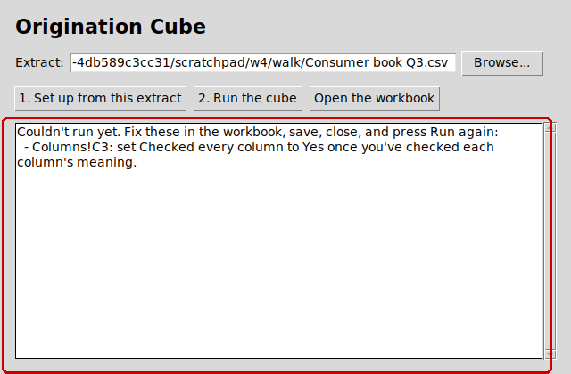

On **Columns**, C3 is empty with "Forgotten on Learned: CHANNEL. Check what it is, then set C3 to Yes again." CHANNEL's row is shaded:

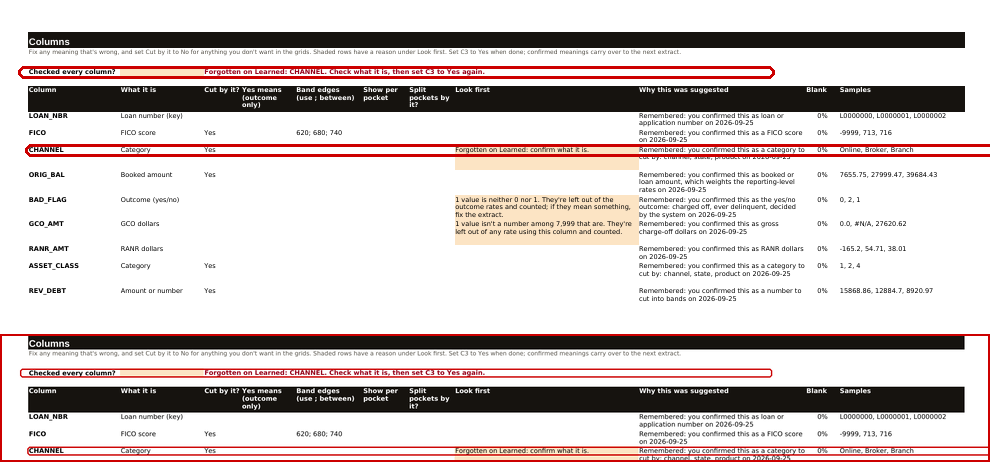

Check CHANNEL's meaning, set C3 to Yes, save, close and Run. It is learned again from your answer.

---

## When something goes wrong

| What you did | What the window says | What to do |
|---|---|---|
| **A.** Split set on two columns | "Columns!H13 and Columns!H14: only one column can split the pockets. Clear all but one." | Clear one. |
| **B.** Split the only category that's cut, with the other set to Cut by it? No | "Nothing is left to cut across ... CHANNEL (Columns!H8: it splits the pockets, so it isn't a segment of its own); ASSET_CLASS (Columns!D13, Cut by it? No)." | Clear the split, or set ASSET_CLASS back to Yes. |
| **C.** *average* on a category | "Columns!G8: "CHANNEL" isn't a number column, so it has no average to show." | Clear the cell. |
| **D.** Edges typed as `620,680,740` and turned into one number by Excel | "Columns!F7: the band edges for "FICO" read as the single number 620,680,740 ... Type them with semicolons." | Retype with semicolons. |
| **D2.** An edge outside the column's range (`620; 680; 950`) | "Columns!F7: FICO runs from 496 to 921, so an edge at 950 would leave a band empty." | Type edges inside that range. |
| **E.** Workbook still open in Excel | "... is open in Excel. Close it, then press Run again." Set up says the same. Nothing else changes. | Close Excel and press again. |
| **F.** A column renamed in the extract after Set up | "Couldn't run: the extract has no column "CHANNEL" (a segment) ... If a column was renamed or dropped, press Set up again". After Set up: "New columns since the last check: CHNL. Columns!C3 needs a Yes again." | Press Set up, check the new name, set C3 to Yes, Run. |
| **G.** Rows changed in the extract after Set up | "Consumer book Q3.csv has changed since Set up...", then it runs on the new rows (6,000). | Check the loan count. |
| **H.** Workbook copied into a new folder with a new extract of the same name | The same "has changed since Set up" line; it runs the new folder's extract (3,000 loans). | Press Set up in the new folder first. |
| **I.** Split set on GCO, the loan number or the outcome | "Columns!H11: "GCO_AMT" is marked GCO dollars, which can't split the pockets. Only a score, ratio, amount or category can." The key and the outcome are refused the same way. | Split only by something known at booking. |
| **I2.** Split set on the booked amount (ORIG_BAL) | Runs, 571 tie-outs (defect 6). | Treat with care: it takes ORIG_BAL out of the bands. |
| **J.** A dollar amount typed as your own materiality (100000) | Runs. Check says "$100,000 of GCO" and "no line" for every other rate, with a warning each. | Use it for GCO only, as it says. |
| **K.** The workbook picked as the extract | "... is the workbook, not the loan file. Pick the extract it was set up from (Consumer book Q3.csv or Consumer book Q3.xlsx)." Pressing Run then says "There's no workbook ... Press 1. Set up" (defect 11). | Browse to the .csv. |
| **L.** 95 typed for "how sure" | "... needs a share, such as 0.95 for 95%, from 0.5 to 0.999; got 95. For 95%, type 0.95." | Type 0.95, or pick "95% sure". |
| **M.** 95, or 0.95, typed as your own revenue line | "... needs a share, such as 0.1 for 10%, from 0.01 to 0.9; got 95. For 95%, type 0.95." Then 0.95 is refused too. | Type a share up to 0.9, such as 0.15. |
| **N.** New columns in a refreshed extract | "New columns since the last check: CURR_STATUS, DTI. Columns!C3 needs a Yes again." | Check them, set C3 to Yes. |
| **O.** Forget on Learned, then Run twice | The second Run: "Columns!C3: set Checked every column to Yes..." | Check the forgotten column, set C3 to Yes. |

**A: two splits**

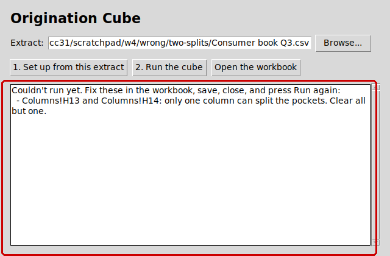

**B: the only segment split**

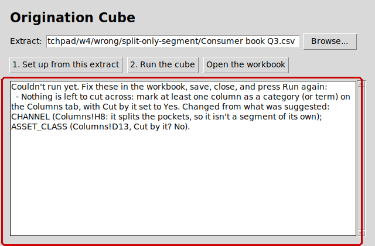

**C: average on a category**

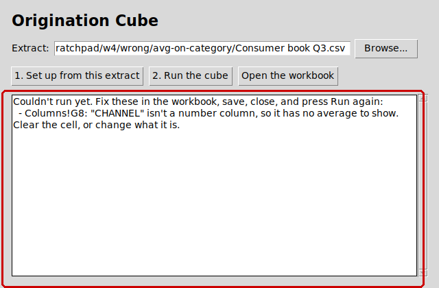

**D and D2: edges**

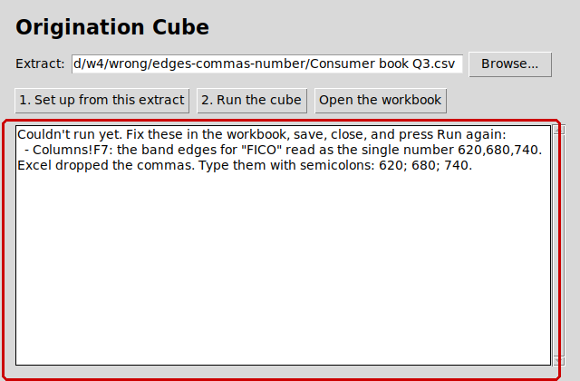

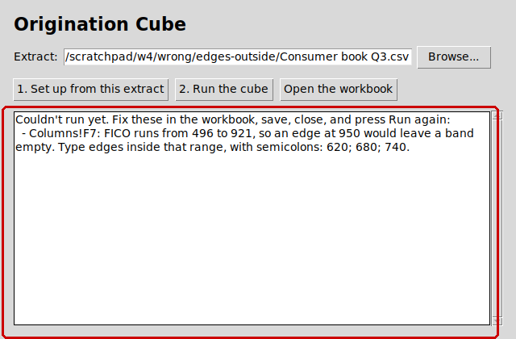

**E: workbook open.** Simulated by locking the file (`chattr +i`), since Excel isn't available here. Run and Set up both refuse, and the memory file doesn't change:

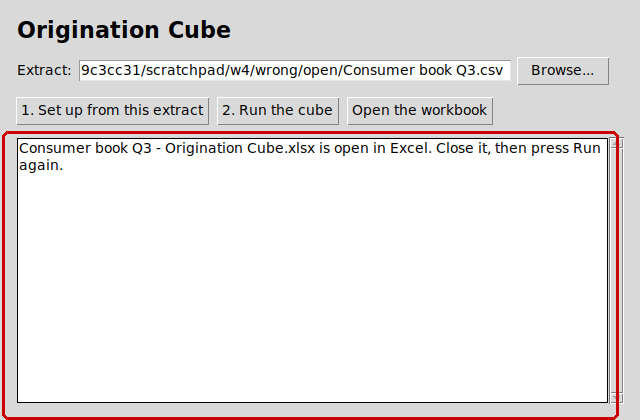

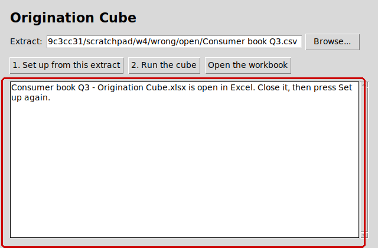

**F: a column renamed after Set up, then Set up pressed**

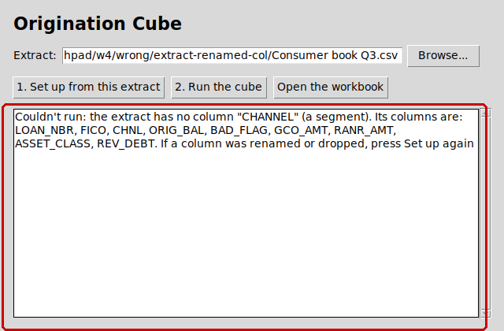

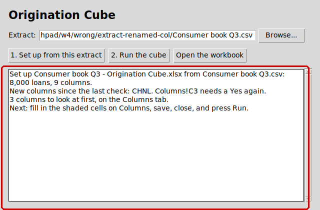

**G: fewer rows after Set up**

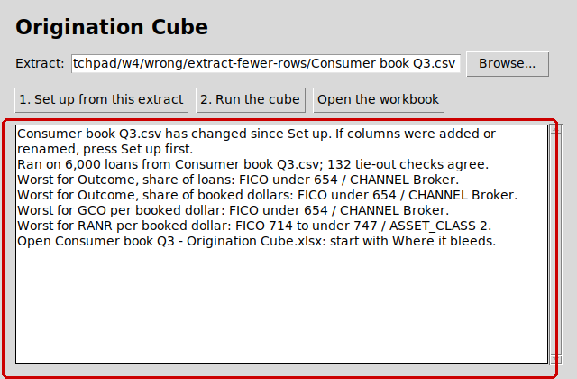

**H: the workbook copied to another folder**

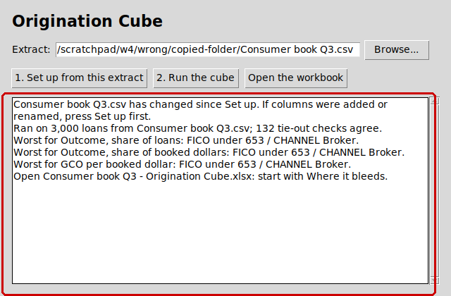

**I: split by GCO, the loan number, the outcome; I2: by the booked amount**

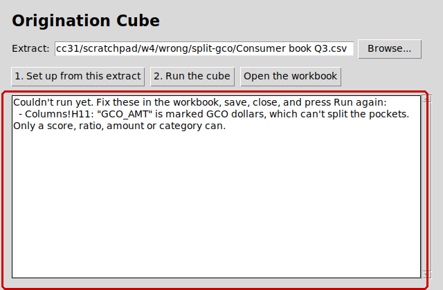

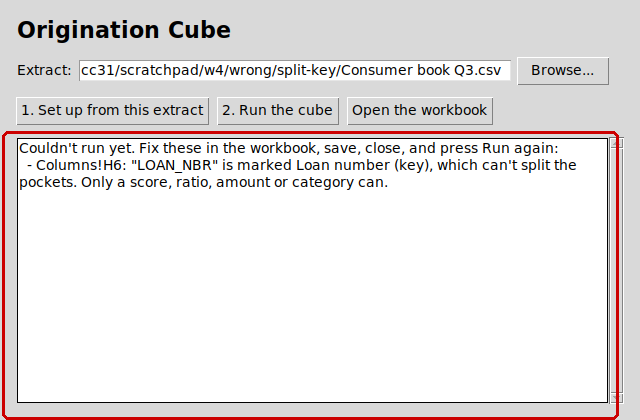

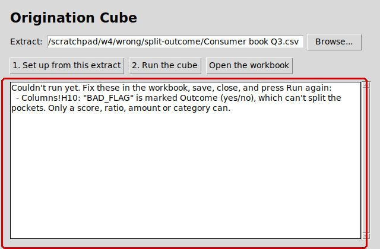

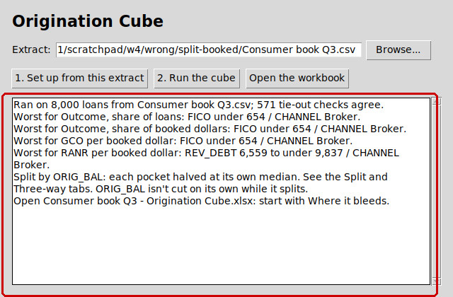

**J: your own dollar materiality**

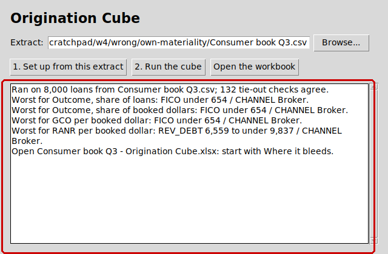

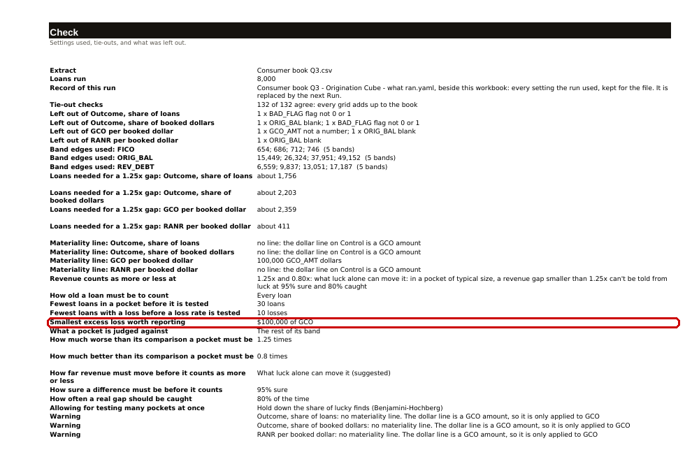

**K: the workbook picked as the extract, then Run**

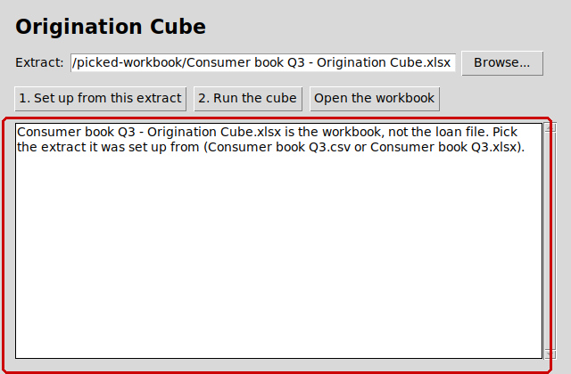

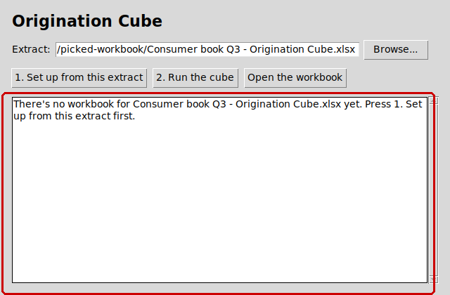

**L: 95 for "how sure"**

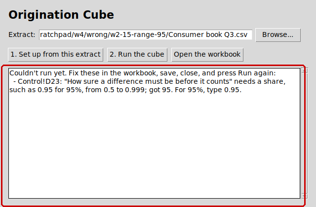

**N: new columns in a refreshed extract**

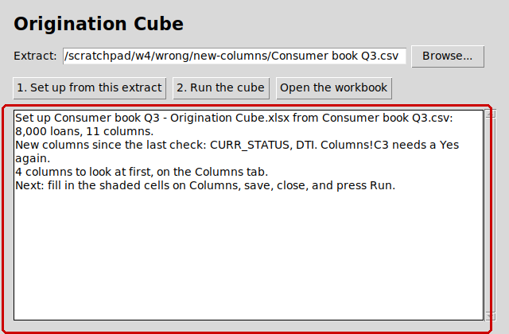

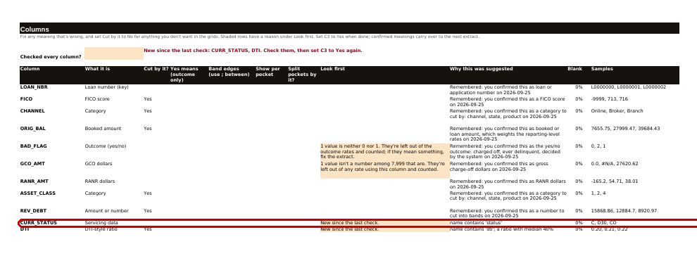

---

## How this was walked

On a Linux test machine:
- **The window:** `Origination Cube.pyw`'s window on a virtual display under Python 3.12, its buttons pressed by `driver/drive.py` (through `driver/win.sh`), each state photographed.
- **Excel's part:** done cell by cell with openpyxl (`driver/edit.py`), standing in for picking from the dropdowns and typing.
- **The workbook:** each state printed through LibreOffice (`driver/render.sh`) and photographed page by page. `driver/shots.py` crops and rings every picture, finding each ringed row by its own words on the printed page.
- **Wrong turns and revenue options:** each in a folder of its own, from a copy of the answered workbook (`driver/wrong.sh`).
- **The build:** frozen at commit `1156ff4` with `git archive`.
- **Memory and preferences:** a scratch `CUBE_MEMORY` and `HOME`.
- **The no-effect check** behind step 18's warning: `driver/noplant.py`, and the same book run through the window (`wrong-noplant-split.png`).
- **Reading tabs back:** `driver/boxcheck.py` (Losses vs revenue boxes against flags and dollars), `driver/revenue_options.py` (step 13's table), `driver/threeway.py` (Three-way flags by grid), `driver/luckline.py` (what the suggested revenue line is made of).

The order walked: steps 1 to 17, the revenue options, then 18 to 21 on the same workbook, then 22 and 23, then the wrong turns.
