# Origination analysis: the window and the workbook

**Who this is for:** the analyst preparing an origination analysis for a bank's line of business (LOB). No command line is needed.
**What you finish with:** one workbook beside the loan extract. It holds your answers, a ranked list of the pockets that lose more than their share, losses set against revenue, and, if you ask for it, every pocket split by a third column and ranked again.
**Walked:** 25 September 2026, on commit `5ef61df`, with a synthetic book of 8,000 loans. The book hides two things: a bad pocket (scores under 620 in the Broker channel), and borrowers carrying more revolving debt than usual for their score, who go bad 1.8 times as often. RANR has nothing planted in it. No real bank data was used.

> **What changed since the fourth walk:** three Control calls now offer a number worked out from the book (steps 5, 9 and 16). A side of Losses vs revenue counts as more or less only when its own test agrees (step 13). A band width such as `every 20` can be typed, and edges are remembered for the next extract (steps 21 and 24). The Three-way tab says on every row what its grid holds fixed (step 18).

<!-- ROUTE -->

## Before you start

- **Python 3.10 or later**, and **`Install add-ons.bat`** run once. You only need to do this the first time.
- **Excel.**
- **The loan extract** (.csv or .xlsx) in its own folder. It needs a loan number, the booked amount, a yes/no outcome, GCO dollars and RANR dollars.

---

## Step 1: Open the window

Double-click **`Origination Cube.pyw`** in the `origination-cube` folder.

**Right:** a window titled *Origination Cube*, an Extract box, **Browse...**, three buttons, and four numbered lines in the box underneath.

## Step 2: Pick the extract

Press **Browse...** and pick the loan file, not the workbook.

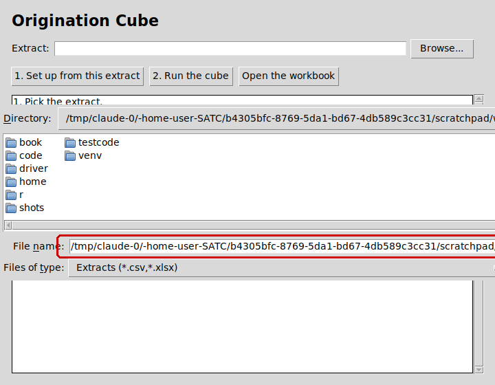

On Windows this is the usual Open dialog. The picture shows the same step on the test machine.

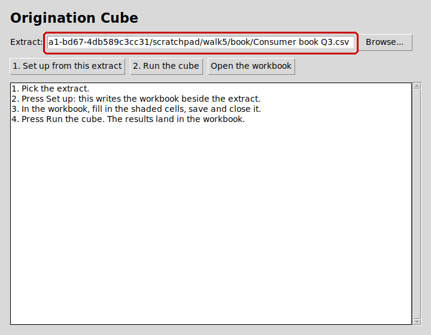

**Right:** the file name shows at the right-hand end of the Extract box.

## Step 3: Press 1. Set up from this extract

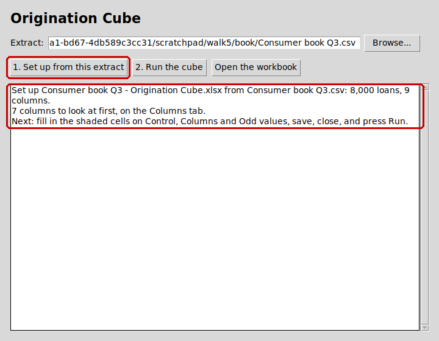

**Right:** "Set up Consumer book Q3 - Origination Cube.xlsx from Consumer book Q3.csv: 8,000 loans, 9 columns", then "7 columns to look at first", then "Next: fill in the shaded cells on Control, Columns and Odd values".

**Check the loan count against what the bank sent.** If it's wrong, you picked the wrong file.

## Step 4: Open the workbook: Start here

Press **Open the workbook**. It opens on **Start here**.

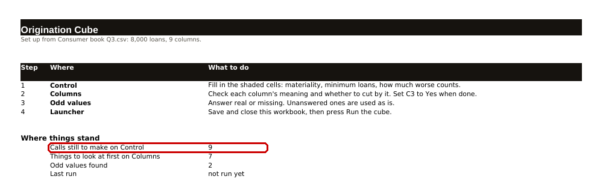

**Right:** four steps, and *Where things stand*: **9** calls to make on Control, 7 things to look at on Columns, 2 odd values, *not run yet*.

## Step 5: Control: see what needs an answer

Click the **Control** tab.

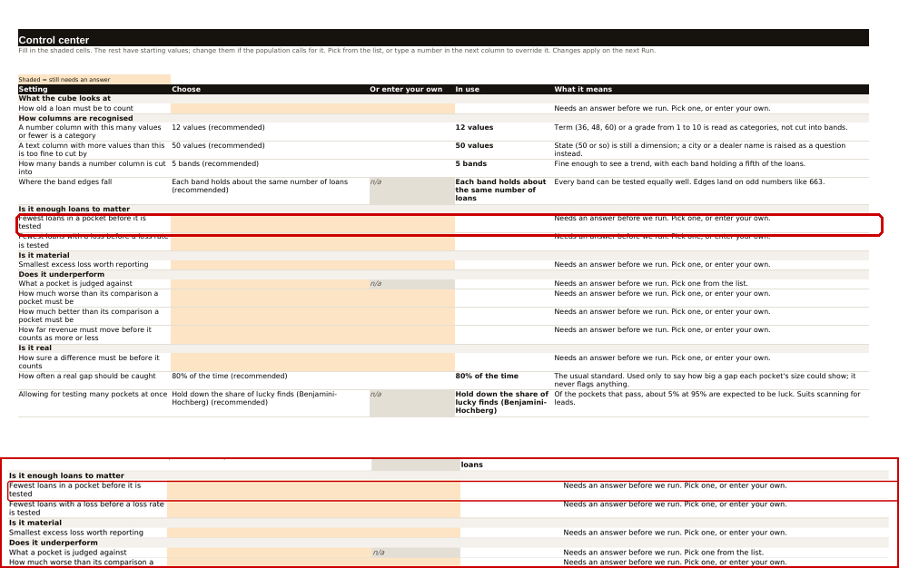

**Right:** nine rows are shaded peach. They are the calls the tool won't make for you. Three of them now have an option marked *(suggested)* in their list, worked out from this book when you Run:
- **Fewest loans in a pocket before it is tested:** *Enough for 10 expected losses*.
- **How much worse** and **how much better:** *What luck alone can move it*.
- **How far revenue must move:** *What luck alone can move it*.

Nothing is picked for you.

## Step 6: Columns: see what each column was taken to be

Click the **Columns** tab.

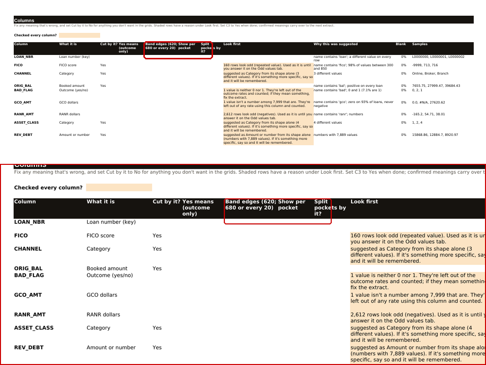

**Right:** one row per column, with a meaning in *What it is* and the reason beside it. Seven rows are shaded under **Look first**. *Checked every column?* (C3) is empty. The **Band edges** heading (ringed) now reads *620; 680 or every 20*: you can type edges, or a width (step 21).

## Step 7: Odd values, and Learned

Click **Odd values**.

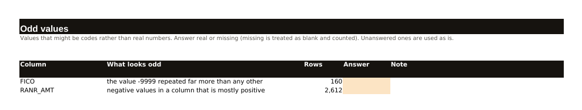

**Right:** FICO's -9999 (160 rows) and RANR's negatives (2,612 rows), each with an Answer cell.

On the first extract **Learned** says *Nothing learned yet*.

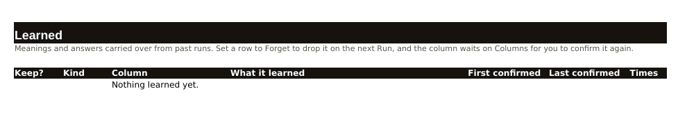

## Step 8: If you press Run too early

Save, close and press **2. Run the cube** before answering, and nothing runs.

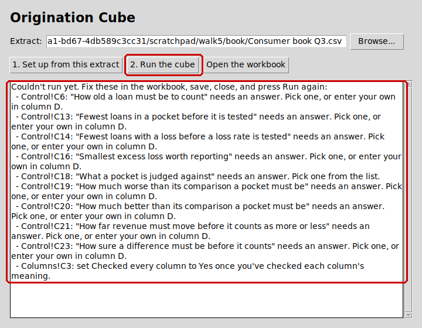

**Right:** "Couldn't run yet", then one line per thing to fix, naming the tab and cell. All ten fit in the box now. The same list goes to the **Log** tab.

## Step 9: Fill in the shaded cells on Control

Click each shaded **Choose** cell and pick from its list, or type a number in **Or enter your own**. The walk took every suggestion:

| Setting | Answer |
|---|---|
| How old a loan must be to count | Every loan |
| Fewest loans in a pocket before it is tested | Enough for 10 expected losses (suggested) |
| Fewest loans with a loss before a loss rate is tested | 10 losses |
| Smallest excess loss worth reporting | 1% of the book's total losses |
| What a pocket is judged against | The rest of its band |
| How much worse | What luck alone can move it (suggested) |
| How much better | What luck alone can move it (suggested) |
| How far revenue must move before it counts | What luck alone can move it (suggested) |
| How sure | 95% sure |

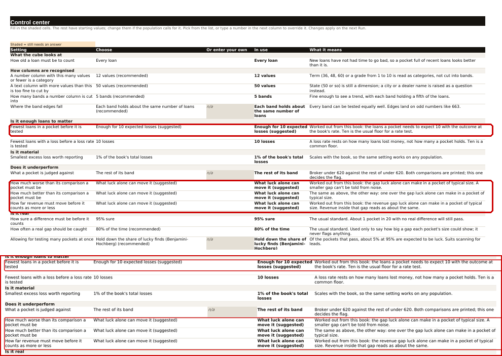

**Right:** the shading is gone, and *In use* and *What it means* fill in.

**The suggested numbers don't show here.** *In use* repeats the option's name, "(suggested)" included, before and after a Run. The numbers are on **Check** (step 16).

## Step 10: Confirm the columns and answer the odd values

On **Columns**, check each *What it is*, then set **Checked every column?** (C3) to **Yes**.

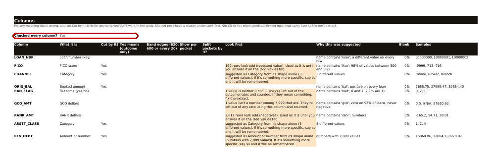

On **Odd values**, the walk said FICO's -9999 is **missing** and RANR's negatives are **real**.

## Step 11: Save, close, and press 2. Run the cube

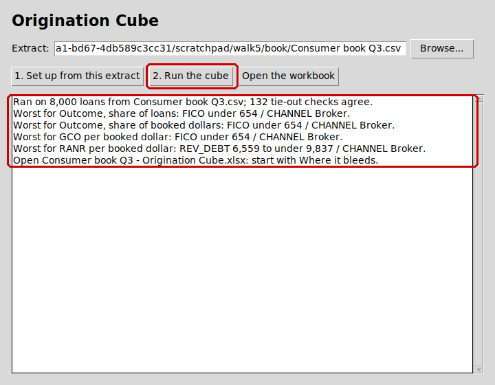

**Right:**
- "Ran on 8,000 loans from Consumer book Q3.csv; 132 tie-out checks agree."
- one *Worst for* line per measure. For the three loss measures it's **FICO under 654 / CHANNEL Broker**, the planted pocket seen through five equal bands.

The window doesn't say what the suggestions came out at. The *Worst for RANR* line is noise: the test data plants nothing in RANR.

## Step 12: Read Where it bleeds

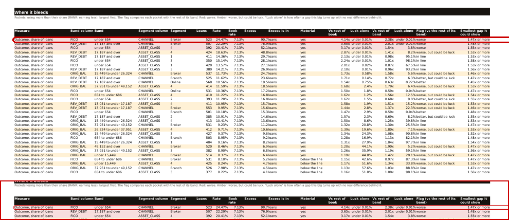

**Right:** the first row is FICO under 654 / Broker: 523 loans, 24.47% bad against a book of 7.13%, 90.7 loans of excess, 4.14x the rest of the book, 2.38x the rest of its band, **worse**.

How to read a row:
- **Red** rows are worse and the test says it isn't luck. **Amber** rows are worse but could be luck.
- **The flag** uses the comparison chosen in step 9, and the line worked out for *how much worse* (1.34x here).
- **Luck alone** is how often a gap this big turns up with no real difference.
- **Smallest gap it could show** is what a pocket of that size can reliably find. It's a different figure from the 1.34x line.

## Step 13: Losses vs revenue

Every pocket at or above the fewest-loans line (141 here) goes in one of nine boxes. There's one block and one chart per grid.

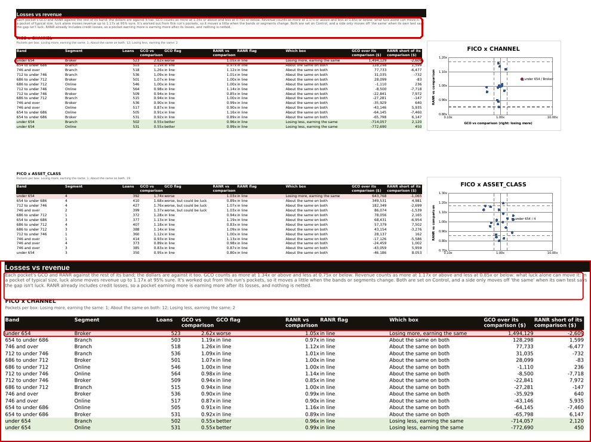

**Right:**
- The subtitle gives the lines: GCO at **1.34x** and **0.75x**, revenue at **1.17x** and **0.85x** ("what luck alone can move it"). It adds that a side only moves off *the same* when its own test agrees.
- FICO under 654 / Broker (ringed) reads **Losing more, earning the same**: GCO 2.62x the rest of its band, RANR 1.05x.
- The dollars are against the same comparison as the box, and rows sort by them.
- A pocket with too few losses reads *Not tested: too few loans or losses*, with no colour.

**Read "the same" as "can't tell".** A pocket at 1.76x on GCO whose test says *could be luck* sits in *About the same on both* (defect 5).

The chart plots the same pockets, with the Control lines dashed. Only pockets in a *Losing more* box are named:

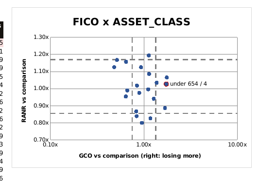

**Dots past a dashed line can still be in "the same".** The lines don't decide the box on their own; the test does (defect 3).

**Other revenue lines.** Change *How far revenue must move* on Control, save, close and Run. On this book every option gave the same boxes:

| Revenue line | Counts as more / less at | Earning more | Earning less |
|---|---|---|---|
| What luck alone can move it | 1.17x / 0.85x | 0 | 1 |
| 5 percent either way | 1.05x / 0.95x | 0 | 1 |
| 10 percent either way | 1.10x / 0.90x | 0 | 1 |
| The same lines as for losses | 1.33x / 0.75x | 0 | 1 |
| Your own: 0.15 | 1.15x / 0.85x | 0 | 1 |

The planted pocket reads *Losing more, earning the same* in every one. With 5% either way, 654 to under 686 / Online at 1.16x still reads *earning the same*:

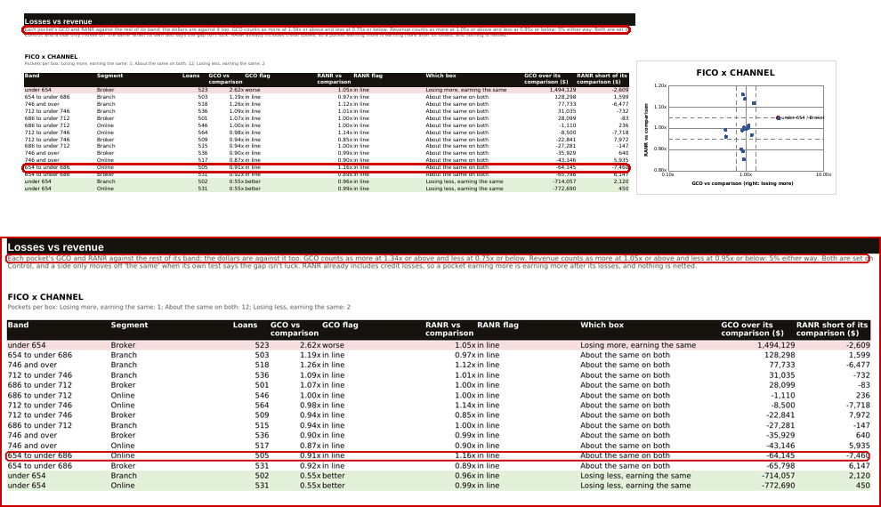

**Your own value is a share up to 0.9.** 95 is refused with "for 15%, type 0.15"; 0.95 is refused without a hint.

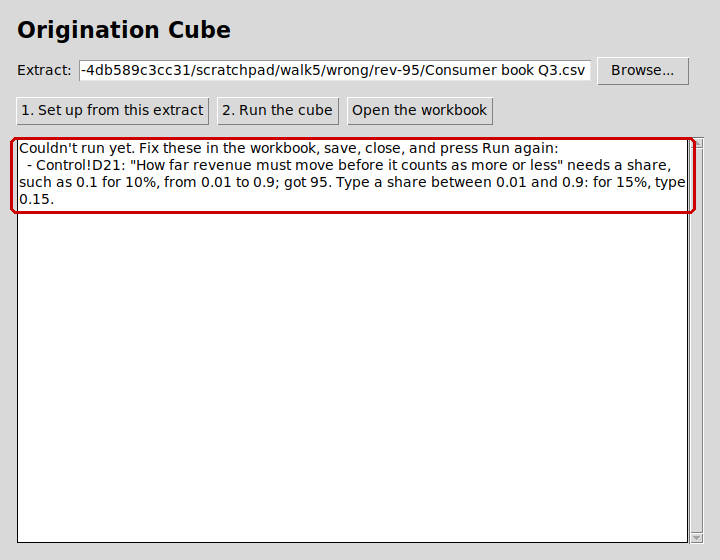

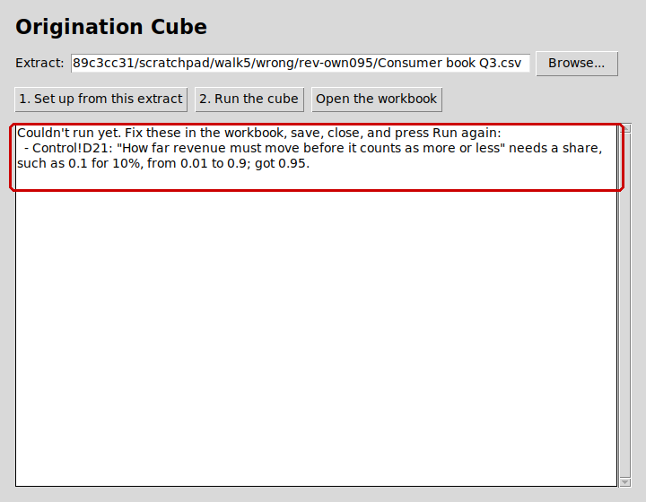

## Step 14: Grids

**Grids** shows each band crossed with each segment, one block per measure. Red is worse, green is better; for RANR low is red.

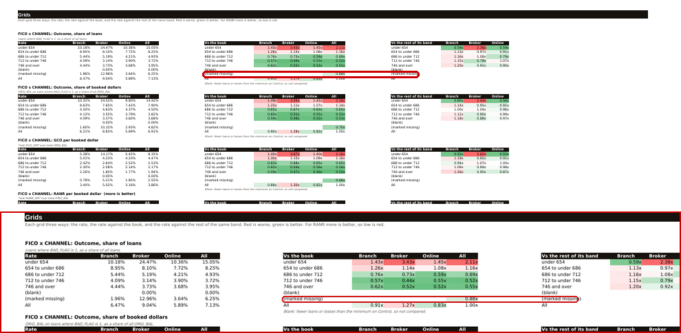

**Right:** under 654 / Broker is 24.47%, 3.43x the book. The *(marked missing)* row is blank in the comparison blocks, because it's under the minimums.

## Step 15: Materiality

**Right:** for *FICO x CHANNEL: Outcome, share of loans*, the level in use is 5.7 loans (1% of the book's bad loans): 4 pockets, 92% of the excess.

## Step 16: Check

**Check** records what the run did. **This is where the suggested numbers are shown** (ringed).

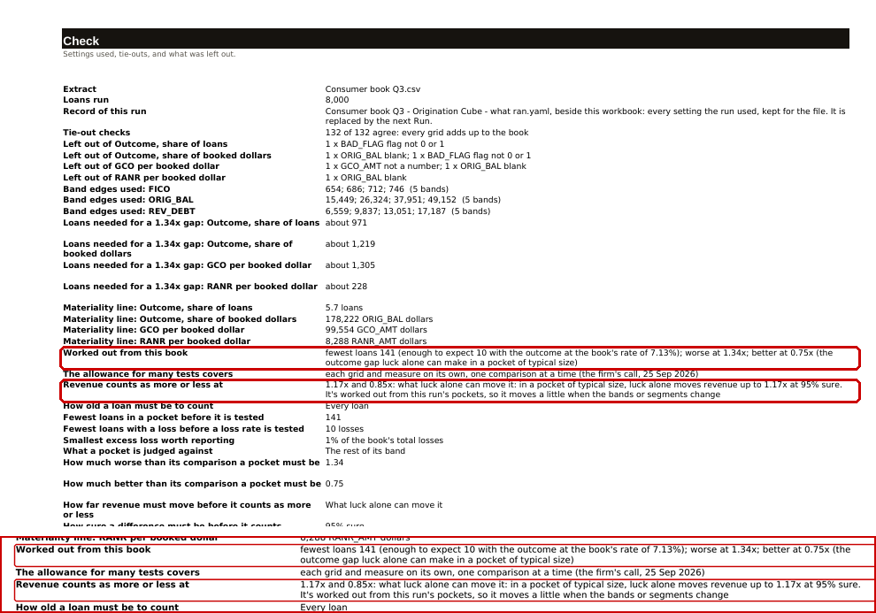

**Right:**
- "Worked out from this book: fewest loans 141 (enough to expect 10 with the outcome at the book's rate of 7.13%); worse at 1.34x; better at 0.75x".
- "Revenue counts as more or less at 1.17x and 0.85x: what luck alone can move it".
- Further down, the settings show 141, 1.34 and 0.75, and the revenue line as *What luck alone can move it*.
- "132 of 132 agree".

The record file beside the workbook (*... - what ran.yaml*) has 141, 1.34 and 0.75 as plain numbers. It has the revenue line as `luck`, with no number.

## Step 17: Log, and Start here

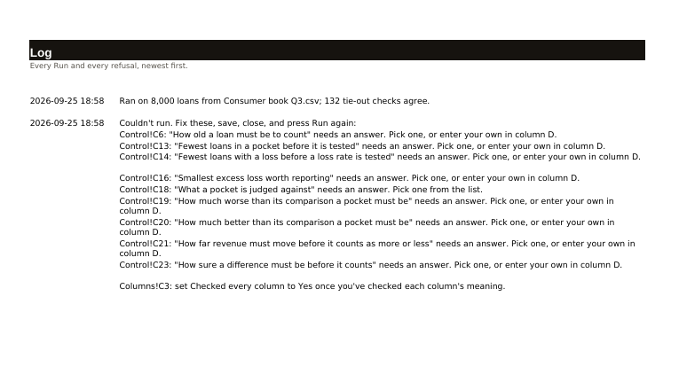

**Start here** now shows 0 calls, 0 things to look at on Columns, and the last run:

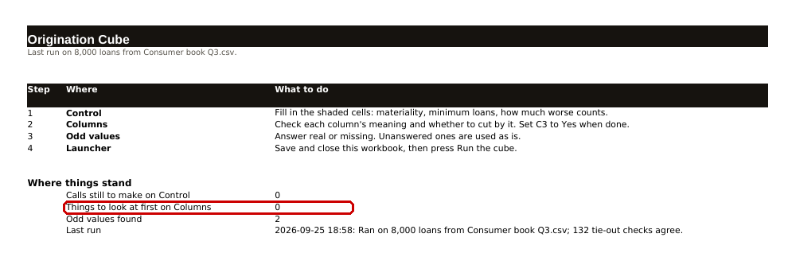

## Step 18: Split every pocket by a number (revolving debt)

On **Columns**, set **Split pockets by it?** to **Yes** on REV_DEBT. Save, close, and Run.

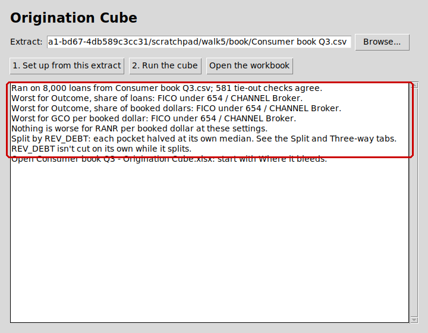

**Right:** "581 tie-out checks agree" and "Split by REV_DEBT: each pocket halved at its own median."

On **Split**, each paragraph starts with what its grid holds fixed:

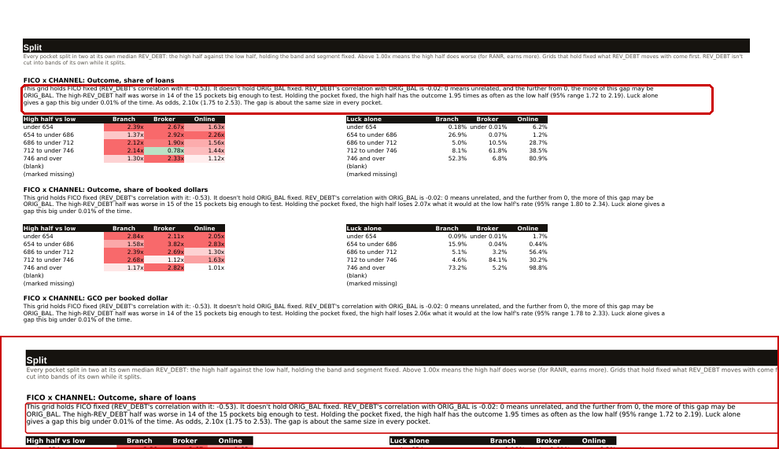

- For FICO x CHANNEL: "This grid holds FICO fixed (REV_DEBT's correlation with it: -0.53)", then the high-debt half at **1.95 times** the low half (95% range 1.72 to 2.19). The planted effect is 1.8x.
- The ORIG_BAL grids open "This grid holds ORIG_BAL fixed (... -0.02). It doesn't hold FICO fixed", then say 2.55x. **Don't quote them.** On a book with no debt effect they still say 1.62x, "under 0.01%" (defect 4).

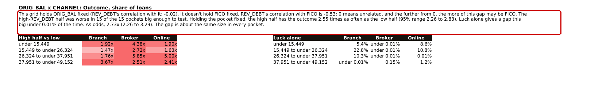

**Three-way** ranks every band / segment / half pocket, FICO grids first within each measure:

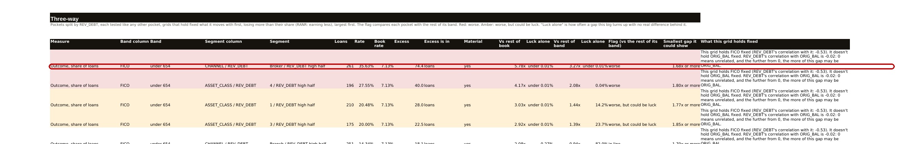

The last column, **What this grid holds fixed**, carries the same sentence on every row:

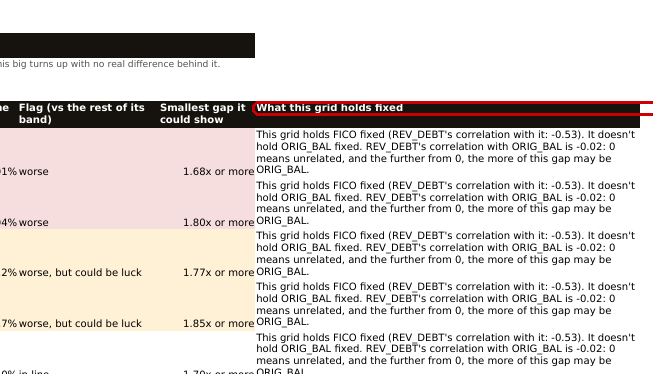

## Step 19: Split every pocket by a category (asset class)

Clear REV_DEBT's split and set **ASSET_CLASS** instead. Save, close, and Run.

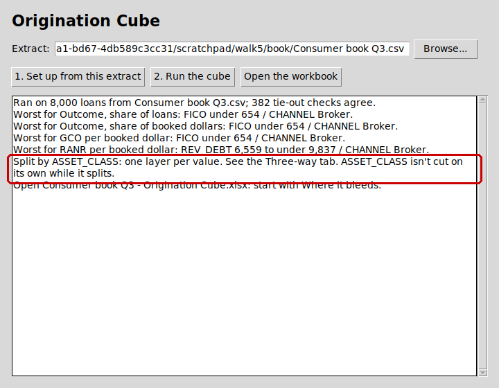

**Right:** "382 tie-out checks agree" and "Split by ASSET_CLASS: one layer per value."

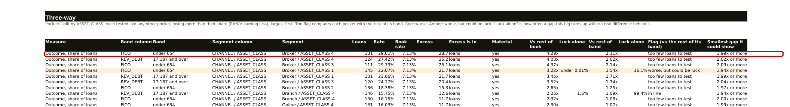

**With the suggested fewest loans (141), most three-way pockets aren't tested.** FICO under 654 / Broker / asset class 4 has 131 loans and 29% bad, and reads *too few loans to test*. 60 of the 77 bad-loan rows read the same, and none is flagged worse. With 30 loans, the fourth walk had this pocket flagged worse (defect 1).

## Step 20: Show a median or average per pocket

On **Columns**, set **Show per pocket** to *average* on ORIG_BAL and *median* on REV_DEBT. Save, close, and Run.

**Right:** "Beside the rates, for reading them: not tested, and an average doesn't add up across pockets."

## Step 21: Your own band edges, or a band width

**Edges:** type `620; 680; 740` in FICO's **Band edges** cell, with semicolons. Save, close, and Run.

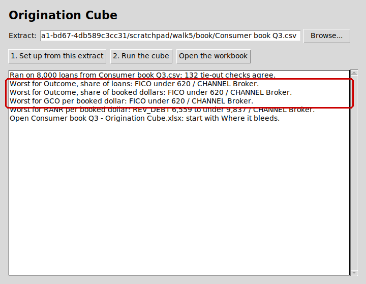

**Right:** the worst pocket is **FICO under 620 / Broker**. On Losses vs revenue it reads **Losing more, earning the same**: 176 loans, GCO 5.35x the rest of its band, RANR 1.17x. The revenue line on this run is 1.16x, and the RANR test says *in line*, so the side stays at *the same*:

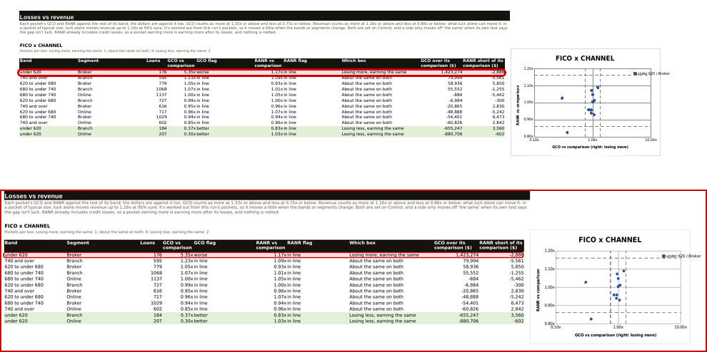

**A width:** type `every 20` instead.

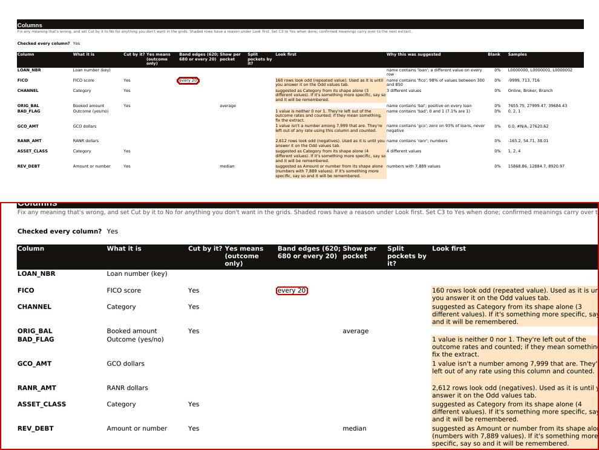

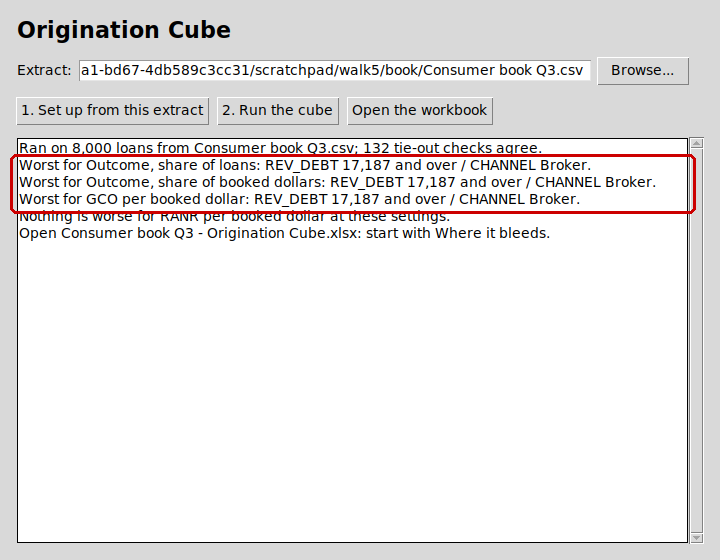

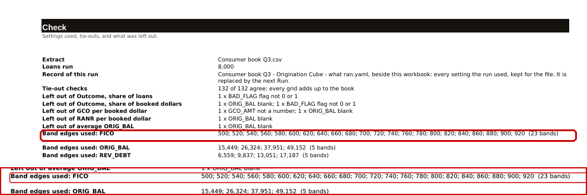

**Right:** Check lists 22 edges, 500 to 920 (23 bands).

**What the window says:** the worst pocket is now REV_DEBT 17,187 and over / Broker, and FICO isn't named. With the suggested fewest loans, the planted pocket's pieces (600 to 620 / Broker: 99 loans, 50.5% bad) read *too few loans to test* (defect 1). If you use 20-point bands, set **Fewest loans** yourself.

**Refused widths:** `every 1` and `every 0.5` ("would make 61 bands"), `every 0`, `every -5` and `every twenty` ("should read like every 20"). See wrong turns P to R.

## Step 22: Press Set up again

Press **1. Set up from this extract** again.

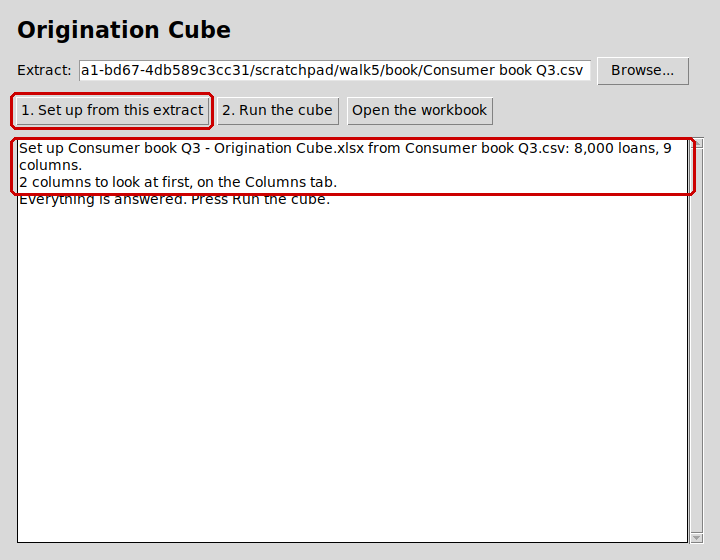

**Right:** "Everything is answered. Press Run the cube." Control, Columns and Odd values answers are kept, and so are the last results.

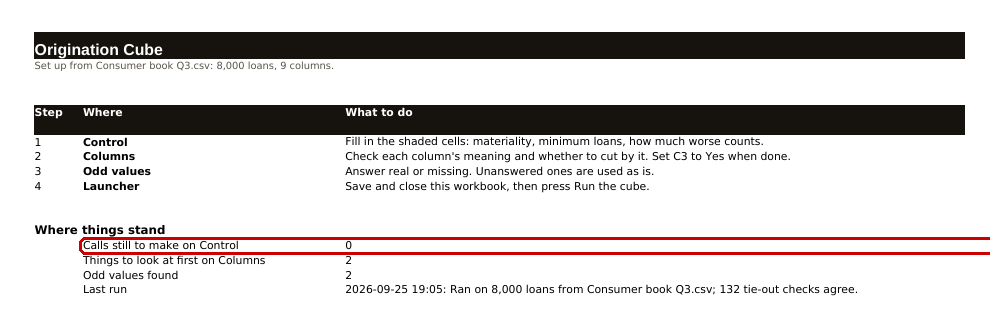

**Look at the Band edges column before you Run.** Edges remembered from *other* workbooks are written into empty cells. On this walk REV_DEBT picked up `every 2000` and CHANNEL `620; 680` from wrong turns run on other copies. Nothing on the tab or in the window says so (defect 2):

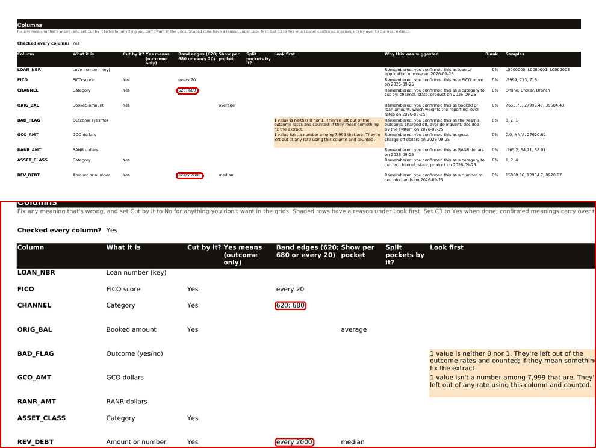

## Step 23: Prune something learned

On **Learned**, set a row's **Keep?** (column A) to **Forget**. Save, close and Run.

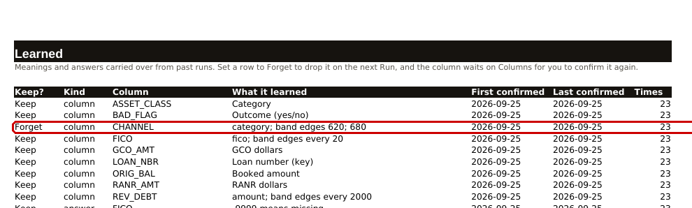

**Right:** the window says "Forgot CHANNEL, as marked on Learned. Check it on Columns and set C3 to Yes before the next Run."

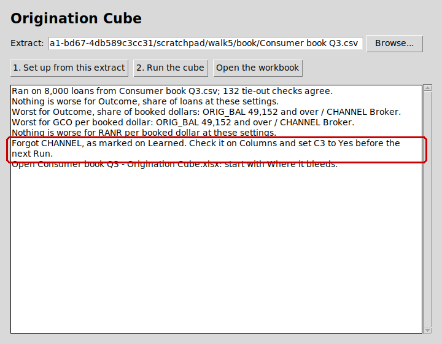

The next Run refuses until you do:

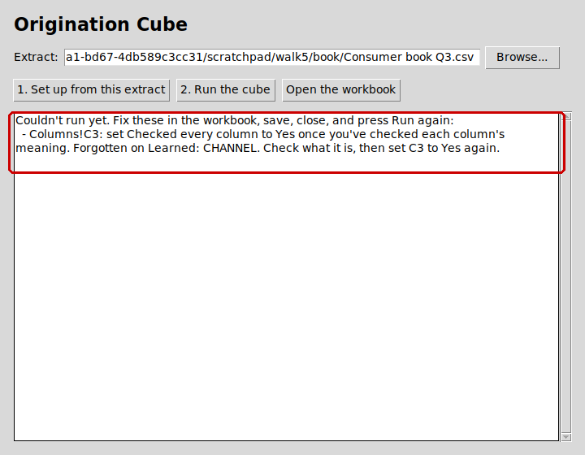

On **Columns**, C3 is empty with "Forgotten on Learned: CHANNEL. Check what it is, then set C3 to Yes again."

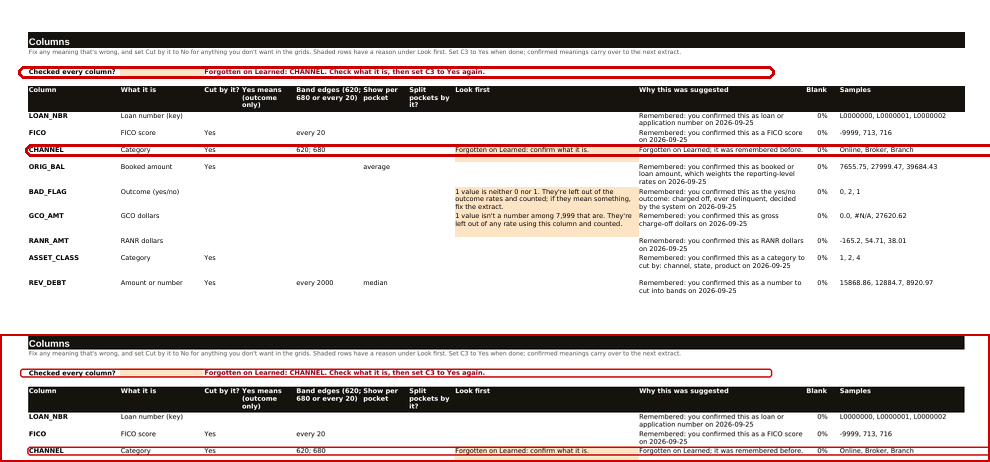

**Forget is the only way to drop remembered band edges.** Clearing the cell doesn't: the next Set up fills it in again (defect 2). Forget drops the column's meaning too.

## Step 24: The next extract

Browse to the next quarter's extract and press **Set up**.

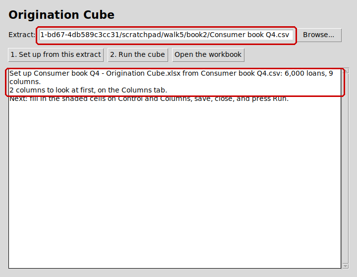

**Right:** "2 columns to look at first". Meanings are remembered, and so are the band edges typed last time. FICO comes in as `every 20`:

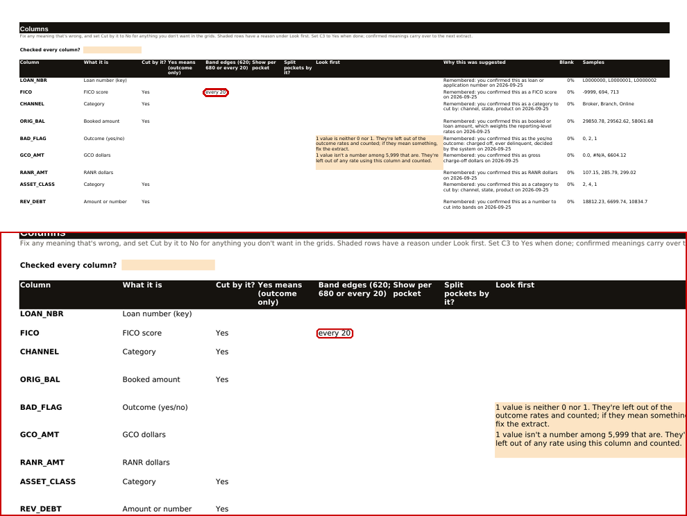

Control starts blank again. The judgment calls are asked every time.

---

## When something goes wrong

| What you did | What the window says | What to do |
|---|---|---|
| **A.** Split set on two columns | "Columns!H13 and Columns!H14: only one column can split the pockets. Clear all but one." | Clear one. |
| **B.** Split the only category that's cut | "Nothing is left to cut across ... CHANNEL (Columns!H8: it splits the pockets ...); ASSET_CLASS (Columns!D13, Cut by it? No)." | Clear the split, or set ASSET_CLASS back to Yes. |
| **C.** *average* on a category | "Columns!G8: "CHANNEL" isn't a number column, so it has no average to show." | Clear the cell. |
| **D.** Edges `620,680,740` turned into one number by Excel | "... read as the single number 620,680,740. Excel dropped the commas. Type them with semicolons" | Retype with semicolons. |
| **D2.** An edge outside the column (`620; 680; 950`) | "FICO runs from 496 to 921, so an edge at 950 would leave a band empty." | Type edges inside that range. |
| **E.** Workbook still open in Excel | "... is open in Excel. Close it, then press Run again." Set up says the same. Memory unchanged. | Close Excel and press again. |
| **F.** A column renamed after Set up | "Couldn't run: the extract has no column "CHANNEL" (a segment) ... press Set up again." Set up then says "New columns since the last check: CHNL." | Press Set up, check the new name, set C3 to Yes. |
| **G.** Fewer rows after Set up | "Consumer book Q3.csv has changed since Set up ...", then it runs on 6,000. | Check the loan count. |
| **H.** Workbook copied to a folder with a different extract of the same name | The same "has changed" line; it runs the new folder's 3,000 loans. | Press Set up in the new folder first. |
| **I.** Split set on GCO, the key or the outcome | "Columns!H11: "GCO_AMT" is marked GCO dollars, which can't split the pockets. Only a score, ratio, amount (the booked amount too) or category can." | Split by something known at booking. |
| **I2.** Split by the booked amount | Runs, 571 tie-outs. | As the message says, it's allowed. |
| **J.** A dollar amount typed as materiality (100000) | Runs. | Check says it's GCO dollars only. |
| **K.** The workbook picked as the extract | Set up: "... is the workbook, not the loan file. Pick the extract it was set up from". Run: "Pick the extract beside it." | Browse to the .csv. |
| **L.** 95 typed for "how sure" | "... from 0.5 to 0.999; got 95. For 95%, type 0.95." | Type 0.95. |
| **M.** 95, or 0.95, as your own revenue line | 95: "... for 15%, type 0.15." 0.95: refused, no hint. | Type a share up to 0.9. |
| **N.** New columns in a refreshed extract | "New columns since the last check: CURR_STATUS, DTI. Columns!C3 needs a Yes again." | Check them, set C3 to Yes. |
| **O.** Forget on Learned, then Run twice | First Run runs and says what was forgotten; the second refuses on C3. | Check the column, set C3 to Yes. |
| **P.** `every 1` or `every 0.5` on FICO | "Columns: every 1 on "FICO" would make 61 bands (498 to 889). Use a wider band, 50 at most." | Use a wider width. The 61 is wrong (defect 7). |
| **Q.** `every 0`, `every -5`, `every twenty` | "Columns!F7: "every 0" should read like every 20: the word every, then how wide each band is." | Type a positive number in figures. |
| **R.** Edges or a width typed on a category (CHANNEL) | Runs; the cell is ignored, and remembered. | Clear it, and Forget the column on Learned. |
| **S.** Your own fewest loans bigger than any pocket (3000), with luck suggested | Runs, "Nothing is worse". Check says "Worked out from this book: worse at 1.25x" (defect 6). | Use a smaller number. |

**A: two splits**

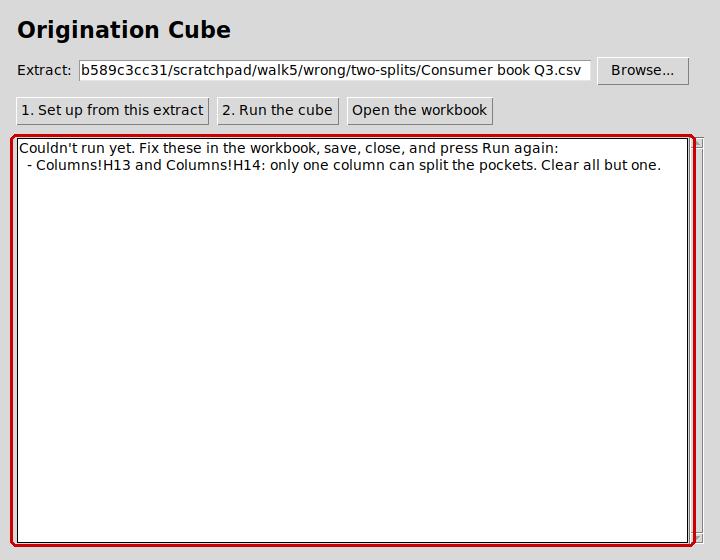

**B: the only segment split**

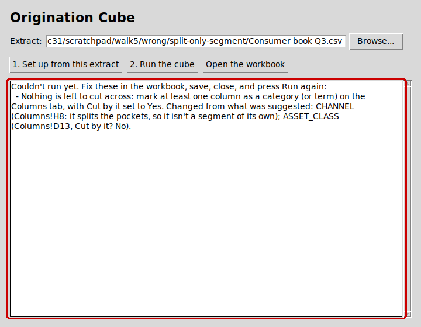

**C: average on a category**

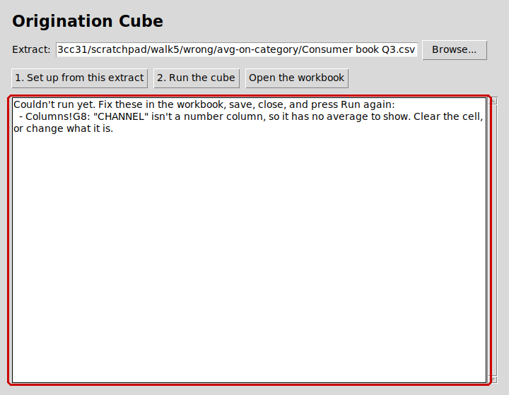

**D and D2: edges**

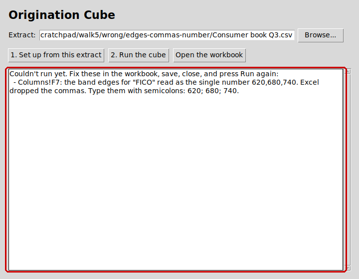

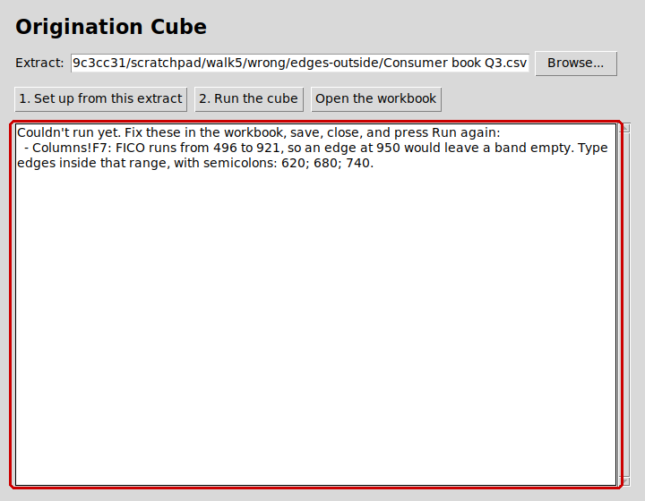

**E: workbook open.** Simulated by locking the file (`chattr +i`), since Excel isn't available here.

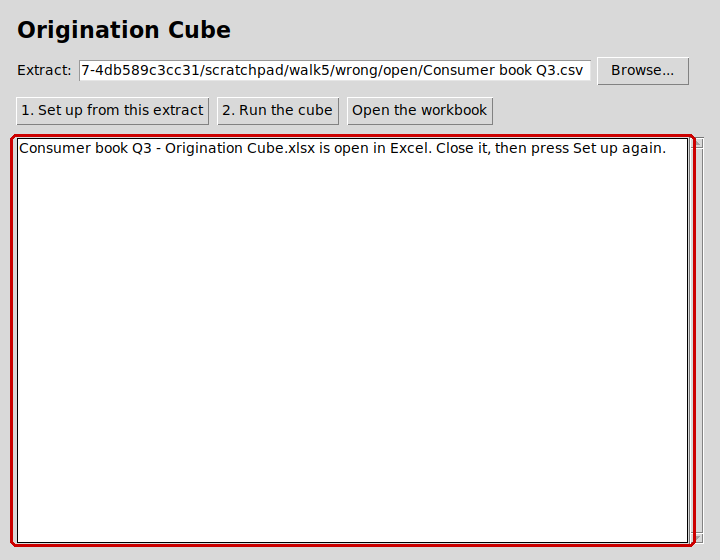

**F: a column renamed, then Set up**

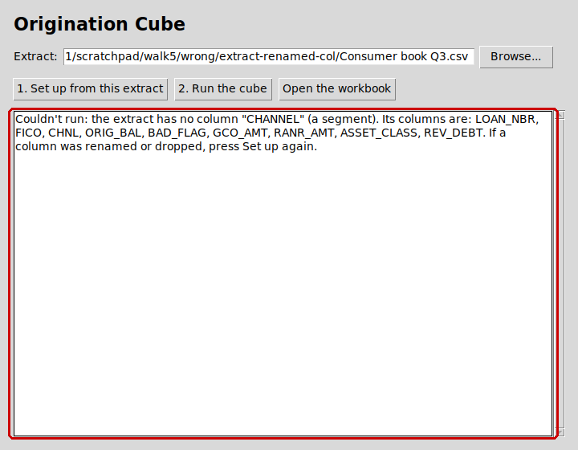

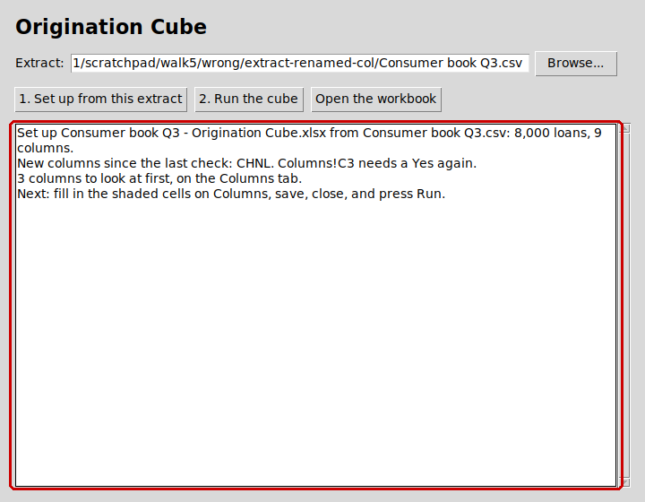

**G: fewer rows**

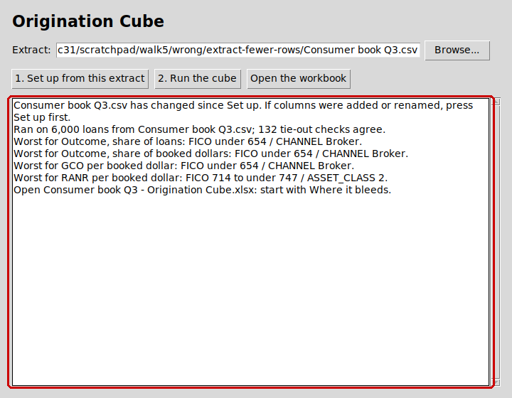

**H: the workbook copied to another folder**

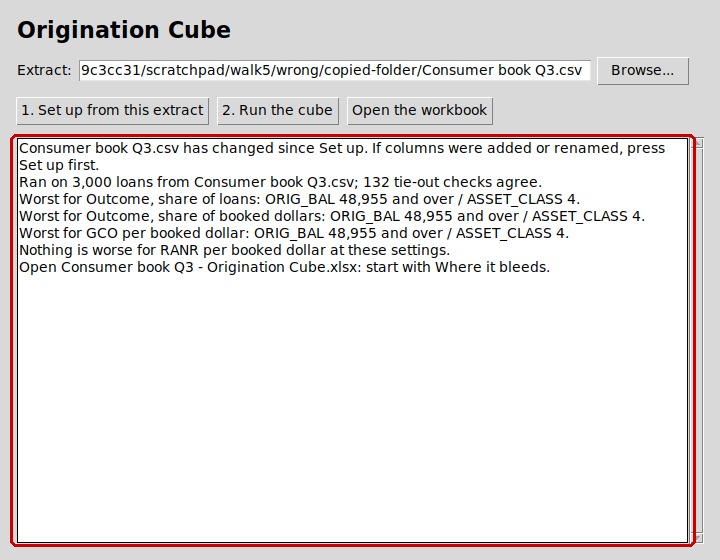

**I and I2: splits**

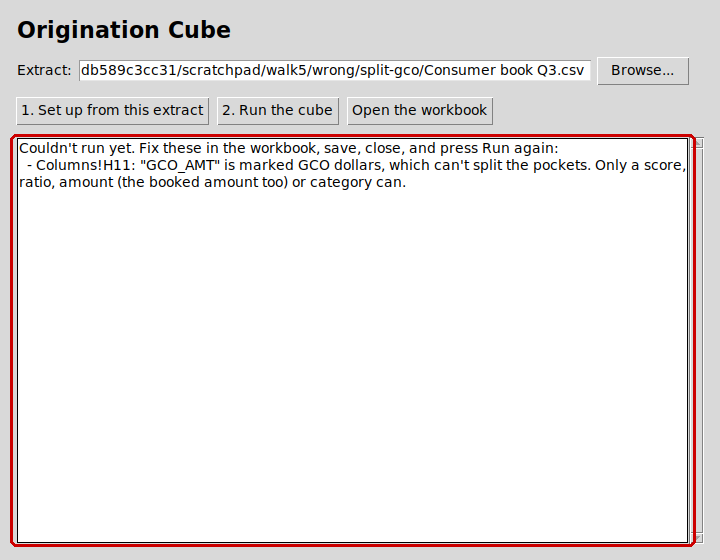

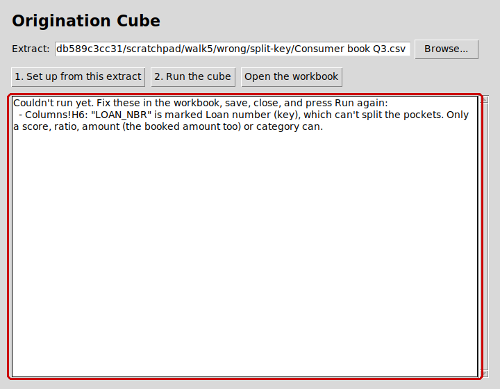

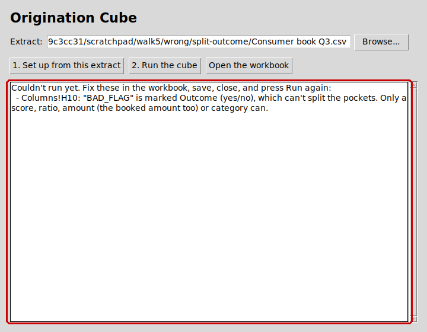

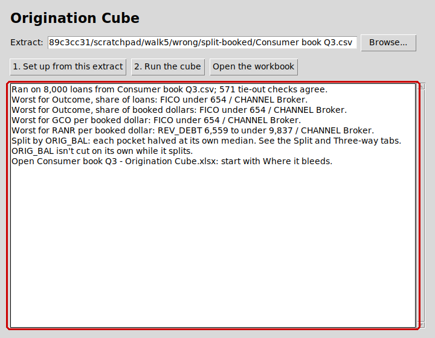

**J: your own dollar materiality**

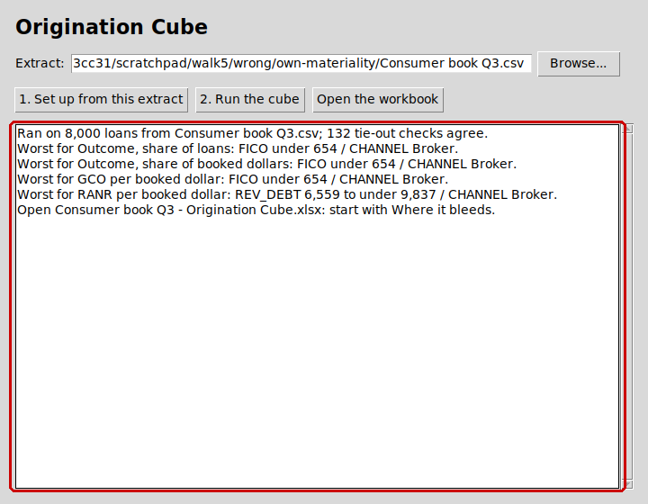

**K: the workbook picked, then Run**

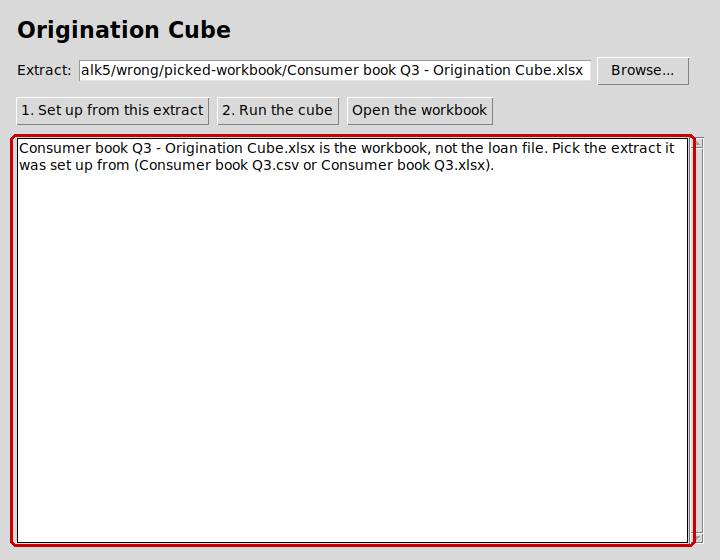

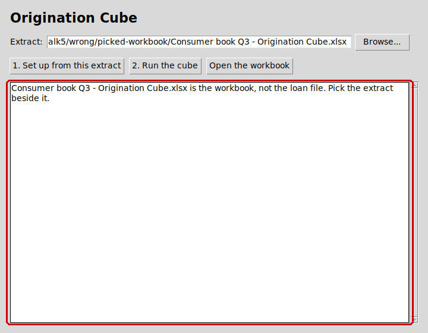

**L: 95 for "how sure"**

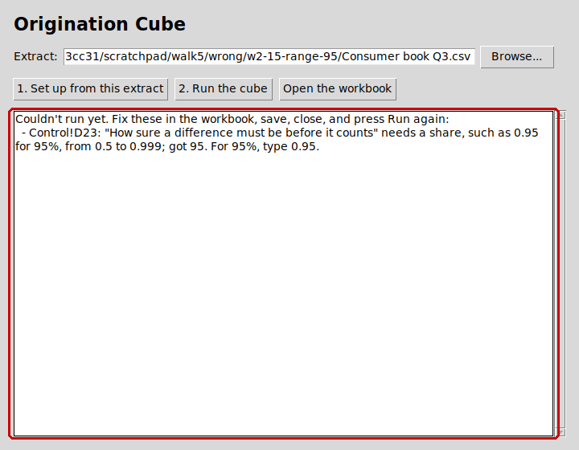

**N: new columns**

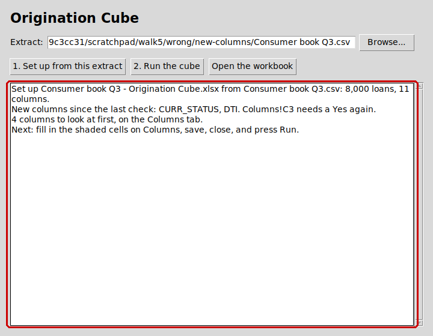

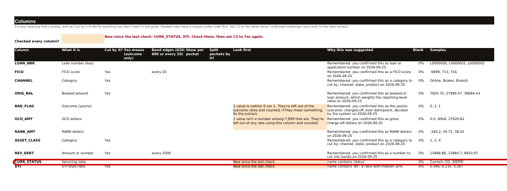

**P: every 1, every 0.5**

**Q: every 0, every twenty**

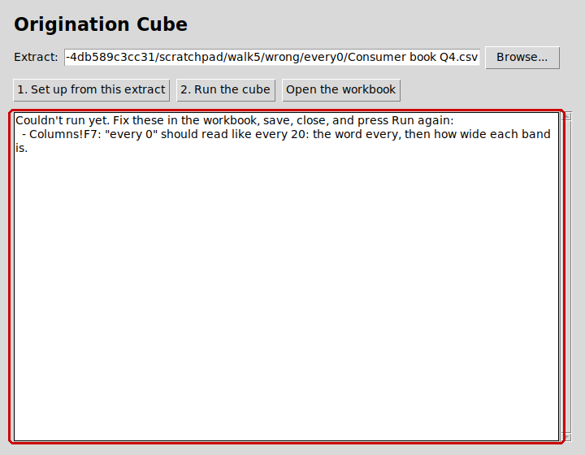

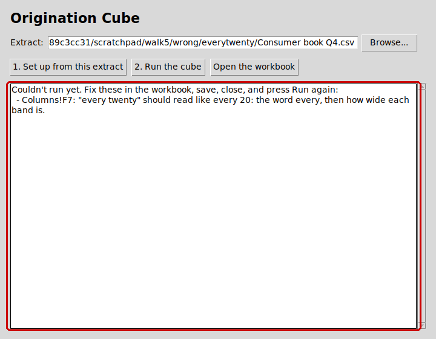

**R: a width on a category**

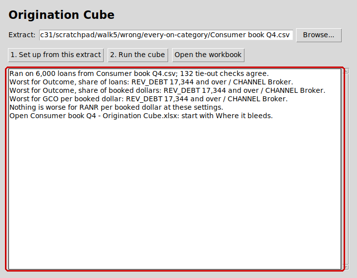

**S: a fewest-loans number bigger than any pocket**

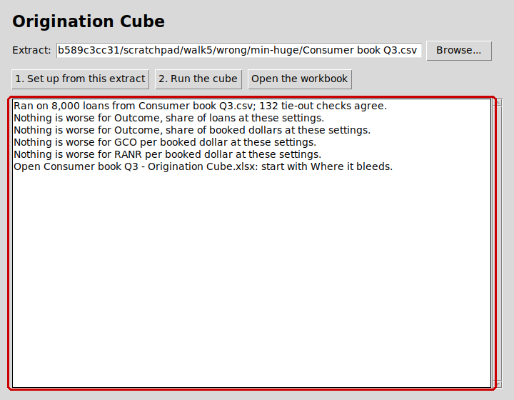

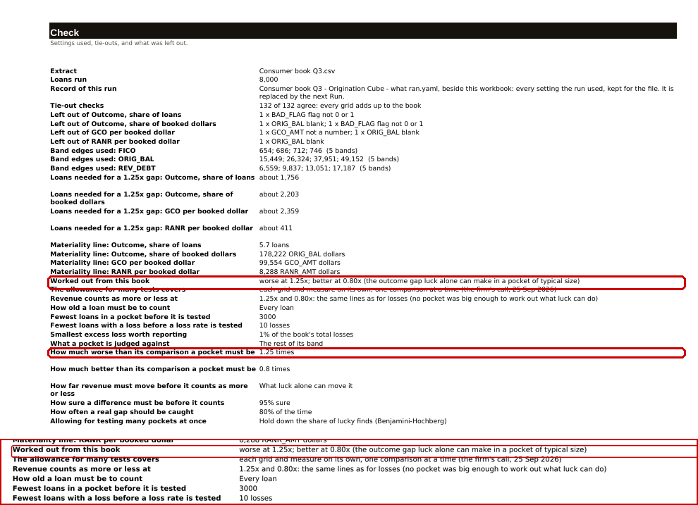

---

## How this was walked

On a Linux test machine:
- **The window:** `Origination Cube.pyw`'s window on a virtual display under Python 3.12, its buttons pressed by `driver/drive.py` (through `driver/win.sh`), each state photographed.
- **Excel's part:** done cell by cell with openpyxl (`driver/edit.py`), standing in for picking from the dropdowns and typing.
- **The workbook:** each state printed through LibreOffice (`driver/render.sh`) and photographed page by page. `driver/shots.py` crops and rings every picture.
- **Wrong turns and revenue options:** each in a folder of its own, from a copy of the answered workbook (`driver/wrong.sh`). They share one scratch memory file with the main route, as a team sharing a memory folder would.
- **The build:** frozen at commit `5ef61df` with `git archive`.
- **Reading tabs back:** `driver/boxcheck.py`, `driver/pastline.py` (dots past a line but boxed "the same"), `driver/revenue_options.py` (step 13's table), `driver/threeway.py`, `driver/luckline.py` (what the suggested numbers are made of), `driver/noplant.py` (the split on a book with no debt effect).
- **The next extracts:** `synth.make_rows` with seeds 11 (Q4, 6,000 loans) and 23 (Q1, 5,000 loans).

The order walked: steps 1 to 17, the revenue options, 18 to 21 on the same workbook, step 24 and the band-width wrong turns on the Q4 extract, then 22 and 23, then the other wrong turns. That order is why step 22 picked up edges from the Q4 wrong turns.
