# Origination analysis: the window and the workbook

**Who this is for:** the analyst preparing an origination analysis for a bank's line of business (LOB). No command line is needed.
**What you finish with:** one workbook beside the loan extract. It holds your answers, a ranked list of the pockets that lose more than their share, losses set against revenue, and, if you ask for it, every pocket split by a third column and ranked again.
**Walked:** 25 September 2026, on commit `fec5f71`, with a synthetic book of 8,000 loans. The book hides two things: a bad pocket (scores under 620 in the Broker channel), and borrowers carrying more revolving debt than usual for their score, who go bad 1.8 times as often. RANR has nothing planted in it. No real bank data was used.

**What changed since the fifth walk:**

- The lines on Control now decide the boxes on Losses vs revenue. A side whose own test says the gap could be luck keeps its box and says so in brackets (step 13).
- The suggested fewest loans is 5 expected losses, not 10 (71 loans here, not 141).
- Control has a **Last Run used** column (step 9), and the window has a *Worked out from this book* line (step 11).
- The Split tab states its method once, at the top (step 18). Grids that don't hold FICO fixed sit under a warning heading. The Three-way tab has a *Holds FICO fixed?* column, and those rows come last.
- Remembered band edges fill only a new workbook, and say so under Look first (steps 24 to 26). Clearing a cell forgets the edge.

<!-- ROUTE -->

## Before you start

- **Python 3.10 or later**, and **`Install add-ons.bat`** run once. You only need to do this the first time.
- **Excel.**
- **The loan extract** (.csv or .xlsx) in its own folder. It needs a loan number, the booked amount, a yes/no outcome, GCO dollars and RANR dollars.

---

## Step 1: Open the window

Double-click **`Origination Cube.pyw`** in the `origination-cube` folder.

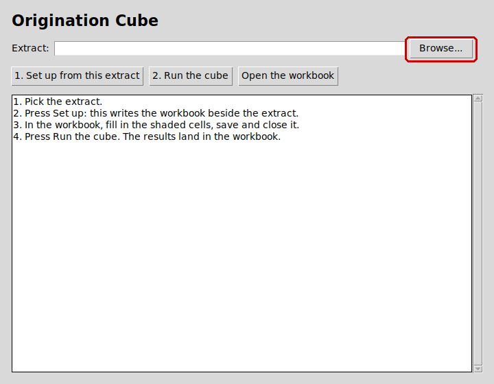

**Right:** a window titled *Origination Cube*, an Extract box, **Browse...**, three buttons, and four numbered lines in the box underneath.

## Step 2: Pick the extract

Press **Browse...** and pick the loan file, not the workbook.

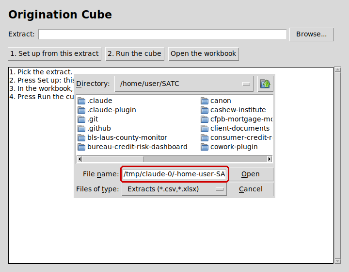

On Windows this is the usual Open dialog. The picture shows the same step on the test machine.

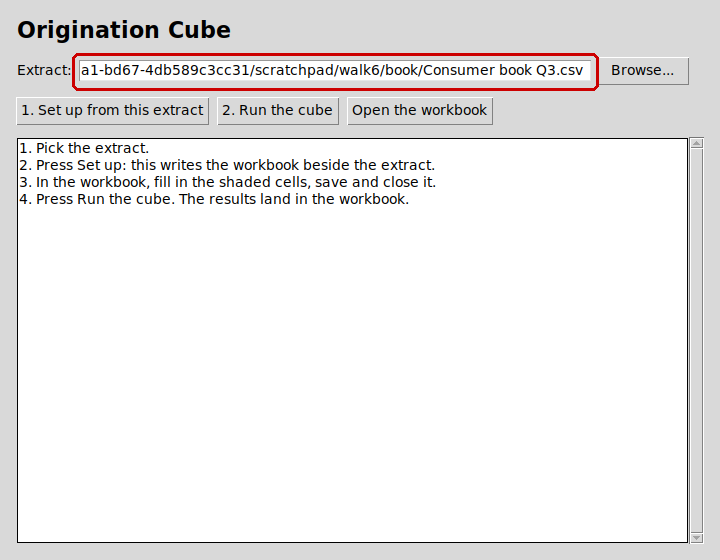

**Right:** the file name shows at the right-hand end of the Extract box.

## Step 3: Press 1. Set up from this extract

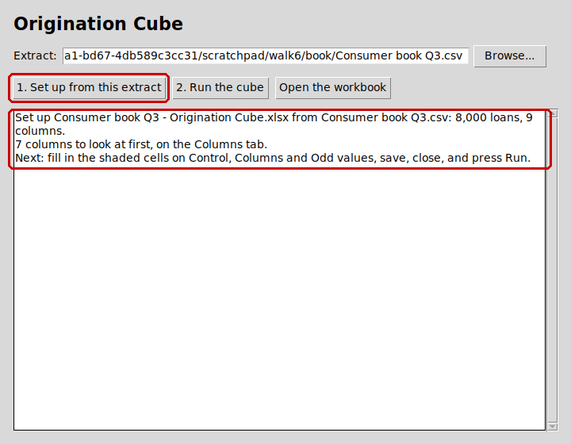

**Right:** "Set up Consumer book Q3 - Origination Cube.xlsx from Consumer book Q3.csv: 8,000 loans, 9 columns", then "7 columns to look at first", then "Next: fill in the shaded cells on Control, Columns and Odd values".

**Check the loan count against what the bank sent.** If it's wrong, you picked the wrong file.

## Step 4: Open the workbook: Start here

Press **Open the workbook**. It opens on **Start here**.

**Right:** four steps, and *Where things stand*: **9** calls to make on Control, 7 things to look at on Columns, 2 odd values, *not run yet*.

## Step 5: Control: see what needs an answer

Click the **Control** tab.

**Right:** nine rows are shaded peach. They are the calls the tool won't make for you. Three offer a number worked out from this book when you Run, marked *(suggested)* in their lists:
- **Fewest loans in a pocket before it is tested:** *Enough for 5 expected losses*.
- **How much worse** and **how much better:** *What luck alone can move it*.
- **How far revenue must move:** *What luck alone can move it*.

Nothing is picked for you.

## Step 6: Columns: see what each column was taken to be

Click the **Columns** tab.

**Right:** one row per column, with a meaning in *What it is* and the reason beside it. Seven rows are shaded under **Look first**. *Checked every column?* (C3) is empty. **Band edges** takes edges (`620; 680`) or a width (`every 20`).

## Step 7: Odd values, and Learned

Click **Odd values**.

**Right:** FICO's -9999 (160 rows) and RANR's negatives (2,612 rows), each with an Answer cell.

On the first extract **Learned** says *Nothing learned yet*.

## Step 8: If you press Run too early

Save, close and press **2. Run the cube** before answering, and nothing runs.

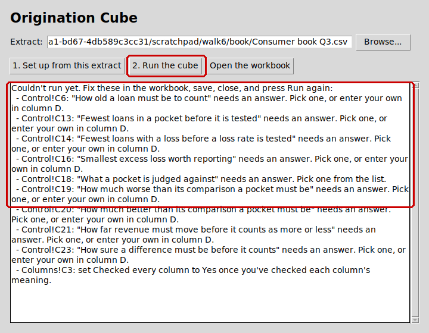

**Right:** "Couldn't run yet", then one line per thing to fix, naming the tab and cell. The same list goes to the **Log** tab.

## Step 9: Fill in the shaded cells on Control

Click each shaded **Choose** cell and pick from its list, or type a number in **Or enter your own**. The walk took every suggestion:

| Setting | Answer |
|---|---|
| How old a loan must be to count | Every loan |
| Fewest loans in a pocket before it is tested | Enough for 5 expected losses (suggested) |
| Fewest loans with a loss before a loss rate is tested | 10 losses |
| Smallest excess loss worth reporting | 1% of the book's total losses |
| What a pocket is judged against | The rest of its band |
| How much worse | What luck alone can move it (suggested) |
| How much better | What luck alone can move it (suggested) |
| How far revenue must move before it counts | What luck alone can move it (suggested) |
| How sure | 95% sure |

After the Run (step 11), Control has a **Last Run used** column (ringed). It shows the numbers the suggestions came out at: **71** loans, **1.34** and **0.75**, and revenue at **1.17x and 0.85x**.

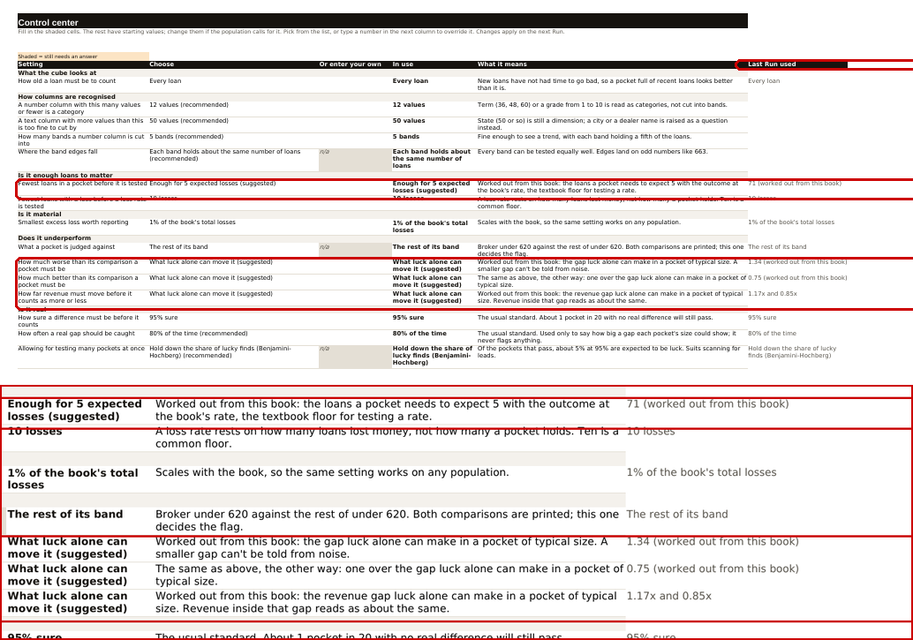

**Scroll right to see it.** It sits past *What it means* and a hidden column, and it isn't printed: the tab's print area stops at *What it means*. This is how the printed tab looks:

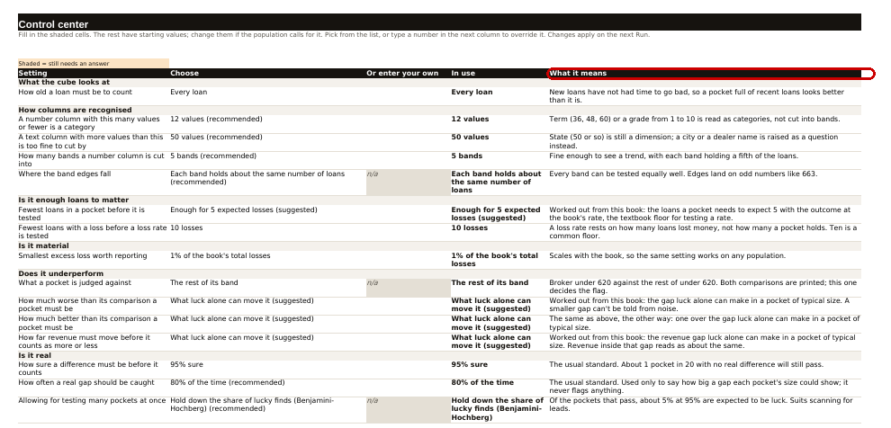

*In use* still repeats the option's name, "(suggested)" included.

## Step 10: Confirm the columns and answer the odd values

On **Columns**, check each *What it is*, then set **Checked every column?** (C3) to **Yes**.

On **Odd values**, the walk said FICO's -9999 is **missing** and RANR's negatives are **real**.

## Step 11: Save, close, and press 2. Run the cube

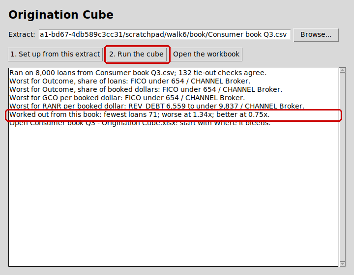

**Right:**
- "Ran on 8,000 loans from Consumer book Q3.csv; 132 tie-out checks agree."
- one *Worst for* line per measure. For the three loss measures it's **FICO under 654 / CHANNEL Broker**, the planted pocket seen through five equal bands.
- "Worked out from this book: fewest loans 71; worse at 1.34x; better at 0.75x." (ringed). The revenue line isn't in it.

The *Worst for RANR* line is noise: the test data plants nothing in RANR.

**If this line appears when you typed your own fewest loans, check it.** It says "worked out" even when nothing could be (see wrong turn S).

## Step 12: Read Where it bleeds

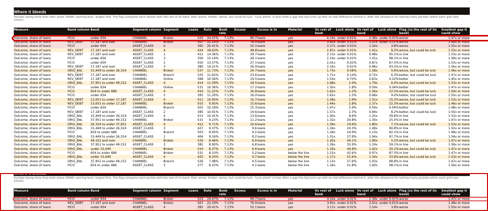

**Right:** the first row is FICO under 654 / Broker: 523 loans, 24.47% bad against a book of 7.13%, 90.7 loans of excess, 4.14x the rest of the book, 2.38x the rest of its band, **worse**.

How to read a row:
- **Red** rows are worse and the test says it isn't luck. **Amber** rows are worse but could be luck.
- **The flag** uses the comparison chosen in step 9 and the *how much worse* line (1.34x here).
- **Luck alone** is how often a gap this big turns up with no real difference, after the allowance for testing many pockets.
- **Smallest gap it could show** is what a pocket of that size can reliably find.

## Step 13: Losses vs revenue

Every pocket at or above the fewest-loans line (71 here) goes in one of nine boxes. There's one block and one chart per grid.

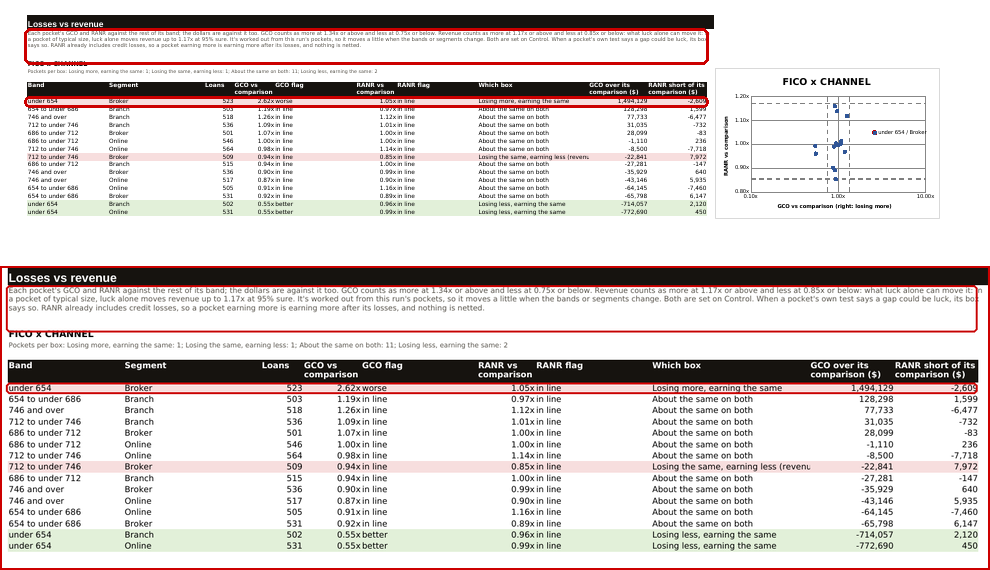

**Right:**
- The subtitle gives the lines: GCO at **1.34x** and **0.75x**, revenue at **1.17x** and **0.85x**. It says a box notes when a pocket's own test calls the gap luck.
- FICO under 654 / Broker (ringed) reads **Losing more, earning the same**: GCO 2.62x the rest of its band, RANR 1.05x.
- The dollars use the same comparison as the box, and rows sort by them.

**Read the whole box, and widen the Which box column first.** A box can end in "(loss gap could be luck)", "(revenue gap could be luck)" or "(both gaps could be luck)". At the column's width that part is cut off, so it reads "(loss g" or "(revenu". Shading and the *Pockets per box* count don't tell them apart. On this run 43 of 104 boxes carry one (defect 2):

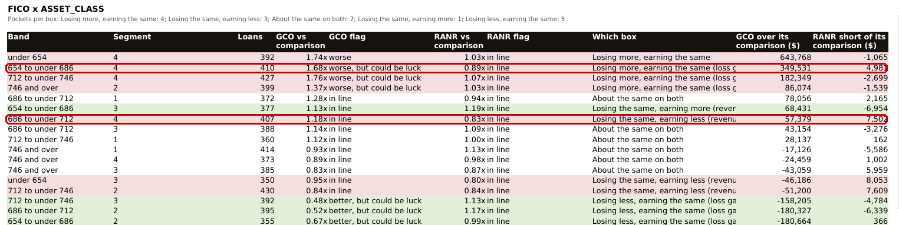

**The RANR flag and the box can disagree.** The flag uses the loss lines (0.75x); the box uses the revenue line (0.85x). 686 to under 712 / asset class 4 has RANR at 0.83x: its flag says *in line*, its box *earning less*, and it's shaded red (defect 3).

The chart plots the same pockets, with the Control lines dashed. Pockets in a *Losing more* box are named:

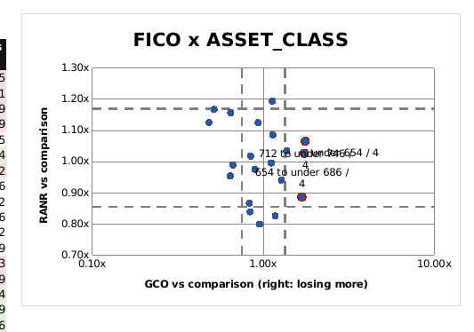

**Other revenue lines.** Change *How far revenue must move* on Control, save, close and Run. The boxes now move with the line, as each option's explanation says:

| Revenue line | More / less at | Earning more | Earning less | Planted pocket |
|---|---|---|---|---|
| What luck alone can move it | 1.17x / 0.85x | 2 (all marked luck) | 8 (7 marked luck) | Losing more, earning the same |
| 5 percent either way | 1.05x / 0.95x | 33 (all marked) | 29 (28 marked) | the same |
| 10 percent either way | 1.10x / 0.90x | 20 (all marked) | 15 (14 marked) | the same |
| The same lines as for losses | 1.33x / 0.75x | 0 | 1 | the same |
| Your own: 0.15 | 1.15x / 0.85x | 6 (all marked) | 7 (6 marked) | the same |

RANR has nothing planted, so every *earning more* or *less* above is noise; the marks say so.

The GCO lines move the boxes too. With 1.25 and 0.8, 23 pockets read *Losing more* (19 marked luck); with 1.34 and 0.75, 18 (14 marked); with 2 and 0.5, 2.

With 5% either way:

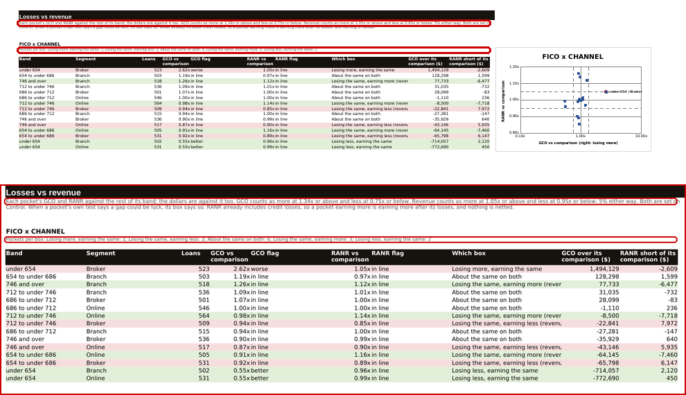

**Your own value is a share up to 0.9.** 95 is refused with "for 15%, type 0.15"; 0.95 is refused without a hint.

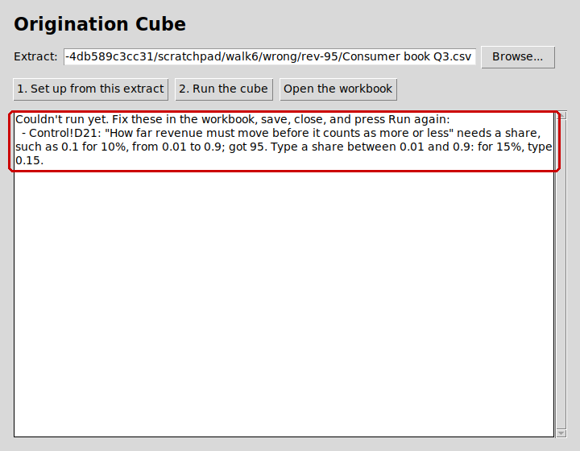

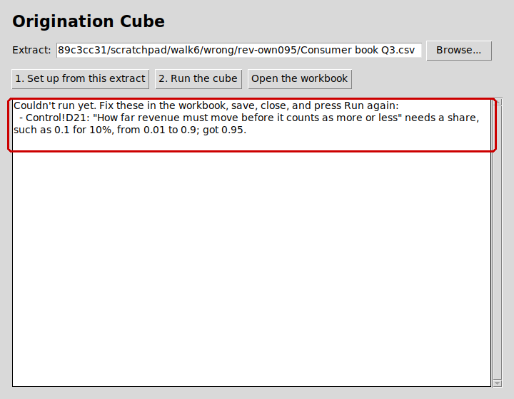

## Step 14: Grids

**Grids** shows each band crossed with each segment, one block per measure. Red is worse, green is better; for RANR low is red.

## Step 15: Materiality

**Right:** for *FICO x CHANNEL: Outcome, share of loans*, the level in use is 5.7 loans (1% of the book's bad loans): 4 pockets, 92% of the excess.

## Step 16: Check

**Check** records what the run did, including the worked-out numbers (ringed).

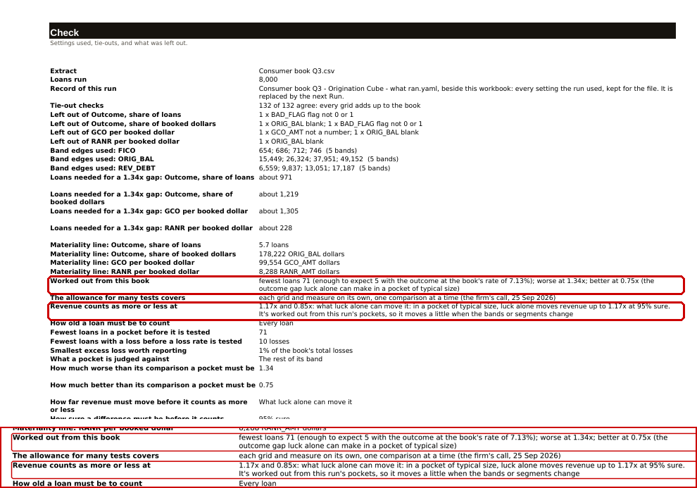

**Right:**
- "Worked out from this book: fewest loans 71 (enough to expect 5 with the outcome at the book's rate of 7.13%); worse at 1.34x; better at 0.75x".
- "Revenue counts as more or less at 1.17x and 0.85x: what luck alone can move it".
- "132 of 132 agree".

The record beside the workbook (*... - what ran.yaml*) now opens with "# revenue_line worked out from this book: 1.17x and 0.85x".

## Step 17: Log, and Start here

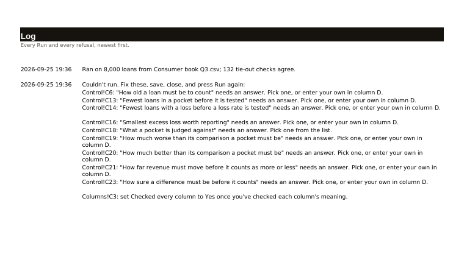

**Start here** now shows 0 calls, and the last run:

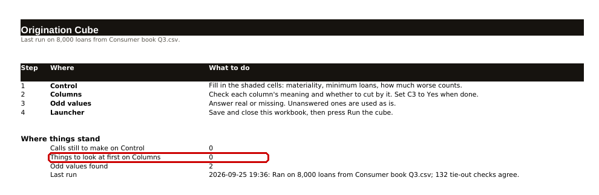

## Step 18: Split every pocket by a number (revolving debt)

On **Columns**, set **Split pockets by it?** to **Yes** on REV_DEBT. Save, close, and Run.

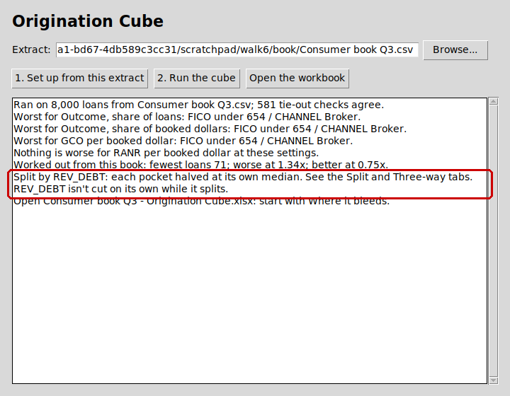

**Right:** "581 tie-out checks agree" and "Split by REV_DEBT: each pocket halved at its own median."

**Split** opens with **How this tab works**: what it does, what *High half vs low* means, what *Luck alone* means, how the pockets are pooled, and what it assumes. Read it once.

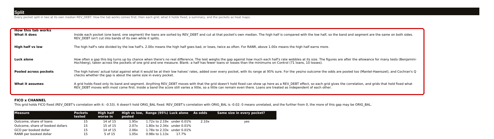

Then each grid gets one line on what it holds fixed, a summary table and heat maps. For FICO x CHANNEL the high-debt half goes bad **1.95 times** as often as the low half (1.72x to 2.19x), worse in 14 of 15 pockets. The planted effect is 1.8x.

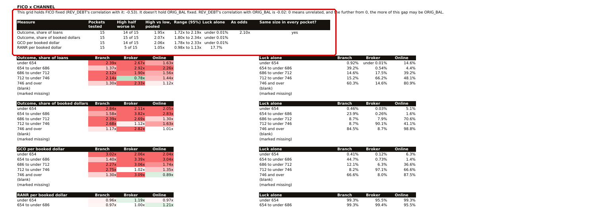

Grids that don't hold FICO fixed come after a dark red heading: "Grids that don't hold FICO fixed. REV_DEBT moves with FICO (correlation -0.53), so part of every gap below may be FICO, not REV_DEBT." **Don't quote the numbers under it.** On a book with no debt effect they still read 1.62x, under 0.01% (defect 5).

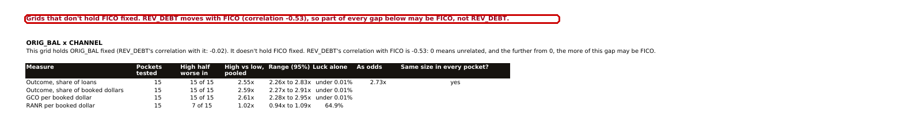

**Three-way** ranks every band / segment / half pocket. The last column, **Holds FICO fixed?**, reads *yes* or *no: part of this may be FICO*. Within each measure the *no* rows come last.

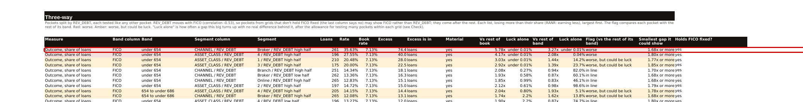

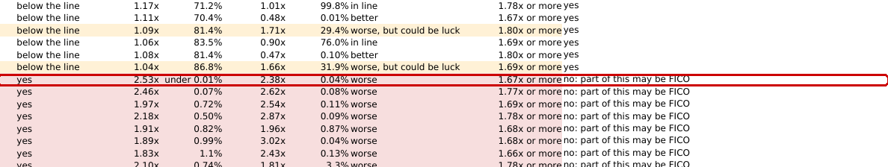

## Step 19: Split every pocket by a category (asset class)

Clear REV_DEBT's split and set **ASSET_CLASS** instead. Save, close, and Run.

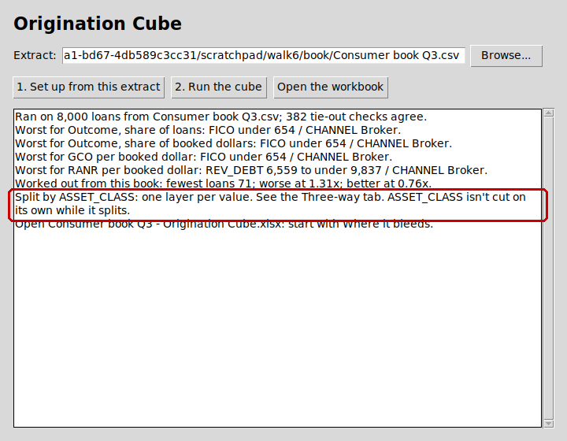

**Right:** "382 tie-out checks agree" and "Split by ASSET_CLASS: one layer per value." On **Three-way**, FICO under 654 / Broker / asset class 4 (131 loans, 29% bad) is tested and flagged **worse**, 2.11x the rest of its band.

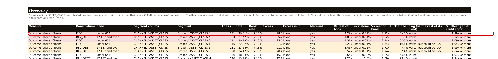

## Step 20: Show a median or average per pocket

On **Columns**, set **Show per pocket** to *average* on ORIG_BAL and *median* on REV_DEBT. Save, close, and Run.

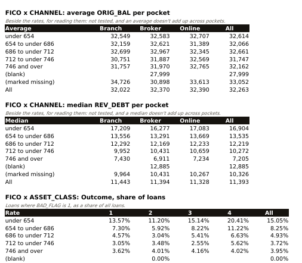

## Step 21: Your own band edges, or a band width

**Edges:** type `620; 680; 740` in FICO's **Band edges** cell, with semicolons. Save, close, and Run.

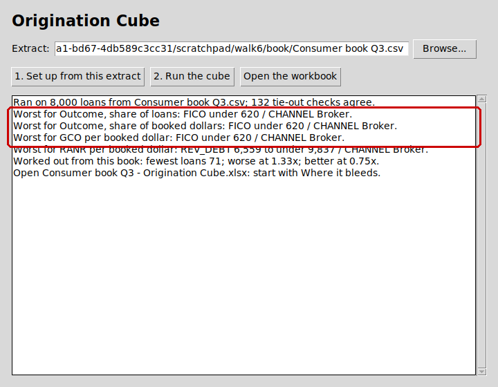

**Right:** the worst pocket is **FICO under 620 / Broker**: 176 loans, GCO 5.35x the rest of its band.

**On Losses vs revenue it reads "Losing more, earning more (revenue g…"**. Its RANR is 1.17x against a revenue line of 1.16x worked out on this run, and its RANR flag says *in line*. The cut-off part is "(revenue gap could be luck)". Read it as *losing more, earning the same* (defect 1).

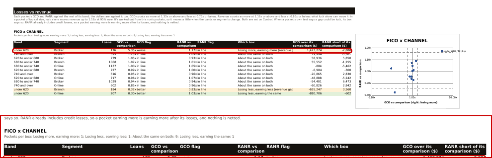

**A width:** type `every 20` instead.

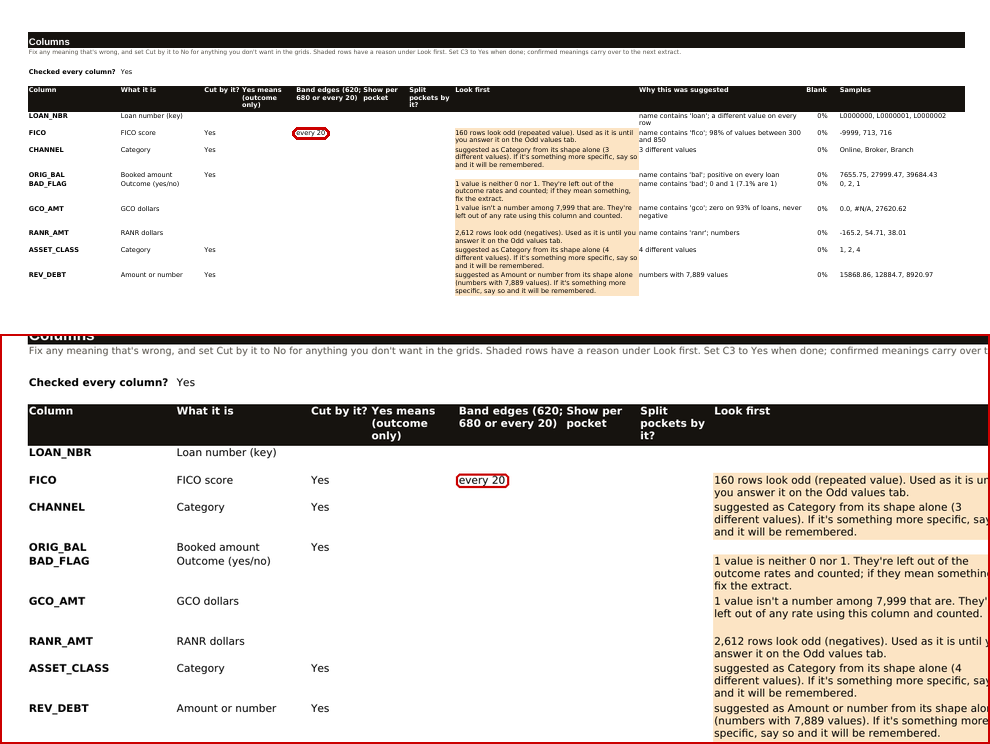

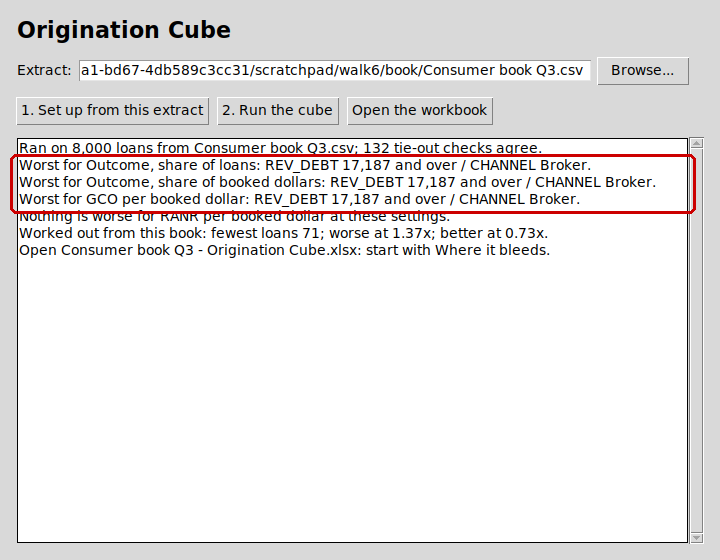

**Right:** Check lists 22 edges, 500 to 920 (23 bands). The window names REV_DEBT 17,187 and over / Broker as the worst pocket, by excess. On **Where it bleeds**, FICO 600 to under 620 / Broker (99 loans, 50.5% bad) is third and flagged **worse**. 580 to under 600 / Broker (50 loans, 29 bad) is under the 71-loan floor and reads *too few loans to test*.

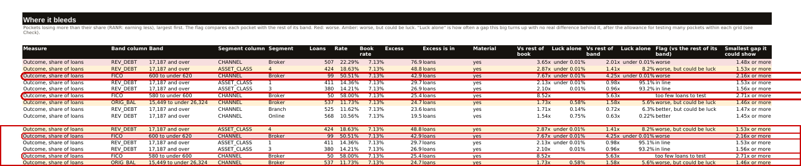

On Losses vs revenue, 600 to under 620 / Broker also reads *Losing more, earning more (revenue gap could be luck)*:

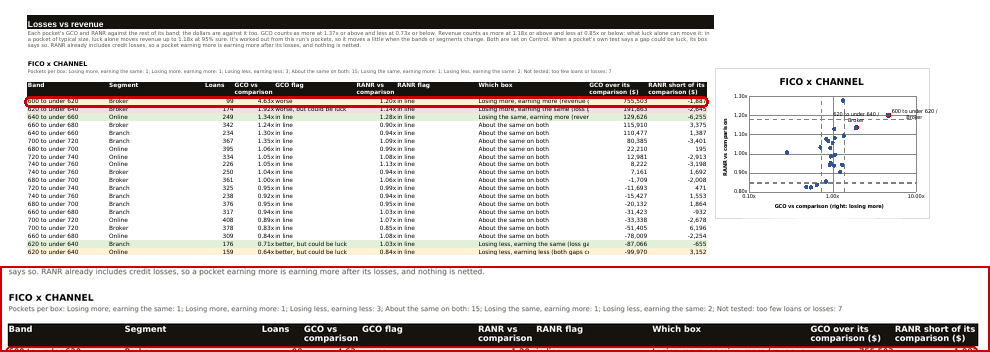

## Step 22: Press Set up again

Press **1. Set up from this extract** again.

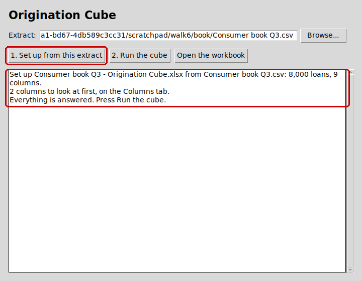

**Right:** "Everything is answered. Press Run the cube." Control, Columns and Odd values answers are kept, and so are the last results. Band edges typed on other workbooks are **not** written in: before this Set up another copy had left REV_DEBT `every 2000` in the memory, and this workbook's REV_DEBT stays blank.

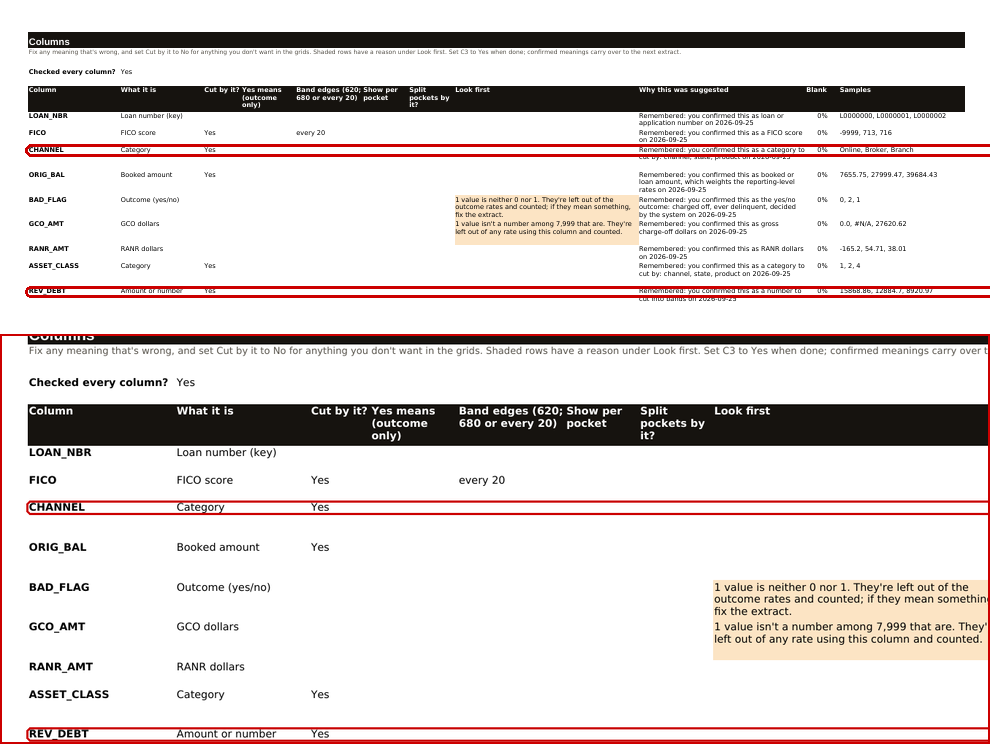

**Set up again empties Last Run used on Control**, although the results tabs still show that Run (ringed, empty):

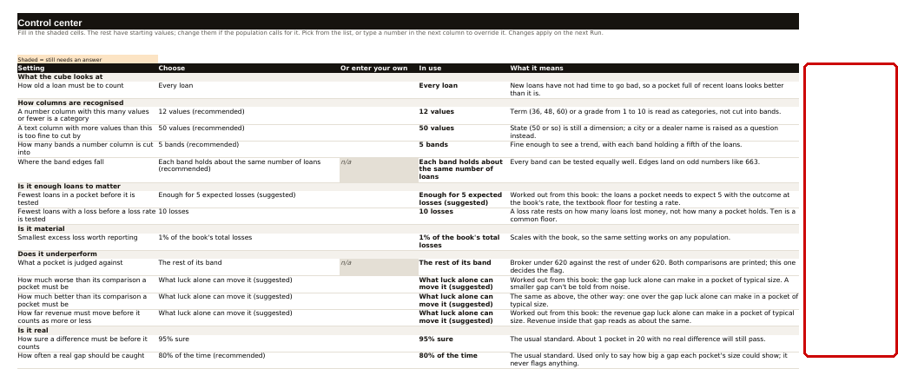

## Step 23: Prune something learned

On **Learned**, set a row's **Keep?** (column A) to **Forget**. Save, close and Run.

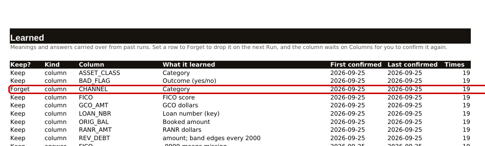

**Right:** the window says "Forgot CHANNEL, as marked on Learned. Check it on Columns and set C3 to Yes before the next Run."

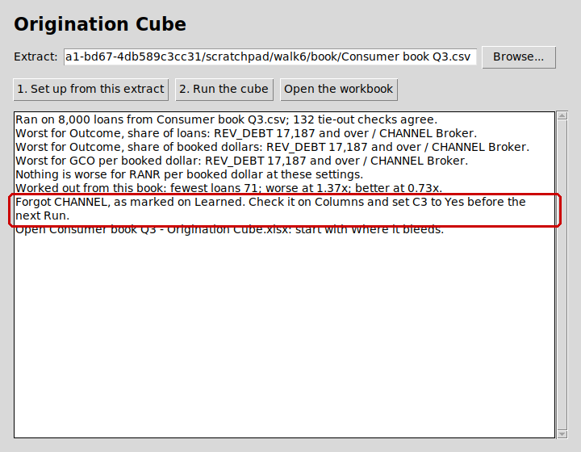

The next Run refuses until you do:

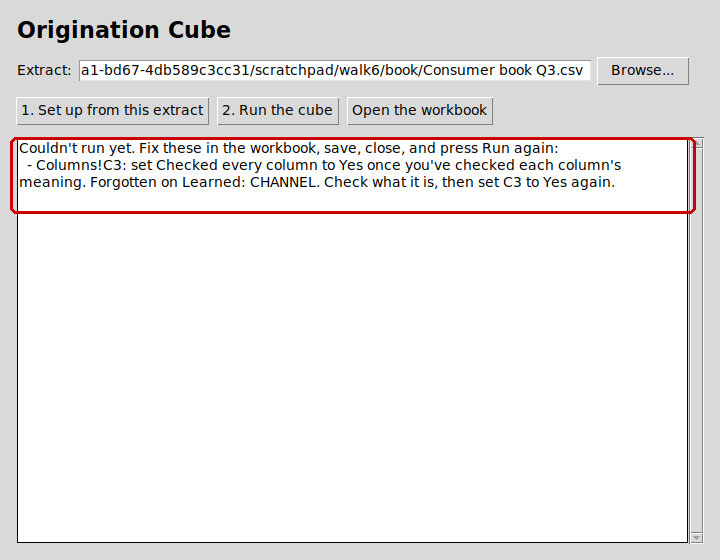

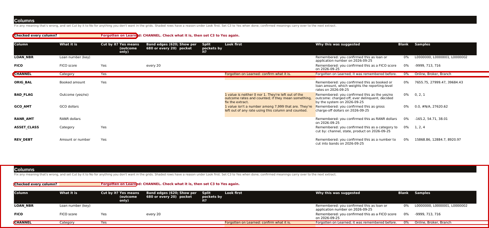

## Step 24: The next extract

Browse to the next quarter's extract and press **Set up**.

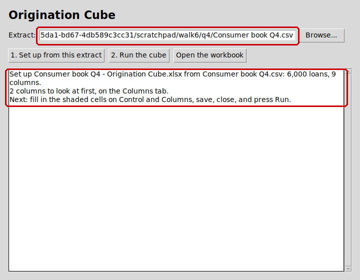

**Right:** meanings are remembered, and so are the band edges from the last Run. FICO comes in as `every 20`, shaded, with "Band edges remembered from before: every 20." under **Look first**:

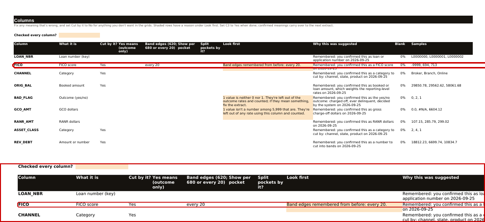

Control starts blank again. The judgment calls are asked every time.

**The window's count leaves the edges out.** It says "2 columns to look at first"; three rows are shaded.

## Step 25: What the memory holds is the last Run's, from any workbook

The memory is one file. Every Run writes every column's edges into it, and a blank cell clears them. So what the next new workbook gets is whatever the last Run of *any* workbook had.

On this walk the last Run before the Q1 extract was a wrong turn that typed `620; 680` on CHANNEL, a category. Q1's Set up filled it in, marked:

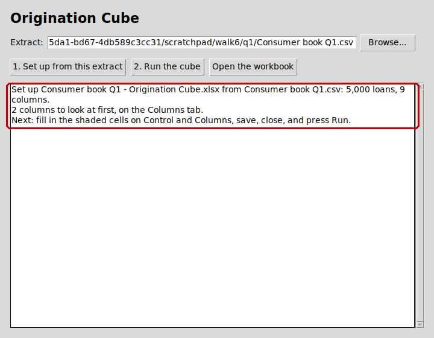

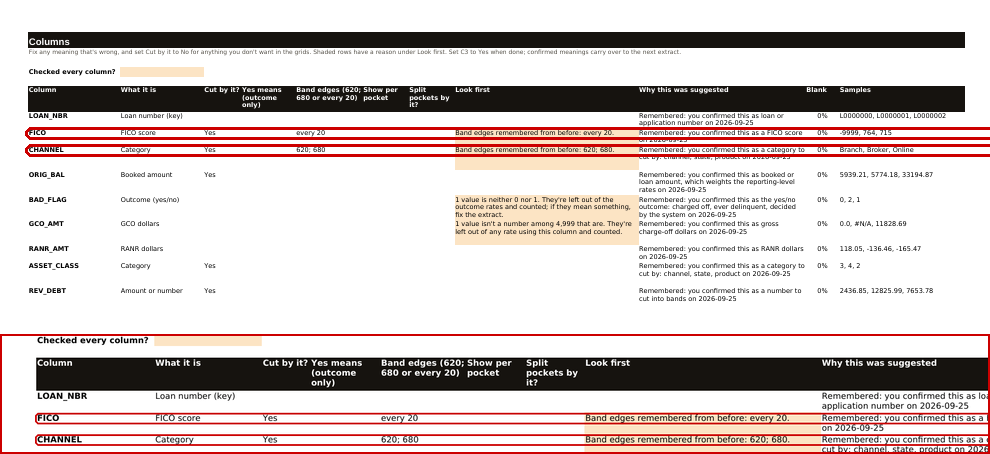

**Clear anything under Look first you didn't type.** Edges on a category are ignored by the Run.

## Step 26: Clearing a cell forgets the edge

On the Q4 workbook, clear FICO's `every 20`, save, close and Run. Then set up Q1 again in a fresh folder: nothing is filled in.

---

## When something goes wrong

| What you did | What the window says | What to do |
|---|---|---|
| **A.** Split set on two columns | "Columns!H13 and Columns!H14: only one column can split the pockets. Clear all but one." | Clear one. |
| **B.** Split the only category that's cut | "Nothing is left to cut across ... CHANNEL (Columns!H8: it splits the pockets ...); ASSET_CLASS (Columns!D13, Cut by it? No)." | Clear the split, or set ASSET_CLASS back to Yes. |
| **C.** *average* on a category | "Columns!G8: "CHANNEL" isn't a number column, so it has no average to show." | Clear the cell. |
| **D.** Edges `620,680,740` turned into one number by Excel | "... read as the single number 620,680,740. Excel dropped the commas. Type them with semicolons" | Retype with semicolons. |
| **D2.** An edge outside the column (`620; 680; 950`) | "FICO runs from 496 to 921, so an edge at 950 would leave a band empty." | Type edges inside that range. |
| **E.** Workbook still open in Excel | "... is open in Excel. Close it, then press Run again." Set up says the same. | Close Excel and press again. |
| **F.** A column renamed after Set up | "Couldn't run: the extract has no column "CHANNEL" (a segment) ... press Set up again." Set up then says "New columns since the last check: CHNL." | Press Set up, check the new name, set C3 to Yes. |
| **G.** Fewer rows after Set up | "Consumer book Q3.csv has changed since Set up ...", then it runs on 6,000. | Check the loan count. |
| **H.** Workbook copied to a folder with a different extract of the same name | The same "has changed" line; it runs the new folder's 3,000 loans. | Press Set up in the new folder first. |
| **I.** Split set on GCO, the key or the outcome | "Columns!H11: "GCO_AMT" is marked GCO dollars, which can't split the pockets. Only a score, ratio, amount (the booked amount too) or category can." | Split by something known at booking. |
| **I2.** Split by the booked amount | Runs, 571 tie-outs. | As the message says, it's allowed. |
| **J.** A dollar amount typed as materiality (100000) | Runs. | Check says it's GCO dollars only. |
| **K.** The workbook picked as the extract | Set up: "... is the workbook, not the loan file. Pick the extract it was set up from". Run: "Pick the extract beside it." | Browse to the .csv. |
| **L.** 95 typed for "how sure" | "... from 0.5 to 0.999; got 95. For 95%, type 0.95." | Type 0.95. |
| **M.** 95, or 0.95, as your own revenue line | 95: "... for 15%, type 0.15." 0.95: refused, no hint. | Type a share up to 0.9. |
| **N.** New columns in a refreshed extract | "New columns since the last check: CURR_STATUS, DTI. Columns!C3 needs a Yes again." | Check them, set C3 to Yes. |
| **O.** Forget on Learned, then Run twice | First Run runs and says what was forgotten; the second refuses on C3. | Check the column, set C3 to Yes. |
| **P.** `every 1` or `every 0.5` on FICO | "Columns: every 1 on "FICO" would make 392 bands (498 to 889). Use a wider band, 50 at most." (783 for 0.5) | Use a wider width. "50 at most" means bands, not width. |
| **Q.** `every 0`, `every -5`, `every twenty` | "Columns!F7: "every 0" should read like every 20: the word every, then how wide each band is." | Type a positive number in figures. |
| **R.** Edges typed on a category (CHANNEL) | Runs, says nothing; the cell is ignored, and remembered for the next new workbook. | Clear it. |
| **S.** Your own fewest loans bigger than any pocket (3000), with luck suggested | Runs, "Nothing is worse" for every measure, and "Worked out from this book: worse at 1.25x; better at 0.80x". Nothing was worked out: 1.25 is a fallback (defect 4). | Use a smaller number. |
| **T.** A small low-default book (5,000 loans, 1.34% bad) with every suggestion | The suggested floor is 374 loans, above every pocket. "Nothing is worse" for every measure, and "worked out" 1.25x again. | Read it as *nothing was tested*. Type your own fewest loans. |

**A: two splits**

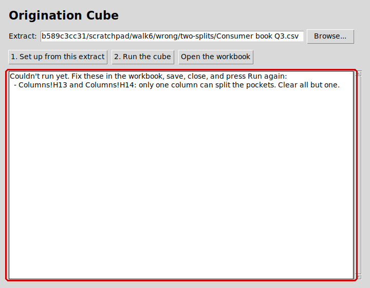

**B: the only segment split**

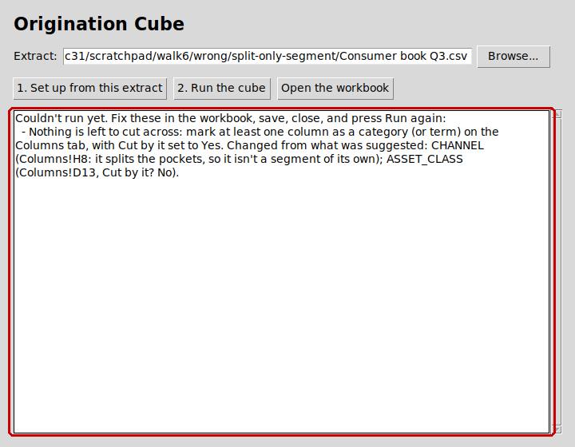

**C: average on a category**

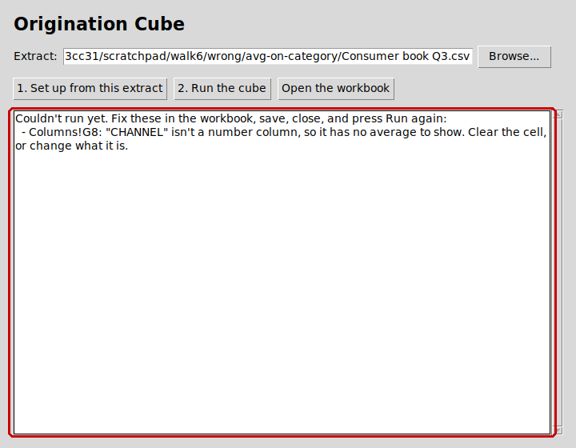

**D and D2: edges**

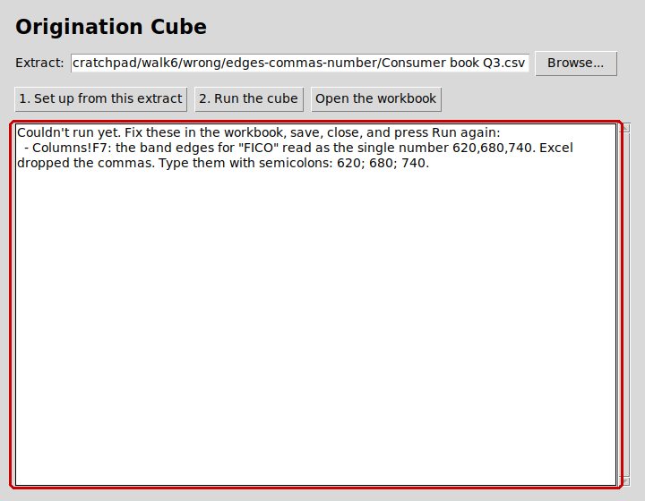

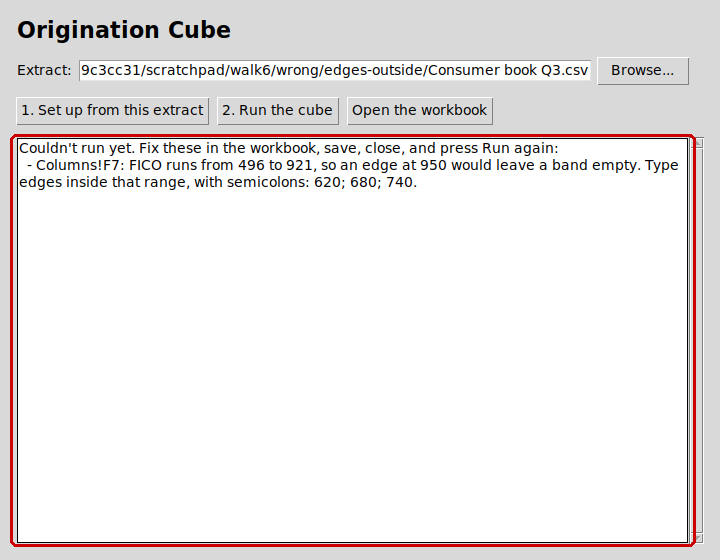

**E: workbook open.** Simulated by locking the file (`chattr +i`), since Excel isn't available here.

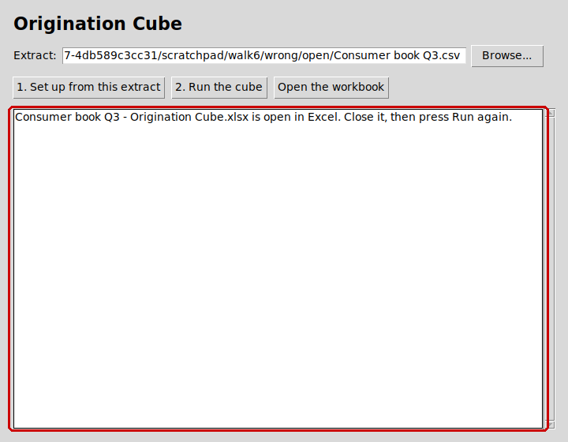

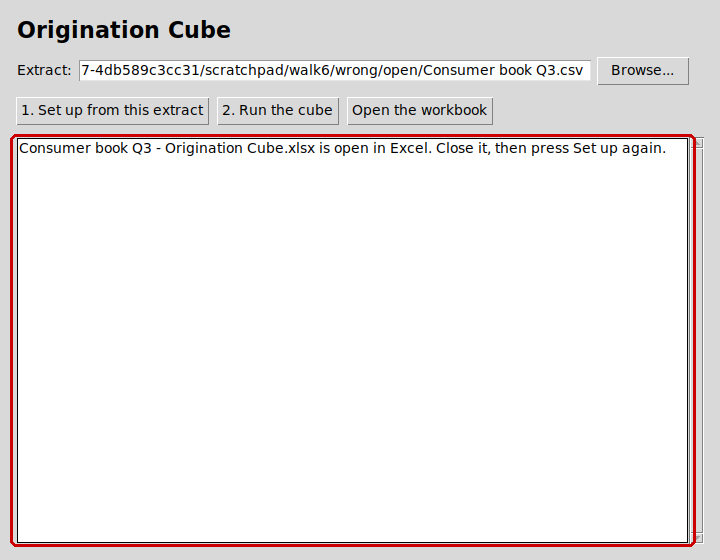

**F: a column renamed, then Set up**

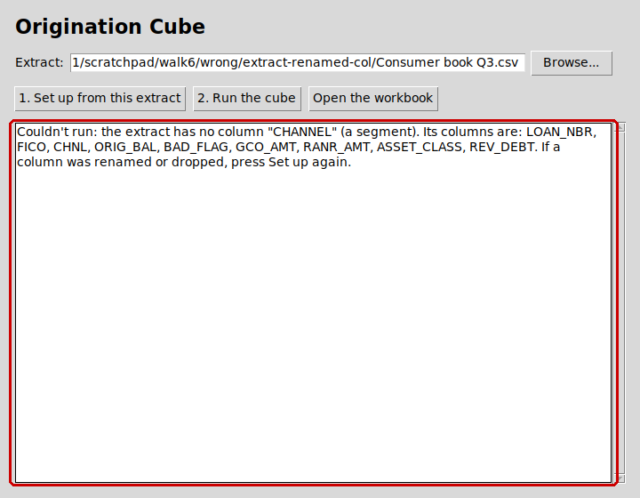

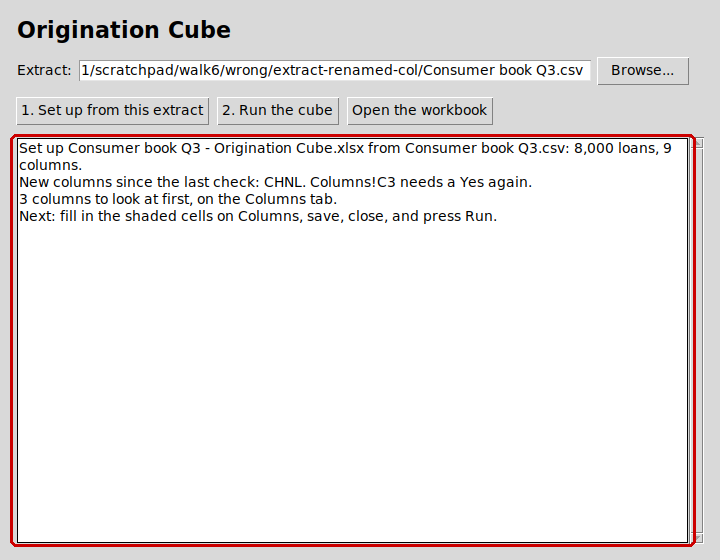

**G: fewer rows**

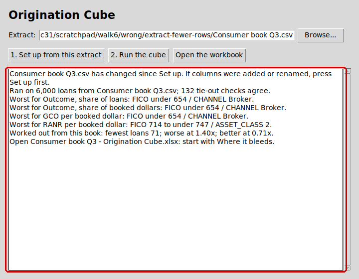

**H: the workbook copied to another folder**

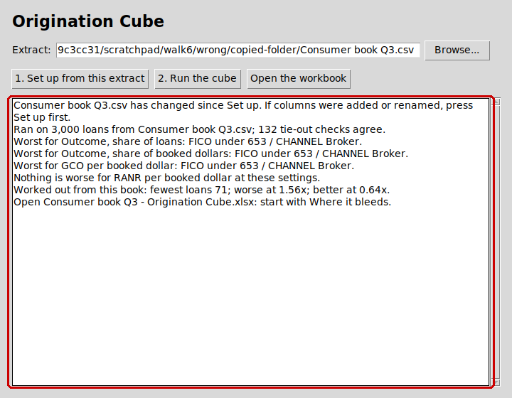

**I and I2: splits**

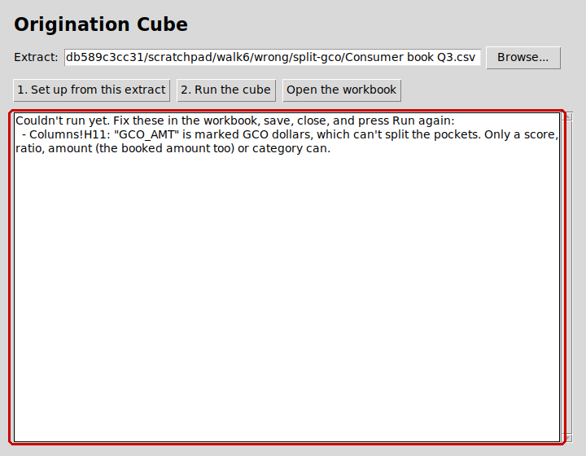

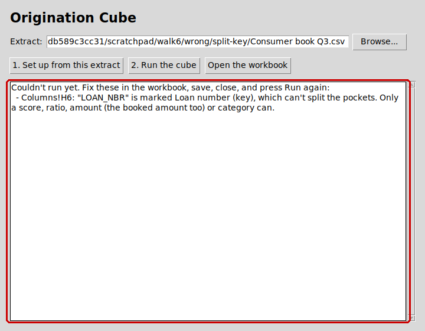

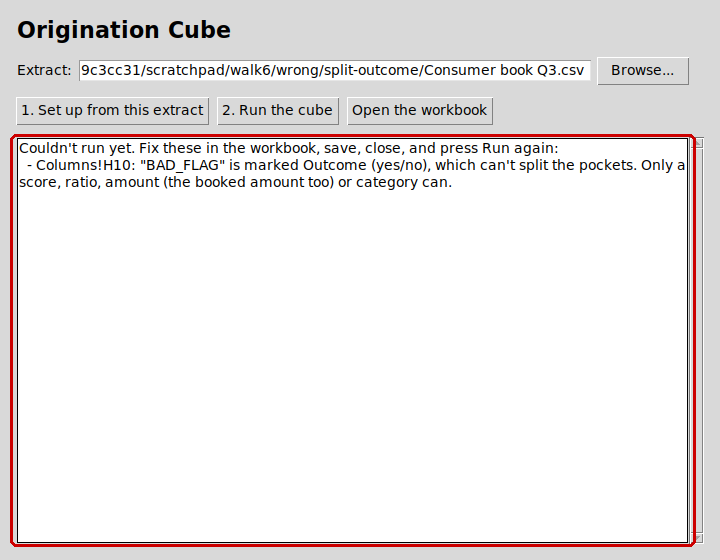

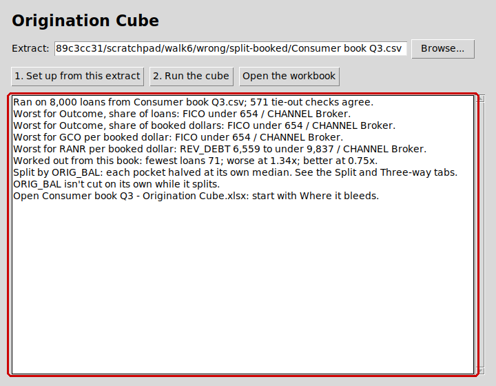

**J: your own dollar materiality**

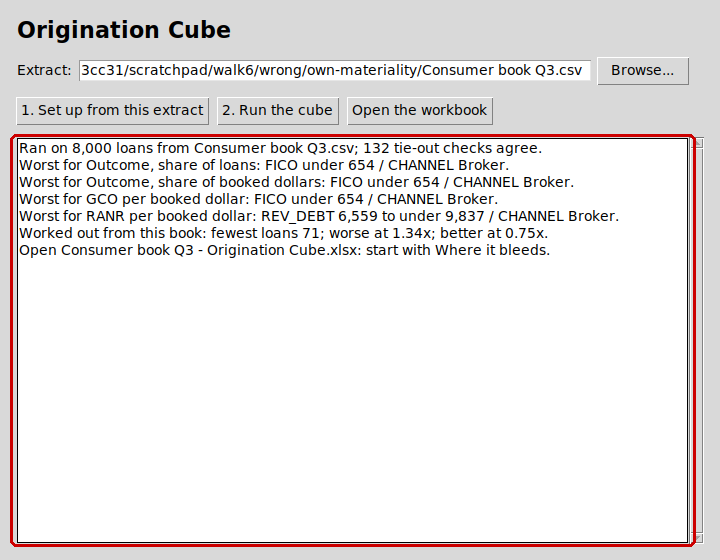

**K: the workbook picked, then Run**

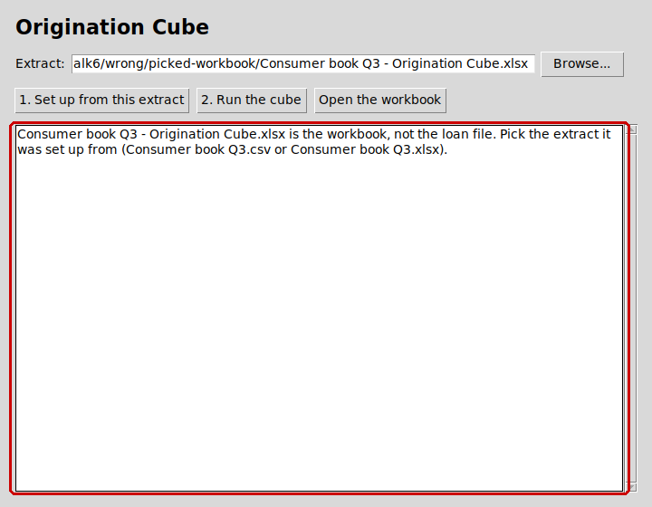

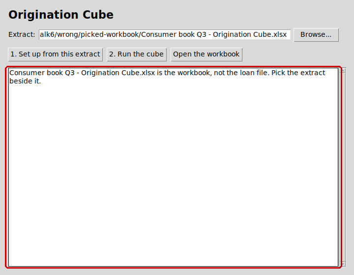

**L: 95 for "how sure"**

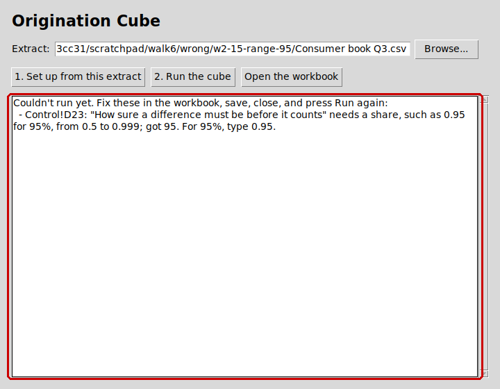

**N: new columns**

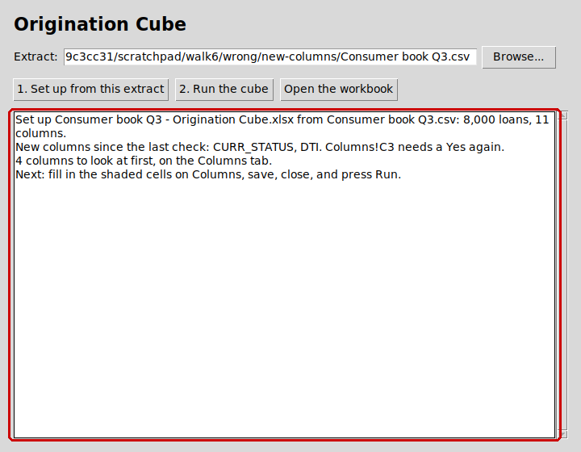

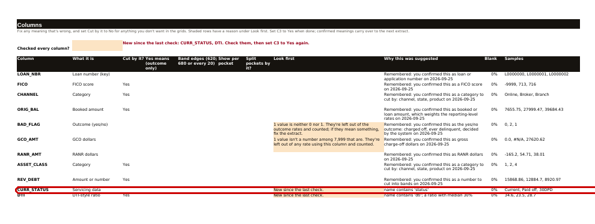

**P: every 1, every 0.5**

**Q: every 0, every -5, every twenty**

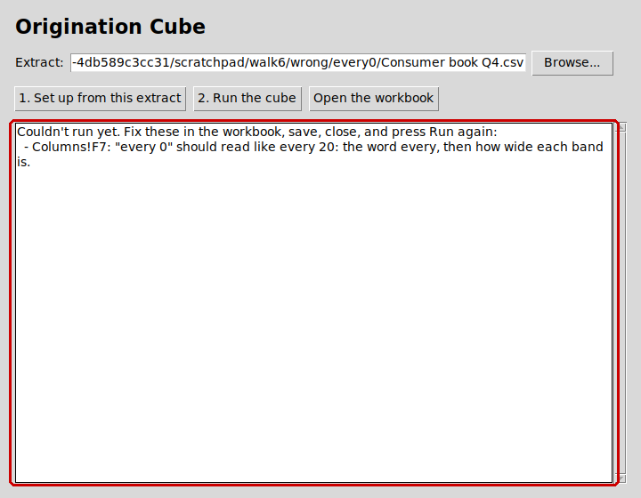

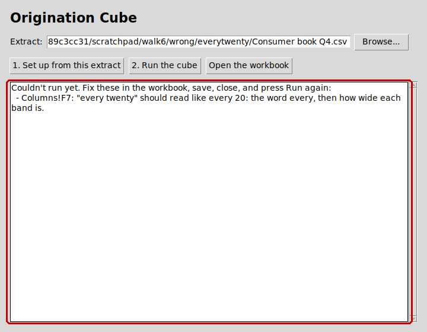

**R: edges on a category**

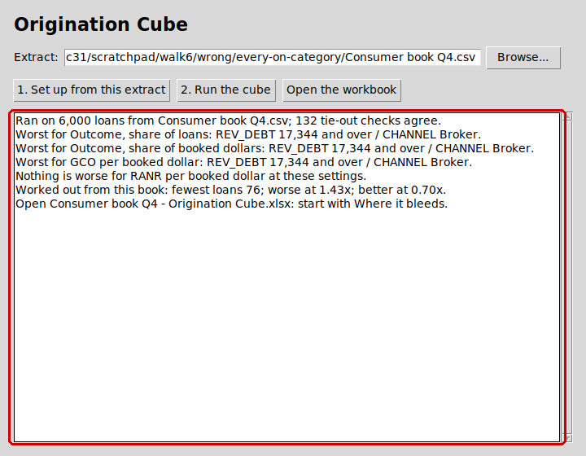

**S: a fewest-loans number bigger than any pocket**

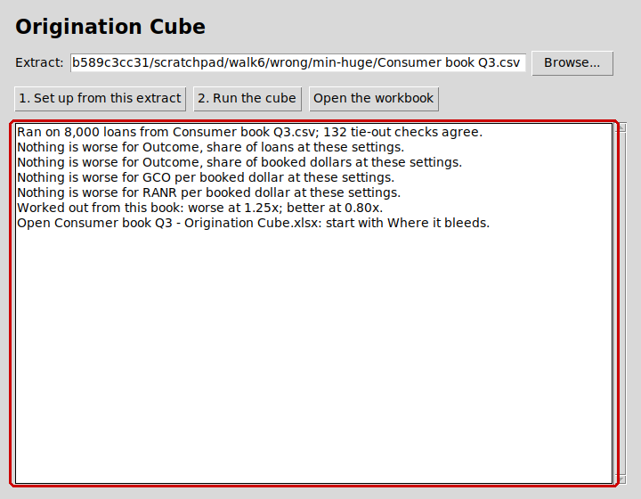

**T: a small low-default book**

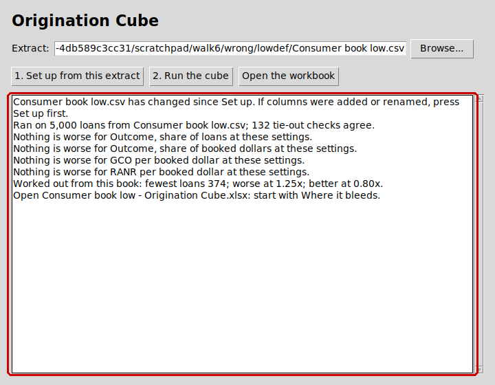

---

## How this was walked

On a Linux test machine:
- **The window:** `Origination Cube.pyw`'s window on a virtual display under Python 3.12, its buttons pressed by `driver/drive.py` (through `driver/win.sh`), each state photographed.
- **Excel's part:** done cell by cell with openpyxl (`driver/edit.py`), standing in for picking from the dropdowns and typing.
- **The workbook:** each state printed through LibreOffice (`driver/render.sh`) and photographed page by page. `driver/shots.py` crops and rings every picture. Control's **Last Run used** column is outside the tab's print area, so `driver/widen.py` widens the print area on a copy to show it as Excel would on screen.
- **Wrong turns and revenue options:** each in a folder of its own, from a copy of the answered workbook (`driver/wrong.sh`, and `driver/wrong2.sh` for the ones that change the extract or the file). They share one scratch memory file with the main route, as a team sharing a memory folder would.
- **The build:** frozen at commit `fec5f71` with `git archive`.
- **Reading tabs back:** `driver/boxcheck.py`, `driver/pastline.py` (dots past a line but boxed "the same": none now), `driver/revenue_options.py` (step 13's table), `driver/threeway.py`, `driver/luckline.py` (what the suggested numbers are made of), `driver/noplant.py` (the split on a book with no debt effect), `driver/lowdefault.py` (wrong turn T's book).
- **The next extracts:** `synth.make_rows` with seeds 11 (Q4, 6,000 loans) and 23 (Q1, 5,000 loans).

The order walked: steps 1 to 17, the revenue and GCO line options, the no-effect book, 18 to 21 on the same workbook, 24 and the band-width wrong turns on Q4 copies, 25, 26, then 22 and 23, then the other wrong turns.
