# Origination analysis: the window and the workbook

**Who this is for:** the analyst preparing an origination analysis for a bank's line of business (LOB). No command line is needed.
**What you finish with:** one workbook beside the loan extract. It holds your answers, a ranked list of the pockets that lose more than their share, losses set against revenue, and, if you ask for it, every pocket split by a third column and ranked again.
**Walked:** 25 September 2026, on commit `a5a8aa2`, with a synthetic book of 8,000 loans. The book hides two things: a bad pocket (scores under 620 in the Broker channel), and borrowers carrying more revolving debt than usual for their score, who go bad 1.8 times as often. RANR has nothing planted in it. No real bank data was used.

**What changed since the sixth walk:**

- The suggested revenue option on Control is now **each pocket's own luck range**: revenue only counts as more or less when that pocket's own test says the gap isn't luck (step 13).
- On Losses vs revenue, a box marked "could be luck" isn't shaded and isn't counted with the findings. The count line gives those on their own. The RANR column is now **RANR reading**, read against the same line as the box.
- Pockets that are material but too small to test are **shaded blue** on Where it bleeds, and the window counts them (step 21).
- When nothing can be worked out from the book, the window and Control say the usual value was used, and the window says when no pocket had enough loans to test.
- Control's **Last Run used** column is on the printed page and stays through Set up (steps 9 and 22).
- Only band columns' edges are remembered, and Set up's count of columns to look at includes them (step 24).

<!-- ROUTE -->

## Before you start

- **Python 3.10 or later**, and **`Install add-ons.bat`** run once. You only need to do this the first time.
- **Excel.**
- **The loan extract** (.csv or .xlsx) in its own folder. It needs a loan number, the booked amount, a yes/no outcome, GCO dollars and RANR dollars.

---

## Step 1: Open the window

Double-click **`Origination Cube.pyw`** in the `origination-cube` folder.

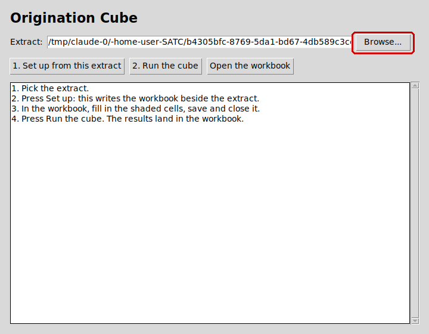

**Right:** a window titled *Origination Cube*, an Extract box, **Browse...**, three buttons, and four numbered lines in the box underneath.

## Step 2: Pick the extract

Press **Browse...** and pick the loan file, not the workbook. On Windows this is the usual Open dialog.

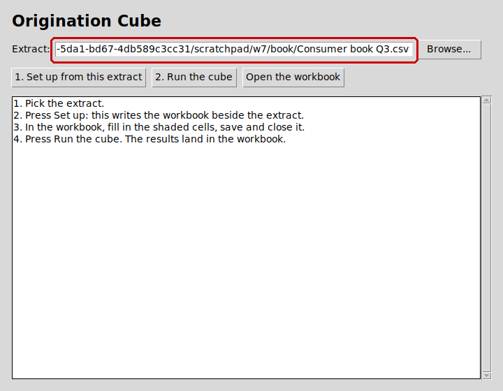

**Right:** the file name shows at the right-hand end of the Extract box. The window remembers the last file picked, from any earlier session, so check it's this quarter's.

## Step 3: Press 1. Set up from this extract

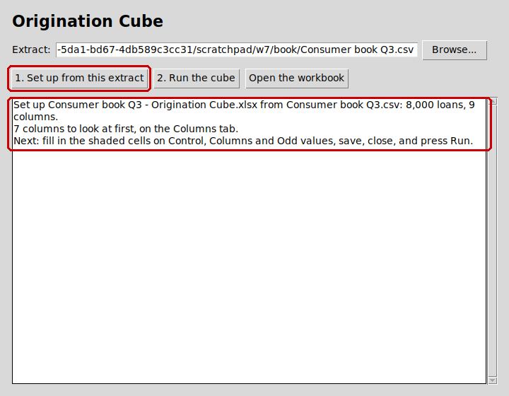

**Right:** "Set up Consumer book Q3 - Origination Cube.xlsx from Consumer book Q3.csv: 8,000 loans, 9 columns", then "7 columns to look at first", then what to fill in.

**Check the loan count against what the bank sent.** If it's wrong, you picked the wrong file.

## Step 4: Open the workbook: Start here

Press **Open the workbook**. It opens on **Start here**.

**Right:** four steps, and *Where things stand*: **9** calls to make on Control, 7 things to look at on Columns, 2 odd values, *not run yet*.

## Step 5: Control: see what needs an answer

Click the **Control** tab.

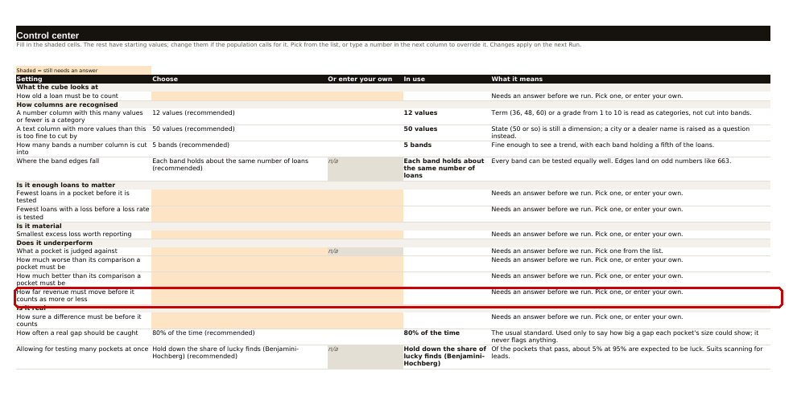

**Right:** nine rows are shaded peach. They are the calls the tool won't make for you. Four offer a suggestion, marked *(suggested)* in their lists:
- **Fewest loans in a pocket before it is tested:** *Enough for 5 expected losses*.
- **How much worse** and **how much better:** *What luck alone can move it*: one line for every pocket, worked out from the book.
- **How far revenue must move** (ringed): also called *What luck alone can move it*, but it works differently. It means each pocket's own luck range, not one line. **The explanation beside it still describes the old single line** ("a pocket of typical size"). Go by this procedure, not that sentence (defect 2).

Nothing is picked for you.

## Step 6: Columns: see what each column was taken to be

Click the **Columns** tab.

**Right:** one row per column, with a meaning in *What it is* and the reason beside it. Seven rows are shaded under **Look first**. *Checked every column?* (C3) is empty. **Band edges** takes edges (`620; 680`) or a width (`every 20`).

## Step 7: Odd values, and Learned

Click **Odd values**.

**Right:** FICO's -9999 (160 rows) and RANR's negatives (2,612 rows), each with an Answer cell.

On the first extract **Learned** says *Nothing learned yet*.

## Step 8: If you press Run too early

Save, close and press **2. Run the cube** before answering, and nothing runs.

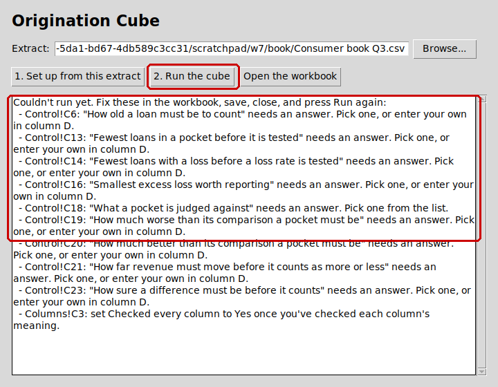

**Right:** "Couldn't run yet", then one line per thing to fix, naming the tab and cell. The same list goes to the **Log** tab.

## Step 9: Fill in the shaded cells on Control

Click each shaded **Choose** cell and pick from its list, or type a number in **Or enter your own**. The walk took every suggestion:

| Setting | Answer |
|---|---|
| How old a loan must be to count | Every loan |
| Fewest loans in a pocket before it is tested | Enough for 5 expected losses (suggested) |
| Fewest loans with a loss before a loss rate is tested | 10 losses |
| Smallest excess loss worth reporting | 1% of the book's total losses |
| What a pocket is judged against | The rest of its band |
| How much worse | What luck alone can move it (suggested) |
| How much better | What luck alone can move it (suggested) |
| How far revenue must move before it counts | What luck alone can move it (suggested) |
| How sure | 95% sure |

After the Run (step 11), Control's last column, **Last Run used**, shows what the Run actually used: **71** loans, **1.34** and **0.75** (worked out from this book), and revenue as **each pocket's own luck range**. It is inside the printed page now.

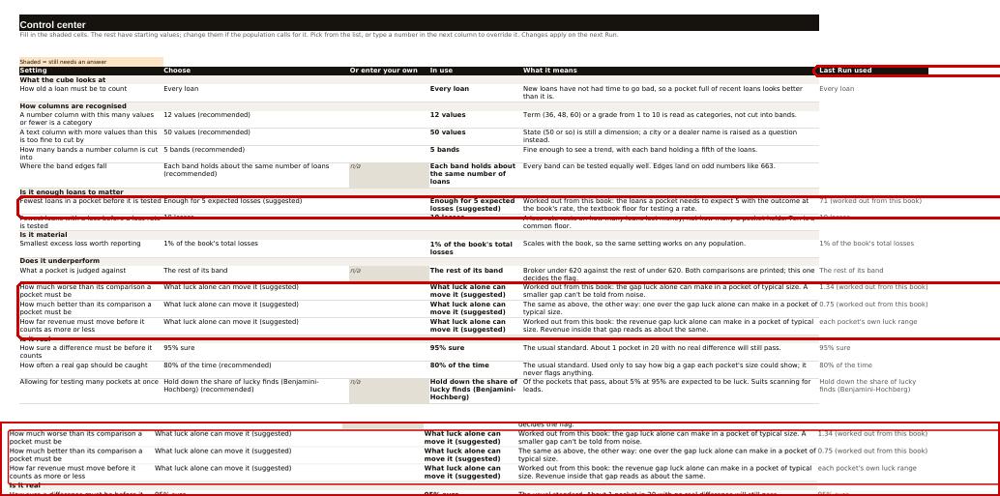

Four rows of *Last Run used* stay blank (the category limits, band count, band placement), though the Run used them.

## Step 10: Confirm the columns and answer the odd values

On **Columns**, check each *What it is*, then set **Checked every column?** (C3) to **Yes**.

On **Odd values**, the walk said FICO's -9999 is **missing** and RANR's negatives are **real**.

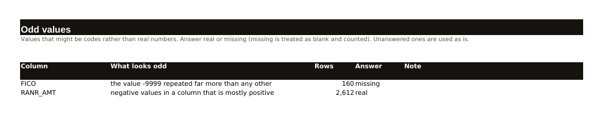

## Step 11: Save, close, and press 2. Run the cube

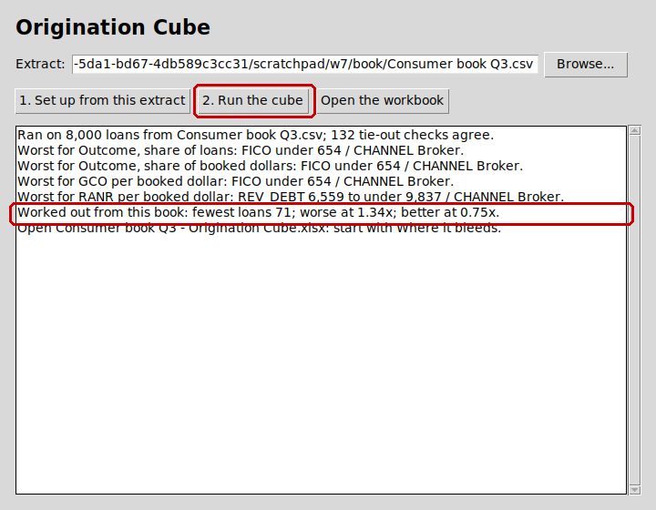

**Right:**
- "Ran on 8,000 loans from Consumer book Q3.csv; 132 tie-out checks agree."
- one *Worst for* line per measure. For the three loss measures it's **FICO under 654 / CHANNEL Broker**, the planted pocket seen through five equal bands.
- "Worked out from this book: fewest loans 71; worse at 1.34x; better at 0.75x." (ringed).

The *Worst for RANR* line (REV_DEBT 6,559 to under 9,837 / Broker, RANR 0.74x) is noise: the test data plants nothing in RANR. One pocket in about a hundred passing by chance is what 95% sure allows.

## Step 12: Read Where it bleeds

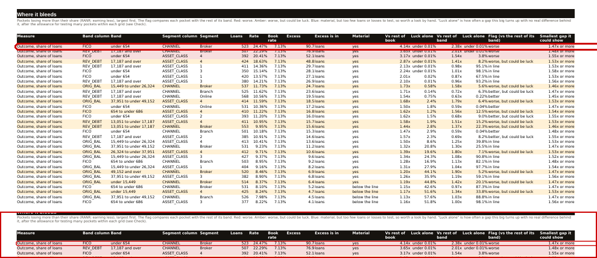

**Right:** the first row is FICO under 654 / Broker: 523 loans, 24.47% bad against a book of 7.13%, 90.7 loans of excess, 4.14x the rest of the book, 2.38x the rest of its band, **worse**.

How to read a row:
- **Red:** worse, and the test says it isn't luck. **Amber:** worse, but could be luck. **Blue:** material, but too few loans or losses to test; look at it by hand (step 21).
- **The flag** uses the comparison chosen in step 9 and the *how much worse* line (1.34x here).
- **Luck alone** is how often a gap this big turns up with no real difference, after the allowance for testing many pockets.
- **Smallest gap it could show** is what a pocket of that size can reliably find.

## Step 13: Losses vs revenue

Every pocket at or above the fewest-loans line (71 here) goes in one of nine boxes. There's one block and one chart per grid.

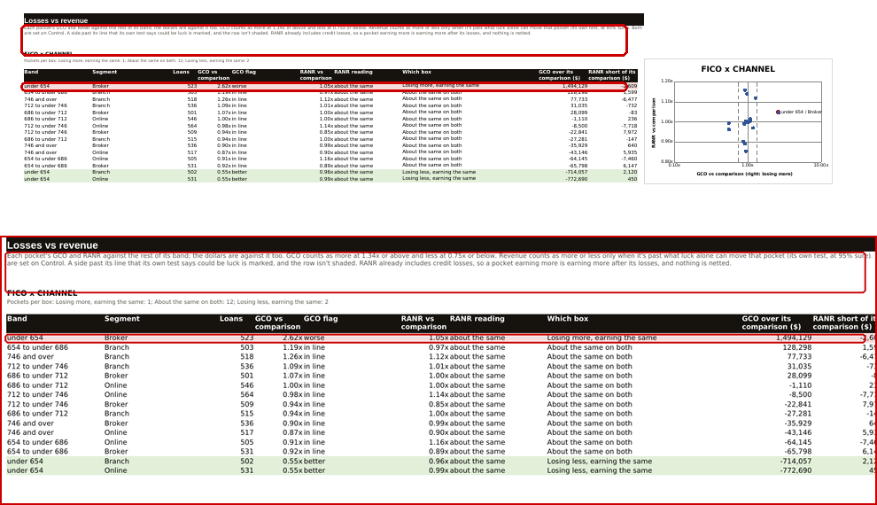

**Right:**
- The subtitle gives the lines: GCO at **1.34x** and **0.75x**; "Revenue counts as more or less only when it's past what luck alone can move that pocket (its own test, at 95% sure)."
- FICO under 654 / Broker (ringed) reads **Losing more, earning the same**: GCO 2.62x the rest of its band, RANR 1.05x, *about the same*. Shaded red.
- *RANR reading* says *about the same*, *earning more* or *earning less*, against the same line as the box.

**Count line and luck marks.** A box can end in "(loss gap could be luck)". Those rows aren't shaded, and the count line lists them apart: "Marked could be luck, not counted above: 8". On this run 35 boxes carry a mark, all on the GCO side.

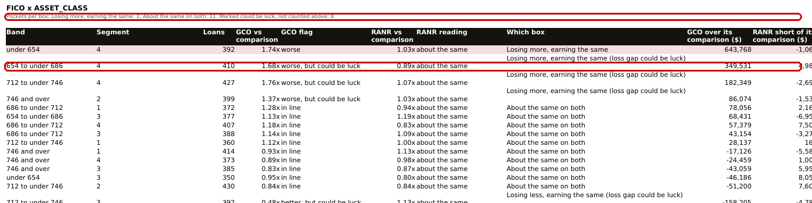

**Where the box text wraps, it sits at the top of a taller row** while the numbers sit at the bottom. Read the row by its numbers, not by the line the box text seems to be on (defect 4).

The chart plots the same pockets, with the GCO lines dashed. Under the suggested revenue option there are no revenue lines, since each pocket has its own. The three biggest *Losing more* pockets are named, including luck-marked ones:

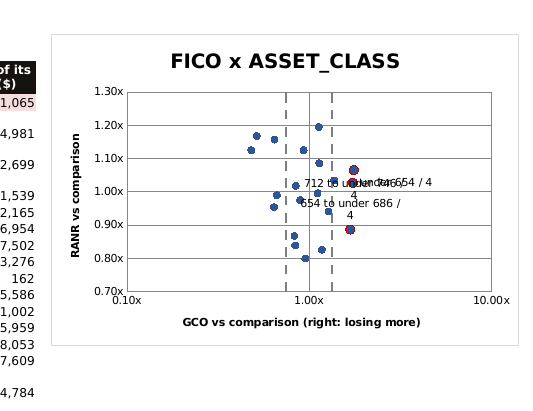

A pocket can read *earning less* on RANR noise when its own test says so. Here REV_DEBT 6,559 to under 9,837 / Broker, RANR 0.74x, is *Losing the same, earning less*, shaded red:

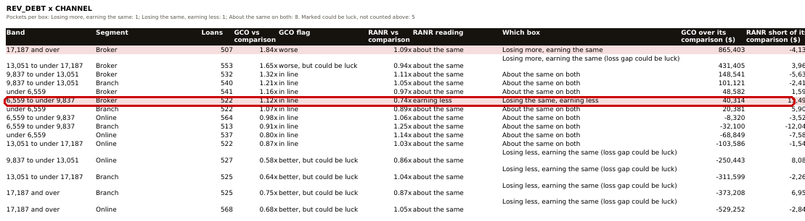

**Other revenue lines.** Change *How far revenue must move* on Control, save, close and Run. The fixed options are plain lines, the same for every pocket, with the luck mark:

| Revenue option | Lines | Boxes marked luck | Planted pocket, default bands | under 620 / Broker, `620; 680; 740` | 600 to under 620 / Broker, `every 20` |
|---|---|---|---|---|---|
| Each pocket's own luck range (suggested) | its own test | 35 | Losing more, earning the same (red) | Losing more, earning the same (red) | Losing more, earning the same (red) |
| 5 percent either way | 1.05x / 0.95x | 73 | the same (red) | **Losing more, earning more (revenue gap could be luck): not shaded, not counted** | **the same: not shaded, not counted** |
| 10 percent either way | 1.10x / 0.90x | 58 | the same (red) | **not shaded, not counted** | **not shaded, not counted** |
| The same lines as for losses | 1.33x / 0.75x | 35 | the same (red) | Losing more, earning the same (red) | Losing more, earning the same (red) |
| Your own: 0.15 | 1.15x / 0.85x | 43 | the same (red) | **not shaded, not counted** | **not shaded, not counted** |

**Under 5%, 10% or your own line, check every "(revenue gap could be luck)" row's GCO flag.** If it says *worse*, the pocket is a real loss finding even though the row isn't shaded or counted. With `every 20` and 5%, all three real *worse* rows on the tab are unshaded (defect 1).

With 5% either way, default bands:

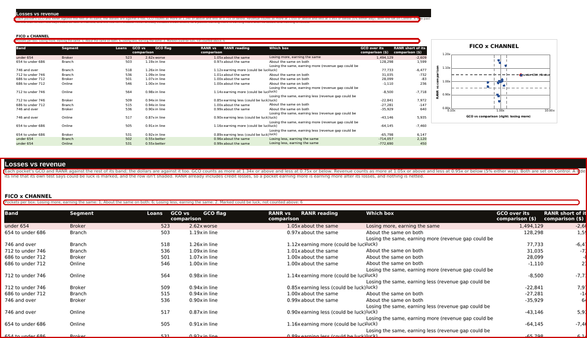

**Your own value is a share up to 0.9.** 95 is refused with "for 15%, type 0.15"; 0.95 with "The most it takes is 0.9."

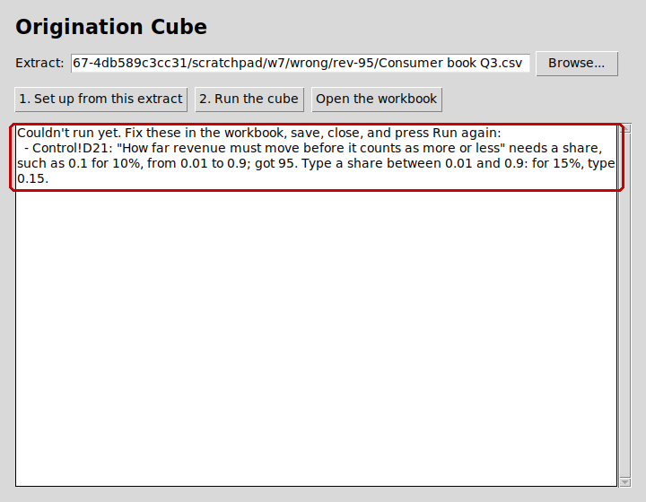

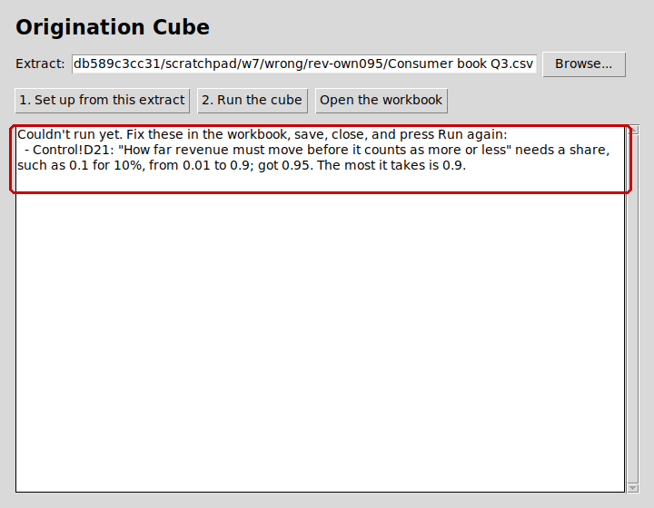

## Step 14: Grids

**Grids** shows each band crossed with each segment, one block per measure. Red is worse, green is better; for RANR low is red.

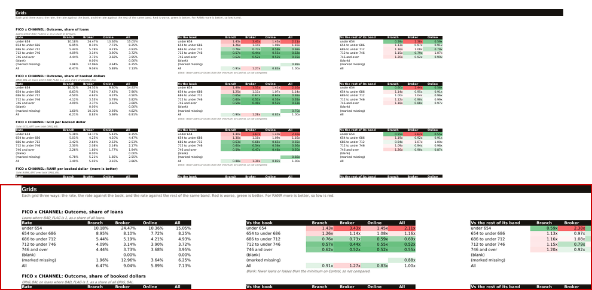

## Step 15: Materiality

**Right:** for *FICO x CHANNEL: Outcome, share of loans*, the level in use is 5.7 loans (1% of the book's bad loans).

## Step 16: Check

**Check** records what the run did, including the worked-out numbers (ringed).

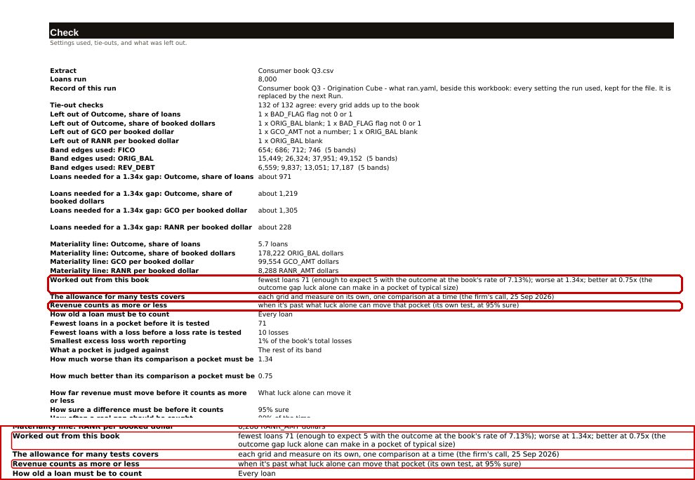

**Right:**
- "Worked out from this book: fewest loans 71 (enough to expect 5 with the outcome at the book's rate of 7.13%); worse at 1.34x; better at 0.75x".
- "Revenue counts as more or less: when it's past what luck alone can move that pocket (its own test, at 95% sure)".
- "132 of 132 agree".

The record beside the workbook (*... - what ran.yaml*) opens with "# revenue_line: each pocket's own luck range (its own test)".

## Step 17: Log, and Start here

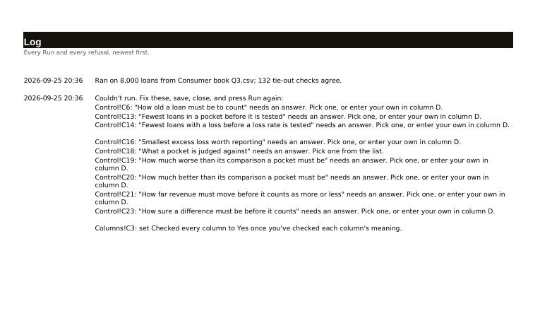

**Start here** now shows 0 calls, and the last run:

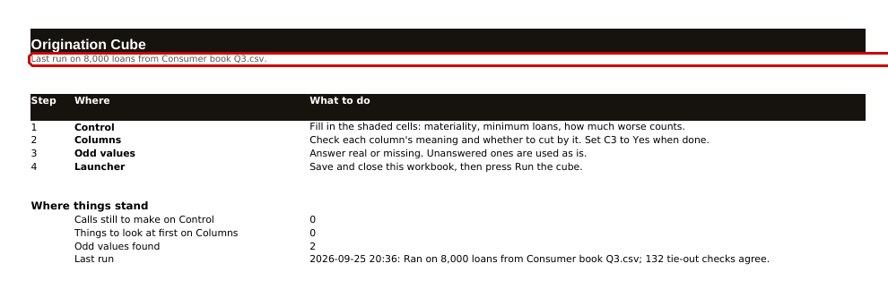

## Step 18: Split every pocket by a number (revolving debt)

On **Columns**, set **Split pockets by it?** to **Yes** on REV_DEBT. Save, close, and Run.

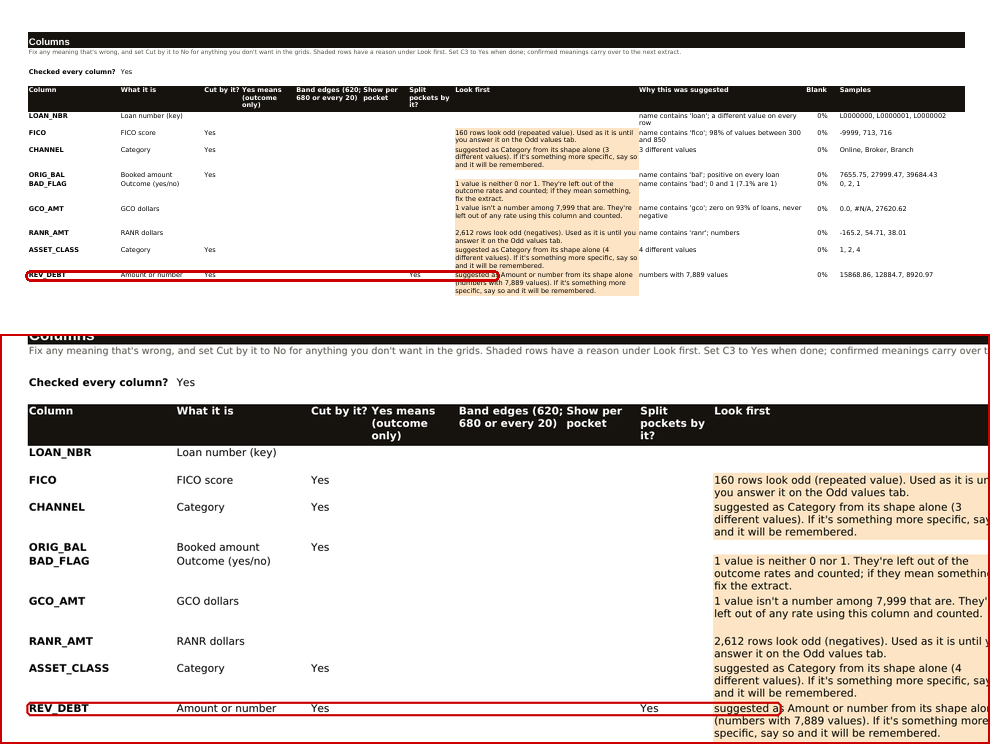

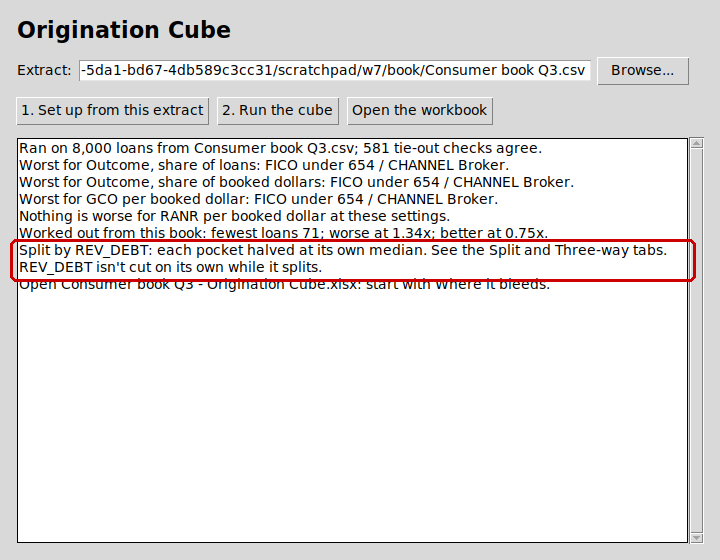

**Right:** "581 tie-out checks agree" and "Split by REV_DEBT: each pocket halved at its own median."

**Split** opens with **How this tab works**. The *Luck alone* row says which figures carry the allowance for many tests (the heat maps) and which don't (the summary, one pooled test per grid and measure). *What it assumes* explains the correlation once.

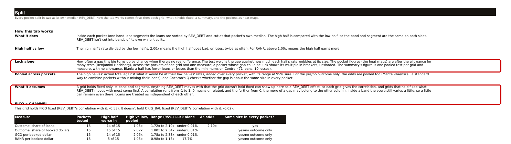

Each grid then gets one line on what it holds fixed, a summary and heat maps. **A multiple in brackets, unshaded, could be luck.** For FICO x CHANNEL the high-debt half goes bad **1.95 times** as often as the low half (1.72x to 2.19x), worse in 14 of 15 pockets. The planted effect is 1.8x.

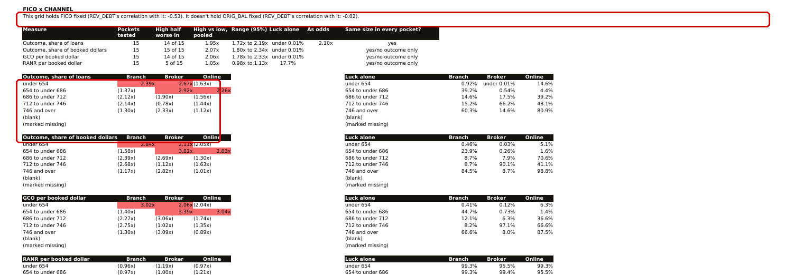

Grids that don't hold FICO fixed come after a dark red heading. **Don't quote the numbers under it.** On a book with no debt effect they still read 1.62x, luck alone under 0.01% (defect 8).

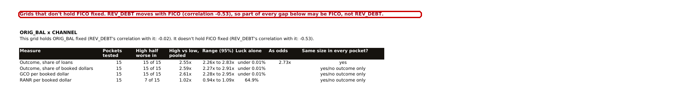

**Three-way** ranks every band / segment / half pocket. The last column, **Holds FICO fixed?**, reads *yes* or *no: part of this may be FICO*, and the *no* rows come last in each measure.

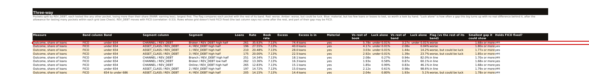

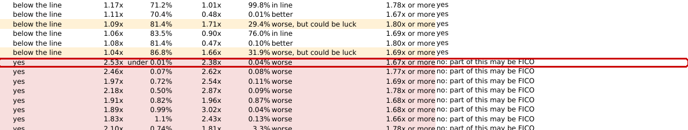

## Step 19: Split every pocket by a category (asset class)

Clear REV_DEBT's split and set **ASSET_CLASS** instead. Save, close, and Run.

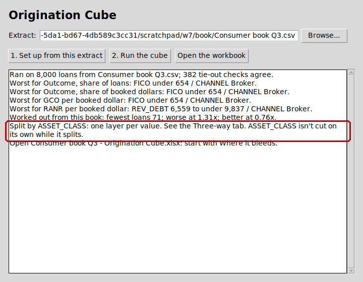

**Right:** "Split by ASSET_CLASS: one layer per value." On **Three-way**, FICO under 654 / Broker / asset class 4 (131 loans, 29% bad) is flagged **worse**, 2.11x the rest of its band.

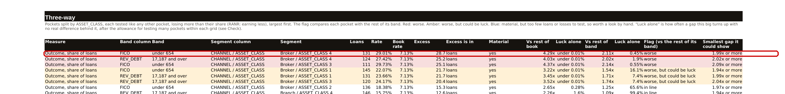

## Step 20: Show a median or average per pocket

On **Columns**, set **Show per pocket** to *average* on ORIG_BAL and *median* on REV_DEBT. Save, close, and Run. Each grid on **Grids** gets a table of it, marked "not tested".

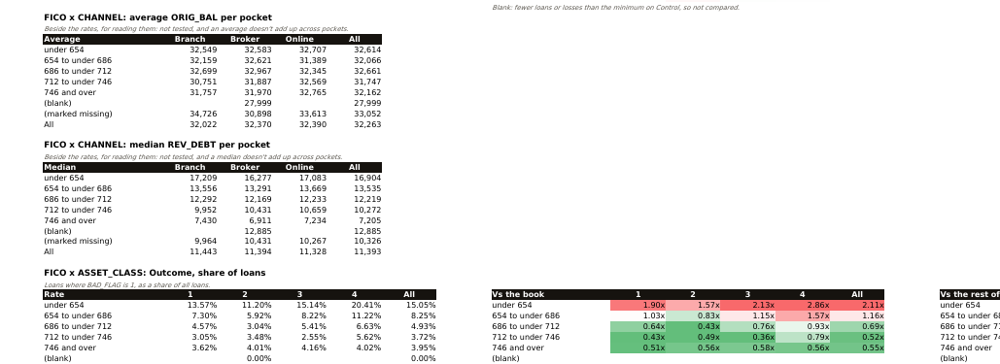

## Step 21: Your own band edges, a band width, and blue rows

**Edges:** type `620; 680; 740` in FICO's **Band edges** cell, with semicolons. Save, close, and Run.

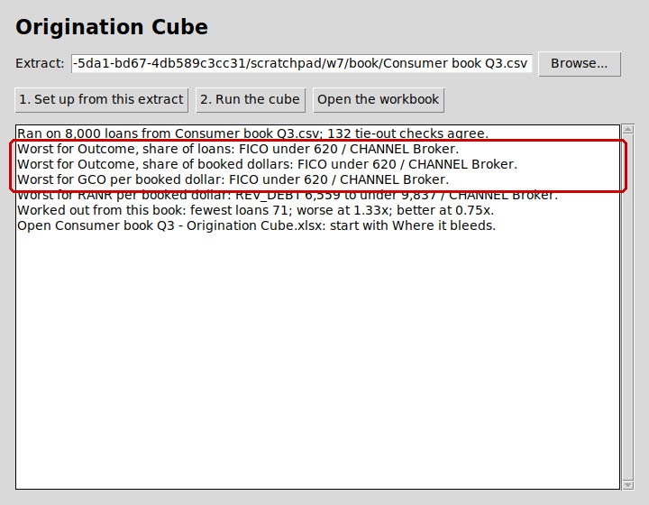

**Right:** the worst pocket is **FICO under 620 / Broker**: 176 loans, GCO 5.35x the rest of its band. On Losses vs revenue it reads **Losing more, earning the same**, shaded red (RANR 1.17x, which its own test calls luck).

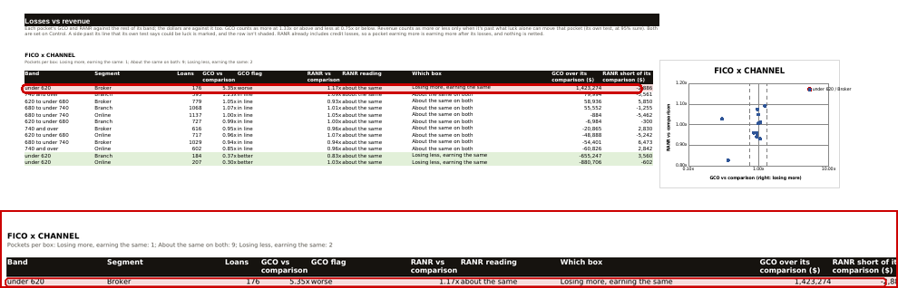

**A width:** type `every 20` instead.

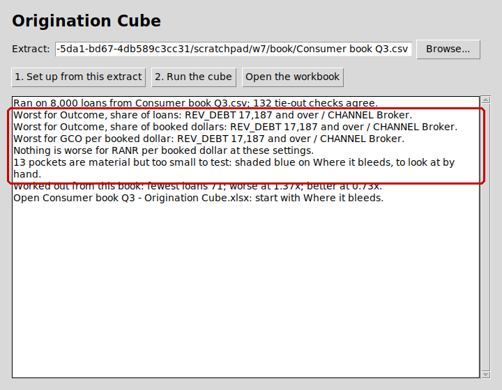

**Right:** the window names REV_DEBT 17,187 and over / Broker as the worst pocket, by excess, and says "13 pockets are material but too small to test: shaded blue on Where it bleeds". The 13 are rows, one per measure: 5 pockets.

On **Where it bleeds**, FICO 600 to under 620 / Broker (99 loans, 50.5% bad) is flagged **worse**. 580 to under 600 / Broker (50 loans, 29 bad) is under the 71-loan floor and is **blue**: look at it by hand.

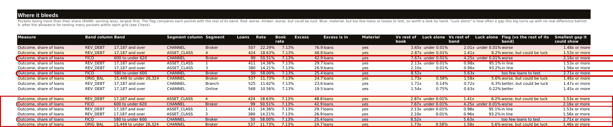

On Losses vs revenue, 600 to under 620 / Broker reads *Losing more, earning the same*:

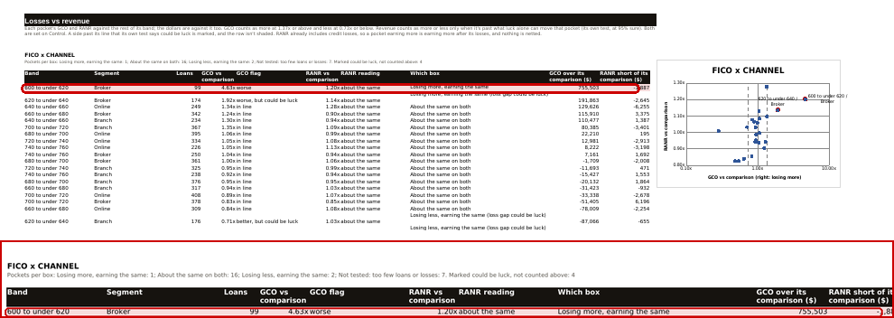

**A high floor.** Type your own fewest loans, 450, on Control. Pockets under it aren't tested, and the material ones turn blue. The window says "58 pockets are material but too small to test"; that is 58 rows over four measures, 23 pockets.

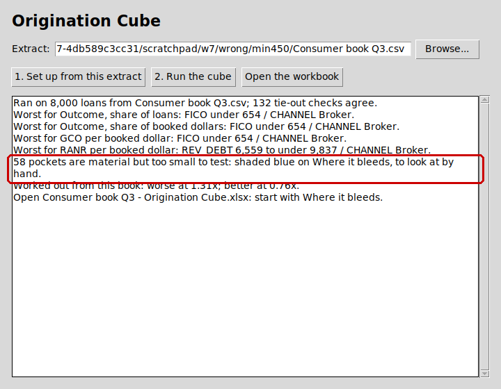

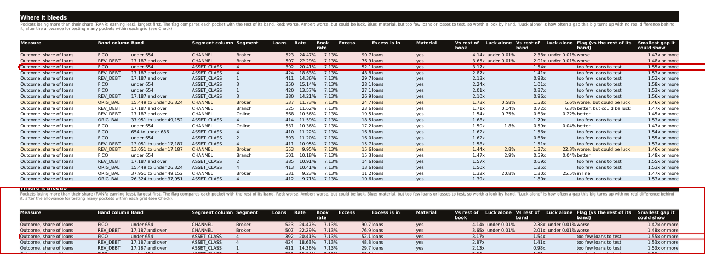

## Step 22: Press Set up again

Press **1. Set up from this extract** again.

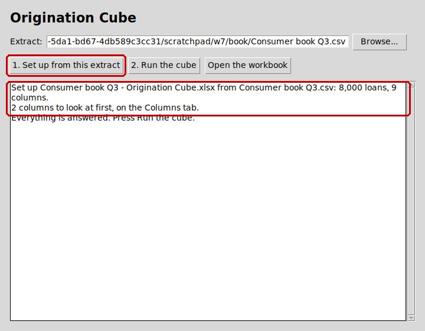

**Right:** "Everything is answered. Press Run the cube." Control, Columns and Odd values answers are kept, and so are the last results. **Last Run used** is kept too (ringed):

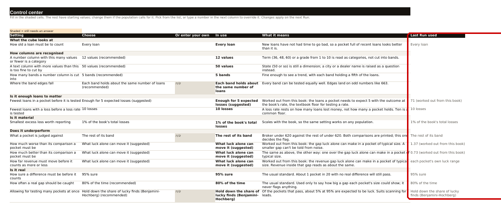

## Step 23: Prune something learned

On **Learned**, set a row's **Keep?** (column A) to **Forget**. Save, close and Run.

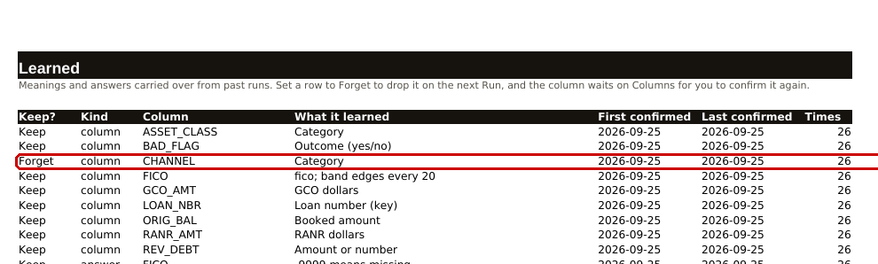

**Right:** the window says "Forgot CHANNEL, as marked on Learned. Check it on Columns and set C3 to Yes before the next Run."

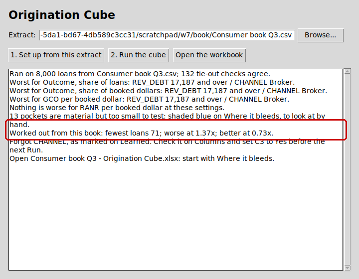

The next Run refuses until you do:

## Step 24: The next extract

Browse to the next quarter's extract and press **Set up**.

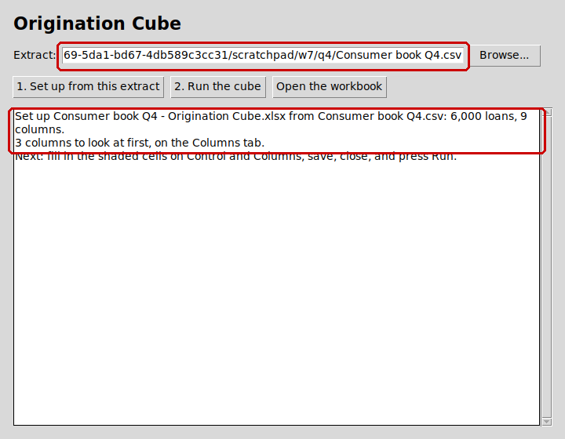

**Right:** "3 columns to look at first". Meanings are remembered, and so are band edges from the last Run. FICO comes in as `every 20`, shaded, with "Band edges remembered from before: every 20." under **Look first**. It is one of the three:

Control starts blank again. The judgment calls are asked every time.

## Step 25: What the memory holds

The memory is one file. Every Run writes each band column's edges into it, and a blank cell clears them, so the next new workbook gets whatever the last Run of *any* workbook had. Edges typed on a category (CHANNEL) are no longer remembered, but they are still accepted without a word and ignored.

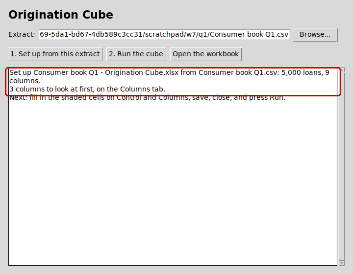

**Clear anything under Look first you didn't type.**

---

## When something goes wrong

| What you did | What the window says | What to do |
|---|---|---|
| **A.** Split set on two columns | "Columns!H13 and Columns!H14: only one column can split the pockets. Clear all but one." | Clear one. |
| **B.** Split the only category that's cut | "Nothing is left to cut across ... CHANNEL (Columns!H8: it splits the pockets ...); ASSET_CLASS (Columns!D13, Cut by it? No)." | Clear the split, or set ASSET_CLASS back to Yes. |
| **C.** *average* on a category | "Columns!G8: "CHANNEL" isn't a number column, so it has no average to show." | Clear the cell. |
| **D.** Edges `620,680,740` turned into one number by Excel | "... read as the single number 620,680,740. Excel dropped the commas. Type them with semicolons" | Retype with semicolons. |
| **D2.** An edge outside the column (`620; 680; 950`) | "FICO runs from 496 to 921, so an edge at 950 would leave a band empty." | Type edges inside that range. |
| **E.** Workbook still open in Excel | "... is open in Excel. Close it, then press Run again." Set up says the same. | Close Excel and press again. |
| **F.** A column renamed after Set up | "Couldn't run: the extract has no column "CHANNEL" (a segment) ... press Set up again." Set up then says "New columns since the last check: CHNL." | Press Set up, check the new name, set C3 to Yes. |
| **G.** Fewer rows after Set up | "Consumer book Q3.csv has changed since Set up ...", then it runs on 6,000. | Check the loan count. |
| **H.** Workbook copied to a folder with a different extract of the same name | The same "has changed" line; it runs the new folder's 3,000 loans. | Press Set up in the new folder first. |
| **I.** Split set on GCO, the key or the outcome | "Columns!H11: "GCO_AMT" is marked GCO dollars, which can't split the pockets. ..." | Split by something known at booking. |
| **I2.** Split by the booked amount | Runs, 571 tie-outs. | Allowed. |
| **J.** A dollar amount typed as materiality (100000) | Runs. | Check says it's GCO dollars only. |
| **K.** The workbook picked as the extract | Set up: "... is the workbook, not the loan file." Run: "Pick the extract beside it." | Browse to the .csv. |
| **L.** 95 typed for "how sure" | "... from 0.5 to 0.999; got 95. For 95%, type 0.95." | Type 0.95. |
| **M.** 95, or 0.95, as your own revenue line | 95: "... for 15%, type 0.15." 0.95: "The most it takes is 0.9." | Type a share up to 0.9. |
| **N.** New columns in a refreshed extract | "New columns since the last check: CURR_STATUS, DTI. Columns!C3 needs a Yes again." | Check them, set C3 to Yes. |
| **O.** Forget on Learned, then Run twice | First Run runs and says what was forgotten; the second refuses on C3. | Check the column, set C3 to Yes. |
| **P.** `every 1` or `every 0.5` on FICO | "Columns!F7: every 1 on "FICO" would make 426 bands (496 to 921). Use a wider band, so there are 50 bands or fewer." | Use a wider width. |
| **Q.** `every 0`, `every -5`, `every twenty` | "Columns!F7: "every 0" should read like every 20: the word every, then how wide each band is." | Type a positive number in figures. |
| **R.** Edges typed on a category (CHANNEL) | Runs, says nothing. The cell is ignored and no longer remembered. | Clear it. |
| **S.** Your own fewest loans bigger than any pocket (3000), with luck suggested | "No pocket had enough loans or losses to test ..." for every measure, and "Nothing in this book to work these out from, so the usual values were used: worse at 1.25x; better at 0.80x." | Use a smaller number. Check still calls 1.25x the luck gap (defect 6). |
| **T.** A small low-default book (5,000 loans, 1.34% bad) with every suggestion | "Worked out from this book: fewest loans 374", then "No pocket had enough loans or losses" for every measure (the largest pocket is 363), "130 pockets are material but too small to test", and the usual values for worse and better. | Read it as *nothing was tested*. Type your own fewest loans, or accept that this book is too small to test pocket by pocket. |
| **U.** Your own fewest loans, 450 | Runs; "58 pockets are material but too small to test". | 58 rows, 23 pockets. Read the blue rows by hand. |

**A: two splits**

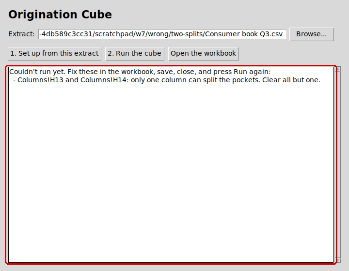

**B: the only segment split**

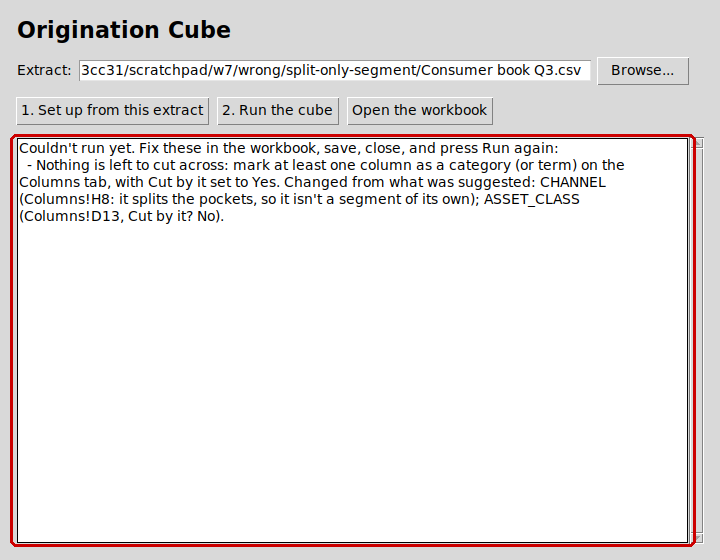

**C: average on a category**

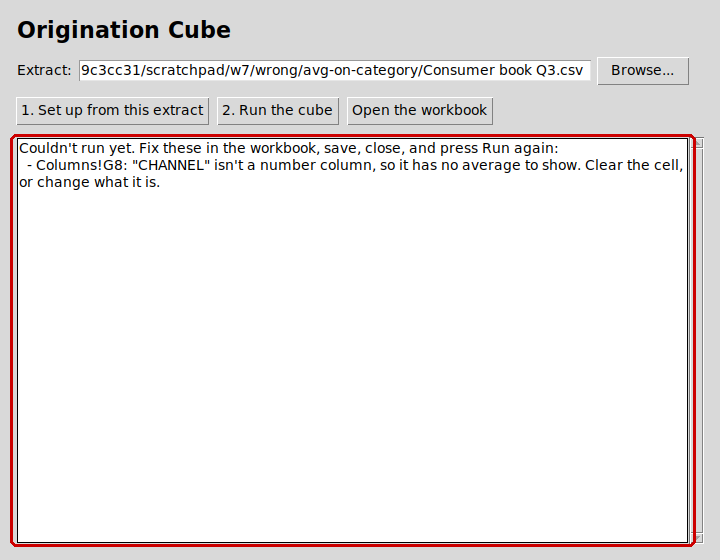

**D and D2: edges**

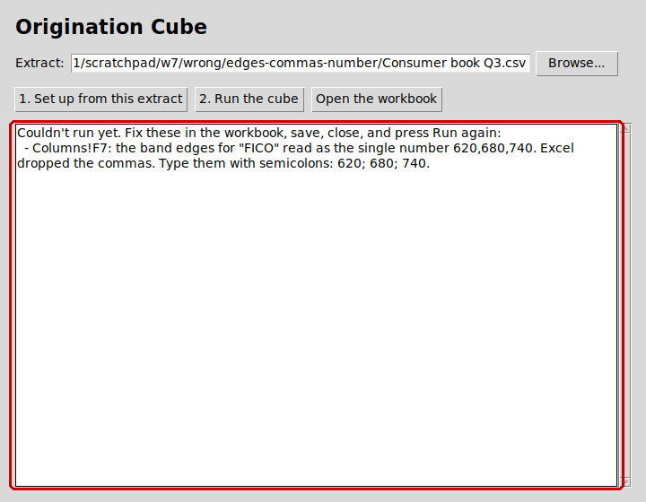

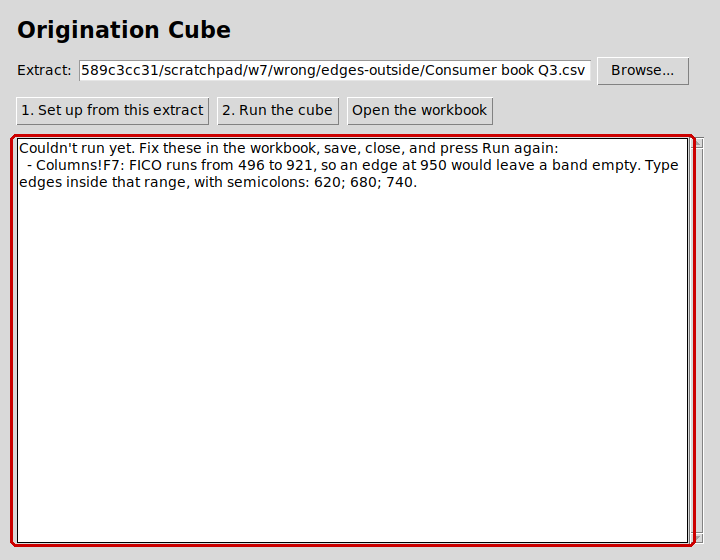

**E: workbook open.** Simulated by locking the file (`chattr +i`), since Excel isn't available here.

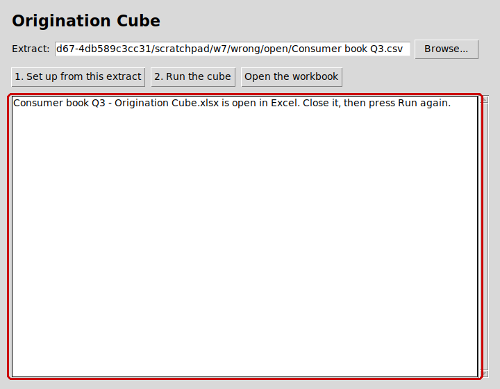

**F: a column renamed, then Set up**

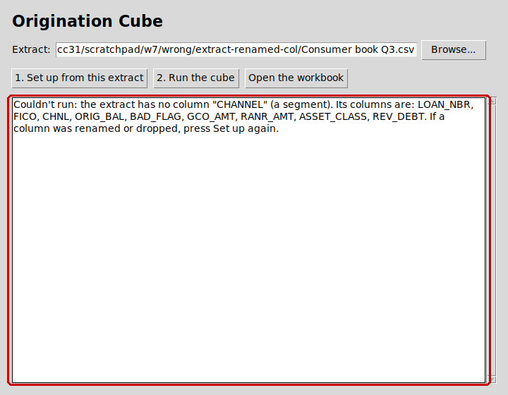

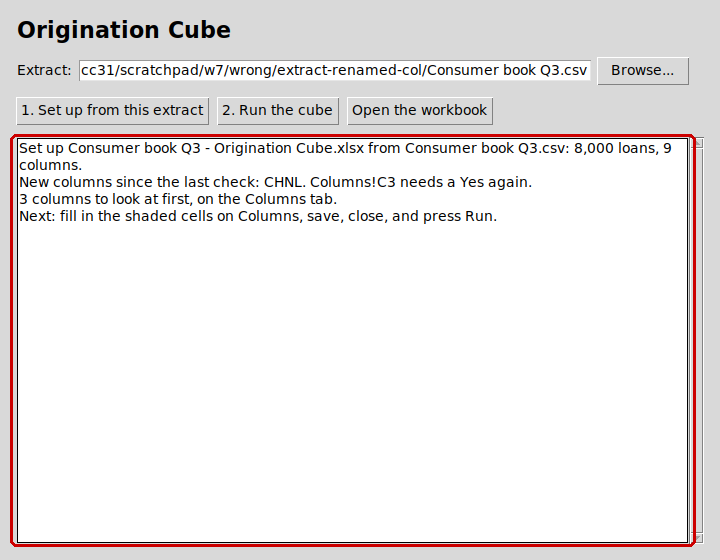

**G: fewer rows**

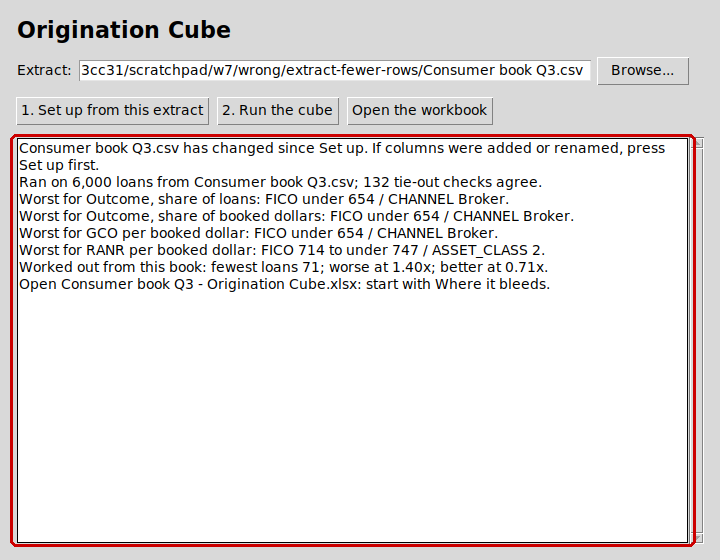

**H: the workbook copied to another folder**

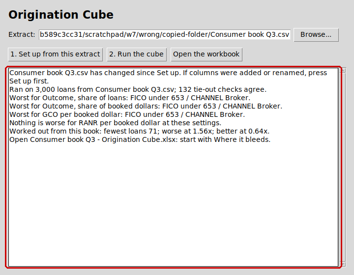

**I and I2: splits**

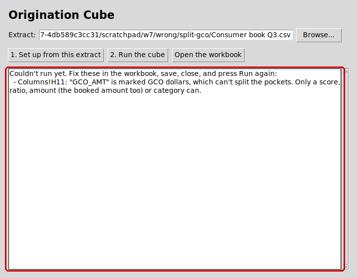

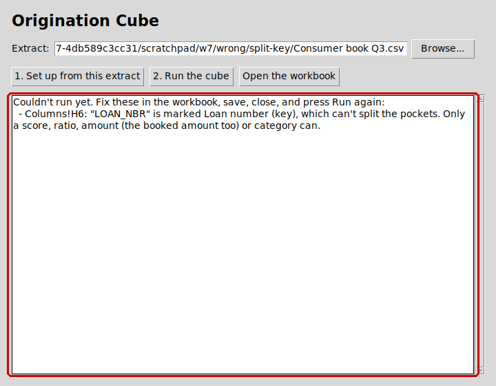

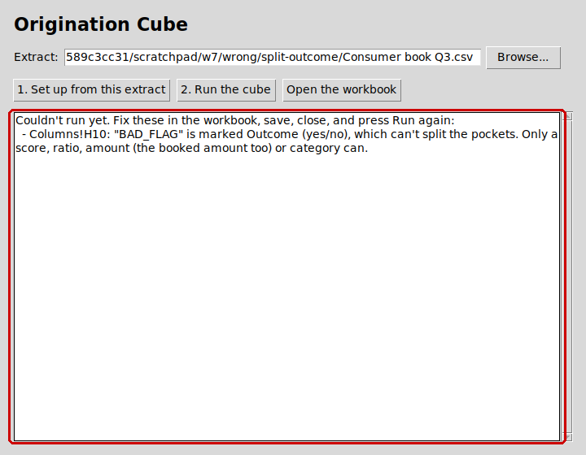

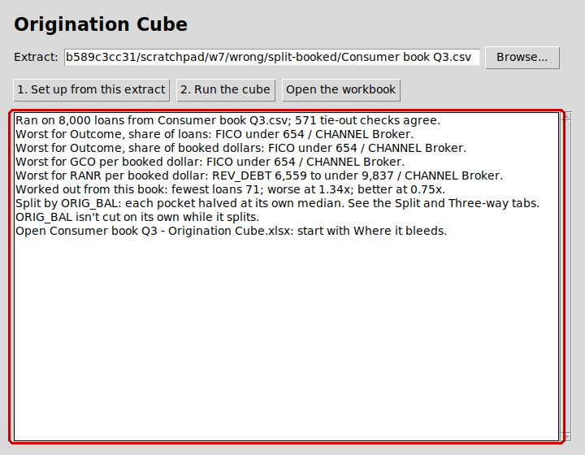

**J: your own dollar materiality**

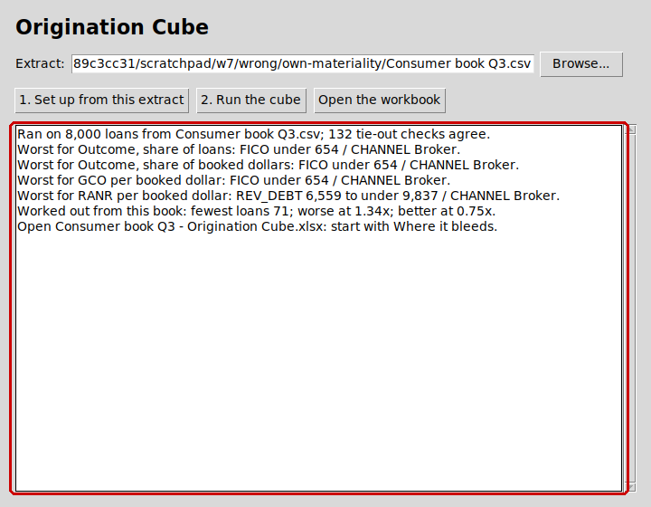

**K: the workbook picked, then Run**

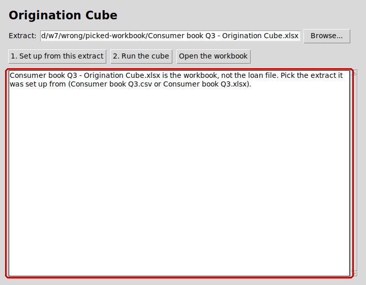

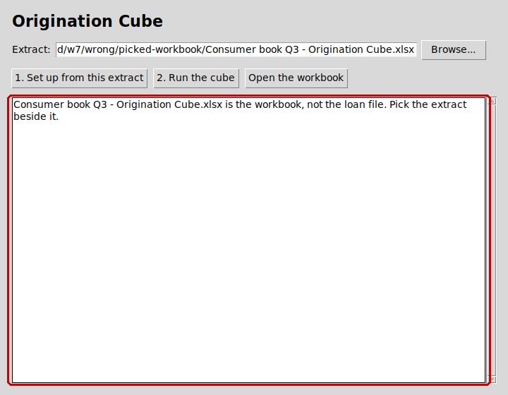

**L: 95 for "how sure"**

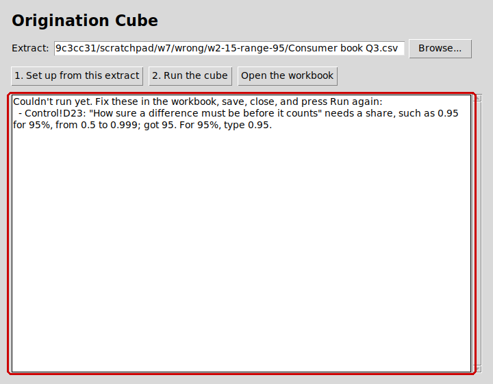

**N: new columns**

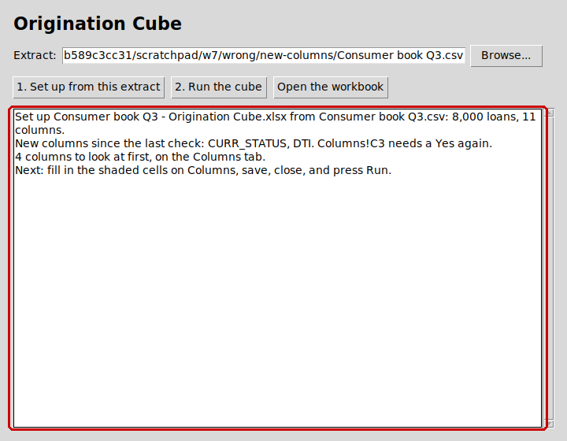

**P: every 1, every 0.5**

**Q: every 0, every -5, every twenty**

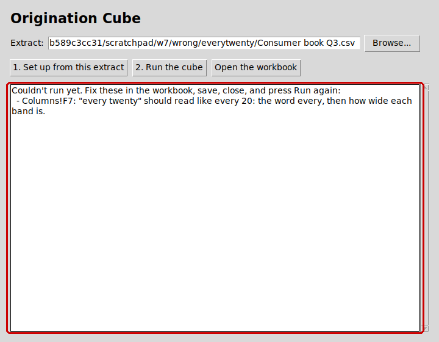

**R: edges on a category**

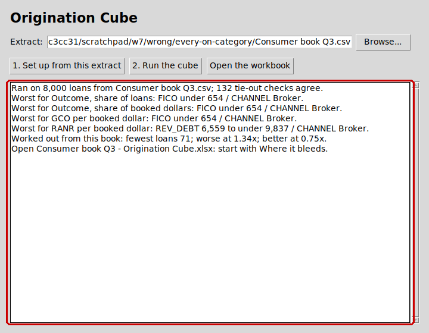

**S: a fewest-loans number bigger than any pocket**

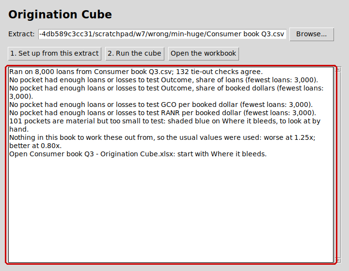

**T: a small low-default book**

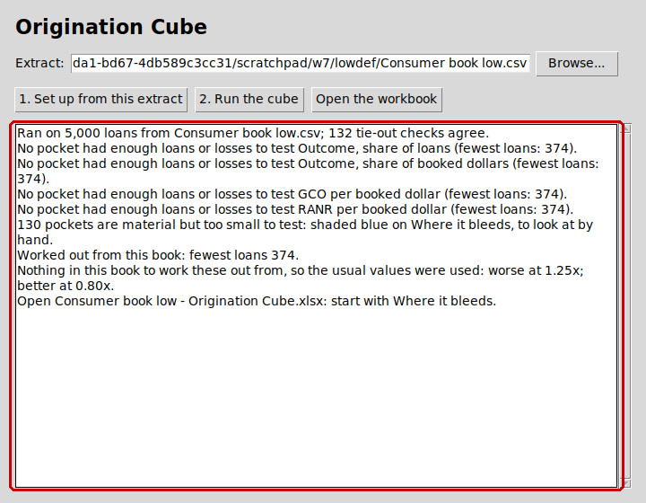

**U: a high floor**

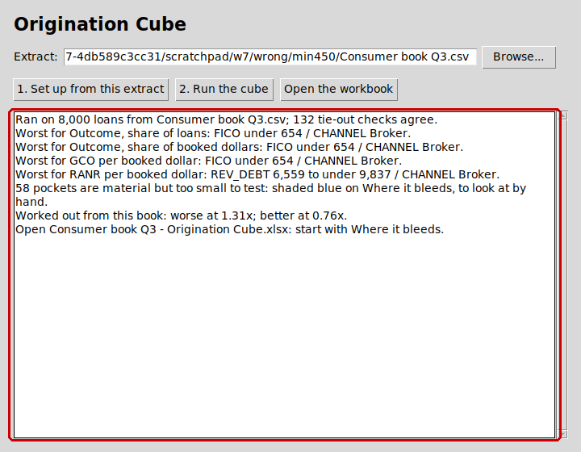

---

## How this was walked

On a Linux test machine:
- **The window:** `Origination Cube.pyw`'s window on a virtual display under Python 3.12, its buttons pressed by `driver/drive.py` (through `driver/win.sh`), each state photographed. The file dialog opens behind the window on the virtual display, so it isn't pictured.
- **Excel's part:** done cell by cell with openpyxl (`driver/edit.py`), standing in for picking from the dropdowns and typing.
- **The workbook:** each state printed through LibreOffice (`driver/render.sh`) and photographed page by page. `driver/shots.py` crops and rings every picture.
- **Wrong turns and revenue options:** each in a folder of its own, from a copy of the answered workbook (`driver/wrong.sh`, and `driver/wrong2.sh` for the ones that change the extract or the file). They share one scratch memory file with the main route.
- **The build:** frozen at commit `a5a8aa2` with `git archive`.
- **Reading tabs back:** `driver/revcheck.py` (step 13's table: count lines against rows, shading of marked boxes, RANR reading against the box), `driver/bluecheck.py` (blue rows against the window's count), `driver/threeway.py`, `driver/luckline.py` (what the suggested numbers are made of), `driver/noplant.py` (the split on a book with no debt effect), `driver/lowdefault.py` (wrong turn T's book).
- **The next extracts:** `synth.make_rows` with seeds 11 (Q4, 6,000 loans) and 23 (Q1, 5,000 loans).

The order walked: steps 1 to 17, the revenue options on the default bands, `620; 680; 740` and `every 20` (each in its own folder), the high floor and the fallback wrong turns, 18 to 22 on the same workbook, 23, 24, 25, then the other wrong turns.
