# Origination analysis: finding where a book loses more than its share

**Who this is for:** the analyst preparing an origination analysis for a bank's line of business (LOB).
**What you finish with:** a ranked list of the pockets of the book that lose more than their share, in dollars, with a test on each one.
**Walked:** 25 September 2026, on commit `360a71e`, on a synthetic book of 2,000 loans. No real bank data was used.

> The cube file format (steps 7 and 8) was being reworked on the day of this walk. If your `cube.yaml` has a `columns:` block with `means:` lines instead of `key:`, `booked:`, `outcome:` lines, this part of the procedure is out of date. Walk it again and replace steps 7 and 8.

<!-- ROUTE -->

## Before you start

- A terminal open in the `origination-cube` folder, with the tool installed (`pip install -e .`). After that, the command is `cube`.
- Excel, to fill in the Control tab.
- The loan extract as a CSV. It needs a loan number, the booked amount, a yes/no outcome, GCO dollars and RANR dollars. The run stops without any of them.

Every command below is typed exactly as shown. Where it says `demo/loans.csv`, use your extract's path.

---

## Step 1: Get the extract

For practice, make the synthetic book:

```
cube synth --out demo --rows 2000
```

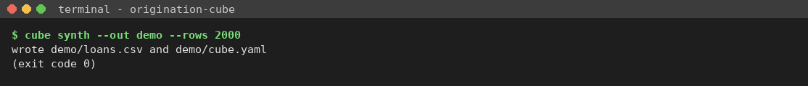

**Right:** it says `wrote demo/loans.csv and demo/cube.yaml`. The synthetic book hides one bad pocket: scores under 620 that came through the Broker channel. You should find it at the end.

**Use `demo/loans.csv`, not `demo/cube.yaml`.** The cube file the demo writes already has the judgment calls filled in for you. Make your own in steps 2 to 8.

## Step 2: Write the Control tab

```
cube control --out control.xlsx
```

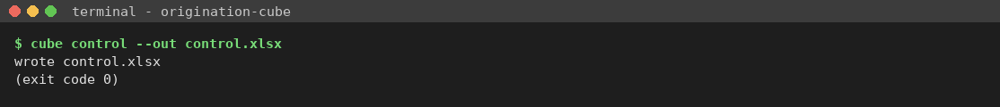

**Right:** `wrote control.xlsx`.

## Step 3: Open the Control tab in Excel

Open `control.xlsx`. The shaded cells (ringed in red) are the ones still waiting for an answer. There are eight on a new tab.

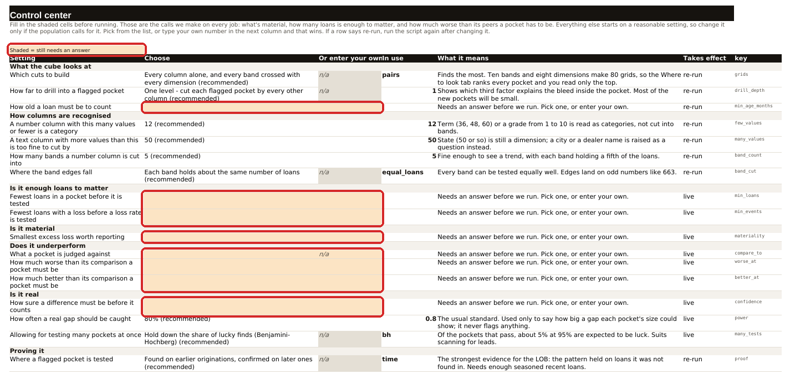

Close up, the shaded rows ask what's enough loans, what's material, and how much worse counts as worse:

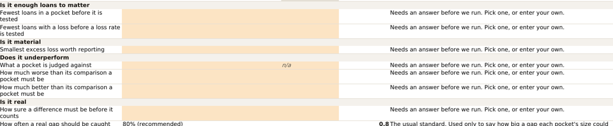

**Right:** the shaded cells cover the Choose and Or enter your own columns. Grey cells marked *n/a* are rows where you can only pick from the list. They are not waiting for you.

## Step 4: Fill in the shaded cells

For each shaded row, click the Choose cell and pick from the list. To use a number that isn't on the list, leave Choose alone and **type the number in the next column, Or enter your own**. Your number wins.

On this walk:

| Row | Setting | Answer |
|---|---|---|
| 8 | How old a loan must be to count | Every loan (picked) |
| 15 | Fewest loans in a pocket before it is tested | 30 (picked) |
| 16 | Fewest loans with a loss before a loss rate is tested | 10 (picked) |
| 18 | Smallest excess loss worth reporting | 1% of the book's total losses (picked) |
| 20 | What a pocket is judged against | The rest of its band (picked) |
| 21 | How much worse than its comparison a pocket must be | **1.4** typed in *Or enter your own* |
| 22 | How much better than its comparison a pocket must be | 0.8 times (picked) |
| 24 | How sure a difference must be before it counts | 95% (picked) |

Save and close the workbook.

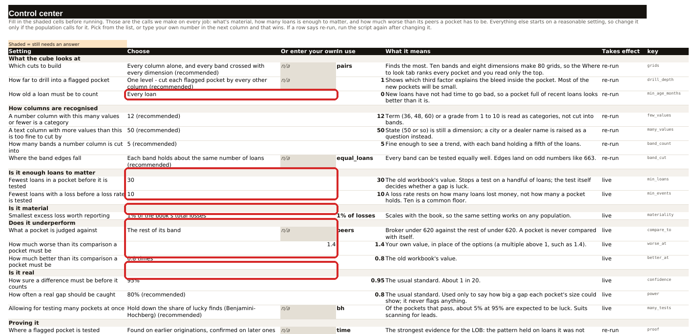

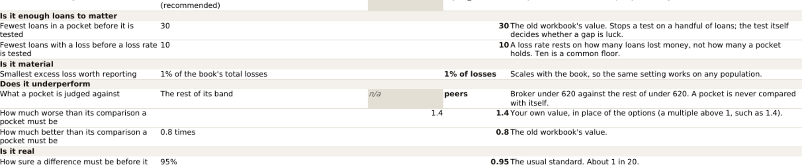

**Right:** no shading left in the setting rows. *In use* shows the value that will be used (1.4 for row 21, your own number). *What it means* explains the choice.

**Watch for:**

- **Don't type your own number into the Choose cell.** Excel lets you, and *In use* then shows `#N/A`. Delete it and type it one cell to the right. (See "When the tool refuses" below.)
- **Type shares as shares.** Confidence is 0.95, not 95. A multiple is 1.4, not 1.4x. The tab doesn't warn you. Step 9 does.
- **Not all your answers are used yet.** On this build, loan age, fewest loans with a loss, materiality, what a pocket is judged against and the many-tests allowance are asked for but not applied. The run shows every comparison and a materiality table, and the call is yours when you read it (step 11).

## Step 5: Check your answers read back

```
cube control --read control.xlsx
```

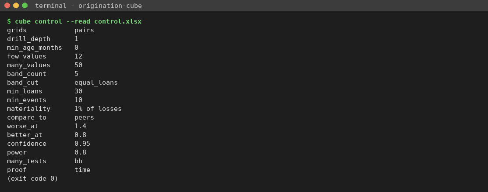

**Right:** one line per setting, no `REFUSED`. The names are the tool's short names: `worse_at 1.4` is row 21, `confidence 0.95` is row 24, `compare_to peers` is "the rest of its band".

If a shaded cell was missed, it says so and names the cell:

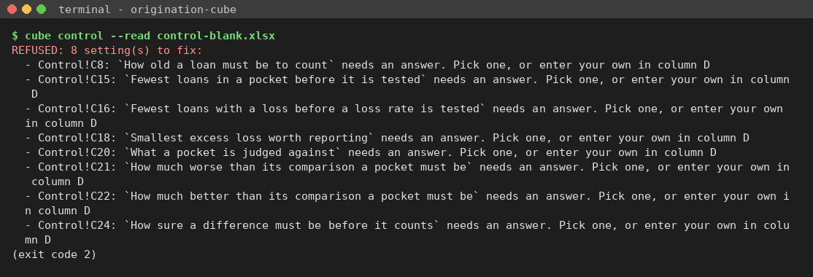

## Step 6: Write the cube file

```
cube init demo/loans.csv -o cube.yaml --control control.xlsx
```

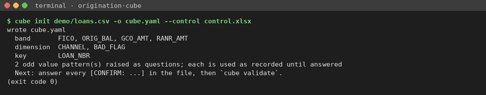

**Right:** `wrote cube.yaml`, then how each column was sorted (band, dimension, key) and how many odd values were raised as questions.

The last line says to answer every `[CONFIRM: ...]`. With a filled Control tab there usually aren't any. **What does stop the run is `columns_confirmed: no`.** Go to step 7.

## Step 7: Read the cube file

Open `cube.yaml` in any text editor. The highlighted lines are the ones you act on:

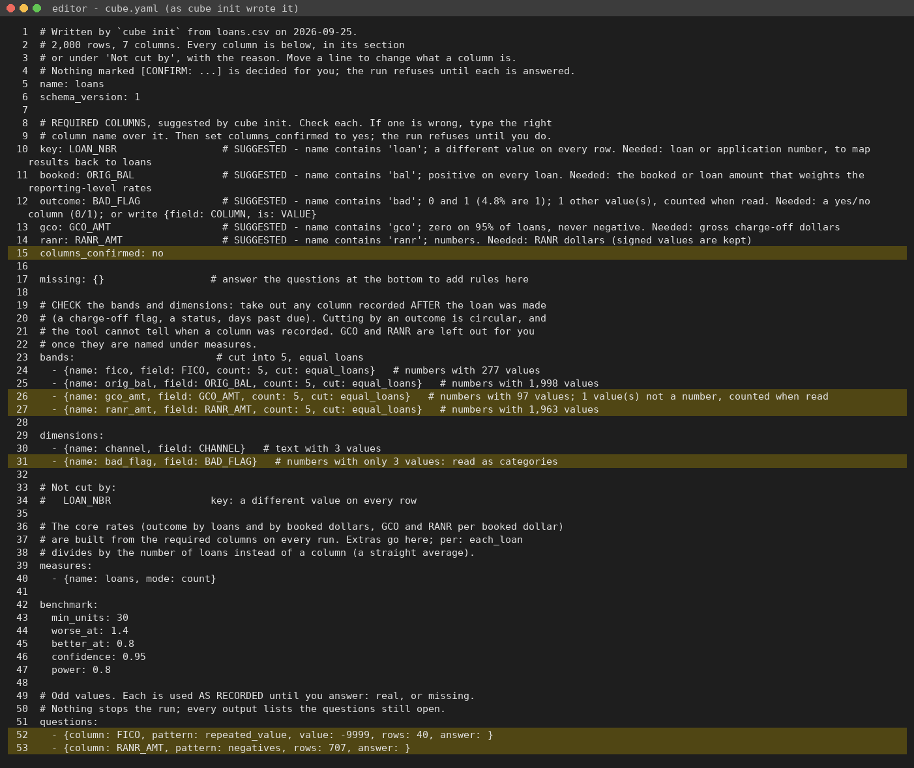

Check, in order:

1. **Lines 10 to 14, the five required columns.** Each shows a suggestion and its reason. Is `key` the loan number? Is `booked` the loan amount? Is `outcome` the charge-off or bad flag? Are `gco` and `ranr` the dollar columns? If one is wrong, type the right column name over it.
2. **Line 12, the outcome.** Read the reason. Here it says `0 and 1 (4.8% are 1); 1 other value(s)`. One loan has a value that isn't 0 or 1. The run leaves it out and counts it (step 10). Ask the bank what it means.
3. **Lines 23 to 31, bands and dimensions.** Take out any column recorded **after** the loan was made: a charge-off flag, a status, days past due. Cutting the book by its own outcome proves nothing. Here that is `bad_flag` on line 31. `gco_amt` and `ranr_amt` (lines 26 and 27) are dropped by the run itself, with a warning. You can leave them.
4. **Lines 52 and 53, odd values.** `-9999` in FICO on 40 loans is the bureau's "no score" code: answer `missing`. Negative RANR on 707 loans is real: answer `real`.

## Step 8: Make the edits

- Line 15: `columns_confirmed: no` → `columns_confirmed: yes`
- Delete line 31 (`bad_flag`)
- Line 52: `answer: }` → `answer: missing}`
- Line 53: `answer: }` → `answer: real}`

Save.

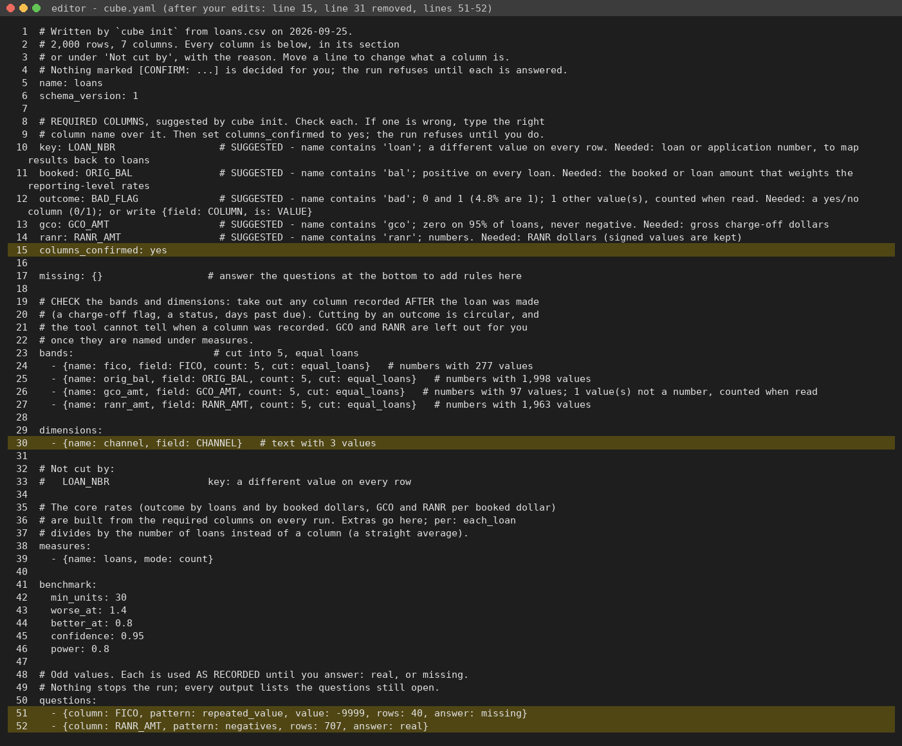

## Step 9: Validate

```
cube validate cube.yaml --data demo/loans.csv
```

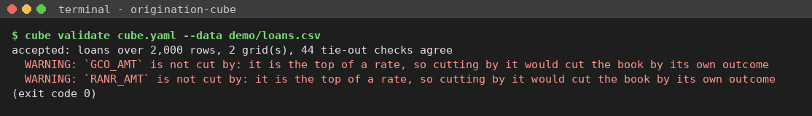

**Right:** `accepted`, the number of grids (2 here: FICO by channel, loan amount by channel), and every tie-out check agrees. The two warnings about GCO_AMT and RANR_AMT are expected (step 7, point 3).

If it says `REFUSED`, it lists each problem. Fix them and run it again. See "When the tool refuses" below.

## Step 10: Run it

```
cube run cube.yaml --data demo/loans.csv
```

The top of the output:

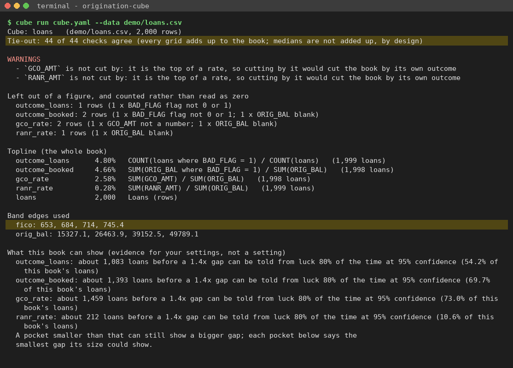

Read, in order:

1. **Tie-out:** every check agrees. If any doesn't, stop. The grids don't add up to the book.
2. **Left out of a figure:** loans missing from a rate, and why. Here it's the one loan with outcome `2`, one `#N/A` in GCO and one blank loan amount. Small, and named.
3. **Topline:** the whole book's rates. These are what every pocket is compared with.
4. **Band edges used:** where the score and amount bands were cut. By default each band holds a fifth of the loans, so the edges land on odd numbers (653, 745.4). Step 12 shows how to use the LOB's own cut points.
5. **What this book can show:** how many loans a pocket needs before a 1.4x gap shows reliably. That is evidence for your settings. It isn't applied.

## Step 11: Read the bleed list

Each grid has a table, then **Where it bleeds**: the pockets with the most excess over the book's rate, largest first.

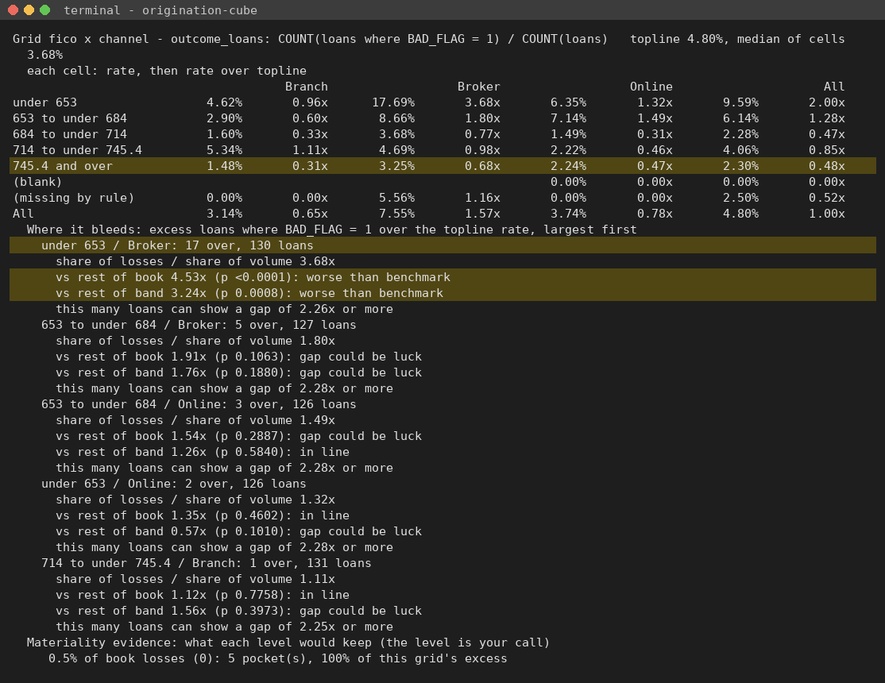

For each pocket:

- **share of losses / share of volume:** how much worse than the book it runs. 3.68x means nearly four times its share.
- **vs rest of book** and **vs rest of band:** the pocket against everything else, and against the rest of its score band. Each has a p-value and a word:
    - *worse than benchmark:* past your 1.4x and unlikely to be luck at 95%
    - *gap could be luck:* past 1.4x (or below 0.8x) but not proven
    - *in line:* inside those limits
    - *too few loans to test:* under your 30
- **this many loans can show a gap of…:** the smallest gap a pocket this size could prove.

**Right on this book:** the top pocket is **under 653 / Broker**. It runs 3.7x the book on bad-loan share, 3.4x on GCO dollars, and is *worse than benchmark* against both the rest of the book and the rest of its band. That is the planted pocket. The within-band line shows it's Broker, not the score band: Branch and Online under 653 aren't worse than their band.

**Materiality** is under each list: what each floor (0.5% to 10% of book losses) would keep. The Control tab asked for a floor, but this build doesn't draw the line. Pick the floor as you read.

**Take care with the RANR grids.** The list ranks the highest RANR per booked dollar as "bleeding". Whether a higher RANR is worse depends on what the bank's RANR column holds. Check that before you quote a RANR pocket.

## Step 12 (when you know the LOB's cut points): use your own band edges

The default five bands put the first score edge at 653, which dilutes a problem that sits below 620. If the LOB already cuts at 620, 680 and 740, change the FICO line in `cube.yaml`:

```
  - {name: fico, field: FICO, edges: [620, 680, 740]}
```

Then run it again:

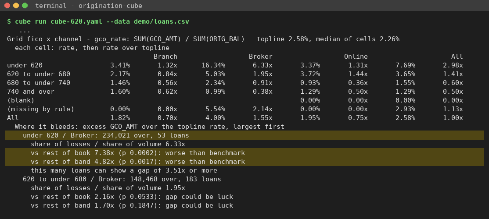

**Right:** **under 620 / Broker** is now at the top at 6.3x the book on GCO dollars, 234,021 over, on 53 loans. That is the planted pocket at its true size.

---

## When the tool refuses

These are the wrong turns tried on this walk and what the tool said. None of them loses work. Fix the cell or line it names and run the step again.

**A. Validating before confirming the columns** (skipping step 8):

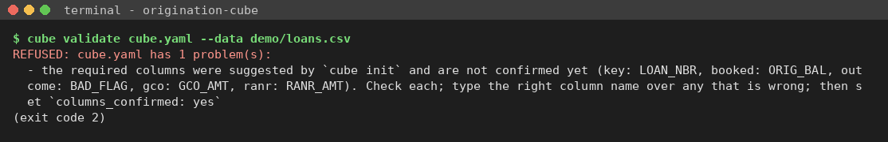

Set `columns_confirmed: yes` after checking lines 10 to 14.

**B. Leaving a shaded cell empty:**

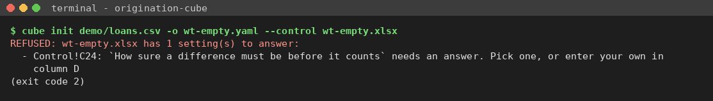

It names the cell (Control!C24). Answer it and save.

**C. Typing text where a number goes** (`1.4x` in row 21):

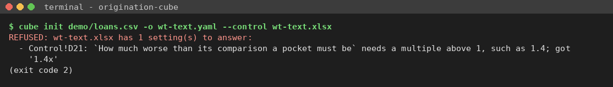

The tab itself shows nothing wrong, so the refusal only comes here:

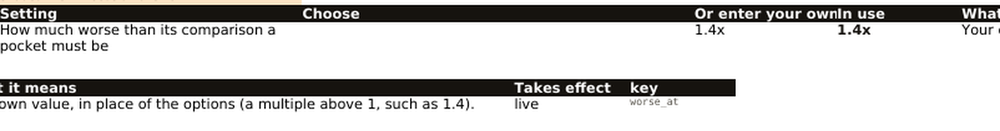

Type `1.4`.

**D. Typing your own number into the Choose cell** (`1.4` in C21):

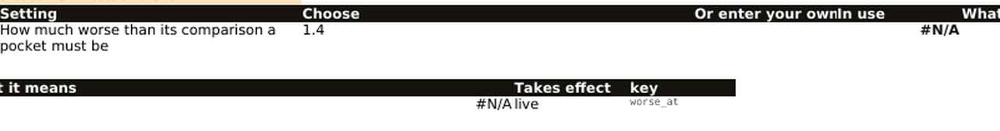

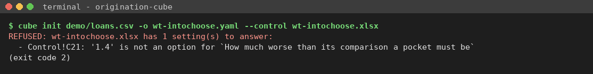

Delete it from Choose and type it in *Or enter your own*.

**E. Typing 95 for 95% confidence** (in D24). Neither the tab, `cube control --read` nor `cube init` catches it:

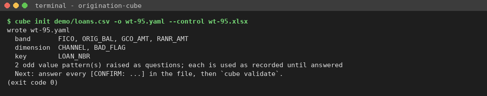

`cube validate` does, but it names the line in `cube.yaml`, not the cell you typed in:

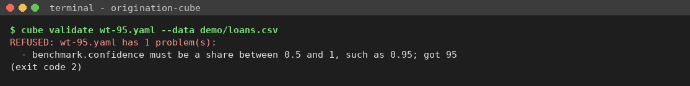

**Fix it on the Control tab (D24 → 0.95) and run step 6 again.** If you fix only `cube.yaml`, the next `cube init` puts 95 back.

**F. Leaving BAD_FLAG in as a dimension:** no harm. The run drops it and warns:

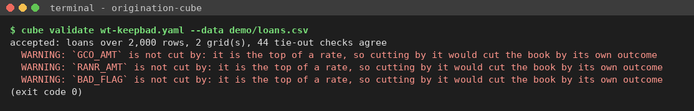
