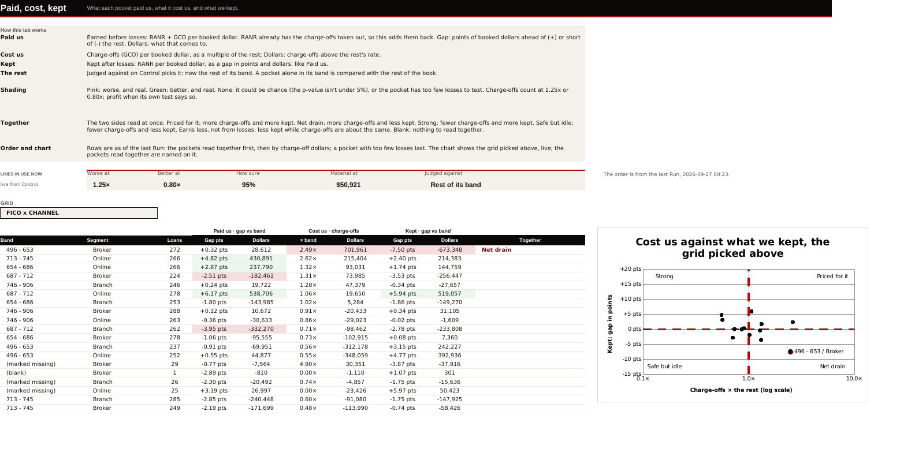
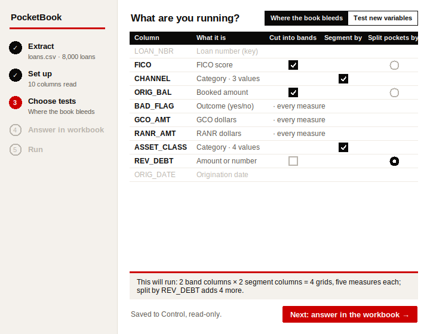
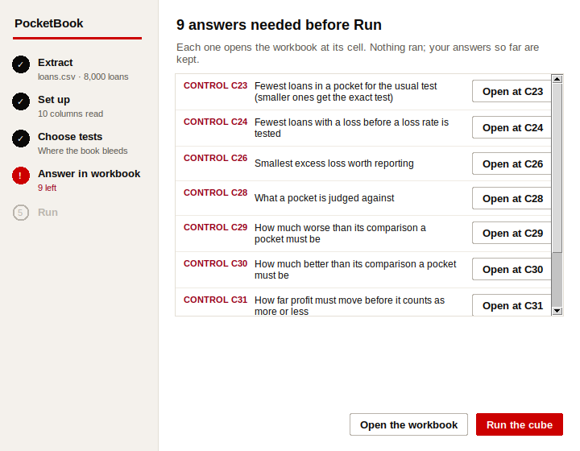

# PocketBook

**Where does the book bleed?** The tool takes a loan extract and a short cube
file. It cuts the loans by bands (a score band, say) against dimensions (the
channel, say), and compares every pocket's rate with the whole book's
(the topline). The pockets that lose more than their share come out at the
top of a list, in dollars.

This replaces a set of Excel macros that did the same job slowly and kept
breaking their own rules. `docs/vba-findings.md` lists each of those breaks and
the test that stops it coming back. The macros were only a source of ideas, so
this is not a port, and the workbook was designed from scratch.

**Where it's going:** `docs/design.md` sets out the three stages (find, drill,
prove) and the firm's rulings.

**Status (26 Sep 2026):**
- **Built:** the first stage, find. That means the engine, the launcher and the
  whole workbook: Set up, Control, Columns and every results tab below. Also the
  confirmatory test of a new column from a committed pre-spec, on development
  loans and on the holdout (capabilities 4b and 4e in
  `docs/capabilities-scope.md`), and scouting (4a, 27 Sep 2026): find on the development loans, write the
  pre-spec, confirm it on the rest, in one Run.
- **Not built:** drill-down and `pocketbook prove`.
- **Not yet met:** a real extract.

The log is `../BACKLOG.md` §6d.

## What an extract must carry

For where the book bleeds: a loan or application number (`key:`), the booked
amount (`booked:`), a yes/no outcome (`outcome:`), GCO dollars (`gco:`) and
RANR dollars (`ranr:`). The run refuses without any of them. For a test of a
new variable, only what the test uses: the loan number, the outcome, the
origination date, the column tested and the pre-spec's strata. Every loan in
the extract is run: none is left out for how old it is or when it went bad, so
choose the period before the extract reaches the cube. From the five it builds
five core rates:
- the outcome as a share of loans (straight)
- the outcome as a share of booked dollars (weighted)
- GCOs per booked dollar: **GCOs ($)** on the tabs
- RANR per booked dollar: **RANR** on the tabs (profit after losses)
- RANR + GCOs per booked dollar: **RANR + GCOs** on the tabs (profit before losses)

The tabs name these three in the firm's own terms (30 Sep 2026: *"let's rename this list of stuff for a couple
things and be more literal - Charge-offs = GCOs ($), kept after losses = RANR, earned before losses = RANR +
GCOs"*); until then they read Charge-offs, Kept after losses and Earned before losses. Only the words changed:
the keys a workbook, a pre-spec and memory hold (`gco_rate`, `ranr_rate`, `contribution_rate`) did not, so a
workbook set up before still runs (`tests/test_literal_names_2026_09_30.py`).

## Using it (no commands)

One-time setup: install Python 3.10 or later from python.org. The cube also
needs three add-ons for Python:
- **numpy**, for the statistics
- **openpyxl**, to read and write Excel files
- **PyYAML**, for its settings files

The window checks for them each time it opens. If any is missing, it says
which and offers **Install now**. If the bank's network blocks the download,
it gives you a note for IT, and **Copy for IT** copies it.

To install them by hand, run this once in a Command Prompt (`py` is the
Python starter that python.org installs). `Install add-ons.bat` in this folder
runs the same thing:

```
py -m pip install --user --upgrade numpy openpyxl PyYAML
```

**Taking it to a new machine** (the bank's): `docs/BANK-MACHINE-CHECKLIST.pdf`, step by step, and
`python tools/bank_kit.py --add-ons` to make what to carry, the add-ons included for a machine pip
can't reach.

After that, the whole routine is:

1. Double-click **`PocketBook.pyw`**. The **PocketBook** window opens
   (the redesign of 26 Sep 2026, `docs/redesign-2026-09-26/`): five steps down
   the left, one job on the right.
2. **Extract.** Pick the loan file from the bank (.csv or .xlsx). The box under
   it holds the two limits Set up reads the columns with (a number column with
   12 values or fewer is a category; a text column with more than 50 is too
   fine to cut by). They sit here because they are needed before the workbook
   exists. Press **Set up from this extract**: it reads what each column is and
   writes nothing.
3. **Choose tests.** First, what you're running:
   - *Where the book bleeds:* tick the number columns to **cut into bands**,
     the categories to **segment by**, and at most one column to
     **split every pocket by**: a number column halves each pocket at its own
     median; a category of 6 values or fewer splits it by each value (a
     category with more is refused). A column that splits isn't also cut or a
     segment. Separately, at most one column to **filter by**: a category of 6
     values or fewer, whose values Grids' *Only loans where* offers, whatever the
     split is doing (a category may segment and filter at once), and a
     second, **Filter 2** (the firm, 30 Sep 2026: two filters, *"independently
     and in conjunction with each other"*): another such column, offered beside
     the first, each alone or both at once (ORIG_YEAR = 2023 and SYS_FLAG = Y).
     One column picked twice is refused, and so is a pair making more than 49
     views of every grid (All loans and each value, counted on both). When a column
     is marked *Origination date*, a row **ORIG_YEAR** sits with the categories:
     the year each loan was made, read from that column, which can split, filter
     or both; a loan with no readable date is in *(no date)*, a value of its own
     that isn't counted against the 6. Every number column and every category starts
     ticked. The outcome and dollar columns come after them, with no boxes:
     they go into every measure. It needs
     the five columns below and no date.
   - *Test new variables:* pick the outcome, tick the inputs to **test**, and
     the columns to **hold fixed** (a column is one or the other). Or confirm a
     saved shortlist: **Browse** to the committed pre-spec file, which then
     decides the inputs and what is held fixed (below). It needs the loan
     number, the outcome and a column marked *Origination date*; the booked
     amount, GCO and RANR only if the extract has them.

   The box underneath says what will run, with a plain line under it for each
   word the window uses first (GCO dollars, a grid, scouting). **Next: answer in the workbook**
   writes the workbook beside the extract as *loans - PocketBook.xlsx*.
   Control shows these choices read-only, under *Chosen in the launcher*; to
   change one, go back to Choose tests (press it on the left) and Next again.
   Answers already given are kept.
4. **Answer in workbook.** The four red tabs are the ones you fill in. Each
   opens with a title band and one note, *How this tab works*, that folds away
   with the outline's minus. **Start here** counts what is left, live: answers
   needed before Run (the same count the launcher and the Run's refusal give),
   odd values to answer, and changes waiting for a Run, on Control or in the
   launcher (with a pink line naming each one); after a Run it shows what the
   Run found and the five largest pockets that are worse and material now,
   picked live from Control's lines.
   - **Control:** three blocks. *Changes now* (solid boxes) holds the lines the
     result tabs read by formula: worse at, better at, the profit line, how
     sure, materiality and what a pocket is judged against; *Comes to* shows
     what an answer amounts to (worse at and better at as a multiple, from Set
     up on; materiality in dollars, from the first Run). *Needs a Run* (dashed
     boxes) holds the answers that decide which pockets exist; its *Status*
     says "Waiting for a Run" where an answer differs from the last Run's.
     *Chosen in the launcher* is read-only, with a Status of its own: Next
     changing one waits for a Run too. Pink cells still need an answer,
     and nothing is picked for you. Beside fewest loans, worse at and better
     at, the value worked out from this extract ("suggested: 69, from this
     extract"). On the right, what each materiality level keeps, live. A test
     of a new variable isn't asked the profit line.
     One question more, *Treat values ≤ -99,000,000 as missing in every
     column?* (the firm, 30 Sep 2026: *"I can guarantee you that they are the
     bureau missing codes"*). Yes makes every value at or below -99,000,000
     missing in every column, bands and categories alike, with no Treat as
     needed; a column answered Real on Columns keeps its values. The Run's
     lines say how many loans it made missing in each column. No, or blank,
     changes nothing.
   - **Columns:** one row per column: what it is, why it was suggested, its
     odd values with *Treat as* (Real or Missing) beside them, band edges, and
     whether it is remembered, with *Forget?*. Odd values are looked for in
     every column of numbers, a category's too, and name the values and their
     loans as written: *-99,000,900 on 460 loans*, never *-9.90009e+07*. A
     category answered Missing puts those loans in *(marked missing)*, as a
     band does. A value missing, by either route, is in no band edge, rate,
     percentile or Look chart. Set "Checked every column" (C3)
     to Yes; Run waits until it is. Under the table, *Add a column: one
     divided by another*. For a new variable, mark the date each loan was made
     *Origination date*: it splits development loans from the holdout.
     Band edges left blank are cut at the Run, each band holding about the
     same number of loans. On a dollar column (edges of 100 or more) whose
     values carry cents, every edge PocketBook cuts is a whole number, raised
     to the next dollar (the firm, 30 Sep 2026: *"Cut at whole dollars is
     fine"*), and a band's label reads its loans in whole dollars with the
     cents dropped: $37,950.99 reads 37,950 and sits in *26,324 - 37,950*.
     So every loan's whole dollars lie inside its own band's label and no
     other. Edges you type are kept exactly as typed; a whole-number column
     such as FICO, and a ratio, are cut as before. Scouting's suggested bins
     follow the same rule, and Record's *Band edges used* shows the edges cut.
     A number column with few values, most of them the same (Major
     Derogatories: 0 to 8, most loans at 0), can't be cut into equal bands:
     every cut lands on the zeros. Rather than refuse the Run (the firm, 30
     Sep 2026: *"So it refuses to run some stuff because it cannot band"*),
     a column with Control's *few values* (12) or fewer gets **one band per
     value**, named by the value (*0*, *1*, ... *8*), and the Run's lines and
     Record say *"Major Derogatories: too few values to cut into equal bands,
     so each value is its own band."* Its *Why we think so* adds *Few values
     (0 to 8): Category may read better.*, a suggestion only: what it is stays
     as you answered. A column with more values that still collapses is cut
     as far as it can be (*asked for 5 bands, got 2*); one with a single value
     is refused, naming the two fixes (set *What it is* to Category, or type
     Band edges like 1; 2; 5). Band edges you type always win.
   - **Look:** each column that can be cut into bands (not GCO, RANR or the
     outcome): its loans, blanks, likely code (on a red bar
     of its own), smallest, median, mean and largest, and its bars. Pick 10,
     20 or 50 bars and a From and To, and the chart regroups live; the edges
     typed on Columns show as red dashed lines as you type them. The 10th,
     25th, 50th, 75th and 90th percentiles are listed under the block and
     drawn as thin grey lines labelled P10 to P90 (worked out as Excel's
     PERCENTILE.INC, over the same values as the median; a percentile
     outside From and To isn't drawn). The labels under the bars are short:
     24k, 1.2M, and a score or a ratio as it is (620, 0.35). With a split,
     a scatter of it against each band column.
5. **Run.** Save, close the workbook, and press **Run**. If anything
   still needs an answer, the window lists each one by its tab and cell, with
   the question in words and **Open at C23**, which opens the workbook at that
   cell. While the workbook is open in Excel it says so, and Run waits. The
   extract is checked too: open in Excel, or not yet brought down by OneDrive,
   Run (and Set up) stop and say so by name, with what to do. Anything that
   stops a Run for another reason is said on the page, under *Run stopped*;
   something PocketBook didn't expect shows its error's name and message there,
   with **Copy details** to put the full details on the clipboard to send (a
   copy is kept in `.pocketbook/last-error.txt`). The window stays open: fix
   the cause and press Run again. When
   the Run finishes, it shows how many pockets are worse and material on
   GCOs, what they lost above their share, the Run's first two lines
   (where to start reading, and a changed pre-spec when there is one), and any
   odd value still unanswered. The results land in the workbook:
   - **New variables:** only when testing from a pre-spec (below).
   Every result tab opens the same way: a title band, one *How this tab works*
   note that folds away (tenet T1: how a figure was worked out is said once,
   never beside every row), the lines in use now as tiles read from Control,
   then dropdowns, then result rows. The dropdowns stand in for the redesign's
   slicers (a spreadsheet written by Python can't keep a slicer); each picks
   what the tab shows by formula (design decision OC-43).
   - **Pockets:** every pocket losing more than its share. Pick the **Measure**
     (Bad loans, Bad dollars, GCOs ($), RANR, RANR + GCOs), the **Pockets** (two-way, or split by the split column) and
     **Show** (all, worse and material, worse or not sure); the caption counts
     "N worse and material · N worse · N shown". Each row: the pocket, its
     loans, its rate and the rest's, the gap, the excess, **Worse?** (Yes, Not
     sure, No, Too few losses) and **Material?** (Yes, No) in separate columns,
     the p-value, and the smallest gap a pocket its size could have caught.
     Control's *Judged against* picks the rest: every other loan in its band,
     or every other loan in the book, for the gap and the dollars alike
     (OC-44). The worse pockets come first, largest dollars first; the order
     is the last Run's, the verdicts and dollars are live. On the split view,
     pockets from grids that don't hold the split's partner fixed come last, in
     grey, reading "No: may be mostly FICO".
   - **RANR vs GCOs** (*Paid, cost, kept* until 30 Sep 2026: the firm, *"I want to
     use the terms I gave you out of the box so it can be understood by
     insiders"*; a Run takes the old tab off a workbook written before): one grid
     at a time (a Grid dropdown). Each pocket's **RANR + GCOs**, **GCOs** and
     **RANR** (the column groups were Paid us, Cost us and Kept), each as its gap
     and dollars; pink where worse and
     real, green where better and real. **Together** reads the pair: priced for
     it, net drain, strong, safe but idle, earns less, not from losses, or
     losing more, profit holding. A
     scatter of the grid picked: GCOs across on a log scale, RANR up, lines at
     1× and 0, the pockets read together named.
     **Gross · this pocket alone** (the firm, 30 Sep 2026: *"I would like to
     work on gross GCO gross booked and gross RANR as well so we can also see
     if pockets are straight negative on returns"*), right after Loans: each
     pocket's own **Booked**, **GCOs** and **RANR** dollars and its **RANR ÷
     Booked**, compared with nothing. A pocket whose RANR is
     below zero lost money outright, before comparing it with anyone: its RANR
     and RANR ÷ Booked are red, and the line beside the Grid dropdown counts them
     ("6 pockets lost money outright, totalling $166,260"). Under the table,
     **Pockets listed**, **Not listed** (pockets with nothing to compare them
     with, only when there are any) and **Whole book**, which the first two
     add up to. Booked is the booked dollars under RANR (a loan with no
     readable RANR is left out of both), so RANR ÷ Booked is RANR's own rate. Every
     figure is worked out in the Run; the dollars show in thousands only when
     the whole book's booked would not fit the column, as on Grids.
   - **Grids:** a Grid and a Measure dropdown, and four blocks: the rate,
     headed with what it divides by what and following the Measure (the firm,
     30 Sep 2026, asking for *"the COs/booked"* under charge-offs: the Rate
     block already was it, so its heading now says so): **Rate · GCOs ÷
     Booked**, **Rate · RANR ÷ Booked**, **Rate · (RANR + GCOs) ÷ Booked**,
     **Rate · Bad loans ÷ Loans**, **Rate · Bad dollars ÷ Booked**, **Rate ·
     Average booked per loan**; against the book, against the rest of its band (heat in the redesign's
     tokens, 2× and over deepest) and the loans (shaded by share, no red or
     green). Under them, how many loans and booked dollars fall in each group
     of the split column or a new column, pocket by pocket: a count, not a test
     (it was the Prevalence tab). The split grids are in the Grid list too.
     A **Row** and a **Column** dropdown beside them (their lists follow the
     Grid) pick one pocket, and **What one cell says**, under the blocks, reads
     it out in words from the same cells the blocks show (the synthetic book,
     Bad loans): "Of these 237 loans, 10.59% went bad", "1.38× the bad-loan
     rate of the whole book", "0.59× ... of the other loans in 496 - 653 (the
     Broker, Online loans)", "237 loans; 496 - 653 has 761 in all", and what
     its colour means. A blank says why: alone in its band, or fewer losses than the
     minimum. The sentences are fixed by measure (`results.SAY`); only the names
     and numbers change.
     A pocket with fewer loans than **Fewest loans in a pocket** on Control (the
     number the Run used, its suggestion worked out when that was picked) shows
     its number in **grey**, with no colour, and is left out of the largest gap
     that sets the scale for a gap in points: a 3-loan pocket at -50 points no
     longer pales every real gap. What one cell says: "Grey: only 3 loans,
     fewer than the 30 set on Control, so not coloured." The **vs the book**
     heading carries the book's own figure for the measure picked ("vs the book
     (book: 7.73%)"); vs rest of band has none, since its rest differs by row.
     **Only loans where** *(Filter by column)* **is** (the firm, 30 Sep 2026: the
     filter had worked only off Split by, *"Wait only works on split by? Isn't that
     for like above and below median"*; a separate Filter by, *"Yes hoping to have
     this by morning"*) shows every block and the one-cell reading on only the
     loans with one value (`Grid.filtered`, built in the engine like any grid),
     whatever Split by is doing: a number split into halves, a category, or none.
     Filtered by ORIG_YEAR it reads "only loans where ORIG_YEAR is 2023", and the
     note says the year comes from the Origination date column. vs
     the book stays against the **whole book** (the firm: *"we keep things
     compared to the whole book that's just kind of the point"*); vs rest of
     band is the rest of the band among those loans; grey and the heat scale go
     by that view's own cells, and the columns' width fits the filtered values
     too. With Filter 2 picked, a second dropdown, **and** *(Filter 2 column)*
     **is**, sits beside it: either one alone, or both for the loans with both
     ("only loans where ORIG_YEAR is 2023 and SYS_FLAG is Y"), still against the
     whole book. With no Filter by picked it offers only All loans and says *Pick a
     Filter by in the launcher.* Record's *Grids filter* row and the Run's line
     name the column and each value's loans. **Loan size**, in
     the Measure list when a booked amount is set: booked dollars per loan (the
     average in Rate, the median read out in words), and the average as a
     multiple of the book's and of the rest of the band's. It is a
     description, not a test: no p-value, not on Pockets or Split, and no red
     or green, only one neutral hue, darker the bigger the loans against the
     book's.
   - **Summary** (the firm, 30 Sep 2026: *"a few matrices where it lists out a
     chosen band on the left and shows real calculated metrics ... unit counts,
     loan amounts, % of units, % of loan amounts, charged off dollars, ratio"*;
     the ratio *"Charged off / booked"*): a **Band column** dropdown picks any
     column the Run cut into bands, and, when the launcher picked a Filter by,
     **Only loans where** *(that column)* **is** narrows it to one value (and
     Filter 2's dropdown beside it, to the loans with both). Down
     the side: the bands in order, then (blank), (not a number) and (marked
     missing) where the column has them, then **All**. Across: Loans, % of
     loans, Bad loans, Bad loans %, Booked $, % of booked, GCOs ($),
     GCOs ÷ Booked, × book, % of GCOs, RANR $, RANR ÷ Booked, % of RANR.
     Bad loans % and the two rates are the same rates Grids shows (a loan
     missing an amount is left out of that rate's top and bottom); × book is
     the band's GCOs ÷ Booked over the whole book's, filtered or not; the
     shares are of the All row, so they add to 100% with the special rows in.
     Every number is worked out by the Run (`engine.summary_rows`) and tied out
     to the book before it is written; the tab's formulas only pick the row.
     Nothing is tested: no p-value, no red or green, the All row shaded light
     grey and nothing else. A column whose source the Run hasn't got is left
     off and the note says so. Dollars show in thousands ($1,234k) only when
     the largest would not fit the column.
   - **Compare** (the firm, 30 Sep 2026: *"can we make it so they can be
     visually compared in a graph? Like if we used origination date as a filter
     it would essentially be vintage years"*, and *"it should not be vintage
     analysis only ... how would we show that say vintage analysis mixed with
     like underwriter/system approved?"*; a line chart, chosen over bars): only
     when the launcher picked a Filter by. **Across the bottom** is any band
     column's bands, or either filter's values (Origination year there is the
     vintage view); **Measure** is a rate (bad loans, charge-offs, kept after
     losses ...); **Lines by** is Filter 1 or Filter 2, one line per value;
     **Panels by** is the other filter, one small chart per value side by side
     on **one y scale**, or None. With a filter across the bottom the lines are
     by the other filter and one chart is drawn, and the tab says so. The
     dashed grey line is the whole book. A point on fewer loans than *Fewest
     loans in a pocket* on Control is **left off its line** (#N/A), and shown
     in grey in the table under the charts, which lists every point's rate and
     loans. Every number is the Run's (`engine.summaries`, the cells Summary
     shows) and the dropdowns only pick them (`compare.py`), so the charts
     redraw live; the charts are scatters with lines, since LibreOffice draws a
     line chart's #N/A at zero, with the labels across drawn in the chart and
     the key in cells above it. Nothing is tested. Pictures:
     `docs/compare-chart-2026-09-30/`.
   - **Split:** only when a column splits the pockets (below). A Grid
     dropdown and a chip saying whether it holds the split's partner fixed; the
     summary for every measure; whether the gap is the same in every pocket; and
     two grids side by side for the measure picked: high against low, and its
     p-value. Split by a category, the Grid dropdown picks a grid and a value,
     set against the rest of its pocket (the other value, when there are two);
     there is no partner chip (how a category moves with a band column isn't
     worked out), and one more line asks whether the values differ at all, for
     bad loans only (the K-group Mantel-Haenszel test).
   - **Column widths** (the firm, 29 Sep 2026: *"i prefer to have nice even
     layouts, or at least the column sizes should make sense for the data we
     see"*; the survey is `docs/column-widths-survey-2026-09-29.md`). Every
     width is worked out per Run from the labels and values that Run can show,
     never set per bank (`house.fit`, `house.two_line_width`). On **Grids**
     every data column of the four blocks and the groups table under them is
     one width, wide enough for the longest value and for the longest column
     label on two lines (9 to 16), and both label columns are one width (12 to
     28), so the blocks line up. Headers wrap, and every block's header rows are
     the same height. A **split grid's header is two rows**: the segment, merged
     over its parts, then each part ("high", "low", or the category's values).
     Every segment gets every part, in one order, so a part a segment has no
     loans in is an empty column. Booked dollars in the groups table too long
     for the widest column show in thousands ($1,234k). **Split**'s two grids
     follow the same rules, and its Grid dropdown spans B:D with the chip
     beside it. The label columns of **Pockets**, **RANR vs GCOs** and
     **Start here** fit the Run's bands and segments (up to 32); **Look**'s
     label column fits its longest label; **Control** and **Columns** fit
     their questions, answers, names and samples. `tests/test_widths.py`
     holds each rule.
   - **Record** (grey tab; it merges Check and the Log): six sections in three
     pairs, read across. *This Run*: the extract, the loans run, what was run,
     the band edges, the split, the range of origination dates (so a wrong
     extract shows on the first page) and, for a pre-spec, the file, its
     commit and fingerprint and every held-back run on it. *Settings*: every
     setting the run asked, the answer in use now beside what the last Run
     used, shaded while they differ. *Does it add up*: the tie-outs, how many
     pockets read worse now and how many are material, the pocket budget (the
     book's bad loans ÷ 5: the most pockets a grid can test) with each grid's
     count and coverage, and the values worked out from the book. *Tests
     used*: which test gave each p-value, the words the tabs use, which
     comparison decides each pocket and how a profit reading is worded, how
     many families of tests the run holds. *Left out*: what each rate left
     out (a blank or unreadable value, never a loan's age), and each open data
     question. *Every Run, newest first*: every run and refusal, what each was,
     and whether it followed its pre-spec and touched the holdout. The entries
     are kept on the hidden `_log`, so a refusal shows at once; an older
     workbook's Log carries on there.

**Changing the lines after a Run** (the firm, 26 Sep 2026: *"this is the stuff
i want to be able to adjust in book on the fly ... i know it cannot reband and
such"*). Five answers on Control only judge numbers the Run has already worked
out, so they are Excel formulas: the loss line (how much worse, how much
better), the profit line, materiality, the confidence level, and what a pocket
is judged against. Change one on Control and every reading, flag, dollar
figure, "is material" and colour on the result tabs follows at once, with no
Run. The p-values don't depend on the confidence level (the tests and both
allowances for many tests are worked out without it), so only the bar they are
compared with moves: one cell, `ROUND(1 - confidence, 12)`. Everything else
takes effect on the next Run: band edges, segments, the split, fewest loans
and fewest losses, the shuffles, the allowance for many tests, the catch rate
and what you're running. Control's last column says which.
- Each result tab shows the lines it is using now as tiles, and says under them
  when a change on Control waits for a Run.
- Left as of the last Run, and said so on each tab: the order of the rows, the
  smallest gap a pocket could have caught, the heat maps, Record's other counts,
  and a suggested line worked out from the book (it keeps the multiple the Run
  worked out; Run again to work it out at a new confidence level). The scatter
  on RANR vs GCOs is drawn from the table's own cells, so it follows too.
- The formulas work in Excel 2016 and in LibreOffice: nothing needs Microsoft
  365's `SORT` or `FILTER`. They read hidden sheets: `_live` (each line as a
  number), `_pockets` (every pocket's numbers from the Run, and the formulas
  that judge them), `_list` (Pockets' rows in the Run's order, and which the
  dropdowns show) and `_views` (every other number, one keyed row each). Unhide
  any of them to follow a reading back to Control.

**Borderline** (the firm, 29 Sep 2026: *"I don't like 'could fall either way'
but flag it somehow"*, and they chose the word). A dollar rate's p-value comes
from shuffling, so another run could land it a little differently. When the
p-value that decides a verdict is a shuffled one within 2 of its own standard
errors of the bar, either side, the verdict says so: *Net drain · borderline
(p 0.048)*, *Not sure · borderline (p 0.052)*. It shows on Pockets' Worse?,
RANR vs GCOs' Together, the Split tab's p-values, Start here's five largest
and tile, the Run's *Worst for* line and Record, which states the rule and
counts them. The colour, order and counts stay the verdict's. A z test's or an
exact test's p-value is the same on every run, so Bad loans are never
borderline. The rule, and how the allowance for many tests scales the standard
error, are in `docs/statistics.md` B2a.

**Going a layer deeper.** In the launcher's Choose tests, pick one column
under *Split pockets by*. A number (revolving debt, say) splits every FICO-by-asset-class pocket
at that pocket's own median, and the Split tab compares the high half with the
low half, pocket by pocket and pooled. Each grid says what it holds fixed:
revolving debt moves with FICO, so a loan-size grid can't tell debt from score,
and it says so with the number. A category repeats each grid once per value. ORIG_YEAR (the year of the
Origination date column) splits too: each year against the rest of its pocket, and
the Split tab's *Do the values differ at all?* line asks whether the vintages differ.
Either way, every split pocket is tested and ranked on **Pockets** (pick
*Split by* in its Pockets dropdown). *Show per pocket* puts a column's median or average in every pocket.
The Look tab plots a split number against each band column, so you can see
whether it only re-sorts the band.


**A confirmatory run.** A column scouted on development loans (income over
sales, say) is tested once, on loans kept back, with settings written down and
committed to git beforehand: the pre-spec. It is **an outcome plus a shortlist of inputs**, each input
with its column, bins and reference group, then the columns held fixed (`strata`), the confidence and
the holdout and development ranges (`docs/prespec-shortlist-example.yaml`; the format is in
`src/pocketbook/prespec.py`). Every line is required. The one-column pre-spec written before the
shortlist (`docs/prespec-example.yaml`) is still read, as a shortlist of one. Which columns to hold
fixed is the analyst's call: the example suggests them and leaves the line unanswered, and the file is
refused until it is answered. In the launcher, choose *Test new variables* and **Browse** to that file
under *Or confirm a saved shortlist*: *Test it* ticks every input on the list, *Hold fixed* its strata,
and the outcome its outcome; Control shows the file under *Chosen in the launcher*. A file that isn't
there or can't be read stops the Run, naming the cell, and so does a pre-spec
with an input that isn't on Columns, or a pre-spec named for Where the book bleeds.
Without a saved shortlist, the Run scouts first (below). Either way Record echoes what the pre-spec says,
the commit it was read from (or that it isn't committed, or was edited since) and its fingerprint (the
first 12 characters of its SHA-256), and lists, one line each, where the run differs from it; Every Run
marks such a run *Deviates from pre-spec*. Every run whose extract holds loans made in the pre-spec's
holdout range is marked *Touched the holdout*, and Record counts those runs, so how often the holdout
has been looked at stays visible. **Record, don't block** (the firm, 26 Sep 2026): Every Run records
the pre-spec when a Run first reads it (its fingerprint, the date it says it was written and its
commit), and every held-back run after it, in order; a pre-spec changed after a held-back run labels
that run *Changed pre-spec* and Record warns. Nothing is refused for it.

The test itself is on the **New variables** tab (black; it replaces the Confirmatory test tab). Each
input is cut at its own bins, and each group is compared with its own reference group, one block of rows
per candidate. Each row is one comparison, a group against the reference: **Found** (the development loans, where the groups came
from), **Confirmed** on the held-back loans with *Holds up?*, **Confirmed with the held-fixed columns**
(the pre-spec's strata: a loan is only compared with loans in its own pocket) with *Still holds?*, then
**Excess** (the group's GCOs on the held-back loans above its share, scaled to the whole book;
bad loans when the extract has no GCO), **Material?** against Control's line, and **In words** ("Holds
up, and not just FICO and CHANNEL"). A saved shortlist was found elsewhere, so its Found columns are
hidden. The p-values in the table allow for testing every candidate's groups at once, by the method
Control's *Allowing for testing many pockets at once* names (Benjamini-Hochberg by default; the tab's
method note says which, once), one family per set of loans; *Holds up?* and *Still holds?* read the
allowed p-value, and the tests in full keep each raw one. A bar chart per candidate draws Found,
Confirmed and held fixed a comparison, with a dashed line at *worse at*. Tiles above it: the outcome,
the candidates (with several, how many hold up, live), what is held fixed, the loans found on and held
back, and the materiality line, live. Loans made outside both ranges, or with no readable date, column value
or outcome, are left out of this test only; Record counts them, and every other tab still uses every
loan. Under the chart, the tests in full, with and without the columns held fixed, on each set of
loans:
- **Does the column matter?** The general test (K-group Mantel-Haenszel, on
  K - 1 degrees of freedom), the trend test (1 degree of freedom, the groups
  scored 1 to K), and the regression's block test, with one plain line reading
  them together, e.g. "differs across the groups, but not in one direction".
- **How much more often does each group go bad?** An odds ratio against the
  reference, with its range and p-value, from conditional logistic regression
  (numpy only), and one plain line, e.g. *"On the holdout, 0.02 - 0.09 goes bad
  2.26 times as often as 0.25 - 0.49 (1.22x to 4.18x) ..., with the pockets held
  fixed."*
- **On the holdout only:** each group's share of the loans, of the bad loans
  and, when the extract has GCO, of the GCO, and its bad rate against the
  holdout's (B6). No cost or benefit figures.

The tab says its method once, in its folding note, with the choices no ruling
settles yet. Holds up?, Still holds?, Material?, In words, every "significant",
every range and the chart's worse line follow Control. A pocket too small to read on its own still counts in the
pooled test. A column the pre-spec's strata name must be cut (held fixed in
the launcher), or the Run stops, naming the pre-spec's cell. Record says where the run differs
from the pre-spec. A run that did what its pre-spec says differs nowhere: the
reference group is the pre-spec's, and the holdout is the range the test held
itself to, not the first and last loan in the extract.

A test of a new variable builds none of the bleed analysis: no pocket grid, no
shuffle test, and none of its tabs (Pockets, RANR vs GCOs, Grids, Summary, Split). It writes New variables
and Record. If the workbook still has those tabs from an earlier bleed Run, they are
taken off, and Record says so on one line. Control asks it only what it uses: worse at (the chart's
line, suggested from the confirmation's own groups), materiality, confidence and the bands; the
bleed's other settings are hidden. Start here and the launcher's last
step show the confirmation: how many groups go bad significantly more often than
the reference group on the holdout, their share of its bad loans, and whether
the run followed its pre-spec. On 17,000 loans × 80 columns the Run takes
4.5 s. It took 23.4 s when it also built the grids (design decision OC-42).

On the dated synthetic book (`synth.write_extract(..., ratio=True)`, 20,000
loans) with `docs/prespec-example.yaml`, the run finds both planted cliffs on
development (below 0.10: 2.32x, 1.52x to 3.56x; 2.00 and up: 3.25x, 2.42x to
4.38x) and confirms them on the holdout (2.26x, 1.22x to 4.18x; 2.68x, 1.70x to
4.24x), and Record reads "Differs from the pre-spec: nowhere".

The same holds on a second book the first had no hand in (`tests/test_generic.py`, 12,000 auto
loans): other column names, contract dates written 3/7/2023, other edges and reference group, and
cliffs planted on each loan's odds (x3 below 0.05, x2.5 from 1.50). Both are found on development
and confirmed on the holdout (3.04x and 2.80x). The same loans with no cliff are not confirmed,
though the worst dealer's loans crowd the lowest group and the book as a whole reads a difference
there: the pockets hold it fixed.

**Scouting, the main path: the tree finds, is checked on later loans, and the shortlist is tested together
and one by one, in one Run** (design decisions OC-50 and OC-51). In the launcher, choose *Test new
variables*, tick *Test it* on as many columns as you like (dozens is fine) and *Hold fixed* on the columns to
hold fixed; then, on Control, pick the **cutoff**: loans made before it find, loans made on or after it are
held back (suggested, the month start nearest 70% of the loans; never picked for you). With no saved
shortlist, the Run does these steps, in order:
1. **Find**, on the development loans only: the loans made before the cutoff. A random
   forest (scikit-learn) ranks every ticked column and every new column made on Columns by how much it
   leans on it (permutation importance), once with the candidates alone and once with the Hold fixed
   columns in it too, against a noise floor from the same forests grown with the outcomes shuffled. It
   suggests bins where each column's shape bends, and a reference group (the one holding the median),
   and flags pairs that move together (rank correlation 0.7 or more). The **Scouting** tab shows it all,
   ranked. The held-back loans' outcomes and values are never read here.
2. **Write the pre-spec** from the candidates it proposes, `loans - pre-spec.yaml` beside the workbook,
   and log it on Record (fingerprint and date) before any held-back loan is tested. The columns held
   fixed are the ones you ticked; with none ticked the file asks (`[CONFIRM: ...]`) and the Run stops
   there. A file already there is confirmed as it stands, never written over: edit it if you like, and
   Record labels an edit made after a held-back run.
3. **Check the tree** on the held-back loans, once the file is written: the same forest's AUC on loans it
   never saw beside its AUC on the development loans (*"Built on …: AUC 0.63. On …, unseen: 0.60."*),
   logged as a touch of the holdout (statistics.md B11).
4. **Test the shortlist together** on the held-back loans: one logistic regression with every candidate's
   groups and the pockets held fixed, each group's odds ratio net of the others and a likelihood ratio test
   of what each candidate adds, with the allowance across the shortlist (`joint.py`, statistics.md B10).
5. **Confirm** each on its own: exactly the saved-shortlist confirmation above, on New variables, under the
   two, with its Found columns showing.

scikit-learn is an optional add-on: without it the launcher offers *Install scikit-learn* where finding
needs it, a Run that would find says so in words, and confirming a saved shortlist works as before
(`pip install -e ".[scout]"`). On the first book (20,000 loans) with filler added, the planted income ÷
sales and UTIL rank first and are proposed, TENURE and the filler aren't, and the bins land on the
plants: 0.9 for UTIL, 0.099 and 2 for income ÷ sales. Confirmed on the 5,993 held-back loans, UTIL above
0.9 reads 2.08x (2.08x with FICO and CHANNEL held fixed), income ÷ sales from 2.00 reads 3.07x (2.86x),
and below 0.099 1.68x, which doesn't hold up after the allowance. At 17,000 loans × 80 columns with 40
candidates the Run takes 64 s, 59 s of it scouting, under a 4 GB limit (0.56 GB at its peak). *(28 Sep 2026,
with the tree's check and the candidates together added: about 73 s before and 75 to 77 s after, on a machine
shared with other work, 0.79 GB at its peak.)*



If something needs fixing, the window and Record's Every Run say what and where, in
words, e.g. *Control!C19: "Smallest excess loss worth reporting" needs an answer.* The window lists each one
with an **Open at** button that opens the workbook at that cell. Press Next in the launcher again at any time:
answers already given are kept.
What you confirm is remembered for next time; on Columns, set *Forget?* to Yes
on anything wrongly learned.





**What an extract must carry** for where the book bleeds: a loan or
application number, the booked amount, a yes/no outcome, GCO dollars and RANR
dollars (a test of a new variable needs less; above). From those, every such
run builds:
- the outcome as a share of loans (straight)
- the outcome as a share of booked dollars (weighted)
- GCOs ($): GCO per booked dollar
- RANR: RANR per booked dollar, profit after losses (less of it is the bleed)
- RANR + GCOs: RANR + GCO per booked dollar, profit before losses (RANR already
  has GCO taken out)

**What each pocket carries:**
- its rate
- its rate against the book's: a multiple, or for profit a gap in points
- the excess (or, for profit, the shortfall) in dollars, twice: over the
  rest of its band and over the book. The comparison picked on Control
  decides; a pocket alone in its band has no band figure and uses the book's
- a test against the rest of the book and the rest of its band, after the
  allowance for testing many pockets at once
- whether it clears the materiality line
- the smallest gap its size could show

### Underneath (for whoever maintains it)

The same engine is behind a command line, which the tests use:
- `pocketbook synth`
- `pocketbook init`
- `pocketbook validate`
- `pocketbook run`
- `pocketbook control`
- `pocketbook memory`

`tools/shoot_launcher.py` photographs the window in each state (L1 to L5)
on a virtual display. The window's rules live in `launcher.Flow`, which knows
nothing of Tk, so `tests/test_launcher.py` drives every state without one. The
colours are `house.py`'s: the bank palette, written once for the cube (a copy
of credit-suite's style file anywhere in the repository fails its conformance
test).

## Checking it

```
pytest -q                          # 771 tests (5 skip without a display; the 22 in test_live.py, 22 in test_result_tabs.py, 6 in test_answer_tabs.py, 5 in test_firm_answers_2026_09_27.py, 6 in test_confirm_test.py, 5 in test_shortlist.py, 2 in test_record.py, 2 in test_generic.py and 1 in test_run_kind.py skip without LibreOffice): one per finding, the worked examples in docs/statistics.md for every test the cube runs, every Control answer applied, the workbook route, the split, profit after losses (the firm's Tests 2 and 4), the launcher's five steps (every state, without a display), the suggested values on Control before the first Run, the tabs you fill in (Start here, Control in three blocks with Status and the materiality panel, Columns with odd values and memory, Look with live bars, range and edge lines, one load and one save per Run), the pre-spec, the add-on check, the Look tab, the origination date (every loan runs; the range on Check; old lines refused by name) and new columns, the pre-spec checks, the pocket budget, the prevalence table, the tabs' wording, a pocket alone in its band, one comparison deciding the flag, the dollars and materiality, the literal profit wording, and the judging settings live in the workbook (calculated through LibreOffice headless, tests/recalc.py, and held pocket by pocket to the engine run again with each changed setting), Set up reading each thing once (the date gates held to strptime alone over 22,750 values), and the confirmatory test: statistics.md B3 to B6 reproduced, B3 equal to the conditional score test to 1e-9, statsmodels' ConditionalLogit as literals, and the goal's run on the dated synthetic book counted by hand, and on the second book (planted another way, and a copy with no cliff that must not be confirmed), and a test of a new variable run with no booked amount, GCO or RANR while the bleed analysis still refuses one, and a test of a new variable building no grid and writing none of the bleed's tabs; New variables (each group found, confirmed and confirmed with the held-fixed columns, the test with nothing held fixed counted by hand, Holds up? and Still holds? and Material? live, excess counted by hand, the Found columns hidden for a saved shortlist, the chart's worse line), Record (six sections in three pairs, every Check line in its section, Settings shaded on a change, a refusal on Every Run at once, an older Log carried over), the pre-spec recorded not blocked (its fingerprint, each held-back run in order, a change labelled), and a new variable asked only what it uses, its worse line suggested from its own groups, its Set up building no grid; and the lean pre-spec: a shortlist of inputs read line by line, the one-column form still read and confirmed figure for figure, three inputs on the first book (two planted hold up, one with nothing planted does not), Benjamini-Hochberg across every candidate's groups worked out by hand, a verdict the allowance turns, a block and a chart per candidate, and the launcher filling its boxes from the file; and scouting: the planted inputs ranked first and proposed and nothing else, with and without the held-fixed columns, a correlated pair counted by hand, the bins on the planted cliffs and the reference holding the median, the development loans the first 70% by date counted by hand, the held-back loans proved unread (every one turned over, the same shortlist and file), the pre-spec written and logged before any held-back result and confirmed figure for figure against a hand-written one, the same file from the same extract, an edit after a held-back run kept and labelled, the strata waiting for an answer when nothing is held fixed, and scikit-learn simulated missing (finding refused in words, a saved shortlist still confirmed, the launcher offering it); and the rename to PocketBook (27 Sep 2026): a workbook, memory, launcher choices and $CUBE_MEMORY made under the old name still read; and the analyst's walk (27 Sep 2026, docs/walkthrough/2026-09-27): a pre-spec changed after a held-back run, or written by this Run, never reads "Follows the pre-spec: Yes", a Run that stopped isn't "answers needed", a failed tie-out said as one, the answers in the workbook's order, a workbook that won't open said, good news not in red, Record naming the measures as the result tabs do, and scikit-learn installed after the add-ons in one window finishing; and the firm's answers to the walk's design calls (27 Sep 2026): a launcher change waiting for a Run, no check figure that can only read fine, losing more with profit holding, Start here's largest pockets picked live, one count of answers needed, a plain line under each first term, Comes to worked out before the first Run, Look only for columns cut into bands, the odds heading saying what is held fixed, the Run's first two lines on the finished screen, and no print titles over the pre-spec; and the tree the main path (OC-51, 28 Sep 2026): a cutoff on Control splitting the loans to the day and blank until answered, the tree's AUC on the held-back loans equal to scikit-learn's own and recorded as a touch of the holdout, and every candidate together, fitted as scikit-learn fits a design built by hand from the extract, a near copy flagged beside the original and adding nothing, and separation, empty groups and thin pockets refused in words
python tools/mutation_check.py     # puts 405 bugs back (the VBA's and today's rules); every one must be caught
```

**Speed** (this container, 25 Sep 2026, pure Python):

- 1,000,000 loans through one grid and five measures: 6.7 s to read the CSV
  plus 19.6 s for the cube.
- At 200,000 loans: 3.5 s for 1 grid, 5.3 s for 4, 8.2 s for 9, so each extra
  grid adds about 0.6 s.
- By extrapolation, not measured: a million loans through 25 grids would take
  about a minute and a half. numpy would cut that to seconds, if the machine at
  the bank has it.
- The shuffle test for the dollar rates (numpy, 10,000 shuffles; 26 Sep 2026)
  is on top of that, and grows with the loans: the 8,000-loan synthetic book's
  6 grids went from 0.3 s to 6.5 s in the engine (a whole Run, 2.9 s to 7.9 s),
  and at 40,000 loans from 1.4 s to 33 s. Each shuffle is one pass over the
  loans per dollar rate, for the rest of the book and once per band column, so
  by extrapolation, not measured, 200,000 loans would take about 3 minutes.
- RANR + GCOs (then called contribution before losses, 26 Sep 2026) is a fourth dollar rate to
  shuffle: the same whole Run on 8,000 loans now takes 9.9 s.
- Set up on 17,000 loans by 80 columns (26 Sep 2026): 159.5 s, 84% of it
  trying every date pattern on every value, down to 9.5 s once a shape check
  turns a value away before strptime and each column's facts and settings.yaml
  are read once. The workbook is the same cell for cell but for the time and
  the path (441,342 cells compared, after a Run); the Run
  after it took 78.6 s before and 75.8 s after.
- The shuffle test uses every core (26 Sep 2026, `docs/design.md` OC-41), and
  its answer is the same on any number of them. On that 17,000-loan run it took
  53.6 s on one core and 20.9 s across this container's 4 (20.5 s on 3);
  each worker holds about 70 MB.
- One load and one save per Run (26 Sep 2026, the redesign's phase 2): a Run
  loaded the workbook eight times and saved it three, and drew Look again each
  time. Now the workbook is opened once, saved once, and Look's blocks are left
  as Set up drew them (the scatters are drawn again only when the split or the
  band columns change). The same 17,000 by 80 bleed, answered, under a 4 GB
  limit on 4 cores: Run 31.0 s before, 22.2 s after; Set up 11.8 s before,
  12.5 s after (Look now counts its live bars and draws the scatters at Set up).
