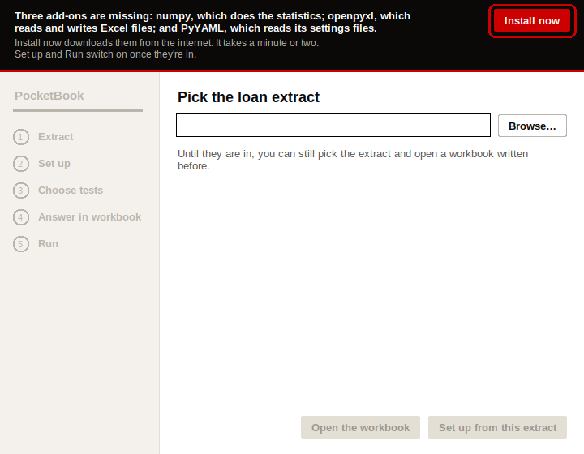
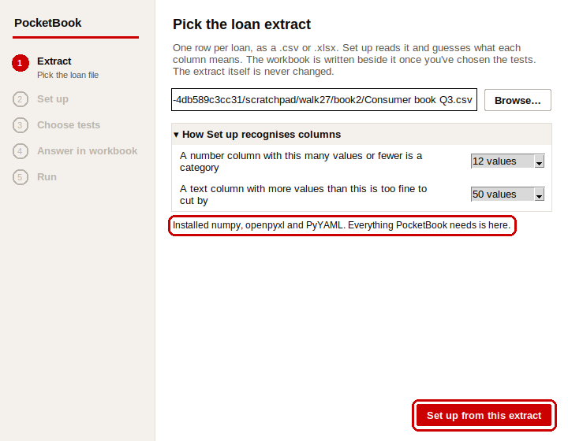
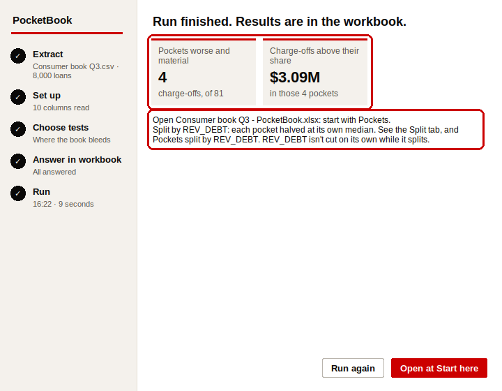
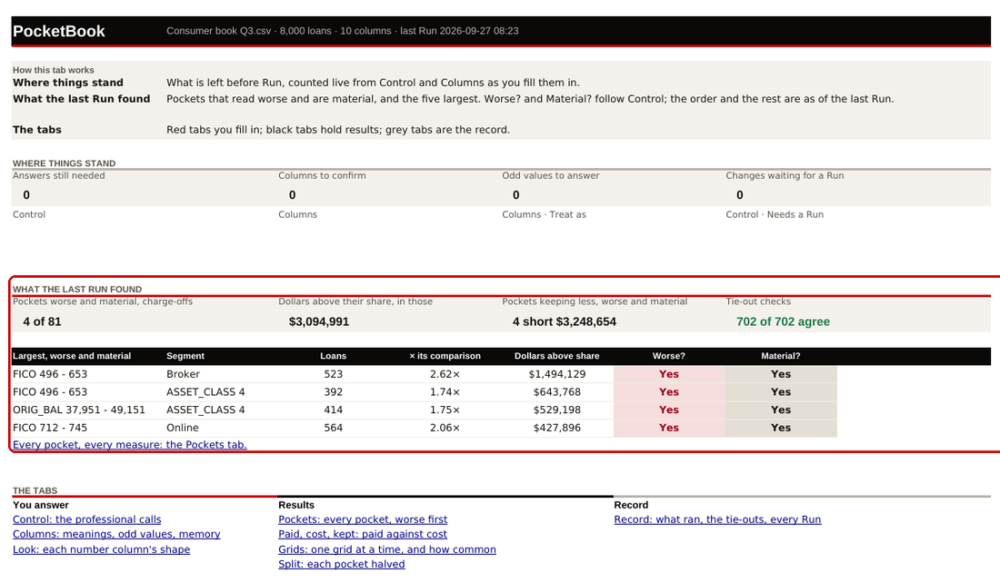
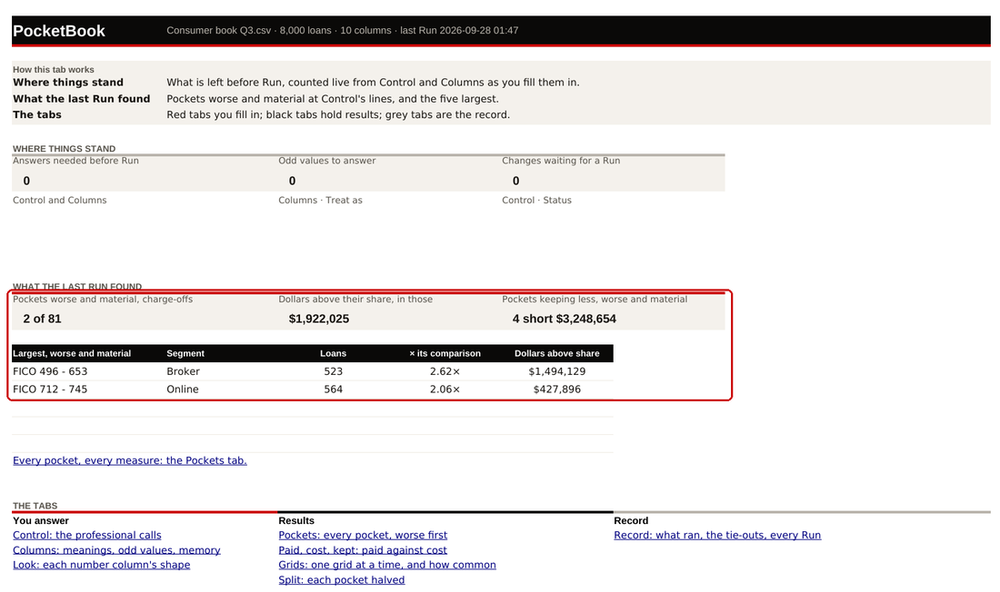
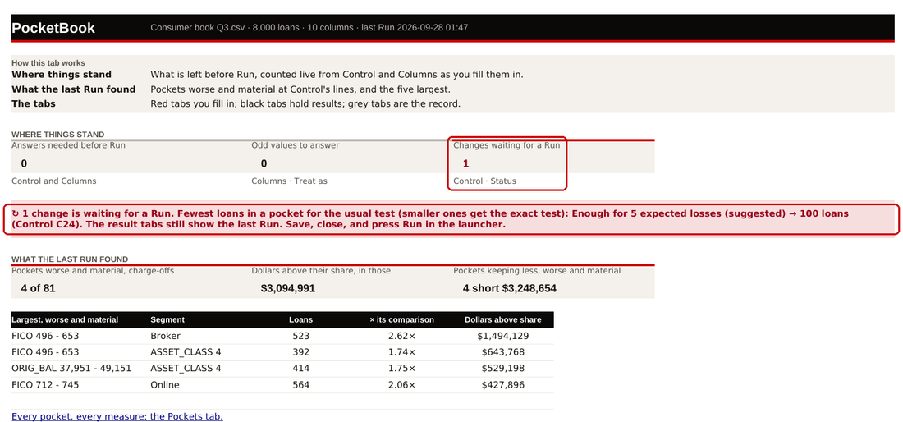
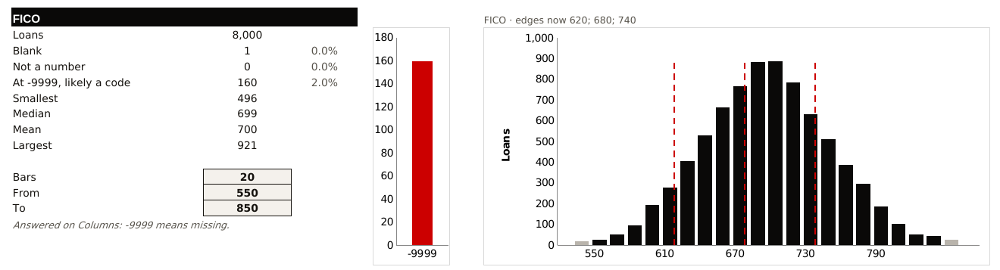

# PocketBook at the bank: the machine checklist

**Who this is for:** whoever takes PocketBook to the bank's machine for the first time.

**What it proves:** that the bank's machine installs PocketBook, works out the same numbers our own checks do, and that the workbook's live parts work in real Excel. Then it takes you to the first real extract.

**Why it matters:** PocketBook has never been run on Windows by a person, never opened in Microsoft Excel, and never fed a real extract. Every check so far used LibreOffice, a free spreadsheet program, to stand in for Excel. Where a step below says **Check this**, nobody knows the answer yet. You are the first to look.

**Time:** about an hour for Parts 1 to 5. Part 6, the real extract, is separate.

Tick each box as you go. Where something differs, write down what you saw, take a screenshot, and carry on: Part 7 says what to send back.

<!-- ROUTE -->

## Words you'll meet

| Word | What it means |
|---|---|
| **Command Prompt** | Windows' window for typing commands. Open it with the Start button: type `cmd` and press Enter. Every command below is typed there, then Enter. |
| **`%USERPROFILE%`** | Command Prompt's name for your own folder, such as `C:\Users\jsmith`. Type it exactly as written; Windows fills in yours. |
| **Python** | The free program PocketBook is written in. The machine needs it installed once. |
| **`py`** | The Python starter that python.org's installer puts on Windows. `py --version` asks which Python is there. |
| **Add-ons** | Free pieces of software PocketBook needs: **numpy** (the sums), **openpyxl** (reads and writes Excel files), **PyYAML** (its settings files), and **scikit-learn** (only for testing new variables). |
| **pip** | Python's own installer for add-ons. PocketBook's **Install now** button runs it. |
| **Proxy** | The bank's gatekeeper for internet traffic. It may stop pip from downloading add-ons. |
| **Add-ons folder** | The add-ons as files, brought on the stick (`PocketBook add-ons.zip`), so pip can install them with no internet. |
| **Extract** | The loan file from the bank: one row per loan, as .csv or .xlsx. |
| **Workbook** | The Excel file PocketBook writes beside the extract. |
| **Practice book** | A made-up book of 8,000 loans with known answers planted in it. It holds no bank data, so it can be screenshotted and sent. |
| **Run** | The button that works everything out and writes the results into the workbook. |
| **Tie-out** | Adding every grid back up and checking it comes to the book's totals. |

---

## Part 1 · Before you go (on your own computer)

### 1.1 Make the kit

In the SATC repository folder, run this (on Windows, type `py` where it says `python` if `python` isn't found). It needs the internet, and it downloads nothing from the bank:

```
python pocketbook/tools/bank_kit.py --add-ons
```

☐ It ends by printing four lines starting `Wrote`. They are in a folder called `PocketBook-kit` in your home folder:

| File | What it is | Size |
|---|---|---|
| `PocketBook.zip` | PocketBook itself: the window (`PocketBook.pyw`), its code, the two install files, this checklist and the analyst's step-by-step procedure. Also `VERSION.txt`, which names the exact code inside. | about 6 MB |
| `PocketBook.py` | The same code as one plain-text script, for a bank that only lets text in. Paste it into a file and run it (2.2). | about 1 MB |
| `PocketBook add-ons.zip` | The add-ons for 64-bit Windows, for Python 3.11, 3.12, 3.13 and 3.14. Only needed if the bank's proxy blocks pip. | about 230 MB |
| `BANK-MACHINE-CHECKLIST.pdf` | This checklist. Print it. | |

Once you know the bank's Python (1.2), the add-ons can be fetched for that one only, about 60 MB. For Python 3.12:

```
python pocketbook/tools/bank_kit.py --add-ons --python 3.12
```

> **Why a zip and not a package:** a Python package (a "wheel") can't carry `PocketBook.pyw`, the file you double-click. The zip holds the window with its code beside it, so nothing of PocketBook's is installed; only the add-ons are.

### 1.2 Find out which Python the bank machine has

Ask IT, or ask whoever uses the machine to type `py --version` in Command Prompt.

☐ It should say **Python 3.10 or later**, 64-bit. PocketBook has been checked on 3.11 (every change, automatically) and 3.12 (the analyst's walk, and this checklist's dry run).

If there's no Python, IT installs **Python 3.12, 64-bit, from python.org**. If you can install it yourself: python.org's installer can install for your account only, which needs no admin rights. Tick **Add python.exe to PATH** on its first screen. **Check this:** whether the bank allows it.

### 1.3 The add-ons

| Add-on | Needed for | Lowest version | Version in the kit (27 Sep 2026) |
|---|---|---|---|
| numpy | every Run | 1.22 | 2.5.3 (2.4.6 for Python 3.11) |
| openpyxl | every Run | 3.1 | 3.1.5 |
| PyYAML | every Run | 6.0 | 6.0.3 |
| scikit-learn | testing new variables only | 1.4 | 1.9.1 |

pip brings what each one needs with it: scipy (1.18.1; 1.17.1 for Python 3.11), joblib, threadpoolctl, et-xmlfile, narwhals and cloudpickle. They're in the add-ons zip too. PocketBook's own checks ran with numpy 2.4.6, openpyxl 3.1.5, PyYAML 6.0.1 and scikit-learn 1.9.1.

### 1.4 Pack

☐ `PocketBook.zip` and `PocketBook add-ons.zip`, or just the text of `PocketBook.py`, on whatever the bank lets you bring files in on. **Check this:** bank email often strips `.zip`, `.bat` and `.pyw` files, and USB sticks are often blocked. Ask IT how a file gets onto the machine before you go.

☐ This checklist, printed.

---

## Part 2 · Install and first open (at the bank machine)

### 2.1 Check Python

Open Command Prompt and type:

```
py --version
```

☐ It says `Python 3.12.` something (any 3.10 or later is fine).

If it says `'py' is not recognized`, try `python --version`. If that opens the Microsoft Store or isn't recognised either, Python isn't installed: see 1.2. Wherever this checklist says `py`, type `python` instead on this machine.

### 2.2 Unzip PocketBook into your own folder

**If only text gets in:** open `PocketBook.py` on your own computer, select all of it and copy it. At the bank, open Notepad, paste, and save it as `PocketBook.py` in your own folder (`%USERPROFILE%`), with **Save as type: All files**. Then in Command Prompt:

```
cd /d "%USERPROFILE%"
py PocketBook.py
```

☐ It prints `35 files, every one checked. Opening the window.` and the window opens. It has written the `PocketBook` folder beside the script; skip to 2.3. If it says *The paste stops early* or *didn't come through whole*, the copy missed something: copy the whole script again, to its last line.

Otherwise, with the zips:

Copy both zips into your **Downloads** folder. Then, before unzipping, right-click each zip, choose **Properties**, and if there's an **Unblock** box at the bottom, tick it and press **OK**. (Windows marks files that came from outside, and may then refuse to run them.)

Type:

```
cd /d "%USERPROFILE%"
tar -xf "Downloads\PocketBook.zip"
```

☐ Check it's there:

```
dir "%USERPROFILE%\PocketBook"
```

It lists `PocketBook.pyw`, `Install add-ons.bat`, `Install add-ons from this folder.bat`, `VERSION.txt`, `README.md`, and the folders `src` and `docs`.

If `tar` isn't recognised, right-click the zip, choose **Extract All…**, and change the folder in the box to what `echo %USERPROFILE%` prints.

### 2.3 Open the window

Double-click `PocketBook.pyw` in the `PocketBook` folder.

☐ The **PocketBook** window opens with five steps down the left. With the add-ons missing, a black bar names each one and offers **Install now**:



If nothing opens, or Windows asks **How do you want to open this file?**, press **Cancel** and type this instead. It opens the same window, and a black window behind it shows any error:

```
py "%USERPROFILE%\PocketBook\PocketBook.pyw"
```

Take a screenshot of anything the black window says.

### 2.4 Press Install now

☐ In a minute or two the black bar goes, a line says what was installed, and **Set up from this extract** turns red:



**Check this:** whether pip gets through the bank's proxy. If it doesn't, the page says *Couldn't install … from here. Press Copy for IT*, and the button says **Try again**. Then install from the add-ons folder instead, in four steps.

**First,** press **Copy for IT** and paste the note into a Notepad file. It holds pip's own words about what failed. Keep it for Part 7.

**Second,** close the window, and unzip the add-ons into the same place as PocketBook:

```
cd /d "%USERPROFILE%"
tar -xf "Downloads\PocketBook add-ons.zip"
```

**Third,** double-click `Install add-ons from this folder.bat` in the `PocketBook` folder. It downloads nothing. What it runs is:

```
py -m pip install --user --no-index --find-links "%USERPROFILE%\PocketBook\add-ons" numpy openpyxl PyYAML scikit-learn
```

`--user` installs for your account only, so it needs no admin rights. `--no-index --find-links` means "only from this folder". A line starting `WARNING` that a folder "is not on PATH" is harmless.

**Fourth,** ☐ no line starts with `ERROR`. Open the window again: no black bar.

### 2.5 Record what's installed

```
py -c "import sys, numpy, openpyxl, yaml; print(sys.version); print('numpy', numpy.__version__, '| openpyxl', openpyxl.__version__, '| PyYAML', yaml.__version__)"
py -c "import sklearn; print('scikit-learn', sklearn.__version__)"
```

☐ Three lines: the Python version, then the add-ons' versions, then scikit-learn's. Write them down for Part 7. (If scikit-learn isn't in yet, the last says `No module named 'sklearn'`. Part 3.3 installs it from the window.)

---

## Part 3 · A dry run on the practice book

This proves the bank's machine works out what our own checks work out, on a book whose answers are known.

### 3.1 Make the practice book

```
cd /d "%USERPROFILE%\PocketBook"
py -c "import sys; sys.path.insert(0, 'src'); from pocketbook import synth; p = synth.write_extract('practice', n=8000); print(p.replace(p.with_name('Consumer book Q3.csv')))"
```

☐ It prints `practice\Consumer book Q3.csv`. That's `%USERPROFILE%\PocketBook\practice\Consumer book Q3.csv`: 8,000 made-up loans.

☐ Check it's the same book, to the byte:

```
certutil -hashfile "practice\Consumer book Q3.csv" MD5
```

The long code it prints must be `223f4e1d82a6b71f17698dcd021a141d`. A **hash** is a fingerprint of the file: change one character and it changes. If it differs, stop and send it back (Part 7): nothing after this can be compared.

### 3.2 Where the book bleeds

Follow the analyst's procedure, Steps 2 to 21 (`docs\walkthrough\2026-09-27\PROCEDURE-pocketbook-analyst.pdf` in the `PocketBook` folder), picking `practice\Consumer book Q3.csv` as the extract. Answer everything **in Excel**, as it says.

Compare as you go. Every number here came up on the walk and again on this checklist's dry run:

| Where | What it should show |
|---|---|
| Set up (Step 4) | 8,000 loans, 10 columns read |
| Next (Step 6) | worked out from this book: fewest loans **65**, worse at **1.34×**, better at **0.75×**; **9 answers needed before Run** |
| Control C15 and C16, **Comes to** (Step 9) | **1.34×** and **0.75×**, before any Run |
| Control C19, **Comes to** (after Step 12) | 1% of losses comes to **$107,354** |
| Columns (Step 10) | FICO: **-9,999 on 160 loans**; RANR: **Negative on 595 loans (e.g. …)** |
| Run (Step 12) | **4** pockets worse and material, GCOs, of 81 · **$3.09M**, and under them *Open … start with Pockets* |
| Start here (Step 13) | **4 of 81** · **$3,094,991** · **4 short $3,248,654** |
| Start here, the largest | FICO 496 - 653 / Broker: 523 loans, **2.62×**, **$1,494,129** · FICO 496 - 653 / ASSET_CLASS 4: 1.74×, $643,768 · ORIG_BAL 37,951 - 49,151 / ASSET_CLASS 4: 1.75×, $529,198 · FICO 712 - 745 / Online: 2.06×, $427,896 |
| Pockets, as it opens | Bad loans · Two-way · All: **7 worse and material · 7 worse · 41 shown** |
| RANR vs GCOs | FICO 496 - 653 / Broker reads **Net drain**; FICO 712 - 745 / Online reads **Losing more, profit holding** |
| Split | the high REV_DEBT half worse in **14 of 15** pockets, **2.02×** overall |





☐ **Check this, the first time:** the Run in Step 12 reads a workbook that **Excel** has saved. Every check so far typed answers with a Python library instead. If Run refuses or stops here, that's the finding: screenshot the window.

☐ Write down the time under **Run** on the left (the walk's was 10 seconds; the dry run's 8).

### 3.3 Test new variables

Steps 22 to 30 of the procedure. If scikit-learn isn't in yet, press **Install scikit-learn** (Step 22); behind the proxy, it goes the way 2.4 went. After **Next**, Control asks one thing more: the **cutoff** (Step 25). Pick the suggestion, **The month start nearest 70% of the loans (suggested)**, in Excel, save and close.

| Where | What it should show |
|---|---|
| Control (Step 25) | *Loans made before this date find the candidates; the rest are held back* shaded, and beside it **suggested: 2024-11-01 (5,641 loans before, 2,359 after)** |
| Run (Step 26) | **REV_DEBT groups worse than 11,000 - 14,999: 1 of 2**, on the held-back loans. About 25 seconds. |
| Start here (Step 27) | 5,640 found · 2,359 held back; 15,000 - 48,522: **Yes, worse**, **2.68×** the odds, **54%** of the bad loans |
| Scouting (Step 28) | REV_DEBT first, **Proposed? Yes**; ORIG_BAL below the noise floor |
| New variables (Step 29) | First line: **Built on loans made 2021-06-30 to 2024-10-31: AUC 0.67. On loans made 2024-11-01 to 2026-03-30, unseen: 0.63.** |

☐ **Check this, the first time:** the cutoff is the one answer in this checklist that is a date. Pick the suggestion from the list; if you type your own under **Or your own** instead, Excel must keep it as a date (it shows as one, such as 2024-11-01), not as text. If Run says it needs a date, that's the finding: screenshot the cell.

Skip Step 31 (editing the pre-spec). It's about the pre-spec, not the machine.

---

## Part 4 · Excel: the live parts

Do these on the practice workbook, `%USERPROFILE%\PocketBook\practice\Consumer book Q3 - PocketBook.xlsx`, after the Run in 3.2. Tick each, or write what you saw instead.

> **Before you start:** in Excel, go to the **Formulas** tab, **Calculation Options**. **Automatic** must be ticked. If it's on Manual, nothing live will move. (Excel takes this setting from the first workbook opened that day, so it can be on Manual without anyone choosing it.)

### 4.1 It opens cleanly

☐ No message saying *We found a problem with some content*. **Check this.** If one appears, press **Yes** to let Excel repair it, then screenshot the list of what it repaired: that list is the finding.

☐ Excel may ask to save when you close, even with nothing changed: it has worked out the formulas. Saying **Save** is fine.

### 4.2 No error values anywhere

1. Press **Ctrl+F**, then **Options >>**.
2. Set **Within** to *Workbook* and **Look in** to *Values*.
3. Type each of these in **Find what** and press **Find All**: `#NAME`, `#REF!`, `#VALUE!`, `#DIV/0!`, `#N/A`, `#NUM!`, `#SPILL!`.

☐ Each one says *Excel cannot find the data you're searching for*. On LibreOffice, all nine tabs you can see are clear.

The hidden tabs `_look` and `_chart` hold `#N/A` on purpose: it tells a chart to leave a gap. If Find lists cells on those two only, that's expected. **Check this:** whether Excel's Find looks inside hidden tabs at all.

☐ Clicking in a result cell may show `=@` in the formula bar. Excel adds the `@` to formulas written by other programs. It's expected if the value in the cell is right.

### 4.3 The dropdowns

Click each cell. A small arrow should appear beside it; press it.

| Tab and cell | The list should hold |
|---|---|
| Control C15 | 4 choices, from *The smallest significant gap in a typical pocket (suggested)* to *2 times* |
| Pockets C18, D18, E18 | Measure (5: Bad loans, Bad dollars, GCOs ($), RANR, RANR + GCOs); Pockets (Two-way, Split by REV_DEBT); Show (All, Worse and material, Worse or not sure) |
| RANR vs GCOs B16 | the 4 grids, from FICO x CHANNEL |
| Grids B13 and F13 | 8 grids (4, then the same 4 / REV_DEBT); the 5 measures (Bad loans, Bad dollars, GCOs ($), RANR, RANR + GCOs), then Loan size |
| Split B15 and B26 | the 4 grids; the 5 measures |
| Look C20 | 10, 20, 50 |

☐ On Pockets, pick **GCOs ($)** in C18 and **Worse and material** in E18. The caption beside them reads **4 worse and material · 4 worse · 4 shown**, and the four rows are Start here's four.

☐ On Grids, pick **FICO x ASSET_CLASS** in B13. The first block's FICO 496 - 653 row reads **20.4%** under 4, and the block beside it **2.64** against the book.

☐ Still on Grids, pick **RANR** in F13. The first block's heading changes to **Rate · RANR ÷ Booked**; pick **GCOs ($)** and it reads **Rate · GCOs ÷ Booked**.

☐ **Check this:** on Control, type `0.9` in D15 (**Or your own**, beside *How much worse*). Excel should refuse it with **Out of range**: *Enter a multiple above 1, such as 1.4, from 1.01 to 100.* Press **Cancel**.

Put Pockets back to **Bad loans** and **All** when done.

### 4.4 A "Changes now" answer: verdicts, colours and dollars follow without a Run

On Control, pick **2 times** in C15.

☐ Start here, without pressing Run: **2 of 81** and **$1,922,025**. The largest are now two: FICO 496 - 653 / Broker and FICO 712 - 745 / Online. The two at 1.74× and 1.75× come off the list.

☐ Pockets' **Worse?** column follows the same way.



Put C15 back to *The smallest significant gap in a typical pocket (suggested)*. ☐ Start here reads 4 of 81 again.

### 4.5 A "Needs a Run" answer: the waiting banner

On Control, pick **100 loans** in C24. Press **Ctrl+S** to save.

☐ Control H24 reads **↻ Waiting for a Run**.

☐ Start here: **Changes waiting for a Run** reads **1**, in red, and a pink line under it names the change and Control C24.

☐ Pockets K15, RANR vs GCOs M13 and Split I12 read **↻ 1 Control change waits for a Run.**



### 4.6 The window knows the workbook is open

With the workbook still open in Excel, look at the PocketBook window.

☐ A pink bar says **The workbook is open in Excel**, and **Run** is grey. **Check this:** PocketBook looks for the lock Excel puts on the file. That's only been seen with a stand-in.

☐ Save and close the workbook. Within a couple of seconds the bar goes and **Run** turns red.

Press **Run**. ☐ Start here's waiting count is back to **0**.

### 4.7 Look: the bars, the range, and the dashed edge lines

Open the workbook again and go to **Look**. The first block is FICO.

☐ In C20 (**Bars**), pick **10**: the chart regroups into 10 bars.

☐ Type `600` in C21 (**From**) and `800` in C22 (**To**): the chart spans 600 to 800, with a grey bar at each end for the loans outside.

☐ On **Columns**, type `620; 680; 740` in I14 (FICO's band edges). Back on Look, three red dashed lines appear on the FICO chart, at 620, 680 and 740, and the line over the chart reads *FICO · edges now 620; 680; 740*.

This is how LibreOffice draws it, with Bars at 20, From 550 and To 850:



**Check this, most of all.** The lines sit on a second, hidden set of axes laid over the bars. LibreOffice and Excel place that second set differently, and the lines were built to come out the same in both, but nobody has seen it in Excel. Each line should run from the bottom of the chart to the top, between the right bars. If they're missing, bunched at one side, or short, screenshot the chart.

When done: clear I14 on Columns (select it, press **Delete**), and put C20 to 20, C21 to 550, C22 to 850.

### 4.8 The method notes fold away

Each tab opens with **How this tab works**.

☐ A **−** in the margin to the left of the row numbers folds it away, and a **+** brings it back. **Check this:** if there's no − anywhere, go to **File**, **Options**, **Advanced**, *Display options for this worksheet*, and tick **Show outline symbols if an outline is applied**.

### 4.9 The charts draw

☐ **RANR vs GCOs:** a scatter of the grid picked, GCOs across on a log scale, RANR up, lines at 1× and 0, the pockets read together named. Pick another grid in B16: the dots move.

☐ **Look:** a chart per number column that can be cut into bands (FICO, ORIG_BAL, REV_DEBT; not GCO_AMT or RANR_AMT), and a red bar on its own left of FICO's for the -9999s.

☐ **Split** and **Grids:** the shaded tables have their colours (pink worse, green better, deeper for bigger gaps).

**Check this** for all three: every chart has only been seen in LibreOffice.

Save and close the workbook when done.

---

## Part 5 · Speed and the cores

PocketBook's shuffle test (how it tells a real gap from chance) splits its work across the machine's processors, one Python process per processor, up to 8.

### 5.1 How many processors

```
echo %NUMBER_OF_PROCESSORS%
```

☐ Write the number down. PocketBook uses that many, up to 8.

### 5.2 A book big enough to watch

The practice Run is over too fast to watch. Make a bigger one:

```
cd /d "%USERPROFILE%\PocketBook"
py -c "import sys; sys.path.insert(0, 'src'); from pocketbook import synth; p = synth.write_extract('speed', n=40000); print(p.replace(p.with_name('Speed test 40000.csv')))"
```

☐ It prints `speed\Speed test 40000.csv`, and `certutil -hashfile "speed\Speed test 40000.csv" MD5` gives `6327507e24c872735a2fed693136a14b`.

In the window: pick it with **Browse…**, **Set up**, the same choices as the practice book (FICO and ORIG_BAL cut into bands, CHANNEL and ASSET_CLASS segments, split by REV_DEBT), **Next**, the same answers on Control and Columns, save, close.

### 5.3 Watch the Run

Press **Ctrl+Shift+Esc** to open **Task Manager**. If it's small, press **More details**. Go to the **Details** tab and click the **Name** heading to sort.

Press **Run** in PocketBook.

☐ While it runs, several `python.exe` or `pythonw.exe` lines appear (one per processor, up to 8), each using CPU, and go again when it finishes.

☐ Start here reads **14 of 81** and **$23,486,197**. The answer is the same on any number of processors.

☐ Write down the time under **Run**. Here it took 31 seconds on 4 processors and 85 seconds on 1.

If only one Python line shows and the Run is slow, it ran on one processor. It still gives the right answer. Send back the number from 5.1, the time, and a screenshot of Task Manager during the Run.

---

## Part 6 · Then a real extract

### 6.1 Before you start

☐ Put the practice book's lessons aside, so Set up doesn't suggest its answers for the bank's columns:

```
ren "%USERPROFILE%\.pocketbook\memory.yaml" memory-practice.yaml
```

(PocketBook remembers what you confirmed, such as "-9999 in FICO means missing", in `%USERPROFILE%\.pocketbook\memory.yaml`.)

☐ Put the extract where the bank keeps such files. The workbook, and any pre-spec file, are written beside it.

### 6.2 What the extract needs

One row per loan, a header row first, as .csv or .xlsx.

| To run | It needs a column for |
|---|---|
| **Where the book bleeds** | the loan or application number; the booked amount; a yes/no outcome (went bad or not); GCO dollars (GCOs); RANR dollars (RANR). It refuses without any of them. |
| **Test new variables** | the loan number; the outcome; the date each loan was made; the columns to test; the columns to hold fixed. The booked amount, GCO and RANR only if it has them. |

Every loan in the extract is run. Choose the period before the extract is made.

### 6.3 What Set up asks, and what to look at first

Set up guesses what each column is. Choose tests asks what to cut. Control and Columns, in the workbook, ask the rest (procedure Steps 4 to 10).

Look at these first, before any result:
1. **Columns**, each row's **What it is** and **Why we think so**. Fix any that's wrong. Then **Odd values** under **Treat as**: a value that looks like a code (such as 9999 in a score) is **Missing**, a real value is **Real**.
2. **Look**: each number column's blanks, likely code, smallest, median and largest. A column with a surprise here will give a surprising result later.
3. After the Run, **Record**, under **This Run**: the range of dates the loans were made. A wrong extract shows there first.

### 6.4 What must never leave the bank

The PocketBook folder and the repository hold no bank data, and must stay that way.

- ☐ The extract, the workbook (`… - PocketBook.xlsx`), the pre-spec (`… - pre-spec.yaml`) and `… - what ran.yaml` stay at the bank.
- ☐ So does `%USERPROFILE%\.pocketbook`. It holds column names, the codes you answered and file paths.
- ☐ No screenshot of a real extract's workbook leaves the machine.
- ☐ No value from the bank's data goes into an email, a chat or an AI tool. Describe instead: *"FICO has a code on 2% of loans"*, not the rows.
- ☐ Nothing from the bank is copied into the `PocketBook` folder.

---

## Part 7 · What to send back

Only from the practice and speed books, never the real extract. The practice workbook is made up, so it can be sent whole.

| Send | How to find it |
|---|---|
| This checklist, ticked, with notes where something differed | |
| Which code ran | `type "%USERPROFILE%\PocketBook\VERSION.txt"`: the commit line is what matters |
| Python and add-on versions | the three lines from 2.5 |
| Windows and Excel versions | `ver` in Command Prompt. In Excel: **File**, **Account**, **About Excel**: the first line, e.g. *Microsoft® Excel® for Microsoft 365 MSO (Version 2408 Build …) 64-bit* |
| Processors, and both Run times | 5.1, 3.2 and 5.3 |
| A screenshot of each check that differed | **Windows+Shift+S**, drag over the part to keep. It's in your clipboard, and saved in **Pictures\Screenshots** |
| The practice workbook, after Excel has saved it | `%USERPROFILE%\PocketBook\practice\Consumer book Q3 - PocketBook.xlsx`. It shows exactly what Excel did to the file. |
| Its Record tab, if the workbook can't be sent | a screenshot of Record |
| If a Run stopped or something went wrong | The window says what stopped, on the page itself. Screenshot it. If it says *Something went wrong that PocketBook didn't expect*, press **Copy details** and paste into your email. It should hold lines of program code and file names only. If it came from a real extract, read it first, and don't send it if any line shows a loan's values. A copy is also in `%USERPROFILE%\.pocketbook\last-error.txt`. |
| If pip failed | the Copy for IT note from 2.4 |

---

## If something goes wrong

| What you see | What it means | What to do |
|---|---|---|
| `'py' is not recognized` | The Python starter isn't installed, or Python isn't. | Try `python --version`. If that fails too, Python needs installing (1.2). |
| Typing `python` opens the Microsoft Store | No Python installed; Windows offers its own. | Don't install from the Store. Ask IT for Python 3.12 from python.org (1.2). |
| Double-clicking `PocketBook.pyw` does nothing, or asks what to open it with | .pyw files aren't linked to Python on this machine. | Run `py "%USERPROFILE%\PocketBook\PocketBook.pyw"` (2.3). |
| *Couldn't install … from here*, and **Try again** | pip couldn't reach the internet: usually the proxy. | **Copy for IT**, keep the note, install from the add-ons folder (2.4). |
| A line starting `ERROR: Could not find a version` from the .bat | The add-ons folder has nothing for this Python: the machine's Python isn't 3.11 to 3.14, 64-bit, or the add-ons zip isn't unzipped in `%USERPROFILE%`. | `py --version`, and `dir "%USERPROFILE%\PocketBook\add-ons"`. Send both. |
| Windows says it protected your PC, or the .bat won't run | The zip came from outside and was blocked. | Unblock the zip before unzipping (2.2), or ask IT. |
| The practice book's MD5 isn't `223f4e1d…` | This machine made a different book, so no number after it will match. | Stop. Send the MD5 and the Python version. |
| A number in 3.2 differs from the table | The machine works something out differently. | Carry on, and note it. Send the practice workbook. |
| Excel: *We found a problem with some content* | Excel doesn't like something PocketBook wrote. | Let it repair, screenshot the repair list, send it (4.1). |
| A `#NAME?`, `#REF!` or `#VALUE!` on a tab you can see | A formula Excel reads differently from LibreOffice. | Note the tab and cell, screenshot it (4.2). |
| Changing a Control answer moves nothing | Excel's calculation is on Manual. | **Formulas**, **Calculation Options**, **Automatic** (Part 4). |
| No dashed lines on Look, or in the wrong place | The known difference between Excel and LibreOffice charts. | Screenshot the chart (4.7). |
| The pink *open in Excel* bar stays after closing it | Excel still holds the file, or left its `~$` lock file behind. | Close Excel fully. If the bar stays, screenshot it and look for a file starting `~$` beside the workbook. |
| *… can't be read: it's open in Excel, or OneDrive is still syncing it* | The extract is open in Excel, maybe in a hidden Excel window, or OneDrive hasn't finished bringing it to this machine. | Close it in Excel. If it isn't open anywhere, check Task Manager for an Excel with no window. Or right-click the extract in File Explorer and choose **Always keep on this device**. Then press **Run** (or **Set up**) again. |
| *Couldn't find … PocketBook looked for it in …* | The extract was moved, renamed or deleted since it was picked. | Put it back in that folder, or pick it again with **Browse…**. |
| *Run stopped* and *Something went wrong that PocketBook didn't expect* | Something went wrong inside PocketBook, not in your answers. The error's name and message are under it. | Press **Copy details** and send what it copies (Part 7). The window still works: fix what it says, and press **Run** again. |
| Only one Python in Task Manager during the Run | The shuffle test ran on one processor. | Still right, only slower. Send 5.3's details. |

---

## What's been checked, and how

- **Run here (Linux, 27 Sep 2026):** every command, on Python 3.11 and 3.12. The practice book and the speed book were made with 3.1's and 5.2's commands on both, and gave the MD5s above. The dry run followed 3.2's answers and gave every number in its table, in 8 seconds on 4 processors. The speed book ran in 31 seconds on 4 processors and 85 on 1, with the same answer. The new-variable run gave 3.3's numbers in 23 seconds. *(28 Sep 2026: 3.3 walked again after the cutoff, the tree's check and the candidates together were added: 27 seconds, on a machine shared with other work.)*
- **Through LibreOffice here, in place of Excel:** 4.2 (no error values on any tab you can see; `#N/A` on `_look` and `_chart` only), 4.3's lists, captions and grid values, 4.4 and 4.5's numbers and words, and 4.7's picture.
- **The kit and the offline install:** `bank_kit.py --add-ons` fetched the Windows add-ons for Python 3.11 to 3.14 through this machine's proxy. The same command, fetching Linux add-ons, was unzipped into a fresh Python 3.12 with none installed; the install in 2.4's third step ran with `--user --no-index --find-links`, and the window opened from the unzipped folder.
- **Not run here, Windows only, checked by reading:** `cd /d`, `tar -xf` on a zip, `dir`, `type`, `ren`, `certutil`, `echo %NUMBER_OF_PROCESSORS%`, `ver`, `notepad`, the two .bat files, Task Manager, and everything in Excel. Their Linux counterparts were run where one exists.
- **Check this, the full list:** whether the bank lets Python be installed (1.2); how files get in (1.4); pip through the proxy (2.4); a workbook Excel has saved, then Run (3.2); the repair message (4.1); Find inside hidden tabs (4.2); the out-of-range message (4.3); the open-in-Excel bar (4.6); the dashed lines (4.7); the fold (4.8); the charts (4.9).
