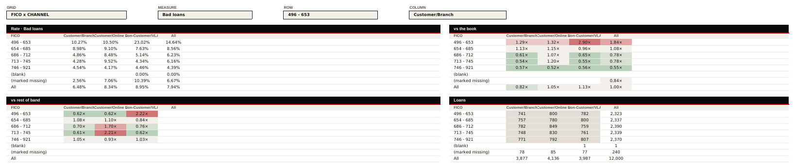
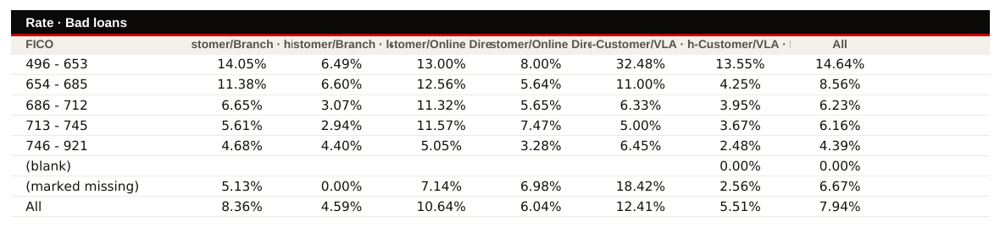
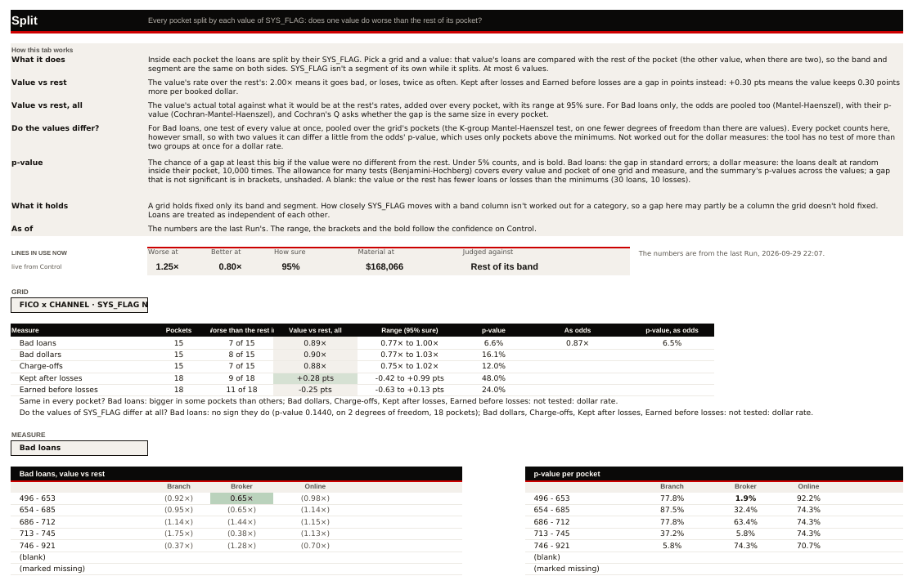
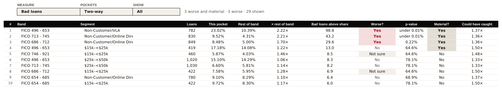
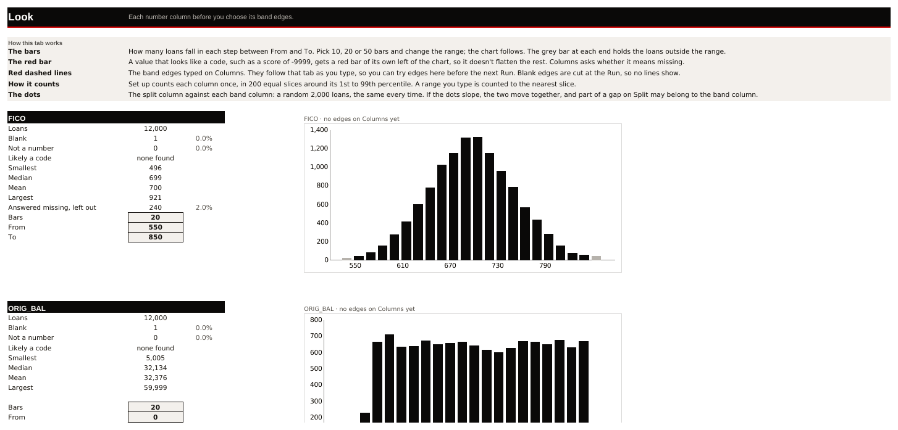
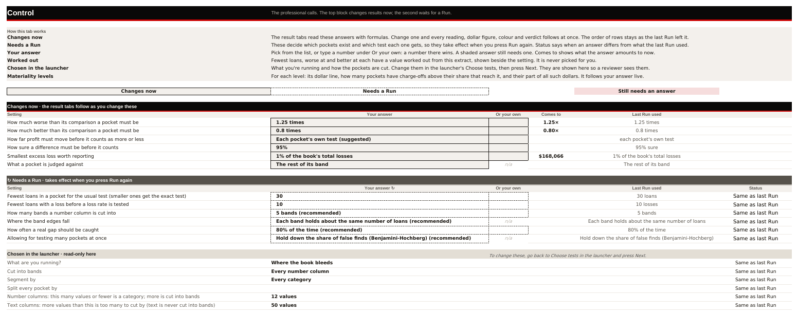
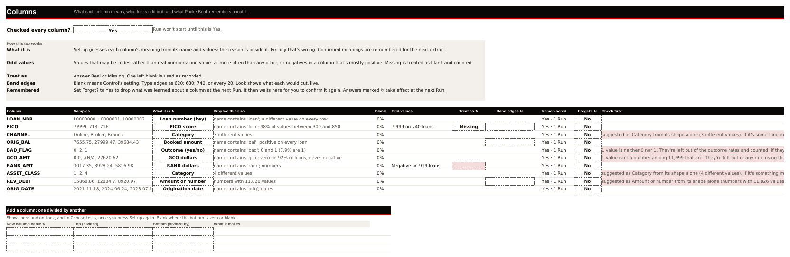

# Column widths: a survey of every tab, and a plan (29 Sep 2026)

**Why.** The firm, 29 Sep 2026: *"take a look at column spacing. i prefer to have nice even layouts, or at least
the column sizes should make sense for the data we see"*. The photos from the bank showed four things:

1. On Grids, segment headers wrapping into three lines ("Non-Customer/VL A").
2. The label column much wider than the data columns.
3. The four side-by-side blocks (Rate, vs the book, vs rest of band, Loans) looking uneven, so one segment sits in
   columns of different widths from block to block.
4. Look's labels wrapping.

**What this is.** A survey only. No file under `pocketbook/src` was changed. Two other sessions are editing
`results.py` and `look.py` right now, so the plan below is written as **rules plus the functions that apply them**,
not as a patch. It should be applied after their work lands.

**Baseline.** `origin/main` at `231d0d5d`.

---

## How it was measured

Four workbooks were built on the synthetic book (`synth.write_extract`, 12,000 loans), then `book.set_up`, then
`_answer` from `tests/test_book.py`, then `book.run`:

| Run | What it exercises |
|---|---|
| **A · default** | Every band column (FICO, ORIG_BAL, REV_DEBT) by every category (CHANNEL, ASSET_CLASS), no split. |
| **B · split by category** | `SYS_FLAG` (Y / N, a blank on every 97th loan) added the way `tests/test_firm_answers_2026_09_29.py::_flag_file` adds it; bands FICO and ORIG_BAL, segments CHANNEL and ASSET_CLASS, split by SYS_FLAG. |
| **C · long labels** | CHANNEL renamed to `Customer/Branch`, `Non-Customer/VLA` and `Non-Customer/Online Direct`, plus a loan-amount bucket category `AMT_BUCKET` (`$5k–<$10k`, `$10k–<$15k`, and so on). FICO by both, split by REV_DEBT (high and low halves). |
| **D · new variable** | Scout first: REV_DEBT, ASSET_CLASS and ORIG_BAL tested, FICO held fixed. This fills Scouting and New variables. |

Each workbook was then recalculated and exported by LibreOffice (the profile from `tests/recalc.py`) to one CSV per
sheet, **as displayed**. That means the lengths below are the text a reader actually sees, in each cell's own number
format ("23.02%", "2.90×", "under 0.01%", "$1,869,963").

For every column, the survey compared three things:

- the width it is set to, from `column_dimensions`;
- the longest bold text in it (headings) and the longest plain text (body);
- whether any of that text is longer than the width.

Cells inside a merge that spans several columns were left out, because they don't need that one column to be wide.
The pictures come from the same files: every other sheet was given an empty print area, the sheet was printed at a
fixed scale to PDF, and `pdftoppm` turned the PDF into PNG.

**How to read a width.** A width is in Excel's units, roughly one digit of Calibri 11. Calibri 10 body text and
Arial bold 9 headings both run at about 1 unit per character, so:

- a centred cell needs **characters + 2**;
- a left-aligned label with `indent=1` needs **characters + 3**.

**What LibreOffice shows compared with the photos.** On `main`, the Grids header cells are written without
`wrap_text` (`results._cell`). LibreOffice therefore *clips* a long segment name instead of wrapping it (picture 2).
The bank's three-line "Non-Customer/VL A" is what the same too-narrow column does once wrapping is on: Excel breaks
after the hyphen and inside the word. Either way the cause is the same: an 11-wide column holding a 16- to 33-character
label.

---

## Before: pictures

1. Grids, run C, grid *FICO x CHANNEL*. There are three segments, but each block is 14 columns wide, because the
   widest grid in the run (the AMT_BUCKET split grid) has 13. Every segment header is clipped at width 11, and the
   label column is 20 against data columns of 11.

   

2. The same tab with the Grid set to *FICO x CHANNEL / REV_DEBT*, the three-way view. The headers are
   `"<segment> · high"`, up to 33 characters, in 11-wide columns.

   

3. Split, run B (category split by SYS_FLAG). Three things are wrong here:
   - The Grid dropdown clips `FICO x CHANNEL · SYS_FLAG N vs rest` (35 characters in a 26-wide cell).
   - The heading "Worse than the rest in" is 22 characters in a 12-wide column.
   - The two grids are 12 wide, while the summary columns above them are 16 or 20.

   

4. Pockets, run C. The Segment column is 20 wide, and "Non-Customer/Online Direct" is 26 characters, so it is clipped.

   

5. Look, run A. The label column is 26 wide. With a split, the scatter block's "Moves together (correlation)" is 28
   characters. That label is the one that wraps or clips.

   

6. Control and 7. Columns, run A. Both are text-heavy input tabs. Some of their columns are sized to one outlier
   (Control B and C). Others are too narrow for what they hold (Columns Samples, Check first, and Control's Last Run used).

   
   

---

## Per tab: current width, longest content, proposed width

In the tables below, "longest" is the longest text the column shows across runs A to D, in characters, with its run.
**Fit** means the proposal is a computed width, not a constant. Its rule is in the plan.

### Grids — `results.write_grids` (widths at `_widths(ws, {1: 2, **{c: 11 …}, left: 20, right: 20, right - 1: 3})`)

| Column | Now | Longest content | Proposed |
|---|---|---|---|
| A (margin) | 2 | — | 2 |
| B (left label: band values) | 20 | "(marked missing)" 16, band labels "15,760 - 26,665" 15, band name "ORIG_BAL" 8 | **Fit** to the longest band label or band name over *all grids in the run* + 3. That is 19 for A to C, with a floor of 12 and a cap of 28. |
| C… (Rate / vs rest of band data) | 11 each | Values: rate "100.00%" 7, multiple "2.90×" 5, points "+0.99 pts" 9, loans "12,000" 6. Headers: "Branch" 6 (A); "Branch · (blank)" 16 (B); "Non-Customer/VLA" 16, "Non-Customer/Online Direct" 26, "Non-Customer/Online Direct · high" 33, "$10k–<$15k · high" 17 (C). | **One data width for every data column of all four blocks**, fitted over every grid's column labels (two lines at most) and every value. The results are 12 for A, 12 for B (two lines), and 16 for C with the two-row header for split grids (rule G4). |
| gap column (right - 1) | 3 | — | 3 |
| right label (vs the book / Loans) | 20 | same as B | same as B |
| right data | 11 each | same as C… | same as C… |
| hidden key columns (`hid`…) | 11 to 13 | keys, raw floats | unchanged |
| Groups table under the blocks (`_groups`: it uses the same columns from B on) | 11 | "Booked dollars" 14 (heading); "388,477,052" 11 (body). At the bank this would be 13 or more ("3,884,770,520"). | These cells go into the same data-width fit (rule G6). |

**Block width.** Each block is `w = nc + 1` columns wide, where `nc` is the most segments that *any* grid in the run
has (`grid_views` returns `most_c`). In run C that is 13, because of the AMT_BUCKET split grid. So a three-segment grid
sits in a 14-column block with ten empty trailing columns, and "vs the book" starts at column P. The four blocks do
line up with one another on `main`: every data column is 11 and both label columns are 20. The uneven look in the
photos comes from three things:

- labels overflowing or wrapping differently in each block;
- heat fills stopping at different places;
- the empty tails.

It does not come from the width values themselves. The tail is left alone here: it keeps the layout still while the
Grid dropdown changes, and changing it is a layout decision, not a width one.

### Split — `results.write_split` (`widths = {c: 12 …}` plus the overrides `(2, 26), (5, 16), (6, 20), (9, 16), (right, 20)`)

| Column | Now | Longest content | Proposed |
|---|---|---|---|
| B (label: measure / band values) | 26 | "Earned before losses" 20, "Bad loans, high vs low" 22 (heading), the Grid dropdown "FICO x CHANNEL · SYS_FLAG N vs rest" 35 | **Fit** to the measure names and band labels + 3 (23 here). The Grid dropdown **merges across B:D** so its 35 characters fit, instead of widening B. |
| C to D (summary: Pockets, "Worse than the rest in" / "High half worse in") | 12 | "Worse than the rest in" 22 (heading), "11 of 18" 8 | 12. The summary header row **wraps to 2 lines** ("Worse than the" / "rest in" 14). |
| E ("Value vs rest, all" / "High vs low, all") | 16 | 18 (heading), "+0.28 pts" 9 | 16, and the heading wraps to 2 lines. |
| F ("Range (95% sure)") | 20 | "-0.42 to +0.99 pts" 18 | 20 |
| G ("p-value") | 12 | "under 0.01%" 11 | 13 |
| H ("As odds") / I ("p-value, as odds") | 12 / 16 | 7 / 16 (heading), "under 0.01%" 11 | 13 / 13, and the heading wraps. |
| The two grids' data columns (C…, right+1…) | 12 | segment headers up to 26 ("Non-Customer/Online Direct", C); values "(0.92×)" 7, "under 0.01%" 11 | **The same data width rule as Grids** (G1). Both grids share it, and the header row wraps to 2 lines. |
| right label (J) | 20 | "p-value per pocket" 18 (block heading, over the merged band), "(marked missing)" 16 | the same as B's fitted label width |

### Pockets — `results.write_pockets` (`widths = {1: 2, K_NUM: 5, K_BAND: 24, K_SEG: 20, K_HALF: 18, …}`)

| Column | Now | Longest content | Proposed |
|---|---|---|---|
| B `#` | 5 | "10" (up to 3 digits) | 5 |
| C `K_BAND` | 24 | "REV_DEBT 17,139 - 48,522" 24 (A) | **Fit**: `name + " " + band label`, longest over the run's grids, + 3, with a cap of 32. |
| D `K_SEG` | 20 | "Non-Customer/Online Direct" 26 (C); at the bank, "Non-Customer/VLA A" 17 | **Fit** to the longest segment label over the run's grids + 3, with a floor of 12 and a cap of 32. |
| E `K_HALF` | 18 | "high"/"low", or a category value (B); the tile label "Better at" 9 above it | **Fit** to "REV_DEBT half" or the split field name + the value, with a floor of 10. Hide it when the run has no split (already done). |
| F Loans | 9 | "1,030" 5 | 9 (or the digits of the book's loan count + 3) |
| G This pocket / H Rest of band / I × rest of band | 11 / 12 / 14 | headings 11 / 12 / 14, values 6 | Leave. The headings set them, and they already fit. |
| J Excess | 22 | heading "Bad loans above share" 21, "Dollars above share" 19, values "$1,869,963" 10 | 22 (the heading drives it) |
| K Worse? | 14 | "Too few losses" 14 | 16 (14 + 2) |
| L p-value | 12 | "under 0.01%" 11 | 13 |
| M Material? / N Could have caught | 11 / 16 | 9 / 17 (heading) | 11 / 19 |
| O `K_HOLDS` | 26 | "No: may be mostly FICO" 22 | 25 |

### Paid, cost, kept — `results.write_pck` (`_widths(ws, {1: 2, C_BAND: 22, C_SEG: 18, …, C_TOG: 28, 12: 3})`)

| Column | Now | Longest content | Proposed |
|---|---|---|---|
| B `C_BAND` | 22 | "(marked missing)" 16, the grid name "FICO x CHANNEL" 14, "live from Control" 17 | The same fitted band label width as Pockets C, minus the field name. The band is shown here without it. |
| C `C_SEG` | 18 | "Non-Customer/Online Direct" 26 (C) | **Fit**, the same as Pockets D. |
| D Loans | 9 | 5 | 9 |
| E, G, I (Gap pts / × band) | 11 | "+0.99 pts" 9, "-6.31 pts" 9 | 11 |
| F, H, J (Dollars) | 13 | "-1,616,647" 10 | 13 |
| K `C_TOG` | 28 | "Earns less, not from losses" 27 | 28 |
| M… (chart notes) | none set | prose, 125 | unchanged: chart area |

### Start here — `book._start_here` (`zip("ABCDEFGHI", (2, 22, 16, 16, 16, 16, 16, 16, 22))`)

| Column | Now | Longest content | Proposed |
|---|---|---|---|
| B (band / tab links) | 22 | "Largest, worse and material" 27 (heading), "FICO 496 - 653" 14, link text up to 45 (it spills into empty cells, which is fine) | **29**. The heading cannot spill into C, because C holds "Segment" on the same row. The alternative is to wrap the heading onto 2 lines. |
| C (Segment in the top-5 table) | 16 | "Non-Customer/Online Direct" 26 (C) | **Fit**, the same as Pockets D, with a cap of 32. |
| D Loans / E × its comparison / F Dollars above share | 16 | 5 / 16 (heading) / 19 (heading), values up to "$1,869,963" 10 | D 10, E 18, F 21. The tiles above span D:G merged, so narrowing D does not clip a tile. **Check this after the change**: the four "Where things stand" tiles are two columns each. |

### Look — `look.write_look` (`zip("ABCDEFGH", (2, 26, 12, 9, 2, 13, 2, 10))`)

| Column | Now | Longest content | Proposed |
|---|---|---|---|
| B (stat labels) | 26 | "Moves together (correlation)" 28 (runs with a split: C); "Answered missing, left out" 26; "Loans with both values" 22 | **30**: the fixed longest label + 2. These labels are constants in look.py, so the width can be computed from them at import: `max(len(label) for label in the stat labels) + 2`. |
| C (value) | 12 | "59,999" / "60,000" 6. At the bank, a balance column's "Largest" could be "1,250,000" 9. | **Fit** to the longest formatted value over the Look columns + 2, with a floor of 10. |
| D (share) | 9 | "0.0%" 4, "100.0%" 6 | 9 |
| H… (chart area) | 10, 13 | chart captions such as "ORIG_BAL · no edges on Columns yet" 34, which spill into empty cells | unchanged |

The long note under the scatter (144 characters in B, "None: nothing splits the pockets…") is a single-row
sentence that spills into empty cells. Merge B:Q for that row and wrap it, the way `house.method_note` does.

### Control — `control.write_control` (`fit_b`, `fit_c`, then constants)

| Column | Now | Longest content | Proposed |
|---|---|---|---|
| B (setting question) | `min(fit_b, 80)` = 80 | 88 ("Text columns: more values than this is too many to cut by (text is never cut into bands)"), then 79, 77, 71; most are 46 to 57 | **Fit with a factor of 0.9, capped at 84**: 88 × 0.9 + 2 = 81, so every question stays on one line. The factor 0.95 overestimates Calibri 10, and the cap of 80 clips the longest question. |
| C (your answer) | `min(fit_c, 66)` = 66 | 69 ("Hold down the share of false finds (Benjamini-Hochberg) (recommended)"), 60, 52; the rest ≤ 34 | Fit at 0.9, capped at 66. That gives 65: the one 69-character option fits at bold Calibri 10, and nothing else changes. |
| D (or your own) | 12 | "Or your own" 11 | 12 |
| E (comes to) | 14 | "$168,066" 8 | 14 |
| F (last Run used) | 44 | "Hold down the share of false finds (Benjamini-Hochberg)" 55, centred and clipped | **Fit** to the longest option label without "(recommended)" + 2, capped at 58. |
| H (status) | 22 | "↻ Waiting for a Run" 19 | 22 |
| I (worked out from the loans) | 50 | "suggested: 2024-11-01 (8,395 loans before, 3,605 after)" 55 (D) | 56 |
| M to P (materiality panel) | 12 / 14 / 10 / 11 | "$1,680,662" 10, heading "What each materiality level keeps" 33 (it spills, fine) | unchanged |

### Columns — `book._columns_tab` (`widths = {…}`, then `C_WHY` fitted `min(max(why_len * 0.9, 24), 64)`)

| Column | Now | Longest content | Proposed |
|---|---|---|---|
| B `C_NAME` | 22 | "ORIG_DATE" 9. The bank's names run longer: "ORIG_FICO_SCORE" and the like. | **Fit** to the longest column name + 3, floor 14, cap 32. The derived-column block below it ("New column name ↻") needs 18. |
| C `C_SAMPLES` | 26 | "2021-11-18, 2024-06-24, 2023-07-10" 34 | **Fit** to the longest samples string + 2, cap 40. |
| D `C_MEANS` | 20 | "Outcome (yes/no)" 16, "Origination date" 16, as dropdowns (bold) | 20 |
| E `C_WHY` | fit = 51.3 | 57 | Keep the fit, with the factor at 0.95. It already sizes to content. |
| F `C_BLANK` | 7 | "0%" / "100%" | 7 |
| G `C_ODD` | 20 | "Negative on 919 loans" 21 | 23 |
| H `C_TREAT` / I `C_EDGES` | 11 / 16 | inputs | unchanged |
| J `C_REMEMBERED` / K `C_FORGET` | 13 / 9 | "Yes · 1 Run" 11 | unchanged |
| L `C_LOOK` ("Check first") | 60 | prose, up to 147 characters, clipped at the page edge | **Wrap it**: 60 wide with `wrap_text`, the row grown to its lines (`house.method_note`'s line estimate). It is a question in prose, not a result row, so rule 5's "no wrapping in result rows" does not apply. |
| M to P (Yes means, Show per pocket, Period, In your words) | 12 / 15 / 11 / 30 | headings 11 / 17 / 8 / 13 | N 19 for "Show per pocket ↻" (17 + 2); the rest unchanged |

### New variables — `confirm_tab.write` (`WIDTHS`)

These tables' headings already wrap (`confirm_tab._wrap`), and the values fit: "under 0.01%" 11, "2.33x to 3.20x" 14,
"$3,524,370" 10. Two columns want changing:

- B `N_CAND` is 20. It holds long bold row labels such as "Confirmed on the held-back loans, nothing held fixed" (89),
  which run across the table as section captions. Merge them B:N rather than widen B.
- L is 14 against "Odds ratio, FICO held fixed" (27, wrapping to 2 lines at 14). Leave it.

Otherwise: no change.

### Scouting — `scout_tab.write` (`WIDTHS`)

The values fit: "5,024 - 6,199; 6,200 - 59,999" is 29 in `S_BINS` 34, and "clears the noise floor" is 22 in `S_WHY` 22.
Change `S_WHY` to 24. No other change.

### Record — `record.write` (`WIDTHS`, `CHARS`)

This tab wraps by design. `record._chunks` splits prose into rows sized to `CHARS`, and `CHARS` is tied to `WIDTHS`.
**No change.** If `WIDTHS` ever moves, `CHARS` has to move with it.

### Not surveyed

- `memory.write_review`: a separate review workbook, not a tab of this one.
- `live.py`: `_live` is a hidden sheet.

---

## The plan: rules, and the functions that apply them

**Add one helper to `house.py`,** next to `method_note`. This part needs nothing from the other sessions' work.

```python
def fit(texts, *, floor, cap, pad=2, per_char=1.0) -> float:
    """A column width that fits the longest of `texts` (as displayed) on one line: characters x per_char + pad,
    kept between floor and cap."""

def two_line_width(text) -> int:
    """The fewest characters a heading needs to fit on two lines, breaking at a space or after a hyphen, as
    Excel wraps."""
```

`pad` is 2 for a centred cell and 3 for a left label with `indent=1`. `per_char` is 1.0 for Calibri 10 and Arial bold 9,
and 0.9 for the long setting questions on Control.

### Rules

**G1 · One data width per Grids tab.** Every data column of all four blocks (Rate, vs the book, vs rest of band,
Loans) gets the same width. It is computed once per run, over *every* grid the Grid dropdown can pick (two-way and
split), as the larger of these two:

- the longest formatted value, + 2;
- the two-line width of the longest column label, + 2.

Floor 9, cap 16.

- **Where:** `results.grid_views` already walks every grid and every column label. Have it also return the longest
  column label's two-line width, the longest row label, and the widest value it puts on `_views`.
- **Then:** `results.write_grids` replaces `**{c: 11 for c in range(2, last + 1)}` with that width.

**G2 · One label width for both label columns.** `left` and `right` are the same width. It is the longest band label
or band name over every grid, + 3. Floor 12, cap 28.

- **Where:** `results.write_grids`, in the same `_widths` call.

**G3 · Headers wrap to at most 2 lines.** The CANVAS column-label row of each block (`t + 1` in `write_grids`) gets
`wrap_text=True`. Its row height is 2 lines (26 pt) only when some label needs it; otherwise it stays at 1 line. That
holds for every block on the tab, so all four blocks' header rows keep the same height.

- **Where:** `results.write_grids`, the header loop that calls `_cell(ws, t + 1, c0 + j, …)`. Add a `wrap` argument
  to `results._cell`, since it has none today.

**G4 · A split grid's header is two rows, not one long label.** The three-way grids label their columns
`"<segment> · <half>"` (`results._short`), and in run C those labels reach 33 characters. Two options:

- **(a), recommended.** A segment row, where each segment is merged across its halves (so it gets twice the data
  width), then a half row: "high" / "low", or the category's values.
- **(b)** Break `_short`'s label with a newline before the half, and let G3 wrap it.

**The firm should pick.** (a) is the even layout they asked for. It touches `grid_views` (a second `cols` key) and the
header loop in `write_grids`.

**G5 · The four blocks line up by construction.** The blocks are at `left` and `right = left + w + 1`, and G1 and G2
give them equal widths. A test should pin this: in Grids, every data column from `left + 1` to `left + nc`, and from
`right + 1` to `right + nc`, has the same width, and `left` equals `right`.

**G6 · The groups table under the blocks uses the same columns.** `results._groups` writes into the data columns from
`first = left`, so its booked-dollar values and its "Booked dollars" headings enter the G1 fit. If the book's dollars
push the width past the cap of 16, **the firm should choose one:**

- show booked dollars in thousands (`#,##0,"k"`), or
- let the groups table wrap its headings and accept `####` risk.

(The format change is a wording and number-format call, so it is the firm's.)

**S1 · Split uses the Grids rules for its two grids.** Its label and data widths follow G1 and G2, fitted over the
split's grids and the p-value text ("under 0.01%" is 11, so the floor there is 13). The summary header row wraps to 2
lines (G3). The Grid dropdown merges B:D instead of relying on B's width.

- **Where:** `results.write_split`, replacing the `widths = {c: 12 …}` / overrides block.

**P1 · Label columns on Pockets, Paid cost kept and Start here fit the run's labels.** The segment and band columns
are sized to the longest label the run can show, + 3, with a cap of 32. The width is computed from `res.grids` and
`res.three_way` in one helper, used by all three:

- `results.write_pockets`: `K_BAND`, `K_SEG`, `K_HALF`.
- `results.write_pck`: `C_BAND`, `C_SEG`.
- `book._start_here`: column C.

A suggested home for the helper is `results.label_widths(res)`. `book._start_here` already imports from results
lazily.

**P2 · Headings set the numeric columns.** Where a heading is longer than its values ("Could have caught" 17,
"Dollars above share" 19), the column is heading + 2. Nothing numeric gets less than its longest formatted value + 2.
The places are `results.write_pockets` (K_WORSE 16, K_P 13, K_CAUGHT 19, K_HOLDS 25) and `book._start_here`.

**L1 · Look's label column fits its fixed labels.** In `look.write_look`, B = the longest stat label + 2
("Moves together (correlation)" is 28, so B is 30). C fits the longest formatted value + 2, floor 10. The scatter's
long note merges B:Q and wraps.

**T1 · Text columns on Control and Columns fit their content, with a cap. Prose wraps.**

- `control.write_control`: `fit_b` and `fit_c` use a factor of 0.9, with caps of 84 and 66. F and I are fitted to
  their content (caps 58 and 56).
- `book._columns_tab`: C_NAME and C_SAMPLES are fitted (caps 32 and 40). C_WHY keeps its fit. C_LOOK ("Check first")
  wraps at 60, with the row height from its line count. C_ODD is 23, C_SHOW 19.

**N1 · Small fixed-width tweaks.** `scout_tab.WIDTHS[S_WHY]` = 24. In `confirm_tab.write`, the long captions in
`N_CAND` merge across the table rather than widening the column.

**Leave alone:** `record.WIDTHS`/`CHARS` (they wrap by design, and are tied together), `live.py`, the hidden key
columns, and the Pockets table's numeric columns that already fit.

### Tests to add with the change (suggested `tests/test_widths.py`)

Build runs A to C as above, then check:

1. In Grids, every data column in all four blocks has one width (G1, G5), and `left` equals `right` (G2).
2. At that width, every column label of every grid in the run fits in 2 lines, using `house.two_line_width`, with a
   split grid's segment measured against its merged span under G4(a).
3. No formatted value in any grid is longer than the data width − 2. Read the values back through `tests/recalc.py`.
4. The segment columns on Pockets, Paid cost kept and Start here are at least the longest segment label + 3.
5. Look B is at least the longest stat label + 2.
6. A mutation check: set one data column back to 11 and confirm test 1 goes red. (Tenet: a check that has never
   failed is not evidence.)

### Proposed Grids numbers for the surveyed runs

| Run | Longest column label | Its two-line width | Widest value | Data width (G1) | Label width (G2) | Header lines |
|---|---|---|---|---|---|---|
| A · default | "Branch" 6 | 6 | "+0.99 pts" 9 (profit measures) | 11 | 19 | 1 |
| B · split by SYS_FLAG | "Branch · (blank)" 16 | 8 | 10 | 12 | 19 | 2 |
| C · long labels | "Non-Customer/Online Direct · high" 33 | 19 | 10 | 16 (capped). With G4(a): 14, and the segment gets 28 across its halves. | 19 | 2 with G4(a); 3 without |
| The bank's photo | "Non-Customer/VLA A" 17 | 14 | ~10 | 16 | fit | 2 |

---

## After: what was built (30 Sep 2026)

The plan above was built on branch `pocketbook-widths-0929`. The two calls the firm had not made were taken for
them and recorded as reversible in `BACKLOG.md` §6d:

- **G4(a):** a split grid's header is two rows.
- **G6:** booked dollars show in thousands where they would overflow.

The same runs were built again and rendered the same way. The after pictures sit beside the before ones:

| Before | After |
|---|---|
| `grids-long-channel.png` | `after-grids-long-channel.png`: FICO x CHANNEL, run C. One data width (16, the cap, set by "Non-Customer/Online Direct"), with the labels on two lines. |
| `grids-split-headers-zoom.png` | `after-grids-split-headers.png`: FICO x CHANNEL / REV_DEBT. Each segment is merged over its high and low halves. |
| `split-sysflag.png` | `after-split-sysflag.png`: the Grid dropdown spans B:D, and the two grids share one width. |
| `pockets-long.png` | `after-pockets-long.png`: Segment is 29 wide, so "Non-Customer/Online Direct" fits. |
| `look.png` | `after-look.png`: B fits "50th percentile (P50), the median". |
| `control.png`, `columns.png` | `after-control.png`, `after-columns.png`: Control's questions stay on one line, and Columns' *Check first* wraps. |

| Tab · column | Before | After (runs A / B / C) |
|---|---|---|
| Grids data columns | 11 | 12 / 13 / 16 |
| Grids label columns | 20 | 19 / 20 / 20 |
| Split data columns | 12 | 13 / 13 / 16 (the summary columns keep what their headings and values need) |
| Split B | 26 | 23 |
| Pockets Band / Segment / Half | 24 / 20 / 18 | 27 / 16 to 29 / 21 |
| Paid cost kept Band / Segment | 22 / 18 | 20 / 12 to 29 |
| Start here B / C / D / E / F | 22 / 16 / 16 / 16 / 16 | 29 / 16 to 29 / 12 / 18 / 21 |
| Look B | 26 | 32 |
| Control B / C / F / I | 80 / 66 / 44 / 50 | 82 / 66 / 58 / 56 |
| Columns Name / Samples / Odd values / Show per pocket | 22 / 26 / 20 / 15 | 24 / 36 to 40 / 23 / 19 |
| Scouting Why | 22 | 24 |

`tests/test_widths.py` holds each rule. Ten planted bugs in `tools/mutation_check.py` prove the tests can fail;
one of them sets a Grids data column back to 11.
