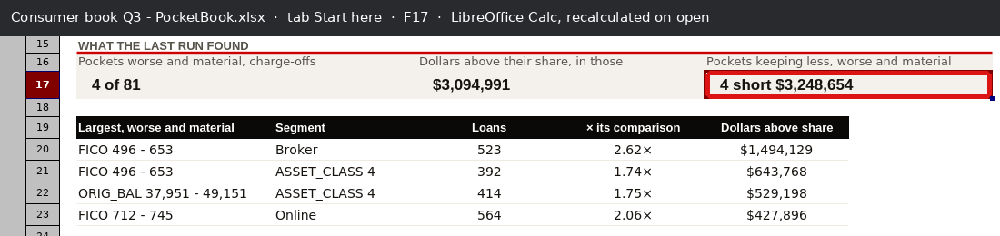
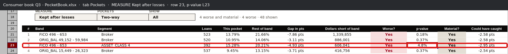
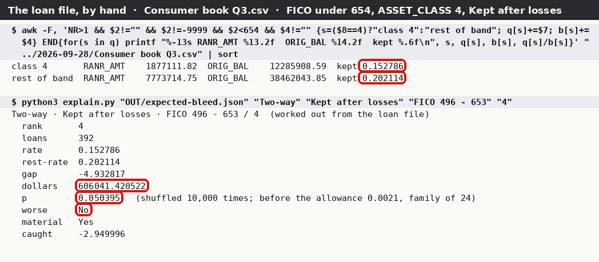
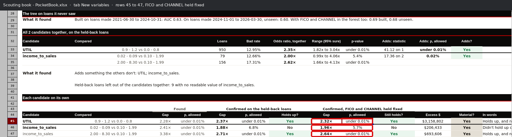
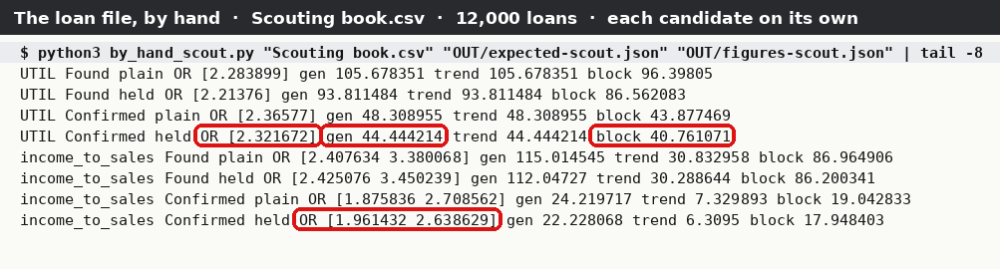
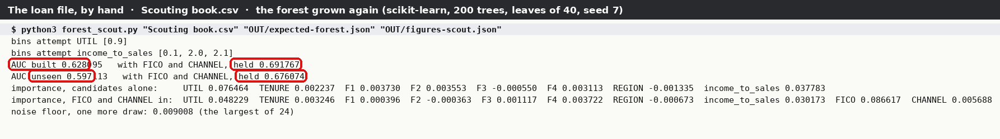
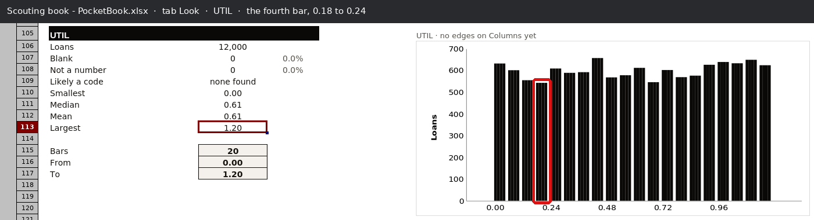
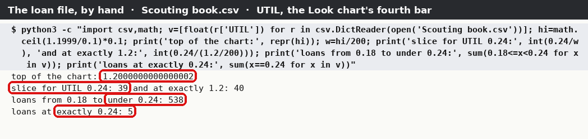

<div class="kicker">PocketBook · full tie-out · 28 September 2026</div>

# Every figure in both workbooks, tied out to the loan file

<p class="lead">The first tie-out traced one pocket, one grid and one p-value: 64 figures. The firm, on reading it: "That tie out covered 60 things? It's pretty small." This one reads every figure an analyst can see in PocketBook's two kinds of Run — every tab, under every choice of every dropdown — and works each one out a second time from the loan file, with tools that share no code with PocketBook.</p>

<div class="meta">Where the book bleeds: Consumer book Q3.csv (8,000 loans, made-up) · Consumer book Q3 - PocketBook.xlsx, Run 2026-09-28 21:24 · 40 views, each calculated by LibreOffice 24.2 · Test new variables: Scouting book.csv (12,000 loans, made-up; the book tests/test_scout.py uses) · Scouting book - PocketBook.xlsx, Run 2026-09-28 21:30 · Loan-file road: Python 3.11 csv module, numpy 2.4, scipy 1.17, statsmodels 0.15, scikit-learn 1.9, awk</div>

<div class="headline-box"><span class="big" data-tieout="headline"><!--HEADLINE--> cells read</span> out of the two workbooks — every visible cell that holds a number, or words with a digit in them, under every view. Of them, <b><!--COUNT:TIED--> tie</b> to the loan file and <b><!--COUNT:TIED-WITHIN-SAMPLING--> tie within sampling error</b> (figures that come from shuffling or sampling at random, which two honest roads cannot make land on the same digits). <b><!--COUNT:DIFFERS--> differ</b>, all sixteen of them bars of one chart, from a small bug found here. <b><!--COUNT:COULD NOT--> could not be checked</b>, each for a reason named below. The rest are names, the analyst's own answers shown back, and words.</div>

## How the two roads meet

<figure class="diagram">
<svg viewBox="0 0 760 360" xmlns="http://www.w3.org/2000/svg" font-family="IBM Plex Sans, DejaVu Sans, sans-serif" font-size="11">
  <defs><marker id="a" viewBox="0 0 10 10" refX="9" refY="5" markerWidth="7" markerHeight="7" orient="auto"><path d="M0,0 L10,5 L0,10 z" fill="#16181b"/></marker></defs>
  <rect x="8" y="140" width="118" height="80" rx="4" fill="#fff" stroke="#16181b" stroke-width="1.5"/>
  <text x="67" y="164" text-anchor="middle" font-weight="600">the loan files</text>
  <text x="67" y="182" text-anchor="middle" fill="#525a64">8,000 loans</text>
  <text x="67" y="197" text-anchor="middle" fill="#525a64">12,000 loans</text>
  <text x="67" y="212" text-anchor="middle" fill="#525a64" font-size="9.5">.csv, made-up</text>
  <text x="150" y="22" font-weight="600" fill="#7a2230" font-size="10" letter-spacing="1.5">ROAD 1 · WHAT POCKETBOOK SHOWS</text>
  <rect x="160" y="34" width="118" height="62" rx="4" fill="#f7f5f1" stroke="#8a919b"/>
  <text x="219" y="57" text-anchor="middle" font-weight="600">PocketBook Run</text>
  <text x="219" y="73" text-anchor="middle" fill="#525a64">both kinds</text>
  <text x="219" y="87" text-anchor="middle" fill="#525a64" font-size="9.5">the walk's own steps</text>
  <rect x="306" y="34" width="118" height="62" rx="4" fill="#f7f5f1" stroke="#8a919b"/>
  <text x="365" y="57" text-anchor="middle" font-weight="600">two workbooks</text>
  <text x="365" y="73" text-anchor="middle" fill="#525a64">cells, formulas,</text>
  <text x="365" y="87" text-anchor="middle" fill="#525a64">dropdowns</text>
  <rect x="452" y="34" width="118" height="62" rx="4" fill="#f7f5f1" stroke="#8a919b"/>
  <text x="511" y="57" text-anchor="middle" font-weight="600">41 views</text>
  <text x="511" y="73" text-anchor="middle" fill="#525a64">every dropdown</text>
  <text x="511" y="87" text-anchor="middle" fill="#525a64">choice, calculated</text>
  <rect x="598" y="34" width="150" height="62" rx="4" fill="#fff" stroke="#16181b" stroke-width="1.5"/>
  <text x="673" y="57" text-anchor="middle" font-weight="600">every cell read</text>
  <text x="673" y="73" text-anchor="middle" fill="#525a64">openpyxl, named by</text>
  <text x="673" y="87" text-anchor="middle" fill="#525a64">the labels beside it</text>
  <path d="M126,160 C140,110 140,65 158,65" fill="none" stroke="#16181b" marker-end="url(#a)"/>
  <path d="M278,65 L304,65" stroke="#16181b" marker-end="url(#a)"/>
  <path d="M424,65 L450,65" stroke="#16181b" marker-end="url(#a)"/>
  <text x="426" y="112" fill="#525a64" font-size="9.5">views.py sets each dropdown;</text>
  <text x="426" y="124" fill="#525a64" font-size="9.5">LibreOffice works every formula out</text>
  <path d="M570,65 L596,65" stroke="#16181b" marker-end="url(#a)"/>
  <text x="150" y="256" font-weight="600" fill="#25644a" font-size="10" letter-spacing="1.5">ROAD 2 · THE SAME FILES, NOTHING OF POCKETBOOK'S</text>
  <rect x="160" y="268" width="264" height="74" rx="4" fill="#eef4f1" stroke="#25644a"/>
  <text x="292" y="289" text-anchor="middle" font-weight="600">by_hand_bleed · by_hand_scout · forest_scout</text>
  <text x="292" y="306" text-anchor="middle" fill="#25644a">csv, numpy, scipy, statsmodels, scikit-learn</text>
  <text x="292" y="322" text-anchor="middle" fill="#25644a" font-size="9.5">the rules as the tabs state them in words;</text>
  <text x="292" y="335" text-anchor="middle" fill="#25644a" font-size="9.5">its own 10,000 shuffles, its own forest</text>
  <path d="M126,200 C140,250 140,300 158,300" fill="none" stroke="#16181b" marker-end="url(#a)"/>
  <rect x="598" y="150" width="150" height="72" rx="4" fill="#fff" stroke="#7a2230" stroke-width="2"/>
  <text x="673" y="172" text-anchor="middle" font-weight="700" fill="#7a2230">compare.py</text>
  <text x="673" y="189" text-anchor="middle" fill="#525a64">one verdict a cell</text>
  <text x="673" y="205" text-anchor="middle" font-family="IBM Plex Mono, DejaVu Sans Mono, monospace" font-size="10">roster.csv</text>
  <path d="M673,96 L673,148" stroke="#16181b" marker-end="url(#a)"/>
  <text x="680" y="126" fill="#525a64" font-size="9.5">ours</text>
  <path d="M424,300 C560,300 640,280 660,224" fill="none" stroke="#16181b" marker-end="url(#a)"/>
  <text x="520" y="292" fill="#525a64" font-size="9.5">source</text>
</svg>
<figcaption>The same two loan files travel two roads. Road 1 is PocketBook: its Run writes the workbook, a copy is made for every choice an analyst can pick in a dropdown (40 for the bleed workbook, one for the new-variable workbook), LibreOffice works every formula out as Excel would on opening, and every cell is read. Road 2 never imports PocketBook: it reads the loan file with Python's csv module and works each figure out again from the rules the tabs state. <b>Road 2 is the one that makes this evidence:</b> the loan file cannot agree with a mistake PocketBook made while computing.</figcaption>
</figure>

## The words, shown once

- **Pocket** — one band of a number column crossed with one segment of a category: *FICO 496 – 653 / Broker*. A **three-way pocket** is a pocket's high or low half on the split column (REV_DEBT), as the Grids tab's *… / REV_DEBT* grids and the Pockets tab's *Split by REV_DEBT* list show them.
- **Rest of band** — every other loan in the same band. Control says a pocket is judged against it. A pocket alone in its band is judged against the rest of the book.
- **Shuffle test** — for a dollar rate, PocketBook deals the loans out at random 10,000 times and counts how often a gap as big turns up. The loan-file road does the same with its own random numbers, so the two can only agree within **sampling error**: how far two honest counts of the same random thing are expected to land apart.
- **Benjamini-Hochberg** — the allowance for testing many pockets at once: each p-value raised according to how many were tested in its family (one grid, one measure, one comparison).
- **Conditional logistic regression** — the New variables tab's odds ratios: each pocket's bad loans taken as given, and the groups compared inside it.
- **AUC** — the chance a random bad loan scores above a random good one; 0.5 is a coin flip.
- **View** — one choice of every dropdown on a tab. Pockets has 10 (5 measures × 2 kinds), Grids 40 (8 grids × 5 measures), Split 20, Paid, cost, kept 4. All of them were read.

## What was read, and how it came out

<!--TABS:bleed-->

The where-the-book-bleeds workbook, by tab. A cell counts once: Grids' Loans block, the same under all five measures, is one figure, not five.

<!--TABS:scout-->

The test-new-variables workbook, by tab.

### Start here and Control

The tiles, the top list and Control's materiality ladder are sums over the pockets below them, so each one ties only if every pocket's verdict does. **Start here!F17** is the one that moved: it counts pockets *keeping less, worse and material*, and one of them, FICO 496 – 653 / ASSET_CLASS 4 on Kept after losses, is *worse* at a shuffled p-value of 4.8% in the workbook and 5.04% on the loan-file road — either side of 5%, and well inside each other's sampling error. Taken the workbook's way, the tile ties to the dollar.

<!--EXCERPT:start-->

<figure class="wide"><figcaption>Start here in LibreOffice Calc, the file recalculated when it opened. Ringed: F17, the tile that rests on one shuffled p-value.</figcaption></figure>

### Pockets

Every row of every one of the ten views: the loans, both rates, the gap, the dollars above (or short of) share, Worse?, the p-value, Material?, Could have caught, the row's place in the order, and the count above the table. The bad-loan p-values are the pooled two-proportion z test for a pocket of 65 loans or more and Fisher's exact test below that, then Benjamini-Hochberg within each grid, measure and comparison, leaving out pockets under 10 bad loans — all recomputed with scipy and statsmodels and tied to 1e-6. The 65 and the lines (1.34× worse, 0.75× better) are themselves worked out again from the book, as Record says they are. The dollar p-values are the shuffle test, tied within sampling error.

<!--EXCERPT:pockets-->

<figure class="wide"><figcaption>Pockets, MEASURE set to Kept after losses. Ringed: row 23 and its p-value, 4.8% — the pocket whose verdict rests on a p-value the two roads put either side of 5%.</figcaption></figure>

<figure class="wide"><figcaption>The same pocket from the loan file. awk adds up RANR_AMT and ORIG_BAL for the band's ASSET_CLASS 4 loans and for the rest of the band (ringed: 0.152786 and 0.202114, the workbook's 15.28% and 20.21%); explain.py prints what the loan-file road worked out for it, its shuffled p-value 0.050395 ringed — and so its verdict, No, where the workbook's is Yes. Both are honest: see <i>What it found</i>, item 1.</figcaption></figure>

### Grids, the three-way grids, and how common each group is

Eight grids (four two-way, four split by REV_DEBT) under five measures: the rate block, against the book, against the rest of its band, and the loans in each cell, with their totals. A cell with fewer than 10 losses is blank on both roads, as the tab says. Under the two-way grids, the table of how common each half is: loans and booked dollars per pocket and per half, and each half's share of the grid. A gap in points (Kept after losses, Earned before losses) is stored by PocketBook to nine decimal places of a point and compared at that.

<!--EXCERPT:grids-->

### Split

For each grid: how many pockets were tested, in how many the high half did worse, the high halves' actual against expected with its 95% range, the pooled p-value, the Mantel-Haenszel odds with the Cochran-Mantel-Haenszel p-value, and Cochran's Q in words; then, for each measure, every pocket's high-versus-low gap and p-value, with brackets where it is not significant. The bad-loan tests tie exactly; the dollar measures' p-values come from shuffling within each pocket and tie within sampling error.

<!--EXCERPT:split-->

### Paid, cost, kept

Four grids: every pocket's gap and dollars on Earned before losses, Charge-offs and Kept after losses, and the Together verdict from the words on the tab (Priced for it, Net drain, …). Two Together verdicts rest on shuffled p-values either side of 5%.

<!--EXCERPT:pck-->

### Record, Look and Columns

Record's loans, dates, band edges, loans needed, smallest gaps, materiality lines, pocket counts, budgets, families and what was left out; Look's counts, medians, means, correlations and every bar of every chart; Columns' blank shares and odd values.

<!--EXCERPT:record-->

<!--EXCERPT:look-->

### New variables — the confirmation

Each candidate on its own (found, confirmed, confirmed with FICO and CHANNEL held fixed; the allowance; Holds up?, Still holds?, Excess $, Material?, In words), the tests in full (general, trend and block, on four sets of loans), each group's odds ratio with its range and raw p-value, how much of the held-back loans' losses sit in each group, and all the candidates together (odds ratios, ranges, likelihood-ratio statistics, the allowance, Adds?). Every figure on the tab ties.

<!--EXCERPT:newvar-->

<figure class="wide"><figcaption>New variables, rows 45 to 47. Ringed: the three held-fixed p-values — the column the loan-file road first got wrong (<i>What I got wrong</i>, item 1).</figcaption></figure>

<figure class="wide"><figcaption>by_hand_scout.py on the loan file: each candidate's odds ratios by conditional logistic regression, and the three tests, on each set of loans. Ringed: UTIL's 2.321672 held fixed on the held-back loans (the workbook's I45, 2.32×), its general test 44.444214 and block test 40.761071 (F104, F106), and income_to_sales' two odds ratios.</figcaption></figure>

### Scouting — the forest

The forest was grown again from the loan file with the settings the tab states: 200 trees, leaves of at least 40 loans, seed 7, scikit-learn; development loans in date order; the candidates in the order they were ticked, then the new column; a category as its value's place in sorted order. Its AUCs land on the workbook's digits. Importance — how far the AUC drops when a column is shuffled — rests on random shuffles, so it ties within sampling error, and so do the ranks and the partial-dependence curves (which PocketBook averages over a seeded draw of 1,000 loans and this road over all of them). Every x on the curves is exactly one of the development loans' own percentiles.

<!--EXCERPT:scouting-->

<figure class="wide"><figcaption>forest_scout.py on the loan file. Ringed: the cross-fitted AUC 0.628 (the workbook's "The forest's own AUC is 0.628"), 0.692 with FICO and CHANNEL, and the held-back AUCs 0.597 and 0.676 (the workbook's 0.60 and 0.68).</figcaption></figure>

## The roster

<!--ROSTER-->

Every cell read is on one line of roster.csv, beside this document, with the workbook's value, the loan-file road's, the difference and its verdict; the table above is that file counted. DIFFERS and COULD NOT, every one:

| Verdict | Cells | Which, and why |
|---|---:|---|
| <span class="v differs">DIFFERS</span> | 16 | Look, the UTIL chart (new-variable workbook), 16 of its 20 bars: each off by 1 to 5 loans. A PocketBook bug, found here: *What it found*, item 2. |
| <span class="v couldnot">COULD NOT</span> | 1 | Record!C25, **702** tie-out checks: it counts the checks PocketBook ran on itself, and nothing outside PocketBook says how many there should be. What they claim — every grid adds up to the book — is tested directly: every loans and dollars cell of every grid ties. |
| <span class="v couldnot">COULD NOT</span> | 2 | Scouting!C10 and G19, the noise floor, 0.0085: the largest of 24 importances with the outcomes shuffled at random. One more draw on this road's own random numbers gave 0.0090; the largest of 24 random draws has no small sampling error to call a tie against. |
| <span class="v couldnot">COULD NOT</span> | 1 | Scouting!F25, income_to_sales' suggested bins, 0.1 and 2: this road's reading of the rule the tab states in words gave 0.1, 2 and 2.1 (UTIL's 0.9 did land). The words don't say how two cuts that close are merged. |
| <span class="v couldnot">COULD NOT</span> | 1 | Control!I15 in the new-variable workbook, the suggested worse-at line, 1.43×: the tab says it is the smallest odds ratio a group of typical size can call significant, but not which groups are typical or at what power. One attempt (the median over the groups of the odds ratio a Wald test just calls significant) gives 1.40. |

## How to run it yourself

Everything runs from the folder this document sits in, `pocketbook/docs/tie-out/2026-09-28-full/`. The new-variable loan file, both workbooks and every script are in it; the bleed loan file is the first tie-out's, `../2026-09-28/Consumer book Q3.csv`, byte for byte the one this Run read.

**Step 1 · Everything, in one go** (about twenty minutes; `work` is any folder for the in-between files). It prints the mutation check at the end: `planted 200, caught 197, missed 3` for the bleed workbook and `planted 200, caught 196, missed 4` for the new-variable one.

```
sh run-it-all.sh work
```

**Step 2 · One figure by hand: the pocket in Start here!F17.** Expect class 4 kept 0.152786 and the rest of the band 0.202114 — the workbook's 15.28% and 20.21% on Pockets row 23 under Kept after losses.

```
awk -F, 'NR>1 && $2!="" && $2!=-9999 && $2<654 && $4!="" {s=($8==4)?"class 4":"rest of band"; q[s]+=$7; b[s]+=$4} END{for(s in q) printf "%-13s RANR_AMT %13.2f  ORIG_BAL %14.2f  kept %.6f\n", s, q[s], b[s], q[s]/b[s]}' "../2026-09-28/Consumer book Q3.csv"
```

**Step 3 · The Look chart's bug, by hand.** Expect `1.2000000000000002`, `39` where it should be `40`, `538` loans from 0.18 to under 0.24, and `5` at exactly 0.24: the chart's fourth bar reads 543.

```
python3 -c "import csv,math; v=[float(r['UTIL']) for r in csv.DictReader(open('Scouting book.csv'))]; hi=math.ceil(1.1999/0.1)*0.1; print(repr(hi), int(0.24/(hi/200)), sum(0.18<=x<0.24 for x in v), sum(x==0.24 for x in v))"
```

**Step 4 · Look at any figure.** Open `roster.csv` in Excel and filter the verdict column; or open a workbook and pick the view named in the roster's cell column (for example `Pockets!L23 [view-03]` is Pockets with MEASURE *Kept after losses*, POCKETS *Two-way*). `work/views-bleed/plan.json` lists what each of the 40 views sets.

**Step 5 · The PDF again** (needs Chrome or Chromium; the pictures need a virtual display).

```
xvfb-run -a -s "-screen 0 2000x1200x24" python3 workbook_shots.py
python3 pictures.py work
python3 build.py work/tallies.json
```

**Step 6 · The workbooks again from nothing** (optional): `walk_both_runs.py` replays the walk of 27 September to its first Run and on to scouting; `make_scout_book.py` makes the 12,000-loan book and runs it the way tests/test_scout.py does.

```
xvfb-run -a -s "-screen 0 1000x760x24" python3 walk_both_runs.py ../../../src OUT "/tmp/credit/Loan files"
python3 make_scout_book.py ../../../src "/tmp/credit/Loan files"
```

<h2 data-tieout="what-it-found">What it found</h2>

1. **A verdict that rests on a shuffled p-value near 5% can go either way, and one tile on Start here rests on one.** The dollar measures' p-values come from shuffling the loans 10,000 times with a fixed seed. Across the bleed workbook, 928 shuffled p-values were recomputed with this road's own shuffles; every one agrees within sampling error (half of them within a tenth of the tolerance), and 9 of them sit either side of 5% from the workbook's. Six pockets' verdicts rest on a p-value like that (two of them keep more than their band, so no tab prints their p-value; it was read from the workbook's own hidden record of every pocket):
    - FICO 496 – 653 / ASSET_CLASS 4, Kept after losses: 4.8% in the workbook, 5.04% here. It is one of the four pockets on **Start here!F17**, *4 short $3,248,654*; with this road's shuffles the tile reads *3 short $2,642,612*. Record!C29 and the Pockets count move with it.
    - FICO 712 – 745 / Online and FICO 654 – 685 / Online, Kept after losses (5.01% there, 4.44% here): both keep more than their band, so neither is on the Pockets list, but the first one's Together verdict on Paid, cost, kept reads *Losing more, profit holding* in the workbook and *Priced for it* here. The Together verdict of the pocket in the first bullet moves too.
    - three split halves on Bad dollars and Charge-offs (4.8–4.9% there, 5.07–5.14% here): each changes a Worse? on the split view and the order of the rows below it.

    Nothing is wrong with the arithmetic: another seed would move them, and so would another 10,000 shuffles. But a banker reading *Yes* at 4.8% is reading a coin that happened to land. **For the firm:** either say beside a p-value within sampling error of the line that it could fall either side, or take more shuffles for pockets near the line.

2. **The Look chart puts a loan whose value sits exactly on a bar's edge in the bar below — a small PocketBook bug.** On the new-variable workbook, 16 of UTIL's 20 bars are off by 1 to 5 loans; the fourth bar, 0.18 to 0.24, reads 543 where 538 loans sit in it, because the 5 loans at exactly 0.24 are counted there. The cause is floating-point arithmetic:
    - `pocketbook/src/pocketbook/look.py:195` rounds the chart's top to `math.ceil(hi / unit) * unit`, which for UTIL is 12 × 0.1 = **1.2000000000000002**, not 1.2;
    - `pocketbook/src/pocketbook/look.py:202` and `:209` then cut 200 slices of width 0.006000000000000001, and `int((v - lo) / w)` puts 0.24 in slice **39**, the last of the bar below, where 1.2 exactly would put it in slice 40.

    Minimal reproduction, with no PocketBook: `int(0.24 / ((math.ceil(1.1999 / 0.1) * 0.1) / 200))` is 39; `int(0.24 / (1.2 / 200))` is 40. It shows only where a column's values fall exactly on a slice edge (UTIL has four decimals; FICO, ORIG_BAL and REV_DEBT's charts all tie). Look is a picture, not a test, so no verdict moves; but the tab says the bars count the loans between From and To, and on the default view, with nothing typed, they don't quite. Not fixed here.

    <figure class="wide"><figcaption>Look, UTIL, in the new-variable workbook. Ringed: the fourth bar, 0.18 to 0.24, which reads 543.</figcaption></figure>

    <figure class="wide"><figcaption>The same bar from the loan file. Ringed: the chart's top as PocketBook works it out, 1.2000000000000002; the slice that sends 0.24 into the bar below, 39; the 538 loans that sit in the bar; and the 5 at exactly 0.24 that make 543.</figcaption></figure>

3. **The first tie-out's fix holds everywhere.** On 28 September the bad-loan allowance was changed so that a pocket with too few losses is not counted in it. Every bad-loan p-value on every grid, two-way and three-way, now ties to the method the tabs describe — z or exact test, Benjamini-Hochberg over the pockets tested — including the 18-pocket grid that differed then.

4. **Everything the bleed workbook works out from the loans ties, apart from the sampling in item 1**, and so does every figure on New variables. The New variables tab's statistics — conditional logistic regression written out here from its definition, the Mantel-Haenszel general and trend tests, the block tests, the joint model with statsmodels — agree to the digits the tab shows, and the forest, grown again from the settings the Scouting tab states, lands on its AUCs.

<h2 data-tieout="what-i-got-wrong">What I got wrong</h2>

- **My conditional logistic regression had the wrong standard errors, and the workbook caught it.** Nine held-fixed p-values and ranges on New variables first came out different: my 8.14 × 10⁻¹¹ against the workbook's 6.79 × 10⁻¹¹ for UTIL on the held-back loans, while the odds ratios agreed to seven figures. Same odds ratio, different spread, pointed at my variance. I checked it two ways — a numerical second derivative of my own likelihood, and statsmodels' own conditional logit on the same pockets — and both sided with the workbook. The bug was mine: for a pocket with exactly one bad loan I skipped the variance term altogether. Fixed; all nine tie.
- **I misread "the largest gap between the two is 3.3%".** New variables!C17 compares each held-fixed odds ratio with Mantel-Haenszel's; I measured the gap from the conditional odds ratio and got 3.43%. Measured from Mantel-Haenszel's, as the sentence reads more naturally, it is 3.32%. The workbook was right.
- **My first comparison called 98 gaps in points different.** They differed in the tenth decimal place of a point: PocketBook stores a gap to nine decimals. The comparison now allows for that, and says so on each line.
- **My first test run shuffled 200 times, to test the plumbing, and a third of the dollar p-values "differed".** At 200 shuffles the sampling error is seven times what it is at 10,000. The run in this document shuffles 10,000 times, as the workbook does.
- **I first counted Grids' Loans block five times over**, once under each measure, though it is the same cells; the count would have been about 3,000 cells higher. A figure now counts once per cell it can show, not once per view.
- **My comparison could not see a wrong p-value below 10⁻¹².** It allowed an absolute slack of 10⁻¹² on every number, which swallowed any error in a p-value of 10⁻²⁰; the mutation check planted such errors in the new-variable workbook's p-values and none was caught. The slack is now relative only, and every p-value there still ties.
- **statsmodels read four p-values as 0.** Its Cochran-Mantel-Haenszel p-value is one minus a probability, which cannot go below about 10⁻¹⁶; Split's odds p-values run to 10⁻³⁰. The statistic is still statsmodels'; its tail now comes from scipy, and all four tie.
- **I first tried to keep the walk's loan folder under /home, and was stopped.** The folder is `/tmp/credit/Loan files`; its name is written inside both workbooks (where PocketBook records its extract and pre-spec), so it had to be a plain one.

<h2 data-tieout="what-this-does-not-prove">What this does not prove</h2>

- **Not a second method where the tab gives none.** Where the tabs state a rule in words, the loan-file road follows the words. Where the words stop — which pockets make a Benjamini-Hochberg family, the variance behind the split's 95% range, the search behind *Could have caught*, which pockets the Pockets tab lists and in what order, how the forest's columns are laid out — I read PocketBook's code for the definition and wrote it again. A tie there proves the arithmetic, not the choice of method.
- **Shuffled figures only within sampling error, and loosely when small.** mutate.py plants a wrong value in 200 figures of each workbook, chosen at random, and asks the comparison to catch it: 197 of 200 caught in the bleed workbook, 196 of 200 in the new-variable one. The three bleed misses were small shuffled p-values halved, which after the allowance stays inside sampling error: two roads with their own random numbers cannot tell 0.003 from 0.006 there. Of the four new-variable misses, three were Look bars already marked DIFFERS, moved one loan toward this road's count, and one was the Run's time on Start here, which is its own clock and not checked.
- **Not Excel.** LibreOffice 24.2 worked the formulas out. A formula Excel reads differently would not show here.
- **Not a real extract.** Two made-up loan files from PocketBook's own generator. A real bank file has quoted fields, other date shapes and other codes.
- **Not everything a screen shows.** Colours and shading, the charts other than Look's bars, and the row order on Paid, cost, kept were not checked. Pockets' SHOW filters other than *All* were not read separately; they show the same rows, fewer of them.
- **Not the hidden sheets.** They were read twice and only for this: to find which sampled verdicts the workbook took the other way (\_pockets, item 1 of *What it found*), and for the bars the Look charts draw (\_look). No hidden figure is counted as tied.
- **Not every Run.** The walk's second Run (answers changed), its edited pre-spec, and its own scouting of the 8,000-loan book (one candidate, so no joint model) were not tied out; the new-variable run tied out is the test book's instead.
- **Not the 702**, and not the noise floor, the income bins or the suggested worse-at line: the COULD NOTs above.
- **Not the bank's machine.** Everything ran on Linux.
