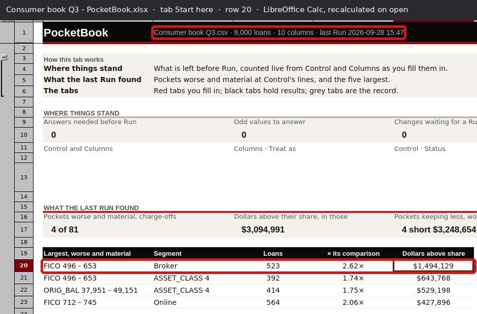
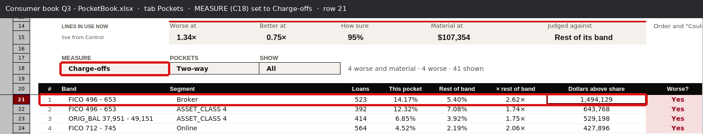
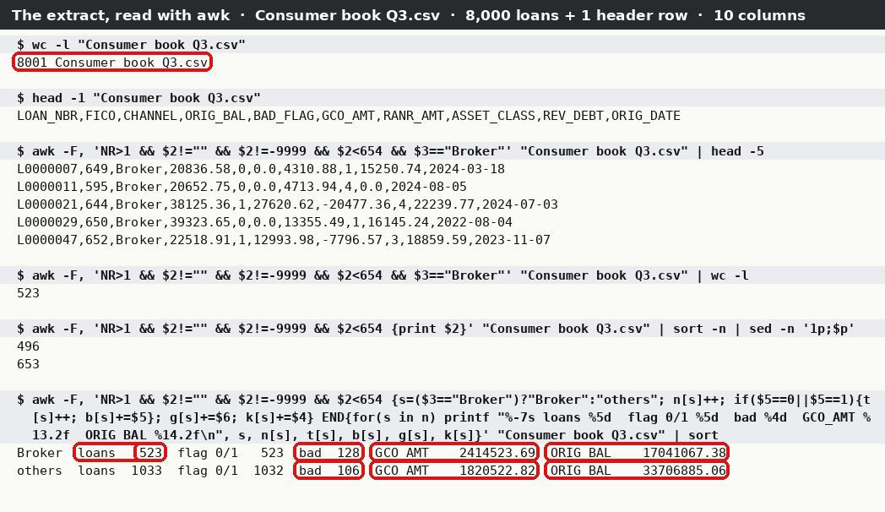
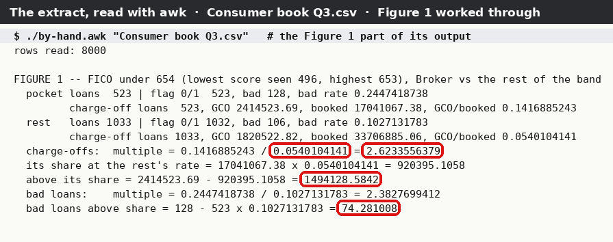
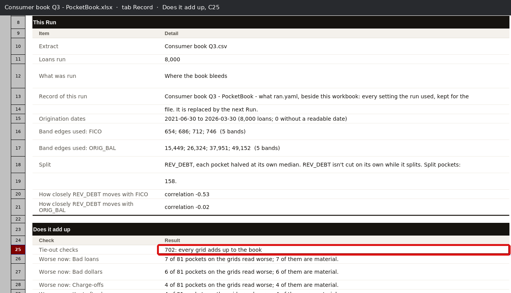
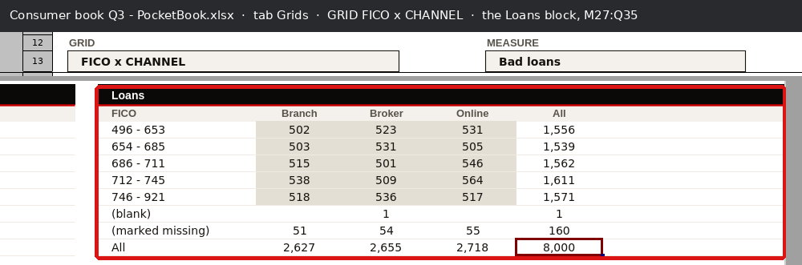
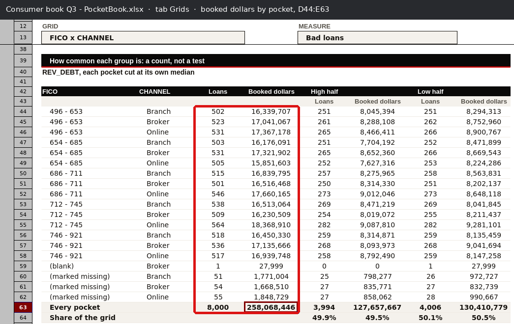
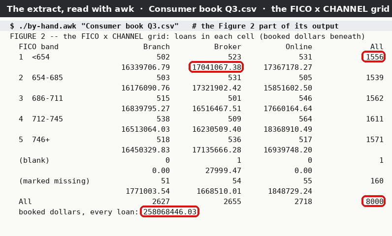
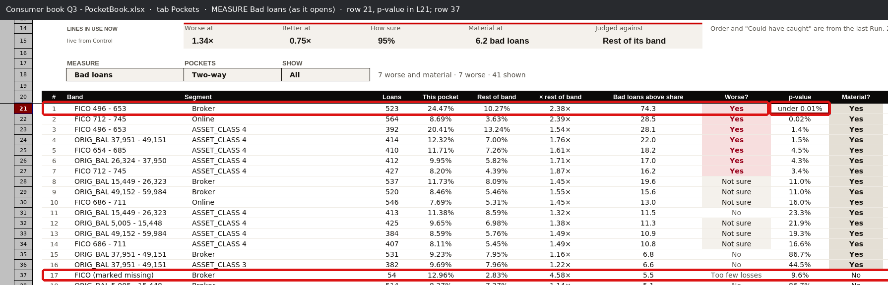
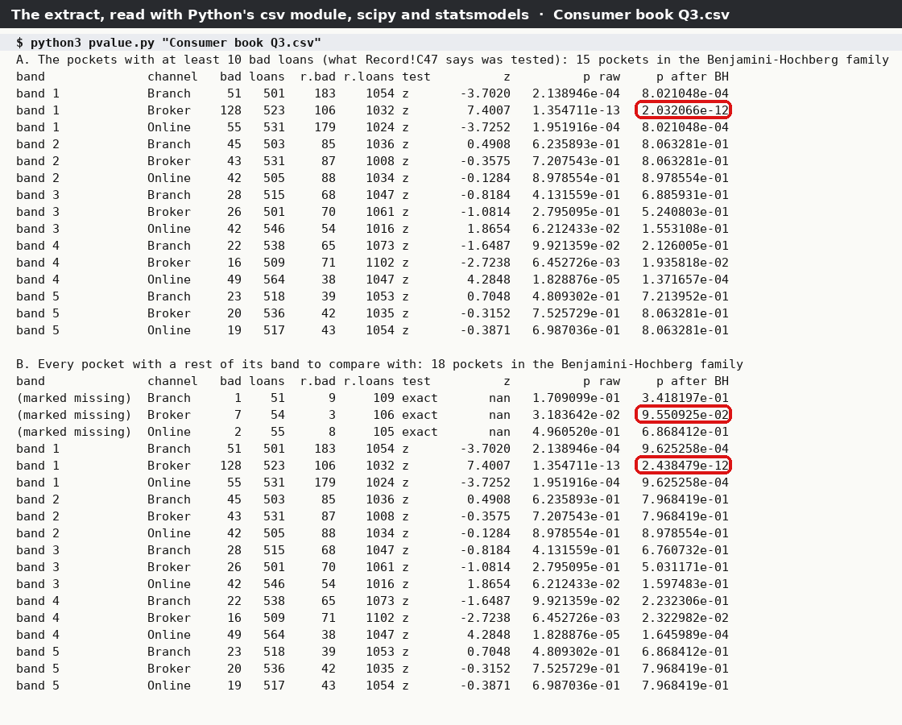

<div class="kicker">PocketBook · tie-out · 28 September 2026</div>

# The top pocket, tied out to the loan file

<p class="lead">Before PocketBook goes to a bank: is the number on its front tab right? One figure, traced from the loan file to the cell the analyst reads, and worked out a second time from the same file with a plain tool that shares no code with PocketBook.</p>

<div class="meta">Extract: Consumer book Q3.csv (8,000 loans, 10 columns, made-up data) · Workbook: Consumer book Q3 - PocketBook.xlsx, first Run 2026-09-28 15:47 · Calculated by LibreOffice 24.2 · Hand road: awk (mawk 1.3.4), Python 3.11 csv module, scipy 1.17, statsmodels 0.15</div>

<div class="headline-box"><span class="big" data-tieout="headline">64 figures checked</span> — 62 agree to the last digit, 1 differs, 1 could not be checked. The front-tab figure, <b>FICO 496 – 653 / Broker, 2.62× its band's charge-offs, $1,494,129 above its share</b>, ties to the cent.</div>

## How the two roads meet

<figure class="diagram">
<svg viewBox="0 0 760 330" xmlns="http://www.w3.org/2000/svg" font-family="IBM Plex Sans, DejaVu Sans, sans-serif" font-size="11">
  <defs><marker id="a" viewBox="0 0 10 10" refX="9" refY="5" markerWidth="7" markerHeight="7" orient="auto"><path d="M0,0 L10,5 L0,10 z" fill="#16181b"/></marker></defs>
  <rect x="10" y="125" width="120" height="70" rx="4" fill="#fff" stroke="#16181b" stroke-width="1.5"/>
  <text x="70" y="150" text-anchor="middle" font-weight="600">Consumer book</text>
  <text x="70" y="164" text-anchor="middle" font-weight="600">Q3.csv</text>
  <text x="70" y="182" text-anchor="middle" fill="#525a64">8,000 loans</text>
  <text x="20" y="28" font-weight="600" fill="#7a2230" font-size="10" letter-spacing="1.5">ROAD 1 · WHAT POCKETBOOK DID</text>
  <rect x="190" y="45" width="130" height="58" rx="4" fill="#f7f5f1" stroke="#8a919b"/>
  <text x="255" y="68" text-anchor="middle" font-weight="600">PocketBook Run</text>
  <text x="255" y="84" text-anchor="middle" fill="#525a64">cuts, sums, tests</text>
  <rect x="380" y="45" width="140" height="58" rx="4" fill="#f7f5f1" stroke="#8a919b"/>
  <text x="450" y="68" text-anchor="middle" font-weight="600">the workbook</text>
  <text x="450" y="84" text-anchor="middle" fill="#525a64">cells and formulas</text>
  <rect x="580" y="45" width="165" height="58" rx="4" fill="#fff" stroke="#16181b" stroke-width="1.5"/>
  <text x="662" y="66" text-anchor="middle" font-weight="600">Start here!F20</text>
  <text x="662" y="84" text-anchor="middle" font-family="IBM Plex Mono, DejaVu Sans Mono, monospace">1,494,128.58</text>
  <path d="M130,140 C160,110 160,74 188,74" fill="none" stroke="#16181b" marker-end="url(#a)"/>
  <text x="140" y="100" fill="#525a64" font-size="9.5">Browse, answer, Run</text>
  <path d="M320,74 L378,74" stroke="#16181b" marker-end="url(#a)"/>
  <text x="326" y="66" fill="#525a64" font-size="9.5">writes</text>
  <path d="M520,74 L578,74" stroke="#16181b" marker-end="url(#a)"/>
  <text x="522" y="66" fill="#525a64" font-size="9.5">recalculated</text>
  <text x="522" y="116" fill="#525a64" font-size="9.5">LibreOffice opens it,</text>
  <text x="522" y="128" fill="#525a64" font-size="9.5">every formula worked out</text>
  <text x="20" y="232" font-weight="600" fill="#25644a" font-size="10" letter-spacing="1.5">ROAD 2 · THE SAME FILE, BY HAND</text>
  <rect x="190" y="245" width="170" height="64" rx="4" fill="#eef4f1" stroke="#25644a"/>
  <text x="275" y="266" text-anchor="middle" font-weight="600">awk: keep FICO under 654</text>
  <text x="275" y="281" text-anchor="middle" font-weight="600">and not -9999; split Broker</text>
  <text x="275" y="297" text-anchor="middle" fill="#525a64">add up GCO_AMT, ORIG_BAL</text>
  <rect x="410" y="245" width="170" height="64" rx="4" fill="#eef4f1" stroke="#25644a"/>
  <text x="495" y="266" text-anchor="middle" font-weight="600">2,414,523.69 −</text>
  <text x="495" y="281" text-anchor="middle" font-weight="600">17,041,067.38 × 5.401%</text>
  <text x="495" y="297" text-anchor="middle" font-family="IBM Plex Mono, DejaVu Sans Mono, monospace">= 1,494,128.58</text>
  <path d="M130,180 C160,210 160,277 188,277" fill="none" stroke="#25644a" marker-end="url(#a)"/>
  <text x="138" y="232" fill="#25644a" font-size="9.5"></text>
  <path d="M360,277 L408,277" stroke="#25644a" marker-end="url(#a)"/>
  <text x="362" y="269" fill="#525a64" font-size="9.5">by hand</text>
  <rect x="610" y="160" width="135" height="50" rx="4" fill="#16181b"/>
  <text x="677" y="181" text-anchor="middle" fill="#fff" font-weight="600">difference</text>
  <text x="677" y="199" text-anchor="middle" fill="#fff" font-family="IBM Plex Mono, DejaVu Sans Mono, monospace" font-size="13">0.00</text>
  <path d="M662,103 L670,158" stroke="#16181b" marker-end="url(#a)"/>
  <path d="M580,277 C640,277 670,250 675,212" fill="none" stroke="#25644a" marker-end="url(#a)"/>
</svg>
<figcaption>The same loan file travels two roads. Road 1 is PocketBook: its Run writes the workbook, and LibreOffice works out every formula when the file opens, as Excel would. Road 2 never touches PocketBook: awk filters the file's rows and adds them up, and the rest is arithmetic you can do on a calculator. <b>Road 2 is the one that makes this evidence:</b> the file cannot agree with a mistake PocketBook made while computing.</figcaption>
</figure>

## The words, shown once

- **Extract** — the loan file: one row per loan. Here, `Consumer book Q3.csv`.
- **Band** — a range of one number column. PocketBook cut FICO (the credit score) into five bands of about equal size. The lowest band is every real score under 654; the lowest score in it is 496, so the workbook labels it *FICO 496 - 653*.
- **Segment** — a value of a category column. Here the channel: Branch, Broker or Online.
- **Pocket** — one band crossed with one segment: *FICO 496 – 653 / Broker* is the 523 loans with a score from 496 to 653 that came through brokers.
- **Rest of band** — every other loan in the same band (the Branch and Online loans with a score under 654). The workbook compares each pocket with this, because Control says *Judged against: Rest of its band*.
- **GCO / charge-offs** — `GCO_AMT`, the gross dollars charged off on a loan. **Booked dollars** — `ORIG_BAL`, the amount lent.
- **Charge-off rate** — charge-off dollars ÷ booked dollars, for a group of loans.
- **× rest of band (the multiple)** — the pocket's rate ÷ the rest of the band's rate. 2.62× means the pocket charged off 2.62 times as much per dollar lent.
- **Dollars above share** — what the pocket charged off, less what it *would* have charged off at the rest of the band's rate: `GCO − booked × rest rate`.
- **p-value** — how likely a gap this big would be if the pocket were really no different; under 5% counts as real. **Benjamini-Hochberg** — the allowance for testing many pockets at once: each p-value is raised according to how many were tested.

## Figure 1 · The top pocket on Start here

### Link 1 — the figure, read out of the workbook

The analyst opens `Consumer book Q3 - PocketBook.xlsx`. Its first tab, **Start here**, lists the largest pockets that are worse and material. Row 20 is the top one.

<figure class="wide"><figcaption>Start here as LibreOffice Calc shows it, the file recalculated when it opened. Ringed: row 20, and the file's own header naming the extract and the Run. Screenshot taken under a virtual display; the unmarked original is <code>raw/start-here.png</code>.</figcaption></figure>

Start here shows the pocket, its loans, the multiple and the dollars. The rates behind the multiple are on **Pockets**, which shows one measure at a time: the analyst picks *Charge-offs* in the MEASURE box (C18) to see them. The file opens on *Bad loans*, which gives the bad-loan pieces.

<figure class="wide"><figcaption>Pockets with MEASURE set to Charge-offs. Row 21 is the same pocket: 523 loans, 14.17% of booked dollars charged off, the rest of its band 5.40%, 2.62×, $1,494,129 above its share.</figcaption></figure>

**How the values were read.** The screen shows rounded values. The full values were read with `read-workbook.py`: it copies the workbook, has LibreOffice recalculate it through the repository's own helper (`pocketbook/tests/recalc.py`, "recalculate on load: always"), and reads each cell with openpyxl. For the charge-off view it sets `Pockets!C18` to *Charge-offs* first, the one thing an analyst does. It does not import PocketBook.

```
Start here!C1   'Consumer book Q3.csv · 8,000 loans · 10 columns · last Run 2026-09-28 15:47'
Start here!B20  'FICO 496 - 653'      C20 'Broker'
Start here!D20  523                   (loans)
Start here!E20  2.6233556378895       (× its comparison)
Start here!F20  1494128.58415667      (dollars above share)
Pockets (Charge-offs)  G21 0.141688524325288   H21 0.0540104140966861   I21 2.6233556378895   J21 1494128.58415667
Pockets (Bad loans)    F21 523   G21 0.244741873804971   H21 0.102713178294574   I21 2.38276994119557   J21 74.281007751938
Grids!E45       17041067.38           (booked dollars, FICO 496 - 653 / Broker)
```

**Two of the pieces are not shown as numbers of their own**, and are read as two cells multiplied: the pocket's bad loans are `Pockets!G21 × F21` = 0.244741873804971 × 523 = **128.0000**, and its charge-off dollars are `Pockets!G21 (Charge-offs) × Grids!E45` = 0.141688524325288 × 17,041,067.38 = **2,414,523.69**.

### Link 2 — the call

The workbook came from the walk of 27 September 2026, replayed: `walk_to_first_run.py` is the walk's own driver (`docs/walkthrough/2026-09-27/driver/walk_now.py`) cut to stop after the first Run. It makes the made-up book (`synth.write_extract`, 8,000 loans), picks it with Browse, cuts FICO and ORIG_BAL into bands, segments by CHANNEL and ASSET_CLASS, splits by REV_DEBT, answers Control as the walk did (worse at the suggested line, 95% sure, materiality 1% of the book's losses, judged against the rest of its band), marks FICO −9999 as *Missing*, and presses Run. The workbook it leaves beside the extract is the one read above.

```
xvfb-run -a -s "-screen 0 1000x760x24" python3 walk_to_first_run.py ../../../src OUT "/home/credit/Loan files"
```

### Link 3 — the derivation, by hand

Every step is a filter or a sum a person could do in a spreadsheet:

1. **Which loans are in the band.** A real FICO score under 654. Leave out `-9999` (the analyst told PocketBook it means *missing*: Columns row 14) and blank scores. The band edges 654; 686; 712; 746 are printed on Record row 16.
2. **Which are the pocket.** Of those, `CHANNEL = Broker`. The rest of the band is the ones that are not.
3. **What is left out.** For charge-offs, a loan whose `GCO_AMT` is not a number or whose `ORIG_BAL` is blank (Record row 70). None of the 1,556 loans in this band is either, so nothing is left out here. For bad loans, a `BAD_FLAG` that is neither 0 nor 1: one loan in the rest of the band carries a 2, so the rest has 1,032 loans with a flag, not 1,033.
4. **Add up.** Loans, loans with `BAD_FLAG = 1`, `GCO_AMT` and `ORIG_BAL`, for the pocket and for the rest.
5. **Divide and subtract.**

| | Pocket (Broker) | Rest of band |
|---|---:|---:|
| Loans | 523 | 1,033 |
| Loans with a 0/1 flag · bad | 523 · 128 | 1,032 · 106 |
| Bad-loan rate | 128 ÷ 523 = 24.474% | 106 ÷ 1,032 = 10.271% |
| Charge-off dollars (GCO_AMT) | 2,414,523.69 | 1,820,522.82 |
| Booked dollars (ORIG_BAL) | 17,041,067.38 | 33,706,885.06 |
| Charge-off rate | 14.1689% | 5.4010% |

- Multiple: 14.1689% ÷ 5.4010% = **2.6234×**
- Its share at the rest's rate: 17,041,067.38 × 5.40104% = 920,395.11
- Above its share: 2,414,523.69 − 920,395.11 = **1,494,128.58**
- Bad loans above share: 128 − 523 × 10.2713% = **74.28**

### Link 4 — the independent source

The extract itself, `Consumer book Q3.csv`, read with awk: a Unix tool older than PocketBook that knows nothing about it. A copy of the file is kept beside this document, so anyone can run the same lines.

<figure class="wide"><figcaption>Every command here was run on the file and its real output drawn beneath it. The file has 8,001 lines: one header and 8,000 loans. The filter keeps a real score under 654; the band runs from 496 to 653. The pocket is 523 rows; ringed, its bad loans, charge-off dollars and booked dollars, and the rest of the band's.</figcaption></figure>

<figure class="wide"><figcaption>The same sums carried through to the rate, the multiple and the dollars (<code>by-hand.awk</code>, the Figure 1 part of its output). Ringed: the rest of the band's rate, the multiple, the dollars above share, and the bad loans above share.</figcaption></figure>

### Link 5 — the comparison

```
                                   workbook (cell, as calculated)           extract (by hand)           diff
loans                              Start here!D20        523                 523                          0
bad loans                          Pockets!G21×F21       128.0000            128                          0.0000
bad-loan rate, pocket              Pockets!G21           0.244741873805      0.244741873805               0
bad-loan rate, rest of band        Pockets!H21           0.102713178295      0.102713178295               0
bad-loan multiple                  Pockets!I21           2.382769941196      2.382769941196               0
bad loans above share              Pockets!J21           74.281007751938     74.281008                    0.000000
booked dollars                     Grids!E45             17,041,067.38       17,041,067.38                0.00
charge-off dollars                 G21×Grids!E45         2,414,523.69        2,414,523.69                 0.00
charge-off rate, pocket            Pockets!G21           0.141688524325      0.141688524325               0
charge-off rate, rest of band      Pockets!H21           0.054010414097      0.054010414097               0
× its comparison                   Start here!E20        2.623355637890      2.623355637890               0
dollars above share                Start here!F20        1,494,128.58        1,494,128.58                 0.00
```

Same loans (the same file, 8,000 rows), same run (15:47, 28 Sep 2026), same basis (gross charge-offs over the amount lent, against the rest of the band), same units (dollars, no scaling). <span class="v tied">TIED</span> on all twelve.

## Figure 2 · "702: every grid adds up to the book"

### Link 1 — the figure

**Record** says, under *Does it add up*: `Tie-out checks: 702: every grid adds up to the book` (Record!C25). One grid is picked to prove the claim rather than the count: the one **Grids** opens on, *FICO x CHANNEL*. Its Loans block puts every loan in one cell; its booked-dollars table does the same for the amount lent.

<figure class="wide"><figcaption>Record, ringed at C25.</figcaption></figure>

<figure class="wide"><figcaption>Grids on FICO x CHANNEL: the GRID box (rows 12–13) above, and, from the right-hand side of the same screen, the Loans block M27:Q35, ringed — seven bands down, three channels across, totals in All. The full screen is <code>raw/grids-loans.png</code>.</figcaption></figure>

<figure class="wide"><figcaption>Further down the same tab: loans and booked dollars for each of the 19 pockets, D44:E63, adding to 8,000 loans and $258,068,446.</figcaption></figure>

### Links 2 and 3 — the call and the derivation

The same Run as Figure 1. By hand: put every row of the extract in exactly one cell — its FICO band (or *blank*, or *marked missing* for −9999) by its channel — and count; add `ORIG_BAL` the same way, a blank as 0. Every row lands in one cell, so the cells add to the file by construction; the check is whether the workbook's cells are the same cells.

### Link 4 — the independent source

<figure class="wide"><figcaption><code>by-hand.awk</code> on the extract, the Figure 2 part of its output: loans in each cell, booked dollars beneath. Ringed: the lowest band's total, the grand total of 8,000 loans, the pocket from Figure 1, and $258,068,446.03 booked across every loan.</figcaption></figure>

### Link 5 — the comparison

Loans, workbook (M27:Q35) against extract, cell by cell. Each cell shows `workbook / extract`; every difference is 0.

| FICO band | Branch | Broker | Online | All |
|---|---:|---:|---:|---:|
| 496 – 653 | 502 / 502 | 523 / 523 | 531 / 531 | 1,556 / 1,556 |
| 654 – 685 | 503 / 503 | 531 / 531 | 505 / 505 | 1,539 / 1,539 |
| 686 – 711 | 515 / 515 | 501 / 501 | 546 / 546 | 1,562 / 1,562 |
| 712 – 745 | 538 / 538 | 509 / 509 | 564 / 564 | 1,611 / 1,611 |
| 746 – 921 | 518 / 518 | 536 / 536 | 517 / 517 | 1,571 / 1,571 |
| (blank) | — / 0 | 1 / 1 | — / 0 | 1 / 1 |
| (marked missing) | 51 / 51 | 54 / 54 | 55 / 55 | 160 / 160 |
| All | 2,627 / 2,627 | 2,655 / 2,655 | 2,718 / 2,718 | **8,000 / 8,000** |

Booked dollars, workbook (E44:E63) against extract, to the cent:

| Pocket | Workbook | Extract | Pocket | Workbook | Extract |
|---|---:|---:|---|---:|---:|
| 496–653 Branch | 16,339,706.79 | 16,339,706.79 | 712–745 Branch | 16,513,064.03 | 16,513,064.03 |
| 496–653 Broker | 17,041,067.38 | 17,041,067.38 | 712–745 Broker | 16,230,509.40 | 16,230,509.40 |
| 496–653 Online | 17,367,178.27 | 17,367,178.27 | 712–745 Online | 18,368,910.49 | 18,368,910.49 |
| 654–685 Branch | 16,176,090.76 | 16,176,090.76 | 746–921 Branch | 16,450,329.83 | 16,450,329.83 |
| 654–685 Broker | 17,321,902.42 | 17,321,902.42 | 746–921 Broker | 17,135,666.28 | 17,135,666.28 |
| 654–685 Online | 15,851,602.50 | 15,851,602.50 | 746–921 Online | 16,939,748.20 | 16,939,748.20 |
| 686–711 Branch | 16,839,795.27 | 16,839,795.27 | (blank) Broker | 27,999.47 | 27,999.47 |
| 686–711 Broker | 16,516,467.51 | 16,516,467.51 | missing Branch | 1,771,003.54 | 1,771,003.54 |
| 686–711 Online | 17,660,164.64 | 17,660,164.64 | missing Broker | 1,668,510.01 | 1,668,510.01 |
| missing Online | 1,848,729.24 | 1,848,729.24 | **Every pocket** | **258,068,446.03** | **258,068,446.03** |

<span class="v tied">TIED</span> on all 30 loan cells and all 20 dollar cells. The workbook leaves an empty cell blank where the extract has 0 (the *blank* FICO row has no Branch or Online loan): same count, shown two ways.

The count itself, **702**, is <span class="v couldnot">COULD NOT</span>: it is the number of checks PocketBook ran on itself, and the extract has nothing to say about how many checks there should be. What the count claims — every grid adds up to the book — was tested above on one grid of the eight.

## Figure 3 · The pocket's p-value

### Link 1 — the figure

On Pockets, with the file as it opens (MEASURE *Bad loans*), row 21 carries the pocket's p-value in L21. The screen says `under 0.01%`; the cell holds **2.4384791384469e-12** (0.0000000000024).

<figure class="wide"><figcaption>Pockets on Bad loans. Ringed: row 21 and its p-value, and row 37 — FICO (marked missing) / Broker, which reads <i>Too few losses</i> and still shows a p-value of 9.6%. That second ring is what the tie-out found.</figcaption></figure>

### Links 2 and 3 — the call and the derivation

The same Run. The method, as the workbook states it in words (Pockets!D8 and Record!F25): for bad loans, a pocket of 65 loans or more gets the **pooled two-proportion z test**, two-sided, against the rest of its band; one under 65 gets Fisher's exact test. The p-values are then adjusted by **Benjamini-Hochberg across one grid and one measure** — here FICO x CHANNEL on bad loans. Record!C47 says of this grid: *"15 have at least 10 bad loans and can be tested"*, and Pockets!D7 says a pocket under 10 is *"Too few losses … so not tested"*.

By hand: 128 bad of 523 against 106 bad of 1,032. Pooled rate = 234 ÷ 1,555 = 15.048%. Standard error = √(0.15048 × 0.84952 × (1/523 + 1/1,032)) = 0.019191. z = (0.244742 − 0.102713) ÷ 0.019191 = **7.4007**. Two-sided p = **1.3547 × 10⁻¹³**. This is the smallest p in the grid, so Benjamini-Hochberg multiplies it by the number of tests in the family.

### Link 4 — the independent source

`pvalue.py` reads the extract with Python's csv module and uses scipy for the normal tail, scipy's `fisher_exact` for small pockets and statsmodels' `multipletests(method="fdr_bh")` for the adjustment. It imports nothing from PocketBook.

<figure class="wide"><figcaption>Run on the extract. Family A is the 15 pockets the workbook says were tested: the pocket's adjusted p-value is 2.032066e-12 (ringed). Family B adds the three <i>marked missing</i> pockets that have too few losses: 2.438479e-12 (ringed), which is the workbook's figure — and the marked-missing Broker pocket's 9.550925e-02 (ringed) is the 9.6% on row 37.</figcaption></figure>

### Link 5 — the comparison

```
Pockets!L21, as calculated                           2.4384791384469e-12
by hand, the method the workbook describes (15)      2.032066e-12
diff                                                 +0.406413e-12   (the workbook's is 18/15 = 1.2 times as large)

by hand, counting all 18 pockets with a p-value      2.438479e-12
diff                                                 0.000000e-12
```

<span class="v differs">DIFFERS</span> against the method the workbook describes. The raw test is right: 1.354711e-13 on both roads. The gap is entirely in **how many pockets the allowance counts** — 18 in the workbook's arithmetic, 15 in its words. See *What it found*, item 2.

## The roster

<table data-tieout="roster">
<thead><tr><th>Verdict</th><th class="r">Figures</th><th>Which, and against what</th></tr></thead>
<tbody>
<tr><td><span class="v differs">DIFFERS</span></td><td class="r" data-tieout="count">1</td><td>Figure 3: the pocket's p-value, Pockets!L21, 2.44e-12 against 2.03e-12 by the method the workbook states. Denominator: the 15 pockets Record!C47 calls testable. It ties exactly with 18.</td></tr>
<tr><td><span class="v couldnot">COULD NOT</span></td><td class="r" data-tieout="count">1</td><td>Record!C25's count of <b>702</b> tie-out checks. Obstacle: it counts checks PocketBook ran on itself; no file outside PocketBook says how many there should be. Its claim was tested on one grid instead (below).</td></tr>
<tr><td><span class="v tied">TIED</span></td><td class="r" data-tieout="count">12</td><td>Figure 1, the top pocket: loans, bad loans, both bad-loan rates, the bad-loan multiple, bad loans above share, booked dollars, charge-off dollars, both charge-off rates, the 2.62× multiple and the $1,494,128.58 above share. Denominator: its 523 loans against the band's other 1,033.</td></tr>
<tr><td><span class="v tied">TIED</span></td><td class="r" data-tieout="count">30</td><td>Figure 2, the FICO x CHANNEL Loans block: 19 pocket cells, 7 band totals, 3 channel totals and the 8,000 in all. Denominator: the extract's 8,000 rows.</td></tr>
<tr><td><span class="v tied">TIED</span></td><td class="r" data-tieout="count">20</td><td>Figure 2, booked dollars: the 19 pockets and the $258,068,446.03 in all, to the cent.</td></tr>
</tbody>
</table>

Checked: 64. Tied: 62 of 64. One grid of the workbook's eight, one pocket of its 239, one p-value of its 2,684 tests.

## How to run it yourself

Everything here runs from the folder this document sits in: `pocketbook/docs/tie-out/2026-09-28/`. The extract and the workbook are both in it.

**Step 1 · Count the file and the pocket's rows.** Expect `8001` and `523`.

```
wc -l "Consumer book Q3.csv"
awk -F, 'NR>1 && $2!="" && $2!=-9999 && $2<654 && $3=="Broker"' "Consumer book Q3.csv" | wc -l
```

**Step 2 · Add up the band, Broker against the rest.** Expect Broker 523 loans, 128 bad, 2414523.69 charged off, 17041067.38 booked; others 1,033 loans (1,032 with a 0/1 flag), 106 bad, 1820522.82 and 33706885.06.

```
awk -F, 'NR>1 && $2!="" && $2!=-9999 && $2<654 {s=($3=="Broker")?"Broker":"others"; n[s]++; if($5==0||$5==1){t[s]++; b[s]+=$5}; g[s]+=$6; k[s]+=$4} END{for(s in n) printf "%-7s loans %5d  flag 0/1 %5d  bad %4d  GCO_AMT %13.2f  ORIG_BAL %14.2f\n", s, n[s], t[s], b[s], g[s], k[s]}' "Consumer book Q3.csv"
```

**Step 3 · The dollars above share, on a calculator.** 2,414,523.69 − 17,041,067.38 × (1,820,522.82 ÷ 33,706,885.06) = **1,494,128.58**. The multiple: (2,414,523.69 ÷ 17,041,067.38) ÷ (1,820,522.82 ÷ 33,706,885.06) = **2.6234**.

**Step 4 · Figures 1 and 2 in one go.**

```
awk -f by-hand.awk "Consumer book Q3.csv"
```

**Step 5 · The p-value** (needs scipy and statsmodels). Family A gives 2.032066e-12, family B 2.438479e-12.

```
python3 pvalue.py "Consumer book Q3.csv"
```

**Step 6 · The workbook's side.** Open `Consumer book Q3 - PocketBook.xlsx` in Excel and read Start here row 20; on Pockets pick *Charge-offs* in C18 and read row 21. Or, from a copy of the repository with LibreOffice installed:

```
python3 read-workbook.py "Consumer book Q3 - PocketBook.xlsx"
```

**Step 7 · Make the book, the workbook and this document again from nothing** (optional; the screenshots need a virtual display).

```
xvfb-run -a -s "-screen 0 1000x760x24" python3 walk_to_first_run.py ../../../src OUT "/home/credit/Loan files"
xvfb-run -a -s "-screen 0 1600x1300x24" python3 workbook-shots.py
xvfb-run -a -s "-screen 0 2200x1300x24" python3 workbook-shots.py pockets-badloans grids-loans
python3 pictures.py
python3 build.py
```

<h2 data-tieout="what-it-found">What it found</h2>

1. **The headline is right.** *FICO 496 – 653 / Broker, 2.62× its band's charge-offs, $1,494,129 above its share* ties to the cent, and so does every piece under it. The walk's procedure (27 Sep) printed the same numbers; this run reproduced them from a fresh book. (The brief for this job quoted the band as *596* to 653; the walk's document and the workbook both say **496**.)

2. **The p-value allowance counts pockets the workbook says it did not test.** Pockets!D7 says a pocket with fewer than 10 bad loans reads *Too few losses … so not tested*, and Record!C47 says 15 pockets of this grid can be tested. But those pockets are still given a p-value (row 37: 9.6%) and still counted in Benjamini-Hochberg's family, which therefore holds 18, not 15. Every bad-loan p-value on this grid comes out up to 1.2 times what the stated method gives. Where it is in the code:
    - `pocketbook/src/pocketbook/engine.py:1148` works out `p_band` for every pocket with a rest of its band, with no floor on bad loans;
    - `pocketbook/src/pocketbook/engine.py:1171-1173` adjusts over every cell that has a p-value, so the too-few pockets join the family.

    It errs on the careful side — p-values higher, not lower — and on this grid it changes no verdict at 5% (the one nearest the line, FICO 712 – 745 / Broker, goes from 1.94% to 2.32%, and it is a *better* pocket). It was not checked on the other seven grids or the dollar measures. For this pocket the screen reads *under 0.01%* either way, so an analyst would never see it. **Not fixed here**: whether a pocket too small to test should count against the others is the firm's call, and then either the words or the family should change so they agree.

3. **Two figures a banker will ask for are not on the page.** The pocket's bad-loan count (128) and its charge-off dollars ($2,414,524) appear nowhere as numbers; they have to be worked out from a rate times loans or booked dollars. Both tie. A reader walking a banker through the pocket will want them in a cell.

<h2 data-tieout="what-i-got-wrong">What I got wrong</h2>

- **I nearly reported the p-value as a PocketBook arithmetic error.** My first run used the 15 pockets the workbook says it tested and landed on 2.03e-12. The ratio to the workbook's figure was exactly 1.2 = 18 ÷ 15, which pointed at the size of the family rather than the test. Adding the three untested pockets tied it to every digit, and the marked-missing pocket's 9.6% tied too. The number is computed correctly; what it is computed *over* disagrees with the tab's own words.
- **My first workbook carried a path nobody should see.** The first replay kept the loan file in a working folder of this session, and the workbook records where its extract came from, so that folder's name was written inside the file. The walk was run again with the loan file in `/home/credit/Loan files`; the extract came out byte for byte the same, and every figure read out of the new workbook matched the first one except the Run's time (15:28 then, 15:47 now). The workbook beside this document is the second.
- **My first workbook screenshots missed the columns that mattered.** The Pockets p-value (column L) and the Grids Loans block (columns M to Q) were off the right edge of a 1,600-pixel screen, and an early shot of Start here scrolled the frozen top row out of view, hiding the line that names the extract. They were retaken wider and from the top; the originals in `raw/` are the retakes.
<h2 data-tieout="what-this-does-not-prove">What this does not prove</h2>

- **Not Excel.** The workbook's formulas were worked out by LibreOffice 24.2, which is what the repository's tests use. Excel was not run. A formula that LibreOffice and Excel read differently would not show here.
- **Not a real extract.** The loan file is made-up data from PocketBook's own generator (`synth.py`, 8,000 loans, a pocket planted in it). That does not make it a mirror — the question is whether the workbook reports what is in the file, and a file cannot agree with a mistake in the arithmetic — but a real bank extract has odd values this one does not: quoted fields with commas in them, dates in other shapes, codes other than −9999. The awk lines split on every comma and would be wrong on a quoted field.
- **Not the bank's machine.** Everything ran on Linux. The bank machine is Windows with Excel; the checklist for it is `docs/BANK-MACHINE-CHECKLIST.pdf`, and none of it was exercised here.
- **Not the rest of the workbook.** One pocket of 239, one grid of eight, one p-value. The dollar measures' p-values come from shuffling loans 10,000 times at random and were not recomputed. The split, scouting and the new-variables joint model (its odds ratios) were not tied out.
- **Not the 702.** The count of checks PocketBook ran on itself was taken on trust; one grid's worth of what those checks claim was tested.
