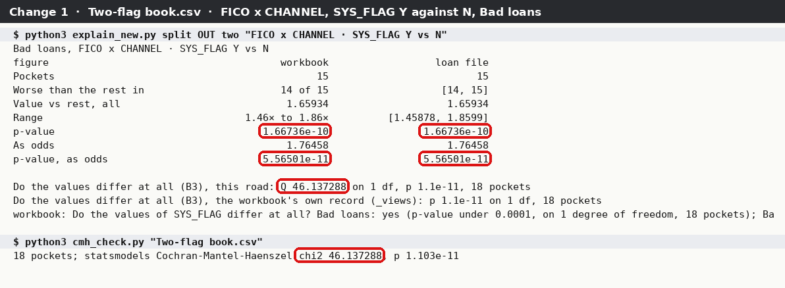
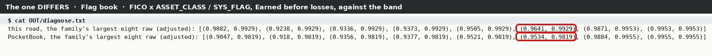
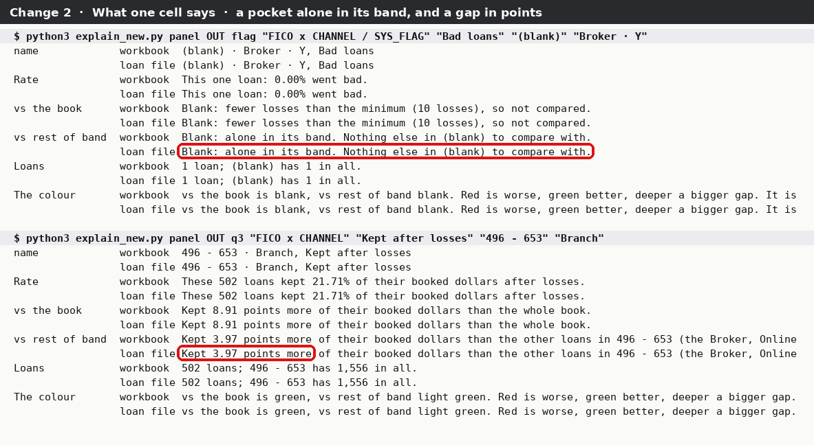
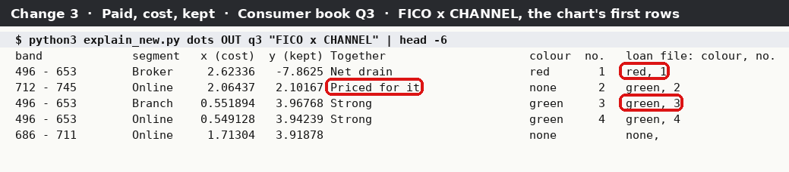
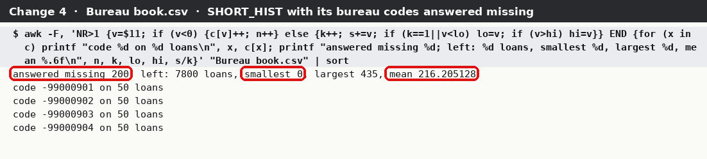

<div class="kicker">PocketBook · changes tie-out · 29 September 2026</div>

# What changed since the full tie-out, tied out to the loan files

<p class="lead">You asked on 29 September: "after all these changes and such I really think I should go through another tie out at least for the stuff that was changed". This covers the five changes that put figures on a tab, reads every figure they show, and works each one out a second time from the loan file with code that shares nothing with PocketBook. It also runs the whole 28 September tie-out again on this build, to show nothing that tied then differs now.</p>

<div class="meta">Build 05411391 (branch claude/keen-franklin-4l01un) · Runs made 29 Sep 2026 21:02–21:09 · Six made-up loan files: Consumer book Q3 (8,000 loans, the 28 Sep file byte for byte), Scouting book (12,000, the 28 Sep file byte for byte), Flag book and Two-flag book (8,000 each, Q3 plus a system flag), Bureau book (8,000, Q3 plus a bureau column) · 278 views calculated by LibreOffice 24.2 · Loan-file road: Python 3.11 csv module, numpy 2.4, scipy 1.17, statsmodels 0.15, scikit-learn 1.9, awk</div>

<div class="headline-box"><span class="big" data-tieout="headline"><!--HEADLINE--> cells read</span> across six workbooks and two Excel-style saves — every visible cell that holds a number, a digit, a verdict word or a sentence the changes added, under every choice of every dropdown. <b><!--COUNT:TIED--> tie</b> to the loan file and <b><!--COUNT:TIED-WITHIN-SAMPLING--> tie within sampling error</b> (p-values from shuffling, where two honest roads cannot land on the same digits). <b><!--COUNT:DIFFERS--> differ</b>: all of them one pocket's shuffled p-value landing just past the four-standard-error line, shared by 21 pockets through the allowance for many tests — sampling, not a bug (<i>What it found</i>, item 1). <b><!--COUNT:COULD NOT--> could not be checked</b>, the same four kinds as on 28 September. The rest are names, your own answers shown back, and words.</div>

## The tallies

Every line of `roster.csv` belongs to exactly one change. *Worked out both ways* is the denominator: every figure that has a second answer from the loan file. Names, your answers shown back and plain words are counted apart.

<!--CHANGES-->

By book and verdict:

<!--ROSTER-->

The **re-run** line is the 28 September tie-out done again on this build, plus every figure of the two new category-split books that the split did not make (their two-way grids, Start here, Control, Look, Record). Nothing in it differs.

## How the two roads meet

<figure class="diagram">
<svg viewBox="0 0 760 300" xmlns="http://www.w3.org/2000/svg" font-family="IBM Plex Sans, DejaVu Sans, sans-serif" font-size="11">
  <defs><marker id="a" viewBox="0 0 10 10" refX="9" refY="5" markerWidth="7" markerHeight="7" orient="auto"><path d="M0,0 L10,5 L0,10 z" fill="#16181b"/></marker></defs>
  <rect x="8" y="112" width="124" height="80" rx="4" fill="#fff" stroke="#16181b" stroke-width="1.5"/>
  <text x="70" y="136" text-anchor="middle" font-weight="600">six loan files</text>
  <text x="70" y="154" text-anchor="middle" fill="#525a64">Q3, Scouting,</text>
  <text x="70" y="169" text-anchor="middle" fill="#525a64">Flag, Two-flag, Bureau</text>
  <text x="70" y="184" text-anchor="middle" fill="#525a64" font-size="9.5">.csv, made-up</text>
  <text x="160" y="22" font-weight="600" fill="#7a2230" font-size="10" letter-spacing="1.5">ROAD 1 · WHAT POCKETBOOK SHOWS</text>
  <rect x="160" y="34" width="118" height="62" rx="4" fill="#f7f5f1" stroke="#8a919b"/>
  <text x="219" y="57" text-anchor="middle" font-weight="600">PocketBook Runs</text>
  <text x="219" y="73" text-anchor="middle" fill="#525a64">this build,</text>
  <text x="219" y="87" text-anchor="middle" fill="#525a64" font-size="9.5">the walk's own steps</text>
  <rect x="306" y="34" width="130" height="62" rx="4" fill="#f7f5f1" stroke="#8a919b"/>
  <text x="371" y="57" text-anchor="middle" font-weight="600">278 views</text>
  <text x="371" y="73" text-anchor="middle" fill="#525a64">every dropdown and</text>
  <text x="371" y="87" text-anchor="middle" fill="#525a64">Row/Column pick</text>
  <rect x="464" y="34" width="130" height="62" rx="4" fill="#fff" stroke="#16181b" stroke-width="1.5"/>
  <text x="529" y="57" text-anchor="middle" font-weight="600">every cell read</text>
  <text x="529" y="73" text-anchor="middle" fill="#525a64">named by the labels</text>
  <text x="529" y="87" text-anchor="middle" fill="#525a64">beside it</text>
  <path d="M132,130 C146,90 146,65 158,65" fill="none" stroke="#16181b" marker-end="url(#a)"/>
  <path d="M278,65 L304,65" stroke="#16181b" marker-end="url(#a)"/>
  <path d="M436,65 L462,65" stroke="#16181b" marker-end="url(#a)"/>
  <text x="160" y="216" font-weight="600" fill="#25644a" font-size="10" letter-spacing="1.5">ROAD 2 · THE SAME FILES, NOTHING OF POCKETBOOK'S</text>
  <rect x="160" y="228" width="300" height="62" rx="4" fill="#eef4f1" stroke="#25644a"/>
  <text x="310" y="249" text-anchor="middle" font-weight="600">by_hand_book · by_hand_look · by_hand_scout</text>
  <text x="310" y="265" text-anchor="middle" fill="#25644a">csv, numpy, scipy, statsmodels, scikit-learn</text>
  <text x="310" y="280" text-anchor="middle" fill="#25644a" font-size="9.5">its own 10,000 shuffles; B3 written from the textbook</text>
  <path d="M132,175 C146,230 146,258 158,258" fill="none" stroke="#16181b" marker-end="url(#a)"/>
  <rect x="620" y="130" width="130" height="66" rx="4" fill="#fff" stroke="#7a2230" stroke-width="2"/>
  <text x="685" y="152" text-anchor="middle" font-weight="700" fill="#7a2230">compare.py</text>
  <text x="685" y="169" text-anchor="middle" fill="#525a64">one verdict a cell</text>
  <text x="685" y="185" text-anchor="middle" font-family="IBM Plex Mono, DejaVu Sans Mono, monospace" font-size="10">roster.csv</text>
  <path d="M594,80 C640,90 680,100 685,128" fill="none" stroke="#16181b" marker-end="url(#a)"/>
  <path d="M460,258 C600,258 670,240 685,198" fill="none" stroke="#16181b" marker-end="url(#a)"/>
</svg>
<figcaption>Road 1 is PocketBook: its Runs write the workbooks, a copy is made for every choice an analyst can pick (including a Row and a Column on Grids), LibreOffice works every formula out as Excel would on opening, and every cell is read. Road 2 never imports PocketBook: it reads the loan file with Python's csv module and works each figure out again from the rules the tabs state in words. The loan file cannot agree with a mistake PocketBook made.</figcaption>
</figure>

The proof that Road 2 imports nothing of PocketBook's, run in this folder (no line matches, so grep exits 1):

```
$ grep -nE "^\s*(from|import)\s+pocketbook|sys\.path" by_hand_book.py by_hand_look.py by_hand_scout.py forest_scout.py cmh_check.py
$ echo $?
1
```

The scripts that do use PocketBook are on its side of the line, and say so at the top: `walk_bleed_run.py` and `make_scout_book.py` (they make the workbooks), `excel_save_check.py` (it runs PocketBook again after an Excel-style save) and `diagnose_family.py` (used once, to read PocketBook's own raw p-values for the one DIFFERS).

## The books

| Book | Loans | Made how | What it is for |
|---|---:|---|---|
| Consumer book Q3 | 8,000 | 28 Sep's file; the walk's first Run replayed on this build (`walk_bleed_run.py`) | the re-run of 28 Sep; the panel and the chart on a halves split |
| Scouting book | 12,000 | 28 Sep's file; `make_scout_book.py` on this build | the re-run of 28 Sep's new-variable workbook |
| Flag book | 8,000 | Q3 plus SYS_FLAG: Y or N, blank on every 97th loan, a bad loan a little likelier to be Y (`make_books.py`) | change 1 with three values (N, Y and the blank): "each value vs rest" |
| Two-flag book | 8,000 | the same SYS_FLAG with its blanks read as N | change 1 with two values: "Y vs N", and B3 on one degree of freedom |
| Bureau book | 8,000 | Q3 plus SHORT_HIST, 0 to 435 months, and four codes −99,000,901 to −99,000,904 on every 40th loan | change 4: Look with those codes answered Missing on Columns |

All four new books were run through the same walk as Q3: bands FICO and ORIG_BAL (FICO and SHORT_HIST for the bureau book), segments CHANNEL and ASSET_CLASS (CHANNEL alone for the bureau book), your answers on Control as on 27 September, FICO's −9999 answered Missing. This machine has no Tk, so the walk drives the launcher's `Flow` — the object the window draws and every launcher test drives — with the same calls in the same order, and picks the outcome and says yes, since this build no longer picks it for you.

## Change 1 · Split by a category column

**What was checked.** On both category books, every figure the split made: the Split tab under every Grid·value choice (12 on the Flag book, 8 on the Two-flag book) and every measure — the summary (Pockets, *Worse than the rest in*, *Value vs rest, all*, its range, the p-value, the odds and their p-value), *Same in every pocket?*, *Do the values of SYS_FLAG differ at all?*, and every pocket's gap and p-value with its brackets; the Pockets tab's *Split by SYS_FLAG* list under every measure; the four Grids split by SYS_FLAG under every measure, and *How common each group is* by value; SYS_FLAG on Columns; and Record's split, test and family lines.

**How Road 2 worked it out.** Each value's loans in a pocket against every other loan of that pocket, as Split!C4 says, with the same floors as any test (65 loans on each side, 10 losses between them). The value's rate over the rest's (a gap in points for Kept and Earned); the pooled two-proportion z test for bad loans; for a dollar rate, this road's own 10,000 shuffles of the loans inside each pocket; the value's actual total against what it would be at the rest's rates, with its range; Mantel-Haenszel's pooled odds with the Robins-Breslow-Greenland range and the Cochran-Mantel-Haenszel p (statistic from statsmodels, tail from scipy); Cochran's Q. One Benjamini-Hochberg family over every value and pocket of a grid and measure (Split!C8), and each pooled p-value a family across the values. *Do the values differ at all* is B3, the K-group Mantel-Haenszel test, written out here from docs/statistics.md: this road leaves out the first group where PocketBook leaves out the last, and the statistic does not depend on which, so the two agreeing is a check on both.

<!--EXCERPT:split-->

<figure class="wide"><figcaption>Two-flag book, FICO x CHANNEL, Y against N, Bad loans: the workbook's summary beside the loan file's. Ringed: the pooled p-value and the odds' p-value on both roads, B3's Q of 46.137288 on this road, and statsmodels' own Cochran-Mantel-Haenszel chi-square over the same 18 pockets, 46.137288 — with two values B3 is that test, as statistics.md says.</figcaption></figure>

**Result.** Every figure ties apart from 21 cells of one list, which differ by sampling (below). The *differ at all* line prints its p-value only as "under 0.0001"; the p-value itself, which the workbook keeps on its hidden `_views` sheet, was also set beside this road's for all 20 Grid·value choices: every one agrees to 1 part in 10¹⁴, with the same degrees of freedom and pockets (`results/b3-hidden.txt`; hidden cells are not counted on the roster).

**The DIFFERS.** Pockets tab, POCKETS *Split by SYS_FLAG*, MEASURE *Earned before losses* (view 09), column L (p-value), rows 82, 89, 95, 99, 104, 106, 109, 111, 119, 123, 126, 127, 133, 134, 137, 148, 149, 150, 151, 163, 165: the workbook shows **0.981865** in every one, this road **0.992883**, a gap of 0.0110 against a tolerance of 0.0108. All 21 are pockets of FICO x ASSET_CLASS / SYS_FLAG compared with their band, and all 21 take their allowance-adjusted p-value from one other pocket's raw p: Benjamini-Hochberg gives each p-value the smallest of *p × 69 / rank* over the ranks above it, and for all of them that is set by FICO 746 – 921 / ASSET_CLASS 1 / Y, 67th of 69. Its raw shuffled p-value is **0.9534** in PocketBook (read by running PocketBook's own engine, `diagnose_family.py`) and **0.9641** on this road: 4.1 standard errors apart, just over the four this tie-out allows. Every other raw p-value in the family agrees within 0.004. So it is one sampling draw, copied 21 times; both roads call every one of the 21 not significant, and no verdict, order or dollar figure moves.

<figure class="wide"><figcaption>The family, largest eight raw p-values with their adjusted ones, on this road and in PocketBook. Ringed: the pocket that sets the 21 cells, 0.9641 here and 0.9534 there.</figcaption></figure>

## Change 2 · Grids, "What one cell says"

**What was checked.** Six lines for every pick: the name, the rate, *vs the book*, *vs rest of band*, *Loans*, and *The colour*. 243 different picks across the three bleed books: every Grid × Measure view picks a different cell (view *i* picks the grid's inner cell 7*i*), and then, for every grid, extra views pick a pocket **alone in its band**, a pocket with loans whose comparison is **blank for too few losses**, a **one-loan** pocket and an **empty** pocket. Every sentence is compared whole, word for word.

**How Road 2 worked it out.** The words are the tab's own fixed sentences, transcribed (they are the same every Run); every number and every choice between them comes from this road's own grid figures: the rate to two places of a percent, each gap to two places (rounded half away from zero, as TEXT does), *more* or *less*, the loans with "This one loan" and "its" for one, the row's loans in all, which other pockets of the row have loans (named when one to three), and which blank it is — alone in its band when no other pocket of the row has loans, *fewer losses than the minimum (10 losses)* for a multiple, *not compared* for a gap in points. The colour is the heat scale's step for each gap: 2× and over the deepest red, 0.5× and under the greenest (Grids!C7), and the steps between from `results.HEAT_STEPS`, with a gap in points read against the largest in the grid.

<figure class="wide"><figcaption>Two picks, the workbook's line above the loan file's. Ringed: a pocket alone in its band — "Blank: alone in its band", with its book comparison blank for too few losses and the word "one loan" — and a gap in points on Kept after losses.</figcaption></figure>

**Result.** All 1,458 lines tie: 70 alone-in-band blanks, 110 too-few-losses blanks, 12 *not compared*, 130 one-loan lines, 31 empty pockets.

## Change 3 · Paid, cost, kept: the chart

**What was checked.** For every row of all four grids on the three bleed books: the dot's place on the chart's hidden sheet (x the row's charge-off multiple, y its kept gap), whether it is in the red series (H_RX/H_RY), the green one (H_GX/H_GY) or neither, that a coloured dot sits on the row's own point, its number (H_NUM), and the list *Numbered on the chart* under it.

**How Road 2 worked it out.** x and y are this road's own cost multiple and kept gap for the pocket; a pocket whose charge-offs have too few losses to test has no verdict and no dot. The colour follows this road's Together verdict with the words above the chart: red for *Net drain*, green for *Strong* or *Priced for it*. A row is numbered when it is among the first eight and has a verdict, and the list names the row that carries each number. The row order itself is the tab's and was not re-derived (as on 28 September).

<figure class="wide"><figcaption>Consumer book Q3, FICO x CHANNEL, the chart's first rows. Ringed: the Net drain dot, red and numbered 1 on both roads; a Strong dot, green; and 712 – 745 / Online, which this road reads <i>Priced for it</i> (green) and the workbook <i>Losing more, profit holding</i> (no colour) — the 28 September sampling flip, one shuffled p-value either side of 5%.</figcaption></figure>

**Result.** 978 tie; 6 tie within sampling — they are that one pocket's colour, the same flip 28 September found and put down to sampling.

## Change 4 · Look honours Treat as Missing

**What was checked.** On the Bureau book, with SHORT_HIST's negative values and FICO's −9999 answered Missing on Columns and the Run made: every Look block's Loans, Blank, Not a number, *Likely a code*, Smallest, Median, Mean, Largest and *Answered missing, left out* (count and share); every bar of every chart at the default Bars, From and To, and the loans below From and above To; the scatters' loans with both values, their correlation and the dots shown; every dot drawn, which must be a real loan's pair of values; and a survey of every cell of the calculated workbook, hidden sheets included, for a value at or below −1,000,000.

**How Road 2 worked it out.** From the CSV with the answered values taken out of everything but their own row; the bars counted in exact decimals; each dot looked up among the loans' own pairs.

<!--EXCERPT:look-->

<figure class="wide"><figcaption>awk on Bureau book.csv: SHORT_HIST's four codes on 50 loans each (none on 1% of the loans, so none is "likely a code"), 200 answered missing, and the 7,800 left: smallest 0, largest 435, mean 216.205128 — the workbook's C72, C75, C74 and C76.</figcaption></figure>

**Result.** All 153 figures tie, both scatters' 2,000 dots are real loans' pairs with no code in them, and the survey finds 20 cells at or below −1,000,000: the one it should (Columns!C23, the sample of SHORT_HIST's raw values, "-99000901, 121, 303") and 19 dollar figures — a pocket's shortfall in kept or bad dollars over $1 million, on Paid, cost, kept and the hidden record of every pocket — none of them a code. The same change shows on the re-run: FICO's −9999, answered Missing on the walk, is now *Answered missing, left out* (160 loans on Q3, 240 on the scouting book) where 28 September read *At −9999, likely a code*; the counts are the same loans and tie.

## Change 5 · Dropdowns after an Excel-style save

**What was checked.** On a copy of the Q3 workbook and of the Flag workbook: every dropdown's sheet, cells, list formula (and, for a typed number, its rule), and the items its list shows once calculated — before, and after the workbook was rewritten the way Excel saves it (`_as_excel_saves_it` from the tests) and run again.

**Result.** 41 dropdowns on each book. The Excel-style save moved 23 of them into Excel's extension block, where openpyxl alone sees only the other 18 — the bug the bank hit. After the next Run all 41 are back, each with the same cells, formula and items (Grid's Row and Column lists included), and none added. Both roads here are PocketBook's own workbook before and after, so this is a before-and-after check rather than a loan-file one. And the second Run wrote every one of the 1,520 (Q3) and 2,144 (Flag) figure rows on `_views` identically, since the shuffles are seeded.

## Changes that carry no figures

These changed since 28 September and put no number on a tab, so they were not tied out. The tests that cover them, in `tests/test_firm_answers_2026_09_29.py` unless said:

- **The outcome is never picked for you**, and a pick is asked about in counts: `test_nothing_is_picked_as_the_outcome_and_a_pick_is_asked_about_in_counts`, `test_the_picked_outcome_goes_on_columns_and_the_run_reads_it`, `test_a_column_name_is_read_as_words_not_as_letters_run_together`. It shows on the re-run in words only: Columns!E17 now reads *picked and confirmed in the launcher as the outcome*.
- **All · None buttons**: `test_all_and_none_tick_every_input_or_none_and_all_leaves_hold_fixed_alone`, `test_all_and_none_for_the_bleeds_bands_and_segments_leave_the_split_alone`.
- **Columns hides the columns the Run doesn't use**: `test_columns_hides_what_the_launcher_didnt_pick_and_asks_nothing_about_it` (on the Flag book REV_DEBT's row is hidden; hidden rows are not surveyed).
- **No axis titles on Look's charts and on Paid, cost, kept's**: `test_look_charts_have_no_axis_title_for_excel_to_draw_over_the_numbers`; `tests/test_result_tabs.py::test_the_scatter_colours_by_verdict_numbers_its_named_pockets_and_lists_them_under_it`.

## The re-run of 28 September

The Q3 and scouting workbooks were made again on this build from the same loan files (the scouting file matches 28 September's once line endings are set aside), every view calculated again, and every cell 28 September read looked up again by what it is — its tab and name, not its row, since blocks on Grids moved down under the new panel.

<!--RERUN-->

- **Tied then, not now: none.** Every numeric figure 28 September read on the Q3 workbook is the same number on this build, the shuffled p-values included (they are seeded).
- **Verdicts that moved** all moved toward a tie: 117 split gaps shown as plain numbers now read TIED where 28 September said *within sampling* (the comparison now judges the number exactly; see *What I got wrong*), two Record lines now have a figure to tie to, and on the scouting book the 16 Look bars that differed on 28 September now tie — the bug 28 September found in `look.py` was fixed after that Run, and this road now counts in exact decimals.
- **Not on this build** (10 on Q3, 12 on scouting): the Look row *At −9999, likely a code* and its bar, replaced by *Answered missing, left out* (change 4); Columns!E17's *why* (the outcome now picked in the launcher); Grids!C7's note, which now names both blanks (change 2); and the Run's date and time in headings.
- **Figures that moved**: on Q3, only the Run's date and time. On the scouting book, the date and time, the pre-spec's fingerprint (it holds the date it was written), and 15 of UTIL's 20 Look bars, by one to five loans each — the bar-edge fix above; all 20 now tie.

## How we know nothing was skipped

`completeness.py` opens every calculated view with openpyxl alone and looks each visible cell up in `roster.csv`.

| Workbook | Numbers checked in their own view | In another view | Numbers never checked |
|---|---:|---:|---:|
| Consumer book Q3, 86 views | 11,859 | 57,641 | **0** |
| Flag book, 106 views | 14,960 | 86,639 | **0** |
| Two-flag book, 86 views | 12,477 | 57,661 | **0** |
| Scouting book | 528 | — | **0** |

It also lists every text in the result tables the roster never names — 304, 313, 304 and 296 distinct texts — and every one was read: headings, labels, segment names, the tabs' explanations, your settings shown back, and the *Forget?* column (No until you answer). The Bureau book was read on Look only (the rest of it is Q3's shape) and the survey for codes covers all of it.

## Planted errors

`mutate.py` plants a wrong value in figures read out of the workbook and asks the comparison to catch it: a number 0.5% off, a count one off, a verdict word swapped, a shuffled p-value halved, a digit changed in a sentence, a dot's colour or number changed, a code put among the dots or on a tab.

| Planted in | Planted | Caught | Missed, and what |
|---|---:|---:|---|
| any figure, Q3 / Flag / Two-flag / Scouting | 800 | 797 | a shuffled p-value halved (twice), the Run's clock |
| only what the changes added (panel, split, dots, list, groups), three books | 600 | 582 | 18 shuffled split p-values halved |
| Look, the bureau book | 141 | 139 | two correlations moved 0.5%, invisible at two places |
| dropdowns, both books | 246 | 246 | — |

The 18 are the known limit of shuffled p-values: the allowance multiplies a small raw p-value by its family's size, and its sampling error with it, so halving 0.009 to 0.004 in a family of 69 is inside what two honest shuffles can disagree by. Everything worked out without randomness catches every plant.

## How to run it yourself

Everything runs from this folder, `pocketbook/docs/tie-out/2026-09-29-changes/`. The loan files and workbooks are beside the scripts; the Q3 loan file is 28 September's, `../2026-09-28/Consumer book Q3.csv`.

**Step 1 · Everything** (about forty minutes on four cores; `work` is any folder for the in-between files).

```
sh run-it-all.sh work
```

**Step 2 · One figure by hand: SHORT_HIST without its codes.** Expect 200 answered missing, 7,800 left, smallest 0, largest 435, mean 216.205128.

```
awk -F, 'NR>1 {v=$11; if (v<0) n++; else {k++; s+=v}} END {print n, k, s/k}' "Bureau book.csv"
```

**Step 3 · B3 on two values is Cochran-Mantel-Haenszel.** Expect 18 pockets, chi-square 46.137288.

```
python3 cmh_check.py "Two-flag book.csv"
```

**Step 4 · The workbooks again from nothing** (optional):

```
python3 make_books.py "../2026-09-28/Consumer book Q3.csv" "/tmp/credit/Flag files"     # then copy each .csv to its folder
python3 walk_bleed_run.py ../../../src OUT "/tmp/credit/Loan files"
python3 walk_bleed_run.py ../../../src OUT "/tmp/credit/Flag files" SYS_FLAG "Flag book.csv"
python3 walk_bleed_run.py ../../../src OUT "/tmp/credit/Two-flag files" SYS_FLAG "Two-flag book.csv"
python3 walk_bleed_run.py ../../../src OUT "/tmp/credit/Bureau files" REV_DEBT "Bureau book.csv" FICO,SHORT_HIST CHANNEL SHORT_HIST
python3 make_scout_book.py ../../../src "/tmp/credit/Scout files"
```

**Step 5 · The PDF again:** `python3 pictures.py work && python3 build.py results/tallies.json` (needs Chromium; as root, point CHROME at a two-line script that runs it with `--no-sandbox`).

<h2 data-tieout="what-it-found">What it found</h2>

1. **One sampling draw, copied 21 times by the allowance.** On the Flag book's Pockets list split by SYS_FLAG, under Earned before losses, 21 pockets show 0.981865 where this road has 0.992883. They all take their adjusted p-value from one pocket's raw one (FICO 746 – 921 / ASSET_CLASS 1 / Y): 0.9534 in PocketBook, 0.9641 here, 4.1 standard errors apart. It is not a fault in either road — PocketBook's own raw p-values, read by running its engine, agree with this road's everywhere else in the family — but it is worth knowing how it arises: the allowance for many tests hands one pocket's sampling error to every pocket it sets, so one borderline draw shows up as a block of identical differences. No verdict moves: all 21 are nowhere near 5%.
2. **Every figure the category split puts on a tab ties**, including the new test of whether the values differ at all (to 1 part in 10¹⁴ on its hidden p-value, and exactly equal to statsmodels' Cochran-Mantel-Haenszel when there are two values), the one family across values and pockets, and the pooled p-values' own allowance across the values.
3. **"What one cell says" says what the blocks show**, word for word, on 243 picks, and gives the right reason for each blank: alone in its band, too few losses, or not compared.
4. **The chart colours and numbers its dots by the verdicts the table prints.** The only disagreements are the sampling flip 28 September already found.
5. **Look no longer shows an answered-missing bureau code** in any statistic, bar or dot; a code survives only in Columns' sample of raw values, where it belongs.
6. **The dropdowns survive an Excel-style save and a Run**, all 41, with the same items.
7. **Nothing that tied on 28 September differs on this build.** Every number is the same; the rows that changed are the changes' own.

<h2 data-tieout="what-i-got-wrong">What I got wrong</h2>

- **My Look bars first differed from the scouting workbook by one loan on three bars.** 28 September found the cause — a bar's start read back out of the workbook as 0.6000000000000001 — and this road still counted in floating point. It now counts in exact decimals, and all 20 bars tie.
- **My first reader broke on the category books.** It found cells by fixed rows, and a category split's tabs carry one more line of notes, so every row below moved. The reader now finds each block by its label, and names Record's figures by the label they sit under rather than their cell.
- **My tolerance for a shuffled p-value after the allowance was too tight in one case, and I first loosened it the wrong way.** An adjusted p-value can be set by another pocket's raw p, whose sampling error is larger. I first made the tolerance follow the pocket that sets it — right — and then found the planted-error check missing more split gaps than on 28 September. The reason was older: the comparison judged a split gap shown as a plain number by its p-value's sampling tolerance, which let any number through. A gap is now compared exactly, and must be significant on both roads (or its p-values within sampling). That is why 117 cells moved from *within sampling* to *tied* against 28 September.
- **My first chart check expected a dot for every row.** A row with too few losses to test its charge-offs has no verdict and PocketBook draws no dot for it; 18 cells read DIFFERS until this road left those rows out too.
- **I first wrote the survey for −1,000,000 as the brief worded it,** and it found 20 cells, not one. The other 19 are dollar shortfalls over $1 million, not codes; the check now looks for a code or anything at −99,000,000 or below, and the report lists all 20.

<h2 data-tieout="what-this-does-not-prove">What this does not check</h2>

- **Not a second method where the tab gives none.** Where the tabs state a rule in words, this road follows the words. Where they stop — which pockets make a family, the variance behind the split's range, the heat scale's middle steps, which rows the chart numbers — I read PocketBook's code for the definition and wrote it again. A tie there proves the arithmetic, not the choice.
- **Shuffled figures only within sampling error**, and loosely when an allowance multiplies them (the 18 missed plants above). One pocket's shuffled p-value sits just past the line; see *What it found*.
- **Not the words of the panel, only their arithmetic.** The sentences' fixed words were transcribed from the tab; whether they read well is not a tie-out question.
- **Change 5 has no loan-file side.** It compares the workbook with itself before and after the save; it does not open the file in Excel, only rewrites it the way the tests say Excel does.
- **Not Excel.** LibreOffice 24.2 worked the formulas out.
- **Not a real extract.** Six made-up files, and a category with at most three values (the Run refuses more than six; that refusal is covered by `test_category_split_too_many_values_is_refused_in_words_in_the_launcher_and_at_the_run`, not tied out here).
- **Not the window.** The walk drove the launcher's logic without its window, since this machine has no Tk; the window's own tests cover it.
- **Not the hidden sheets as figures.** They were read to check the chart's dots, the Look bars and dots, the survey for codes, B3's p-value and the one DIFFERS; no hidden cell is counted on the roster except the chart's dots and Look's bars, which are what the charts draw.
- **Not the 702 tie-out checks, the noise floor, the income bins or the suggested worse-at line**: the same COULD NOTs as 28 September, below.

## The COULD NOTs

| Cells | Which, and why |
|---:|---|
| 3 | Record!C25 on Q3, Flag and Two-flag, *702 tie-out checks*: the count of checks PocketBook ran on itself; nothing outside PocketBook says how many there should be. What they claim — every grid adds up to the book — is tested directly: every loans and dollars cell of every grid ties. |
| 2 | Scouting!C10 and G19, the noise floor: the largest of 24 importances with the outcomes shuffled; no small sampling error to call a tie against. |
| 1 | Scouting!F25, income_to_sales' suggested bins: the tab's words don't say how two close cuts are merged. |
| 1 | Control!I15 on the scouting book, the suggested worse-at line: the tab doesn't say which groups are typical or at what power. |
