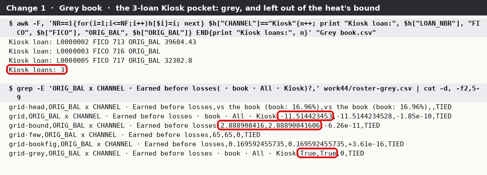
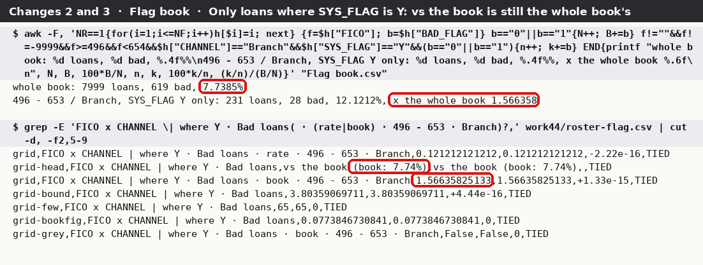
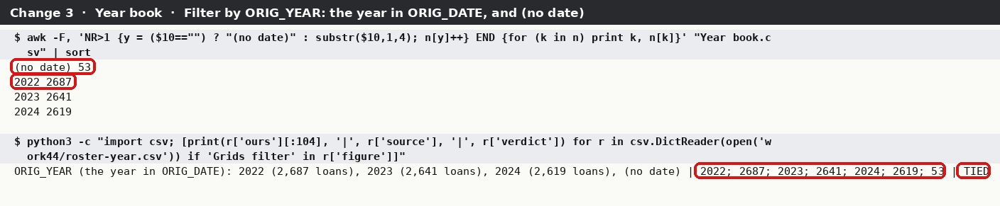
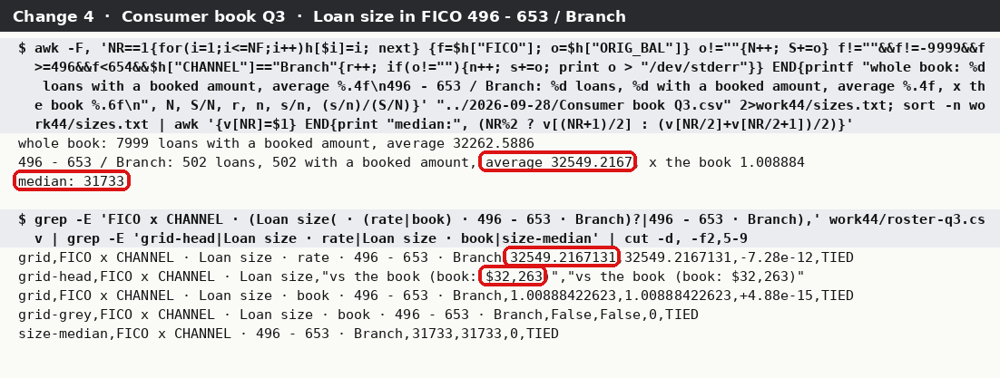
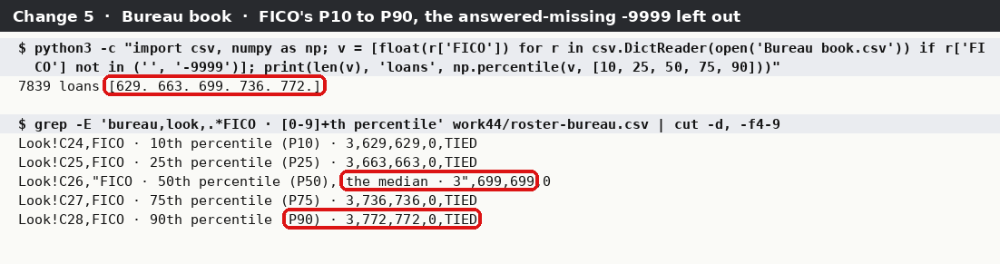
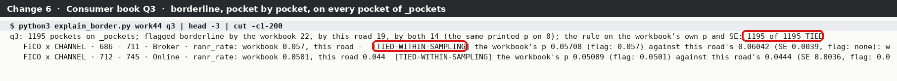
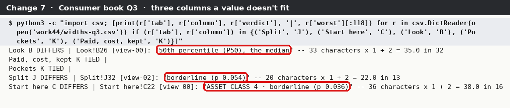
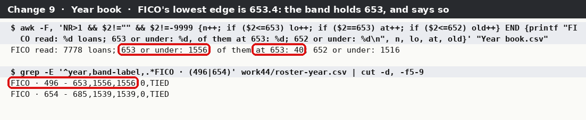

<div class="kicker">PocketBook · evening tie-out · 30 September 2026</div>

# Everything built on the evening of 29 September, tied out to the loan files

<p class="lead">You asked for a tie-out of everything built tonight. On the build tied out, 44734da4, that is nine things: Grids greys its thin cells, gives the book's own figure in a heading, shows a grid on only the loans with one value of a column — now picked on its own as <i>Filter by</i>, the origination year included — and shows loan size; Look draws the percentiles and short labels under its bars; every verdict that turns on a shuffled p-value near the bar is flagged <i>borderline</i>; the column widths were refitted; the origination year can split every pocket; and a band on a whole-number column is labelled by the values it holds. Each figure these put on a tab was read out of the workbook and worked out a second time from the loan file, by code that shares nothing with PocketBook. The column widths carry no figures, so they were measured instead. The 29 September tie-out was also run again on this build, on its own views, to show that nothing which tied then fails now.</p>

<div class="meta">Build 44734da4 (branch claude/keen-franklin-4l01un; the first pass was on b0ff186a, and every workbook was made again on 44734da4) · Runs made 30 Sep 2026 04:02–04:36 · Eight made-up loan files: Consumer book Q3 (8,000 loans, the 28 Sep file byte for byte), Scouting book (12,000), Flag, Two-flag and Bureau books (8,000 each, the 29 Sep files byte for byte), and three new ones: the Grey book (Q3 with three loans moved to a channel of their own) and the Year and Year-split books (Q3 made again over 2022–2024) · 1,501 views calculated by LibreOffice 24.2 · Loan-file road: Python 3.11 csv module, numpy 2.4, scipy 1.17, statsmodels 0.15, scikit-learn 1.9, awk</div>

<div class="headline-box"><span class="big" data-tieout="headline"><!--HEADLINE--> cells read</span> across eight workbooks — every visible cell that holds a number, a digit, a verdict word or a sentence, under every choice of every dropdown; every pocket on the hidden list the borderline flags are counted from; and one line for every column of every visible tab, for the widths. <b><!--COUNT:TIED--> tie</b> to the loan file and <b><!--COUNT:TIED-WITHIN-SAMPLING--> tie within sampling error</b> (p-values from shuffling, where two honest roads cannot land on the same digits). <b><!--COUNT:DIFFERS--> differ</b>, three kinds: the Flag book's one sampling draw that 29 September chased down with a million shuffles a road, now also showing in its standard error (52 cells); one loan of $37,950.99 that sits under a band label starting at $37,951 (two cells a book: <i>What it found</i>, item 3); and columns too narrow for what they show, three of them clipping a value an analyst needs. <b><!--COUNT:COULD NOT--> could not be checked</b>, the same kinds as on 29 September.</div>

## The tallies

Every line of `roster.csv` belongs to exactly one change. *Worked out both ways* is the denominator: every figure that has a second answer from the loan file. Names, your answers shown back and plain words are counted apart. A line for change 7 is one column of one tab of one book, TIED when everything it shows in every view fits.

<!--CHANGES-->

By book and verdict:

<!--ROSTER-->

The **re-run** line is every other figure of the eight workbooks — the 29 September checks, done again on this build — and the three *29 Sep's views* columns are those books read again under exactly the dropdown picks 29 September read, so its roster can be matched cell for cell (below).

## How the two roads meet

As on 29 September. **Road 1** is PocketBook: its Runs write the workbooks, a copy is made for every choice an analyst can pick (tonight that includes *Only loans where* and the new *Loan size* measure), LibreOffice works every formula out as Excel would on opening, and every cell is read. **Road 2** never imports PocketBook: it reads the loan file with Python's csv module and works each figure out again from the rules the tabs state in words.

The proof that Road 2 imports nothing of PocketBook's, run in this folder (no line matches, so grep exits 1):

```
$ grep -nE "^\s*(from|import)\s+pocketbook|sys\.path" by_hand_book.py by_hand_look.py by_hand_scout.py forest_scout.py look_extra.py cmh_check.py
$ echo $?
1
```

`walk_bleed_run.py` and `make_scout_book.py` make the workbooks, `excel_save_check.py` runs PocketBook again after an Excel-style save: they are on PocketBook's side of the line and say so. `widths_check.py` is on neither road: it measures what LibreOffice displays against the widths the workbook sets.

## The books

| Book | Loans | What it is for tonight |
|---|---:|---|
| Consumer book Q3 | 8,000 | every change on a halves split (REV_DEBT); the re-run |
| Grey book | 8,000 | Q3 with the first three loans of FICO 712 – 745 moved to a channel of their own, *Kiosk*: a 3-loan pocket, far under the Run's 65 fewest loans, whose −11.51-point gap would otherwise set the heat's scale |
| Flag book, Two-flag book | 8,000 | split and **filtered** by SYS_FLAG (N, Y and blank; N and Y): every block of every grid for every value |
| Year book | 8,000 | Q3 with every origination date drawn again over 2022–2024 and every 151st blank (53 loans, *(no date)*), and the 61 highest FICOs blanked so that FICO's lowest band edge falls between whole numbers (653.4). Split by REV_DEBT (a number) and **filtered by ORIG_YEAR**, at the same time |
| Year-split book | 8,000 | the same loans, **split by ORIG_YEAR**: every year and *(no date)* against the rest of its pocket, and whether the years differ at all |
| Bureau book | 8,000 | Look's new rows with an answered-missing code in play (SHORT_HIST, FICO) |
| Scouting book | 12,000 | the re-run of the new-variable workbook, Look's new rows on six columns, and Record's new rows on a Run with no grids |

Every workbook was made on 44734da4 with the same walk as on 29 September (`walk_bleed_run.py`, `make_scout_book.py`): bands FICO and ORIG_BAL, segments CHANNEL and ASSET_CLASS, your answers on Control as on 27 September, FICO's −9999 answered Missing, fewest loans *Enough for 5 expected losses*, which these books work out as 65. The walk picks *Filter by* the way the window does (`Flow.click(column, "d")`).

## Change 1 · Grids: grey thin cells

**What was checked.** In every view of every grid, whole and filtered, under every measure including Loan size: whether each number in *vs the book* and *vs rest of band* is grey; the fewest loans the grey rule reads; the bound the heat's colours are scaled to; and, where the picked cell is thin, What one cell says' colour line.

**How.** The workbook greys a cell by a conditional format that compares the Loans block's cell in the same place with the fewest loans (a hidden cell). The reader applies that rule to the calculated values; Road 2 says grey when the pocket's loans are fewer than 65, the fewest loans it works out itself from the book (5 expected losses at the book's bad rate, rounded up: Record's own words). The bound is the largest gap in either block over the cells **not** grey — in points for Kept and Earned, as a multiple otherwise — at least 0.01; Loan size has no heat scale and its bound is 1.

<figure class="wide"><figcaption>The Grey book. awk finds the three Kiosk loans; the All/Kiosk pocket of ORIG_BAL x CHANNEL, Earned before losses, is −11.51 points against the book on both roads, and grey on both; the heat's bound is 2.889 on both roads — had the grey cell been let in, it would be 11.514.</figcaption></figure>

**Result.** Every grey flag ties: **38,012** numbers across six books, 6,494 of them grey. All 720 bounds tie; on the Grey book seven are ones a grey cell would have set, and the bound worked out over every cell, grey ones included, is caught wherever it was planted. All 381 grey colour lines tie.

## Change 2 · The book's figure in the heading

**What was checked.** The heading *vs the book (book: 7.74%)* in every view — every measure, Loan size included (*book: $32,263*), and every *Only loans where* value — and the figure behind it.

**How.** Road 2's book rate for each measure (the book's sum over the sum it divides by), printed as TEXT does: two places of a percent, or whole dollars for the average loan. On a filtered view it is still the **whole** book's: the note on Grids says *vs the book is still against the whole book*.

**Result.** All 720 headings and the 720 figures behind them tie. The value's own rate planted in a filtered view's heading is caught everywhere.

## Change 3 · Filter by: Only loans where a column is a value

**What was checked.** On the Flag and Two-flag books (filtered by SYS_FLAG: N, Y, blank) and the Year book (filtered by ORIG_YEAR: 2022, 2023, 2024 and *(no date)*, while REV_DEBT splits every pocket in halves), every grid — two-way and split — under every measure and every value: every cell of Rate, vs the book, vs rest of band and Loans; What one cell says for the picked cell, its name ending *, only loans where ORIG_YEAR is 2023*; and Record's *Grids filter* line with each value's loans.

**How.** Road 2 keeps the value's loans and nothing else, then works every block as for the whole grid: the rate from those loans; *vs the book* against the **whole** book's rate; *vs rest of band* against the other loans of the band **among those loans**; the loans. A loan's ORIG_YEAR is the first four characters of its ORIG_DATE, and *(no date)* when it has none — the launcher's own words, "Origination year, from ORIG_DATE" — worked out from the file, never read from the workbook. The filter reads its own column, whatever the split does: on the Year book the split is REV_DEBT's halves, on the Flag books SYS_FLAG.

<figure class="wide"><figcaption>Flag book, FICO 496 – 653 / Branch, only loans where SYS_FLAG is Y. awk: 231 loans, 28 bad, 12.12%, 1.566358 times the whole book's 7.74%. Ringed: the same multiple on the tab, and the heading still giving the whole book's 7.74%.</figcaption></figure>

<figure class="wide"><figcaption>The Year book. awk reads each loan's year from ORIG_DATE, and <i>(no date)</i> where it has none: 2,687, 2,641, 2,619 and 53. Ringed: the same on Record's <i>Grids filter</i> line, tied.</figcaption></figure>

**Result.** All **28,912** cells tie — 14,404 on the Year book (2022: 3,934; 2023: 3,970; 2024: 3,972; *(no date)*: 2,528), 8,280 on the Flag book, 6,228 on the Two-flag book — and all 2,096 panel lines and every *Grids filter* line (*"2022 (2,687 loans), 2023 (2,641 loans), 2024 (2,619 loans), (no date) (53 loans)"*). *vs the book* taken against the value's own loans instead of the whole book is caught in every cell where the two differ.

## Change 4 · Loan size

**What was checked.** Under the Loan size measure, in every grid, whole and filtered: the average booked per loan (the Rate block), the multiple of the book's average (*vs the book*), the multiple of the rest of the band's average (*vs rest of band*), the median (on the hidden sheet: the panel shows it), and What one cell says' two sentences — *"These 502 loans averaged $32,549 booked, median $31,733."* and *"1.01× the average loan of the whole book."* — with *"No red or green: loan size is a description, not a finding."* for its colour and *"Blank: not compared."* where a comparison is blank.

**How.** Only loans with a readable booked amount count: the Q3 file has one loan with ORIG_BAL blank, and it is in the Loans block but in no average, so every average of a cell that holds it tests the exclusion. The rest of the band is the band's loans with a booked amount less the cell's, and a cell alone in its band has none.

<figure class="wide"><figcaption>Consumer book Q3, FICO 496 – 653 / Branch. awk: 502 loans with a booked amount, average 32,549.2167, median 31,733; the whole book 7,999 loans (one blank left out), average 32,262.59. Ringed: the same average, heading and median on the tab.</figcaption></figure>

**Result.** All 12,937 Loan size cells, 4,800 medians and 1,184 panel lines tie. An average that counts the blank loan as $0 is caught in every cell it touches.

## Change 5 · Look: percentiles, grey lines, short labels

**What was checked.** On every Look block of all eight books: P10, P25, P50, P75 and P90; where each percentile's grey line is drawn; and the label under each bar.

**How.** PERCENTILE.INC, which is numpy's default "linear", over the values Look draws — an answered-missing value (FICO's −9999, SHORT_HIST's bureau codes) left out. A line sits at 10 + 0.5 + 100 × (value − From) / (To − From) on the chart's 120 slots, and none outside From…To. A bar's label is its start: 24k for 24,000, 1.2M for 1,200,000, with the decimals the step between two of the five labels needs, and under 1,000 the column's own format (a FICO 620, a ratio 0.53).

<figure class="wide"><figcaption>The Bureau book's FICO without its 160 answered-missing −9999s: numpy gives 629, 663, 699, 736 and 772, the five figures on the tab.</figcaption></figure>

**Result.** Every percentile, grey line and label ties: 170 percentiles, 170 lines and 680 labels.

## Change 6 · Borderline

**What was checked.** Every verdict the tabs print in words: *Worse?* on Pockets (every pocket of every measure, two-way and split), *Together* on Paid, cost, kept, every p-value cell of Split (the pockets' and the summary's), the tile *4 of 81 · 1 borderline* and the five largest on Start here, and Record's *Borderline now* lines. And behind them, every pocket on the hidden list `_pockets` — 8,485 across six books: the borderline p-value it prints, the one *Worse?* prints, and the standard error of the p-value that decides.

**How.** docs/statistics.md B2a, in Record's own words: a verdict is borderline when the p-value that decides it came from shuffling and sits within 2 of its own standard errors of the 5% bar, either side, and its word turns on that p-value. The standard error is √(p(1 − p)/10,000), and after the allowance for many tests it is the standard error of the raw p-value that **set** the adjusted one — Benjamini-Hochberg gives each p-value the smallest p₍ⱼ₎ × m / j at or above its rank — times that m / j; none where the allowance capped it at 1. The printed p is three decimals, or four where three would land on the bar ("0.0501").

Two roads that shuffle independently cannot be expected to flag the same pockets: a pocket near 5% ± 2 SE is exactly the one another 10,000 shuffles move across the edge. So each flag was checked twice. **Exactly**: what the workbook printed must be what the rule gives the workbook's *own* p-value and standard error — 8,485 pockets, every one TIED — and the standard error must be the rule's for that p-value at some rank of its family. **Against this road**: where the two roads' flags or printed p-values differ, the two p-values must agree within the sampling tolerance of the p-value that sets them; a count is TIED within sampling only when every pocket whose flag differs is.

<figure class="wide"><figcaption>Consumer book Q3: 1,195 pockets. The workbook flags 22 and this road 19, 14 of them both; the rule on the workbook's own p and SE gives what it printed on all 1,195. Ringed: that count, and the first pocket the two roads flag differently — PocketBook's p 0.05708 against this road's 0.06042, within sampling.</figcaption></figure>

**Result.** Every flag the rule gives the workbook's own numbers is the flag it printed, on all 8,485 pockets and in every place it shows. Against this road every difference is within sampling (per book: 22/19/14 on Q3, 21/17/11 Flag, 22/20/16 Two-flag, 23/20/15 Grey, 20/17/14 Year, 13/17/8 Year-split — flagged by the workbook, here, by both) except one block of 31 standard errors on the Flag book, below.

**The DIFFERS.** Flag book, `_pockets`, 31 pockets of FICO x ASSET_CLASS / SYS_FLAG under Earned before losses compared with their band (rows 678, 688, 693, 698, 718, 723 and 25 more, listed in `roster.csv`): the workbook's standard error is **0.00217062**, this road's **0.00191585**. Each is exactly the rule's for its own road's setter, FICO 746 – 921 / ASSET_CLASS 1 / Y, at rank 67 of 69 — the pocket 29 September ran a million shuffles a road on, whose raw p-value the Run's 10,000 shuffles put at 0.9534 and this road's at 0.9641, against a converged 0.9603. The same draw gives the 21 DIFFERS on the Pockets list that 29 September reported (the re-run, below). No verdict moves: these p-values are near 1, nowhere near borderline.

## Change 7 · Column widths

**What was checked.** Every value shown on every visible tab of every view of all eight workbooks, as LibreOffice displays it (exported "as shown", the survey's own method), against the width of its column: a merged cell against its columns together, hidden rows and columns left out. And the Grids rule G1/G2/G5: every data column of the four blocks one width, both label columns one width.

**How.** The survey's rule (docs/column-widths-survey-2026-09-29.md, *How to read a width*): a width is about one character of Calibri 10 or Arial bold 9 (scaled for other sizes), so a cell needs its characters + 2, and a left label with an indent + 3. A number never runs into its neighbour; text that doesn't wrap may run on into empty cells beside it, but not past a merge or a cell holding a formula; wrapped text must fit its row's height. One line per column, TIED when everything it shows in every view fits.

<figure class="wide"><figcaption>Consumer book Q3. Ringed: the three values that don't fit their columns. Pockets' Worse? and Paid, cost, kept's Together, which the build fitted to the borderline words, fit.</figcaption></figure>

**Result.** The four Grids blocks share one data width (13 on every book) and one label width (20): TIED on all seven books with grids. Of the columns that differ, most differ by the rule's padding only (a heading of 11 characters in a column 11 wide), in prose (the rule counts a character of prose as wide as a digit, which overstates it), or on tabs the survey left alone. These are the ones where a value does not fit at all:

| Tab · column | Shows | Needs | Width | Books |
|---|---|---:|---:|---|
| Split · the p-value grids' data columns (I to L) | "borderline (p 0.054)" | 22 | 13 | every book with a split |
| Start here · C, the five largest's segment | "ASSET_CLASS 4 · borderline (p 0.036)" | 38 | 16 | every bleed book |
| Look · B | "50th percentile (P50), the median" | 35 | 32 | all eight |
| Paid, cost, kept · B | the tab's own title in Arial 16 | 30 | 20 | every bleed book |
| Start here · D:E (a tile) | "Dollars above their share, in those" | 35 | 30 | every bleed book |

The first two are the borderline words meeting the widths: the merge fitted *Worse?* and *Together* to them, but Split's p-value grids keep one data width sized to the column labels and "under 0.01%", and Start here's segment column to the segments alone. Every table is in `results/widths-*.csv`.

## Change 8 · ORIG_YEAR as Split by

**What was checked.** On the Year-split book, everything the split makes: the Split tab under every Grid·value choice (*FICO x CHANNEL · ORIG_YEAR 2022 vs rest*, … *(no date) vs rest*) and every measure — the summary, *Same in every pocket?*, *Do the values of ORIG_YEAR differ at all?*, every pocket's gap and p-value with its brackets; the Pockets list *Split by ORIG_YEAR*; and the four grids split by ORIG_YEAR.

**How.** As 29 September's category split, with ORIG_YEAR worked out from ORIG_DATE: each year's loans in a pocket against every other loan of that pocket, *(no date)* a value of its own; one Benjamini-Hochberg family over every value and pocket of a grid and measure; *differ at all* is B3, the K-group Mantel-Haenszel test written here from the textbook, over the four values (three degrees of freedom).

**Result.** Everything ties: 2,100 split pocket figures, 364 summary figures, all 16 *differ at all* sentences (*p-value 0.6661, on 3 degrees of freedom, 18 pockets* on FICO x CHANNEL), all 16 *same in every pocket* lines, and the 12,070 figures of the three-way grids and the Pockets list split by ORIG_YEAR.

## Change 9 · Band labels on whole-number columns

**What was checked.** Every band label of every grid on the six grid books, against the loans its band holds: the loans whose value lies inside the label's own range, counted from the file, must be the loans in the band — this road's band, cut by the edges, with its smallest and largest value inside the label.

**How.** Road 2 cuts the bands at the equal-loan edges and labels a whole-number column's band by the values it holds (the change's words): a band starting at an edge of 653.4 holds 654 first, and the band below ends at 653. The Year book was made so FICO's lowest edge is 653.4: the build before labelled it *496 - 652* and put the 40 loans at 653 in it.

<figure class="wide"><figcaption>The Year book. awk: 1,556 loans have a FICO of 653 or under, 40 of them at 653, and 1,516 of 652 or under. Ringed: the label <i>496 - 653</i> and its band's 1,556 loans on both roads — the label the build before printed, <i>496 - 652</i>, would leave the 40 out.</figcaption></figure>

**Result.** Every FICO label ties on all six books, the Year book's *496 - 653* / *654 - 685* included (1,556 and 1,539 loans, inside and by the edges alike); the old label *496 - 652*, planted, holds 1,516 and is caught. On ORIG_BAL, a column with cents, which the change leaves alone, one label on every book is one loan out — item 3 of *What it found*.

## The re-run of 29 September

29 September's own views — every dropdown and Row/Column pick it read on the Q3, Flag and Two-flag books — were set again on 44734da4 and read; the Bureau and Scouting workbooks have one view each, and the Excel-style saves were made again. Every cell of 29 September's roster was then looked up in tonight's by what it is (its tab and its name: grid, measure, pocket, column):

<!--RERUN-->

**Nothing that tied on 29 September fails now.** Where a figure or verdict moved, the change is tonight's own:

- **Borderline words**: a *Worse?*, a *Together*, a split p-value or a Start here tile that now carries *· borderline (p 0.048)*; these move from TIED to *within sampling* because the flag itself is judged against the other road's shuffles.
- **Grey**: What one cell says for a thin cell now reads *Grey: only 1 loan…* where it read the heat's colours.
- **Split's chip** now reads *Holds FICO fixed* / *Doesn't hold FICO fixed*; the correlations it gave are on Record.
- **Record and Control**: new *Borderline now*, *Borderline* and *Grids filter* lines push lines down, Control gained *Filter the Grids by*, and the run's clock moved.
- **Not read on this build**: a split grid's header is now two rows (the segment over its parts), so "1 · high" is no longer one cell; Look's Bars, From and To are named by their label (Look's blocks are now 20 rows); three dropdown lists moved on `_choices` (the new *Only loans where* list sits before them); a few notes were reworded.

The one DIFFERS 29 September reported — 21 cells of the Flag book's Pockets list split by SYS_FLAG, under Earned before losses, **0.981865** in the workbook against **0.992883** here — is on this build too, unchanged, and is again a DIFFERS. 29 September's million-shuffle run showed both roads converge on that pocket's p-value (0.96009 and 0.96043): one sampling draw, copied 21 times by the allowance. The seeded shuffles make the same draw on every Run.

The dropdowns survive an Excel-style save again, on both books: all 42 (one more than on 29 September: *Only loans where*), and every figure row on `_views` written identically by the next Run.

**What the two late changes could and could not touch.** The first pass of this tie-out ran on b0ff186a; everything was then made and read again on 44734da4, so no figure here comes from the older build. Between the two builds nothing moved but the filter's source, ORIG_YEAR and whole-number band labels: every other figure that tied on b0ff186a ties on 44734da4, and on Q3, Grey, Flag and Two-flag (whose FICO edges are whole numbers) the labels read the same.

## How we know nothing was skipped

`completeness.py` opens every calculated view with openpyxl alone and looks each visible cell up in `roster.csv`.

| Workbook | Numbers checked in their own view | In another view | Numbers never checked |
|---|---:|---:|---:|
| Consumer book Q3, 134 views | 12,759 | 92,465 | **0** |
| Flag book, 278 views | 26,227 | 239,706 | **0** |
| Two-flag book, 230 views | 20,866 | 170,128 | **0** |
| Grey book, 135 views | 12,997 | 94,813 | **0** |
| Year book, 298 views | 31,408 | 238,417 | **0** |
| Year-split book, 146 views | 20,071 | 142,570 | **0** |
| Scouting book | 588 | — | **0** |

It also lists every text in the result tables the roster never names — 305, 308, 306, 308, 310, 309 and 300 distinct texts — and every one was read: headings, labels, segment and year names (the Year-split book's *(no date)* is its split's last value, named 1,968 times across its views), the tabs' explanations, your settings shown back, and the *Forget?* column on Columns (No until you answer). Every other *No* in the books — Pockets' Worse? and material columns, Start here's Significant?, Scouting's Proposed? — is on the roster and checked. The Bureau book was read on Look only (the rest of it is Q3's shape).

## Planted errors

`mutate.py` plants wrong values in what was read and asks the comparison to catch them. As on 29 September: 200 at random in each book — a number 0.5% off, a count one off, a word swapped, a shuffled p-value halved, a digit changed. And, new tonight, **plausible wrong methods** for every new figure, each worked out by Road 2 and planted wherever it differs from the right answer and from what the workbook shows: the heat's bound over every cell, grey ones included; a grey cell not grey; *vs the book* in a filtered grid against the value's own loans; the heading with the value's own rate; Loan size with the blank loan counted as $0; PERCENTILE.EXC for PERCENTILE.INC; a label written 24.0k; a grey line placed without the chart's low-end slots; a borderline flag from the adjusted p-value's own standard error instead of its setter's times m / j; a thin cell's colour line read as heat; a band label by the rule before 44734da4; and on every pocket of `_pockets`, a flag printed where the rule says none and none where it says one.

| Planted in | Planted | Caught | Missed, and what |
|---|---:|---:|---|
| any figure, 200 a book, eight books | 1,600 | 1,592 | a shuffled p-value halved inside its allowance (six), a correlation moved 0.5% (invisible at two places), the Run's clock |
| a plausible wrong method, every new figure it changes, eight books | 84,870 | 84,870 | — |
| dropdowns after an Excel-style save, two books | 252 | 252 | — |

The wrong methods, planted: 65,290 grey flags turned, 9,140 grid cells (a filtered *vs the book* against the value's own loans, Loan size with the blank as $0), 8,485 borderline flags on `_pockets` against the rule, 545 bar labels, 432 headings, 381 colour lines, 170 grey lines, 168 band labels, 129 bounds, 84 percentiles and 46 borderline flags from the wrong standard error.

The random misses are the known limit of shuffled p-values: the allowance multiplies a small raw p-value by its family's size, and its sampling error with it, so halving 0.02 in a family of 69 is inside what two honest shuffles can disagree by; a correlation moved 0.5% is invisible at two places; and a plant on a cell that already differs can land on the loan file's answer. Every plausible wrong method is caught everywhere it was planted.

## How to run it yourself

Everything runs from this folder, `pocketbook/docs/tie-out/2026-09-30-evening/`. The loan files and workbooks are beside the scripts; the Q3 loan file is 28 September's, `../2026-09-28/Consumer book Q3.csv`.

**Step 1 · Everything** (two hours or more on four cores, and about 3 GB). This machine stops a command after about 30 minutes, so each step keeps what it made in `work44` and a step run again picks up where it stopped: run `views.py` until it prints *all calculated*.

```
sh run-it-all.sh work44
```

**Step 2 · One filtered cell by hand.** Expect 231 loans, 28 bad, 1.566358 times the whole book:

```
awk -F, 'NR==1{for(i=1;i<=NF;i++)h[$i]=i; next} {f=$h["FICO"]; b=$h["BAD_FLAG"]} b=="0"||b=="1"{N++; B+=b} f!=""&&f!=-9999&&f>=496&&f<654&&$h["CHANNEL"]=="Branch"&&$h["SYS_FLAG"]=="Y"&&(b=="0"||b=="1"){n++; k+=b} END{print n, k, (k/n)/(B/N)}' "Flag book.csv"
```

**Step 3 · The Year book's band label.** Expect 40 loans at 653 and none at 653.4: `awk -F, 'NR>1 && $2==653' "Year book.csv" | wc -l`.

**Step 4 · The borderline flags side by side:** `python3 explain_border.py work44 q3 flag two grey year yearsplit`.

**Step 5 · The workbooks again from nothing** (optional): `make_books.py`, then `walk_bleed_run.py` for each book (`FILTER=SYS_FLAG` or `FILTER=ORIG_YEAR` in the environment picks Filter by) and `make_scout_book.py`.

**Step 6 · The PDF again:** `python3 pictures.py work44 && python3 build.py work44/tallies.json` (Chromium; as root, point CHROME at a script that runs it with `--no-sandbox`).

<h2 data-tieout="what-it-found">What it found</h2>

1. **Three values don't fit their columns, two of them the borderline words.** Split's p-value grids print *borderline (p 0.054)* (20 characters) in 13-wide columns, clipped wherever the cell beside it holds a p-value; Start here's five largest print *ASSET_CLASS 4 · borderline (p 0.036)* (36) in a 16-wide Segment column beside the loans; and Look's *50th percentile (P50), the median* (33) sits in a 32-wide column beside its value. The merge that brought widths and borderline together fitted Worse? and Together, which fit; these two places print the same words and were not refitted. Two lesser ones: Paid, cost, kept's title (Arial 16) runs under the subtitle beside it in a 20-wide column, and a Start here tile's label is longer than its 30-wide tile. The rest of change 7's DIFFERS are headings a character or two short of the survey's padding and prose the survey left alone.
2. **Every figure the evening added ties**: the grey rule and the bound it leaves out, every heading, every cell of every filtered grid on three books and seven values — the four ORIG_YEAR values with *(no date)* while REV_DEBT splits the same pockets — every loan size, median and multiple, every percentile, grey line and short label, every figure of the ORIG_YEAR split with its test of whether the years differ at all, and every whole-number band label, the Year book's 653.4 edge included.
3. **On a column with cents, one loan sits under a label that starts above it.** ORIG_BAL's third edge is $37,950.548; the label rounds it, so the band above reads *37,951 - 49,151* and the band below *26,324 - 37,950*. Loan L0001306 booked **$37,950.99**: it is at or over the edge, so PocketBook puts it in *37,951 - 49,151*, whose label starts a cent above it, and the band below holds 1,599 loans where its label's range holds 1,600. It is the same on every book, the change of 44734da4 leaves columns with cents alone on purpose, and one loan in 8,000 moves by a cent — but a label that says where a band starts does not say it here.
4. **The borderline flag is applied exactly as B2a says, everywhere it shows.** On all 8,485 pockets, what the workbook printed is what the rule gives its own p-value and standard error. Between the two roads the flags differ on about a third of the borderline pockets — the flag doing its job: it marks the verdicts another run of the shuffles could read the other way, and two runs of the shuffles are what the two roads are.
5. **The one DIFFERS 29 September found is still there, and now shows twice.** The Flag book's one pocket whose 10,000 shuffles fell 3.5 standard errors low sets, through the allowance, 21 p-values on the Pockets list and 31 standard errors on `_pockets`. Both are exactly the rule's for their own road's draw; 29 September's million shuffles a road settled it as sampling.
6. **On a Run with no grids, Record says "0 of 0 pockets".** The Scouting book's Record has four *Borderline now* lines, each *0 of 0 pockets on the grids have a borderline verdict (0 on Worse?)*: true, and tied, but four lines about grids on a Run that builds none.
7. **Nothing that tied on 29 September fails on this build**, on 29 September's own views.

<h2 data-tieout="what-i-got-wrong">What I got wrong</h2>

- **I first tied out b0ff186a,** and the branch moved to 44734da4 while I was writing the report. Every workbook was made again on 44734da4 and every step run again, so every figure here is 44734da4's; the Year books and the band-label check were added for its two changes.
- **My first Year book had no edge between whole numbers.** Q3's FICO edges are 654, 686, 712 and 746 exactly, so a book made from it could not show the label change at all. I blanked the 61 highest FICOs, which moves the lowest edge to 653.4, and the check then had something to catch.
- **My Year book's first shuffles were the old book's.** This road keeps its shuffles in a file named after the book, and the file survived the book being remade; 482 cells differed until I noticed the p-values were nowhere near and the pockets didn't match. The file was deleted and the shuffles made again from the new book.
- **My Look labels first printed 0.52 where the tab prints 0.53** (the Scouting book's income_to_sales). A bar's start works out as 3 × 0.175 = 0.5249999999999999, and a spreadsheet rounds a number to 15 significant digits before it formats it; this road now does too.
- **My first comparison hid two percentiles and a Largest behind stale cell numbers.** 28 September's list of Look cells to treat as your settings shown back was by cell, and Look's blocks are now 20 rows, so C58 became REV_DEBT's Largest and C88 SHORT_HIST's P90 — both waved through. The settings are now named by label, and a stray number on Look is a COULD NOT, never an echo. The same move had hidden the new P50.
- **My first borderline check let a missing flag through** as "within sampling" when this road's p sat on the other side. Each flag is now first held to the rule on the workbook's own numbers, exactly.
- **My Road 2 hard-coded Record's two profit examples and read "8,000 loans" on Record's dates as the dated loans.** The Grey book chose another example by the tab's own rule, and the Year book's 53 undated loans showed the count is every loan; both are now worked out.
- **My split grids listed only the columns that have loans**, and my Start here reader read one row past the five largest when there were five; both fixed.

<h2 data-tieout="what-this-does-not-prove">What this does not check</h2>

- **Not whether a column looks right.** Change 7 applies the survey's rule of about one character a unit; a real font is narrower for letters than for digits, so prose and headings a character or two over may well show in full. The table above is the rule's, not a photograph.
- **Not the colours.** The grey rule was evaluated on the calculated values the way its formula is written; the heat's colours were tied as the panel names them, not as pixels.
- **Shuffled figures only within sampling error**, loosely when an allowance multiplies them, and a borderline flag between the roads the same way; the rule itself exactly.
- **Not the words of the panel, only their arithmetic.** Their fixed words were transcribed from the tab.
- **Not Excel.** LibreOffice 24.2 worked the formulas out.
- **Not a real extract.** Eight made-up files; a category with at most four values; dates read from one ISO-format column. The Run's refusal of a year it can't read two ways, and of more than six values, is covered by `tests/test_firm_answers_2026_09_29.py`, not tied out here.
- **Not the window.** This machine has no Tk; the walk drives the launcher's logic.
- **Not the tie-out checks count, the noise floor, the income bins or the suggested worse-at line**: the same COULD NOTs as 29 September, below.

## The COULD NOTs

| Cells | Which, and why |
|---:|---|
| 6 | Record!C25 on the six grid books, *702 (732 on the Year books) tie-out checks*: the count of checks PocketBook ran on itself; nothing outside PocketBook says how many there should be. What they claim — every grid adds up — is tested directly: every loans and dollars cell of every grid ties. |
| 2 | Scouting!C10 and G19, the noise floor: the largest of 24 importances with the outcomes shuffled; no small sampling error to call a tie against. |
| 1 | Scouting!F25, income_to_sales' suggested bins: the tab's words don't say how two close cuts are merged. |
| 1 | Control!I15 on the scouting book, the suggested worse-at line: the tab doesn't say which groups are typical or at what power. |
