# PocketBook, step by step: finding where a loan book bleeds, and testing a new variable

**Who this is for:** an analyst using PocketBook for the first time. You need the loan file from the bank and Excel. You don't type any commands.

**What you'll have at the end:** a workbook beside the loan file that shows which groups of loans lose more than their share, how much, and whether it could be chance. Then a second kind of run: whether a new column (here, revolving debt) really tells good loans from bad, checked on loans it was never found on.

**Walked on:** 27 Sep 2026, on a made-up book of 8,000 loans with known answers planted in it. Every picture below is the real screen from that walk.

<!-- ROUTE -->

## Words you'll meet

Each is shown the first time on screen. This is what they mean.

| On screen | What it means |
|---|---|
| **Extract** | The loan file from the bank: one row per loan, as a .csv or .xlsx. PocketBook never changes it. |
| **Workbook** | The Excel file PocketBook writes beside the extract. You answer questions in it, and the results land in it. |
| **Band** | A range of a number column, like a FICO score from 496 to 653. **Cut into bands** means split the column into ranges. |
| **Segment** | A group from a category column, like the Broker channel. |
| **Pocket** | One band crossed with one segment: FICO 496 to 653 **and** Broker. The thing PocketBook judges. |
| **Grid** | Every band of one column against every segment of another: one table of pockets. |
| **GCO** | Gross charge-offs: the dollars written off on loans that went bad. On screen as **Charge-offs**. |
| **RANR** | What the bank kept after losses: interest and fees, less the cost of funds, less charge-offs. On screen as **Kept after losses**. |
| **Worse at 1.34x** | A pocket counts as worse when it goes bad at least 1.34 times as often as the loans it is compared with. |
| **p-value** | How likely a gap this big is by chance alone. Under 5% means it is unlikely to be chance. |
| **Material** | Big enough in dollars to matter: at or above the line you pick on Control. |
| **Pre-spec** | A short file that fixes, before the test, exactly what will be tested. It stops anyone moving the goalposts after seeing the answer. |
| **Development loans / held back** | The loans are split by date. The first 70% are where an idea is found (**development**). The last 30% are **held back** and only used to check it. |
| **Scouting** | The step that looks through the columns you ticked, on the development loans, and proposes which are worth testing. |

---

## Part A · Open PocketBook

### Step 1 · Double-click PocketBook.pyw

The window opens with five steps down the left. The first time, a black bar may say some add-ons are missing. **Add-ons** are free pieces of software PocketBook needs to do its sums and read Excel.

Press **Install now**.

**Correct screen:** the bar names what is missing and what each one does. **Set up** is grey until they're in.

### Step 2 · Pick the extract

Press **Browse…**, find the loan file, and press **Open**.

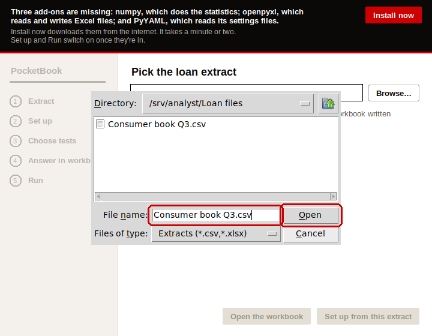

### Step 3 · Wait for the install

It takes a minute or two (a few seconds if the add-ons were fetched before).

**Correct screen:** the black bar has gone. A line says what was installed. **Set up from this extract** is red, so you can press it. The two settings under *How Set up recognises columns* can be left as they are.

---

## Part B · Where the book bleeds

### Step 4 · Press Set up from this extract

PocketBook reads the file and guesses what each column is. Nothing is written yet.

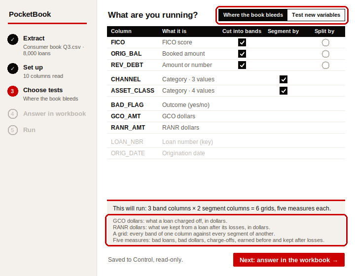

**Correct screen:** the left side shows the file name and "8,000 loans", then "10 columns read". The table lists every column with what PocketBook thinks it is. **Where the book bleeds** is picked at the top right.

The boxes decide what is cut:
- **Cut into bands:** number columns to split into ranges (FICO, ORIG_BAL, REV_DEBT are ticked).
- **Segment by:** category columns (CHANNEL, ASSET_CLASS).
- **Split by:** at most one number column, used to cut every pocket in half at its own middle value.
- The outcome and dollar columns say **every measure**: they are what is measured, not what is cut.

Under the shaded box, a line for each word you meet here first: GCO dollars, RANR dollars, a grid, and the five measures.

> The made-up book has three number columns you can cut. Your bank's file may have more.

### Step 5 · Tick Split by on REV_DEBT

Press the round button in the **Split by** column on the REV_DEBT row.

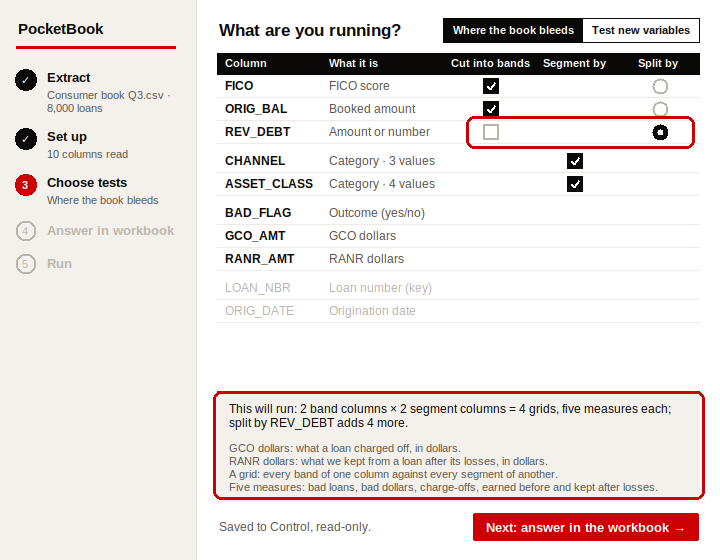

**Correct screen:** REV_DEBT's **Cut into bands** box clears by itself (a column can't be both). The shaded box under the table says what will run: *2 band columns × 2 segment columns = 4 grids … split by REV_DEBT adds 4 more.*

### Step 6 · Press Next: answer in the workbook

The workbook is written beside the extract: `Consumer book Q3 - PocketBook.xlsx`.

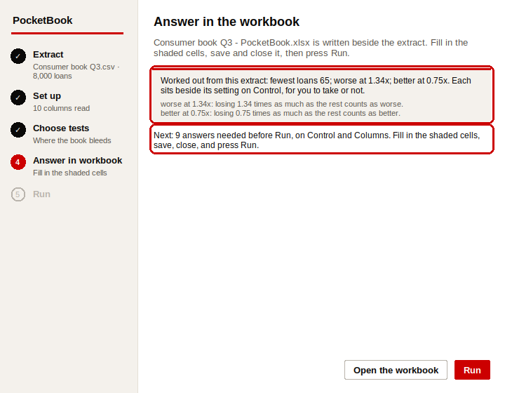

**Correct screen:** step 4 on the left is red. The shaded box gives three values PocketBook worked out from this book (fewest loans in a pocket, how much worse, how much better), with a line under it on what *worse at* and *better at* mean. They are only suggestions, and each sits beside its question on the Control tab. Under the box: **9 answers needed before Run, on Control and Columns**. Start here and the Run itself (Step 7) give the same count.

### Step 7 · (What happens if you press Run too early)

If you press **Run** now, nothing runs. The window lists every answer still needed, with the tab and cell.

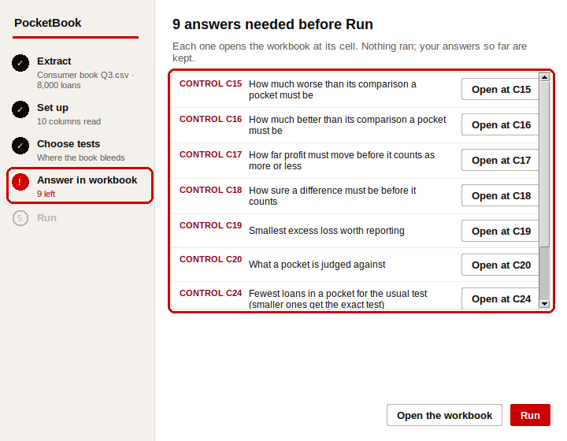

**Correct screen:** "9 answers needed before Run", top to bottom as the workbook shows them. Each has an **Open at** button that opens the workbook on that cell. Step 4 on the left says "9 left". Your answers so far are kept.

### Step 8 · Open the workbook and go to Control

Press **Open the workbook**. The **Control** tab holds the calls only you can make. Every pink cell needs an answer.

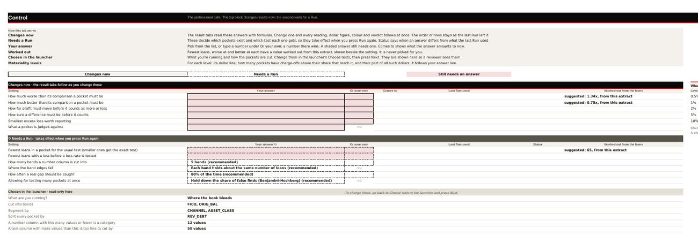

At the right, under **Worked out from the loans**, are the values PocketBook suggests for this book:

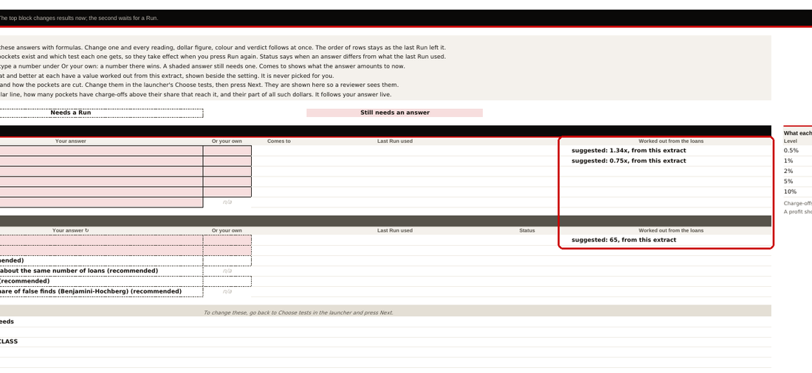

The top block (**Changes now**) takes effect in the result tabs as soon as you change it. The second block (**Needs a Run**) takes effect the next time you press Run.

### Step 9 · Answer Control

Pick from each cell's dropdown. On the walk, reading the suggestions:

| Question | Answer picked | Why |
|---|---|---|
| How much worse than its comparison a pocket must be | The smallest significant gap in a typical pocket (suggested) | comes to 1.34 times, worked out from this book |
| How much better … | The smallest significant gap in a typical pocket (suggested) | 0.75 times |
| How far profit must move before it counts | Each pocket's own test (suggested) | |
| How sure a difference must be before it counts | 95% sure | |
| Smallest excess loss worth reporting | 1% of the book's total losses | comes to $107,354 once the Run has added up the book's losses |
| What a pocket is judged against | The rest of its band | |
| Fewest loans in a pocket for the usual test | Enough for 5 expected losses (suggested) | 65 loans |
| Fewest loans with a loss before a loss rate is tested | 10 losses | |

The rest already hold a recommended answer.

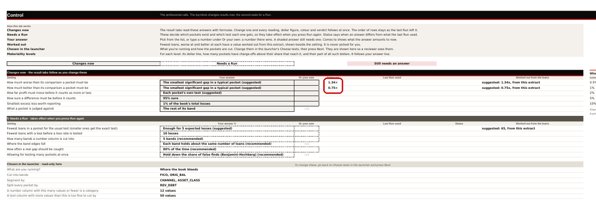

**Correct screen:** no pink cell left on Control. **Comes to** already shows **1.34×** and **0.75×** beside the two suggestions, before any Run.

### Step 10 · Answer Columns

On the **Columns** tab:
1. Read each row's **What it is** and **Why we think so**. Fix any that's wrong.
2. Answer each **Odd value** under **Treat as**. On the walk: FICO **-9999 on 160 loans** is a code for "no score", so **Missing**. RANR **negative on 595 loans** is real (a loan that charged off loses money), so **Real**.
3. Set **Checked every column?** (C3) to **Yes**.

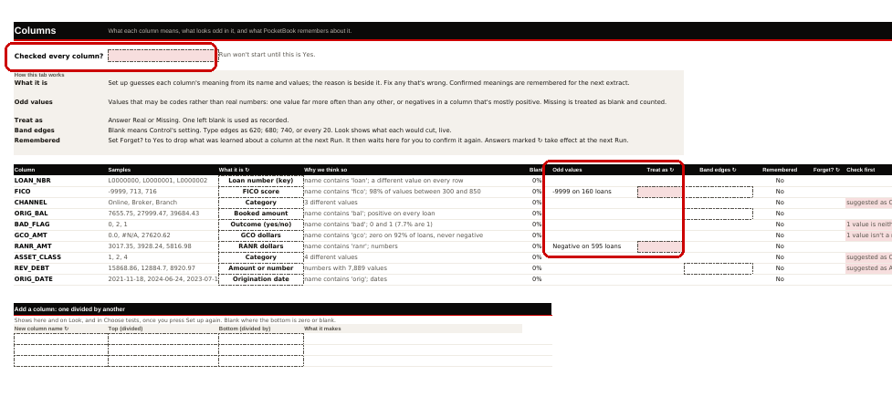

### Step 11 · Save and close the workbook

While it is open in Excel, the window shows a pink bar and **Run** stays grey, because Run can't read answers Excel is still holding.

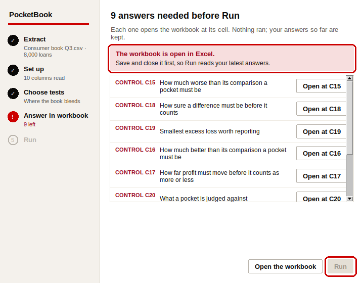

**Correct screen after closing:** the pink bar goes by itself within a couple of seconds, and **Run** turns red.

### Step 12 · Press Run

On 8,000 loans it took 9 seconds.

**Correct screen:** "Run finished." Two tiles: how many pockets are worse on charge-offs and material, and the charge-off dollars above their share in them. Under them, the Run's first two lines: where to start reading, and what splits the pockets. PocketBook also checks that every grid adds back up to the book. If one didn't, the Run would stop there and say so (Step 32); Record keeps how many checks there were.

### Step 13 · Read Start here

Press **Open at Start here**.

**Correct screen:** **Where things stand** is all zeros: no answers needed before Run, no odd value left, no change waiting. **What the last Run found** gives the same numbers as the window, then the largest pockets that are worse and material. On the walk the top one was FICO 496 to 653 / Broker, 2.62 times its band's charge-offs, $1,494,129 above its share. That is the pocket planted in the made-up book.

### Step 14 · Read Pockets

Every pocket, worst first. Pick the **Measure** (Bad loans, Bad dollars, Charge-offs, Kept after losses, Earned before losses), **Pockets** (two-way, or split) and **Show** at the top.

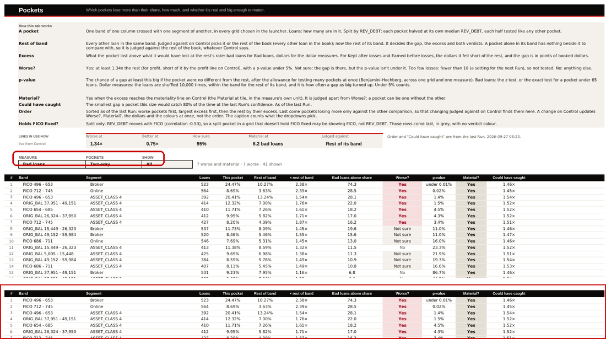

**Correct screen:** the **Lines in use now** bar repeats your Control answers. **Worse?** is Yes, Not sure (a gap, but it could be chance) or No. **Material?** is Yes when the excess reaches your dollar line.

### Step 15 · Read Paid, cost, kept

What each pocket paid the bank, what its losses cost, and what was kept. **Together** reads both sides at once: *Net drain* is more charge-offs and less kept; *Strong* is fewer charge-offs and more kept; *Losing more, profit holding* is more charge-offs while what was kept is about the same.

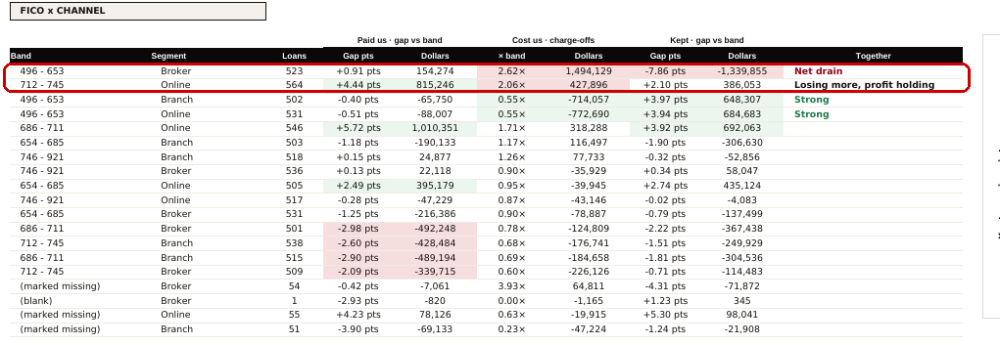

**Correct screen:** FICO 496 to 653 / Broker reads **Net drain**, and FICO 712 to 745 / Online **Losing more, profit holding**. The chart puts each pocket by its charge-offs (across) and what it kept (up).

### Step 16 · Read Grids

One grid at a time: the rate in each pocket, the rate against the whole book, against the rest of its band, and how many loans each pocket holds. Pick the grid and measure at the top.

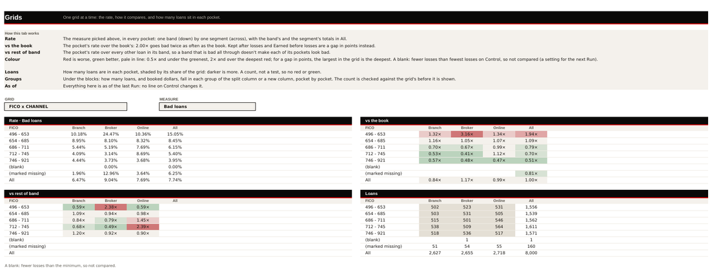

### Step 17 · Read Split

Every pocket cut in half at its own middle REV_DEBT. Does the high half do worse?

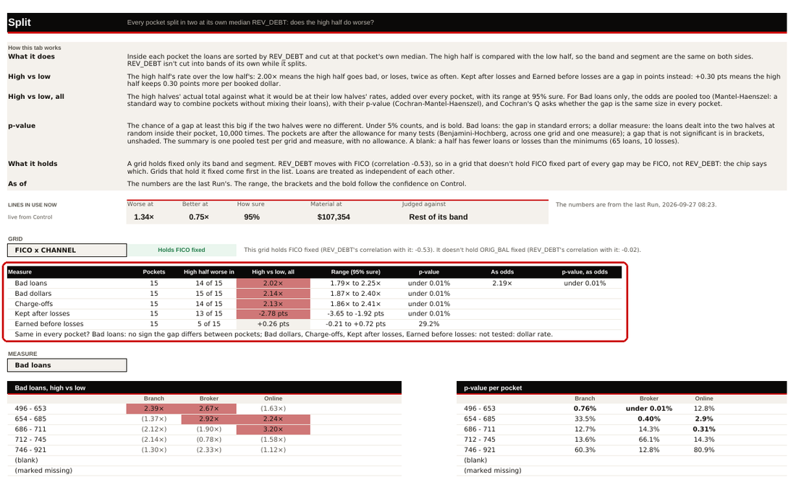

**Correct screen:** on Bad loans, the high half is worse in 14 of 15 pockets, 2.02 times overall. The grid holds FICO fixed, which matters because REV_DEBT moves with FICO. The tab says so beside the grid.

### Step 18 · Read Record

What ran, whether it adds up, what was left out, and every Run. This is the tab for a reviewer.

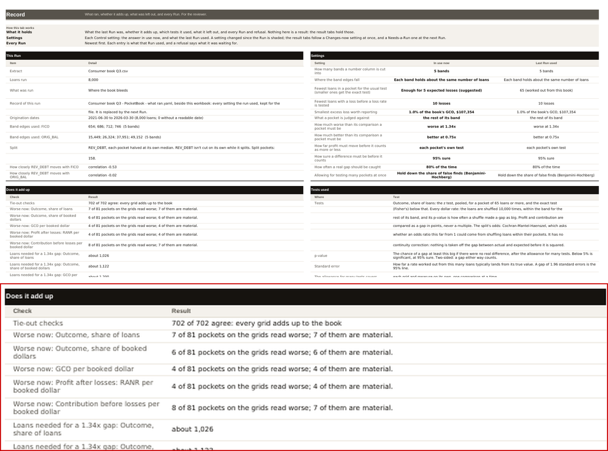

### Step 19 · Change a "Changes now" answer and watch the tabs follow

On Control, change **How much worse than its comparison a pocket must be** to **2 times**. Save.

**Correct screen:** without pressing Run, Start here now says **2 of 81** (it said 4), and its list of the largest keeps only the two still worse: FICO 496 to 653 / Broker and FICO 712 to 745 / Online. Pockets' **Worse?** column follows. Rows now under 2 times read **No**:

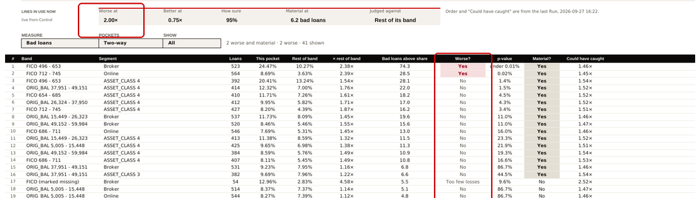

### Step 20 · Change a "Needs a Run" answer and see it wait

On Control, change **Fewest loans in a pocket for the usual test** to **100 loans**. Save.

**Correct screen:** Start here's **Changes waiting for a Run** says 1, in red, and a pink line names the change and its cell. On Control its **Status** reads **Waiting for a Run**. The choices made in the launcher, at the foot of Control, have a Status too, and read **Same as last Run**:

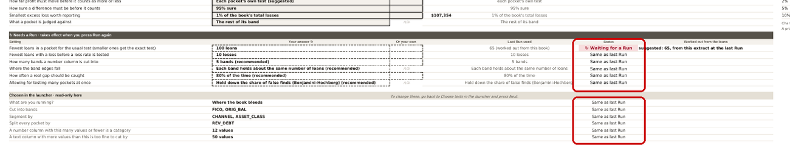

The result tabs still show the last Run until you press Run. Each says "1 Control change waits for a Run" beside **Lines in use now**.

### Step 21 · Close the workbook and press Run again

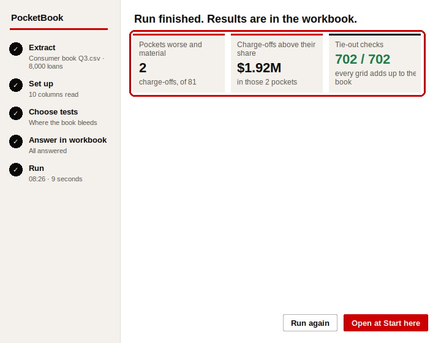

**Correct screen:** "Run finished." The waiting count on Start here is back to 0.

---

## Part C · Test new variables

A **new variable** is a column you think might tell good loans from bad, beyond what is already known. Here, revolving debt, with the FICO score held fixed so that REV_DEBT isn't just standing in for FICO.

### Step 22 · Go back to Choose tests and pick Test new variables

Press **Choose tests** on the left, then **Test new variables** at the top right.

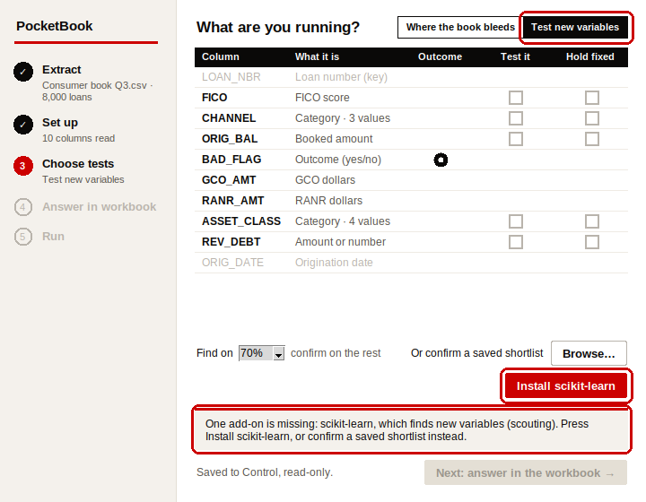

**Correct screen:** the columns now read **Outcome**, **Test it** and **Hold fixed**. If a red button says **Install scikit-learn**, press it. **scikit-learn** is the free add-on that does the scouting.

### Step 23 · Wait for scikit-learn

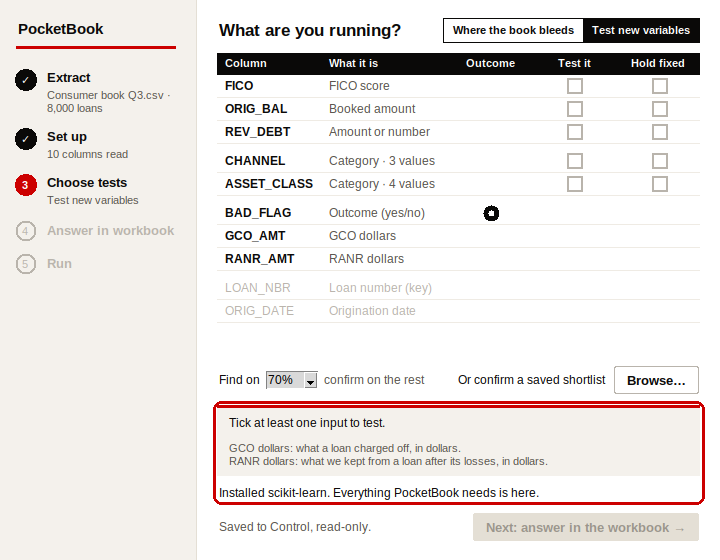

**Correct screen:** a line says it was installed. The box under the table asks you to tick at least one input.

### Step 24 · Tick what to test and what to hold fixed

Tick **Test it** on REV_DEBT, ASSET_CLASS, CHANNEL and ORIG_BAL. Tick **Hold fixed** on FICO. Leave **Find on** at **70%**: the first 70% of the loans by date are used to find, the rest to confirm.

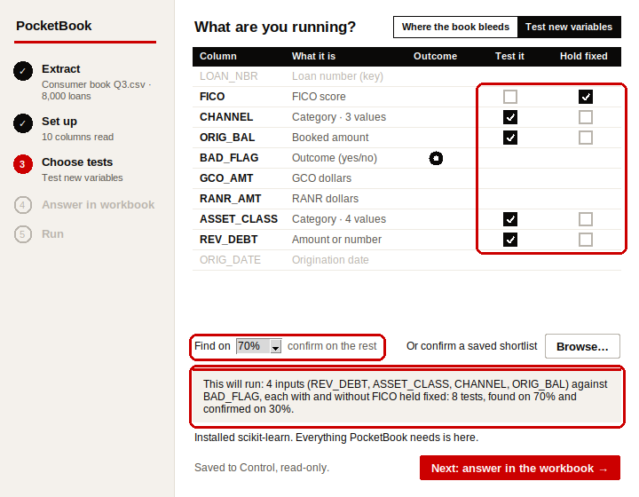

**Correct screen:** *4 inputs … against BAD_FLAG, each with and without FICO held fixed: 8 tests, found on 70% and confirmed on 30%.*

### Step 25 · Press Next

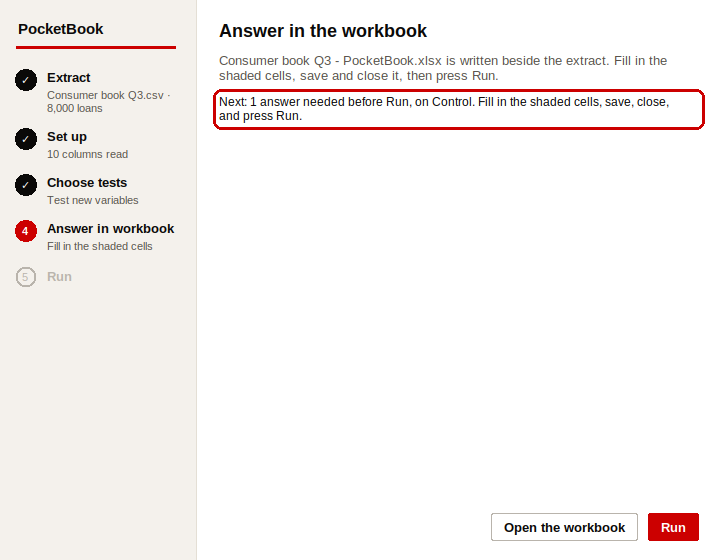

**Correct screen:** "Everything is answered. Press Run." Your Control answers carry over. Start here counts the new kind of run as **1** change waiting for a Run, because the result tabs still show the last one:

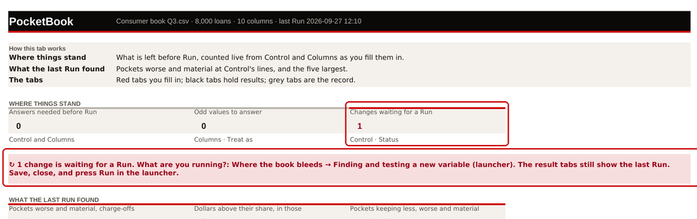

Control now shows only the questions this kind of run uses, and **What are you running?** reads *Finding and testing a new variable*, **Waiting for a Run**:

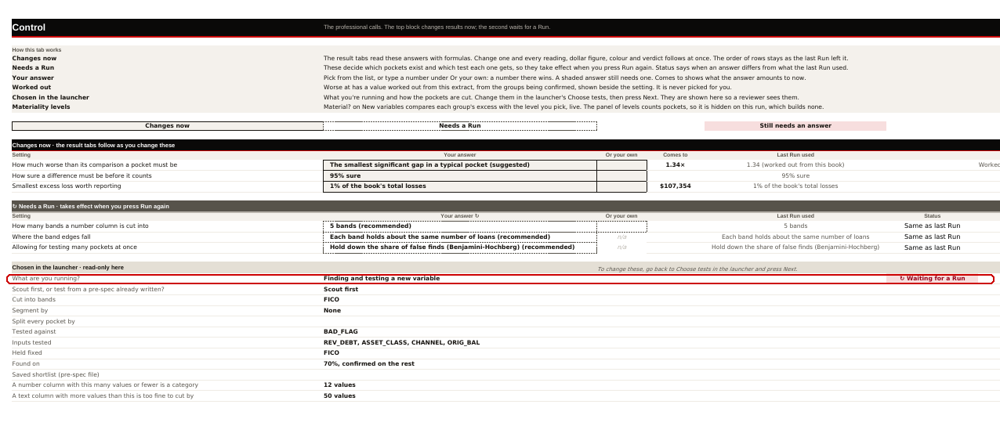

### Step 26 · Press Run

On 8,000 loans it took 20 seconds. PocketBook scouts on the development loans, writes the pre-spec `Consumer book Q3 - pre-spec.yaml` beside the workbook, and only then tests it on the held-back loans.

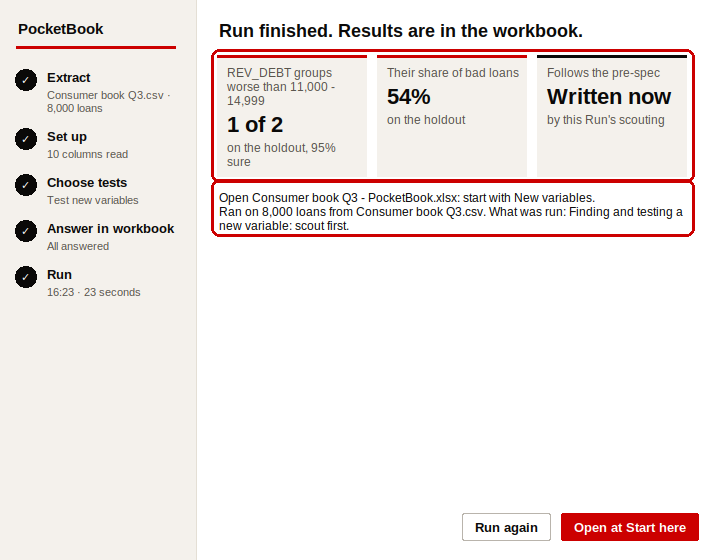

**Correct screen:** the first tile names the column and its reference group (the middle group, which every other is compared with): **1 of 2** REV_DEBT groups worse, on the held-back loans. The last tile says the pre-spec was **written now, by this Run's scouting**. It can't differ from itself, so it doesn't say "Yes". Under the tiles: start with New variables.

### Step 27 · Read Start here

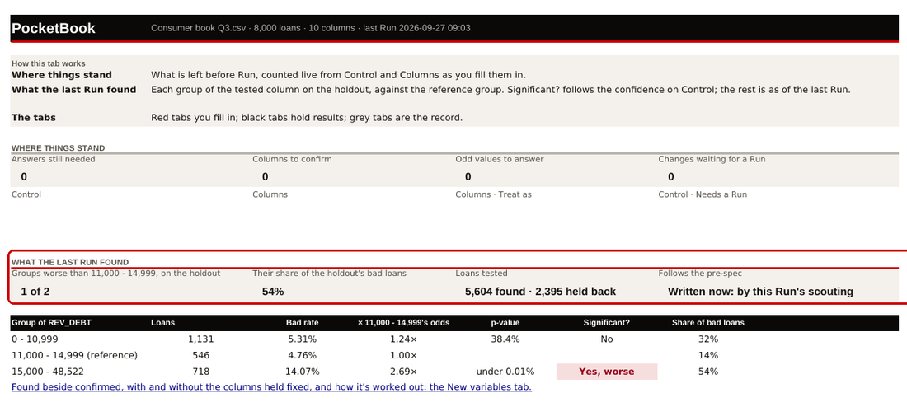

**Correct screen:** one row per REV_DEBT group on the held-back loans. 15,000 and up is **Yes, worse**: 2.69 times the odds of going bad with FICO held fixed (the column heading says so), holding 54% of the bad loans.

### Step 28 · Read Scouting

Which candidates the book leans on, ranked, on the development loans only.

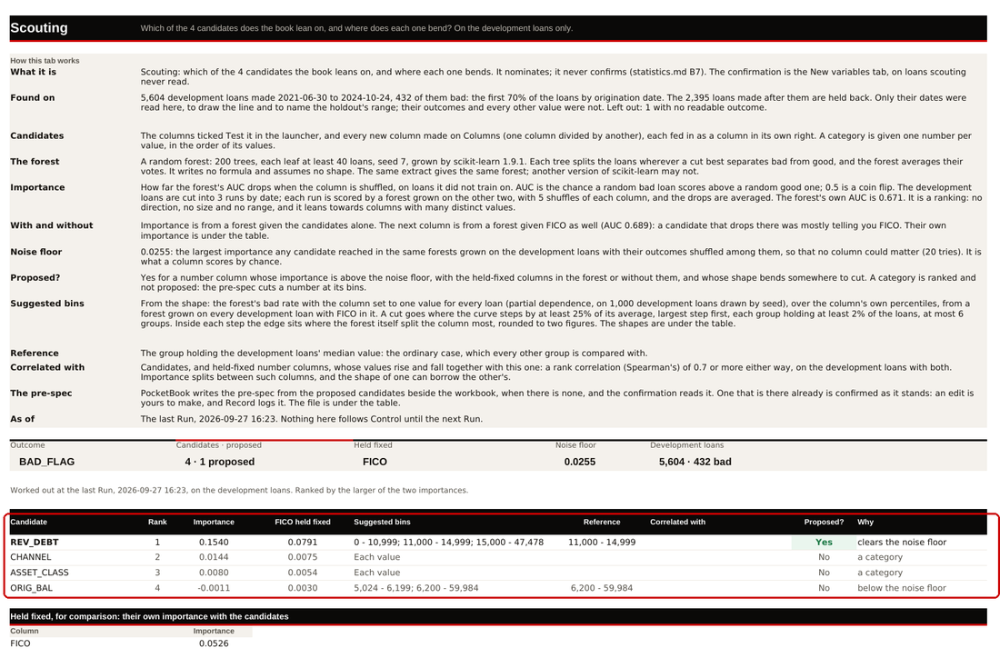

**Correct screen:** REV_DEBT first, **Proposed? Yes**, above the **noise floor** (what a column scores by pure chance). CHANNEL and ASSET_CLASS are categories, ranked but not proposed. ORIG_BAL is below the floor.

Further down, the pre-spec as written, and REV_DEBT's curve with the suggested cuts. Printed, the pre-spec's page has no table heading over it:

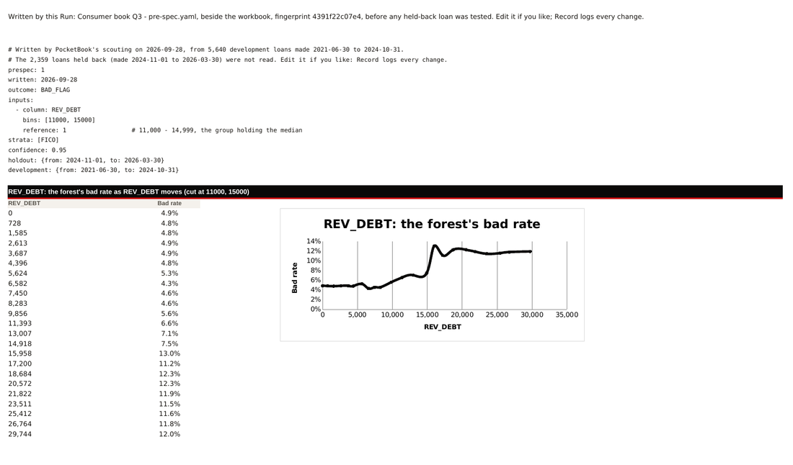

### Step 29 · Read New variables

Does REV_DEBT still tell good loans from bad on loans it was never found on, and once FICO is held fixed?

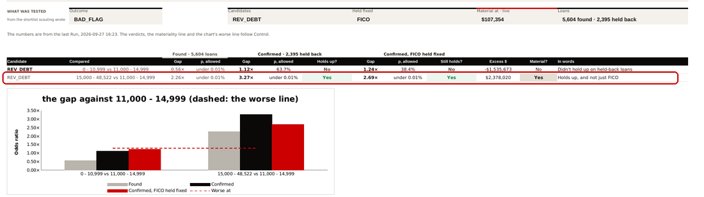

**Correct screen:** 15,000 and up: **Holds up? Yes** and **Still holds? Yes** (with FICO held fixed), **Material? Yes**. Under 11,000: found on development, but it **didn't hold up** on the held-back loans.

### Step 30 · Read Record

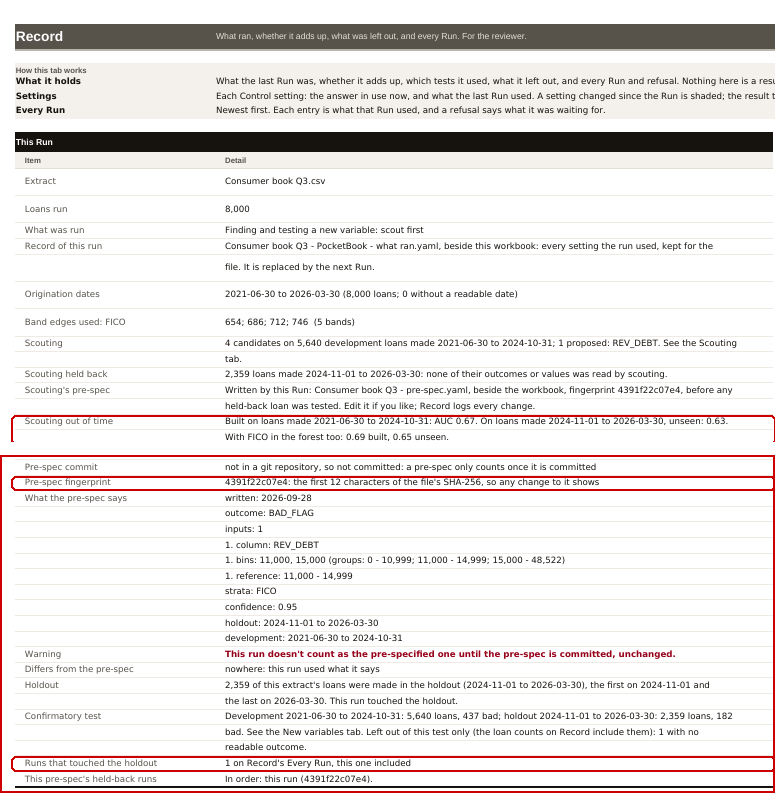

**Correct screen:** the pre-spec's fingerprint (a short code that changes if the file changes by even one character), and one run that touched the held-back loans.

### Step 31 · Edit the pre-spec after the held-back run, and Run again

Open `Consumer book Q3 - pre-spec.yaml` in Notepad. Change `bins: [11000, 15000]` to `bins: [10000, 16000]`. Save. Press **Run again**.

This is what the pre-spec exists to catch: changing the test after seeing the answer. PocketBook runs it, and labels it.

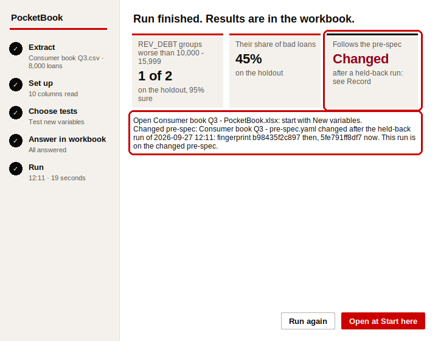

**Correct screen:** the last tile says **Changed, after a held-back run**, in red, and the line under the tiles gives the date of the earlier run and both fingerprints. On Record, under **This Run**, a red **Warning** says the same:

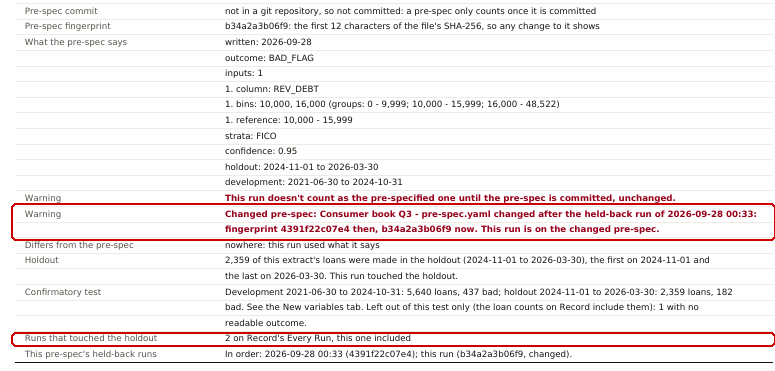

---

## When PocketBook says no

| What you did | What the window says | What to do |
|---|---|---|
| Opened it before the add-ons were installed | Black bar: "Three add-ons are missing …" (Step 1) | Press **Install now**. If it fails, press **Copy for IT** and send them the note. |
| Pressed Run before answering (Step 7) | "9 answers needed before Run", each with its cell | Press **Open at** on each, answer, save, close, Run. |
| Left the workbook open in Excel (Step 11) | Pink bar: "The workbook is open in Excel." Run is grey. | Save and close it. The bar goes by itself. |
| Picked Test new variables without scikit-learn (Step 22) | "One add-on is missing: scikit-learn …" | Press **Install scikit-learn**, or confirm a saved shortlist instead. |
| The grids didn't add up (Step 32, below) | "Run stopped: the grids didn't add up to the book, so nothing was written." | Nothing you answered caused it. Send the file named on the screen. |

### Step 32 · What a stopped Run looks like

This can't be made to happen from the screens. On the walk it was forced, to see what the window says.

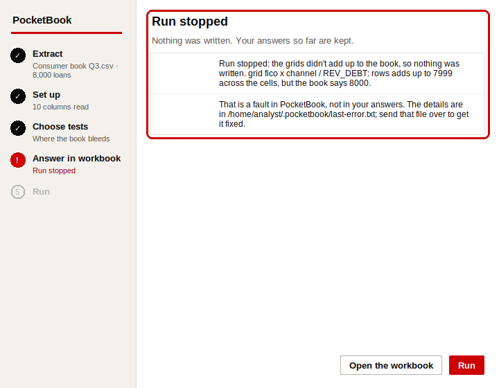

**Correct screen:** "Run stopped", not "answers needed". The message says the grids didn't add up to the book, that nothing was written, and where the details are.
