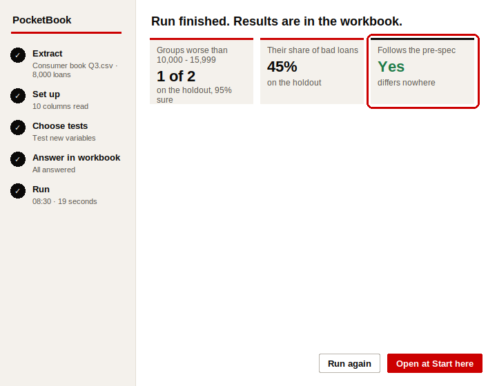
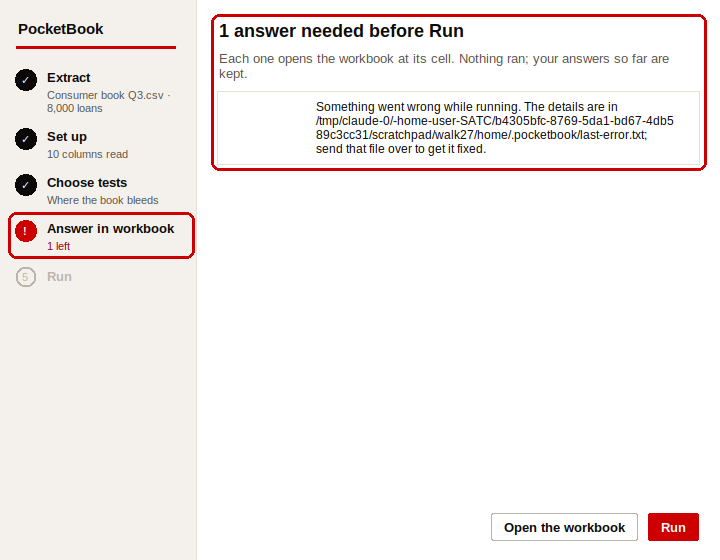
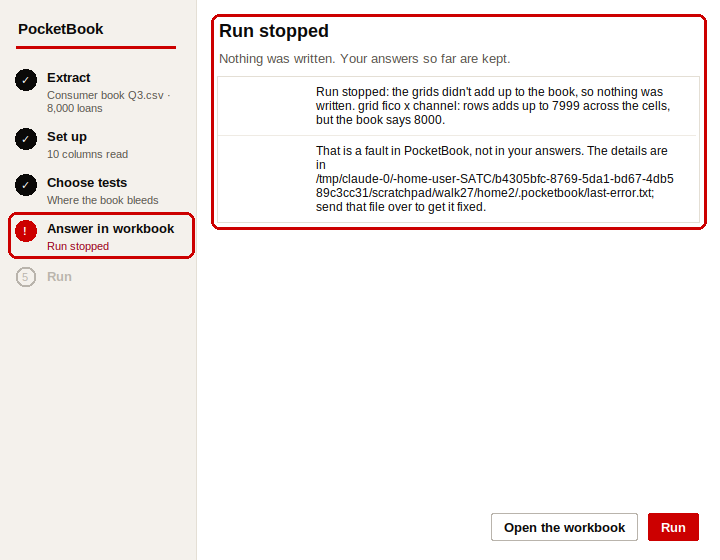
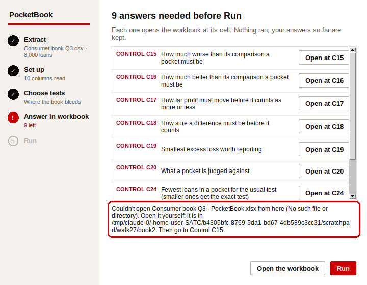
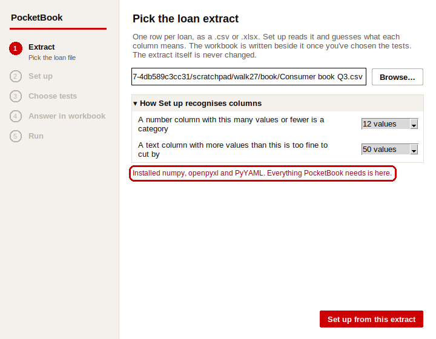
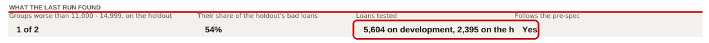
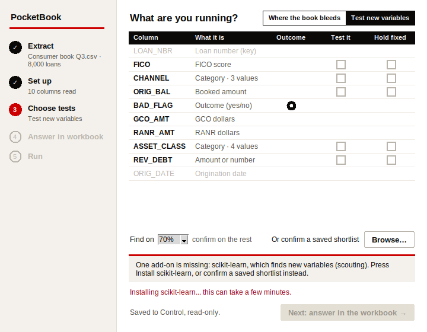

# PocketBook: defects from the analyst's walk (27 Sep 2026)

**What was walked:** Goal 3 item 2. The launcher's five steps, as a first-time analyst, on commit `970b3647` frozen with `git archive` into scratch, for both run kinds:
1. **Where the book bleeds:** Browse, Set up, cuts chosen (FICO and ORIG_BAL into bands, CHANNEL and ASSET_CLASS as segments, split by REV_DEBT), Next, Control and Columns answered from the suggestions, Run, every result tab read. Then a Changes-now answer changed (worse at: 2 times) and a Needs-a-Run one (fewest loans: 100), and Run again.
2. **Test new variables:** REV_DEBT, ASSET_CLASS, CHANNEL and ORIG_BAL ticked Test it, FICO Hold fixed, found on 70%. Run (scouting writes the pre-spec, then confirms it on the held-back loans), Scouting, New variables and Record read. Then the pre-spec edited after that held-back run, and Run again.
3. **The refusals:** Run before answering, the workbook left open (Excel's `~$` owner file), all three add-ons missing on a fresh Python (and **Install now** pressed for real: pip ran), scikit-learn missing (installed for real from Choose tests), no program to open a workbook with, and a tie-out forced to fail.

The procedure is `PROCEDURE-pocketbook-analyst.pdf` beside this file (one file, every picture in it). The route was then walked a **second time** on the fixed build, from a fresh Python. That found defect 12, and two places where a fix of mine didn't fit its box (under 1 and 7). The procedure's pictures of screens that changed are from the second run. The scripts are in `driver/`.

**How the screens were seen:** the real Tk window (`launcher.build`, as `PocketBook.pyw` builds it) under `xvfb-run` with Python 3.12, driven one action at a time by mouse events on its own widgets. The workbook was read the way Excel would show it: LibreOffice calculated every formula and printed it to PDF, then PNG. Answers were typed into the cells with openpyxl, as an analyst types them in Excel. The dropdowns' lists were read from the workbook's data validations.

**The book:** `synth.write_extract(n=8000)`, renamed `Consumer book Q3.csv`. It plants a bad pocket (FICO under 620 through Broker), revolving debt above the usual for the score going bad 1.8 times as often, asset class 4 at 1.4 times, and a pocket priced for its risk (Online, FICO 680 to 739).

**The suite at `970b3647`:** 723 tests collected, green in CI on that head. `tools/mutation_check.py` put back 371 bugs. **None of the twelve defects below was caught by any of them.** Of the 12 tests added for the fixes, run against `970b3647`: 10 fail and 2 skip (those two need a display; under xvfb both fail on the old code and pass on the new).

**What held:** every number the walk checked by eye agreed with the planted answer. The planted pocket was top of Start here and Pockets (FICO 496 to 653 / Broker, 2.62 times its band's charge-offs, $1,494,129 above its share, **Net drain** on Paid, cost, kept). Split found the high REV_DEBT half worse in 14 of 15 pockets with FICO held fixed. Scouting ranked REV_DEBT first and alone above the noise floor, and New variables confirmed 15,000 and up on the held-back loans with FICO held fixed (2.69 times the odds). A Changes-now answer moved Start here and Pockets without a Run (4 pockets to 2). A Needs-a-Run answer showed **Waiting for a Run** on Control, a red count and sentence on Start here, and a line on every result tab, and Run again cleared all three. The workbook-open bar came and went with Excel's owner file. Every refusal named its cell.

---

## Fixed

Ranked by what each would cost the firm on a real job.

### 1 · High · A pre-spec edited after the held-back run read "Follows the pre-spec: Yes", in green

**What I did:** after the scouting Run, opened `Consumer book Q3 - pre-spec.yaml`, changed `bins: [11000, 15000]` to `bins: [10000, 16000]`, saved, pressed **Run again**.

**What the screen said:** the window's last tile, **Follows the pre-spec: Yes, differs nowhere**, in green. Start here's tile said **Yes**. New variables said the test came "from the shortlist scouting wrote".

**What was true:** the test had been changed after its answer was seen, which is the one thing the pre-spec exists to catch. Only Record said so, in a Warning line. And on the first Run, where this Run's own scouting wrote the file, "Yes" could not have been anything else: a green that cannot go red.

**Fixed:** the tile now says **Changed, after a held-back run: see Record**, in red, on the window and on Start here. New variables says "changed after a held-back run", in red, where it says where the shortlist came from. (Appended to "from the shortlist scouting wrote", on the second run, "changed" was the part the cell cut off.) On the Run whose scouting wrote the file, it says **Written now, by this Run's scouting**, in ink. Only a file that was already there, unchanged since its last held-back run and followed everywhere, reads **Yes**.

### 2 · Medium · A Run that failed called itself "1 answer needed before Run"

**What I did:** forced a tie-out to fail (a **tie-out** adds the pockets of every grid back up and checks they come to the book's totals; it is the third tile on the finished screen).

**What the screen said:** "1 answer needed before Run", "1 left" in red on the rail, and "Something went wrong while running. The details are in …last-error.txt".

**What was true:** nothing was waiting for an answer, and "something went wrong" hid what had: the grids didn't add up. The tile "702 / 702" can't show a failure either (see design question B).

**Fixed:** the page now says **Run stopped** and "Nothing was written. Your answers so far are kept." The rail says "Run stopped". A failed tie-out reads "Run stopped: the grids didn't add up to the book, so nothing was written. grid … rows adds up to 7999 across the cells, but the book says 8000", then that it is PocketBook's fault, not the analyst's answers, and where the details are. Any other crash keeps its own sentence under the same title.

### 3 · Medium · Open at… did nothing, silently, when the workbook couldn't be opened

**What I did:** pressed **Open at C15** on a machine with nothing to open .xlsx with.

**What the screen said:** nothing. The error went to the console, which a double-clicked `.pyw` doesn't have. On Windows, `os.startfile` raises the same way when no program is set for .xlsx.

**Fixed:** the page says "Couldn't open Consumer book Q3 - PocketBook.xlsx from here (No such file or directory). Open it yourself: it is in …folder…. Then go to Control C15." **Open the workbook** says the same without the cell.

### 4 · Low · "Installed … Everything PocketBook needs is here." was drawn in the red of a refusal

**What I did:** pressed **Install now** with three add-ons missing, then **Install scikit-learn** on Choose tests.

**What the screen said:** the good news, both times, in crimson, the colour every refusal uses.

**Fixed:** good news is kept apart from refusals and drawn in ink. An optional add-on that didn't install is still the note for IT, in red.

### 5 · Low · The answers still needed were listed out of order

**What the screen said:** Control C15, C18, C19, C16, C17, C20, C24, C25, then Columns C3 (step 7 of the procedure, first walk).

**Fixed:** top to bottom as the workbook shows them: Control's rows, then Columns', each by its row.

### 6 · Low · Record named each measure differently from the result tabs

**What the screen said:** Record's *Does it add up* read "Worse now: Outcome, share of loans", "GCO per booked dollar", "Profit after losses: RANR per booked dollar", "Contribution before losses per booked dollar". Pockets, Grids and Split call the same measures Bad loans, Charge-offs, Kept after losses and Earned before losses.

**Fixed:** Record's rows (Worse now, Loans needed, Smallest gap, Materiality line, Left out of) use the result tabs' names. The Log's "Worst for …" lines, kept from earlier Runs, are as they were.

### 7 · Low · The new-variable tile didn't say whose groups it counted

**What the screen said:** "Groups worse than 11,000 - 14,999: 1 of 2". No column named anywhere on the finished screen.

**Fixed:** "REV_DEBT groups worse than 11,000 - 14,999". On the second run the longer heading took three lines and pushed "on the holdout, 95% sure" out of the tile's fixed 96 px, so each tile is now as tall as its words. That part is held by a window test, which needs a display.

### 8 · Low · Scouting's curve showed dollars to four decimal places

**What the screen said:** REV_DEBT's values under its curve read 733.1264, 1584.205, 4405.724.

**Fixed:** a column in the hundreds and up is shown as whole numbers with thousands (733, 1,584). A ratio keeps up to four places.

### 9 · Low · "while the add-on installs", with three missing and nothing installing

**Fixed:** "Until they are in, you can still pick the extract and open a workbook written before." ("it is" for one.)

### 11 · Low · Start here's "Loans tested" ran into the next tile

**What the screen said:** "5,604 on development, 2,395 on the h Yes". The last tile's value was jammed against the cut-off text.

**Fixed:** "5,604 found · 2,395 held back", the words New variables' own tile uses.

### 12 · High · Found on the second run: installing scikit-learn after the add-ons, in one window, never finished

**What I did:** the procedure again on the fixed build, from a fresh Python: **Install now** for the three add-ons, then, in the same window, **Install scikit-learn** on Choose tests.

**What the screen said:** "Installing scikit-learn... this can take a few minutes." for fifteen minutes, and then still. pip had finished in seconds.

**What was true:** the loop that waits for pip updated the black bar's clock on every pass. The bar had gone after the first install, so setting its line raised inside the loop, the loop stopped, and the window never learned the install had finished. The first walk missed it only because the window had been reopened between the two installs.

Reproduced on `970b3647` for the picture: the same two installs, for real, in one window. After a minute scikit-learn was installed and the page still said it was installing.

**Fixed:** the clock only runs for the add-ons the cube needs, and only while the bar's line is still there. Held twice: a test that needs no display, and one that drives the real window under xvfb. That one skips where there is no display, as the existing window test does, so CI doesn't run it.

---

## Left for the firm, and answered (27 Sep 2026)

Each was a design question, not a slip. The recommendation was mine; the firm's answers are in BACKLOG §6d, and all
eleven are built. Each carries a test in `tests/test_firm_answers_2026_09_27.py` (K's is in `tests/test_scout.py`) and at least one planted bug
in `tools/mutation_check.py` that the test catches. The procedure's pictures of screens that changed were taken again
on the fixed build (`driver/walk_answers.py`, `driver/shots_answers.py`).

**A · Changes waiting for a Run doesn't count the launcher's choices.** After switching to Test new variables and pressing Next, Start here said **0** changes waiting while every result tab still showed the bleed Run, under a Control that read *Finding and testing a new variable*. The same holds for a changed cut or split. *Recommend:* count a launcher change as waiting (compare Control's *Chosen in the launcher* block with what the last Run used), or have Next take the result tabs off when the run kind changes.

**Resolved (the firm: yes, count it).** Each Run keeps what the launcher chose on `_used`; each row of *Chosen in the launcher* has a Status, and a row Next changed reads **Waiting for a Run**. Start here counts it and the pink line names it: *Cut into bands: FICO, ORIG_BAL → FICO (launcher)*. A different kind of run is one change, not one for every row that changes with it (the first build counted 9 on the walk's switch). Pictures: steps 25a and 25b.

**B · The tie-out tile can never show a failure.** "702 / 702" is written as n of n, and a failed tie-out stops the Run. It is a green that can't go red. *Recommend:* say what it means where the reader is standing, e.g. value "702", under it "all add up; a Run stops if one doesn't". It is the redesign's tile, so it's the firm's wording.

**Resolved (the firm: "It is the slowest way to communicate a check figure. If it didn't tie out what would happen now").** The recommendation was wrong: the tile is gone from the finished screen and from Start here, with no sentence in its place. Record keeps the check as a number: *Tie-out checks: 702: every grid adds up to the book*. The firm made it tenet T2, and the sweep it asked for found one more: the Run's first line, "N tie-out checks agree", on the Log and in the launcher's lines, is gone too. Before and after: `design-B-before.png`, `design-B-after.png`.

**C · Paid, cost, kept has no name for "more charge-offs, kept about the same".** On five equal FICO bands the priced-for-it pocket (FICO 712 to 745 / Online) is shaded worse on charge-offs (2.06 times), and its kept gap (+2.10 points) could be chance, so **Together** is blank. *Earns less, not from losses* covers the mirror case. This belongs with the open wording question on *Earned before losses*.

**Resolved.** Charge-offs worse and real with the kept gap not significant reads **Losing more, profit holding**, on the tab and in its note. FICO 712 to 745 / Online reads it on the walk's book. *Earned before losses* and *Earns less, not from losses* stay (the firm: "Fine for now").

**D · Start here's "Largest, worse and material" keeps rows that no longer read worse.** After worse at went to 2 times, two of the four rows read **Worse? No** under that heading. The order is the last Run's, as the tab says. *Recommend:* title it "Largest at the last Run", or hide rows that no longer read worse.

**Resolved (the firm: "I don't understand this like at all like meaning it's slop"; make it live).** The list is picked by formula from the verdicts now, the way Pockets' Show dropdown picks: `_found` holds every pocket the Run found losing more than its share, largest dollars first, each with its live Worse? and Material? read from `_pockets` and a running count, and row k is the first whose count reaches k. No SORT, FILTER or LET. After worse at goes to 2 times it lists two pockets, both worse. Worse? and Material? came off the list: every row it shows is both (T2). Before and after: `design-D-before.png`, `design-D-after.png`.

**E · Three counts for one job.** After Next the window said "7 columns to look at first", Start here "Columns to confirm: 10", and the Run refusal listed 9 answers (8 on Control, 1 on Columns). Each is right about something different. *Recommend:* one count, the refusal's, on all three.

**Resolved.** Next says *9 answers needed before Run, on Control and Columns* (the refusal's own reading of the workbook, taken at Next). Start here's first tile is **Answers needed before Run**, counted live the refusal's way: each blank answer on Control, what is being run if the launcher hasn't said, and Checked every column. *Columns to confirm* and *7 columns to look at first* are gone.

**F · Words a first-time analyst meets without a meaning.** On the window: *GCO dollars*, *RANR dollars*, *worse at 1.34x*, *grids, five measures each*, *scouting*. The workbook explains each on its tab, but the window is where they're first read. *Recommend:* a line under each on the window, e.g. "worse at 1.34x: a pocket counts as worse when it goes bad 1.34 times as often as the loans it is compared with". The procedure carries a table of these words meanwhile.

**Resolved.** A slate line under what uses each word first: *GCO dollars: what a loan charged off, in dollars.* *RANR dollars: what we kept from a loan after its losses, in dollars.* *A grid: every band of one column against every segment of another.* *Five measures: bad loans, bad dollars, charge-offs, earned before and kept after losses.* *worse at 1.34x: losing 1.34 times as much as the rest counts as worse* (and better at). *Scouting: a first look at most of the loans, to pick what to test.* Each is 15 words or fewer; the test holds that and that none uses a term of art.

**G · Control's "Comes to" before the first Run repeats the option text.** For the two suggested answers, "Comes to" read "The smallest significant gap in a typical pocket (suggested)", spilling left over **Or your own**, where after the Run it reads 1.34×. *Recommend:* show the worked-out value (the suggestion is already known at Set up), or leave it blank until the Run.

**Resolved.** Set up keeps the worked-out number in a hidden cell beside worse at and better at; before the first Run, Comes to shows it (**1.34×**, **0.75×**), or a picked option's own number (0.80×). Materiality's dollar line needs the Run's total losses, so it is blank until then. Never the option's words.

**H · Look draws outcome columns with "no edges on Columns yet".** GCO_AMT and RANR_AMT get a chart that says so, but an outcome column has no band edges to type. *Recommend:* "GCO_AMT · an outcome: not cut into bands".

**Resolved (the firm: "Not sure why we even have the info? Like obviously we didn't band them?").** Look draws only the columns that can be cut into bands: FICO, ORIG_BAL and REV_DEBT on the walk's book. GCO_AMT, RANR_AMT and the outcome are not on it at all. Before and after: `design-H-before.png`, `design-H-after.png`.

**I · Start here's group table shows the odds with FICO held fixed without saying so.** After the scouting Run, 0 to 10,999 read 1.24× and 15,000 and up 2.69×: New variables' *Confirmed, FICO held fixed* column, where its unheld column says 1.12× and 3.27×. The header says only "× 11,000 - 14,999's odds". *Recommend:* "× 11,000 - 14,999's odds, FICO held fixed".

**Resolved.** The heading reads *× 11,000 - 14,999's odds, FICO held fixed* (wrapped in its column), and says nothing held fixed when the pre-spec holds none.

**J · The finished screen shows none of the Run's lines.** The launcher builds lines such as "Open … start with Pockets" and, after an edit, "Changed pre-spec: …", and never shows them. Defect 1 is fixed on the tile; the rest are only on Record. *Recommend:* the first two lines under the tiles.

**Resolved.** Under the tiles: where to start reading, then the first of a pre-spec changed after a held-back run, pockets too small to test, what splits the pockets, or what the Run ran on. After the edit in Step 31 it reads *Changed pre-spec: … changed after the held-back run of …*.

**K · Printed, Scouting repeats its table's header over the pre-spec.** The print titles carry the candidates table's header onto the page where the pre-spec file starts. Low; print only.

**Resolved.** Scouting has no print titles. Step 28b's picture is the printed page.

**Not a defect:** the brief asked for four number columns cut into bands. The synthetic book has three (FICO, ORIG_BAL, REV_DEBT; ASSET_CLASS has four values and is read as a category). The walk cut two and split by the third.

---

## Counts

- **Defects found:** 12 (11 on the first walk, 1 on the second). **Fixed:** 11. **Left for the firm:** 11 design questions (A to K), all answered and built on 27 Sep 2026. Defect 10 is design question H.
- **Tests:** 12 added in `tests/test_walk_2026_09_27.py` (735 collected, from 723). 10 run anywhere. 2 need a display and skip without one. 5 existing tests updated for the new wording (`test_book_results`, `test_live`, `test_record`, `test_new_variable_run`, `test_deps`).
- **Full suite after the fixes** (Python 3.11, no display, LibreOffice present): `731 passed, 4 skipped in 1823.89s (0:30:23)`. The 4 skipped are the window tests.
- **Planted bugs:** 14 added to `tools/mutation_check.py`, each run alone, 14 caught. 385 in all. The two display-only checks (the tile height, and the window half of defect 12) can't be planted there, since the checker runs without a display. Each was planted by hand under xvfb, and its test went red.
- **The firm's answers (A to K, and tenet T2), built the same day:** 12 tests added (11 in `tests/test_firm_answers_2026_09_27.py`, 1 in `tests/test_scout.py`; 752 collected, from 740), 1 of them needing a display. 9 existing tests rewritten for the new wording. 20 planted bugs added, each run alone, 20 caught (405 in all); the 10 older ones whose selectors match a rewritten test run again, 10 caught. The window test planted by hand under xvfb went red. Full suite (Python 3.11, no display, LibreOffice present): `747 passed, 5 skipped in 1899.63s (0:31:39)`.
