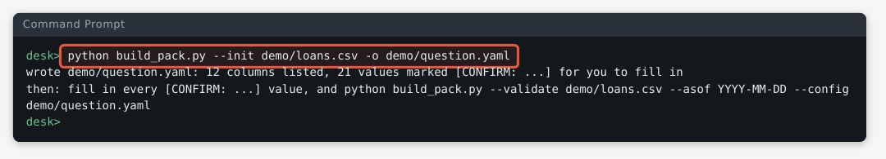
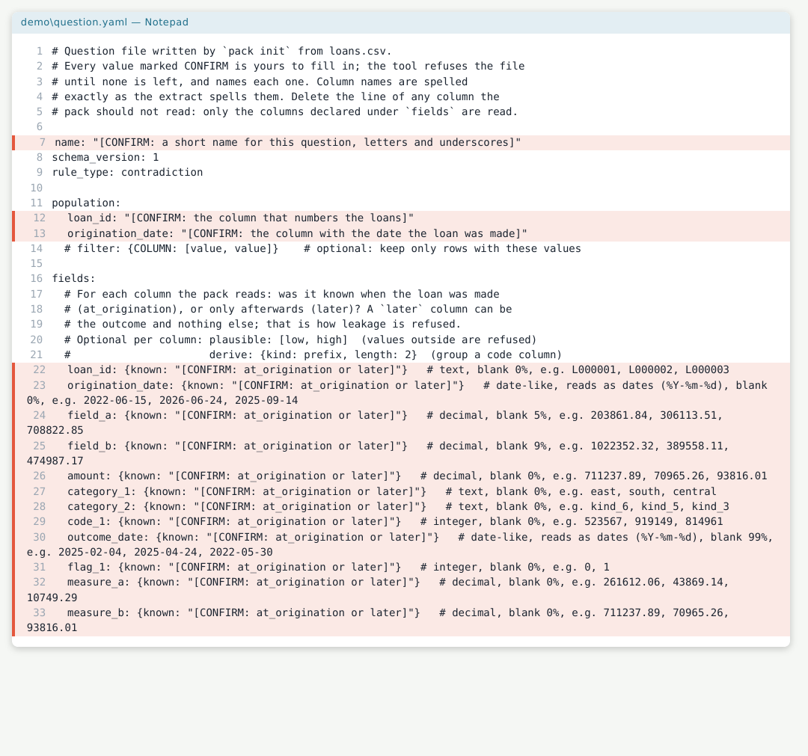
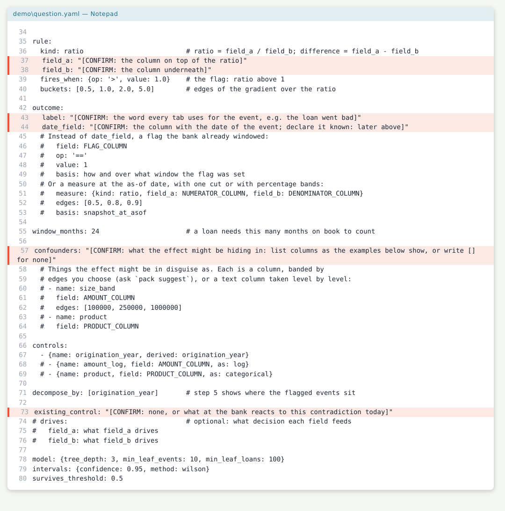
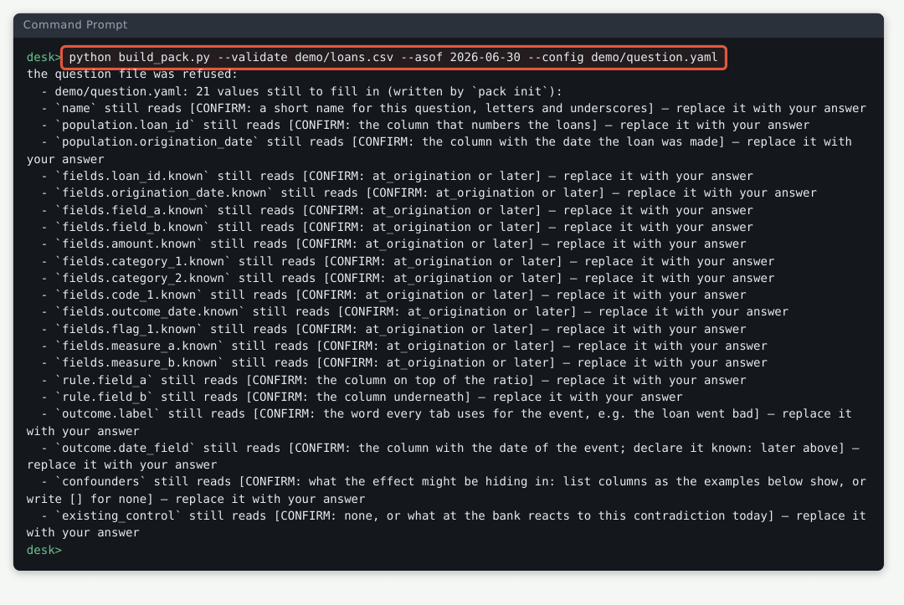
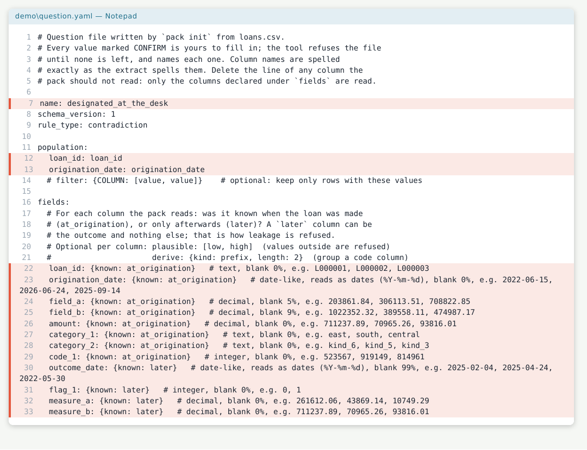
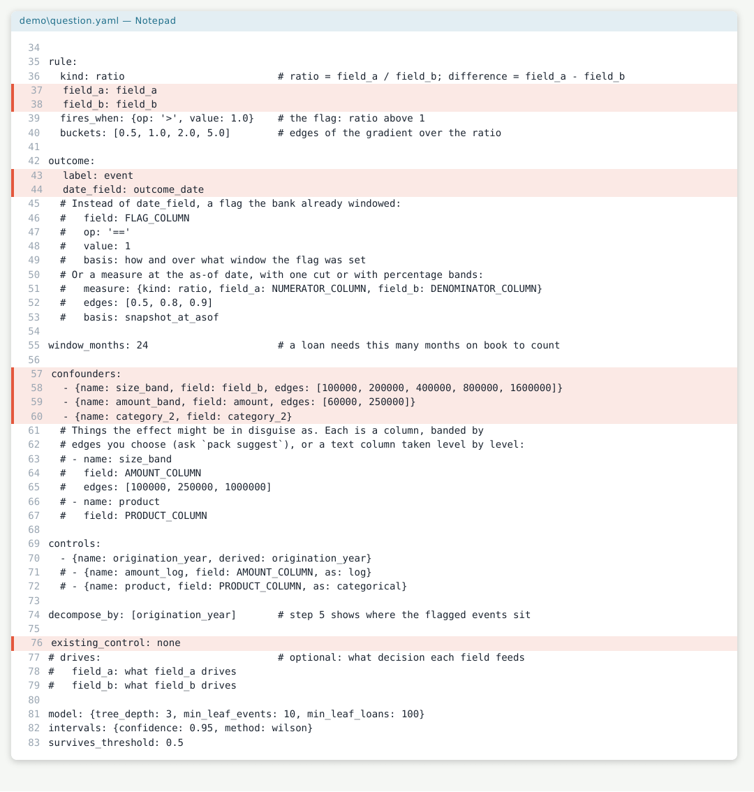
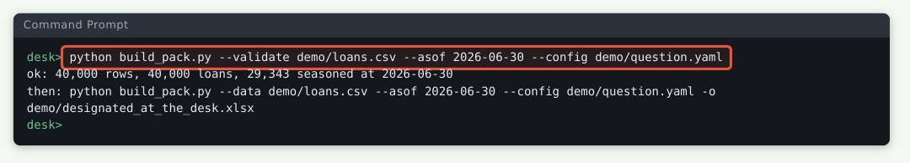
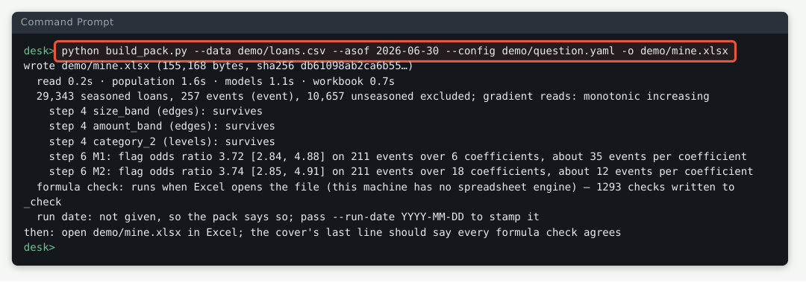
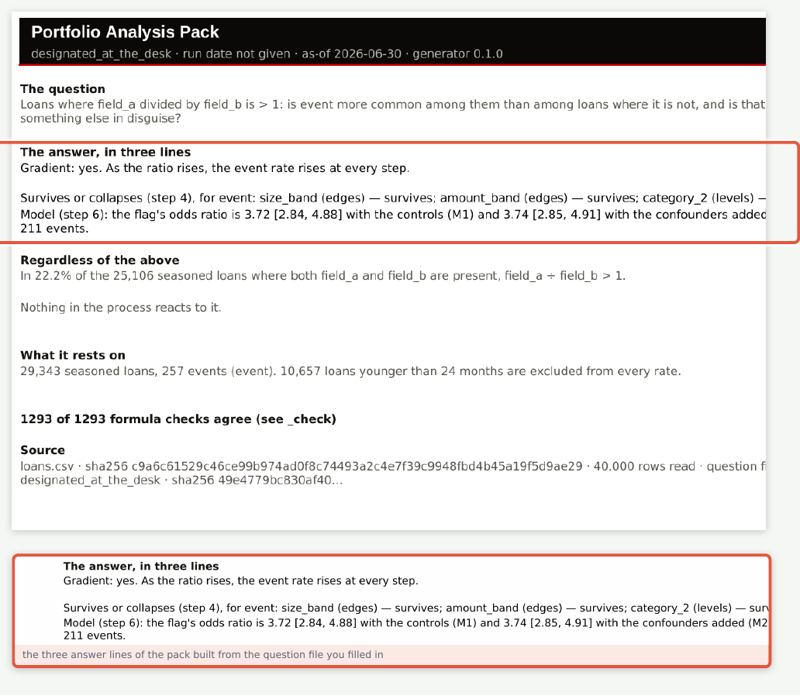

# Testing the Portfolio Analysis Pack at a desk

> From the emailed file to a workbook you have read, in thirty steps. Written for a person doing it for the first time, with a picture of every screen and what a correct one looks like.

This is the procedure for testing the pack on a machine that has never seen
it: a file arrives by email, you run it on a book of made-up loans with a
known answer, you read the workbook it builds, and then you point it at an
extract of your own. It was walked twice on 22 September 2026: once on the
script as first written, which found eleven things the screens said wrong
(`WALKTHROUGH-DEFECTS.md`), and again the same day on the patched script,
after the firm asked for everything wrong to be fixed before anything
shipped. Every screen below is from the second walk. Where a screen of yours
differs from the picture, either the product has changed or something went
wrong, and finding out which is the point of doing it again.

Two things to know before you start. The terminal pictures show a prompt
that reads `desk>`; on your machine it will show the folder you are in. And
the spreadsheet pictures were taken with LibreOffice, because the machine the
walk ran on has no Excel; the numbers and words are the same, the fonts are
not.

**You need:** the emailed file `build_pack.py`, Python 3.10 or later, the two
libraries it uses (`openpyxl` and `PyYAML`; if step 2 fails, run
`pip install openpyxl PyYAML`), Excel, and Notepad or any text editor.

## The route


Make a new, empty folder, save `build_pack.py` into it, and open a Command
Prompt in that folder (in File Explorer, type `cmd` in the address bar and
press Enter). Every command below is typed there.

## Part A · Is the machine ready?

### Step 1 — Check Python

**Do:** type `python --version` and press Enter.


**Right when:** it answers with a version of 3.10 or later. Here it was
3.11.15. If it says Python is not recognised, install it from python.org and
tick "Add to PATH".

### Step 2 — Check the two libraries

**Do:** type this exactly, on one line, and press Enter:

```
python -c "import openpyxl, yaml; print('ready: openpyxl', openpyxl.__version__, 'and PyYAML', yaml.__version__)"
```


**Right when:** it prints `ready:` with two version numbers. If it prints an
error naming a module, run `pip install openpyxl PyYAML` and try again.

## Part B · A book with a known answer

The script can make itself a book of 40,000 made-up loans in which a real
effect has been planted, and write down what it planted. That is what you
test on first: a book where you know the answer.

### Step 3 — Make the book

**Do:** type `python build_pack.py --synth demo` and press Enter.


**Right when:** the first line reads *wrote demo/loans.csv, config.yaml,
planted.json (effect, seed 20260918, 40,000 loans)* and the second, *then:*,
gives the build command, which is step 5's. Nothing else is printed. The
planted answer is in `demo\planted.json`, and step 18 comes back to it.

### Step 4 — Look at what appeared

**Do:** type `dir` (the picture shows `ls`, the same thing on the machine the
walk ran on) and look at the folder.


**Right when:** the folder holds `build_pack.py` and a `demo` folder with
three files in it, and nothing else. The script unpacks itself into a
temporary folder while it runs and removes it when it finishes.

### Step 5 — Build the pack

**Do:** type this on one line and press Enter. It takes a few seconds.

```
python build_pack.py --data demo/loans.csv --asof 2026-06-30 --config demo/config.yaml -o demo/pack.xlsx
```


**Right when:** the first line reads *wrote demo/pack.xlsx*, and the summary
under it has these numbers: 29,343 seasoned loans, 257 events, *gradient
reads: monotonic increasing*, three step-4 lines each ending *survives*, and
M1's odds ratio 3.73 with the interval [2.84, 4.89] on 211 events, about 19
events per coefficient. The last three lines say that the formula check runs
when Excel opens the file, that no run date was given so the pack will say
so rather than guess one (add `--run-date 2026-09-22`, with the day you ran
it, if you want it stamped), and what to do next. Keep this screen in mind;
the cover in the next step must say the same things.

## Part C · Read the workbook

Open `demo\pack.xlsx` in Excel. If Excel asks whether to enable editing or
to recalculate, say yes. Read the tabs left to right; each of the next
twelve steps is one tab or one thing on it.

### Step 6 — The cover

**Do:** read the tab called *Cover*, top to bottom.


**Right when:** the black banner reads *run date not given*, because step 5
did not pass one. *The question* reads *Loans where field_a divided by
field_b is > 1: is event more common among them than among loans where it is
not, and is that real or something else in disguise?* Under *The answer, in
three lines* the three lines say what step 5's screen said: *Gradient: yes*,
*survives* three times (*for event: size_band (edges) — survives; …*), and
*3.73 [2.84, 4.89]*. The last line reads *1389 of 1389 formula checks agree
(see _check)*: every number Python wrote has been recomputed by the
workbook's own formulas and matched. If that line shows a smaller first
number, or the sentence about knobs having been moved (step 17 shows it),
stop and say so.

### Step 7 — Step 1, capture

**Do:** read the tab *1_Capture*.


**Right when:** one row per origination quarter from 2019Q1, with the loans,
how many are too young to count, and how many carry a blank in each field.
The made-up book has a planted capture gap: 2019Q1 shows 610 loans (44.5%)
with `field_b` blank, and every later quarter is under 10%. Quarters from
2024Q3 on show all their loans as unseasoned.

### Step 8 — Step 2, prevalence

**Do:** read the tab *2_Prevalence*.


**Right when:** two rates per quarter, each with a lower and upper bound:
the capture rate (both fields present) and the flag rate (the rule fires).
Here the flag rate sits between 20% and 26% every quarter, and the table
stops at 2024Q2, the last seasoned quarter.

### Step 9 — Step 3, the gradient table

**Do:** read the tab *3_Gradient*, the table on the left.


**Right when:** five buckets of the ratio from *< 0.5* to *≥ 5* and a base
row. The rate climbs down the column: 0.31%, 0.91%, 1.52%, 2.83%, 5.31%.
Under the table, *Monotonic?* reads *monotonic increasing* and *Adjacent
pairs whose intervals do not overlap* reads 3. The two long headings wrap
inside their columns. The columns headed *chart:* further right feed the
chart and are not results; the tab's note says so.

### Step 10 — Step 3, the chart

**Do:** on the same tab, look at the chart to the right.


**Right when:** five bars rising left to right, each with a whisker for its
interval; the last bar's whisker is the widest, because that bucket holds
only 113 loans.

### Step 11 — Step 4, stratified

**Do:** read the tab *4_Stratified*, the four short rows under the first
block (they repeat under every block).


**Right when:** *Crude odds ratio, whole population — ratio, lower, upper*
3.73, 2.84, 4.89; *Pooled odds ratio across bands (Mantel-Haenszel) — ratio,
lower, upper* 3.74, 2.85, 4.91; *Share of the crude log-odds the pooled ratio
kept* 1.00; and *Word* reads *survives*. The labels read whole. The same word
appears under all three blocks and matches the cover.

### Step 12 — Step 5, decomposition

**Do:** read the tab *5_Decomposition*, the first block.


**Right when:** one block per dimension listed in the question file, rows
sorted by flagged events with the biggest first. For `category_1` the
flagged rate sits between 1.3% and 2.5% in every row and the unflagged rate
under 0.8%, so the effect is not hiding in one region.

### Step 13 — Step 6, the model

**Do:** read the tab *6_Model*, the first row of the M1 table.


**Right when:** the row *flag* shows odds ratio 3.729, lower 2.842, upper
4.894, the same three numbers the cover rounds to two places. The line
above the table reads *211 events · 11 estimated coefficients · events per
parameter 19.2*; the M2 table below it says 3.742.

### Step 14 — Step 7, the observation that stands regardless

**Do:** read the tab *7_Control*.


**Right when:** three counts (25,106 loans with both fields, 5,575 where the
rule fires, share 22.2%) and the sentence built from them. This tab does not
depend on anything steps 3 to 6 found.

### Step 15 — The knobs

**Do:** read the tab *_config*, the block *Live knobs*.


**Right when:** *Confidence level* 95.00%, *Interval method* Wilson,
*Survives threshold* 0.50 (its note: *Step 4's word: the share of the crude
effect that must remain for 'survives'. 0.50 means half.*), and *z* 1.959964.
The block under it, *Rebuild knobs*, is for the record only; its *Outcome*
line reads *event, from outcome_date*, the word and the column you gave.

### Step 16 — Move a knob

**Do:** click the cell that reads *Wilson* and pick *Clopper-Pearson* from
the list it offers. (In the walk, a script wrote the cell instead of a hand;
the workbook does not know the difference.)


**Right when:** the cell reads *Clopper-Pearson* and every interval in the
workbook recalculates; the bounds on every tab move a little.

### Step 17 — The cover notices

**Do:** go back to the *Cover* tab and read its last line.


**Right when:** the line that read *1389 of 1389 formula checks agree* has
been replaced by *The live knobs have been moved from the settings this pack
was built with (confidence 95%, method Wilson, survives threshold 0.5)…* and
tells you to set the knobs back to compare. Set the knob back to Wilson and
the original line returns. Close the workbook without saving.

### Step 18 — The planted answer

**Do:** open `demo\planted.json` in Notepad.


**Right when:** *true_marginal_flag_odds_ratio* is 4.317…, and that number
lies inside the model's interval from step 13, 2.84 to 4.89. The note under
it says this is what the pack should recover; it did.

## Part D · A book with nothing in it

The second test is the opposite one: a book in which nothing was planted,
where the pack must say so.

### Step 19 — Make the empty book

**Do:** type `python build_pack.py --synth null --null` and press Enter.


**Right when:** the first line reads *wrote null/loans.csv, config.yaml,
planted.json (null, seed 20260918, 40,000 loans)*.

### Step 20 — Build it

**Do:** type this on one line and press Enter:

```
python build_pack.py --data null/loans.csv --asof 2026-06-30 --config null/config.yaml -o null/pack.xlsx
```


**Right when:** *gradient reads: not monotonic*, three step-4 lines each
ending *no crude effect*, and M1's odds ratio 0.82 with an interval [0.62,
1.08] that has 1 inside it.

### Step 21 — Its cover

**Do:** open `null\pack.xlsx` and read the three answer lines on the cover.


**Right when:** *Gradient: not one-directional*, *no crude effect* three
times, and *0.82 [0.62, 1.08]*. A pack that found an effect here would be
wrong. Close the workbook.

## Part E · Your own extract

The made-up book came with its question file. An extract of your own does
not, and the tool will not guess: it writes a question file listing every
column it found, marks every value you have to choose, and refuses to run
until none is left. The walk did this on the made-up extract so the answers
can be checked; on a real one the columns will be yours.

### Step 22 — Ask for a question file

**Do:** type `python build_pack.py --init demo/loans.csv -o demo/question.yaml` and press Enter.



**Right when:** *wrote demo/question.yaml: 12 columns listed, 21 values
marked [CONFIRM: ...] for you to fill in*, and a *then:* line that says to
fill them in and gives the command to run afterwards, which is step 25's.

### Step 23 — Read the file it wrote, top half

**Do:** open `demo\question.yaml` in Notepad. The marked lines are the ones
you will change.



**Right when:** a name to give the question, the column that numbers the
loans, the column with the origination date, and one line per column of the
extract asking whether the column was known when the loan was made
(`at_origination`) or only afterwards (`later`). Each column line ends with
what the tool saw in it: its kind, how often it is blank, and three example
values.

### Step 24 — The rest of the file

**Do:** scroll down.



**Right when:** the rule's two columns, the outcome's word and date column,
the `confounders` line (what the effect might be hiding in; the comments
under it show how to list one), and what at the bank reacts to the
contradiction today. Five marked lines on this half, sixteen on the top.

### Step 25 — Try to run it unfilled

**Do:** type this on one line and press Enter:

```
python build_pack.py --validate demo/loans.csv --asof 2026-06-30 --config demo/question.yaml
```



**Right when:** *the question file was refused*, then one line for each of
the twenty-one values still marked, naming it and telling you to replace it
with your answer. Nothing was built. This is the tool refusing to guess.

### Step 26 — Fill it in, top half

**Do:** in Notepad, replace each marked value with your answer and save.
For the made-up extract the answers are: name `designated_at_the_desk`;
loan_id `loan_id`; origination_date `origination_date`; every column
`at_origination` except `outcome_date`, `flag_1`, `measure_a` and
`measure_b`, which are `later`. (In the walk a script made these edits, one
line each, and touched nothing else.)



**Right when:** no `[CONFIRM:` is left in the top half; the comments the tool
wrote are untouched.

### Step 27 — Fill it in, the rest

**Do:** field_a `field_a`; field_b `field_b`; label `event`; date_field
`outcome_date`; existing_control `none`. For `confounders`, replace the
marked line with a list written the way the comment under it shows, one
line per confounder: `size_band` on `field_b` with edges 100000, 200000,
400000, 800000, 1600000; `amount_band` on `amount` with edges 60000, 250000;
and `category_2` on `category_2`, a text column taken level by level. (Write
`[]` instead and the tool will build, but will tell you at every step that
step 4 has nothing to compare within.) Save.



**Right when:** no `[CONFIRM:` is left anywhere in the file, which is now
three lines longer than the tool wrote it.

### Step 28 — Run it again

**Do:** press the up arrow to bring back step 25's command and press Enter.



**Right when:** *ok: 40,000 rows, 40,000 loans, 29,343 seasoned at
2026-06-30*, the same seasoned count as step 5, then a *then:* line with the
build command.

### Step 29 — Build from your question file

**Do:** type this on one line and press Enter:

```
python build_pack.py --data demo/loans.csv --asof 2026-06-30 --config demo/question.yaml -o demo/mine.xlsx
```



**Right when:** *wrote demo/mine.xlsx*, 29,343 seasoned loans, 257 events,
*monotonic increasing*, three step-4 lines each ending *survives*, and M1
3.72 [2.84, 4.88] on 211 events over 6 coefficients (step 5 had 11: the file
the tool wrote lists only the origination year as a control, where the
made-up book's own file also lists the amount and a category). The same
answer as step 5 to within rounding, from a question file you wrote. 1293
formula checks are written.

### Step 30 — Its cover

**Do:** open `demo\mine.xlsx` and read the three answer lines.



**Right when:** *Gradient: yes*, *survives* three times, and *3.72 [2.84,
4.88]*, as on the screen before, with *1293 of 1293 formula checks agree*
lower down. The banner reads *designated_at_the_desk*, the name you gave the
question, and *run date not given*.

## When you are done

You have run the tool on a book with a known answer and watched it find the
answer, on a book with no answer and watched it say so, and on an extract
with a question file you wrote yourself. To do the same on a real extract,
repeat Part E with your file in place of `demo/loans.csv`, a real as-of date,
`--run-date` with the day you run it, and the confounders that matter for
that book. There is nothing to tidy afterwards: the script leaves nothing
beside itself.
