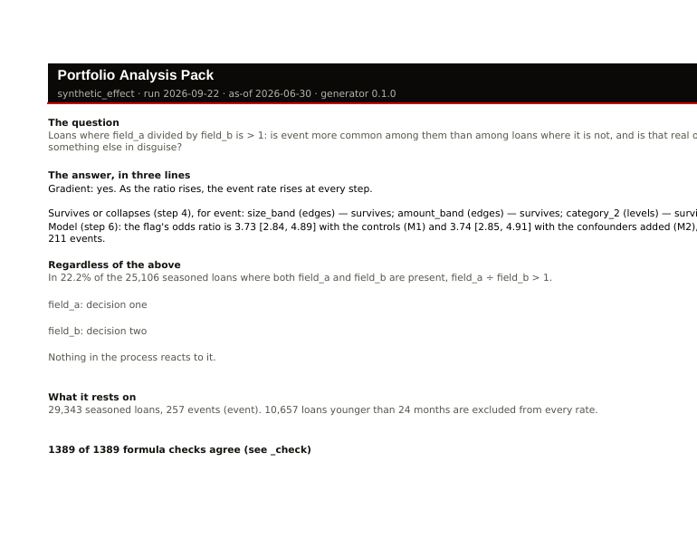
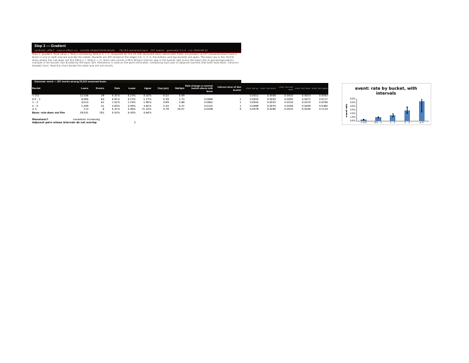
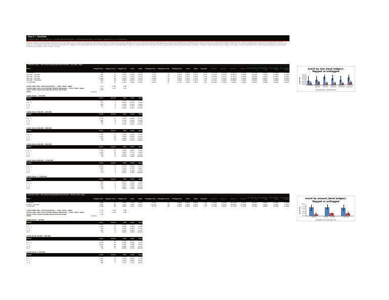
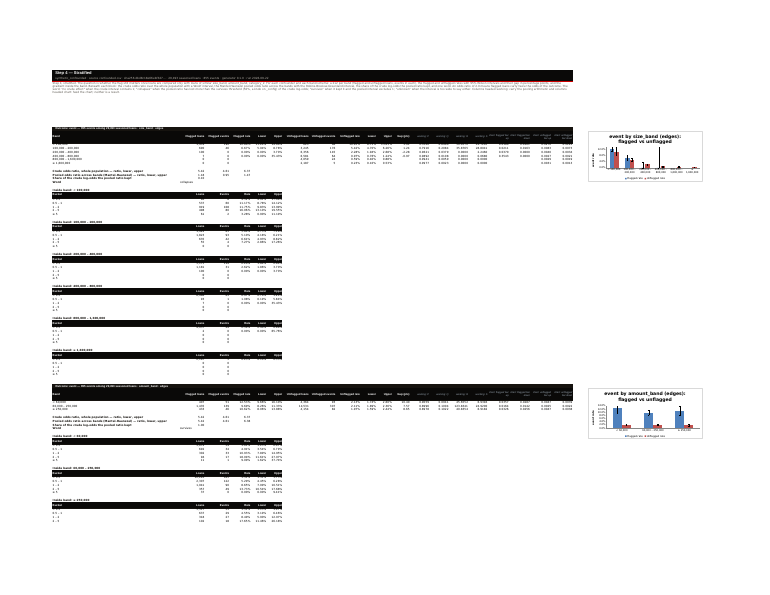
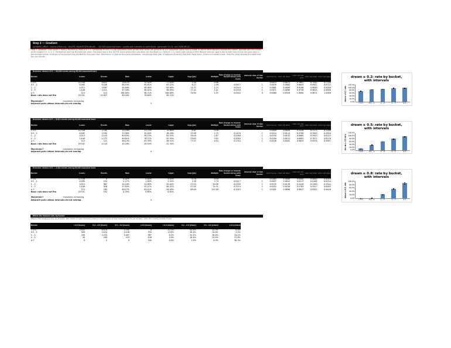

# Exercise report — the script run on made-up books with known answers

Run 2026-09-22 (as-of 2026-06-30), 40,000 loans per book, generator 0.1.0. Every command below was run against `build_pack.py`, the same pure-ASCII script a desk receives, from an empty folder, and every answer was read back out of the workbook the way Excel reads it. Generated by `tools/exercise.py`; do not edit by hand.

**48 of 48 checks agree** across 11 scenarios.

## The scenarios at a glance

| Scenario | Checks | Proved by |
|---|---|---|
| A planted effect, outcome by event date | 7 of 7 | `tests/test_gradient.py`, `tests/test_slice4.py`, `tests/test_slice6.py` |
| No effect at all | 5 of 5 | `tests/test_slice4.py::test_the_null_book_reads_no_crude_effect_everywhere`, `tests/test_slice6.py` |
| An effect that is really size in disguise | 7 of 7 | `tests/test_slice4.py::test_the_confounded_book_collapses_on_the_confounder_and_only_there`, `tests/test_slice6.py` |
| The outcome as a flag the bank already windowed | 3 of 3 | `tests/test_slice2.py` |
| The outcome as a measure at the as-of date, in bands | 4 of 4 | `tests/test_slice2.py`, `tests/test_adversarial.py::test_a_blank_snapshot_measure_is_counted_and_not_silently_a_non_event` |
| Designation at the desk: any extract, nothing coming back | 5 of 5 | `tests/test_designate.py` |
| Dirt is refused with the rows named; a missing line is refused with the line to add | 4 of 4 | `tests/test_cli.py`, `tests/test_slice2.py`, `tests/test_adversarial.py::test_one_bad_value_is_refused_once_not_twice` |
| Blanks are a finding, not dirt | 4 of 4 | `tests/test_slice3.py`, `tests/test_adversarial.py::test_a_blank_grouping_value_gets_its_own_level_rather_than_vanishing` |
| The live knobs | 3 of 3 | `tests/test_slice3.py::test_switching_the_method_moves_the_prevalence_intervals_and_the_checks_still_agree`, `tests/test_adversarial.py::test_moving_the_interval_method_knob_never_shows_a_false_check_count` |
| Same inputs, same file | 2 of 2 | `tests/test_determinism.py` |
| At scale: 100,000 loans | 4 of 4 | `(measured, not a test)` |

## A planted effect, outcome by event date

**What was planted.** 40,000 made-up loans. Loans where field_a ÷ field_b is above 1 were drawn to go bad at about four times the odds of the rest, with nothing else in play, so the flag is a real signal and no confounder should explain it away.

**What was run.**

```
python build_pack.py --data effect.csv --asof 2026-06-30 --run-date 2026-09-22 --config effect.yaml -o effect.xlsx
```

**What the pack said.**

- Gradient: yes. As the ratio rises, the event rate rises at every step.
- Survives or collapses (step 4), for event: size_band (edges) — survives; amount_band (edges) — survives; category_2 (levels) — survives
- Model (step 6): the flag's odds ratio is 3.73 [2.84, 4.89] with the controls (M1) and 3.74 [2.85, 4.91] with the confounders added (M2), on 211 events.
- In 22.2% of the 25,106 seasoned loans where both field_a and field_b are present, field_a ÷ field_b > 1.
- 1389 of 1389 formula checks agree (see _check)
- 29,343 seasoned loans, 257 events; 10,657 too young to count. Built in 5.3 s.

**Checks: 7 of 7 agree.**

- ✔ the script built the pack and exited 0
- ✔ the gradient reads: the rate rises at every step — monotonic increasing
- ✔ every confounder block says the effect survives — {'size_band.edges': 'survives', 'amount_band.edges': 'survives', 'category_2.levels': 'survives'}
- ✔ the regression's interval for the flag contains the planted odds ratio (4.32) — M1 3.73 [2.84, 4.89]
- ✔ adding the confounders does not move the flag's odds ratio much (no confounding was planted) — M1 3.73 vs M2 3.74
- ✔ the cover's own formula check reads N of N — 1389 of 1389 formula checks agree (see _check)
- ✔ LibreOffice renders it with no error cell — 58 pages



*The cover.*



*Step 3, the gradient.*



*Step 4, stratified.*

## No effect at all

**What was planted.** 40,000 made-up loans where the flag has nothing to do with going bad. The right answer is that nothing is found: no confounder block may say survives, and the regression's interval must contain 1.

**What was run.**

```
python build_pack.py --data null.csv --asof 2026-06-30 --run-date 2026-09-22 --config null.yaml -o null.xlsx
```

**What the pack said.**

- Gradient: not one-directional. The event rate does not rise at every step of the ratio.
- Survives or collapses (step 4), for event: size_band (edges) — no crude effect; amount_band (edges) — no crude effect; category_2 (levels) — no crude effect
- Model (step 6): the flag's odds ratio is 0.82 [0.62, 1.08] with the controls (M1) and 0.82 [0.62, 1.09] with the confounders added (M2), on 324 events.
- In 22.3% of the 25,119 seasoned loans where both field_a and field_b are present, field_a ÷ field_b > 1.
- 1389 of 1389 formula checks agree (see _check)

**Checks: 5 of 5 agree.**

- ✔ the script built the pack and exited 0
- ✔ no confounder block says survives — {'size_band.edges': 'no crude effect', 'amount_band.edges': 'no crude effect', 'category_2.levels': 'no crude effect'}
- ✔ every block reads: no crude effect — {'size_band.edges': 'no crude effect', 'amount_band.edges': 'no crude effect', 'category_2.levels': 'no crude effect'}
- ✔ the regression's interval for the flag contains 1 — M1 0.82 [0.62, 1.08]
- ✔ the gradient does not read as rising at every step — not monotonic

## An effect that is really size in disguise

**What was planted.** 40,000 made-up loans where going bad depends only on the size band of field_b, and the flag happens to fall more often in the small bands. Looked at crudely the flag seems to matter; inside each size band it does not. The pack must say so: the size-band block collapses, and the regression with the confounders in loses the effect.

**What was run.**

```
python build_pack.py --data confounded.csv --asof 2026-06-30 --run-date 2026-09-22 --config confounded.yaml -o confounded.xlsx
```

**What the pack said.**

- Gradient: not one-directional. The event rate does not rise at every step of the ratio.
- Survives or collapses (step 4), for event: size_band (edges) — collapses; amount_band (edges) — survives; category_2 (levels) — survives
- Model (step 6): the flag's odds ratio is 5.43 [4.62, 6.39] with the controls (M1) and 1.18 [0.95, 1.47] with the confounders added (M2), on 718 events.
- In 9.0% of the 25,324 seasoned loans where both field_a and field_b are present, field_a ÷ field_b > 1.
- 1389 of 1389 formula checks agree (see _check)

**Checks: 7 of 7 agree.**

- ✔ the script built the pack and exited 0
- ✔ the size-band block says the effect collapses — {'size_band.edges': 'collapses', 'amount_band.edges': 'survives', 'category_2.levels': 'survives'}
- ✔ the blocks that are not the culprit do not collapse — {'size_band.edges': 'collapses', 'amount_band.edges': 'survives', 'category_2.levels': 'survives'}
- ✔ the regression without the confounders sees an effect (interval above 1) — M1 5.43 [4.62, 6.39]
- ✔ the regression with the confounders loses it (interval contains 1) — M2 1.18 [0.95, 1.47]
- ✔ the tree's first split is on size, not on the flag — size_band
- ✔ LibreOffice renders it with no error cell — 58 pages



*Step 4, stratified: the size-band block.*

## The outcome as a flag the bank already windowed

**What was planted.** The same planted-effect book, but the outcome is declared as a 0/1 flag column the bank set itself, with a line saying how. The generator set that flag to the same event the date column carries, so the pack should count the same events and reach the same words.

**What was run.**

```
python build_pack.py --data effect.csv --asof 2026-06-30 --run-date 2026-09-22 --config flag.yaml -o flag.xlsx
```

**What the pack said.**

- Gradient: yes. As the ratio rises, the event rate rises at every step.
- Survives or collapses (step 4), for event: size_band (edges) — survives; amount_band (edges) — survives; category_2 (levels) — survives
- Model (step 6): the flag's odds ratio is 3.73 [2.84, 4.89] with the controls (M1) and 3.74 [2.85, 4.91] with the confounders added (M2), on 211 events.
- In 22.2% of the 25,106 seasoned loans where both field_a and field_b are present, field_a ÷ field_b > 1.
- 1389 of 1389 formula checks agree (see _check)

**Checks: 3 of 3 agree.**

- ✔ the script built the pack and exited 0
- ✔ the event count equals the event-date book's — 257 vs 257
- ✔ the words are the same as the event-date book's — monotonic increasing; {'size_band.edges': 'survives', 'amount_band.edges': 'survives', 'category_2.levels': 'survives'}

## The outcome as a measure at the as-of date, in bands

**What was planted.** The same book, but the outcome is a ratio of two columns measured at the as-of date (measure_a over measure_b), cut at three band edges chosen in the question file. Every step is shown once per edge, and loans with no measure are counted on the capture tab rather than silently treated as fine.

**What was run.**

```
python build_pack.py --data effect.csv --asof 2026-06-30 --run-date 2026-09-22 --config snapshot.yaml -o snapshot.xlsx
```

**What the pack said.**

- Gradient: yes. As the ratio rises, the drawn ≥ 0.8 rate rises at every step.
- Gradient: yes. As the ratio rises, the drawn ≥ 0.2 rate rises at every step.
- Gradient: yes. As the ratio rises, the drawn ≥ 0.5 rate rises at every step.
- Survives or collapses (step 4), for drawn ≥ 0.2: size_band (edges) — survives; amount_band (edges) — survives; category_2 (levels) — survives
- Survives or collapses (step 4), for drawn ≥ 0.5: size_band (edges) — survives; amount_band (edges) — survives; category_2 (levels) — survives
- Survives or collapses (step 4), for drawn ≥ 0.8: size_band (edges) — survives; amount_band (edges) — survives; category_2 (levels) — survives
- Model (step 6): the flag's odds ratio is 3.54 [3.17, 3.96] with the controls (M1) and 3.54 [3.17, 3.96] with the confounders added (M2), on 20,868 events.
- Model (step 6): the flag's odds ratio is 7.45 [6.98, 7.95] with the controls (M1) and 7.45 [6.98, 7.96] with the confounders added (M2), on 7,849 events.
- Model (step 6): the flag's odds ratio is 66.25 [55.95, 78.44] with the controls (M1) and 66.38 [56.06, 78.61] with the confounders added (M2), on 2,059 events.
- In 22.2% of the 25,106 seasoned loans where both field_a and field_b are present, field_a ÷ field_b > 1.
- 3347 of 3347 formula checks agree (see _check)

**Checks: 4 of 4 agree.**

- ✔ the script built the pack and exited 0
- ✔ one outcome per band edge: three blocks on the gradient tab — drawn ≥ 0.2: 24,383 events, drawn ≥ 0.5: 9,211 events, drawn ≥ 0.8: 2,431 events
- ✔ the capture tab carries a column counting loans with no measure — field_a blank; field_b blank; measure blank (measure_a, measure_b)
- ✔ LibreOffice renders it with no error cell — 116 pages



*Step 3, one block per band edge.*

## Designation at the desk: any extract, nothing coming back

**What was planted.** An extract the bundle's carried question file was never written for. The script writes a question file from the extract's own columns; the unfilled file is refused, naming every slot; the filled file validates and builds; and the desk's workbook is byte-identical to one built here from the same inputs, which is how a reviewer proves the desk copy is the same deliverable.

**What was run.**

```
python build_pack.py --init extract.csv
python build_pack.py --validate extract.csv --config question.yaml
python build_pack.py --validate extract.csv --asof 2026-06-30 --config filled.yaml
python build_pack.py --data extract.csv --asof 2026-06-30 --run-date 2026-09-22 --config filled.yaml -o desk.xlsx
```

**What the pack said.**

- Refusal, first lines: question.yaml: 21 values still to fill in (written by `pack init`): | `name` still reads [CONFIRM: a short name for this question, letters and underscores] — replace it with your answer | `population.loan_id` still reads [CONFIRM: the column that numbers the loans] — replace it with your answer
- Filled in by hand: loan_id, origination_date, field_a over field_b, outcome_date as the event, the columns declared, existing_control: none.
- SHA-256 of the desk build: 89912ae18e3b38c5ab443995c36cd66367e0cf672aedcd1e34004b609891b216

**Checks: 5 of 5 agree.**

- ✔ the script wrote a question file listing every column — 12 columns, 21 values to fill in
- ✔ the unfilled file is refused, naming all 21 slots — exit 2, 22 lines
- ✔ the filled file validates — 29,343 seasoned
- ✔ the filled file builds
- ✔ the desk's workbook is byte-identical to one built here from the same inputs — desk 89912ae18e3b38c5… here 89912ae18e3b38c5…

## Dirt is refused with the rows named; a missing line is refused with the line to add

**What was planted.** Four spoiled inputs, each with one thing wrong. The tool must stop, say what, and never guess: a value that is not a number in a rule field; dates that read two ways; a question file with no existing_control line; a column known only after origination used as a control.

**What was run.**

```
python build_pack.py --data dirty.csv --asof 2026-06-30 --run-date 2026-09-22 --config effect.yaml -o dirty.xlsx
python build_pack.py --data ambiguous.csv --asof 2026-06-30 --run-date 2026-09-22 --config nodate.yaml -o ambiguous.xlsx
python build_pack.py --validate effect.csv --config nocontrol.yaml
python build_pack.py --validate effect.csv --config leak.yaml
```

**What the pack said.**

- Two readings shown: %m/%d/%Y → 12 June 2022; %d/%m/%Y → 06 December 2022

**Checks: 4 of 4 agree.**

- ✔ one non-numeric value: refused (exit 2), one row in the hygiene file, no workbook written — exit 2; counts {'non-numeric': 1}; rows [{'loan_id': 'L000008', 'column': 'field_b', 'value': 'not a number', 'reason': 'non-numeric'}]
- ✔ dates that read two ways: refused, both readings shown, the line to add named — exit 2; candidates ['%m/%d/%Y', '%d/%m/%Y']
- ✔ no existing_control line: refused with the line to add — exit 2
- ✔ a column known only later used as a control: refused, naming the column — exit 2

## Blanks are a finding, not dirt

**What was planted.** The planted-effect book has blanks in both rule fields on purpose, and here a third of the category_1 values are blanked too. Blanks are never refused and never repaired: the capture tab counts them by quarter, and a blank grouping value gets its own row, always last.

**What was run.**

```
python build_pack.py --data blanks.csv --asof 2026-06-30 --run-date 2026-09-22 --config effect.yaml -o blanks.xlsx
```

**What the pack said.**

- Capture tab: 2,019 loans with field_a blank and 3,719 with field_b blank, counted by quarter.

**Checks: 4 of 4 agree.**

- ✔ the script built the pack and exited 0
- ✔ the capture tab counts the blanks in both rule fields — 2,019 / 3,719
- ✔ the blank category has its own row on the decomposition tab — ['(blank)']
- ✔ the pack's own formula check still reads N of N with blanks in play — 1401 of 1401 formula checks agree (see _check)

## The live knobs

**What was planted.** The planted-effect workbook, with the interval method switched from Wilson to Clopper-Pearson on the _config tab and nothing rebuilt. Every interval must move, and the cover must not show a false formula-check count: it says the knobs have moved, and reads N of N again when they are put back.

**What was run.**

```
```

**What the pack said.**

- Switching the method moved 7 of 7 lower bounds on the gradient tab.
- At the built settings: 1389 of 1389 formula checks agree (see _check)
- With the method knob moved: The live knobs have been moved from the settings this pack was built with (confidence 95%, method Wilson, survives threshold 0.5). The Python column on _check was computed at those settings, so the formula check applies there only; set the knobs back to compare.

**Checks: 3 of 3 agree.**

- ✔ every interval bound on the gradient tab moved — 7 of 7
- ✔ the cover says the knobs have moved instead of showing a false count — The live knobs have been moved from the settings this pack was built with (confidence 95%,
- ✔ at the built settings the cover reads N of N — 1389 of 1389 formula checks agree (see _check)

## Same inputs, same file

**What was planted.** The planted-effect book built again from the same inputs must produce the same bytes, so a hash proves two copies are the same deliverable. A different run date must change the file (it is on the provenance tab and the header bands) and nothing else.

**What was run.**

```
python build_pack.py --data effect.csv --asof 2026-06-30 --run-date 2026-09-22 --config effect.yaml -o effect-again.xlsx
python build_pack.py --data effect.csv --asof 2026-06-30 --run-date 2026-09-19 --config effect.yaml -o effect-other-day.xlsx
```

**What the pack said.**

- SHA-256, built twice: 7f855d7b6c195794865a2099937b672ccb3091319a43c74f7d1651f955905fad

**Checks: 2 of 2 agree.**

- ✔ built again: identical SHA-256 — 7f855d7b6c195794… vs 7f855d7b6c195794…
- ✔ a different run date: a different file — 9aac600f20137c05…

## At scale: 100,000 loans

**What was planted.** The planted-effect book at 100,000 loans. Python does the work; the workbook holds counts, so its size should not grow with the loan count.

**What was run.**

```
python build_pack.py --data large.csv --asof 2026-06-30 --run-date 2026-09-22 --config large.yaml -o large.xlsx
```

**What the pack said.**

- 73,293 seasoned loans, 649 events, built in 11.4 s; workbook 162 KB against 161 KB at 40,000 loans.

**Checks: 4 of 4 agree.**

- ✔ the script built the pack and exited 0
- ✔ built in under a minute — 11.4 s
- ✔ the workbook is no larger than the 40,000-loan one by more than a tenth — 165,637 vs 165,100 bytes
- ✔ the words match the 40,000-loan book's — {'size_band.edges': 'survives', 'amount_band.edges': 'survives', 'category_2.levels': 'survives'}
