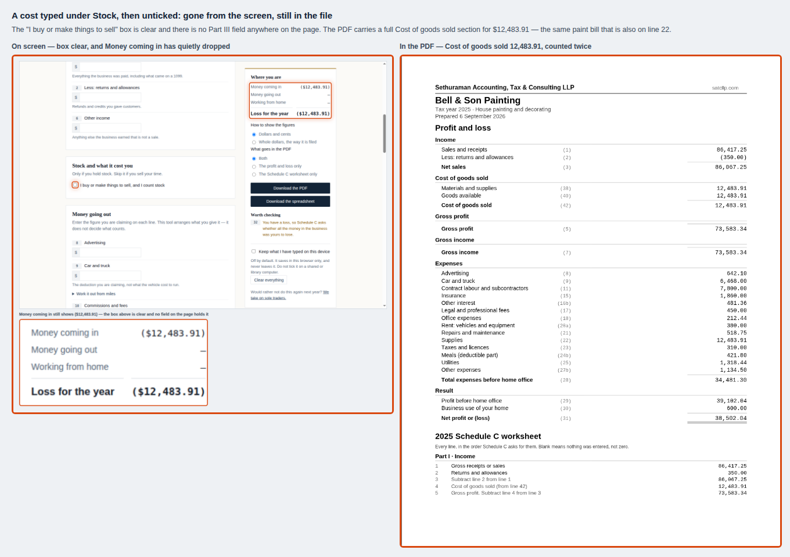
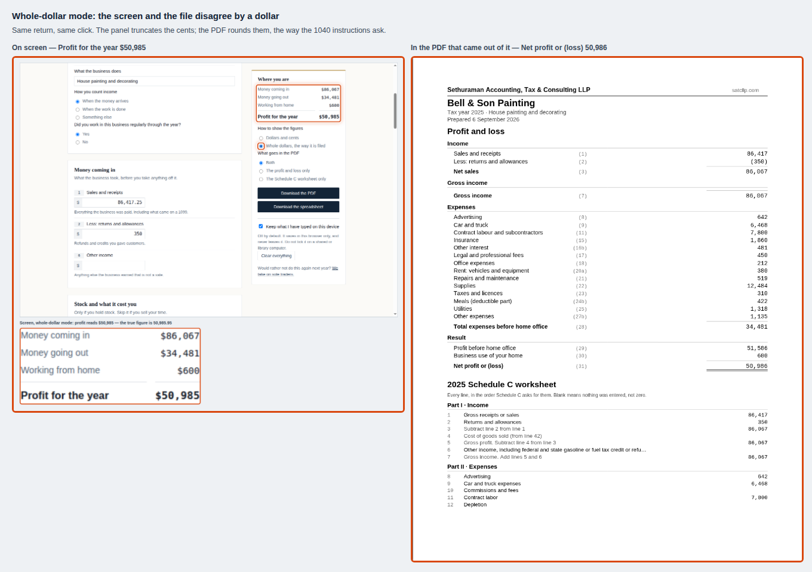
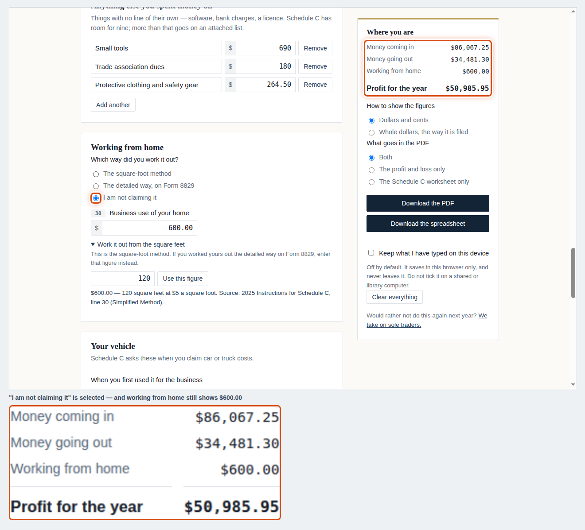
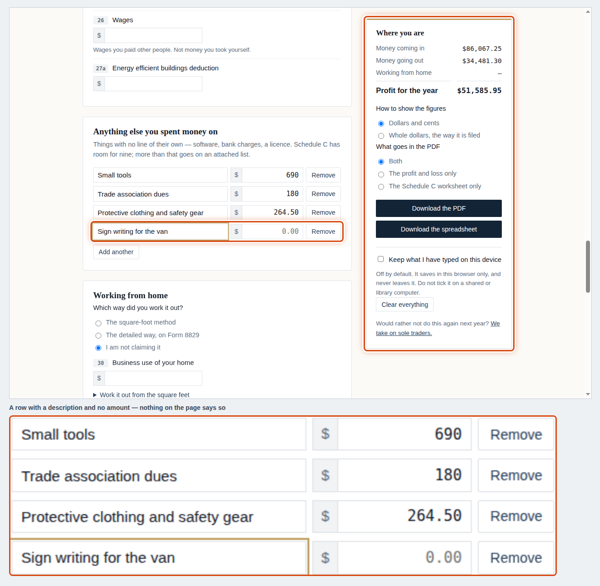
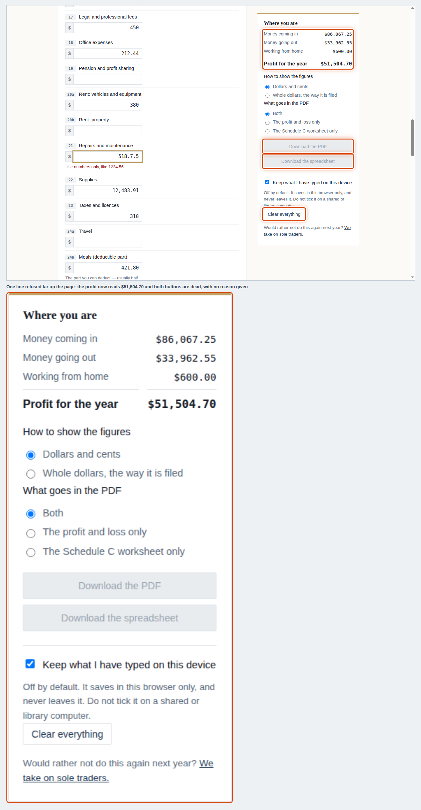

# What a walk found that 178 passing checks did not

One person, one job, one browser: a self-employed house painter sitting down with
a shoebox of 2025 figures to produce a profit and loss statement and a Schedule C
worksheet for a preparer. Chromium, the built page at
`website/tools/schedule-c-profit-and-loss/index.html`, opened from `file://`,
6 September 2026. The route is written up separately in
[`PROCEDURE-schedule-c.md`](PROCEDURE-schedule-c.md) — this file is for whoever
fixes the product.

> **Since this was written — 6 September 2026, 17:08 UTC.** Another session picked
> this register up within the hour and began fixing from it, in commits `80acd97`
> and `da78ca0`. Eight of the fourteen are already fixed on the page as it stands
> on disk; I re-ran the relevant steps against it and the results are in
> **[The second run](#the-second-run-against-the-page-as-it-stands)** at the foot
> of this file. **Nothing above that section has been rewritten.** The figures,
> the screenshots and the denominator are the record of the walk as it was
> walked, against the build of 03:44 that day, and a record edited to match a
> later product is not a record.

## The denominator, run today

| Suite | Command | Result |
|---|---|---|
| Unit, property and artifact tests | `node --test tests/*.test.mjs` | **130 passed, 0 failed, 0 skipped** |
| Scripted browser walk | `npm run walk` | **35 of 35 checks passed** |
| Client-facing copy | `python3 copy.spec.py` | **13 of 13 checks passed** |
| | **Total** | **178 checks, all green** |

**Fourteen defects below. The 178 caught none of them.**

That is not a slight on the suite — it is the point of the exercise. Two of these
are the suite's own blind spots made concrete: `money.test.mjs:83` proves that
`formatCents(…, {dollars:true})` truncates, and `report.mjs` proves the documents
round, and **nothing anywhere joins the two**, which is defect 2. And
`xlsx.test.mjs:137` asserts that the string `"Not answered"` appears in the
spreadsheet — a test that locks in defect 6 rather than catching it.

Ranked by what each would cost the person who used it.

---

## 1 · A cost typed under Stock stays in the file after you untick the box

**Severity: a wrong number in a document a client hands to a bank or a preparer.**

**What I did.** I buy paint, so I ticked *"I buy or make things to sell, and I
count stock"* to see what it asked for. Part III opened; line 38 is called
*"Materials and supplies"*, so I typed my paint bill, **12,483.91**, into it. Then
I decided paint is not stock — it goes on the customer's wall, I do not hold it to
sell — so I unticked the box and put the same figure on line 22 Supplies instead.

**What the screen said.** The box is clear. Part III is gone: there is no
Materials-and-supplies field anywhere on the page, and `#f38` is not in the DOM.
*Worth checking* says nothing.

**What was actually true.** The figure was still in the return. The summary panel
was quietly showing **Money coming in $73,583.34** instead of $86,067.25 — my
gross income reduced by a cost that no longer has a field. The PDF I then
downloaded carries a full **Cost of goods sold** section: *Materials and supplies
(38) 12,483.91 · Cost of goods sold (42) 12,483.91*, gross profit knocked down to
73,583.34, and a net profit of **38,502.04 instead of 50,985.95**. The same paint
bill is counted twice — once in COGS, once on line 22 — and understates the profit
by $12,483.91.

There is exactly one way out and nothing tells you about it: tick the box again,
clear the field by hand, then untick.



**The fix.** Unticking the stock toggle must clear Part III's entries, not just
hide them — or, if the figures are to be kept for a change of mind, they must stay
out of `compute()` while the toggle is off. Same rule for any other block that can
be hidden. `DESIGN-PRINCIPLES.md` already has the sentence this violates: a fact
that is not on the screen is not a fact the engine may use.

---

## 2 · In whole-dollar mode the screen and the file disagree by a dollar

**Severity: the headline figure, wrong, on the tool's main promise of care.**

**What I did.** Picked *"Whole dollars, the way it is filed"* and downloaded the PDF.

**What the screen said.** *Profit for the year* **$50,985**.

**What was actually true.** The PDF says **Net profit or (loss) 50,986** — and the
PDF is right. The true figure is 50,985.95, and the 1040 rule rounds it up.

`src/ui.mjs:384` formats the panel with
`formatCents(cents, { dollars })`, and `money.mjs` says in its own comment that
this **"does NOT round — round first with `roundToDollars` if that is what you
meant."** `report.mjs:29` does exactly that before writing a document. The screen
never does. Every figure whose cents are 50 or more shows a dollar low on screen
and correct in the file.



**The fix.** `src/ui.mjs:384` — round before formatting, the way `report.mjs`
does. One line. Then a test that renders the panel and the document from one
return in whole-dollar mode and asserts the four summary figures match.

---

## 3 · "I am not claiming it" does not stop you claiming it

**Severity: a deduction on a return the filer said they were not taking.**

**What I did.** Under *Working from home*, selected **"I am not claiming it"**
after having already worked $600 out with the square-foot helper.

**What the screen said.** The radio moved. Line 30 stayed on the page with 600.00
in it. The summary still read *Working from home $600.00* and the profit still had
it deducted: **$50,985.95**, unchanged. *Worth checking* said nothing.

**What was actually true.** The choice has no effect on the computation at all —
it appears to govern only which refusal paragraph prints. "I am not claiming it"
is the default, and line 30 and its helper are both live while it is selected, so
a person can work out and claim a home office having never said they were.



**The fix.** Selecting "I am not claiming it" should hide line 30 and drop it from
the computation, and switching away from it should not silently resurrect an old
figure (see defect 1 — the same bug in a different block).

---

## 4 · A listed cost with no amount disappears without a word

**Severity: a cost the person entered is missing from the document they hand over.**

**What I did.** Added a Part V row, typed **"Sign writing for the van"**, and got
distracted before typing the amount — then downloaded.

**What the screen said.** Nothing. No message beside the row, nothing in
*Worth checking*, both download buttons live.

**What was actually true.** The row is dropped entirely. The delivered PDF has a
Part V section and no mention of "Sign writing" anywhere in it. The person listed
a cost, produced a document, and the cost is not in it.



**The fix.** A row with a description and no amount is a half-finished entry, and
the panel already has the place to say so: *Worth checking* — "one listed cost has
no amount". Do not block the download; just say it.

---

## 5 · One typo silently rewrites the profit, and the buttons die without saying why

**Severity: a plausible wrong number on screen, and a dead end with no explanation.**

**What I did.** Fat-fingered line 21 as `518.7.5` — a realistic slip half way down
a long form — then scrolled to the bottom to download.

**What the screen said.** Beside line 21, in red: *"Use numbers only, like
1234.56"*. Correct, and well placed. But at the top of the sticky panel the profit
had changed from **$50,985.95** to **$51,504.70** with nothing marking it as
provisional, and at the bottom both download buttons were greyed out with **no
message anywhere saying why**. *Worth checking* was empty.

**What was actually true.** The refusal is working exactly as designed — the bad
figure is left out rather than guessed at, and the tool will not produce a document
while it stands. Both of those are right. What is missing is that the person is
never told: the number they can see is wrong, and the button they came for is dead.



**The fix.** While any field is refused: put the reason in *Worth checking*
("line 21 cannot be read — the profit below leaves it out"), and put a line under
the greyed buttons saying which line is stopping them.

---

## 6 · Two questions the tool never asks are reported as "Not answered" in every document

**Severity: a preparer chases the client for answers to questions nobody was asked.**

**What I did.** Read the delivered PDF and spreadsheet.

**What they said.** Under *What the form also asks*:
*"How closing stock was valued (line 33) — Not answered"* and
*"Change in how stock was counted or valued (line 34) — Not answered"* — on a
return where I had explicitly said I hold no stock.

**What was actually true.** `report.mjs:144-145` reads `input.inventory.method`
and `input.inventory.changed`. `engine.mjs:30` initialises both to `null` and
**nothing in `ui.mjs` ever writes to them** — there is no control anywhere on the
page for either. Every document the tool has ever produced reports both as "Not
answered", and no code path can make it say anything else. The same section reports
line 32 as "Not answered" whenever there is a profit, when the truthful answer is
that it does not apply.

`xlsx.test.mjs:137` asserts that "Not answered" appears in the spreadsheet, so the
suite holds this in place.

**The fix.** Either ask lines 33 and 34 inside the stock block, or drop both rows
from the documents. And distinguish *not asked / does not apply* from *asked and
skipped* — printing "Does not apply" where the question was never live.

---

## 7 · "Clear everything" destroys an hour's work with no confirmation

**Severity: a year of figures gone, no undo.**

**What I did.** Clicked *Clear everything*.

**What the screen said.** Nothing. No dialog, no "are you sure".

**What was actually true.** The page reloads empty: business name, every figure,
every listed row, every vehicle answer and the saved draft, all gone at once. The
button sits in the sticky panel that follows you down the page, three lines under
*Download the spreadsheet* — so it is on screen, next to the thing you came to
click, the entire time you are typing.

**The fix.** Confirm before wiping, or make it undoable for a few seconds. It is
the one irreversible control on the page and the only one with no guard.

---

## 8 · British spellings in a United States tax product, including inside the delivered PDF

**Severity: the credibility of a CPA's free tool, at first glance.**

**What I did.** Read the screen, then the document it produced.

**What they said.** On screen: *"Contract labour and subcontractors"*,
*"Taxes and licences"*, and in Part III *"Cost of labour"*. In the delivered PDF,
in the refusal text a client reads: *"Adding up **petrol**, repairs and
depreciation…"*.

**What was actually true.** The IRS lines are *Contract labor*, *Taxes and
licenses*, *Cost of labor*, and no American calls it petrol. Worse, **one PDF
contains both spellings**: the profit and loss on page 1 says "Contract labour and
subcontractors" and the Schedule C worksheet on page 2 says "Contract labor",
because the friendly labels were written in British English and the IRS labels
were extracted from the form.

`copy.spec.py` passes 13 of 13 and has no spelling check.

**The fix.** American spelling throughout `src/lines.mjs` and the refusal copy, and
a check in `copy.spec.py` for the handful that will recur — labour, licence,
petrol, cheque, organise, -ise endings generally.

---

## 9 · Five of the 55 IRS labels are printed cut off in the worksheet

**Severity: a worksheet whose selling point is the form's own wording, not quite carrying it.**

**What I did.** Read page 1 and 2 of the delivered PDF.

**What it said.** *"Other income, including federal and state gasoline or fuel tax
credit or refu…"*, *"Total expenses before expenses for business use of home. Add
lines 8 through …"*, *"Inventory at beginning of year. If different from last
year's closing invento…"*.

**What was actually true.** `src/pdf.mjs:151` cuts any label over 78 characters.
Five of the 55 lines are over: **6, 28, 32, 34 and 35**. Line 6's label is 79
characters — cut for one character. The spreadsheet prints all five in full, so the
two documents from one download disagree about what the form says.

This is the sharpest one to hold next to `lines.test.mjs`, which verifies **52 of
55 labels word-for-word against the IRS PDF** and is mutation-tested three ways.
The wording is verified going in and truncated coming out, and no test looks at
the printed line.

**The fix.** Wrap to a second line rather than cutting, or shrink to fit. If a cut
is genuinely necessary, cut at a word.

---

## 10 · The mileage helper warns about the cheap mistake and not the expensive one

**Severity: the commonest and costliest double-count on a sole trader's return.**

**What I did.** Used the mileage helper (9,240 miles → $6,468 on line 9), then put
my van insurance of $1,860 on line 15 and my sprayer servicing on line 21, exactly
as a painter would.

**What the screen said.** The helper warns *"Only if you are using the standard
mileage rate."* *Worth checking* flagged line 13 as needing Form 4562 when I tried
a depreciation figure — a helpful nudge worth a few dollars. It said **nothing**
about the mileage-plus-running-costs overlap.

**What was actually true.** If you take the standard mileage rate, the vehicle's
insurance, fuel, servicing and repairs are already inside it. Claiming them again
on 15 and 21 is the single most expensive error available on this form, and the
tool took all three figures without a word — while it *does* flag Form 4562.

This one sits closest to the tool's deliberate scope: it does not decide what is
deductible (`DECISIONS.md` §2), and that is right. But *Worth checking* is not a
deductibility engine — it is a place the tool already speaks up about things that
look inconsistent, and this is more inconsistent than anything it currently flags.

**The fix.** When line 9 came from the mileage helper and lines 15 or 21 also have
figures, say one sentence in *Worth checking*: "the mileage rate already covers the
van's insurance, fuel and repairs — check you have not counted those twice."

---

## 11 · Three helper boxes, three different units, no visible label on any of them

**Severity: a wrong figure typed into a box that looks like every other box.**

**What I did.** Opened all three helpers.

**What the screen said.** An empty box and a *Use this figure* button. That is all.

**What was actually true.** Line 9's box wants **miles**, line 24b's wants
**dollars**, line 30's wants **square feet**, and the three are visually identical
— no visible label, no placeholder, no unit, and no `$` even on the one that takes
money (the money fields elsewhere all carry a `$`). Each has an `aria-label`, so a
screen-reader user is told what it wants and a sighted user is not.

**The fix.** Show the label. `Business miles`, `Total spent on meals`,
`Square feet used for business` — the text is already written in the `aria-label`.

---

## 12 · The one helper most likely to be misused is the only one with no warning before you type

**Severity: a whole year's lunches claimed at 50%.**

**What I did.** Opened the meals helper.

**What the screen said.** *"Take half of what I spent"*, a box, a button. Lines 9
and 30 each carry a `<p class="hint">` warning before the box; **line 24b has
none**. The caveat — *"Some meals are not half. Drivers under federal
hours-of-service rules deduct 80%…"* — only appears in the output line, after a
figure has been typed.

**What was actually true.** The caveat is about the *percentage*. Nothing anywhere
says which meals qualify at all — and a trades person's ordinary lunch on a local
job does not. "What I spent" invites the whole food bill.

**The fix.** A hint above the box, in the same shape as the other two: *"Only meals
with a business reason — a client, or a night away from home. Ordinary lunches
while working locally are not deductible."*

---

## 13 · "Worth checking" appears as a heading with nothing under it

**Severity: cosmetic, but on the panel that carries the warnings.**

**What I did.** Finished a clean return.

**What the screen said.** *Worth checking*, and then nothing — an empty heading
above the keep-a-draft box. The spreadsheet, from the same state, says
**"Nothing flagged."**

**What was actually true.** The documents have the sentence; the screen does not.
A blank panel where the warnings live reads like something failed to load.

**The fix.** Use the sentence the documents already use.

---

## 14 · One of the suite's own checks cannot go red

**Severity: a check believed to be watching a thing it never watched.**

`tests/walk.mjs`:

```js
const vehicle = await page.locator('#placed').count();
check(vehicle === 1, 'the vehicle questions appear once car costs are claimed');
```

`#placed` is in the DOM from first paint — the Part IV block is rendered `hidden`
and revealed when line 9 has a figure. I measured it on a completely blank page:
`count() === 1`, `isVisible() === false`. **The assertion passes before anything is
typed** and would pass if the block never appeared at all.

Also note the page 3 of every delivered PDF: on my return it carries four lines of
refusal text and nothing else — a near-empty third page in a client-facing
document, which no test looks at because no test looks at the page a figure lands
on.

**The fix.** `isVisible()`, not `count()` — and check it is *not* visible before
line 9 is filled, which is the half that makes it a test.

---

## What this run says about the suite

The 178 checks are good ones. They are also, almost without exception, checks of
**one layer against itself**: the engine against the engine's rules, the PDF
against the engine, the spreadsheet against the engine, the copy against a word
list. Every defect above lives in a seam:

- screen against document (2, 6, 9)
- control against computation (1, 3)
- what the person did against what the product recorded (4, 5)
- what the product warns about against what actually costs money (10, 12)

**The cheapest structural fix is one test that renders the panel and a document
from the same return and asserts they agree, figure for figure, in both rounding
modes.** That single test catches defects 2 and 9, and would have caught 1 and 3
had it been driven through the controls rather than through `compute()`.


---

# The second run, against the page as it stands

The procedure this walk produced is also its own regression check: walk it again
after a change and every step either matches its screenshot or does not. Run
again at **17:12 UTC on 6 September 2026**, against
`website/tools/schedule-c-profit-and-loss/index.html` as the other session had
just left it, through the same browser:

| # | Defect | Now | What the screen does |
|---|---|---|---|
| 1 | Ghost cost of goods sold | **fixed** | Typing 12,483.91 into Part III and unticking the box leaves *Money coming in* at $86,417.25. The value goes with the field. |
| 2 | Whole-dollar screen truncation | **fixed** | 86,407.20 now shows as **$86,407** on screen, the same figure the document rounds to. |
| 3 | "I am not claiming it" ignored | **fixed** | Choosing it clears line 30 *and removes the field*, and the profit goes back up. |
| 4 | Listed cost with no amount | **fixed** | *Worth checking* now says: "48 — One thing you listed has no amount, so it is left out." |
| 5 | Refused figure with no reason | **fixed** | *Worth checking* now says: "21 — Use numbers only, like 1234.56 Until then this line is left out." |
| 7 | "Clear everything" with no guard | **fixed** | A confirmation appears — *"Clear everything you have typed?"* — and dismissing it keeps every figure. |
| 8 | British spellings | **fixed** | No *labour*, *licence* or *petrol* anywhere in the page's text. |

Defects **6, 9, 10, 11, 12, 13 and 14** were not re-checked here: 6 and 9 live in
the delivered documents rather than on a screen, and 10 to 14 were not part of
the same commits. The register above stands for those.

**One thing the second run is not.** It proves the screens changed in the
direction asked for. It does not prove the fixes are complete — that is what the
suite is for, and the same commits added tests to `walk.mjs`, `pdf.test.mjs` and
`xlsx.test.mjs`. What the second run does prove is the thing the first run was
written to make possible: **a person can pick this document up and tell, in five
minutes, whether the product still does what it did.**
